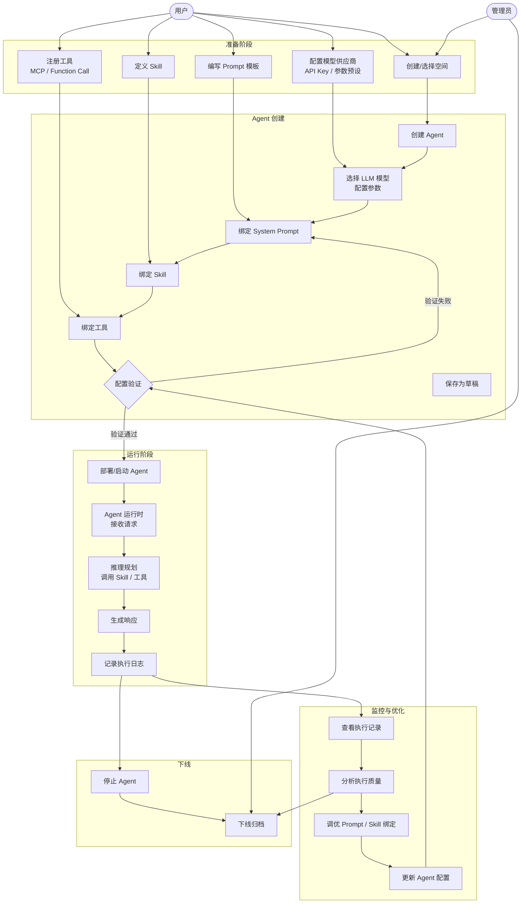
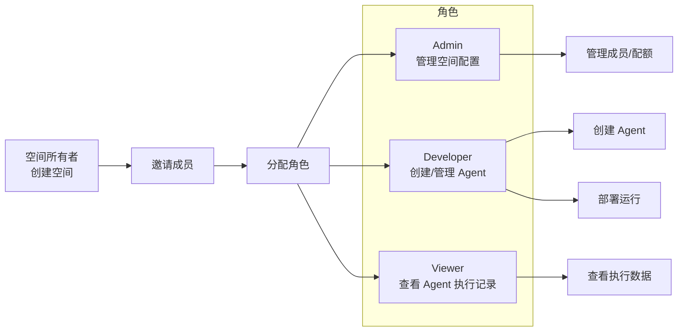
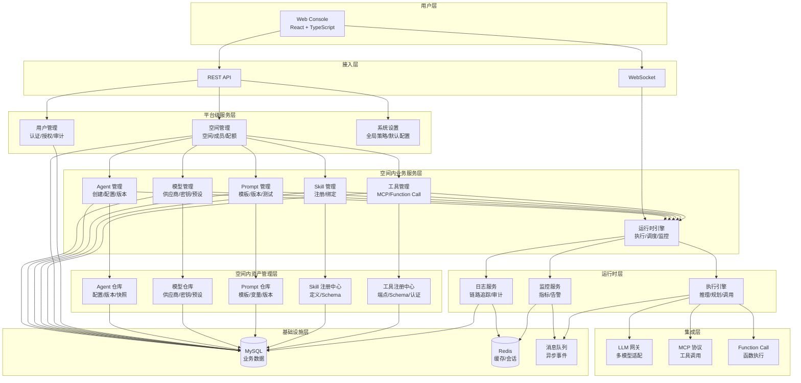

# AgentOps 平台 — 产品方案设计文档

| 文档版本 | 日期 | 编写人 | 说明 |
|---------|------|-------|------|
| V1.0 | 2026-06-06 | AgentOps Team | 初稿，产品架构设计 |
| V1.1 | 2026-06-06 | AgentOps Team | 新增模型管理模块 |
| V1.2 | 2026-06-13 | AgentOps Team | 新增沙箱管理模块（空间内资源），用于管理远程代码沙箱实例 |
| V1.3 | 2026-06-13 | AgentOps Team | 统一全平台 UI 信息架构：登录后默认进入平台 Shell；空间内左侧导航分组为「Agent 与沙箱 / 模型与工具 / 调试与评测」；具体见《UI 信息架构与导航规范》 |

---

## 1. 产品/需求背景

### 1.1 行业背景

随着大语言模型（LLM）的快速发展，AI Agent 正在从单轮对话工具演变为能够自主规划、调用工具、执行多步任务的智能体。企业面临的核心问题不再是「能否接入 LLM」，而是：

- **如何批量管理 Agent**：Agent 数量增长后，缺乏统一的注册、配置、版本管控
- **如何管理 Agent 的能力**：Prompt、Skill、Tool 散落各处，缺乏标准化注册和复用机制
- **如何管理多样化的模型**：团队使用多个 LLM 供应商（OpenAI、Claude、本地模型），缺乏统一的模型配置、密钥管理和健康监控
- **如何安全可控地运行**：Agent 运行时缺乏监控、日志、限流、异常处理
- **如何多团队协作**：不同团队/项目的工作空间需要隔离，权限需要精细管控
- **如何打通生态**：MCP 协议正在成为 Agent 工具的事实标准，需要原生支持

### 1.2 产品定位

AgentOps 是一体化 AI Agent 管理平台，定位为 **「Agent 的操作系统」** —— 统一管理 Agent 从创建、配置、运行到监控的全生命周期，同时管理中心化的 Prompt 资产、Skill 资产、Tool 资产，并通过空间（Workspace）机制实现多团队隔离。

### 1.3 目标用户

- **AI 应用开发者**：需要快速构建和部署 Agent
- **AI 平台运维人员**：需要监控 Agent 运行状态、管理资源配额
- **业务团队**：需要通过 Prompt 和 Skill 配置来调优 Agent 行为
- **平台管理员**：需要管理用户、权限、全局空间

---

## 2. 目标与范围

### 2.1 目标

构建一体化 Agent 管理平台，使企业能够以标准化方式管理 Agent 及其依赖资产（模型、Prompt、Skill、Tool），实现 Agent 的快速创建、安全运行和持续优化。

### 2.2 范围（包含）

| 层级 | 模块 | 说明 |
|------|------|------|
| **平台级** | **空间管理** | 多租户工作空间、成员管理、资源隔离、配额管理 |
| **平台级** | **用户管理** | 认证登录、角色权限、操作审计 |
| **平台级** | **系统设置** | 全局策略、默认配置、密钥管理策略、审计策略 |
| **空间内** | **模型管理** | LLM 模型供应商配置、API Key 管理、模型注册、参数预设、健康检查 |
| **空间内** | **Agent 管理** | Agent 的注册、配置、版本管理、生命周期管理（创建→部署→下线） |
| **空间内** | **Agent 运行时** | Agent 执行引擎、执行记录、日志追踪、状态监控 |
| **空间内** | **Prompt 管理** | Prompt 模板管理、版本管理、变量注入、Prompt 测试 |
| **空间内** | **Skill 管理** | Skill 定义、注册中心、Skill 与 Agent 绑定 |
| **空间内** | **工具管理** | MCP 协议工具接入、Function Call 工具注册、工具市场 |
| **空间内** | **沙箱管理** | 远程代码沙箱实例管理（OpenSandbox / 阿里云沙箱），用于 Agent 安全执行代码 |

### 2.3 不做什么（明确排除项）

- 不提供 LLM 模型训练或微调能力
- 不提供 Agent 之间的自动编排/工作流引擎（未来迭代考虑）
- 不提供 Agent 对外暴露的 API 网关能力（Agent 通过平台 API 调用，不做独立对外暴露）
- 不构建 Agent 市场/应用商店（未来迭代考虑）

---

## 3. 系统线框图

> **统一规范**：自 V1.3 起，全平台 UI 信息架构与导航以《UI 信息架构与导航规范》（`doc/产品方案/2026-06-13_UI信息架构与导航规范.md`）为单一来源。本节保留概览，详细约束见该规范文档。

### 3.1 两层 Shell 概览

平台采用两层 Shell：

- **平台 Shell**（登录默认落地）：顶部 Logo 导航条 + 左侧主导航（空间管理 / 用户管理 / 系统设置）。
- **空间 Shell**（点击空间卡片进入）：顶部 Logo + 当前空间下拉 + 个人信息；左侧按业务模块分组（Agent 与沙箱 / 模型与工具 / 调试与评测）。

```text
┌────────────────────────────────────────────────────────────────────────┐
│ [Logo] AgentOps                                      [👤 当前用户 ▼] │ ← 平台 Shell
├──────────────┬─────────────────────────────────────────────────────────┤
│ 📂 空间管理   │  空间卡片列表（默认落地）                               │
│ 👥 用户管理   │                                                         │
│ ⚙ 系统设置   │                                                         │
└──────────────┴─────────────────────────────────────────────────────────┘
        │（点击空间卡片进入）
        ▼
┌────────────────────────────────────────────────────────────────────────┐
│ [Logo] AgentOps │ 当前空间：家庭客服 ▼          [👤 当前用户 ▼]       │ ← 空间 Shell
├──────────────────┬─────────────────────────────────────────────────────┤
│ 📊 工作台         │                                                     │
│ ━ Agent 与沙箱 ━  │                                                     │
│  🤖 Agent 管理    │                                                     │
│  📦 沙箱管理      │                                                     │
│ ━ 模型与工具 ━    │                                                     │
│  🧠 模型管理      │   内容区域                                          │
│  📝 Prompt 管理  │                                                     │
│  🛠 Skill 管理    │                                                     │
│  🔧 工具管理      │                                                     │
│ ━ 调试与评测 ━    │                                                     │
│  （本期占位）      │                                                     │
│ 👥 空间成员       │                                                     │
└──────────────────┴─────────────────────────────────────────────────────┘
```

### 3.2 主导航结构

| 层级 | 入口 | 路由 | 可见角色 |
|------|------|------|----------|
| **平台 Shell** | 空间管理 | `/platform/spaces` | 全部启用态用户 |
| | 用户管理 | `/platform/users` | 角色含「管理员」 |
| | 系统设置 | `/platform/system-settings` | 角色含「管理员」 |
| **空间 Shell** | 工作台 | `/spaces/{id}/dashboard` | 空间全体成员 |
| | Agent 与沙箱 / Agent 管理 | `/spaces/{id}/agents` | 空间全体成员 |
| | Agent 与沙箱 / 沙箱管理 | `/spaces/{id}/sandboxes` | 空间全体成员 |
| | 模型与工具 / 模型管理 | `/spaces/{id}/models` | 空间全体成员 |
| | 模型与工具 / Prompt 管理 | `/spaces/{id}/prompts` | 空间全体成员 |
| | 模型与工具 / Skill 管理 | `/spaces/{id}/skills` | 空间全体成员 |
| | 模型与工具 / 工具管理 | `/spaces/{id}/tools` | 空间全体成员 |
| | 调试与评测 | （本期占位，子项待后续） | — |
| | 空间成员 | `/spaces/{id}/members` | 仅空间管理员 |

> 「调试与评测」是预留分组，承接后续运行记录（Trace）、Prompt 调试、评测集等模块。
> 退出空间：点击顶部 Logo 回到平台 Shell。切换空间：顶部空间下拉切换 spaceId 而保持空间 Shell。

### 3.3 关键页面简图

**Agent 列表页：**
```
┌─────────────────────────────────────────────────────┐
│ Agent 管理                                    [+ 创建]│
│                                                     │
│ [搜索框___________________] [状态▼] [模型▼]         │
│                                                     │
│ ┌──────┬────────┬──────┬────────┬───────┬────────┐ │
│ │名称  │ 模型   │状态  │ Skill  │更新   │ 操作   │ │
│ ├──────┼────────┼──────┼────────┼───────┼────────┤ │
│ │客服   │ GPT-4  │运行中│客服Skill│2h前  │[运行]  │ │
│ │助手-A │ Claude │已停止│通用Skill│1d前   │[编辑]  │ │
│ │...   │        │      │        │       │        │ │
│ └──────┴────────┴──────┴────────┴───────┴────────┘ │
└─────────────────────────────────────────────────────┘
```

**Agent 创建/编辑页：**
```
┌─────────────────────────────────────────────────────┐
│ 创建 Agent                                [取消] [保存]│
│                                                     │
│ 基本信息                                            │
│ ┌─────────────────────────────────────────────────┐ │
│ │ Agent 名称: [___________________]               │ │
│ │ 模型选择:  [GPT-4o ▼]  温度: [0.7]             │ │
│ │ 所属空间:  [默认空间]                            │ │
│ └─────────────────────────────────────────────────┘ │
│                                                     │
│ Prompt 配置                                         │
│ ┌─────────────────────────────────────────────────┐ │
│ │ System Prompt: [_______________________________] │ │
│ │               [选择 Prompt 模板 ▼]               │ │
│ └─────────────────────────────────────────────────┘ │
│                                                     │
│ 绑定 Skill                     绑定工具             │
│ ┌─────────────────┐   ┌──────────────────────────┐ │
│ │ ☑ 客服Skill      │   │ ☑ 查询订单 (MCP)         │ │
│ │ ☐ 数据分析Skill   │   │ ☑ 发送消息 (Function)    │ │
│ │ [+ 添加 Skill]   │   │ ☐ 查询天气 (MCP)          │ │
│ └─────────────────┘   │ [+ 添加工具]              │ │
│                       └──────────────────────────┘ │
└─────────────────────────────────────────────────────┘
```

---

## 4. 业务流程图

### 4.1 核心业务流：Agent 全生命周期



### 4.2 空间与权限流



---

## 5. 用例图

```mermaid
usecaseDiagram
    actor Admin as "平台管理员<br>(Platform Admin)"
    actor SpaceAdmin as "空间管理员<br>(Space Admin)"
    actor Developer as "开发者<br>(Developer)"
    actor Viewer as "查看者<br>(Viewer)"

    rectangle Platform {
        usecase UC1 as "管理用户"
        usecase UC2 as "管理角色权限"
        usecase UC3 as "管理全局配置"
        usecase UC4 as "查看所有空间"
    }

    rectangle Space {
        usecase UC5 as "管理空间<br>(创建/编辑/删除)"
        usecase UC6 as "管理空间成员"
        usecase UC7 as "配置空间配额"
        usecase UC8 as "查看空间审计日志"
    }

    rectangle Agent {
        usecase UC9 as "创建/编辑 Agent"
        usecase UC10 as "绑定 Prompt"
        usecase UC11 as "绑定 Skill"
        usecase UC12 as "绑定工具"
        usecase UC13 as "部署/停止 Agent"
        usecase UC14 as "查看执行记录"
        usecase UC15 as "查看执行详情"
        usecase UC16 as "实时监控"
    }

    rectangle Assets {
        usecase UC17 as "管理 Prompt 模板"
        usecase UC18 as "管理 Skill"
        usecase UC19 as "注册工具<br>(MCP/Function)"
        usecase UC20 as "测试 Prompt"
        usecase UC21 as "管理模型<br>供应商/配置"
        usecase UC22 as "管理模型<br>参数预设"
        usecase UC23 as "查看模型<br>健康状态"
    }

    Admin --> UC1 : includes
    Admin --> UC2
    Admin --> UC3
    Admin --> UC4
    Admin --> UC5

    SpaceAdmin --> UC5
    SpaceAdmin --> UC6
    SpaceAdmin --> UC7
    SpaceAdmin --> UC8
    SpaceAdmin --> UC9
    SpaceAdmin --> UC17
    SpaceAdmin --> UC18
    SpaceAdmin --> UC19
    SpaceAdmin --> UC21

    Developer --> UC9
    Developer --> UC10 : extends
    Developer --> UC11
    Developer --> UC12
    Developer --> UC13
    Developer --> UC14
    Developer --> UC15
    Developer --> UC17
    Developer --> UC18
    Developer --> UC19
    Developer --> UC20
    Developer --> UC22
    Developer --> UC23

    Viewer --> UC14
    Viewer --> UC16
    Viewer --> UC23
```

### 角色定义

| 角色 | 权限范围 | 典型职责 |
|------|---------|---------|
| **平台管理员** | 全局 | 管理用户、角色、全局配置、查看所有空间 |
| **空间管理员** | 所属空间 | 管理空间配置、成员、配额、空间内所有 Agent 和资产 |
| **开发者** | 所属空间 | 创建/配置/部署 Agent，管理 Model/Prompt/Skill/Tool 资产 |
| **查看者** | 所属空间 | 查看 Agent 运行状态、执行日志、监控数据 |

---

## 6. 用户与场景

| 用户角色 | 典型场景 | 核心需求 |
|---------|---------|---------|
| **AI 开发者** 小明 | 需要为一个客服场景快速创建一个 Agent | 能选择模型、配置 Prompt、绑定客服 Skill 和订单查询工具，一小时内上线 |
| **AI 开发者** 小红 | Agent 上线后某次执行异常，需要排查 | 能查看完整执行链路（输入→推理→工具调用→输出），定位问题 |
| **AI 开发者** 小赵 | 需要配置新的 LLM 模型 | 添加供应商、配置 API Key、测试模型连通性，在 Agent 中选用 |
| **平台运维** 老王 | 团队有 5 个 Agent 在运行，需要统一监控 | Dashboard 概览，异常告警，执行质量统计，模型健康度看板 |
| **业务运营** 张姐 | 需要调整 Agent 的回复风格 | 修改 Prompt 模板，A/B 测试后部署新版本 |
| **平台管理员** 李总 | 新来了 3 个同事需要加入平台 | 创建空间、邀请成员、分配角色权限 |
| **外部集成方** | 希望将自己的工具接入平台供 Agent 使用 | 通过 MCP 协议注册工具端点，定义工具 Schema |

---

## 7. 产品架构图（核心）



### 产品架构说明

**架构分为 7 层，自顶向下：**

| 层级 | 职责 | 关键设计点 |
|------|------|-----------|
| **用户层** | 提供 Web Console 交互界面 | 单页应用，按领域分包，国际化支持 |
| **接入层** | 统一 API 入口 | RESTful API + WebSocket 实时推送，全局认证鉴权 |
| **平台级服务层** | 平台级业务能力 | 仅包含空间管理、用户管理、系统设置；不直接管理空间内业务资源 |
| **空间内业务服务层** | 空间内业务逻辑编排 | 模型、Agent、运行时、Prompt、Skill、工具均归属于某个空间 |
| **空间内资产管理层** | 结构化资产存储 | 空间内模型配置、Agent 配置、Prompt 模板、Skill 定义、工具注册等均为「一等公民」资产，有独立仓库和版本管理 |
| **运行时层** | Agent 执行引擎 | 执行推理→规划→工具调用→输出的全链路，完整的日志和监控 |
| **集成层** | 外部系统适配 | LLM 多模型适配器、MCP 协议客户端、Function Call 执行器 |
| **基础设施层** | 数据存储与通信 | MySQL 持久化、Redis 缓存、消息队列解耦 |

### 核心设计理念

1. **模型驱动**：模型是 Agent 的「大脑」，平台提供统一的模型供应商管理、密钥托管、参数预设和健康监控，Agent 通过引用模型配置来获得推理能力。
2. **资产驱动**：Agent 本身是「轻量配置」，真正的能力来自它绑定的模型 + Prompt + Skill + Tool。这四大资产可独立管理、复用、版本化。
3. **空间隔离**：模型、Agent、Prompt、Skill、Tool、运行时执行记录均属于某个空间，空间之间天然隔离；平台级仅保留空间管理、用户管理、系统设置。
3. **运行时可观测**：每一次 Agent 执行都是完整的 Trace，从输入到每一步推理再到工具调用和最终输出，完整可回溯。
4. **协议中立**：工具层同时支持 MCP 协议和 Function Call，允许渐进式迁移。

---

## 8. 功能需求

### 8.1 平台级：空间管理（P0 - MVP）

| 功能 | 优先级 | 说明 |
|------|--------|------|
| 空间 CRUD | P0 | 创建、编辑、删除工作空间 |
| 空间成员管理 | P0 | 邀请/移除成员，支持通过用户名或邮箱 |
| 角色分配 | P0 | Admin / Developer / Viewer 三种角色 |
| 空间配额 | P1 | 限制空间内 Agent 数量、执行次数、并发数 |
| 空间审计日志 | P1 | 记录空间内所有关键操作 |

### 8.2 平台级：用户管理（P0 - MVP）

| 功能 | 优先级 | 说明 |
|------|--------|------|
| 用户注册/登录 | P0 | 邮箱/密码 + JWT Token |
| 用户详情 | P0 | 基本信息、所属空间、角色 |
| 角色权限管理 | P0 | RBAC 模型，管理端配置 |
| 操作审计 | P1 | 关键操作日志（谁在什么时间做了什么）|

### 8.3 空间内：模型管理（P0 - MVP）

| 功能 | 优先级 | 说明 |
|------|--------|------|
| 模型供应商管理 | P0 | 配置供应商（OpenAI、Anthropic、Azure、Ollama 等），管理多个供应商实例 |
| API Key 管理 | P0 | 模型 API Key 的添加、编辑、删除，加密存储，支持多 Key 轮转 |
| 模型参数预设 | P0 | 预设 temperature、max_tokens、top_p 等参数组合，命名复用 |
| 模型健康检查 | P0 | 定期检测模型端点的连通性和响应时间 |
| 模型市场/模型列表 | P0 | 展示当前空间可用的所有模型，支持搜索和筛选 |
| 模型与空间绑定 | P1 | 控制哪些模型可在特定空间中使用 |
| 模型用量统计 | P1 | 按模型/供应商统计调用次数、Token 消耗、延迟趋势 |

### 8.4 空间内：Agent 管理（P0 - MVP）

| 功能 | 优先级 | 说明 |
|------|--------|------|
| Agent CRUD | P0 | 创建、编辑、删除 Agent |
| Agent 配置 | P0 | 选择模型（引用模型配置）、配置参数、System Prompt |
| Skill 绑定 | P0 | 选择已有 Skill 绑定到 Agent |
| 工具绑定 | P0 | 选择已有工具绑定到 Agent |
| Agent 版本管理 | P1 | 配置变更时自动生成版本快照 |
| Agent 标签 | P1 | 自定义标签实现分类 |

### 8.5 空间内：Agent 运行时（P0 - MVP）

| 功能 | 优先级 | 说明 |
|------|--------|------|
| 单次执行 | P0 | 向 Agent 发送消息，获取完整响应 |
| 执行记录 | P0 | 所有执行历史，支持搜索和筛选 |
| 执行详情 Trace | P0 | 完整链路展示：输入→思考→工具调用→输出 |
| 流式输出 | P1 | WebSocket 实时流式响应 |
| 并发控制 | P1 | 空间级别并发限制 |
| 执行超时控制 | P1 | 可配置的超时策略 |

### 8.6 空间内：Prompt 管理（P0 - MVP）

| 功能 | 优先级 | 说明 |
|------|--------|------|
| Prompt 模板 CRUD | P0 | 创建、编辑、删除 Prompt 模板 |
| 变量定义 | P0 | 模板变量 {{variable}} 定义和描述 |
| 版本管理 | P1 | 编辑生成新版本，支持版本回滚 |
| Prompt 测试 | P0 | 在线测试 Prompt，预览渲染效果 |
| 分类与标签 | P1 | Prompt 分类管理 |

### 8.7 空间内：Skill 管理（P0 - MVP）

| 功能 | 优先级 | 说明 |
|------|--------|------|
| Skill CRUD | P0 | 创建、编辑、删除 Skill |
| Skill Definition | P0 | 定义 Skill 的名称、描述、输入/输出 Schema |
| Skill 版本 | P1 | Skill 定义变更版本管理 |
| Skill 与 Agent 绑定关系 | P0 | 查看哪些 Agent 使用了某个 Skill |

### 8.8 空间内：工具管理（P0 - MVP）

| 功能 | 优先级 | 说明 |
|------|--------|------|
| 工具注册 | P0 | 通过 MCP 协议端点或 Function Call Schema 注册 |
| 工具列表 | P0 | 所有已注册工具，支持搜索和筛选 |
| 工具测试 | P0 | 在线测试工具调用，查看返回结果 |
| MCP 协议支持 | P0 | 支持 MCP 标准的工具发现和调用 |
| Function Call 支持 | P0 | 支持标准的 OpenAI/Azure Function Call 格式 |
| 工具认证配置 | P1 | API Key、OAuth 等认证方式 |

### 8.9 空间内：沙箱管理（P0 - MVP）

| 功能 | 优先级 | 说明 |
|------|--------|------|
| 沙箱 CRUD | P0 | 新建、编辑、删除沙箱实例（草稿态可删，伪删除） |
| 沙箱字段 | P0 | 业务编码、名称、类型（代码沙箱）、CPU、内存、存活时间、备注、环境变量、状态 |
| 右抽屉编辑 | P0 | 沙箱的查看、编辑统一通过右抽屉进行；不使用整页跳转 |
| 沙箱提交与初始化 | P0 | 草稿沙箱提交后，系统调用配置的沙箱接入地址检查是否启动成功；启动成功 → 在线，超时 → 离线 |
| 在线状态探活 | P0 | 平台后台按可配间隔（系统设置）对所有非草稿/非禁用沙箱定时探活并更新状态 |
| 人工禁用/启用 | P0 | 用户可手动将非草稿沙箱禁用；禁用态可重新启用并重走初始化探活 |
| 沙箱接入地址配置 | P0 | OpenSandbox / 阿里云沙箱的全局接入地址在系统设置中统一配置；沙箱实例可选填覆盖 |
| 环境变量维护 | P0 | 沙箱可配置多组环境变量（key、value、备注）；下发至远程沙箱实例 |
| 沙箱与 Agent 绑定 | P1 | Agent 可引用启用且在线的沙箱用于执行代码（具体由 Agent 模块承接） |

### 8.10 空间内：总览 Dashboard（P1）

| 功能 | 优先级 | 说明 |
|------|--------|------|
| 全局统计 | P1 | Agent 数量、执行次数、成功率 |
| 执行趋势 | P1 | 按时间维度的执行量趋势图 |
| 最近执行 | P1 | 最近执行记录列表 |
| 异常概览 | P1 | 失败执行的统计和排行 |

---

## 9. 非功能需求

| 类别 | 要求 |
|------|------|
| **性能** | Agent 执行请求的 P99 延迟 ≤ 原始 LLM 调用延迟 + 500ms（平台侧开销） |
| **性能** | API 响应时间 P99 ≤ 200ms（非 LLM 调用场景） |
| **并发** | 单空间支持 50 个 Agent 同时运行 |
| **可用性** | 平台核心功能 99.9% 可用（不含 LLM 服务本身） |
| **安全** | JWT Token 认证，API 请求需携带有效 Token |
| **安全** | RBAC 权限模型，所有 API 鉴权 |
| **安全** | 敏感配置（API Key）加密存储 |
| **数据** | 执行日志保留 30 天，支持归档 |
| **可观测** | 全链路 Trace ID 串联请求→执行→工具调用 |
| **国际化** | 前端支持中/英双语，后端错误消息国际化 |
| **兼容性** | 支持 Chrome/Firefox/Edge 最新两个大版本 |

---

## 10. 验收标准

| 检查项 | 说明 |
|--------|------|
| 空间管理 | 可创建空间、邀请成员、分配角色、资源隔离生效 |
| 用户管理 | 注册登录流程完整，角色权限正确拦截越权操作 |
| 模型管理 | 支持至少 2 个模型供应商配置，密钥加密存储，健康检查可检测连通性 |
| Agent 创建 | 填写配置后成功创建，选择模型、绑定 Prompt/Skill/Tool 后部署运行 |
| Agent 执行 | 发送消息后返回正确响应，执行链路完整可追溯 |
| Prompt 管理 | 模板创建/编辑/测试流程完整，变量渲染正确 |
| Tool 集成 | MCP 工具和 Function Call 工具均能注册并调用成功 |
| 端到端 | 创建空间→配置模型→邀请成员→创建 Agent→绑定模型/资产→运行→查看日志，整条链路走通 |

---

## 11. 附录：名词解释

| 术语 | 说明 |
|------|------|
| **Agent** | AI 智能体，基于 LLM 模型、绑定 Prompt/Skill/工具的可运行实体 |
| **模型 (Model)** | LLM 模型的配置抽象，包含供应商、端点、API Key、参数预设等信息，Agent 通过引用模型配置获取推理能力 |
| **模型供应商 (Provider)** | LLM 服务的提供方，如 OpenAI、Anthropic、Azure OpenAI、本地 Ollama 等 |
| **参数预设 (Preset)** | 模型运行参数的命名组合，如 temperature、max_tokens、top_p 等，可在 Agent 配置中快速选用 |
| **Prompt** | 提示词模板，包含 System Prompt 和变量定义 |
| **Skill** | 能力单元，定义 Agent 可以做什么（如客服、翻译、数据分析） |
| **MCP** | Model Context Protocol，模型上下文协议，标准化工具调用协议 |
| **Function Call** | 函数调用，OpenAI 提出的工具调用标准格式 |
| **空间 (Space)** | 工作空间，资源隔离和权限管理的基本单元 |
| **Trace** | 执行链路追踪，记录 Agent 从输入到输出的完整调用链 |