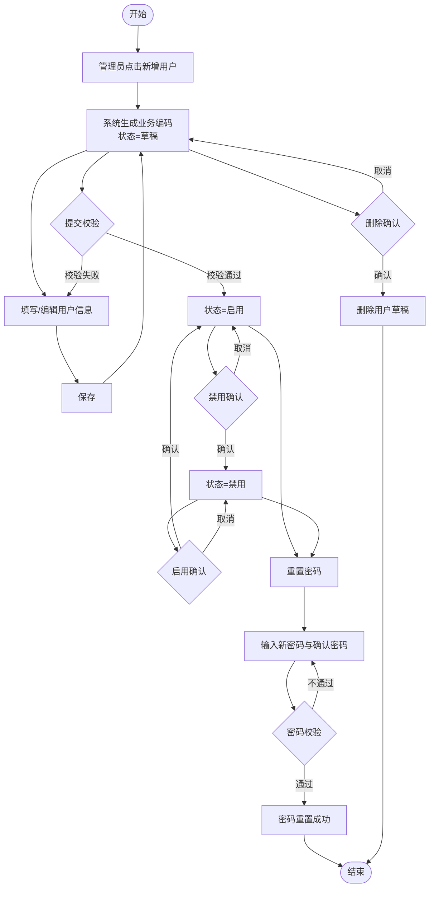
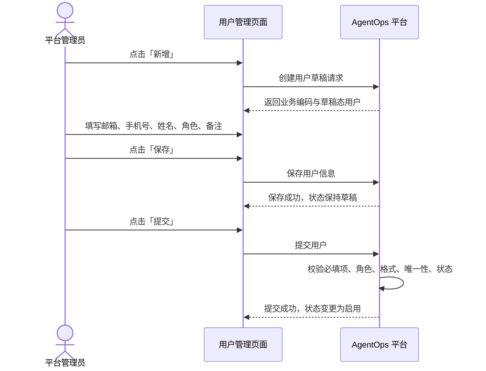
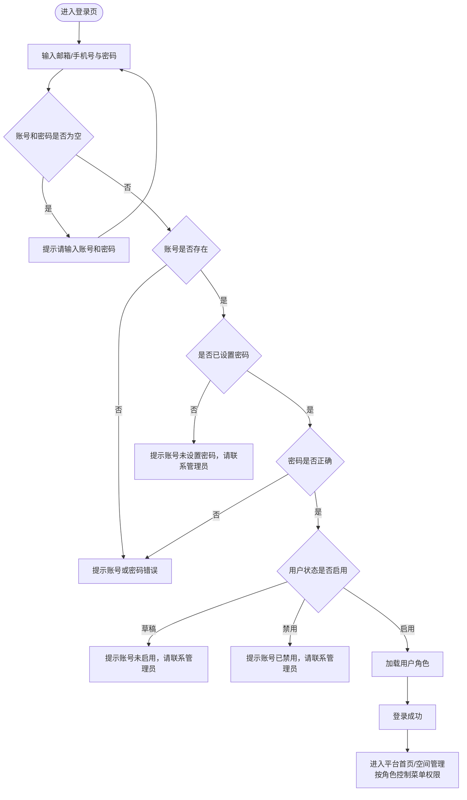
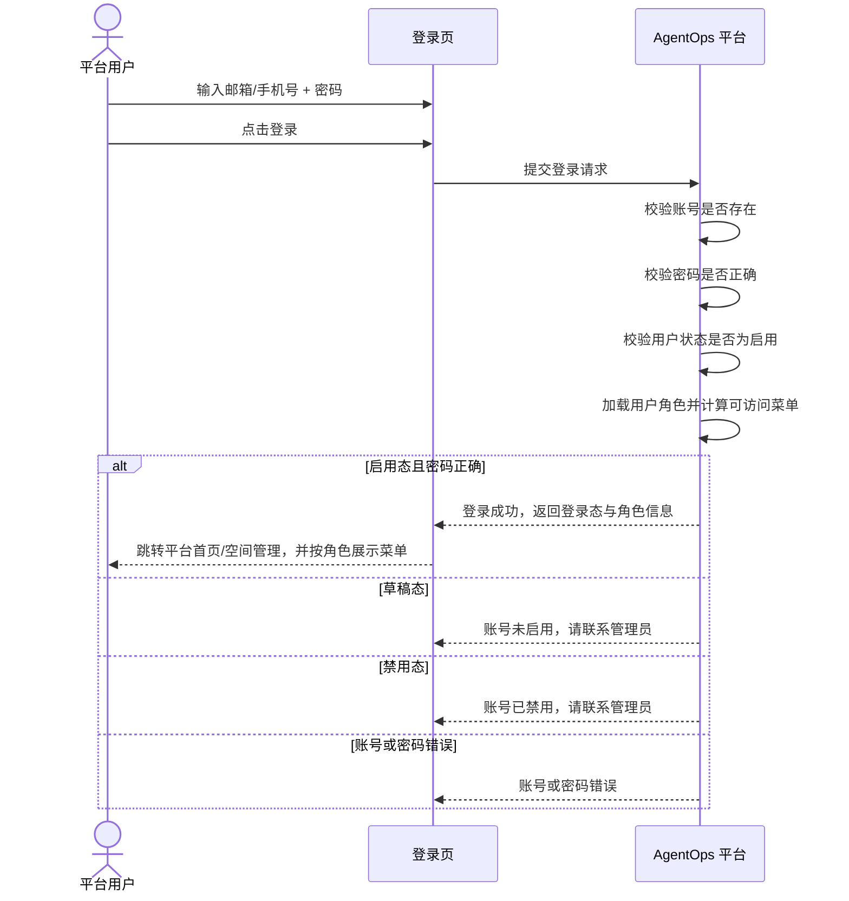

# AgentOps 平台 — 用户管理 PRD

| 文档版本 | 日期 | 编写人 | 说明 |
|---------|------|-------|------|
| V1.0 | 2026-06-06 | AgentOps Team | 用户管理模块 PRD 初稿 |
| V1.1 | 2026-06-06 | AgentOps Team | 补充用户登录设计 |
| V1.2 | 2026-06-06 | AgentOps Team | 新增用户角色字段与内置角色权限 |
| V1.3 | 2026-06-13 | AgentOps Team | 对齐《UI 信息架构与导航规范》：用户管理位于平台 Shell 左侧主导航，仅管理员可见 |

---

## 1. 产品/需求背景

AgentOps 平台采用「平台级能力 + 空间内资源」的信息架构。其中，**用户管理**属于平台级功能，与空间管理、系统设置平级，用于统一维护平台用户基础信息、用户状态和账号安全操作。

用户是访问 AgentOps 平台的基础主体。空间成员、角色权限、Agent 资产归属等后续能力都依赖稳定、可追踪、可治理的用户数据。因此，需要建设一套平台级用户管理能力，支持用户登录，以及管理员对用户进行新增、保存、提交、启用、禁用、删除和重置密码等操作。

本 PRD 聚焦 **用户登录、用户基础资料管理、内置角色权限与状态流转**，作为后续空间成员管理等模块的基础。

---

## 2. 目标与范围

### 2.1 目标

构建平台级用户管理能力，使平台管理员能够规范创建、维护和管控用户账号，确保用户信息完整、状态可控。

### 2.2 范围

| 范围 | 是否包含 | 说明 |
|------|----------|------|
| 用户新增 | 包含 | 新建用户草稿，生成用户业务编码 |
| 用户保存 | 包含 | 保存用户基础信息，可反复修改草稿态用户 |
| 用户提交 | 包含 | 草稿态用户提交后进入启用态 |
| 用户删除 | 包含 | 仅草稿态可删除 |
| 用户启用 | 包含 | 仅禁用态可启用 |
| 用户禁用 | 包含 | 仅启用态可禁用 |
| 重置密码 | 包含 | 管理员输入用户最新密码后完成重置 |
| 用户列表/详情 | 包含 | 查询、筛选、查看用户信息 |
| 用户登录 | 包含 | 支持邮箱或手机号 + 密码登录，并校验用户状态 |
| 登录状态校验 | 包含 | 仅启用态用户可登录；草稿态、禁用态不可登录 |
| 内置角色管理 | 包含 | 用户包含角色字段，内置管理员、普通用户两个角色 |
| 平台功能权限控制 | 包含 | 管理员可使用系统设置和用户管理；普通用户不可使用系统设置和用户管理 |
| 空间成员管理 | 不包含 | 空间成员邀请和空间角色分配由空间管理模块承接 |
| 批量导入导出 | 不包含 | 后续迭代考虑 |

### 2.3 用户信息字段

| 字段 | 必填 | 规则 | 示例 |
|------|------|------|------|
| 业务编码 | 是 | 系统生成，不允许手工编辑。格式：`US` + `yyyyMMddHHmmssSSS` + 四位随机数 | `US202606061426301234567` |
| 邮箱 | 是 | 合法邮箱格式；建议全平台唯一 | `user@example.com` |
| 手机号 | 否 | 合法手机号格式；建议全平台唯一 | `13800000000` |
| 姓名 | 是 | 用户真实姓名或展示名称 | `张三` |
| 角色 | 是 | 字符串列表；可选值：管理员、普通用户；至少选择一个角色 | `["管理员"]` |
| 状态 | 是 | 枚举：草稿、启用、禁用 | `草稿` |
| 备注 | 否 | 200 字以内 | `平台管理员账号` |

### 2.4 内置角色定义

用户角色字段为字符串列表，表示用户具备的系统角色集合。系统内置两个角色：管理员、普通用户。

| 角色 | 权限说明 | 可访问平台级功能 |
|------|----------|------------------|
| 管理员 | 平台管理角色，可进行平台级用户治理和系统配置 | 用户管理、系统设置、空间管理 |
| 普通用户 | 普通平台使用者，不允许进行平台级用户治理和系统配置 | 空间管理中有权限的空间及空间内资源 |

> 注：角色字段为列表结构，支持未来扩展更多角色；本期仅内置并开放「管理员」「普通用户」两个角色。若用户同时拥有多个角色，权限按并集计算。

### 2.5 登录凭证说明

登录密码属于账号凭证，不作为用户基础信息字段在用户列表或详情中展示。平台通过「重置密码」能力为用户设置或更新登录密码。新用户提交启用后，管理员应通过「重置密码」为用户设置初始登录密码；若启用态用户尚未设置密码，则不能完成密码登录，并提示联系管理员处理。

### 2.6 状态定义

| 状态 | 说明 | 允许操作 |
|------|------|----------|
| 草稿 | 用户已创建但尚未正式启用，可继续编辑或删除，不允许登录 | 保存、提交、删除 |
| 启用 | 用户已正式生效，可作为有效平台用户，允许登录 | 登录、禁用、重置密码 |
| 禁用 | 用户被停用，不允许登录 | 启用、重置密码 |

---

## 3. 系统线框图

### 3.1 平台级信息架构

```text
┌─────────────────────────────────────────────────────────────┐
│                     AgentOps Platform                        │
├──────────────┬──────────────────────────────────────────────┤
│ 主导航        │ 内容区域                                      │
│              │                                              │
│ 📂 空间管理    │                                              │
│              │                                              │
│ 👥 用户管理    │  用户管理                                    │
│   ├ 用户列表   │  ┌──────────────────────────────────────┐    │
│   └ 用户详情   │  │ 搜索/筛选区                            │    │
│              │  │ [姓名/邮箱/手机号/编码] [角色▼] [状态▼] [查询] │ │
│ ⚙ 系统设置    │  └──────────────────────────────────────┘    │
│              │  ┌──────────────────────────────────────┐    │
│              │  │ 用户列表                              │    │
│              │  │ 编码 | 姓名 | 角色 | 邮箱 | 手机号 | 状态 | 操作 │ │
│              │  └──────────────────────────────────────┘    │
└──────────────┴──────────────────────────────────────────────┘
```

### 3.2 用户管理页面结构

```text
用户管理
├── 登录页
│   ├── 登录账号：邮箱或手机号
│   ├── 登录密码
│   └── 操作按钮：登录
│
├── 用户列表页
│   ├── 查询区：关键词、角色、状态
│   ├── 操作区：新增
│   └── 列表区：业务编码、姓名、角色、邮箱、手机号、状态、备注、更新时间、操作
│
├── 用户新增/编辑页
│   ├── 基础信息：业务编码、邮箱、手机号、姓名、角色、状态、备注
│   └── 操作按钮：保存、提交、删除、返回
│
└── 重置密码弹窗
    ├── 用户信息摘要：业务编码、姓名、邮箱
    ├── 新密码输入框
    ├── 确认密码输入框
    └── 操作按钮：取消、确认重置
```

---

## 4. 业务流程图

### 4.1 用户状态流转流程



### 4.2 用户新增与提交流程



### 4.3 用户登录流程





---

## 5. 用例图

```mermaid
usecaseDiagram
    actor AdminRole as "管理员角色用户"
    actor NormalRole as "普通用户角色用户"

    rectangle "登录与权限" {
        usecase UC0 as "登录平台"
        usecase UC11 as "访问空间管理"
        usecase UC12 as "访问用户管理"
        usecase UC13 as "访问系统设置"
    }

    rectangle "用户管理" {
        usecase UC1 as "查看用户列表"
        usecase UC2 as "查看用户详情"
        usecase UC3 as "新增用户"
        usecase UC4 as "保存用户"
        usecase UC5 as "提交用户"
        usecase UC6 as "删除用户"
        usecase UC7 as "启用用户"
        usecase UC8 as "禁用用户"
        usecase UC9 as "重置密码"
    }

    AdminRole --> UC0
    AdminRole --> UC11
    AdminRole --> UC12
    AdminRole --> UC13
    AdminRole --> UC1
    AdminRole --> UC2
    AdminRole --> UC3
    AdminRole --> UC4
    AdminRole --> UC5
    AdminRole --> UC6
    AdminRole --> UC7
    AdminRole --> UC8
    AdminRole --> UC9

    NormalRole --> UC0
    NormalRole --> UC11

    UC0 ..> UC11 : include 角色加载
    UC12 ..> UC1 : include
    UC13 ..> UC0 : require 管理员角色
    UC5 ..> UC4 : include
    UC6 ..> UC2 : extend
    UC7 ..> UC2 : extend
    UC8 ..> UC2 : extend
    UC9 ..> UC2 : extend
```

### 5.1 用例说明

| 用例 | 角色 | 前置条件 | 结果 |
|------|------|----------|------|
| 登录平台 | 管理员角色用户/普通用户角色用户 | 用户存在、已设置密码、密码正确、状态为启用 | 登录成功并进入平台首页/空间管理，加载角色权限 |
| 访问用户管理 | 管理员角色用户 | 已登录且拥有管理员角色 | 可进入用户管理功能 |
| 访问系统设置 | 管理员角色用户 | 已登录且拥有管理员角色 | 可进入系统设置功能 |
| 访问空间管理 | 管理员角色用户/普通用户角色用户 | 已登录且空间权限满足要求 | 可进入空间管理及有权限的空间内资源 |
| 查看用户列表 | 管理员角色用户 | 已登录且拥有管理员角色 | 展示用户列表 |
| 新增用户 | 管理员角色用户 | 已登录且拥有管理员角色 | 生成草稿态用户 |
| 保存用户 | 管理员角色用户 | 已登录且拥有管理员角色，用户处于草稿态或允许编辑范围内 | 用户信息保存成功 |
| 提交用户 | 管理员角色用户 | 已登录且拥有管理员角色，用户处于草稿态且必填信息完整 | 用户状态变为启用 |
| 删除用户 | 管理员角色用户 | 已登录且拥有管理员角色，用户处于草稿态 | 用户被删除 |
| 启用用户 | 管理员角色用户 | 已登录且拥有管理员角色，用户处于禁用态 | 用户状态变为启用 |
| 禁用用户 | 管理员角色用户 | 已登录且拥有管理员角色，用户处于启用态 | 用户状态变为禁用 |
| 重置密码 | 管理员角色用户 | 已登录且拥有管理员角色，用户存在且未删除 | 用户密码被重置 |

---

## 6. 用户与场景

| 用户角色 | 场景 | 用户故事 |
|----------|------|----------|
| 平台用户 | 访问平台 | 作为平台用户，我希望使用邮箱或手机号和密码登录平台，并按我的角色看到可用功能 |
| 平台用户 | 账号不可用 | 作为平台用户，当账号处于草稿或禁用状态时，我希望看到明确提示，知道需要联系管理员处理 |
| 管理员角色用户 | 平台管理 | 作为管理员，我希望可以进入用户管理和系统设置功能，完成平台级治理 |
| 普通用户角色用户 | 普通使用 | 作为普通用户，我希望可以使用空间管理中有权限的空间和空间内资源，但不能进入用户管理和系统设置 |
| 平台管理员 | 新员工加入平台 | 作为平台管理员，我希望新增用户并填写邮箱、手机号、姓名、角色，使新员工可以成为平台用户 |
| 平台管理员 | 用户信息暂不完整 | 作为平台管理员，我希望先保存草稿，待信息补齐后再提交启用 |
| 平台管理员 | 误创建用户 | 作为平台管理员，我希望删除草稿态用户，避免无效数据进入正式用户列表 |
| 平台管理员 | 员工离职或暂停使用 | 作为平台管理员，我希望禁用启用态用户，停止其平台访问能力 |
| 平台管理员 | 用户恢复使用 | 作为平台管理员，我希望启用禁用态用户，使其恢复使用平台 |
| 平台管理员 | 用户忘记密码 | 作为平台管理员，我希望为用户设置最新密码，帮助用户恢复登录 |

---

## 7. 功能需求

### 7.1 用户登录

| 功能点 | 优先级 | 说明 |
|--------|--------|------|
| 登录入口 | P0 | 未登录用户访问平台时进入登录页 |
| 登录账号 | P0 | 支持输入邮箱或手机号作为登录账号 |
| 登录密码 | P0 | 输入密码后发起登录校验 |
| 必填校验 | P0 | 账号、密码均必填，未填写时给出明确提示 |
| 账号校验 | P0 | 账号不存在时提示账号或密码错误，避免暴露账号是否存在 |
| 密码校验 | P0 | 密码错误时提示账号或密码错误 |
| 状态校验 | P0 | 仅启用态用户允许登录；草稿态、禁用态用户不可登录 |
| 密码设置校验 | P0 | 启用态用户需已设置密码；未设置密码时提示联系管理员处理 |
| 登录成功跳转 | P0 | 登录成功后进入平台首页，默认可进入空间管理 |
| 角色加载 | P0 | 登录成功后加载用户角色列表，并据此控制平台级菜单可见性 |
| 登录失败提示 | P0 | 登录失败时在登录页展示错误提示，不清空账号输入 |

### 7.2 用户列表

| 功能点 | 优先级 | 说明 |
|--------|--------|------|
| 用户列表展示 | P0 | 展示业务编码、姓名、角色、邮箱、手机号、状态、备注、更新时间、操作 |
| 关键词查询 | P0 | 支持按业务编码、姓名、邮箱、手机号进行模糊查询 |
| 角色筛选 | P0 | 支持按管理员、普通用户筛选 |
| 状态筛选 | P0 | 支持按草稿、启用、禁用筛选 |
| 新增入口 | P0 | 列表页提供「新增」按钮，进入用户新增页 |
| 行内操作 | P0 | 根据用户状态展示可用操作，禁止展示或禁用非法操作 |

### 7.3 用户新增

| 功能点 | 优先级 | 说明 |
|--------|--------|------|
| 创建草稿 | P0 | 点击新增后生成一条草稿态用户记录 |
| 业务编码生成 | P0 | 系统自动生成业务编码，格式：`US` + `yyyyMMddHHmmssSSS` + 四位随机数 |
| 默认状态 | P0 | 新增用户默认状态为草稿 |
| 编码只读 | P0 | 业务编码不可编辑 |

### 7.4 用户保存

| 功能点 | 优先级 | 说明 |
|--------|--------|------|
| 保存基础信息 | P0 | 保存邮箱、手机号、姓名、角色、备注 |
| 备注长度限制 | P0 | 备注最多 200 字，超出时提示用户 |
| 邮箱格式校验 | P0 | 邮箱必填且格式合法 |
| 手机号格式校验 | P0 | 手机号非必填；填写时必须符合手机号格式 |
| 姓名校验 | P0 | 姓名必填，不允许仅为空格 |
| 角色校验 | P0 | 角色必填且至少选择一个；可选值仅限管理员、普通用户 |
| 唯一性校验 | P1 | 邮箱、手机号建议全平台唯一；如重复应提示 |

### 7.5 用户提交

| 功能点 | 优先级 | 说明 |
|--------|--------|------|
| 提交条件 | P0 | 仅草稿态用户可提交 |
| 提交校验 | P0 | 提交前校验邮箱、姓名、角色、手机号格式、备注长度等规则 |
| 状态变更 | P0 | 提交成功后状态从草稿变为启用 |
| 提交失败提示 | P0 | 校验失败时展示明确错误原因 |

### 7.6 用户删除

| 功能点 | 优先级 | 说明 |
|--------|--------|------|
| 删除条件 | P0 | 仅草稿态用户可删除 |
| 删除确认 | P0 | 删除前弹出确认提示，说明删除后不可恢复 |
| 删除限制 | P0 | 启用态、禁用态用户不可删除，操作入口不可用 |

### 7.7 用户启用/禁用

| 功能点 | 优先级 | 说明 |
|--------|--------|------|
| 启用条件 | P0 | 仅禁用态用户可启用 |
| 禁用条件 | P0 | 仅启用态用户可禁用 |
| 二次确认 | P0 | 启用/禁用操作前弹出确认提示 |
| 状态刷新 | P0 | 操作成功后列表和详情页状态同步刷新 |

### 7.8 重置密码

| 功能点 | 优先级 | 说明 |
|--------|--------|------|
| 重置入口 | P0 | 启用态、禁用态用户均可重置密码 |
| 新密码输入 | P0 | 管理员必须输入用户最新密码 |
| 确认密码 | P0 | 需再次输入确认密码，两次一致方可提交 |
| 密码规则 | P1 | 默认要求 8-32 位，建议包含字母和数字；具体规则可由系统设置统一配置 |
| 重置确认 | P0 | 提交前需确认操作，成功后提示密码已重置 |
| 安全提示 | P0 | 不在页面展示明文密码；提交后清空输入框 |

### 7.9 状态与操作矩阵

| 当前状态 | 登录 | 保存 | 提交 | 删除 | 启用 | 禁用 | 重置密码 |
|----------|------|------|------|------|------|------|----------|
| 草稿 | 不可用 | 可用 | 可用 | 可用 | 不可用 | 不可用 | 不可用 |
| 启用 | 可用 | 不可用 | 不可用 | 不可用 | 不可用 | 可用 | 可用 |
| 禁用 | 不可用 | 不可用 | 不可用 | 不可用 | 可用 | 不可用 | 可用 |

### 7.10 角色与平台功能权限矩阵

| 角色 | 空间管理 | 用户管理 | 系统设置 |
|------|----------|----------|----------|
| 管理员 | 可用 | 可用 | 可用 |
| 普通用户 | 可用（需具备对应空间权限） | 不可用 | 不可用 |

#### 权限控制要求

- 管理员登录后可看到并使用「用户管理」「系统设置」菜单。
- 普通用户登录后不展示「用户管理」「系统设置」菜单。
- 普通用户直接访问用户管理或系统设置页面地址时，应被拒绝并提示无权限。
- 若用户同时具备管理员和普通用户角色，按权限并集计算，视为可访问用户管理和系统设置。

> 注：如后续需要允许启用态/禁用态编辑手机号、姓名、角色、备注，应作为独立变更需求评审，本 PRD 暂不包含。

---

## 8. 原型图/界面说明

### 8.1 登录页

```text
┌──────────────────────────────────────────────┐
│                 AgentOps                     │
│            一体化 Agent 管理平台              │
├──────────────────────────────────────────────┤
│ 登录账号                                      │
│ [邮箱或手机号____________________________] *   │
│                                              │
│ 登录密码                                      │
│ [____________________________________] *      │
│                                              │
│ [ ] 记住账号                                  │
│                                              │
│                         [ 登录 ]              │
│                                              │
│ 错误提示：账号或密码错误                       │
└──────────────────────────────────────────────┘
```

#### 登录页说明

- 登录账号支持邮箱或手机号。
- 登录密码必填。
- 登录成功后进入平台首页，默认可进入空间管理，并按角色控制平台级菜单。
- 管理员角色可看到并使用用户管理、系统设置。
- 普通用户角色不可看到用户管理、系统设置；直接访问相关地址时提示无权限。
- 草稿态用户不可登录，提示：`账号未启用，请联系管理员`。
- 禁用态用户不可登录，提示：`账号已禁用，请联系管理员`。
- 启用态但未设置密码的用户不可登录，提示：`账号未设置密码，请联系管理员`。
- 账号不存在或密码错误时统一提示：`账号或密码错误`。

### 8.2 用户列表页

```text
┌──────────────────────────────────────────────────────────────────────────┐
│ 用户管理                                                          [+ 新增] │
├──────────────────────────────────────────────────────────────────────────┤
│ 查询条件                                                                  │
│ 关键词 [业务编码/姓名/邮箱/手机号______] 角色 [全部▼] 状态 [全部▼] [查询] [重置] │
├──────────────────────────────────────────────────────────────────────────┤
│ 用户列表                                                                  │
│ ┌──────────────┬──────┬────────┬──────────────┬────────────┬──────┬──────┐ │
│ │ 业务编码       │ 姓名 │ 角色    │ 邮箱          │ 手机号      │ 状态 │ 操作 │ │
│ ├──────────────┼──────┼────────┼──────────────┼────────────┼──────┼──────┤ │
│ │ US2026...1234 │ 张三 │ 管理员  │ z@example.com │ 138...0000 │ 草稿 │ 编辑 │ │
│ │              │      │        │              │            │      │提交 删除│ │
│ │ US2026...5678 │ 李四 │ 普通用户│ l@example.com │ 139...0000 │ 启用 │禁用 重置│ │
│ │ US2026...9012 │ 王五 │ 管理员  │ w@example.com │ 137...0000 │ 禁用 │启用 重置│ │
│ └──────────────┴──────┴────────┴──────────────┴────────────┴──────┴──────┘ │
└──────────────────────────────────────────────────────────────────────────┘
```

#### 列表页操作规则

- 草稿态：展示「编辑」「提交」「删除」
- 启用态：展示「查看」「禁用」「重置密码」
- 禁用态：展示「查看」「启用」「重置密码」
- 非法状态操作不展示；如因并发导致状态变化，后端应返回明确错误提示

### 8.3 用户新增/编辑页

```text
┌──────────────────────────────────────────────────────────────┐
│ 用户信息                                             [返回]    │
├──────────────────────────────────────────────────────────────┤
│ 基础信息                                                       │
│ 业务编码   [US202606061426301234567] 只读                     │
│ 邮箱       [user@example.com____________________] *            │
│ 手机号     [13800000000________________________]              │
│ 姓名       [张三_________________________________] *           │
│ 角色       [☑ 管理员] [☐ 普通用户] *                           │
│ 状态       [草稿] 只读                                         │
│ 备注       [____________________________________]              │
│            [____________________________________] 0/200        │
├──────────────────────────────────────────────────────────────┤
│ 操作区                                                        │
│ [保存] [提交] [删除] [取消]                                    │
└──────────────────────────────────────────────────────────────┘
```

#### 字段说明

- 业务编码：系统生成，只读展示
- 状态：系统控制，只读展示
- 邮箱：必填，格式错误时在输入框下方提示
- 手机号：非必填，填写时校验格式
- 姓名：必填，去除前后空格后不能为空
- 角色：必填，字符串列表，至少选择一个；本期可选管理员、普通用户
- 备注：最多 200 字，提供字数统计

### 8.4 重置密码弹窗

```text
┌──────────────────────────────────────────────┐
│ 重置密码                                      │
├──────────────────────────────────────────────┤
│ 用户：张三                                    │
│ 编码：US202606061426301234567                 │
│ 邮箱：user@example.com                        │
│                                              │
│ 新密码       [________________________] *      │
│ 确认新密码   [________________________] *      │
│                                              │
│ 提示：请确认已获得授权，重置后用户需使用新密码登录 │
├──────────────────────────────────────────────┤
│                         [取消] [确认重置]      │
└──────────────────────────────────────────────┘
```

#### 异常态说明

| 场景 | 页面提示 |
|------|----------|
| 登录账号为空 | `请输入邮箱或手机号` |
| 登录密码为空 | `请输入密码` |
| 登录账号或密码错误 | `账号或密码错误` |
| 草稿态用户登录 | `账号未启用，请联系管理员` |
| 禁用态用户登录 | `账号已禁用，请联系管理员` |
| 启用态但未设置密码 | `账号未设置密码，请联系管理员` |
| 邮箱为空 | `请输入邮箱` |
| 邮箱格式错误 | `请输入正确的邮箱格式` |
| 姓名为空 | `请输入姓名` |
| 角色为空 | `请至少选择一个角色` |
| 角色不在内置范围内 | `角色值不合法` |
| 普通用户访问用户管理/系统设置 | `无权限访问该功能` |
| 手机号格式错误 | `请输入正确的手机号格式` |
| 备注超过 200 字 | `备注不能超过 200 字` |
| 非草稿态删除 | `仅草稿态用户允许删除` |
| 非草稿态提交 | `仅草稿态用户允许提交` |
| 非禁用态启用 | `仅禁用态用户允许启用` |
| 非启用态禁用 | `仅启用态用户允许禁用` |
| 密码为空 | `请输入新密码` |
| 两次密码不一致 | `两次输入的密码不一致` |

---

## 9. 非功能需求

| 类别 | 要求 |
|------|------|
| 安全 | 登录密码必须以安全方式校验，不得明文存储或明文记录日志 |
| 安全 | 草稿态、禁用态用户不得登录平台 |
| 安全 | 普通用户不得访问用户管理和系统设置；服务端也必须进行权限校验 |
| 安全 | 重置密码操作必须经过权限校验，仅授权管理员可执行 |
| 安全 | 新密码不得在列表、详情、日志中明文展示 |
| 数据 | 用户业务编码全局唯一 |
| 数据 | 邮箱建议全平台唯一，手机号如填写也建议唯一 |
| 兼容 | 支持 Chrome、Firefox、Edge 最新两个大版本 |
| 可用性 | 操作成功后应有明确成功提示，失败后应有明确错误原因 |
| 性能 | 用户列表查询常规分页场景响应时间 P99 ≤ 200ms |

---

## 10. 与现有功能的关系

用户管理是 AgentOps 平台级功能，和空间管理、系统设置平级。

| 相关模块 | 关系 |
|----------|------|
| 空间管理 | 空间成员从平台用户中选择或邀请；用户基础信息由用户管理维护 |
| 系统设置 | 密码复杂度、默认账号策略、登录安全策略等可由系统设置统一配置；仅管理员可访问系统设置 |
| 权限管理 | 用户登录成功后，基于用户角色列表控制菜单和平台级功能访问；管理员可访问用户管理和系统设置，普通用户不可访问 |

---

## 11. 验收标准

| 编号 | 验收项 | 验收标准 |
|------|--------|----------|
| AC-00 | 用户登录 | 启用态且已设置密码的用户可使用邮箱或手机号 + 密码登录，登录成功后进入平台首页/空间管理，并加载角色权限 |
| AC-00-1 | 登录状态限制 | 草稿态、禁用态用户不可登录，并分别提示账号未启用或账号已禁用 |
| AC-00-2 | 登录失败提示 | 账号不存在或密码错误时统一提示账号或密码错误 |
| AC-00-3 | 未设置密码限制 | 启用态但未设置密码的用户不可登录，并提示账号未设置密码，请联系管理员 |
| AC-01 | 新增用户 | 点击新增后生成草稿态用户，业务编码格式符合 `US + yyyyMMddHHmmssSSS + 四位随机数` |
| AC-02 | 保存用户 | 草稿态用户填写邮箱、手机号、姓名、角色、备注后可保存，状态保持草稿 |
| AC-03 | 字段校验 | 邮箱、姓名、角色必填；角色至少选择一个；手机号格式错误、备注超过 200 字时禁止保存/提交并提示 |
| AC-04 | 提交用户 | 仅草稿态用户可提交；提交成功后状态变为启用 |
| AC-05 | 删除用户 | 仅草稿态用户可删除；启用态、禁用态不可删除 |
| AC-06 | 启用用户 | 仅禁用态用户可启用；启用成功后状态变为启用 |
| AC-07 | 禁用用户 | 仅启用态用户可禁用；禁用成功后状态变为禁用 |
| AC-08 | 重置密码 | 启用态、禁用态用户可重置密码；必须输入新密码且两次密码一致 |
| AC-09 | 操作矩阵 | 不符合状态条件的操作不展示或不可点击，后端也应拒绝非法状态流转 |
| AC-10 | 角色权限 | 管理员可访问用户管理和系统设置；普通用户不可看到也不可直接访问用户管理和系统设置 |
| AC-11 | 角色权限 | 管理员可访问用户管理和系统设置；普通用户不可看到也不可直接访问用户管理和系统设置 |

---

## 12. 附录：业务编码规则

### 12.1 编码格式

```text
US + yyyyMMddHHmmssSSS + RRRR
```

| 片段 | 说明 | 示例 |
|------|------|------|
| `US` | 用户业务编码固定前缀 | `US` |
| `yyyyMMddHHmmssSSS` | 年月日时分秒毫秒 | `20260606142630123` |
| `RRRR` | 四位随机数，范围 0000-9999 | `4567` |

完整示例：

```text
US202606061426301234567
```

### 12.2 编码要求

- 编码由系统生成，不允许用户手工输入或编辑
- 编码应全局唯一
- 编码一旦生成，不因用户信息变更而改变
- 如极端并发场景下发生冲突，系统应自动重试生成
