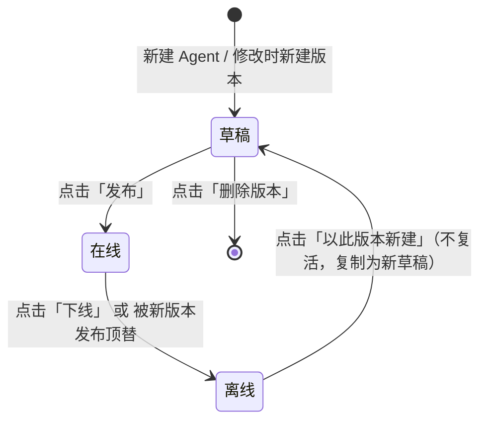
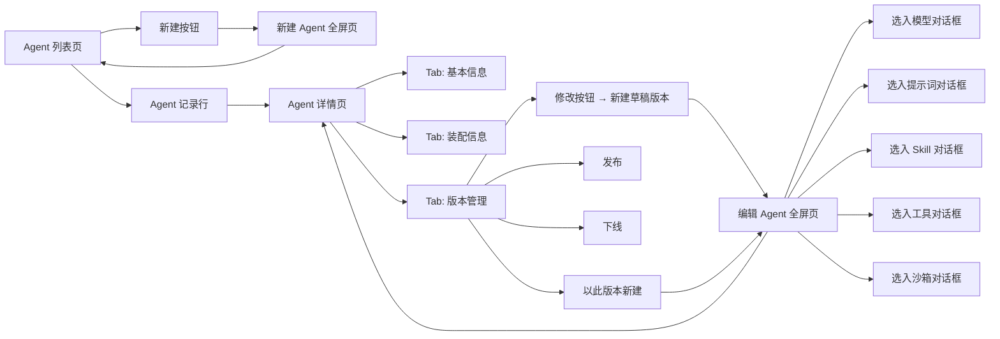
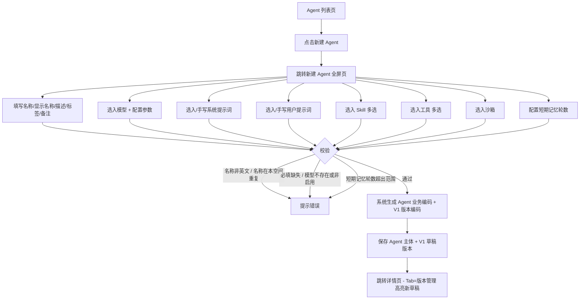
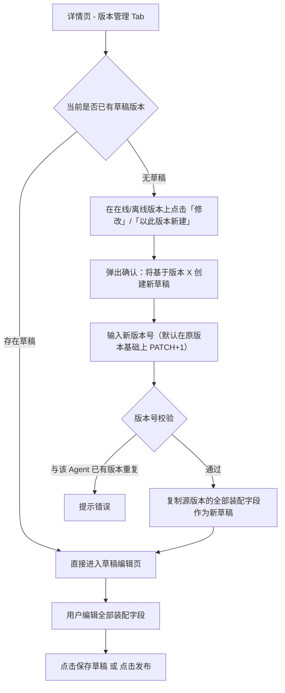
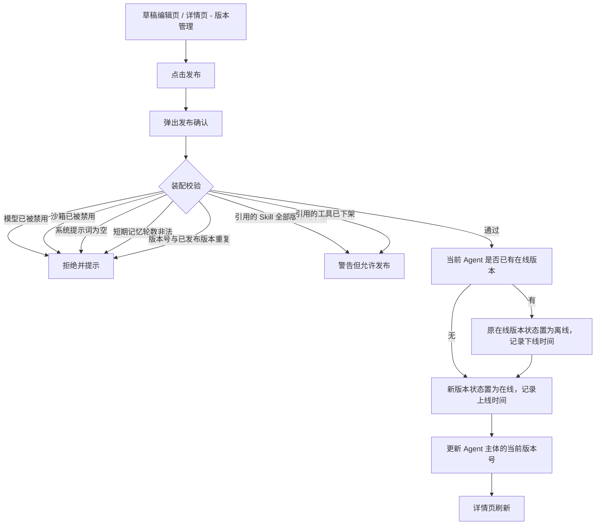
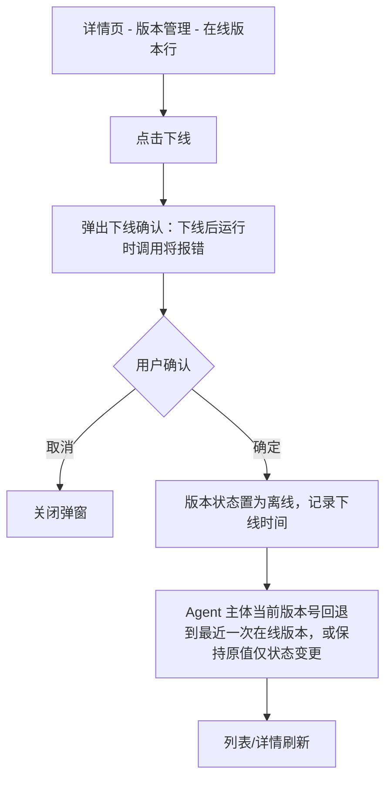
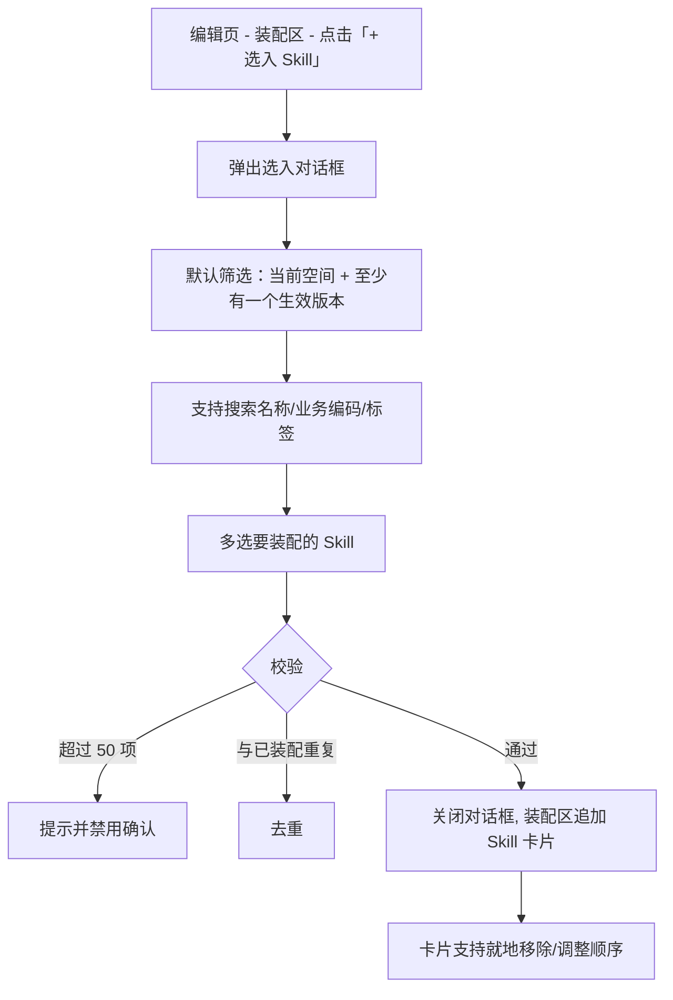
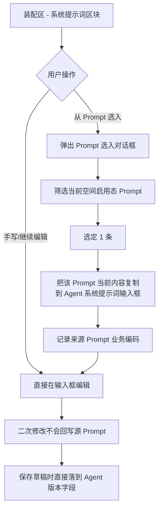
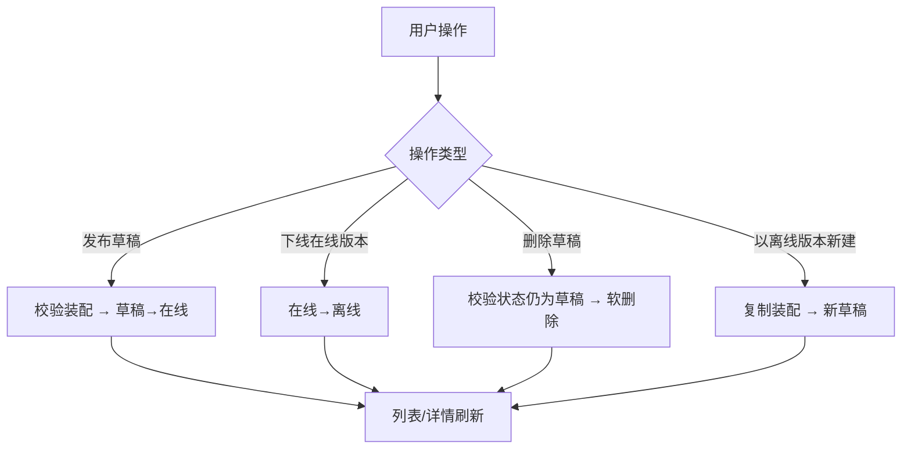
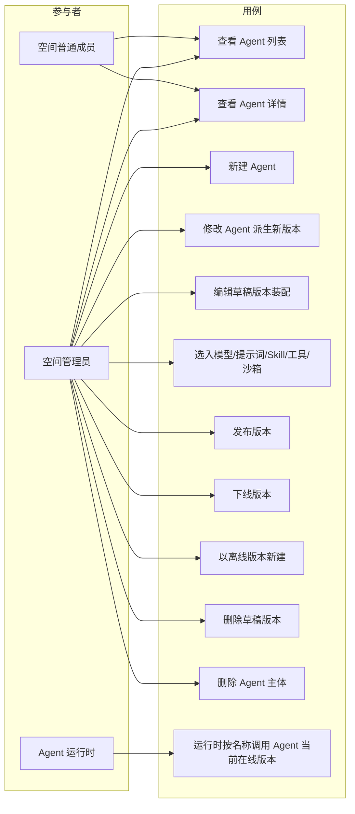

# AgentOps 平台 — Agent 管理 PRD

| 文档版本 | 日期 | 编写人 | 说明 |
|---------|------|-------|------|
| V1.0 | 2026-06-13 | AgentOps Team | Agent 管理模块 PRD 初稿 |
| V1.1 | 2026-06-13 | AgentOps Team | 对齐《UI 信息架构与导航规范》：Agent 管理位于空间 Shell「Agent 与沙箱」分组下 |

---

## 1. 产品/需求背景

AgentOps 平台围绕 **Agent（智能体）** 这一核心概念组织全部资源——模型负责推理、Prompt 负责行为约束、Skill 负责领域知识、工具负责外部能力出口、沙箱负责隔离执行环境、记忆负责上下文延续。**Agent 是把上述全部资源装配成一个可被运行时调用的"业务实体"** 的最终载体。

当前平台已具备：

- **用户管理 / 空间管理 / 系统设置**：底座；
- **模型管理**：Agent 的"大脑"；
- **Prompt 管理**：Agent 的行为指令模板；
- **Skill 管理**：Agent 的业务知识包（强制多版本）；
- **工具管理**：Agent 的能力出口（FunctionCall / MCP）；
- **沙箱管理**：Agent 的执行环境。

但尚未提供 **Agent 自身** 的管理能力。本模块即建设空间内 **Agent 装配 + 全生命周期管理 + 多版本** 的 MVP 版本：

1. **装配**：用户在 Agent 编辑页通过"选入"方式从空间内已有资源中挑选模型、Prompt（系统/用户）、Skill、工具、沙箱，并设定记忆策略；
2. **生命周期**：通过 **草稿 / 在线 / 离线** 三态控制 Agent 是否对运行时可见；
3. **版本管理**：与 Skill 一致，每次修改 Agent 自动创建草稿版本，编辑无误后点击"发布"使新版本上线、旧版本自动下线；
4. **独立全屏编辑页**：因装配涉及大量字段（模型/Prompt/Skill/工具/沙箱/记忆等），新增/编辑界面采用 **独立全屏路由页**（与 Skill 管理一致），区别于模型/工具/沙箱的右侧抽屉；
5. **系统提示词内容可修改**：Agent 中"选入"系统提示词时，**默认填充其内容到 Agent 自身的系统提示词字段**，用户可在 Agent 中进一步修改而不影响原 Prompt（即"以 Prompt 为模板生成 Agent 自有副本"）。

---

## 2. 目标与范围

### 2.1 目标

- 在空间内提供 Agent 的注册、编辑、发布、下线、删除能力，作为运行时调用的最终装配单元。
- 通过"选入 + 副本"机制装配模型、Prompt、Skill、工具、沙箱，并以**版本化快照**方式与下游资源解耦：发布时把当时引用关系冻结到该 Agent 版本上。
- 通过 **草稿 / 在线 / 离线** 三态保护已被运行时引用的版本不被误改；通过强制多版本管理实现可回滚、可对比。
- 提供合理的记忆短期策略（按对话轮数）作为运行时上下文裁剪基础。
- 通过独立全屏编辑页承载装配过程，提供良好的多区域并行编辑体验。

### 2.2 范围

| 范围 | 是否包含 | 说明 |
|------|----------|------|
| Agent 新建 | 包含 | 进入独立全屏「新建 Agent」页；提交后生成 Agent 主体并自动创建 V1 草稿版本 |
| Agent 编辑 | 包含 | 在草稿版本上编辑；非当前编辑版本不可改 |
| Agent 详情页 | 包含 | 顶部关键信息条 + Tab（基本信息 / 装配信息 / 版本管理） |
| 版本新建（修改） | 包含 | 在已有在线/离线版本上点击「修改」自动创建新草稿版本；同 Skill 管理 |
| 版本发布（上线） | 包含 | 草稿 → 在线；同一 Agent 仅允许一个在线版本，发布时自动将旧在线版本置为离线 |
| 版本下线 | 包含 | 在线 → 离线；下线后该版本不可再被运行时调用 |
| 版本删除 | 包含 | 仅草稿版本可删 |
| 版本回退 | 包含 | 在已离线版本上点击「以此版本新建」生成新草稿（不直接复活） |
| 模型选入 | 包含 | 从当前空间内**启用态模型**列表中选择 1 个 |
| 系统/用户提示词选入 | 包含 | 从当前空间内**启用态 Prompt**中选入；选入后内容填充到 Agent 内部字段，可二次修改；保存的是 Agent 的副本而非 Prompt 引用 |
| Skill 选入（多个） | 包含 | 从当前空间内**有生效版本的 Skill**中多选；保存的是「Skill 业务编码」引用列表（运行时按生效版本加载） |
| 工具选入（多个） | 包含 | 从当前空间内**生效态工具**中多选；保存的是「工具业务编码」引用列表 |
| 沙箱选入 | 包含 | 从当前空间内**非禁用且启用**的沙箱中选 1 个；保存的是「沙箱业务编码」引用 |
| 短期记忆配置 | 包含 | 配置短期记忆轮数（按对话轮数裁剪） |
| Agent 名称英文校验 | 包含 | 名称仅允许英文字母、数字、下划线、中划线；空间内唯一；不可修改（名称语义近似 Key） |
| Agent 试运行 | 不包含 | 后续迭代独立模块（运行时 / 调试台）承接 |
| Agent 发布到外部渠道（API / WebChat） | 不包含 | 后续迭代独立模块承接 |
| 长期记忆 / 向量记忆 | 不包含 | 后续迭代独立模块承接，本期仅做短期记忆轮数 |
| 多模型 / 模型回退 | 不包含 | 本期单 Agent 仅绑定一个模型 |
| 跨空间 Agent 共享 | 不包含 | Agent 严格归属单个空间 |

### 2.3 Agent 字段（主体）

> Agent 主体描述「这是一个什么 Agent」，与版本无关；版本相关装配数据见 2.4。

| 字段 | 必填 | 规则 | 示例 |
|------|------|------|------|
| 业务编码 | 是 | 系统生成，**不允许手工编辑或修改**。格式：`AG` + `yyyyMMddHHmmssSSS` + 四位随机数 | `AG202606131426301234567` |
| 名称 | 是 | 1～64 字符；**仅允许英文字母、数字、下划线、中划线**；必须以字母或下划线开头；**同一空间内唯一**；**保存后不可修改**（语义近似 Key，运行时按其稳定引用） | `customer_service_bot` |
| 显示名称 | 否 | 0～50 字符；允许中文等任意可见字符；用于 UI 展示与可读性；可修改 | `家庭客服助手` |
| 描述 | 否 | 0～500 字符；用于在选择列表中辅助说明 | `面向家庭场景的客服机器人，主管退换货、配送咨询` |
| 当前版本 | 是 | 系统维护：「最新在线版本号」或「最新版本号（无在线时）」 | `1.2.0` |
| 标签 | 否 | 0～10 个；每个 1～20 字符 | `["客服","家庭"]` |
| 备注 | 否 | 200 字以内；管理员内部说明 | `每月初需同步业务话术` |
| 所属空间 | 是 | 系统记录，绑定当前空间 ID | `SP202606131426301234567` |
| 创建人 / 创建时间 / 更新人 / 更新时间 / 是否删除 | 是 | 系统记录 | — |

> 说明：**「名称」一经创建不可修改**。原因：运行时按"空间编码 + Agent 名称"做稳定引用（与 Prompt 模块的 Key 思路一致），名称变动会破坏外部已发布渠道的引用语义。如需重命名，须新建 Agent。

### 2.4 Agent 版本字段

> 一个 Agent 拥有多个版本；每个版本独立持有一份完整装配快照。

| 字段 | 必填 | 规则 | 示例 |
|------|------|------|------|
| 版本编码 | 是 | 系统生成，`AGV` + `yyyyMMddHHmmssSSS` + 四位随机数 | `AGV202606131426301234567` |
| Agent 业务编码 | 是 | 关联到 Agent 主体 | `AG202606131426301234567` |
| 版本号 | 是 | 1～20 字符；同一 Agent 内不可重复；推荐 SemVer | `1.2.0` |
| **模型** | 是 | 引用当前空间内启用态模型的业务编码（保存时校验仍启用） | `MD202606131426301234567` |
| **模型参数** | 否 | JSON：`{ "temperature": 0.7, "topP": 1.0, "maxTokens": 2048 }`；可空，运行时使用模型默认 | 见 2.5 |
| **系统提示词内容** | 是 | Markdown 文本，≤ 10,000 字符；支持 `{{变量}}` 占位符；**Agent 自有副本**（可来自 Prompt 选入，亦可纯手写） | 见 2.5 |
| 系统提示词来源 Prompt 业务编码 | 否 | 选入来源（仅留痕，不构成强引用）；用户后续在 Agent 内修改不会回写 Prompt | `PR202606131426301234567` |
| **用户提示词内容** | 否 | Markdown 文本，≤ 10,000 字符；支持 `{{变量}}` 占位符；可空 | — |
| 用户提示词来源 Prompt 业务编码 | 否 | 同上 | — |
| **Skill 列表** | 否 | 数组；每项为 Skill 业务编码（运行时按 Skill 模块的生效版本加载）；最多 50 项；同一 Skill 不重复 | `["SK...","SK..."]` |
| **工具列表** | 否 | 数组；每项为工具业务编码；最多 50 项；同一工具不重复 | `["TL...","TL..."]` |
| **沙箱** | 否 | 沙箱业务编码；保存时校验非「禁用」且非「草稿」 | `SB202606131426301234567` |
| **短期记忆轮数** | 是 | 整数；范围 0～50；0 表示不保留短期记忆；默认 10 | `10` |
| 状态 | 是 | 枚举：`草稿` / `在线` / `离线`；新建时默认为 `草稿` | `在线` |
| 上线时间 | 否 | 进入「在线」态的时刻 | `2026-06-13 18:00:00` |
| 下线时间 | 否 | 进入「离线」态的时刻（含被新版本顶替时） | `2026-07-01 09:00:00` |
| 创建人 / 创建时间 / 更新人 / 更新时间 / 是否删除 | 是 | 系统记录 | — |

#### 模型参数 JSON 示例

```json
{
  "temperature": 0.7,
  "topP": 1.0,
  "maxTokens": 2048,
  "presencePenalty": 0,
  "frequencyPenalty": 0,
  "stopSequences": []
}
```

#### 系统提示词内容示例（Agent 内副本，可改）

```markdown
你是一名{{role}}，专注于{{domain}}领域。请使用{{language}}回答用户问题。
对话过程中保持简洁、有礼貌。
```

> **关键设计**：「系统/用户提示词」在 Agent 中存的是**内容副本**（字符串），不是对 Prompt 模块的强引用。
> - 选入 Prompt 时把当时其"启用态"内容**复制**到 Agent 字段；
> - 用户可在 Agent 编辑页直接二次修改，**不影响**原 Prompt；
> - 同时记录「来源 Prompt 业务编码」用于回溯和后续手动「重新拉取最新内容」（本期可选 P1）。
> 这避免了 Prompt 后续被禁用/修改时影响已发布 Agent 的稳定运行。

### 2.5 Agent 与版本状态流转



| 当前版本状态 | 可执行操作 | 说明 |
|-------------|-----------|------|
| 草稿 | 编辑、发布、删除版本 | 草稿可自由修改全部装配字段；发布会顶替当前在线版本，旧在线版本自动转为离线 |
| 在线 | 修改（自动派生新草稿）、下线 | 在线版本本身**不可直接编辑**；同一 Agent 同一时刻仅一个在线版本 |
| 离线 | 以此版本新建（生成新草稿） | 离线版本只读；如需恢复，须复制为新草稿后再发布 |

> **关键约束**：同一 Agent 同一时刻 **最多一个版本处于「在线」状态**；新版本发布时，原在线版本自动转为「离线」。

### 2.6 装配引用语义（与下游模块的关系）

| 装配字段 | 引用语义 | 下游变更对 Agent 的影响 |
|---------|---------|------------------------|
| 模型 | 强引用（按业务编码） | 模型被禁用 → Agent 运行时调用按降级策略处理（本期不实现，仅在装配/发布时校验存在性 + 启用态） |
| 系统/用户提示词 | **副本**（选入即复制内容） | Prompt 后续修改/禁用 **不影响** 已保存的 Agent 副本 |
| Skill | 强引用（按业务编码） + 运行时按 Skill 模块的"当前生效版本"加载 | Skill 发布新版本 → Agent 自动使用新版本；Skill 全部版本均下架 → 运行时降级 |
| 工具 | 强引用（按业务编码） | 工具下架 → 运行时降级 |
| 沙箱 | 强引用（按业务编码） | 沙箱离线 → 运行时降级；沙箱被禁用 → 运行时拒绝调用 |

---

## 3. 系统线框图（必选）

> 全平台 UI 信息架构与导航以《UI 信息架构与导航规范》（`doc/产品方案/2026-06-13_UI信息架构与导航规范.md`）为单一来源。本节仅描述本模块在空间 Shell 中的位置与模块内页面结构。

### 3.1 Agent 管理在空间 Shell 中的位置

Agent 管理位于空间 Shell 左侧导航的「Agent 与沙箱」分组下，与沙箱管理同组。

```text
空间 Shell
┌──────────────────────────────────────────────────────────────────────┐
│ [Logo] AgentOps │ 当前空间：家庭客服 ▼          [👤 当前用户 ▼]      │
├──────────────────┬────────────────────────────────────────────────────┤
│ 📊 工作台         │                                                    │
│ ━ Agent 与沙箱 ━  │                                                    │
│  🤖 Agent 管理 ◀│  当前页：Agent 列表                                │
│  📦 沙箱管理      │                                                    │
│ ━ 模型与工具 ━    │                                                    │
│ ━ 调试与评测 ━    │                                                    │
│ 👥 空间成员       │                                                    │
└──────────────────┴────────────────────────────────────────────────────┘
```

### 3.2 Agent 管理模块页面结构



**模块说明**：

| 模块 | 职责 |
|------|------|
| Agent 列表页 | 表格形式展示当前空间内全部 Agent（按 Agent 主体维度，每行展示当前版本/状态） |
| 新建 Agent 全屏页 | 独立路由页面（非弹窗/抽屉），承载首次创建 Agent 的全部装配表单 |
| Agent 详情页 | 顶部关键信息（名称、编号、版本、状态）固定；下方 Tab 切换基本信息 / 装配信息 / 版本管理 |
| 编辑 Agent 全屏页 | 与「新建 Agent 全屏页」结构一致；编辑对象为某个**草稿版本** |
| 选入对话框 | 从当前空间内对应资源列表中筛选并选入；模型、Prompt、沙箱单选；Skill、工具多选 |

---

## 4. 业务流程图（必选）

### 4.1 Agent 新建流程



### 4.2 Agent 修改（派生新版本）流程



### 4.3 版本发布流程



### 4.4 版本下线流程



### 4.5 选入资源流程（以选入 Skill 为例，模型/提示词/工具/沙箱同构）



### 4.6 系统提示词选入与本地修改流程



### 4.7 状态流转流程（顶层）



---

## 5. 用例图（必选）



**图例说明**：

| 参与者 | 含义 |
|--------|------|
| 空间管理员 | 包含创建人在内的全部管理员，可对 Agent 与版本执行新增/编辑/发布/下线/删除 |
| 空间普通成员 | 仅可查看 Agent 列表与详情；不能修改装配；可在外部应用代理调用接口里使用其名称 |
| Agent 运行时 | 系统内部参与者，按「空间编码 + Agent 名称」拉取当前在线版本进行调用 |

| 用例 | 含义 | 优先级 |
|------|------|--------|
| 查看 Agent 列表 | 浏览当前空间内全部 Agent | P0 |
| 查看 Agent 详情 | 顶部关键信息 + 三 Tab | P0 |
| 新建 Agent | 在独立全屏页装配并生成 V1 草稿 | P0 |
| 修改 Agent 派生新版本 | 在线/离线版本上派生新草稿 | P0 |
| 编辑草稿版本装配 | 修改装配字段、记忆轮数 | P0 |
| 选入资源 | 模型/Prompt/Skill/工具/沙箱选入对话框 | P0 |
| 发布版本 | 草稿 → 在线 | P0 |
| 下线版本 | 在线 → 离线 | P0 |
| 以离线版本新建 | 复制为新草稿 | P1 |
| 删除草稿版本 | 仅草稿可删 | P1 |
| 删除 Agent 主体 | 仅在无在线版本且无运行时引用时允许 | P1 |
| 运行时调用 | 下游用例，本期不在 Agent 管理范围内实现 | P1 |

---

## 6. 用户与场景

### 6.1 用户角色

- **空间管理员**：可对当前空间内 Agent 执行全部管理操作。
- **空间普通成员**：可查看 Agent 列表与详情（仅在线版本默认展开）；不能创建或修改 Agent。
- **Agent 运行时**：系统参与者，按 Agent 名称拉取当前在线版本（业务编码作为版本快照唯一键）。

### 6.2 典型用户故事

- 作为空间管理员，我希望新建一个 Agent `customer_service_bot`，从已有资源中**选入**模型、系统提示词、3 个 Skill、5 个工具、1 个沙箱，并设置短期记忆 10 轮，保存为草稿。
- 作为空间管理员，我希望在选入系统提示词时**自动把它的内容填进 Agent 的系统提示词输入框**，再针对当前 Agent 做轻微的本地修改（如加一段「家庭场景」的特化），改动只影响这个 Agent，**不会回写**到原 Prompt。
- 作为空间管理员，当下游业务话术更新时，我希望直接在最新在线版本上点击「修改」自动得到 V1.1 草稿（**不是**直接覆盖 V1.0），编辑无误后点击发布，V1.0 自动下线并保留可查。
- 作为空间管理员，当某个 Agent V1.2 上线后表现退化，我希望能在版本管理 Tab 找到 V1.0，点击「以此版本新建」拿到 V1.3 草稿，确认后发布回退。
- 作为空间管理员，我希望发布前系统能告诉我「这个 Agent 引用的 Skill `weather_skill` 没有任何生效版本」，避免我把一个**装配不完整**的 Agent 推上去。
- 作为空间普通成员，我希望在 Agent 列表能看到当前空间所有 Agent 的概况、最近一次发布时间，但不能修改它们。
- 作为运行时，我希望按 `(spaceCode, agentName)` 稳定取到当前在线版本的完整装配快照，而不需要关心其内部版本编码。

---

## 7. 功能需求

### 7.1 Agent 列表

| 序号 | 功能点 | 简要说明 | 优先级 |
|------|--------|----------|--------|
| 1 | Agent 列表 | 表格展示当前空间内全部 Agent（`is_deleted=0`）；列：显示名称、名称、业务编码、当前版本号、当前版本状态、所用模型、标签、更新时间、操作 | P0 |
| 2 | 列表搜索与筛选 | 支持按名称/显示名称/业务编码模糊搜索；支持按当前版本状态（草稿/在线/离线）筛选；支持按标签多选筛选；支持按所用模型筛选 | P0 |
| 3 | 列表分页与排序 | 默认按更新时间倒序；分页 20 条/页 | P1 |
| 4 | 空态展示 | 空间内无 Agent 时展示空态插画与「新建 Agent」引导按钮 | P1 |
| 5 | 列表入口跳转 | 点击行跳转 Agent 详情页（默认 Tab：基本信息） | P0 |

### 7.2 新建/编辑 Agent 全屏页

| 序号 | 功能点 | 简要说明 | 优先级 |
|------|--------|----------|--------|
| 6 | 独立全屏页 | 通过独立路由（如 `/agents/new`、`/agents/:code/versions/:vcode/edit`）打开，整页布局，非弹窗/抽屉 | P0 |
| 7 | 基本信息区 | 名称、显示名称、描述、版本号、标签、备注 | P0 |
| 8 | 名称英文校验 | 名称仅允许英文字母、数字、下划线、中划线；必须以字母或下划线开头；空间内唯一；新建后只读 | P0 |
| 9 | 模型装配区 | 单选；点击「选入模型」弹出对话框；展示所选模型名称、模型标识、Base URL（脱敏）、状态彩签 | P0 |
| 10 | 模型参数面板 | 可展开/折叠的高级参数：temperature、topP、maxTokens、presencePenalty、frequencyPenalty、stopSequences；每项前端做范围校验 | P1 |
| 11 | 系统提示词区 | 必填；Markdown 编辑器；支持「从 Prompt 选入」按钮（选入后填充内容）；选入后展示来源 Prompt 名称与「断开关联」按钮；编辑器内容与来源 Prompt **解耦**，本地修改不影响 Prompt | P0 |
| 12 | 用户提示词区 | 选填；行为同系统提示词，但允许为空 | P0 |
| 13 | Skill 装配区 | 多选；点击「+ 选入 Skill」弹出对话框（仅展示有生效版本的 Skill）；以卡片列表展示已选 Skill，每卡片可移除、可拖拽排序；最多 50 个 | P0 |
| 14 | 工具装配区 | 多选；行为同 Skill 装配区；仅展示当前空间生效态工具；最多 50 个 | P0 |
| 15 | 沙箱装配区 | 单选；点击「选入沙箱」弹出对话框；仅展示非禁用且非草稿的沙箱（包含初始化中/在线/离线，但 UI 给出离线警示） | P0 |
| 16 | 短期记忆配置 | 整数输入；范围 0～50；默认 10；输入框旁辅助说明「保留最近 N 轮对话作为上下文，0 表示不保留」 | P0 |
| 17 | 离开页面提示 | 存在未保存修改时，路由切换/关闭浏览器前弹出确认 | P0 |
| 18 | 保存草稿 | 主按钮「保存草稿」：仅保存到当前编辑的草稿版本，不改变其状态 | P0 |
| 19 | 直接发布 | 次按钮「保存并发布」：先保存再走发布流程（含装配校验） | P0 |
| 20 | 取消 | 取消按钮返回详情页或列表页（带未保存确认） | P0 |

### 7.3 选入对话框

| 序号 | 功能点 | 简要说明 | 优先级 |
|------|--------|----------|--------|
| 21 | 选入模型对话框 | 弹窗内表格：名称、模型标识、Base URL、状态；只展示「启用」态；单选 | P0 |
| 22 | 选入提示词对话框 | 弹窗内表格：名称、Key、内容预览（前 100 字符）、变量列表、状态；只展示「启用」态；单选；选定后内容填入 Agent 字段 | P0 |
| 23 | 选入 Skill 对话框 | 弹窗内表格：名称、业务编码、当前生效版本号、标签、更新时间；只展示「至少有一个生效版本」的 Skill；多选 | P0 |
| 24 | 选入工具对话框 | 弹窗内表格：名称、类型、子类型、状态、标签；只展示「生效」态；多选 | P0 |
| 25 | 选入沙箱对话框 | 弹窗内表格：名称、镜像、状态、最近探活时间；展示「非禁用且非草稿」的沙箱；单选；离线沙箱可选但有橙色警示 | P0 |
| 26 | 通用筛选/搜索 | 5 个对话框统一支持名称/编码模糊搜索、状态/标签筛选 | P0 |
| 27 | 通用分页 | 每对话框 10 条/页；保留主页面已选项以避免重复添加 | P1 |

### 7.4 Agent 详情页（顶部关键信息 + Tab）

| 序号 | 功能点 | 简要说明 | 优先级 |
|------|--------|----------|--------|
| 28 | 顶部关键信息条 | 固定吸顶展示：显示名称、名称（一键复制）、业务编码（一键复制）、当前版本号、当前版本状态彩签 | P0 |
| 29 | Tab：基本信息 | 只读展示 Agent 主体字段（名称、显示名称、描述、业务编码、当前版本号、标签、备注、创建/更新审计）；管理员可见「编辑标签/备注/显示名称/描述」入口 | P0 |
| 30 | Tab：装配信息 | 默认展示**当前在线版本**（无在线时展示最新版本）的装配快照（只读）：模型、模型参数、系统/用户提示词内容、Skill 列表、工具列表、沙箱、短期记忆轮数；提供下拉切换查看其它版本 | P0 |
| 31 | Tab：版本管理 | 列表展示该 Agent 全部版本（按版本号倒序）；列：版本号、版本编码、状态、上线时间、下线时间、创建人、创建时间、操作 | P0 |
| 32 | 版本管理操作按钮 | 按版本状态显隐：草稿 → 编辑 / 发布 / 删除；在线 → 修改（派生新版本） / 下线 / 查看；离线 → 以此版本新建 / 查看 | P0 |
| 33 | 查看历史版本只读详情 | 点击「查看」展开装配快照只读视图（同 Tab 装配信息结构） | P1 |

### 7.5 版本流转

| 序号 | 功能点 | 简要说明 | 优先级 |
|------|--------|----------|--------|
| 34 | 创建初始草稿 | 新建 Agent 时同步创建 V1（默认 `1.0.0`）草稿 | P0 |
| 35 | 派生新草稿 | 在在线/离线版本上点击「修改」/「以此版本新建」自动复制全部装配作为新草稿；要求输入新版本号 | P0 |
| 36 | 同时仅一个草稿 | 同一 Agent 同一时刻**最多存在一个草稿版本**；已有草稿时点击「修改」直接进入该草稿 | P0 |
| 37 | 发布版本（装配校验） | 草稿 → 在线；如已存在在线版本，自动转为离线；同步刷新 Agent 主体当前版本号；发布前校验：模型/沙箱启用、Skill 至少一个生效版本、工具仍生效、系统提示词非空、记忆轮数合法、版本号唯一 | P0 |
| 38 | 下线版本 | 在线 → 离线；二次确认；下线后运行时按降级策略处理（本期仅文案提示） | P0 |
| 39 | 删除草稿 | 仅草稿可删；二次确认；后端再次校验 | P0 |
| 40 | Agent 主体删除 | 仅当 Agent 无任何「在线」版本且无运行时历史调用时允许；软删除 | P1 |
| 41 | 版本号校验 | 同 Agent 内版本号唯一；推荐 SemVer 格式但不强校验（仅警告） | P0 |
| 42 | 版本审计 | 版本的发布、下线、删除操作均记录审计 | P0 |

### 7.6 权限与同步约束

| 序号 | 功能点 | 简要说明 | 优先级 |
|------|--------|----------|--------|
| 43 | 操作按钮显隐 | 「新建」「编辑」「发布」「下线」「删除」「选入资源」按钮仅对空间管理员可见 | P0 |
| 44 | 普通成员视图 | 只读列表 + 只读详情（仅可见在线版本装配；草稿对普通成员隐藏） | P0 |
| 45 | 名称运行时唯一 | 后端按 `(spaceId, name, is_deleted=0)` 设置唯一索引 | P0 |
| 46 | 装配关闭检测（发布时） | 发布前后端均校验装配引用的所有资源仍处于可用状态；任一关键资源不可用时阻断发布并定位问题资源 | P0 |

---

## 8. 原型图/界面说明（必选）

### 8.1 Agent 列表页

```text
┌────────────────────────────────────────────────────────────────────────────────────────┐
│ AgentOps  /  [家庭客服 Agent ▼]  /  Agent                                               │
├────────────────────────────────────────────────────────────────────────────────────────┤
│  Agent 管理                                                                            │
│                                                                                        │
│  [搜索名称/显示名称/编码 🔍]  状态: [全部 ▼]  模型: [全部 ▼]  标签: [全部 ▼] [+ 新建 Agent]│
│                                                                                        │
│  ┌──────────────────────────────────────────────────────────────────────────────────┐ │
│  │ 显示名称       │ 名称                  │ 编码           │ 版本   │ 状态 │ 模型      │ 操作 │
│  ├────────────────┼──────────────────────┼────────────────┼────────┼──────┼──────────┼──────┤
│  │ 家庭客服助手    │ customer_service_bot │ AG2026...23456 │ 1.2.0  │ 在线 │ Claude   │ 详情 │
│  │ 退款处理助手    │ refund_assistant     │ AG2026...23457 │ 0.9.0  │ 草稿 │ GPT-4o   │ 详情 │
│  │ 邮件总结助手    │ email_summarizer     │ AG2026...23458 │ 2.1.0  │ 离线 │ Llama    │ 详情 │
│  └──────────────────────────────────────────────────────────────────────────────────┘ │
│                                                共 3 条   < 1 >  20 条/页 ▼            │
└────────────────────────────────────────────────────────────────────────────────────────┘
```

**说明**：
- 状态列展示**当前版本状态**（草稿灰、在线绿、离线橙）。
- 操作列仅展示「详情」入口，所有写操作都在详情页内完成。
- 普通成员可见列表全部列，但点击进入详情后无写操作按钮。

### 8.2 新建/编辑 Agent 全屏页

```text
┌──────────────────────────────────────────────────────────────────────────────────────────────────────────┐
│ AgentOps  /  Agent  /  新建 Agent                                  [取消]  [保存并发布]  [保存草稿]      │
├──────────────────────────────────────────────────────────────────────────────────────────────────────────┤
│  ┌─ 基本信息 ──────────────────────────────────┐ ┌─ 模型 ──────────────────────────────────────────┐    │
│  │ 名称 *（英文，空间唯一，保存后不可改）        │ │ 模型 *                                          │    │
│  │ [customer_service_bot______________________]│ │ ┌────────────────────────────────────────────┐  │    │
│  │ 显示名称                                     │ │ │ Claude Sonnet 4.6 [启用]                   │  │    │
│  │ [家庭客服助手_______________________________]│ │ │ claude-sonnet-4-6 · https://api.anthropic..│  │    │
│  │ 描述                                         │ │ │                          [更换]            │  │    │
│  │ [.........................................]│ │ └────────────────────────────────────────────┘  │    │
│  │ 版本号 *                                     │ │ 高级参数 ▾                                       │    │
│  │ [1.0.0_____________________]                │ │   temperature: [0.7]  topP: [1.0]               │    │
│  │ 标签                                         │ │   maxTokens: [2048]                             │    │
│  │ [客服] [家庭] [+]                            │ └─────────────────────────────────────────────────┘    │
│  │ 备注                                         │                                                       │
│  │ [.........................................]│ ┌─ 沙箱 ──────────────────────────────────────────┐    │
│  │ 编码: 保存后生成                              │ │ 沙箱                                            │    │
│  └──────────────────────────────────────────────┘ │ ┌────────────────────────────────────────────┐  │    │
│                                                   │ │ default-sandbox [在线]                     │  │    │
│  ┌─ 系统提示词 * ─────────────────────────────────────┐                          [更换]            │  │    │
│  │ 来源：[+ 从 Prompt 选入]  当前来源: customer_open  │ └────────────────────────────────────────────┘  │    │
│  │ ┌──────────────────────────────────────────────┐  │ 短期记忆轮数 *                                 │    │
│  │ │ 你是一名{{role}}，专注于{{domain}}领域。    │  │ [10] (0~50, 0 表示不保留)                       │    │
│  │ │ 请使用{{language}}回答用户问题。            │  │                                                  │    │
│  │ │ ...                                         │  └─────────────────────────────────────────────────┘    │
│  │ └──────────────────────────────────────────────┘                                                       │
│  │ ⓘ 内容已从来源 Prompt 复制到 Agent 副本，本地修改不会回写源 Prompt    [断开关联]                       │
│  └─────────────────────────────────────────────────────────────────────────────────────────────────────┘ │
│                                                                                                          │
│  ┌─ 用户提示词 (选填) ─────────────────────────────────────────────────────────────────────────────────┐ │
│  │ 来源：[+ 从 Prompt 选入]                                                                            │ │
│  │ ┌──────────────────────────────────────────────────────────────────────────────────────────────┐  │ │
│  │ │ 用户问题：{{user_question}}                                                                  │  │ │
│  │ └──────────────────────────────────────────────────────────────────────────────────────────────┘  │ │
│  └─────────────────────────────────────────────────────────────────────────────────────────────────────┘ │
│                                                                                                          │
│  ┌─ Skill 装配 (0/50) ───────────────────────┐ ┌─ 工具装配 (0/50) ──────────────────────────┐         │
│  │ [+ 选入 Skill]                            │ │ [+ 选入工具]                                │         │
│  │  ⠿ 银行卡号校验助手 (v1.2.0) [生效]  [✕] │ │  ⠿ 天气查询 [FC OpenAPI · 生效]       [✕]  │         │
│  │  ⠿ 邮件总结模板     (v0.9.0) [生效]  [✕] │ │  ⠿ 订单退款 [FC Endpoint · 生效]      [✕]  │         │
│  │                                           │ │  ⠿ 公司内部 MCP [MCP Remote · 生效]   [✕]  │         │
│  └────────────────────────────────────────────┘ └─────────────────────────────────────────────┘         │
└──────────────────────────────────────────────────────────────────────────────────────────────────────────┘
```

**说明**：
- 整页布局采用网格：左上「基本信息」+ 右上「模型 / 沙箱 / 短期记忆」；中段贯穿「系统提示词」「用户提示词」；下段左右双栏「Skill 装配 / 工具装配」。
- 1280px 以下分辨率自动堆叠。
- Skill / 工具卡片支持拖拽排序（卡片左侧 ⠿ 把手）；点击 ✕ 移除。
- 「断开关联」按钮：清空「来源 Prompt 业务编码」字段；提示词内容保留为纯手写副本。
- 编辑场景下顶部面包屑显示 `Agent / customer_service_bot / 编辑 V1.1（草稿）`；名称字段灰显只读。

### 8.3 选入对话框（以「选入 Skill」为例）

```text
┌──────────────────────────────────────────────────────────────────────────────────────────┐
│  选入 Skill                                                                          ✕   │
├──────────────────────────────────────────────────────────────────────────────────────────┤
│  [搜索名称/编码 🔍]   状态: [全部生效版本 ▼]   标签: [全部 ▼]                              │
│                                                                                          │
│  ┌────────────────────────────────────────────────────────────────────────────────────┐ │
│  │ ☐ │ 名称              │ 业务编码          │ 生效版本 │ 标签         │ 更新时间       │ │
│  ├───┼───────────────────┼───────────────────┼──────────┼──────────────┼─────────────────┤ │
│  │ ☑ │ 银行卡号校验助手   │ SK202606131426301 │ 1.2.0    │ 金融, 校验   │ 06-13 18:00    │ │
│  │ ☑ │ 邮件总结模板       │ SK202606121026301 │ 0.9.0    │ 写作         │ 06-12 11:30    │ │
│  │ ☐ │ 客户问候语模板     │ SK202606101026301 │ 2.1.0    │ 客服         │ 06-10 09:00    │ │
│  └────────────────────────────────────────────────────────────────────────────────────┘ │
│                                                共 3 条   < 1 >  10 条/页 ▼              │
│                                                                                          │
│  已选 2 项，可选最多 50 项                                                                │
├──────────────────────────────────────────────────────────────────────────────────────────┤
│                                                            [取消]   [确定选入 (2)]      │
└──────────────────────────────────────────────────────────────────────────────────────────┘
```

**说明**：
- 5 类资源选入对话框结构一致，仅列字段与筛选项不同；
- 仅展示「**有可被引用的状态**」的资源：模型/Prompt/工具按「启用/生效」过滤；Skill 按「至少一个生效版本」过滤；沙箱按「非禁用且非草稿」过滤；
- 对话框打开时已勾选当前装配区已有的项；取消勾选 = 移除装配。

### 8.4 Agent 详情页 — 顶部关键信息条

```text
┌────────────────────────────────────────────────────────────────────────────────────┐
│ AgentOps  /  Agent  /  customer_service_bot                                        │
├────────────────────────────────────────────────────────────────────────────────────┤
│  显示名称：家庭客服助手                                                            │
│  名称：customer_service_bot [📋]   编码：AG2026...3456 [📋]                         │
│  当前版本：1.2.0  [在线]                                                            │
└────────────────────────────────────────────────────────────────────────────────────┘
│  [基本信息]   [装配信息]   [版本管理]                                              │
└────────────────────────────────────────────────────────────────────────────────────┘
```

### 8.5 详情页 Tab — 装配信息

```text
┌────────────────────────────────────────────────────────────────────────────────────┐
│  装配信息       查看版本：[1.2.0 (在线) ▼]  [⏎ 进入草稿编辑]（管理员且有草稿时）    │
│                                                                                    │
│  模型:                                                                             │
│   Claude Sonnet 4.6 (claude-sonnet-4-6)                                            │
│   参数: temperature=0.7  topP=1.0  maxTokens=2048                                  │
│                                                                                    │
│  系统提示词 (来源 Prompt: customer_opening):                                       │
│   ┌──────────────────────────────────────────────────────────────────────────┐    │
│   │ 你是一名 {{role}}，专注于{{domain}}领域。 ...                            │    │
│   └──────────────────────────────────────────────────────────────────────────┘    │
│                                                                                    │
│  用户提示词:                                                                       │
│   ┌──────────────────────────────────────────────────────────────────────────┐    │
│   │ 用户问题: {{user_question}}                                              │    │
│   └──────────────────────────────────────────────────────────────────────────┘    │
│                                                                                    │
│  Skill (2):  银行卡号校验助手 (v1.2.0)   邮件总结模板 (v0.9.0)                     │
│  工具 (3):   天气查询 [FC OpenAPI]   订单退款 [FC Endpoint]   公司内部 MCP [Remote]│
│  沙箱:       default-sandbox [在线]                                                │
│  短期记忆轮数: 10                                                                  │
└────────────────────────────────────────────────────────────────────────────────────┘
```

### 8.6 详情页 Tab — 版本管理

```text
┌────────────────────────────────────────────────────────────────────────────────────┐
│  版本管理                                                          [+ 修改创建新版] │
│                                                                                    │
│  ┌──────────────────────────────────────────────────────────────────────────────┐ │
│  │ 版本号 │ 状态 │ 上线时间       │ 下线时间       │ 创建人 │ 操作               │ │
│  ├────────┼──────┼────────────────┼────────────────┼────────┼─────────────────────┤ │
│  │ 1.3.0  │ 草稿 │ —              │ —              │ 李四   │ 编辑 / 发布 / 删除  │ │
│  │ 1.2.0  │ 在线 │ 2026-06-10     │ —              │ 李四   │ 修改 / 下线 / 查看  │ │
│  │ 1.1.0  │ 离线 │ 2026-06-01     │ 2026-06-10     │ 张三   │ 以此版本新建 / 查看 │ │
│  │ 1.0.0  │ 离线 │ 2026-05-20     │ 2026-06-01     │ 张三   │ 以此版本新建 / 查看 │ │
│  └──────────────────────────────────────────────────────────────────────────────┘ │
└────────────────────────────────────────────────────────────────────────────────────┘
```

**说明**：
- 顶部「+ 修改创建新版」按钮：当前 Agent 已有草稿时按钮文案改为「继续编辑草稿」并直接跳转草稿编辑页。
- 操作按钮按版本状态显隐（详见 7.4 序号 32）。

### 8.7 发布确认弹窗（含装配校验结果）

```text
┌──────────────────────────────────────────────────────────────────┐
│  发布版本                                                  ✕    │
├──────────────────────────────────────────────────────────────────┤
│  即将发布 Agent「customer_service_bot」的版本 1.3.0。              │
│                                                                  │
│  ⚠ 当前在线版本 1.2.0 将自动下线。                                │
│                                                                  │
│  ── 装配预检 ──                                                   │
│  ✅ 模型 Claude Sonnet 4.6 [启用]                                 │
│  ✅ 系统提示词 非空                                               │
│  ✅ Skill (2/2) 均有生效版本                                       │
│  ✅ 工具 (3/3) 均生效                                             │
│  ⚠ 沙箱 default-sandbox 当前 [离线]，运行时调用将报错             │
│                                                                  │
│  请确认装配预检结果后再发布。                                     │
├──────────────────────────────────────────────────────────────────┤
│                                       [取消]   [确定发布]        │
└──────────────────────────────────────────────────────────────────┘
```

> 关键资源不可用（如模型被禁用、沙箱被禁用、Skill 全部下架）时按钮置灰不可发布并红字提示；非阻断警告（如沙箱离线、可能继续探活恢复）允许发布但黄字提示。

### 8.8 下线 / 删除草稿确认弹窗

```text
┌──────────────────────────────────────────────────────────────────┐
│  下线版本                                                  ✕    │
├──────────────────────────────────────────────────────────────────┤
│  确定下线 Agent「customer_service_bot」V1.2.0？                    │
│  下线后，该 Agent 将无在线版本可用，运行时调用将报错。            │
│  如需替换，请先发布另一版本再下线。                              │
├──────────────────────────────────────────────────────────────────┤
│                                       [取消]   [确定下线]        │
└──────────────────────────────────────────────────────────────────┘

┌──────────────────────────────────────────────────────────────────┐
│  ⚠ 删除草稿版本                                            ✕    │
├──────────────────────────────────────────────────────────────────┤
│  确定删除 Agent「customer_service_bot」的草稿版本 1.3.0？          │
│  删除后该版本的全部装配快照将不可恢复。                           │
│  ⓘ 仅草稿版本可被删除；在线/离线版本请使用「下线」操作或保留。     │
├──────────────────────────────────────────────────────────────────┤
│                                       [取消]   [确定删除]        │
└──────────────────────────────────────────────────────────────────┘
```

### 8.9 派生新版本输入弹窗

```text
┌──────────────────────────────────────────────────────────────────┐
│  基于 V1.2.0 创建新版本                                    ✕    │
├──────────────────────────────────────────────────────────────────┤
│  新版本号 *                                                       │
│  [1.3.0_______________________________]                          │
│  ⓘ 不可与该 Agent 已有版本重复；建议使用 SemVer 格式             │
│                                                                  │
│  系统将复制 V1.2.0 的全部装配快照（模型 / 提示词 / Skill /        │
│  工具 / 沙箱 / 记忆轮数）作为新草稿。                             │
├──────────────────────────────────────────────────────────────────┤
│                                       [取消]   [创建并进入编辑]  │
└──────────────────────────────────────────────────────────────────┘
```

### 8.10 关键状态

| 状态 | 说明 |
|------|------|
| 列表空态 | 空间内无 Agent 时展示空态插画 + 引导文案「装配你的第一个 Agent，把模型、Prompt、Skill、工具、沙箱组合起来」+ 主按钮「新建 Agent」 |
| 详情页加载中 | Tab 区域骨架屏占位 |
| 装配区空态 | Skill/工具装配区为空时展示「暂未选入，点击 + 选入」 |
| 名称非英文 / 重复 | 名称输入框下方红字提示具体错误 |
| 模型/沙箱被禁用 | 装配卡片以红色边框 + 文案标注「该资源已被禁用，发布将被阻断」 |
| 离开页面未保存 | 弹出二次确认 |
| 越权 | 普通成员通过 URL 直访新建/编辑页或调用写接口时返回 403 + toast 提示 |
| 发布失败 | 弹窗内 inline error，定位失败资源 |

---

## 9. 非功能需求

- **性能**：
  - 列表分页 20 条/页，首屏 1.5s 内渲染完成。
  - 选入对话框首屏 1s 内返回。
  - 装配快照保存接口响应 < 1.5s；版本发布/下线接口响应 < 800ms。
  - 单 Agent 版本数量上限 100；同 Skill/工具装配上限 50。
- **安全/权限**：
  - 仅启用态登录用户 + 空间成员可访问 Agent 管理页面。
  - 仅空间管理员可调用新建、编辑、发布、下线、删除接口；普通成员调用应被服务端拒绝（403）。
  - 删除接口须在服务端校验当前版本状态确为「草稿」。
  - 编辑、发布、下线、删除接口须校验目标 Agent 的 `spaceId` 与当前上下文一致。
  - 装配引用的资源须校验属于同空间且未软删除（防止跨空间装配或装配已删资源）。
- **数据治理**：
  - Agent 主体与版本均采用软删除（`is_deleted=1`）。
  - 列表/详情接口默认过滤已软删除记录。
  - 空间被软删除时，空间内 Agent 一并不可访问，但底层数据保留。
  - **装配快照独立存储**：版本一旦保存，其装配快照（模型 ID / Skill ID 列表 / 工具 ID 列表 / 沙箱 ID / 提示词内容副本）固化到该版本记录上；下游资源被软删除时，历史版本仍保留快照引用以便审计与回溯（运行时按当前可用性做降级）。
- **审计**：Agent 与版本的新增、编辑、发布、下线、删除均记录审计（操作人 / 时间 / 版本编码 / 操作类型 / 装配差异）。
- **兼容/多端**：本期仅 Web；最小支持 1280px 分辨率；编辑全屏页在 1280px 下保证基本信息表单宽度 ≥ 360px。
- **可访问性**：
  - 编辑全屏页支持 `Ctrl+S` 保存草稿、`Esc` 触发取消（带未保存确认）。
  - 装配卡片支持键盘上下移动调整顺序。

---

## 10. 与现有功能的关系

- **与空间管理**：Agent 为**空间内资源**，所有 Agent 与版本必须携带 `spaceId`；空间软删除时不可访问；不允许跨空间共享或迁移。
- **与用户管理**：沿用空间成员体系（管理员可管、普通成员只读）。
- **与模型管理**：Agent 选入空间内**启用态**模型；模型业务编码作为强引用键；模型禁用时阻断装配版本发布，但已发布版本通过快照保留引用。
- **与 Prompt 管理**：选入提示词时**复制内容**到 Agent 副本；用户可在 Agent 中二次修改不影响原 Prompt；记录来源 Prompt 业务编码用于回溯（不构成强依赖）。
- **与 Skill 管理**：Agent 引用 Skill 业务编码（不绑定具体版本）；运行时按 Skill 模块的"当前生效版本"加载；Skill 全部版本均下架时阻断发布，但已发布 Agent 保留引用。
- **与工具管理**：Agent 引用工具业务编码；工具下架时阻断 Agent 发布；继承工具的 proxy/headers/auth 配置由工具自身承载，Agent 不重复定义。
- **与沙箱管理**：Agent 引用沙箱业务编码；沙箱被禁用时阻断发布；离线时允许发布但有警示（短暂离线可能后续探活恢复）。
- **与运行时（下游）**：运行时按 `(spaceCode, agentName)` 拉取当前在线版本的装配快照；本期不实现，仅保证字段命名稳定。
- **与系统设置**：本期不依赖；未来「全局默认记忆轮数」「Agent 数量配额」等由系统设置承接。

---

## 11. 验收标准

- [ ] 空间管理员进入空间后可在侧边栏访问「Agent」页面，看到本空间内所有未删除 Agent。
- [ ] 列表支持按名称/显示名称/业务编码模糊搜索、按当前版本状态（草稿/在线/离线）筛选、按所用模型筛选、按标签多选筛选；默认按更新时间倒序，分页 20 条/页。
- [ ] 点击「新建 Agent」跳转独立全屏页；正确录入名称（仅英文字母/数字/下划线/中划线，且空间内唯一）、显示名称、版本号、装配字段后保存草稿；返回详情页后版本管理 Tab 中出现 V1（默认 `1.0.0`）草稿。
- [ ] 名称在保存后不可修改；列表与详情按名称展示稳定。
- [ ] 业务编码自动生成且符合 `AG + 时间戳 + 4 位随机数` 规则；编辑场景下不可修改。
- [ ] 同一空间内 Agent 名称不可重复，重复提交时返回明确错误提示。
- [ ] 「选入模型/Prompt/Skill/工具/沙箱」对话框分别仅展示对应可用状态的资源：模型/Prompt/工具「启用/生效」、Skill「至少一个生效版本」、沙箱「非禁用且非草稿」。
- [ ] 选入系统/用户提示词时**自动把当前内容复制到 Agent 输入框**；用户在 Agent 内修改不影响原 Prompt；可点击「断开关联」清除来源 Prompt 业务编码字段，提示词内容保留。
- [ ] Skill / 工具装配最多 50 项；超过限制时禁用「确定选入」按钮并提示。
- [ ] 短期记忆轮数支持 0～50；超出范围时前后端均拒绝。
- [ ] 在在线/离线版本上点击「修改」/「以此版本新建」时弹出版本号输入弹窗，新版本号与已有版本重复时被拒绝；通过后自动复制全部装配快照作为新草稿。
- [ ] 同一 Agent 同一时刻最多存在一个草稿版本；已有草稿时在版本管理 Tab 主按钮变为「继续编辑草稿」。
- [ ] 草稿版本点击「发布」二次确认前展示装配预检结果：模型/沙箱启用、Skill 至少一个生效版本、工具仍生效、系统提示词非空、记忆轮数合法、版本号唯一；任一关键资源不可用时阻断发布。
- [ ] 发布成功后状态置为「在线」；如已有在线版本，原在线版本自动转为「离线」并记录下线时间；Agent 主体当前版本号同步刷新。
- [ ] 在线版本点击「下线」二次确认后状态置为「离线」；下线后运行时调用按降级策略处理（本期仅文案提示）。
- [ ] 仅草稿版本可删除；后端在执行前再次校验状态。
- [ ] 详情页顶部固定展示显示名称、名称（一键复制）、业务编码（一键复制）、当前版本号、状态彩签；下方 Tab 正确切换到基本信息 / 装配信息 / 版本管理。
- [ ] 详情页基本信息 Tab 中「编辑标签/备注/显示名称/描述」入口仅可改这几个字段，不影响版本与名称。
- [ ] 详情页装配信息 Tab 默认只读展示在线版本（无在线时展示最新版本）的装配快照；可下拉切换查看其它版本。
- [ ] 普通成员可见列表与详情（仅在线版本内容），但所有写操作按钮不可见；后端调用任一写接口返回 403。
- [ ] Agent 与版本的新增、编辑、发布、下线、删除均记录审计日志。
- [ ] 软删除：删除 Agent 主体 / 草稿版本时 `is_deleted=1`；列表与详情默认过滤。
- [ ] 空间内无任何 Agent 时，列表区展示空态插画与引导文案。
- [ ] 编辑全屏页存在未保存修改时，路由切换或关闭浏览器须弹出二次确认。
