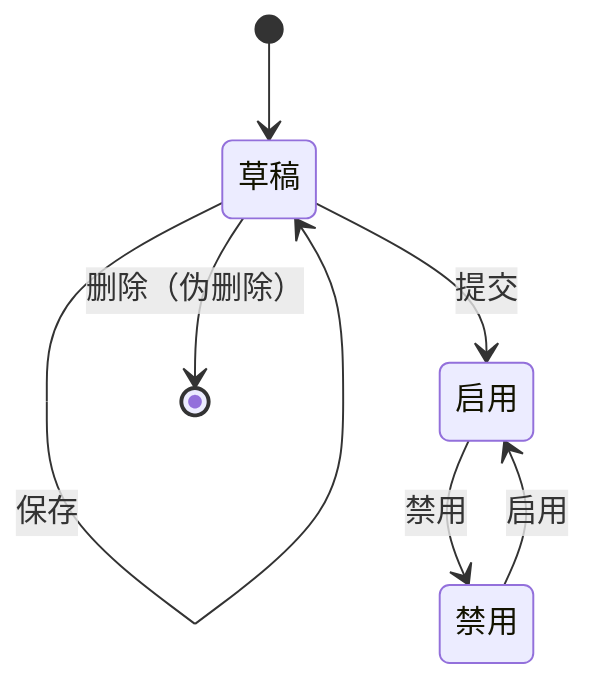
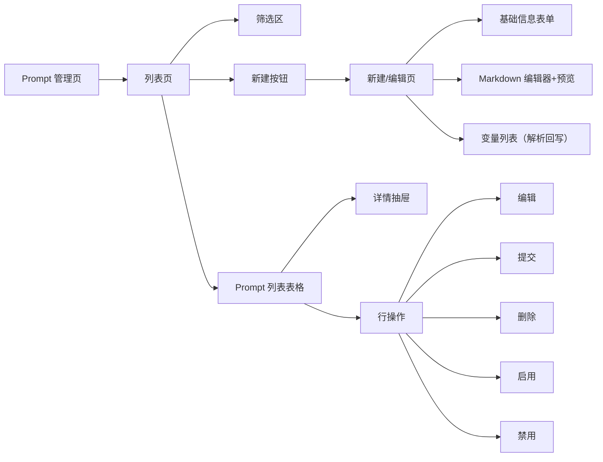
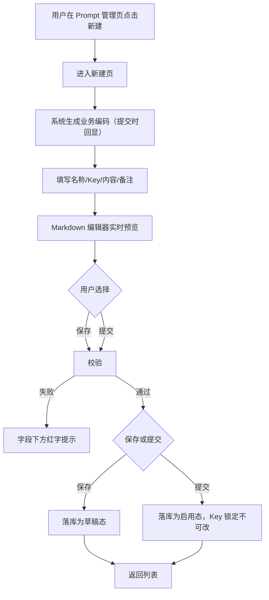
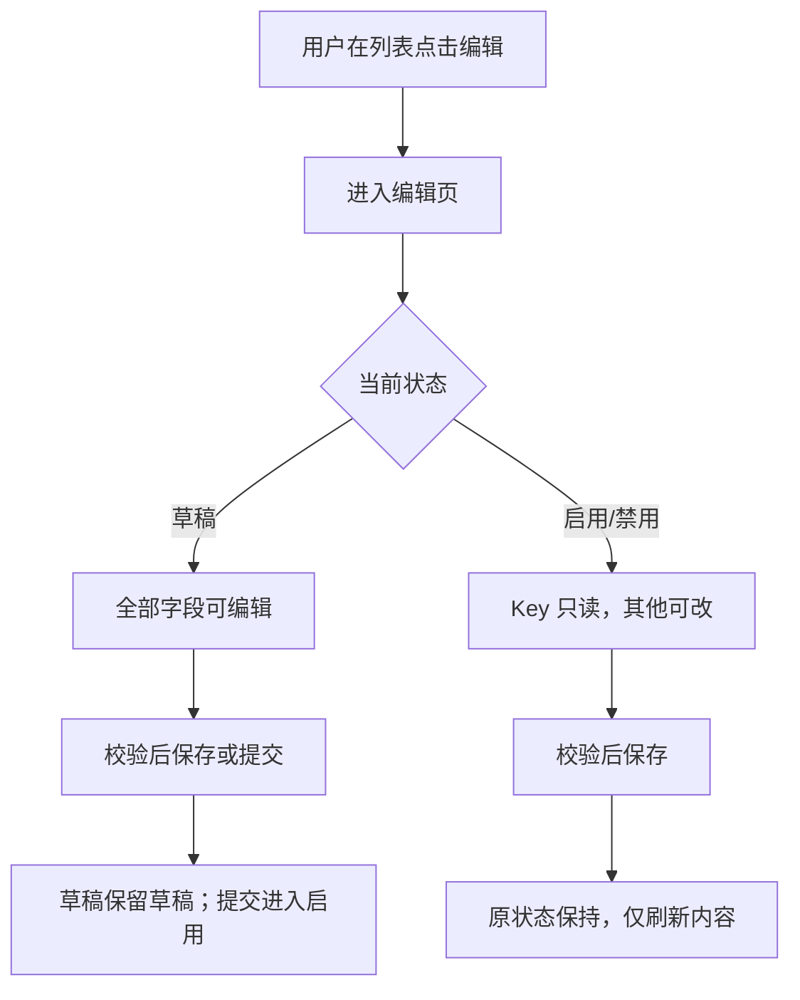
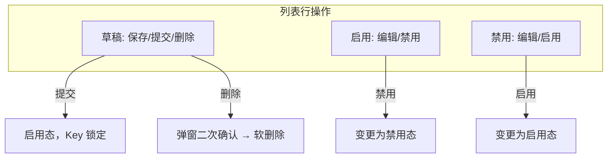
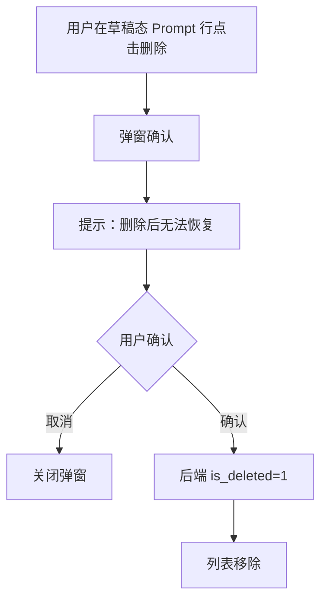
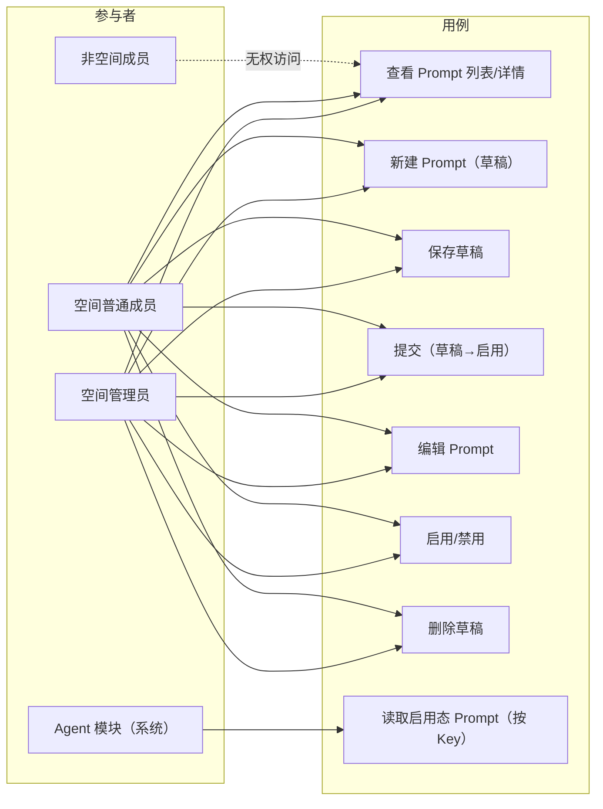

# AgentOps 平台 — Prompt 管理 PRD

| 文档版本 | 日期 | 编写人 | 说明 |
|---------|------|-------|------|
| V1.0 | 2026-06-13 | AgentOps Team | Prompt 管理模块 PRD 初稿 |
| V1.1 | 2026-06-13 | AgentOps Team | 对齐《UI 信息架构与导航规范》：Prompt 管理位于空间 Shell「模型与工具」分组下 |

---

## 1. 产品/需求背景

AgentOps 平台采用「平台级能力 + 空间内资源」的两层信息架构。其中 **Prompt（提示词）管理** 是空间内资源，与模型管理、Agent 管理、运行时、Skill 管理、工具管理同级，受空间隔离与空间成员鉴权约束。

平台用户在构建 Agent 时，需要一份可被沉淀、复用、治理的提示词资产：

- Agent 在配置时通过 **Prompt Key** 引用某条已经被「启用」的提示词，避免每个 Agent 单独维护散落的提示词字符串；
- 同一份提示词可被空间内多个 Agent 复用，调整提示词可统一升级 Agent 的对话基线；
- 需要状态流转能力区分草稿和正式版本，避免 Agent 错误引用未完成的提示词。

本 PRD 聚焦 **空间内提示词的增、删、查、改与状态流转**，作为 Agent 模块的输入资产。

---

## 2. 目标与范围

### 2.1 目标

- 在每个空间内提供独立、可治理的 Prompt 资产库；
- 通过 **草稿 → 启用 ↔ 禁用** 的状态流转区分调试态与生效态，仅启用态可被 Agent 引用；
- 通过 **Prompt Key**（空间内唯一）作为 Agent 引用提示词的稳定标识；
- 提示词内容支持 Markdown 与 `{{变量名}}` 占位符，运行时由 Agent 模块塑定具体值。

### 2.2 范围

| 范围 | 是否包含 | 说明 |
|------|----------|------|
| Prompt 新增 | 包含 | 在空间内新建 Prompt 草稿，生成业务编码 |
| Prompt 保存 | 包含 | 反复保存草稿态 Prompt |
| Prompt 提交 | 包含 | 草稿态提交后进入启用态，可被 Agent 引用 |
| Prompt 编辑 | 包含 | 草稿态可编辑全部字段；启用/禁用态可编辑名称、内容、备注；Key 一经提交不可修改 |
| Prompt 删除 | 包含 | 仅草稿态允许删除（伪删除） |
| Prompt 启用 | 包含 | 禁用态 → 启用态 |
| Prompt 禁用 | 包含 | 启用态 → 禁用态 |
| Prompt 列表 / 详情 | 包含 | 支持按状态、Key、名称、关键字筛选 |
| Markdown 编辑器 | 包含 | 提示词内容字段提供 Markdown 编辑/预览 |
| 变量占位符语法 | 包含 | 仅定义 `{{变量名}}` 占位符语法和解析规则；运行时塑定由 Agent 模块承接 |
| Prompt 多版本管理 | 不包含 | 本期一条 Prompt 仅保留最新内容；历史版本能力后续迭代 |
| Prompt 跨空间共享 | 不包含 | Prompt 严格归属空间，不允许跨空间共享或复制（除非由 Agent 模块通过 import 能力承接，本期不做） |
| Prompt 与 Agent 的引用关系视图 | 不包含 | 「该 Prompt 被哪些 Agent 引用」由 Agent 模块承接，本期不做 |
| 富文本/HTML 渲染 | 不包含 | 仅渲染 Markdown 文本，不支持嵌入脚本或 HTML 标签 |
| 批量导入/导出 | 不包含 | 后续迭代考虑 |

### 2.3 Prompt 字段

| 字段 | 必填 | 规则 | 示例 |
|------|------|------|------|
| 业务编码 | 是 | 系统生成，不可手工编辑或修改。格式：`PR` + `yyyyMMddHHmmssSSS` + 四位随机数 | `PR202606131426301234567` |
| 空间编码 | 是 | 系统注入，归属空间；Prompt 必须挂在某个空间下 | `SP202606131426301234567` |
| 提示词名称 | 是 | 1～50 字符；同空间内不要求唯一，仅作展示用 | `客服-开场白` |
| 提示词 Key | 是 | 1～64 字符；只允许英文字母、数字、下划线、中划线；**同一空间内唯一**；草稿态可修改，**提交进入启用态后不可修改** | `customer_service_opening` |
| 提示词内容 | 是 | Markdown 文本，≤ 10,000 字符；支持 `{{变量名}}` 变量占位符 | 见 §2.5 |
| 状态 | 是 | 枚举：草稿、启用、禁用 | `草稿` |
| 备注 | 否 | ≤ 200 字符 | `用于客服 Agent 的开场白` |
| 创建人 | 是 | 系统记录 | `张三` |
| 创建时间 | 是 | 系统记录 | `2026-06-13 14:26:30` |
| 最近修改人 | 是 | 系统记录 | `张三` |
| 最近修改时间 | 是 | 系统记录 | `2026-06-13 15:42:18` |
| 是否删除 | 是 | 软删除标识 | `否` / `是` |

### 2.4 状态定义与流转

状态流转与《用户管理 PRD》保持一致风格：

| 状态 | 说明 | 允许操作 |
|------|------|----------|
| 草稿 | Prompt 已创建但未正式启用，**不可被 Agent 引用**，可继续编辑或删除 | 保存、提交、删除、编辑 Key |
| 启用 | Prompt 已正式生效，**可被 Agent 引用** | 编辑（除 Key）、禁用 |
| 禁用 | Prompt 暂时停用，**不可被新建/编辑的 Agent 引用**；已引用该 Prompt 的 Agent 在运行时按「Agent 模块策略」处理（本 PRD 不约束） | 编辑（除 Key）、启用 |



> 说明：草稿态是唯一允许删除的状态；启用/禁用态不允许删除（避免被 Agent 引用的提示词被悄悄移除）。如需移除已启用的 Prompt，须先禁用，再人工评估是否需要保留。

### 2.5 提示词内容与变量占位符

- **格式**：Markdown，UTF-8 编码，≤ 10,000 字符。
- **变量占位符**：使用 `{{变量名}}` 作为占位语法。
  - 变量名规则：英文字母、数字、下划线，长度 1～32，必须以字母或下划线开头；
  - 大小写敏感；
  - 同一占位符可在内容中出现多次，运行时同一变量塑定相同值；
  - 占位符在 Markdown 编辑器中以浅色高亮显示，便于识别；
- **解析职责**：本模块仅约束「占位符语法 + 提取出的变量列表」，不负责运行时塑定。运行时塑定由 Agent 模块承接（读取 Agent 入参或上下文，对占位符进行替换）。
- **Prompt 详情中展示「变量列表」**：保存时由后端解析提示词内容并抽取变量名集合，回写到详情页只读字段「变量列表」，便于 Agent 配置时对齐。

**示例**：

```markdown
你是一名{{role}}，请用{{language}}回答用户问题。

用户问题：
{{user_question}}

请按以下结构回答：
1. 关键结论
2. 详细说明
```

→ 变量列表：`role`, `language`, `user_question`

---

## 3. 系统线框图（必选）

> 全平台 UI 信息架构与导航以《UI 信息架构与导航规范》（`doc/产品方案/2026-06-13_UI信息架构与导航规范.md`）为单一来源。本节仅描述本模块在空间 Shell 中的位置与模块内页面结构。

### 3.1 在空间 Shell 中的位置

Prompt 管理位于空间 Shell 左侧导航的「模型与工具」分组下，与模型管理、Skill 管理、工具管理同组。

```text
空间 Shell
┌──────────────────────────────────────────────────────────────────────┐
│ [Logo] AgentOps │ 当前空间：家庭客服 ▼          [👤 当前用户 ▼]      │
├──────────────────┬────────────────────────────────────────────────────┤
│ 📊 工作台         │                                                    │
│ ━ Agent 与沙箱 ━  │                                                    │
│ ━ 模型与工具 ━    │                                                    │
│  🧠 模型管理      │                                                    │
│  📝 Prompt 管理◀│  当前页：Prompt 管理                                │
│  🛠 Skill 管理    │                                                    │
│  🔧 工具管理      │                                                    │
│ ━ 调试与评测 ━    │                                                    │
│ 👥 空间成员       │                                                    │
└──────────────────┴────────────────────────────────────────────────────┘
```

### 3.2 模块页面结构



| 模块 | 类型 | 职责 |
|------|------|------|
| 列表页 | 表格 + 筛选 | 展示当前空间下全部 Prompt |
| 新建/编辑页 | 双栏布局 | 左侧基础信息，右侧 Markdown 编辑器 + 预览 |
| 详情抽屉 | 抽屉 | 只读查看完整内容、变量列表、变更记录 |

---

## 4. 业务流程图（必选）

### 4.1 新增 Prompt



### 4.2 编辑 Prompt



### 4.3 状态变更（提交 / 启用 / 禁用 / 删除）



### 4.4 删除 Prompt 流程



> 仅草稿态允许删除；启用/禁用态行的「删除」按钮不出现。

### 4.5 Agent 引用 Prompt（外部依赖示意）

```mermaid
flowchart LR
  A[Agent 配置页] --> B[选择 Prompt]
  B --> C[仅可见启用态 Prompt]
  C --> D[按 Key 引用]
  D --> E[运行时 Agent 模块对 {{变量}} 进行塑定]
```

> 此流程由 **Agent 管理模块** 承接，本 PRD 仅声明对外契约：①以 Key 引用；②仅启用态可被新引用。

---

## 5. 用例图（必选）



**图例说明**：

| 参与者 | 含义 |
|--------|------|
| 空间管理员 | 该空间的管理员（含创建人），拥有 Prompt 全部增删改查权限 |
| 空间普通成员 | 本期与管理员一致，可对 Prompt 进行增删改查（与《空间管理 PRD》中「普通成员仅能使用空间资源」存在差异，详见 §10） |
| 非空间成员 | 不可见空间，无法访问 Prompt 模块 |
| Agent 模块 | 系统内部参与者，运行时按 Key 拉取启用态 Prompt 内容 |

| 用例 | 含义 | 优先级 |
|------|------|--------|
| 查看 Prompt 列表/详情 | 列表 + 抽屉式详情 | P0 |
| 新建 Prompt（草稿） | 创建草稿态 Prompt | P0 |
| 保存草稿 | 反复编辑草稿 | P0 |
| 提交（草稿→启用） | 草稿态 Prompt 提交进入启用 | P0 |
| 编辑 Prompt | 启用/禁用态可编辑内容 | P0 |
| 启用/禁用 | 启用 ↔ 禁用切换 | P0 |
| 删除草稿 | 仅草稿态可删除（软删除） | P0 |
| 读取启用态 Prompt | 供 Agent 模块按 Key 拉取 | P0 |

---

## 6. 用户与场景

### 6.1 用户角色

- **空间管理员 / 空间普通成员**：均可对 Prompt 进行增删改查与状态变更。
- **非空间成员**：不可见。
- **Agent 模块**（系统参与者）：以 Key 为标识只读拉取启用态 Prompt 内容。

### 6.2 典型用户故事

- 作为空间成员，我希望先把一段提示词以「草稿」状态保存下来反复打磨，确认效果后再提交为启用态供 Agent 引用。
- 作为空间成员，我希望通过 Markdown 编辑器边写边预览，避免发布后才发现格式错误。
- 作为空间成员，我希望提示词里能写 `{{user_question}}` 这样的变量占位符，让 Agent 在运行时塑定实际内容。
- 作为空间成员，我希望某条提示词出问题时能临时禁用，而不是直接删除，避免影响已经引用它的 Agent 后续诊断。
- 作为 Agent 模块，我希望按 `Key` 稳定拉取一条启用态提示词，不用关心它的内部业务编码。

---

## 7. 功能需求

| 序号 | 功能点 | 简要说明 | 优先级 |
|------|--------|----------|--------|
| 1 | 空间隔离 | Prompt 必须挂在当前空间下；列表/详情/读取均按空间过滤；非成员不可见 | P0 |
| 2 | Prompt 列表 | 表格展示：名称、Key、状态、最近修改人/时间、操作；支持分页 20/页 | P0 |
| 3 | 列表筛选 | 按状态、Key、名称、关键字（命中名称/Key/备注）筛选；默认按修改时间倒序 | P0 |
| 4 | 新建 Prompt | 弹出/进入新建页，录入名称、Key、内容（Markdown）、备注；可保存为草稿或直接提交为启用 | P0 |
| 5 | 业务编码 | 系统生成，格式 `PR + yyyyMMddHHmmssSSS + 4 位随机数`，不可手工编辑 | P0 |
| 6 | Prompt Key 校验 | 字符集英数下划中划线；空间内唯一；草稿态可改；提交进入启用态后不可改 | P0 |
| 7 | Markdown 编辑器 | 提供编辑+实时预览；支持代码块、列表、加粗等基础语法；不支持嵌入 HTML 脚本 | P0 |
| 8 | 变量占位符识别 | `{{变量名}}` 高亮展示；保存时后端解析并抽取变量列表回写到详情 | P0 |
| 9 | 变量列表展示 | 详情抽屉以只读形式展示当前 Prompt 的变量集合 | P1 |
| 10 | 保存草稿 | 草稿态 Prompt 反复保存，仅基础校验（Key 字符集 + 长度 + 重复） | P0 |
| 11 | 提交 | 草稿 → 启用，触发完整校验；提交后 Key 锁定 | P0 |
| 12 | 编辑 | 启用/禁用态可改名称、内容、备注；Key 只读 | P0 |
| 13 | 启用 / 禁用 | 启用 ↔ 禁用切换；按钮按当前状态显隐 | P0 |
| 14 | 删除（仅草稿） | 草稿态行展示删除按钮；二次确认后软删除（`is_deleted=1`） | P0 |
| 15 | 详情抽屉 | 只读查看 Prompt 全部字段、变量列表、创建/修改信息 | P1 |
| 16 | 状态徽标 | 列表行展示状态彩色徽标（草稿=灰、启用=绿、禁用=红） | P1 |
| 17 | 对外读取契约 | 提供按 (空间编码, Key) 读取「启用态」Prompt 内容的内部接口，供 Agent 模块调用 | P0 |
| 18 | 操作审计 | 新增、保存、提交、编辑、启用、禁用、删除均写入审计日志（依赖系统设置-审计日志） | P0 |

---

## 8. 原型图/界面说明（必选）

### 8.1 Prompt 列表页

```text
┌──────────────────────────────────────────────────────────────────────────────────┐
│ 当前空间：家庭客服 Agent  /  Prompt 管理                          [当前用户▼]    │
├──────────────────────────────────────────────────────────────────────────────────┤
│  关键字 [_____________]   状态 [全部▼]   Key [____________]   [查询] [+ 新建]    │
├──────────────────────────────────────────────────────────────────────────────────┤
│ 名称              │ Key                       │ 状态  │ 最近修改         │ 操作   │
│ 客服-开场白        │ customer_service_opening │ 启用  │ 张三 06-13 15:42 │ ⋯     │
│ FAQ-保险类         │ faq_insurance            │ 启用  │ 李四 06-13 14:01 │ ⋯     │
│ 调试用-test01      │ test01                   │ 草稿  │ 张三 06-13 13:20 │ ⋯     │
│ 旧版开场白          │ legacy_opening           │ 禁用  │ 张三 06-12 09:11 │ ⋯     │
│ ...                                                                              │
│                                          [< 1 2 3 ... 5 >]                       │
└──────────────────────────────────────────────────────────────────────────────────┘
```

**行操作（按状态显隐）**：

| 状态 | 操作按钮 |
|------|---------|
| 草稿 | 编辑、提交、删除 |
| 启用 | 查看、编辑、禁用 |
| 禁用 | 查看、编辑、启用 |

### 8.2 新建 / 编辑 Prompt 页

```text
┌──────────────────────────────────────────────────────────────────────────────────┐
│ Prompt 管理 / 新建 Prompt                                                         │
├──────────────────────────────────────────────────────────────────────────────────┤
│ ┌─ 基础信息 ────────────────────────┐ ┌─ 提示词内容（Markdown） ─────────────┐  │
│ │ 业务编码   [系统提交后生成]       │ │ ┌───────────────┬───────────────┐    │ │
│ │ 名称 *     [客服-开场白         ] │ │ │  编辑          │   预览        │    │ │
│ │ Key *      [customer_service_op…]│ │ │               │               │    │ │
│ │           （草稿态可改，提交后锁定）│ │ │ 你是一名{{role}}│ 你是一名 角色  │    │ │
│ │ 状态       草稿                    │ │ │ ...           │ ...           │    │ │
│ │ 备注       [_____________________]│ │ │               │               │    │ │
│ │           [_____________________]│ │ └───────────────┴───────────────┘    │ │
│ │ 变量列表   [role, language ...]   │ │ 变量占位 {{变量名}} 浅色高亮展示       │ │
│ │           （保存后系统解析回写）  │ │                                       │ │
│ └────────────────────────────────────┘ └──────────────────────────────────────┘  │
│                                                                                  │
│                              [取消]   [保存为草稿]   [保存并提交]                 │
└──────────────────────────────────────────────────────────────────────────────────┘
```

**说明**：
- 业务编码字段在新建时占位提示「系统生成」，提交成功后回显；
- Key 字段在草稿态可编辑，提交后变为只读灰显并附「Key 已锁定」提示；
- 变量列表在用户暂停输入 1 秒后自动解析回写（前端预解析，后端保存时再次校验）；
- 编辑场景下页面标题改为「编辑 Prompt - {名称}」，按钮根据当前状态显示：草稿态显示「保存为草稿/保存并提交」，启用/禁用态显示「保存」。

### 8.3 详情抽屉

```text
┌──────────────────────────────────────────┐
│  Prompt 详情                          ✕  │
├──────────────────────────────────────────┤
│  业务编码  PR202606131426301234567       │
│  名称      客服-开场白                   │
│  Key       customer_service_opening      │
│  状态      [启用]                         │
│  备注      用于客服 Agent 的开场白        │
│                                          │
│  内容（Markdown 渲染）                    │
│  ┌────────────────────────────────────┐  │
│  │ 你是一名 角色，请用 语言 回答…       │  │
│  └────────────────────────────────────┘  │
│                                          │
│  变量列表  role, language, user_question │
│                                          │
│  创建人    张三   06-13 14:26            │
│  最近修改  张三   06-13 15:42            │
└──────────────────────────────────────────┘
```

### 8.4 删除确认弹窗（仅草稿）

```text
┌────────────────────────────────────────────────────┐
│  ⚠ 删除 Prompt                                ✕  │
├────────────────────────────────────────────────────┤
│  确定删除「调试用-test01」吗？                       │
│  删除后，该提示词将不再出现在列表中。               │
├────────────────────────────────────────────────────┤
│                              [取消]   [确定删除]   │
└────────────────────────────────────────────────────┘
```

> 删除仅对草稿态开放；启用/禁用态行不展示删除按钮。删除后采用软删除，前端不再展示。

### 8.5 关键状态

| 状态 | 说明 |
|------|------|
| 加载中 | 列表区/编辑区展示骨架屏 |
| 空态 | 空间内尚未创建任何 Prompt 时，列表区展示「创建你的第一条提示词，开始构建 Agent 资产」+「+ 新建」按钮 |
| 校验失败 | 字段下方红字提示：Key 为空 / Key 字符非法 / Key 重复 / 内容超长 / 提交时内容为空 |
| Key 重复 | Key 输入框失焦时即时校验，红字提示「该 Key 已被空间内其他 Prompt 占用」 |
| 提交成功 | Toast「提交成功，Prompt 已启用」，跳转列表 |
| 状态切换成功 | Toast「已启用 / 已禁用」 |
| 无权限 | 非空间成员通过 URL 直访时，前端 toast「无权限访问」并跳回空间管理页 |

---

## 9. 非功能需求

- **性能**：
  - 列表页分页查询响应 < 1s；
  - Markdown 实时预览本地渲染，输入到预览刷新延迟 < 200ms；
  - 对外读取契约（Agent 模块按 Key 拉取启用态 Prompt）应缓存，命中缓存 < 50ms；Prompt 状态/内容变更时同步刷新缓存。
- **安全/权限**：
  - 仅空间成员（管理员或普通成员）可访问当前空间的 Prompt 模块；后端必须按空间编码 + 当前用户进行强制鉴权；
  - 提示词内容渲染须 XSS 安全：禁止执行 `<script>`/事件属性等；Markdown 渲染采用白名单策略；
  - 对外读取契约只返回启用态内容，不暴露草稿态/禁用态。
- **数据治理**：
  - 删除采用软删除（`is_deleted=1`）；
  - Prompt 内容长度上限 10,000 字符；超出由后端拒绝并给出明确错误；
  - 历次变更通过审计日志可追溯（不在 Prompt 模块自身展示版本回滚）。
- **审计**：依赖系统设置-审计日志能力，将增、删、改、状态切换事件写入。
- **空间隔离**：Prompt 不可跨空间共享；切换空间后列表必须刷新为目标空间数据。
- **兼容/多端**：本期仅 Web；编辑器双栏布局在 1280px 以上保证编辑/预览各占 50%；1024px 以下切换为上下布局。

---

## 10. 与现有功能的关系

- **与空间管理（已交付 PRD）**：
  - Prompt 严格归属空间；空间软删除后，其下 Prompt 整体不再可访问，但底层数据保留；
  - 空间成员资格变化时，前端列表/详情应同步过滤；
  - **本期对成员角色不做差异化**：空间管理员与普通成员对 Prompt 都拥有完整增删改查权限；这与《空间管理 PRD》中「普通成员仅能使用空间资源」存在轻微差异，差异由后续 Skill/工具/Agent 等子模块统一在「空间内资源权限」议题中收敛，本期 PRD 范围内不细分。
- **与用户管理（已交付 PRD）**：
  - 创建人、最近修改人取自当前登录用户；只有启用态用户可登录并操作 Prompt。
- **与系统设置（已交付 PRD）**：
  - Prompt 操作事件写入审计日志；
  - 后续若新增「Prompt 内容最大长度」「Prompt 名称命名规则」等全局策略，可在系统设置中追加，本期不做。
- **与 Agent 管理（后续模块）**：
  - 提供按 (空间编码, Key) 读取启用态 Prompt 内容的内部契约；
  - 变量占位符语法在本 PRD 定义，运行时塑定由 Agent 模块承接；
  - 「Prompt 被哪些 Agent 引用」由 Agent 模块承接，本期不做。
- **与运行时（后续模块）**：变量塑定后的最终提示词由运行时拼接，与本模块无直接交互。

---

## 11. 验收标准

- [ ] Prompt 模块仅在已选定空间的上下文中可见；非空间成员通过 URL 直访返回 403 并被引导回空间管理页。
- [ ] 业务编码格式为 `PR + yyyyMMddHHmmssSSS + 4 位随机数`，由系统生成不可手工编辑或修改。
- [ ] 同一空间内 Prompt Key 唯一；不同空间间允许同 Key；草稿态可修改 Key，提交进入启用态后 Key 不可修改。
- [ ] Key 字符集合校验：仅允许英文字母、数字、下划线、中划线；非法字符给出明确错误提示。
- [ ] Markdown 编辑器支持实时预览；预览不执行 `<script>`、事件属性等危险内容。
- [ ] `{{变量名}}` 占位符在编辑器中高亮展示；保存时后端解析变量并回写到详情的「变量列表」字段。
- [ ] 草稿态可保存（仅基础校验）、提交（完整校验后进入启用）、删除（二次确认后软删除）。
- [ ] 启用态可编辑名称/内容/备注，Key 只读；可禁用。
- [ ] 禁用态可编辑名称/内容/备注，Key 只读；可启用。
- [ ] 启用/禁用状态下不展示「删除」按钮，且后端拒绝越权删除请求。
- [ ] 列表支持按状态、Key、名称、关键字筛选；默认按修改时间倒序；分页 20/页。
- [ ] 详情抽屉展示业务编码、名称、Key、状态、内容（Markdown 渲染）、变量列表、备注、创建人/时间、最近修改人/时间。
- [ ] 提供按 (空间编码, Key) 读取启用态 Prompt 内容的对外契约；返回结构包含 Prompt 内容与变量列表；草稿态/禁用态不可被该接口返回。
- [ ] 全部增、删、改、状态切换事件写入审计日志，可在系统设置-审计日志中查到对应记录。
- [ ] 空态展示「创建你的第一条提示词」引导文案。
- [ ] Prompt 内容超过 10,000 字符时后端拒绝并返回明确错误。
