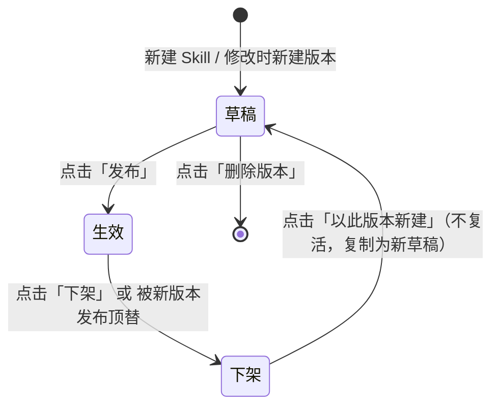
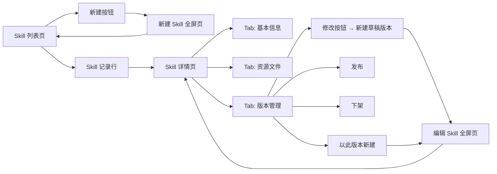
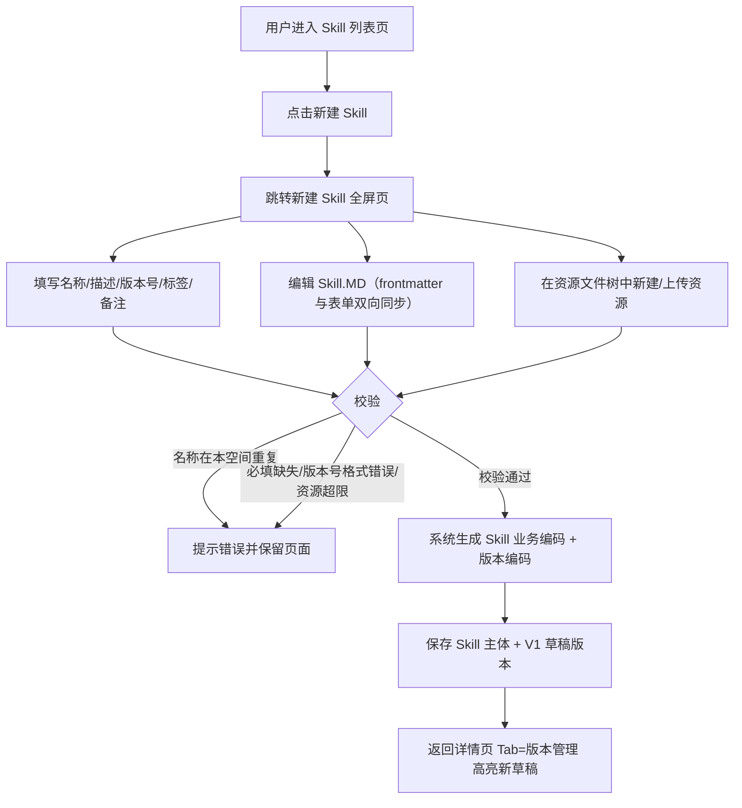
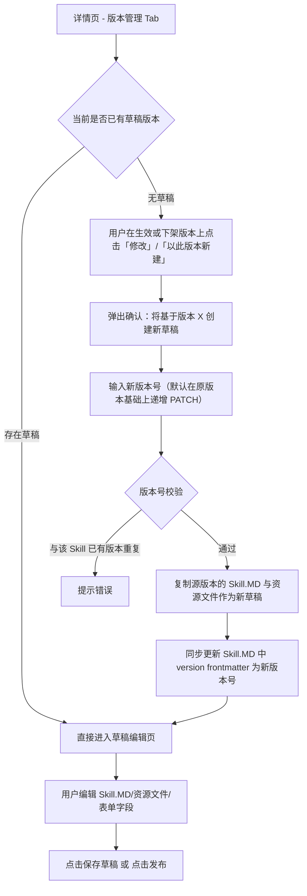
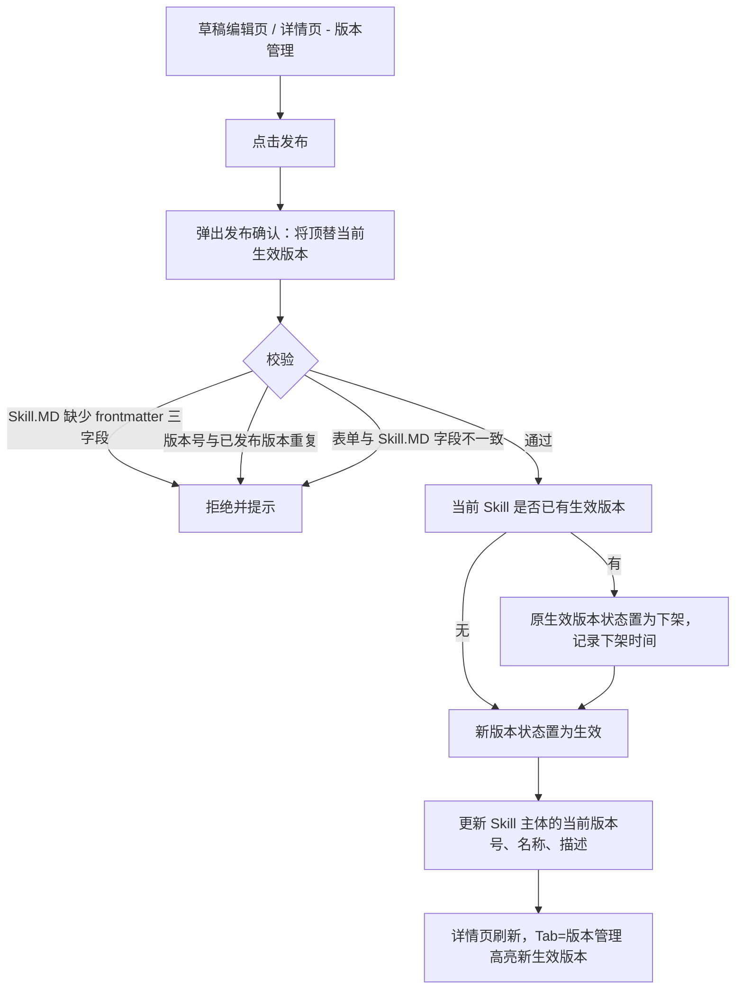
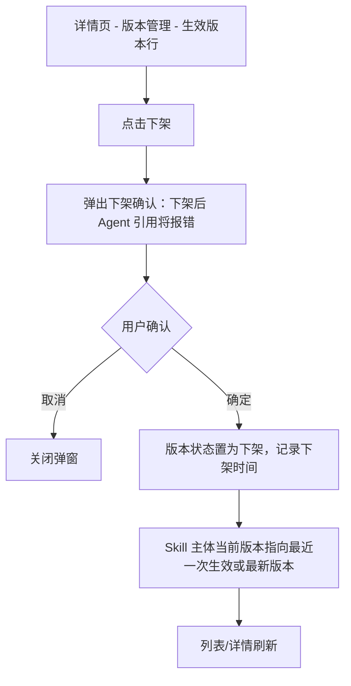
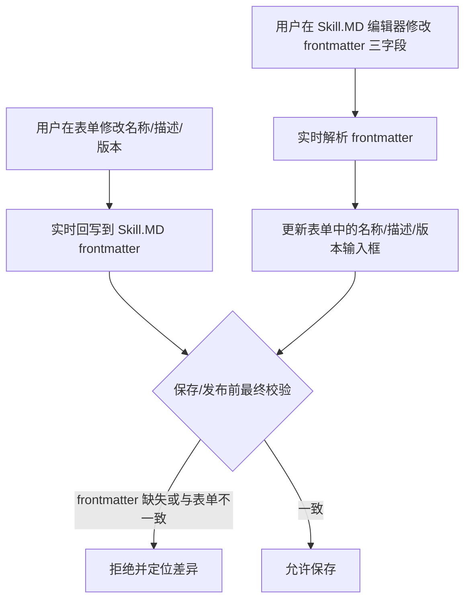
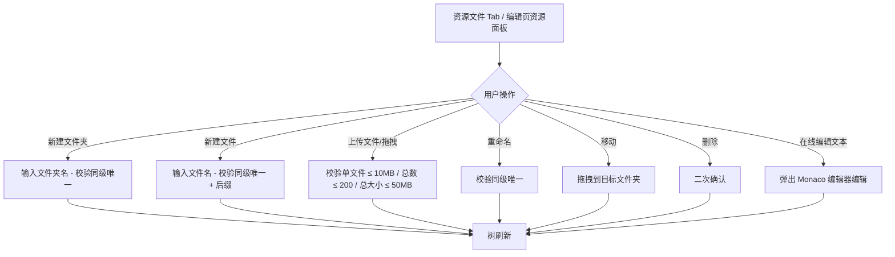
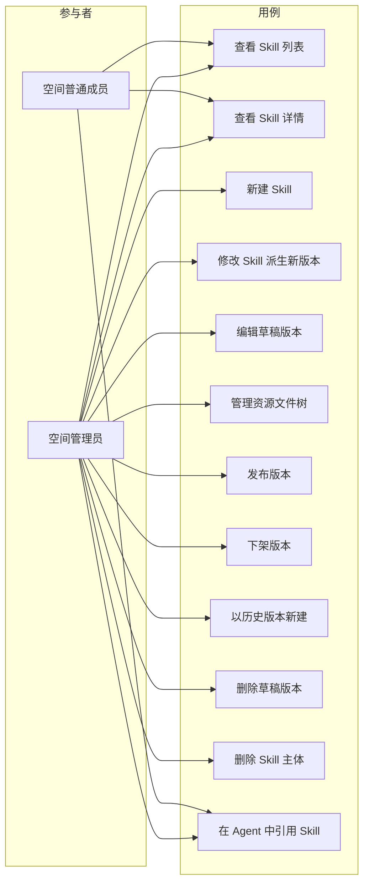

# AgentOps 平台 — Skill 管理 PRD

| 文档版本 | 日期 | 编写人 | 说明 |
|---------|------|-------|------|
| V1.0 | 2026-06-13 | AgentOps Team | Skill 管理模块 PRD 初稿 |
| V1.1 | 2026-06-13 | AgentOps Team | 对齐《UI 信息架构与导航规范》：Skill 管理位于空间 Shell「模型与工具」分组下 |

---

## 1. 产品/需求背景

AgentOps 平台中，**Skill（技能）** 是 Agent 在特定业务场景下的「专家手册」——以 Markdown 文件（`Skill.MD`）描述何时调用、如何执行、调用哪些工具，并通过资源文件夹携带模板、参考资料、脚本等附加产物。一个 Skill 可被多个 Agent 引用、被运行时按上下文动态加载，是 Agent 复用业务知识的核心载体。

当前平台已具备 **用户管理**、**空间管理**、**模型管理** 能力，但尚未提供空间内的 Skill 管理能力。Agent 模块、运行时引擎都依赖 Skill 模块先行：必须先在空间内创建 Skill 并发布生效版本，Agent 才能引用。

Skill 与模型、Prompt 不同的两个关键特点：

1. **Skill 由 Skill.MD + 资源文件夹组成**：Skill.MD 是入口说明文件（含 frontmatter：`name` / `description` / `version`），资源文件夹则是 Skill.MD 之外的所有附属文件（模板、示例、辅助脚本等），需以**树形结构**进行管理。
2. **Skill 必须支持多版本管理**：业务知识会持续演进，每次修改 Skill 都需保留历史版本，可追溯、可对比、可回退；同一 Skill 同一时刻只能有一个生效版本，新版本发布会替换旧的生效版本。

为保证编辑大段 Markdown、维护多文件树时的操作空间，Skill 的新增/编辑界面采用 **独立全屏页面**（区别于模型管理的右侧抽屉）；Skill 详情页采用 **Tab 切换**（基本信息 / 资源文件 / 版本管理），顶部固定展示关键信息（名称、编号、当前版本）。

---

## 2. 目标与范围

### 2.1 目标

- 在空间内提供 Skill 的全生命周期管理：创建、编辑、发布、下架，作为 Agent 引用业务知识的基础。
- 通过「草稿 / 生效 / 下架」三态状态机（在版本维度上）控制 Skill 可用性，保护已被 Agent 引用的版本不被误改。
- 提供 **基于版本的修改流程**：每次修改 Skill 时自动创建新版本（草稿态），编辑完成后点击「发布」使新版本生效、旧版本自动下架。
- **Skill.MD frontmatter 与表单字段双向同步**：用户既可在表单中改写名称/描述/版本，也可直接编辑 Skill.MD 的 frontmatter，两侧实时一致。
- 提供 **资源文件树形管理**：支持文件夹与文件的新增、重命名、移动、删除、上传、在线编辑。
- 通过独立的全屏页承载新增/编辑界面，提供良好的大段内容编辑体验。

### 2.2 范围

| 范围 | 是否包含 | 说明 |
|------|----------|------|
| Skill 新建 | 包含 | 进入独立的「新建 Skill」页面；提交后生成 Skill 主体并自动创建 V1 草稿版本 |
| Skill 编辑 | 包含 | 在某个版本上进行修改；非当前编辑版本不可改 |
| Skill 详情页 | 包含 | 顶部关键信息 + Tab（基本信息 / 资源文件 / 版本管理） |
| 版本新建 | 包含 | 在已有生效版本上点击「修改」自动创建新草稿版本 |
| 版本发布 | 包含 | 草稿 → 生效；同一 Skill 仅允许一个生效版本，发布时自动下架旧生效版本 |
| 版本下架 | 包含 | 生效 → 下架；下架后该版本不可再被新 Agent 引用 |
| 版本回退 | 包含 | 在已下架版本上点击「以此版本为基础新建版本」生成新草稿（不直接复活历史版本） |
| 版本删除 | 包含 | 仅草稿态版本可删除 |
| 资源文件树管理 | 包含 | 支持文件夹/文件的增删改、上传、在线文本编辑（针对当前编辑的草稿版本） |
| Skill.MD 双向同步 | 包含 | 名称/描述/版本字段在 Skill.MD frontmatter 与表单间实时同步 |
| Skill 列表 | 包含 | 表格形式展示当前空间内的全部 Skill（以最新版本视角） |
| Skill 删除 | 包含 | Skill 主体软删除；仅在 Skill 「无生效版本且无被任何 Agent 引用过」时允许 |
| Skill.MD 在线运行/Lint | 不包含 | 后续迭代提供 |
| 跨空间 Skill 共享 | 不包含 | Skill 严格归属单个空间 |
| Skill 用量统计 | 不包含 | 后续迭代独立模块承接 |
| Skill 市场/导入导出 | 不包含 | 后续迭代支持 |
| 二进制大文件预览 | 不包含 | 仅支持文本类资源在线预览/编辑，二进制文件仅支持上传/下载/删除 |

### 2.3 Skill 字段（主体）

> Skill 主体描述「这是一个什么 Skill」，与版本无关；版本相关数据见 2.4。

| 字段 | 必填 | 规则 | 示例 |
|------|------|------|------|
| 业务编码 | 是 | 系统生成，**不允许手工编辑或修改**。格式：`SK` + `yyyyMMddHHmmssSSS` + 四位随机数 | `SK202606131426301234567` |
| 名称 | 是 | 1～50 字符；同一空间内不可重复；与当前编辑版本 Skill.MD 的 `name` frontmatter 双向同步 | `银行卡号校验助手` |
| 描述 | 是 | 1～500 字符；与当前编辑版本 Skill.MD 的 `description` frontmatter 双向同步 | `识别中国大陆银行卡号并返回所属银行` |
| 当前版本 | 是 | 系统维护：「最新生效版本号」或「最新版本号（无生效时）」 | `1.2.0` |
| 标签 | 否 | 0～10 个；每个 1～20 字符；用于分类筛选 | `["金融","校验"]` |
| 备注 | 否 | 200 字以内；管理员内部说明 | `银保监披露表更新时需同步刷新资源文件` |
| 所属空间 | 是 | 系统记录，绑定当前空间 ID，不可手工修改 | `SP202606131426301234567` |
| 创建人 | 是 | 系统记录 | `张三` |
| 创建时间 | 是 | 系统记录 | `2026-06-13 14:26:30` |
| 更新人 | 是 | 系统记录 | `李四` |
| 更新时间 | 是 | 系统记录 | `2026-06-13 18:00:00` |
| 是否删除 | 是 | 软删除标识 | `否` / `是` |

### 2.4 Skill 版本字段

> 一个 Skill 拥有多个版本；每个版本独立持有 Skill.MD 与资源文件快照。

| 字段 | 必填 | 规则 | 示例 |
|------|------|------|------|
| 版本编码 | 是 | 系统生成，`SKV` + `yyyyMMddHHmmssSSS` + 四位随机数 | `SKV202606131426301234567` |
| Skill 业务编码 | 是 | 关联到 Skill 主体 | `SK202606131426301234567` |
| 版本号 | 是 | 1～20 字符；同一 Skill 内不可重复；与该版本 Skill.MD 的 `version` frontmatter 双向同步；推荐 SemVer（`MAJOR.MINOR.PATCH`） | `1.2.0` |
| Skill.MD | 是 | Markdown 文本；包含 frontmatter（`name` / `description` / `version`）+ 正文；最大 1MB 文本 | 见示例 |
| 资源文件树 | 否 | 树形结构（文件夹/文件）；总文件数 ≤ 200 个；单文件 ≤ 10MB；总大小 ≤ 50MB | `templates/email.md` |
| 状态 | 是 | 枚举：`草稿` / `生效` / `下架`；新建时默认为 `草稿` | `生效` |
| 发布时间 | 否 | 发布到生效态的时刻 | `2026-06-13 18:00:00` |
| 下架时间 | 否 | 进入下架态的时刻（含被新版本顶替时） | `2026-07-01 09:00:00` |
| 创建人 / 创建时间 / 更新人 / 更新时间 / 是否删除 | 是 | 系统记录，含义同 2.3 | — |

#### Skill.MD 示例（包含 frontmatter）

```markdown
---
name: 银行卡号校验助手
description: 识别中国大陆银行卡号并返回所属银行
version: 1.2.0
---

# 银行卡号校验助手

## When to Use
当用户输入疑似银行卡号字符串时调用本 Skill。

## Steps
1. 调用 `tools/luhn_check.py` 进行 Luhn 校验。
2. 读取 `data/bank_codes.csv` 匹配前 6 位 BIN。
...
```

### 2.5 Skill 与版本状态流转



| 当前版本状态 | 可执行操作 | 说明 |
|-------------|-----------|------|
| 草稿 | 编辑、发布、删除版本 | 草稿可自由修改 Skill.MD 与资源文件；发布会顶替当前生效版本，旧生效版本变为下架 |
| 生效 | 修改（自动派生新草稿）、下架 | 生效版本本身**不可直接编辑**，所有修改必须通过派生新版本进行；同一 Skill 同一时刻仅一个生效版本 |
| 下架 | 以此版本新建（生成新草稿） | 下架版本只读；如需恢复，须复制为新草稿后再发布 |

> **关键约束**：同一 Skill 同一时刻 **最多一个版本处于「生效」状态**；新版本发布时，原生效版本自动转为「下架」。

---

## 3. 系统线框图（必选）

> 全平台 UI 信息架构与导航以《UI 信息架构与导航规范》（`doc/产品方案/2026-06-13_UI信息架构与导航规范.md`）为单一来源。本节仅描述本模块在空间 Shell 中的位置与模块内页面结构。

### 3.1 Skill 管理在空间 Shell 中的位置

Skill 管理位于空间 Shell 左侧导航的「模型与工具」分组下，与模型管理、Prompt 管理、工具管理同组。

```text
空间 Shell
┌──────────────────────────────────────────────────────────────────────┐
│ [Logo] AgentOps │ 当前空间：家庭客服 ▼          [👤 当前用户 ▼]      │
├──────────────────┬────────────────────────────────────────────────────┤
│ 📊 工作台         │                                                    │
│ ━ Agent 与沙箱 ━  │                                                    │
│ ━ 模型与工具 ━    │                                                    │
│  🧠 模型管理      │                                                    │
│  📝 Prompt 管理  │                                                    │
│  🛠 Skill 管理 ◀│  当前页:Skill 列表                                 │
│  🔧 工具管理      │                                                    │
│ ━ 调试与评测 ━    │                                                    │
│ 👥 空间成员       │                                                    │
└──────────────────┴────────────────────────────────────────────────────┘
```

### 3.2 Skill 管理模块页面结构



**模块说明**：

| 模块 | 职责 |
|------|------|
| Skill 列表页 | 表格形式展示当前空间内全部 Skill（按 Skill 主体维度，每行展示当前版本/状态） |
| 新建 Skill 全屏页 | 独立路由页面（非弹窗/抽屉），承载首次创建 Skill 的全部表单，包括 Skill.MD 编辑器与资源文件树管理 |
| Skill 详情页 | 顶部关键信息（名称、编号、版本）固定；下方 Tab 切换基本信息 / 资源文件 / 版本管理 |
| 编辑 Skill 全屏页 | 与「新建 Skill 全屏页」结构一致，仅差异在标题、按钮文案；编辑对象为某个**草稿版本** |
| 版本管理 Tab | 列出该 Skill 的全部版本（含状态/发布时间/创建人）及对应操作 |

---

## 4. 业务流程图（必选）

### 4.1 Skill 新建流程



### 4.2 Skill 修改（派生新版本）流程



### 4.3 版本发布流程



### 4.4 版本下架流程



### 4.5 Skill.MD 双向同步流程



### 4.6 资源文件管理流程（仅作用于当前编辑的草稿版本）



---

## 5. 用例图（必选）



**图例说明**：

| 参与者 | 含义 |
|--------|------|
| 空间管理员 | 包含创建人在内的全部管理员，可对 Skill 与版本执行新增/编辑/发布/下架/删除 |
| 空间普通成员 | 仅可查看 Skill 列表与详情（含已发布版本内容），可在 Agent 中引用生效版本，不能修改 Skill |

| 用例 | 含义 | 优先级 |
|------|------|--------|
| 查看 Skill 列表 | 浏览当前空间内全部 Skill | P0 |
| 查看 Skill 详情 | 顶部关键信息 + 三 Tab 详情 | P0 |
| 新建 Skill | 在独立全屏页录入 Skill 并生成 V1 草稿 | P0 |
| 修改 Skill 派生新版本 | 在生效/下架版本上派生新草稿版本 | P0 |
| 编辑草稿版本 | 在独立全屏页修改 Skill.MD/资源文件/表单字段 | P0 |
| 管理资源文件树 | 文件夹/文件的新增、重命名、移动、删除、上传、在线编辑 | P0 |
| 发布版本 | 草稿 → 生效，自动下架旧生效版本 | P0 |
| 下架版本 | 生效 → 下架 | P0 |
| 以历史版本新建 | 复制下架版本为新草稿 | P1 |
| 删除草稿版本 | 仅草稿可删 | P1 |
| 删除 Skill 主体 | 仅 Skill 无任何生效版本且未被 Agent 引用过 | P1 |
| 在 Agent 中引用 Skill | Agent 模块下游用例，本期不在 Skill 管理范围内实现 | P1 |

---

## 6. 用户与场景

### 6.1 用户角色

- **空间管理员**：可对当前空间内 Skill 执行全部管理操作。
- **空间普通成员**：可查看 Skill 列表与详情（仅生效版本默认展开）、在 Agent 中引用生效版本，但不能创建或修改 Skill。
- **平台管理员（系统设置）**：本期不参与；未来可在系统设置中下发「全局推荐 Skill 模板」（不在本期范围）。

### 6.2 典型用户故事

- 作为空间管理员，我希望能新建一个 Skill「银行卡号校验助手」，把已有的 Skill.MD 与多份资源文件（CSV 数据、Python 脚本、模板文档）一次性整理进来，并保存为草稿。
- 作为空间管理员，我希望在保存草稿后能进入详情页的「版本管理」Tab 点击发布，让 Skill 立刻可被 Agent 引用。
- 作为空间管理员，当业务规则更新时，我希望直接在生效版本上点击「修改」自动得到一个 V1.1 草稿，**而不是直接覆盖** V1.0；编辑无误后点击发布，V1.0 自动下架并保留可查。
- 作为空间管理员，我希望在编辑 Skill 时，**只改一处**就能让表单里的「名称」与 Skill.MD 顶部 frontmatter 的 `name` 字段保持一致——不论我先改了哪一边。
- 作为空间管理员，我希望在资源文件 Tab 里以树形结构组织 `templates/`、`data/`、`tools/` 子目录，能在线打开并编辑 `templates/email.md`，也能拖拽上传 `data/bank_codes.csv`。
- 作为空间管理员，当某个 Skill V1.2 上线后出现问题，我希望能在版本管理 Tab 找到 V1.0，点击「以此版本新建」拿到一个 V1.3 草稿，确认后发布回退。
- 作为空间普通成员，我希望在 Agent 配置中能选择本空间内**生效**的 Skill；下架/草稿版本不应出现在选择列表。

---

## 7. 功能需求

### 7.1 Skill 列表

| 序号 | 功能点 | 简要说明 | 优先级 |
|------|--------|----------|--------|
| 1 | Skill 列表 | 表格展示当前空间内全部 Skill（`is_deleted=0`）；列：名称、业务编码、当前版本号、当前版本状态、标签、更新时间、操作 | P0 |
| 2 | 列表搜索与筛选 | 支持按名称/业务编码模糊搜索；支持按当前版本状态（草稿/生效/下架）筛选；支持按标签多选筛选 | P0 |
| 3 | 列表分页与排序 | 默认按更新时间倒序；分页 20 条/页 | P1 |
| 4 | 空态展示 | 空间内无 Skill 时展示空态插画与「新建 Skill」引导按钮 | P1 |
| 5 | 列表入口跳转 | 点击行跳转 Skill 详情页（默认 Tab：基本信息） | P0 |

### 7.2 新建/编辑 Skill 全屏页

| 序号 | 功能点 | 简要说明 | 优先级 |
|------|--------|----------|--------|
| 6 | 独立全屏页 | 通过独立路由（如 `/skills/new`、`/skills/:code/versions/:vcode/edit`）打开，整页布局，非弹窗/抽屉 | P0 |
| 7 | 表单字段录入 | 名称、描述、版本号、标签、备注；版本号在新建时默认为 `1.0.0`；编辑场景下版本号默认 = 派生时输入的值 | P0 |
| 8 | Skill.MD 编辑器 | 内置 Markdown 编辑器（Monaco / Tiptap），支持语法高亮、frontmatter 折叠/校验 | P0 |
| 9 | Skill.MD ↔ 表单 双向同步 | 修改表单中的「名称/描述/版本号」实时回写到 Skill.MD frontmatter；修改 Skill.MD frontmatter 实时回写到表单；保存/发布时校验严格一致 | P0 |
| 10 | 资源文件树面板 | 编辑页右侧或下方提供资源文件树面板，支持文件夹/文件的增删改查、上传、在线编辑（详见 7.4） | P0 |
| 11 | 离开页面提示 | 存在未保存修改时，路由切换/关闭浏览器前弹出确认 | P0 |
| 12 | 保存草稿 | 主按钮「保存草稿」：仅保存到当前编辑的草稿版本，不改变其状态 | P0 |
| 13 | 直接发布 | 次按钮「保存并发布」：先保存再走发布流程（含校验） | P0 |
| 14 | 取消 | 取消按钮返回详情页或列表页（带未保存确认） | P0 |

### 7.3 Skill 详情页（顶部关键信息 + Tab）

| 序号 | 功能点 | 简要说明 | 优先级 |
|------|--------|----------|--------|
| 15 | 顶部关键信息条 | 固定吸顶展示：Skill 名称、业务编码（可一键复制）、当前版本号、当前版本状态彩色标签 | P0 |
| 16 | Tab：基本信息 | 只读展示 Skill 主体字段（名称、描述、业务编码、当前版本号、标签、备注、创建/更新审计信息）；管理员可见「编辑基本信息」入口（仅可改标签、备注；名称/描述受版本驱动） | P0 |
| 17 | Tab：资源文件 | 默认展示**当前生效版本**的资源文件树（只读预览）；如有草稿，提供下拉切换查看草稿；管理员在草稿上可直接进入编辑模式（详见 7.4） | P0 |
| 18 | Tab：版本管理 | 列表展示该 Skill 全部版本（按版本号倒序）；列：版本号、版本编码、状态、发布时间、下架时间、创建人、创建时间、操作 | P0 |
| 19 | 版本管理操作按钮 | 按版本状态显隐：草稿 → 编辑 / 发布 / 删除；生效 → 修改（派生新版本） / 下架 / 查看；下架 → 以此版本新建 / 查看 | P0 |
| 20 | 查看历史版本只读详情 | 点击「查看」在详情页区域内（或弹层）只读预览该版本的 Skill.MD 与资源文件 | P1 |

### 7.4 资源文件树管理

> 仅在「编辑草稿版本」上下文中可写；查看其它版本均为只读。

| 序号 | 功能点 | 简要说明 | 优先级 |
|------|--------|----------|--------|
| 21 | 树形展示 | Antd Tree 组件展示文件夹/文件层级；文件按名称升序排列；文件夹优先展示 | P0 |
| 22 | 新建文件夹 | 在选中节点下新建文件夹；同级唯一；命名约束：不允许包含 `/` `\` `:` `*` `?` `"` `<` `>` `|`，长度 1～64 字符 | P0 |
| 23 | 新建文件 | 在选中文件夹下新建空白文件；同级唯一；后缀任意，但仅文本类（`.md` `.txt` `.json` `.yaml` `.yml` `.csv` `.py` `.js` `.ts` `.html` 等）支持在线编辑 | P0 |
| 24 | 上传文件 | 支持点击上传与拖拽上传，可一次多文件；自动按目标文件夹放置；超大/超数限制走前端拦截并 toast 提示 | P0 |
| 25 | 重命名 | 同级唯一；约束同 22 | P0 |
| 26 | 移动 | 拖拽至目标文件夹；同级冲突时弹出冲突处理弹窗（取消/保留两份并加后缀） | P1 |
| 27 | 删除 | 文件夹删除会递归删除子项；二次确认 | P0 |
| 28 | 下载 | 单文件下载；文件夹打包下载（zip） | P1 |
| 29 | 在线编辑 | 文本类文件双击或点击「编辑」按钮打开 Monaco 编辑器；保存后立即写入草稿版本（仅在草稿编辑页生效） | P0 |
| 30 | Skill.MD 不在树内 | 资源文件树**不展示** Skill.MD；Skill.MD 只在 Skill.MD 编辑器中维护 | P0 |
| 31 | 容量限制 | 单文件 ≤ 10MB；版本内总文件数 ≤ 200；版本内总大小 ≤ 50MB；超限实时提示 | P0 |

### 7.5 版本流转

| 序号 | 功能点 | 简要说明 | 优先级 |
|------|--------|----------|--------|
| 32 | 创建初始草稿 | 新建 Skill 时同步创建 V1（默认 `1.0.0`）草稿 | P0 |
| 33 | 派生新草稿 | 在生效/下架版本上点击「修改」/「以此版本新建」自动复制 Skill.MD + 资源文件为新草稿；要求输入新版本号且不与已有版本重复；默认建议在源版本上 PATCH+1 | P0 |
| 34 | 同时仅一个草稿 | 同一 Skill 同一时刻**最多存在一个草稿版本**；已有草稿时点击「修改」直接进入该草稿，不再派生 | P0 |
| 35 | 发布版本 | 草稿 → 生效；如已存在生效版本，自动转为下架；同步刷新 Skill 主体的当前版本号/名称/描述 | P0 |
| 36 | 下架版本 | 生效 → 下架；二次确认；下架后 Skill 主体当前版本号回退到最近的下架版本（按发布时间倒序）或保持原值（视产品决策选择保持原值，仅状态改变） | P0 |
| 37 | 删除草稿 | 仅草稿可删；二次确认；后端再次校验状态 | P0 |
| 38 | Skill 主体删除 | 仅当 Skill 无任何「生效」版本且无 Agent 历史引用时允许；软删除 | P1 |
| 39 | 版本号校验 | 同 Skill 内版本号唯一；推荐 SemVer 格式但不强校验（仅警告） | P0 |
| 40 | 版本审计 | 版本的发布、下架、删除操作均记录审计 | P0 |

### 7.6 权限与同步约束

| 序号 | 功能点 | 简要说明 | 优先级 |
|------|--------|----------|--------|
| 41 | 操作按钮显隐 | 「新建」「编辑」「发布」「下架」「删除」「资源文件写操作」按钮仅对空间管理员可见 | P0 |
| 42 | 普通成员视图 | 只读列表 + 只读详情（仅可见生效版本内容；草稿版本对普通成员隐藏） | P0 |
| 43 | frontmatter 校验 | 保存草稿/发布时校验 Skill.MD 必含 frontmatter 三字段（name/description/version）；缺失或与表单不一致时拒绝并定位差异 | P0 |
| 44 | 同步冲突处理 | 用户在编辑器中同时手动编辑表单与 Skill.MD 时，以最后操作为准实时同步；若同步后字符越限（如名称>50 字），立即提示并禁止保存 | P0 |

---

## 8. 原型图/界面说明（必选）

### 8.1 Skill 列表页

```text
┌────────────────────────────────────────────────────────────────────────────────────────┐
│ AgentOps  /  [家庭客服 Agent ▼]  /  Skill                                               │
├────────────────────────────────────────────────────────────────────────────────────────┤
│  Skill 管理                                                                            │
│                                                                                        │
│  [搜索名称/编码 🔍]   状态：[全部 ▼]   标签：[全部 ▼]                  [+ 新建 Skill]  │
│                                                                                        │
│  ┌──────────────────────────────────────────────────────────────────────────────────┐ │
│  │ 名称              │ 业务编码          │ 当前版本 │ 状态 │ 标签         │ 更新时间   │ 操作 │
│  ├───────────────────┼───────────────────┼──────────┼──────┼──────────────┼───────────┼──────┤
│  │ 银行卡号校验助手   │ SK202606131426301 │ 1.2.0    │ 生效 │ 金融, 校验   │ 06-13 18:00 │ 详情 │
│  │ 邮件正文撰写       │ SK202606121026301 │ 0.9.0    │ 草稿 │ 写作         │ 06-12 11:30 │ 详情 │
│  │ 客户问候语模板     │ SK202606101026301 │ 2.1.0    │ 下架 │ 客服         │ 06-10 09:00 │ 详情 │
│  └──────────────────────────────────────────────────────────────────────────────────┘ │
│                                                共 3 条   < 1 >  20 条/页 ▼            │
└────────────────────────────────────────────────────────────────────────────────────────┘
```

**说明**：
- 状态列展示**当前版本状态**（草稿态彩色灰、生效态绿、下架态橙）。
- 操作列仅展示「详情」入口，所有写操作都在详情页内完成，避免在列表上下文做版本相关动作。
- 普通成员可见列表全部列，但点击进入详情后无写操作按钮。

### 8.2 新建/编辑 Skill 全屏页

```text
┌────────────────────────────────────────────────────────────────────────────────────────────────┐
│ AgentOps  /  Skill  /  新建 Skill                                       [取消]  [保存并发布]  [保存草稿] │
├────────────────────────────────────────────────────────────────────────────────────────────────┤
│  ┌─────────────────────────────────────┐ ┌─────────────────────────────────────────────────┐  │
│  │  基本信息                            │ │  Skill.MD 编辑器                                │  │
│  │                                     │ │                                                 │  │
│  │  名称 *                              │ │ ---                                             │  │
│  │  [银行卡号校验助手_______________]   │ │ name: 银行卡号校验助手                          │  │
│  │  描述 *                              │ │ description: 识别中国大陆银行卡号并返回所属银行 │  │
│  │  [识别中国大陆银行卡号并返回所属银行]│ │ version: 1.0.0                                  │  │
│  │  版本号 *                            │ │ ---                                             │  │
│  │  [1.0.0_____________________]       │ │                                                 │  │
│  │  标签                                │ │ # 银行卡号校验助手                              │  │
│  │  [金融] [校验] [+]                  │ │                                                 │  │
│  │  备注                                │ │ ## When to Use                                  │  │
│  │  [...........................]      │ │ 当用户输入疑似银行卡号字符串时调用本 Skill。   │  │
│  │  业务编码：（保存后生成）            │ │ ...                                             │  │
│  │                                     │ │                                                 │  │
│  └─────────────────────────────────────┘ └─────────────────────────────────────────────────┘  │
│                                                                                                │
│  资源文件                                                                                      │
│  ┌──────────────────────────────────┐  ┌────────────────────────────────────────────────┐    │
│  │ 📁 templates                     │  │ 文件预览/编辑区                                │    │
│  │  └─ email.md                     │  │ # 邮件模板                                     │    │
│  │ 📁 data                          │  │ Hello {{customer_name}}, ...                   │    │
│  │  └─ bank_codes.csv               │  │                                                │    │
│  │ 📁 tools                         │  │  [保存] [取消]                                 │    │
│  │  └─ luhn_check.py                │  │                                                │    │
│  │                                  │  │                                                │    │
│  │  [+ 新建文件夹] [+ 新建文件]     │  │                                                │    │
│  │  [↑ 上传]                        │  │                                                │    │
│  └──────────────────────────────────┘  └────────────────────────────────────────────────┘    │
└────────────────────────────────────────────────────────────────────────────────────────────────┘
```

**说明**：
- 整页布局采用上下两段：**上段**为左右两栏（左：基本信息表单；右：Skill.MD 编辑器），**下段**为左右两栏（左：资源文件树；右：文件预览/编辑器）。
- 1280px 以下分辨率自动堆叠：基本信息→Skill.MD→资源文件树→文件编辑器。
- 标题栏右上角主按钮「保存草稿」、副按钮「保存并发布」、文本按钮「取消」。
- 业务编码字段在新建场景下显示「保存后生成」占位文字；编辑场景下显示真实编码并不可改。
- 编辑场景下顶部面包屑显示 `Skill / 银行卡号校验助手 / 编辑 V1.1（草稿）`。

### 8.3 Skill 详情页 — 顶部关键信息条

```text
┌────────────────────────────────────────────────────────────────────────────────────┐
│ AgentOps  /  Skill  /  银行卡号校验助手                                            │
├────────────────────────────────────────────────────────────────────────────────────┤
│  名称：银行卡号校验助手                                                            │
│  编号：SK202606131426301234567 [📋复制]    当前版本：1.2.0  [生效]                  │
└────────────────────────────────────────────────────────────────────────────────────┘
│  [基本信息]   [资源文件]   [版本管理]                                              │
└────────────────────────────────────────────────────────────────────────────────────┘
```

### 8.4 详情页 Tab — 基本信息

```text
┌────────────────────────────────────────────────────────────────────────────────────┐
│  基本信息                                                          [编辑标签/备注] │
│                                                                                    │
│  名称：银行卡号校验助手                                                            │
│  描述：识别中国大陆银行卡号并返回所属银行                                          │
│  业务编码：SK202606131426301234567                                                 │
│  当前版本：1.2.0（生效）                                                           │
│  标签：金融、校验                                                                  │
│  备注：银保监披露表更新时需同步刷新资源文件                                        │
│  创建人 / 时间：张三 / 2026-06-13 14:26:30                                         │
│  更新人 / 时间：李四 / 2026-06-13 18:00:00                                         │
└────────────────────────────────────────────────────────────────────────────────────┘
```

> 「编辑标签/备注」按钮弹出小型抽屉/弹窗，仅修改标签和备注；不影响版本。
> 名称/描述/当前版本号均由「当前生效版本」驱动，不在此 Tab 直接修改。

### 8.5 详情页 Tab — 资源文件

```text
┌────────────────────────────────────────────────────────────────────────────────────┐
│  资源文件      查看版本：[1.2.0 (生效) ▼]  [⏎ 进入草稿编辑]（仅当存在草稿且为管理员） │
│                                                                                    │
│  ┌──────────────────────┐  ┌─────────────────────────────────────────────────┐   │
│  │ 📁 templates         │  │ 文件预览（只读）                                │   │
│  │  └─ email.md         │  │ # 邮件模板                                       │   │
│  │ 📁 data              │  │ Hello {{customer_name}}, ...                    │   │
│  │  └─ bank_codes.csv   │  │                                                 │   │
│  │ 📁 tools             │  │                                                 │   │
│  │  └─ luhn_check.py    │  │                                                 │   │
│  └──────────────────────┘  └─────────────────────────────────────────────────┘   │
└────────────────────────────────────────────────────────────────────────────────────┘
```

> 在详情页的资源文件 Tab 中，**默认只读**展示当前生效版本（或最新版本）的资源；
> 管理员若该 Skill 有草稿版本，可点击「⏎ 进入草稿编辑」跳转到 8.2 编辑全屏页（资源文件树聚焦草稿）。

### 8.6 详情页 Tab — 版本管理

```text
┌────────────────────────────────────────────────────────────────────────────────────┐
│  版本管理                                                          [+ 修改创建新版] │
│                                                                                    │
│  ┌──────────────────────────────────────────────────────────────────────────────┐ │
│  │ 版本号 │ 状态 │ 发布时间       │ 下架时间       │ 创建人 │ 操作                 │ │
│  ├────────┼──────┼────────────────┼────────────────┼────────┼──────────────────────┤ │
│  │ 1.3.0  │ 草稿 │ —              │ —              │ 李四   │ 编辑 / 发布 / 删除   │ │
│  │ 1.2.0  │ 生效 │ 2026-06-10     │ —              │ 李四   │ 修改 / 下架 / 查看   │ │
│  │ 1.1.0  │ 下架 │ 2026-06-01     │ 2026-06-10     │ 张三   │ 以此版本新建 / 查看  │ │
│  │ 1.0.0  │ 下架 │ 2026-05-20     │ 2026-06-01     │ 张三   │ 以此版本新建 / 查看  │ │
│  └──────────────────────────────────────────────────────────────────────────────┘ │
└────────────────────────────────────────────────────────────────────────────────────┘
```

**说明**：
- 顶部「+ 修改创建新版」按钮：当前 Skill 已有草稿时按钮文案改为「继续编辑草稿」并直接跳转草稿编辑页。
- 操作列按版本状态显隐（详见 7.3 序号 19）。
- 「编辑」「修改」「以此版本新建」均跳转到 8.2 全屏编辑页。
- 「发布」「下架」「删除」走二次确认弹窗（详见 8.7、8.8、8.9）。

### 8.7 发布确认弹窗

```text
┌──────────────────────────────────────────────────────────────────┐
│  发布版本                                                  ✕    │
├──────────────────────────────────────────────────────────────────┤
│                                                                  │
│  即将发布 Skill「银行卡号校验助手」的版本 1.3.0。                  │
│  ⚠ 当前生效版本 1.2.0 将自动下架；正在被 Agent 引用的链路        │
│     将在下次调用时使用 1.3.0。                                   │
│                                                                  │
│  请确认 Skill.MD frontmatter（name/description/version）已与    │
│  表单字段一致。                                                  │
│                                                                  │
├──────────────────────────────────────────────────────────────────┤
│                                       [取消]   [确定发布]        │
└──────────────────────────────────────────────────────────────────┘
```

### 8.8 下架确认弹窗

```text
┌──────────────────────────────────────────────────────────────────┐
│  下架版本                                                  ✕    │
├──────────────────────────────────────────────────────────────────┤
│                                                                  │
│  确定下架 Skill「银行卡号校验助手」V1.2.0？                       │
│  下架后，该 Skill 将无生效版本可用，引用此 Skill 的 Agent 将报错。│
│  如需替换，请先发布另一版本再下架。                              │
│                                                                  │
├──────────────────────────────────────────────────────────────────┤
│                                       [取消]   [确定下架]        │
└──────────────────────────────────────────────────────────────────┘
```

### 8.9 删除草稿版本确认弹窗

```text
┌──────────────────────────────────────────────────────────────────┐
│  ⚠ 删除草稿版本                                            ✕    │
├──────────────────────────────────────────────────────────────────┤
│                                                                  │
│  确定删除 Skill「银行卡号校验助手」的草稿版本 1.3.0？              │
│  删除后该版本的 Skill.MD 与资源文件将不可恢复。                   │
│                                                                  │
│  ⓘ 仅草稿版本可被删除；生效/下架版本请使用「下架」操作或保留。     │
│                                                                  │
├──────────────────────────────────────────────────────────────────┤
│                                       [取消]   [确定删除]        │
└──────────────────────────────────────────────────────────────────┘
```

### 8.10 派生新版本输入弹窗

```text
┌──────────────────────────────────────────────────────────────────┐
│  基于 V1.2.0 创建新版本                                    ✕    │
├──────────────────────────────────────────────────────────────────┤
│                                                                  │
│  新版本号 *                                                       │
│  [1.3.0_______________________________]                          │
│  ⓘ 不可与该 Skill 已有版本重复；建议使用 SemVer 格式            │
│                                                                  │
│  系统将复制 V1.2.0 的 Skill.MD 与资源文件作为新草稿，             │
│  并将 Skill.MD frontmatter 的 version 同步为新版本号。            │
│                                                                  │
├──────────────────────────────────────────────────────────────────┤
│                                       [取消]   [创建并进入编辑]  │
└──────────────────────────────────────────────────────────────────┘
```

### 8.11 关键状态

| 状态 | 说明 |
|------|------|
| 列表空态 | 空间内无 Skill 时展示空态插画 + 引导文案「为本空间创建第一个 Skill，开始组装 Agent 业务知识」+ 主按钮「新建 Skill」 |
| 详情页加载中 | Tab 区域骨架屏占位 |
| 资源文件树空态 | 树为空时展示「暂无资源文件，可新建文件夹或上传文件」 |
| Skill.MD frontmatter 缺失 | 编辑器顶部红色提示条「Skill.MD 缺少 name/description/version frontmatter，无法保存或发布」 |
| frontmatter 与表单不一致 | 编辑器顶部黄色提示条 + 字段右侧高亮，提示「以最近一次修改为准并已同步」（自动同步后提示消失） |
| 单文件超 10MB / 总文件超 200 / 总大小超 50MB | 上传按钮禁用并 toast 提示 |
| 离开页面未保存 | 弹出二次确认「未保存的修改将丢失，确定离开吗？」 |
| 越权 | 普通成员通过 URL 直访新建/编辑页或调用写接口时返回 403 + toast 提示 |
| 发布失败 | 弹窗内 inline error，定位到失败原因（frontmatter 缺失、版本号重复、字段不一致等） |

---

## 9. 非功能需求

- **性能**：
  - 列表分页 20 条/页，首屏 1.5 秒内渲染完成。
  - Skill.MD 编辑器对 ≤ 1MB 文本输入实时响应，无明显卡顿。
  - 资源文件树支持 200 个节点流畅渲染。
  - 单次草稿保存接口响应 < 1.5s（不含上传）；版本发布/下架接口响应 < 800ms。
- **安全/权限**：
  - 仅启用态登录用户 + 空间成员可访问 Skill 管理页面。
  - 仅空间管理员可调用新建、编辑、发布、下架、删除接口；普通成员调用应被服务端拒绝（403）。
  - 资源文件上传须校验 MIME / 文件后缀，禁止上传可执行二进制（`.exe` `.so` `.dll` `.dylib` `.bin` `.app` 等）。
  - 在线编辑文本类型受限白名单（详见 7.4 序号 23）；非白名单文件强制走「上传/下载」通道。
  - 删除接口须在服务端校验当前版本状态确为「草稿」。
  - 编辑、发布、下架、删除接口须校验目标 Skill 的 `spaceId` 与当前上下文一致。
- **数据治理**：
  - Skill 主体与版本均采用软删除（`is_deleted=1`）。
  - 资源文件存储与版本绑定；删除版本时其资源文件同步软删除（保留底层物理文件至少 30 天）。
  - 列表/详情接口默认过滤已软删除记录。
  - 空间被软删除时，空间内 Skill 一并不可访问，但底层数据保留。
- **审计**：Skill 与版本的新增、编辑、发布、下架、删除均记录审计（操作人/时间/版本编码/操作类型/操作前后字段差异）。
- **兼容/多端**：本期仅 Web；最小支持 1280px 分辨率；编辑全屏页在 1280px 下保证基本信息表单宽度 ≥ 360px、Skill.MD 编辑器宽度 ≥ 520px。
- **可访问性**：
  - 编辑全屏页支持 `Ctrl+S` 保存草稿、`Esc` 触发取消（带未保存确认）。
  - 资源文件树支持键盘导航（上下移动、Enter 进入、F2 重命名）。

---

## 10. 与现有功能的关系

- **与空间管理**：Skill 为**空间内资源**，所有 Skill 与版本必须携带 `spaceId`；空间软删除时，空间内 Skill 一并不可访问；不允许跨空间共享或迁移。
- **与用户管理**：沿用空间成员体系（管理员可管、普通成员只读）；不引入独立的 Skill 角色。
- **与模型管理**：本期 Skill 不直接关联模型；Skill 与模型在 Agent 配置层组合。
- **与 Agent 管理（下游）**：Agent 配置时通过下拉选择本空间内**生效**版本的 Skill；草稿/下架版本不出现在选择列表；Skill 业务编码（而非版本编码）作为稳定引用键；运行时按 Agent 引用关系加载当前生效版本（也可指定固定版本，本期不实现）。
- **与运行时（下游）**：Skill 下架后，运行时若加载到下架版本应按 Agent 模块的降级策略处理（本期不实现，仅在下架确认文案中提示用户）。
- **与系统设置**：本期不依赖系统设置；未来「平台默认 Skill 模板库」「资源文件大小阈值全局策略」等由系统设置承接，不在本期范围。
- **与工具管理（同期或下游）**：Skill.MD 中可声明依赖工具，但本期不做工具与 Skill 的强关联校验，仅作文档约定。

---

## 11. 验收标准

- [ ] 空间管理员进入空间后可在侧边栏访问「Skill」页面，看到本空间内所有未删除 Skill。
- [ ] 列表支持按名称/编码模糊搜索、按当前版本状态（草稿/生效/下架）筛选、按标签多选筛选；默认按更新时间倒序，分页 20 条/页。
- [ ] 点击「新建 Skill」跳转独立全屏页，正确录入名称/描述/版本号/Skill.MD/资源文件后保存草稿；返回详情页后版本管理 Tab 中出现 V1（默认 `1.0.0`）草稿。
- [ ] 业务编码自动生成且符合 `SK + 时间戳 + 4 位随机数` 规则；编辑场景下不可修改。
- [ ] 同一空间内 Skill 名称不可重复，重复提交时返回明确错误提示。
- [ ] 在编辑全屏页修改表单中的「名称/描述/版本号」时，Skill.MD frontmatter 同步更新；反向修改 Skill.MD frontmatter 时，表单同步更新；保存/发布前对二者一致性做最终校验，不一致时拒绝并定位差异。
- [ ] 资源文件树支持文件夹/文件的新建、重命名、移动、删除、上传、在线编辑（仅文本类）；超过 10MB / 200 个文件 / 50MB 总量时拦截并提示。
- [ ] 资源文件树**不展示** Skill.MD。
- [ ] 在生效或下架版本上点击「修改」/「以此版本新建」时弹出版本号输入弹窗，新版本号与已有版本重复时被拒绝；通过后自动复制 Skill.MD 与资源文件作为新草稿，并将 Skill.MD `version` frontmatter 同步为新版本号。
- [ ] 同一 Skill 同一时刻最多存在一个草稿版本；已有草稿时在版本管理 Tab 主按钮变为「继续编辑草稿」。
- [ ] 草稿版本点击「发布」二次确认后状态置为「生效」；如已有生效版本，原生效版本自动转为「下架」并记录下架时间；Skill 主体当前版本号、名称、描述同步为新生效版本对应字段。
- [ ] 生效版本点击「下架」二次确认后状态置为「下架」；下架后 Agent 引用该 Skill 时按降级策略处理（本期仅文案提示）。
- [ ] 仅草稿版本可删除；后端在执行前再次校验状态。
- [ ] 详情页顶部固定展示名称、业务编码（可一键复制）、当前版本号、当前版本状态彩色标签；下方 Tab 正确切换到基本信息 / 资源文件 / 版本管理。
- [ ] 详情页基本信息 Tab 中「编辑标签/备注」入口仅可改标签、备注，不影响版本与名称/描述。
- [ ] 详情页资源文件 Tab 默认只读展示生效版本资源；管理员有草稿时可一键跳转草稿编辑页。
- [ ] 普通成员可见列表与详情（仅生效版本内容），但所有写操作按钮均不可见；后端调用任一写接口返回 403。
- [ ] Skill 与版本的新增、编辑、发布、下架、删除均记录审计日志（操作人 / 时间 / 操作类型 / 版本编码 / 字段差异）。
- [ ] 软删除：删除 Skill 主体时数据库 `is_deleted=1`；删除草稿版本时版本记录 `is_deleted=1`；列表与详情默认过滤已删除记录。
- [ ] 空间内无任何 Skill 时，列表区展示空态插画与引导文案。
- [ ] 编辑全屏页存在未保存修改时，路由切换或关闭浏览器须弹出二次确认。
