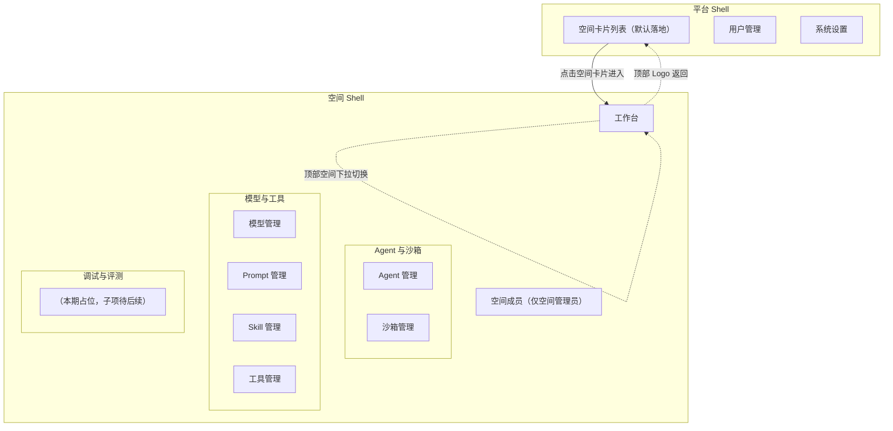

# AgentOps 平台 — UI 信息架构与导航规范

| 文档版本 | 日期 | 编写人 | 说明 |
|---------|------|-------|------|
| V1.0 | 2026-06-13 | AgentOps Team | 全局 UI 信息架构与导航统一规范，作为所有 PRD 的单一来源 |

> 本文是 AgentOps 全平台的 UI 信息架构与导航统一规范。当其他 PRD 中出现「线框图 / 主导航 / 顶部条 / 进入空间路径」描述时，**以本文为准**。任一 PRD 与本文冲突时，应同步更新本文或对应 PRD，避免散落维护。

---

## 1. 设计目标

- 用户登录后**先进入平台界面**，再选择并进入某个空间；平台级与空间内是两层独立 Shell。
- 顶部导航条贯穿平台与空间两层，**Logo 始终在最左**，承载品牌和回到平台首页的能力。
- 空间内左侧导航**按业务模块分组**呈现，符合用户在空间中的工作心智：先选 Agent / 沙箱 → 再选支撑资产（模型 / Prompt / Skill / 工具）→ 最后做调试评测。
- 平台级与空间内的左侧导航**结构形态相同**（图标 + 文字），仅内容不同；从平台进入空间时只切换内容，不打断用户视觉焦点。

---

## 2. 两层 Shell

### 2.1 平台 Shell（默认登录落地）

用户登录后默认落地此层，地址形如 `/platform/spaces`。

```text
┌──────────────────────────────────────────────────────────────────────────────┐
│ [Logo] AgentOps                                            [👤 当前用户 ▼]    │ ← 顶部导航条
├──────────────┬───────────────────────────────────────────────────────────────┤
│ 📂 空间管理 ◀─│  当前页：空间卡片列表                                          │ ← 平台级左侧主导航
│ 👥 用户管理  │  （仅角色含「管理员」用户可见此项）                              │
│ ⚙ 系统设置  │  （仅角色含「管理员」用户可见此项）                              │
│              │                                                                │
│              │  内容区域                                                      │
└──────────────┴───────────────────────────────────────────────────────────────┘
```

**顶部导航条（平台层）**：

| 区域 | 内容 | 行为 |
|------|------|------|
| 最左 | Logo + 平台名（来自系统设置-平台基础信息） | 点击回到平台首页（空间卡片列表） |
| 中部 | （留白） | — |
| 最右 | 当前用户头像 + 姓名 + 下拉箭头 | 下拉项：个人信息、修改密码、退出登录 |

**左侧主导航（平台层）**：

| 入口 | 可见角色 | 路由 |
|------|----------|------|
| 📂 空间管理 | 全部启用态用户 | `/platform/spaces` |
| 👥 用户管理 | 角色含「管理员」 | `/platform/users` |
| ⚙ 系统设置 | 角色含「管理员」 | `/platform/system-settings` |

> 普通用户登录后只看到「空间管理」一项，对应《用户管理 PRD》中「普通用户不可访问平台级用户管理与系统设置」。

### 2.2 空间 Shell（用户从空间卡片进入后）

用户在空间卡片列表点击「进入」后切换到此层，地址形如 `/spaces/{spaceId}/...`。

```text
┌──────────────────────────────────────────────────────────────────────────────┐
│ [Logo] AgentOps  │  当前空间：家庭客服 Agent ▼      [👤 当前用户 ▼]            │ ← 顶部导航条（空间层）
├────────────────────┬─────────────────────────────────────────────────────────┤
│ 📊 工作台          │                                                          │
│                   │                                                          │
│ ━ Agent 与沙箱 ━   │                                                          │
│  🤖 Agent 管理    │   内容区域                                                │
│  📦 沙箱管理       │                                                          │
│                   │                                                          │
│ ━ 模型与工具 ━     │                                                          │
│  🧠 模型管理       │                                                          │
│  📝 Prompt 管理   │                                                          │
│  🛠 Skill 管理    │                                                          │
│  🔧 工具管理       │                                                          │
│                   │                                                          │
│ ━ 调试与评测 ━     │                                                          │
│  （本期暂无子项）   │                                                          │
│                   │                                                          │
│ ━━━━━━━━━━━━━━━ │                                                          │
│ 👥 空间成员        │                                                          │
└────────────────────┴─────────────────────────────────────────────────────────┘
```

**顶部导航条（空间层）**：

| 区域 | 内容 | 行为 |
|------|------|------|
| 最左 | Logo + 平台名 | 点击回到平台首页（空间卡片列表）—— **从空间退出**到平台层 |
| 左中 | 当前空间名 + 下拉箭头 | 下拉「切换空间」面板：列出当前用户参与的全部空间，点击其它空间直接切换上下文（保持空间 Shell，仅切换 spaceId） |
| 最右 | 当前用户头像 + 姓名 + 下拉 | 下拉项：个人信息、修改密码、退出登录（与平台层一致，行为复用） |

**左侧空间内导航**：

| 分组 / 入口 | 子项 | 子项可见性 | 路由示例 |
|-------------|------|-----------|---------|
| 📊 工作台（无分组，置顶单项） | — | 空间全体成员 | `/spaces/{id}/dashboard` |
| **Agent 与沙箱** | 🤖 Agent 管理 | 空间全体成员 | `/spaces/{id}/agents` |
| | 📦 沙箱管理 | 空间全体成员 | `/spaces/{id}/sandboxes` |
| **模型与工具** | 🧠 模型管理 | 空间全体成员 | `/spaces/{id}/models` |
| | 📝 Prompt 管理 | 空间全体成员 | `/spaces/{id}/prompts` |
| | 🛠 Skill 管理 | 空间全体成员 | `/spaces/{id}/skills` |
| | 🔧 工具管理 | 空间全体成员 | `/spaces/{id}/tools` |
| **调试与评测** | （本期占位） | — | — |
| 👥 空间成员（无分组，置底单项） | — | 仅空间管理员可见 | `/spaces/{id}/members` |

> 「调试与评测」分组本期渲染为可见但无可点击子项的折叠分组标题，附浅灰文字提示「调试与评测能力建设中」。该分组随后续模块（运行记录 Trace、Prompt 调试、评测集等）逐步填充。

### 2.3 角色对左侧导航的影响

| 用户类别 | 平台层左侧 | 空间层左侧 |
|---------|------------|-----------|
| 平台管理员 + 空间管理员 | 空间管理、用户管理、系统设置 | 工作台、Agent 与沙箱、模型与工具、调试与评测、**空间成员** |
| 平台管理员 + 空间普通成员 | 空间管理、用户管理、系统设置 | 工作台、Agent 与沙箱、模型与工具、调试与评测 |
| 普通用户 + 空间管理员 | 空间管理 | 工作台、Agent 与沙箱、模型与工具、调试与评测、**空间成员** |
| 普通用户 + 空间普通成员 | 空间管理 | 工作台、Agent 与沙箱、模型与工具、调试与评测 |

> 「空间管理员」与「空间普通成员」由 [[space-management-prd]] 定义；本期对左侧导航的差异仅体现在「空间成员」入口可见性。模块内部按钮的角色差异由各模块 PRD 自行约束。

---

## 3. 信息架构图（Mermaid）



---

## 4. 关键交互约束

1. **登录默认落地**：登录成功后跳转 `/platform/spaces`（平台 Shell - 空间卡片列表），**不**直接进入任何空间 Shell。
2. **进入空间**：用户在空间卡片列表点击「进入」按钮 → 切换为空间 Shell，URL 变为 `/spaces/{id}/dashboard`，左侧导航整体替换。
3. **退出空间**：点击顶部 Logo → 回到平台 Shell - 空间卡片列表；空间下拉中没有「退出空间」单独项，避免冗余入口。
4. **切换空间**：顶部空间下拉点击其它空间 → URL 中 `{id}` 切换，保持当前在空间 Shell；若当前页是某模块（如 Prompt 管理），目标空间无该模块（不存在的情况，因结构一致）则回退到该空间的工作台。
5. **保持空间上下文**：刷新页面、深度链接进入空间内任意页面均能恢复 spaceId 上下文；若 URL 中的 `{id}` 当前用户不再有权访问，前端 toast「无权限或空间已删除」并跳回平台 Shell。
6. **顶部用户菜单**两层一致：个人信息、修改密码、退出登录；空间 Shell 中的顶部菜单不重复展示「空间管理」入口（点 Logo 即回）。
7. **路由约定**：平台层路径以 `/platform/...` 开头；空间层路径以 `/spaces/{id}/...` 开头；前端按前缀分流到不同 Shell 布局组件。

---

## 5. 各 PRD 引用与对齐

下列 PRD 的「系统线框图」「主导航」相关章节须**对齐本规范**，在自身文档中只描述模块内的页面结构，不再重复绘制全局信息架构：

| PRD | 引用本文何处 |
|-----|-------------|
| [[space-management-prd]] | §2.1 平台 Shell；§2.2 空间 Shell 整体架构 |
| [[user-management-prd]] | §2.1 平台 Shell 中的「用户管理」位置 |
| [[system-settings-prd]] | §2.1 平台 Shell 中的「系统设置」位置 |
| [[prompt-management-prd]] | §2.2 空间 Shell - 模型与工具组下的位置 |
| [[sandbox-management-prd]] | §2.2 空间 Shell - Agent 与沙箱组下的位置 |
| [[agentops-platform-prd]] | §2 整体两层 Shell 架构 |

---

## 6. 待后续规范化（本期不展开）

- 各模块 Icon 统一规范（材料库选型）；
- 顶部导航条在窄屏（< 1024px）下的折叠策略；
- 工作台首屏卡片布局；
- 「空间成员」模块的具体 PRD（本期通过空间管理 PRD 中的成员维护能力承接，作为占位入口）。
