# AgentOps 平台 — 工具管理 PRD

| 文档版本 | 日期 | 编写人 | 说明 |
|---------|------|-------|------|
| V1.0 | 2026-06-13 | AgentOps Team | 工具管理模块 PRD 初稿 |
| V1.1 | 2026-06-13 | AgentOps Team | 对齐《UI 信息架构与导航规范》：工具管理位于空间 Shell「模型与工具」分组下 |

---

## 1. 产品/需求背景

AgentOps 平台中，**工具（Tool）** 是 Agent 与外部世界交互的能力出口——查询数据库、调用 SaaS API、读取文件系统、操作 IoT 设备等动作都通过工具完成。Agent 在推理过程中根据上下文挑选并调用工具，工具调用的稳定性与可配置性直接决定了 Agent 的能力上限。

业界目前形成了两条主流的工具接入路径：

1. **Function Call**：以 OpenAI Function Calling 协议为代表，把单个 HTTP 接口包装为可被 LLM 调用的函数；通常通过 OpenAPI 规范批量导入，或一次配置一个接口端点。
2. **MCP（Model Context Protocol）**：Anthropic 主导的标准协议，把工具集合统一封装为 MCP Server，Agent 通过 MCP 协议（SSE / Streamable HTTP / stdio）访问；MCP Server 又分为 **远程 MCP**（HTTP/SSE 端点）与 **本地 MCP**（本地进程，stdio 通信）两种部署模式。

当前平台已具备 **用户管理**、**空间管理**、**模型管理**、**Skill 管理** 能力，但尚未提供工具管理能力。Agent 模块的落地依赖工具配置先行：必须先在空间内注册可用工具（端点、协议、鉴权、代理），Agent 才能引用并发起调用。

本期需求即建设 **空间内工具管理** 模块的 MVP 版本：

- 同时支持 **Function Call** 与 **MCP** 两大工具类型；
- Function Call 支持 **OpenAPI 导入** 与 **手动配置端点** 两种子模式；
- MCP 支持 **远程 MCP** 与 **本地 MCP** 两种子模式；
- 通过「草稿 / 生效 / 下架」三态状态机控制工具可用性；
- 统一的 **代理（Proxy）配置** 与 **请求头（Headers）注入** 能力，覆盖企业网络出口与鉴权需求；
- 配置以 **JSON 结构化字段** 存储，前端按工具子类型做强校验，OpenAPI 导入时另做规范校验。

---

## 2. 目标与范围

### 2.1 目标

- 在空间内提供工具的注册、编辑、状态流转、删除能力，作为 Agent 模块引用工具的基础。
- 屏蔽 Function Call 与 MCP 之间的协议差异，统一以「工具（Tool）」概念在 Agent 配置中被引用。
- 通过「草稿 / 生效 / 下架」三态保护已被 Agent 引用的工具配置不被误删。
- 通过结构化配置 JSON + 前端 Schema 校验，避免运行时因配置错误导致的工具调用失败。
- 通过统一的 Proxy 与 Headers 配置满足企业出口代理、鉴权 Token 注入等场景。

### 2.2 范围

| 范围 | 是否包含 | 说明 |
|------|----------|------|
| 工具新建（FunctionCall / MCP） | 包含 | 通过右侧抽屉录入；初始状态为「草稿」 |
| 工具编辑 | 包含 | 抽屉中修改字段；业务编码与工具类型不可改 |
| 工具启用（发布） | 包含 | 草稿 → 生效 |
| 工具下架 | 包含 | 生效 → 下架 |
| 工具删除 | 包含 | 仅草稿态可删除；采用软删除 |
| 工具列表 | 包含 | 表格形式展示当前空间内的全部工具，可按类型/状态筛选 |
| FunctionCall — OpenAPI 导入 | 包含 | 支持 YAML/JSON 上传或粘贴；解析后展示「将导入的接口列表」供用户勾选 |
| FunctionCall — 手动端点配置 | 包含 | 支持 GET/POST/PUT/PATCH/DELETE/HEAD/OPTIONS；Path/Query/Header/Body 参数；JSON Schema 描述参数与响应 |
| MCP — 远程 MCP | 包含 | URL + 传输方式（SSE / Streamable HTTP）+ 鉴权头 + 代理 |
| MCP — 本地 MCP | 包含 | 命令 / 参数 / 环境变量 / 工作目录 + 传输方式（stdio） |
| 代理（Proxy）配置 | 包含 | 支持 HTTP / HTTPS / SOCKS5 代理；每工具独立配置；可继承空间默认 |
| 自定义请求头 | 包含 | 工具级 Headers 注入；支持 `${secret.XXX}` 占位（占位语法本期不解析，作为字符串存储，预留未来对接密钥管理） |
| 工具调用测试（试运行） | 包含 | 编辑保存或编辑过程中可点击「测试」按钮，对当前配置发起一次实际调用并展示请求/响应结果 |
| 工具调用日志 | 不包含 | 后续迭代独立模块承接 |
| 工具版本管理 | 不包含 | 本期工具不引入多版本机制（与 Skill 不同），仅以草稿/生效/下架表达可用性 |
| 跨空间共享工具 | 不包含 | 工具严格归属单个空间 |
| OAuth 流程托管 | 不包含 | 鉴权统一以静态请求头方式承载；OAuth 授权码流转后续迭代 |
| 工具市场 | 不包含 | 后续迭代支持 |

### 2.3 工具核心字段（主体，所有类型共用）

| 字段 | 必填 | 规则 | 示例 |
|------|------|------|------|
| 业务编码 | 是 | 系统生成，不允许手工编辑或修改。格式：`TL` + `yyyyMMddHHmmssSSS` + 四位随机数 | `TL202606131426301234567` |
| 名称 | 是 | 1～50 字符；同一空间内不可重复 | `天气查询 API` |
| 工具类型 | 是 | 枚举：`FUNCTION_CALL` / `MCP`；新建时选择，**保存后不可修改** | `MCP` |
| 工具子类型 | 是 | FunctionCall 下：`OPENAPI` / `ENDPOINT`；MCP 下：`REMOTE` / `LOCAL`；保存后不可修改 | `REMOTE` |
| 描述 | 否 | 0～500 字符；用于在 Agent 配置中辅助选择 | `调用和风天气接口查询实时天气` |
| 标签 | 否 | 0～10 个；每个 1～20 字符 | `["天气","公共API"]` |
| 状态 | 是 | 枚举：`草稿` / `生效` / `下架`；新建时默认为 `草稿` | `生效` |
| 配置 JSON | 是 | JSON 结构；不同类型/子类型的 Schema 不同，详见 2.4 | 见 2.4 各示例 |
| 备注 | 否 | 200 字以内 | `内部团队 Token 月度更新一次` |
| 所属空间 | 是 | 系统记录，绑定当前空间 ID | `SP202606131426301234567` |
| 创建人 / 创建时间 / 更新人 / 更新时间 / 是否删除 | 是 | 系统记录 | — |

> 说明：**「工具类型」与「工具子类型」一旦保存即不可修改**。如需切换类型，须新建一个工具。原因：不同子类型的配置 Schema 完全不同，强制重建可避免数据迁移歧义并保护已被 Agent 引用的语义。

### 2.4 配置 JSON Schema（按子类型）

#### 2.4.1 FunctionCall — OpenAPI 导入（`subType=OPENAPI`）

```json
{
  "spec": {
    "format": "yaml",
    "content": "<原始 OpenAPI YAML/JSON 字符串>",
    "version": "3.0.3",
    "info": { "title": "Weather API", "version": "1.0.0" }
  },
  "selectedOperations": [
    {
      "operationId": "getCurrentWeather",
      "method": "GET",
      "path": "/v7/weather/now",
      "summary": "查询实时天气",
      "enabled": true
    }
  ],
  "baseUrl": "https://api.qweather.com",
  "auth": {
    "type": "API_KEY",
    "in": "query",
    "name": "key",
    "value": "<encrypted>"
  },
  "headers": [
    { "name": "X-Trace-Source", "value": "agentops" }
  ],
  "proxy": {
    "enabled": false,
    "type": "HTTP",
    "host": "",
    "port": 0,
    "username": "",
    "password": ""
  },
  "timeoutMs": 10000
}
```

**字段约束**：

- `spec.content` ≤ 1MB；`spec.format` 限定 `yaml` / `json`。
- `selectedOperations` 至少 1 条 `enabled=true`。
- `baseUrl` 须以 `http(s)://` 开头。
- `auth.type` 枚举：`NONE` / `API_KEY` / `BEARER` / `BASIC`；`API_KEY` 时须提供 `in`(`header`/`query`) 与 `name`；`value` 加密存储。
- `headers[*].name` 不允许覆盖系统保留头（`Host` / `Content-Length` 等，详见 2.5）。

#### 2.4.2 FunctionCall — 手动端点（`subType=ENDPOINT`）

```json
{
  "endpoint": {
    "method": "POST",
    "url": "https://api.example.com/v1/orders/{orderId}/refund",
    "pathParams": [
      { "name": "orderId", "type": "string", "required": true, "description": "订单号" }
    ],
    "queryParams": [
      { "name": "reason", "type": "string", "required": false, "description": "退款原因" }
    ],
    "headers": [
      { "name": "Content-Type", "value": "application/json" }
    ],
    "body": {
      "contentType": "application/json",
      "schema": {
        "type": "object",
        "properties": {
          "amount": { "type": "number", "description": "退款金额" }
        },
        "required": ["amount"]
      },
      "example": "{\"amount\": 100.00}"
    }
  },
  "auth": {
    "type": "BEARER",
    "value": "<encrypted>"
  },
  "headers": [
    { "name": "X-Trace-Source", "value": "agentops" }
  ],
  "proxy": {
    "enabled": false,
    "type": "HTTP",
    "host": "",
    "port": 0,
    "username": "",
    "password": ""
  },
  "timeoutMs": 10000,
  "responseSchema": {
    "type": "object",
    "properties": {
      "ok": { "type": "boolean" }
    }
  }
}
```

**字段约束**：

- `endpoint.method` 枚举：`GET` / `POST` / `PUT` / `PATCH` / `DELETE` / `HEAD` / `OPTIONS`。
- `endpoint.url` 须以 `http(s)://` 开头；URL 中所有 `{name}` 占位必须在 `pathParams` 中声明。
- `pathParams` / `queryParams` 中 `type` 枚举：`string` / `integer` / `number` / `boolean`；`required` 默认 `false`。
- `body.contentType` 枚举：`application/json` / `application/x-www-form-urlencoded` / `multipart/form-data` / `text/plain` / `none`；`GET` / `HEAD` / `OPTIONS` 默认 `none` 且不允许设置 body。
- `body.schema` 为 JSON Schema 子集（仅支持 type/properties/required/items/enum/description）。
- 其他字段约束同 2.4.1。

#### 2.4.3 MCP — 远程 MCP（`subType=REMOTE`）

```json
{
  "transport": "STREAMABLE_HTTP",
  "url": "https://mcp.example.com/sse",
  "headers": [
    { "name": "Authorization", "value": "Bearer <encrypted>" }
  ],
  "proxy": {
    "enabled": false,
    "type": "HTTP",
    "host": "",
    "port": 0,
    "username": "",
    "password": ""
  },
  "connectTimeoutMs": 10000,
  "requestTimeoutMs": 60000
}
```

**字段约束**：

- `transport` 枚举：`SSE` / `STREAMABLE_HTTP`；新建时默认 `STREAMABLE_HTTP`。
- `url` 须以 `http(s)://` 开头。
- `headers` 中 `Authorization` 等鉴权类字段值加密存储；同样禁止覆盖系统保留头。

#### 2.4.4 MCP — 本地 MCP（`subType=LOCAL`）

```json
{
  "transport": "STDIO",
  "command": "npx",
  "args": ["-y", "@modelcontextprotocol/server-filesystem", "/data/shared"],
  "env": [
    { "name": "MCP_FS_ROOT", "value": "/data/shared" },
    { "name": "API_KEY", "value": "<encrypted>" }
  ],
  "workingDir": "/var/agentops/mcp",
  "startupTimeoutMs": 15000,
  "requestTimeoutMs": 60000
}
```

**字段约束**：

- `transport` 固定为 `STDIO`，前端只读展示。
- `command` 必填，1～200 字符；命令白名单由系统设置维护（本期默认放开，仅做长度与字符校验，禁止 `;` `&&` `||` `|` `` ` `` `$(` 等 shell 拼接字符）。
- `args` 为字符串数组，单条 ≤ 500 字符，总数 ≤ 32。
- `env[*].name` 须匹配 `^[A-Z_][A-Z0-9_]*$`；`value` 中含敏感关键字（含 `KEY` / `TOKEN` / `SECRET` / `PASSWORD`）时加密存储。
- `workingDir` 选填，必须是绝对路径；`startupTimeoutMs` 默认 15s。

### 2.5 系统保留请求头与禁止项

下列请求头由运行时统一管理，工具配置中不允许由用户覆盖（前端校验+后端校验）：

`Host` / `Content-Length` / `Connection` / `Transfer-Encoding` / `Upgrade` / `Proxy-Authorization`（由 proxy.username/password 管理）。

### 2.6 工具状态流转

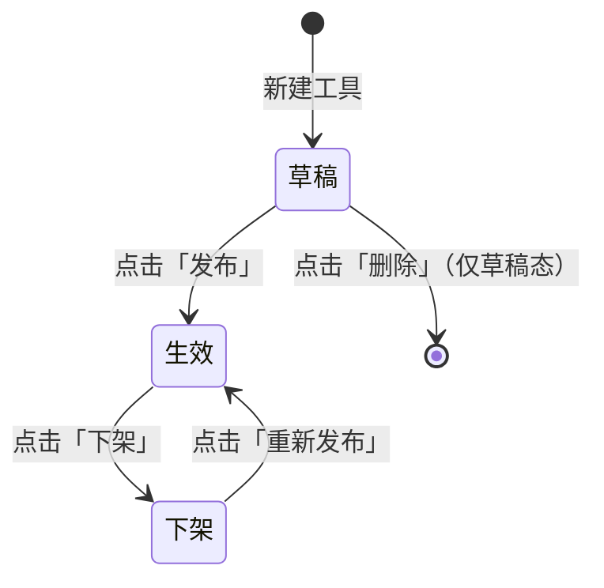

| 当前状态 | 可执行操作 | 说明 |
|---------|-----------|------|
| 草稿 | 编辑、测试、发布、删除 | 草稿态可自由编辑和删除；点击「发布」后即可被 Agent 引用 |
| 生效 | 编辑、测试、下架 | 生效态可被 Agent 引用；编辑保存仍保持「生效」（与模型管理一致）；不可删除 |
| 下架 | 编辑、测试、重新发布 | 下架态不可被 Agent 引用；不可删除 |

> 说明：**只有「草稿态」支持删除**。生效/下架态如需清理，由系统设置中的归档能力承接（本期不做）。

---

## 3. 系统线框图（必选）

> 全平台 UI 信息架构与导航以《UI 信息架构与导航规范》（`doc/产品方案/2026-06-13_UI信息架构与导航规范.md`）为单一来源。本节仅描述本模块在空间 Shell 中的位置与模块内页面结构。

### 3.1 工具管理在空间 Shell 中的位置

工具管理位于空间 Shell 左侧导航的「模型与工具」分组下，与模型管理、Prompt 管理、Skill 管理同组。

```text
空间 Shell
┌──────────────────────────────────────────────────────────────────────┐
│ [Logo] AgentOps │ 当前空间：家庭客服 ▼          [👤 当前用户 ▼]      │
├──────────────────┬────────────────────────────────────────────────────┤
│ 📊 工作台         │                                                    │
│ ━ Agent 与沙箱 ━  │                                                    │
│ ━ 模型与工具 ━    │                                                    │
│  🧠 模型管理      │                                                    │
│  📝 Prompt 管理  │                                                    │
│  🛠 Skill 管理    │                                                    │
│  🔧 工具管理 ◀──│  当前页：工具列表                                  │
│ ━ 调试与评测 ━    │                                                    │
│ 👥 空间成员       │                                                    │
└──────────────────┴────────────────────────────────────────────────────┘
```

### 3.2 工具管理模块页面结构

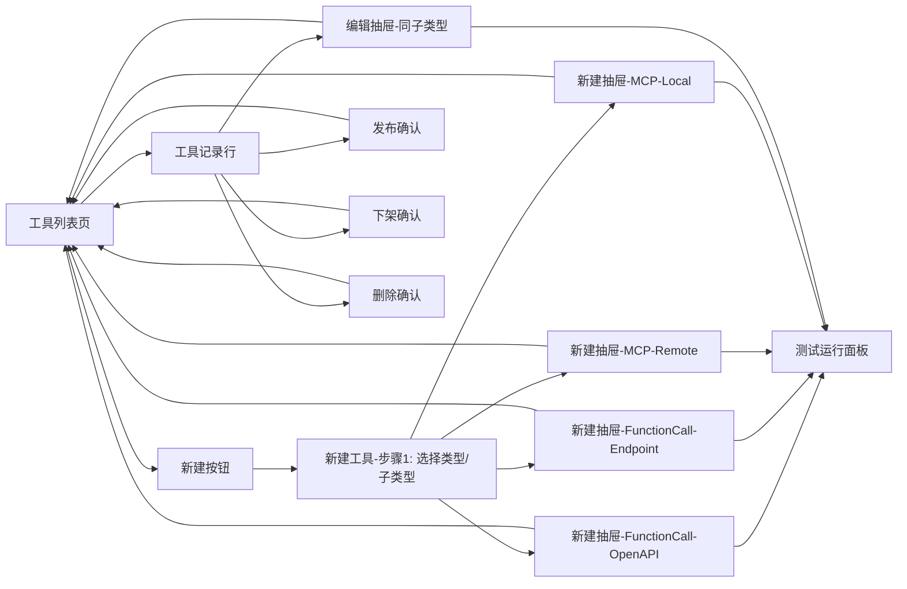

**模块说明**：

| 模块 | 职责 |
|------|------|
| 工具列表页 | 表格形式展示当前空间内全部工具；提供搜索、类型筛选、状态筛选、新建按钮 |
| 新建步骤 1 | 选择「工具类型」与「子类型」的小型对话框；保存后不可修改 |
| 新建/编辑抽屉 | 右侧滑出抽屉，按子类型动态加载不同表单与 JSON 校验规则 |
| 测试运行面板 | 抽屉内嵌的可展开面板，对当前配置发起一次试运行并展示结果 |
| 发布/下架/删除确认 | 对应操作的二次确认弹窗 |

---

## 4. 业务流程图（必选）

### 4.1 工具新增主流程（按子类型分支）

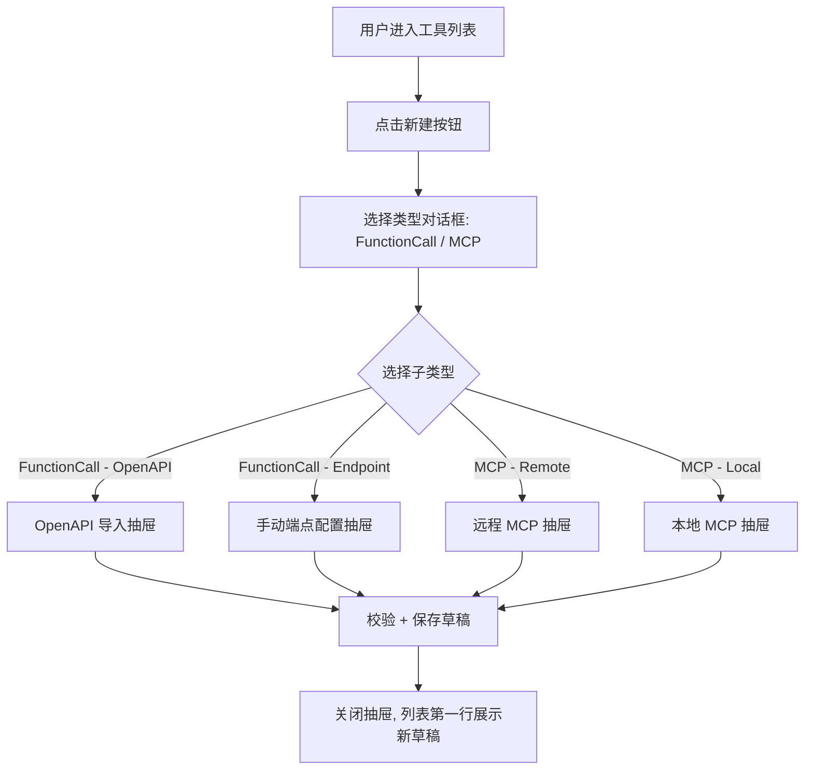

### 4.2 OpenAPI 导入流程

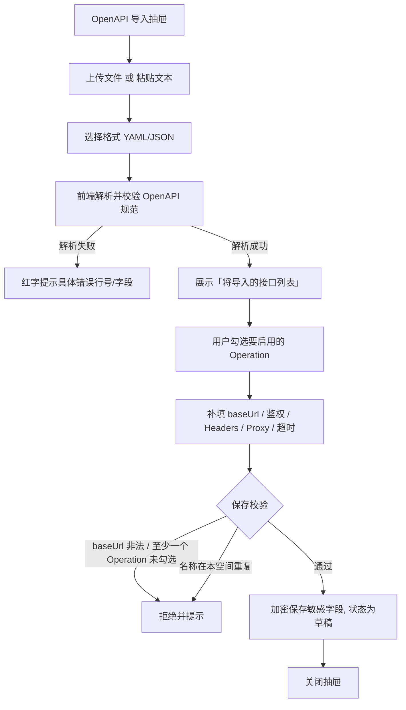

### 4.3 手动端点配置流程

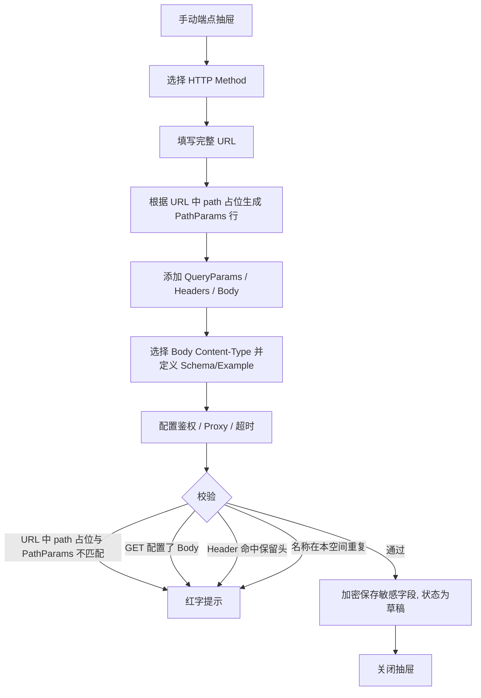

### 4.4 远程 MCP 配置流程

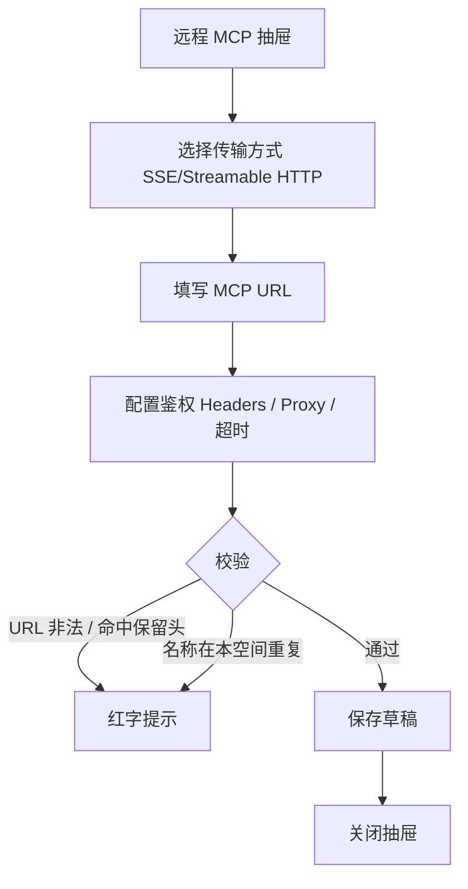

### 4.5 本地 MCP 配置流程

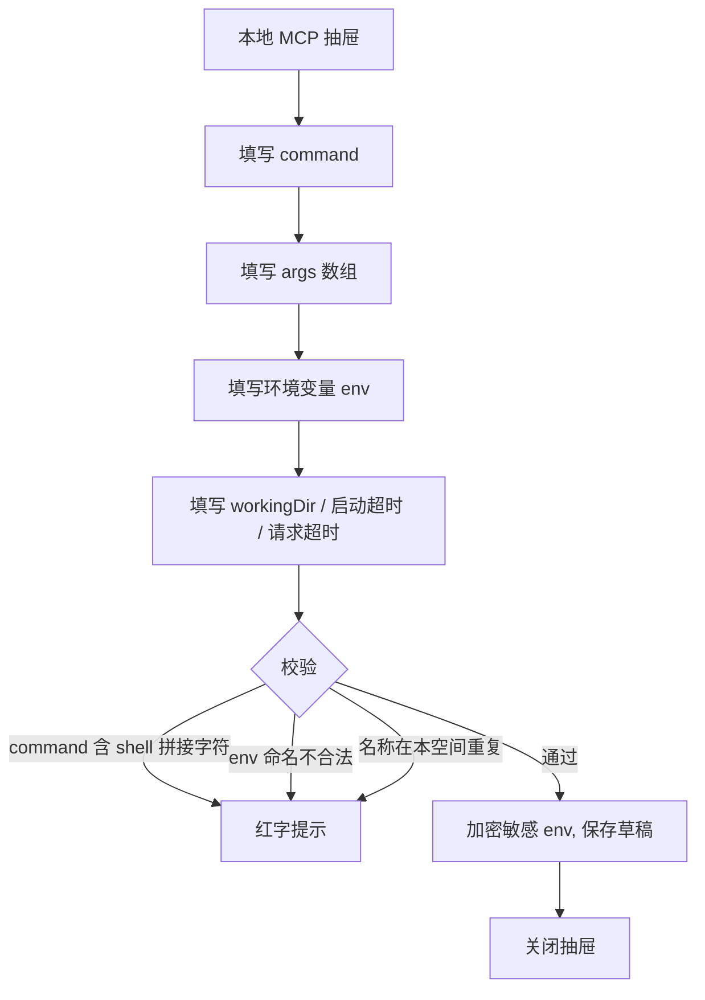

### 4.6 工具试运行（测试）流程

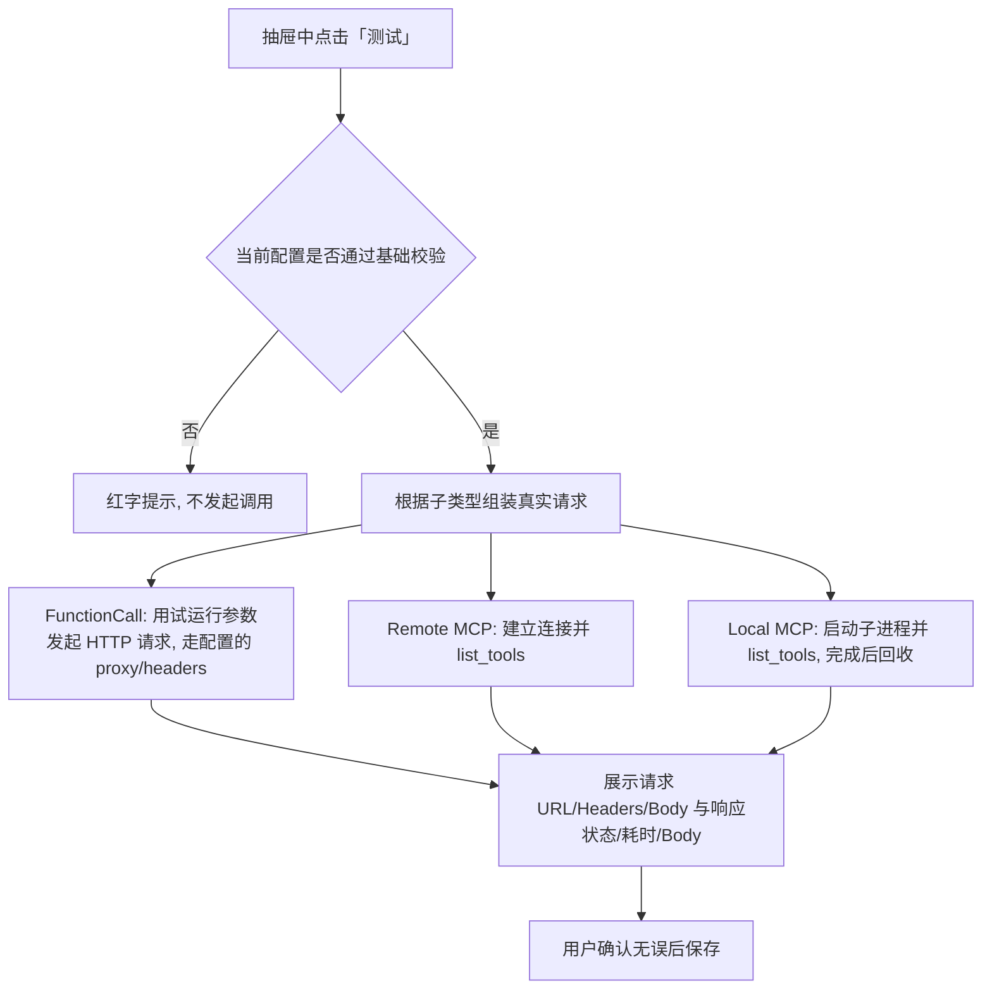

### 4.7 状态流转流程

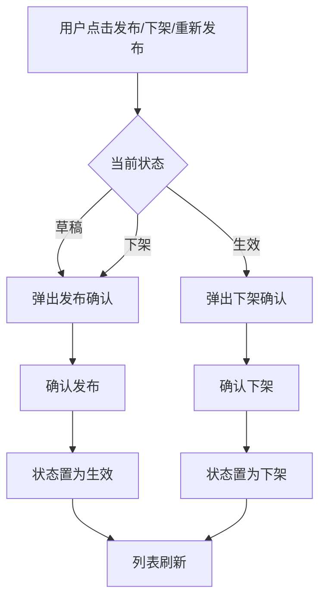

### 4.8 删除流程

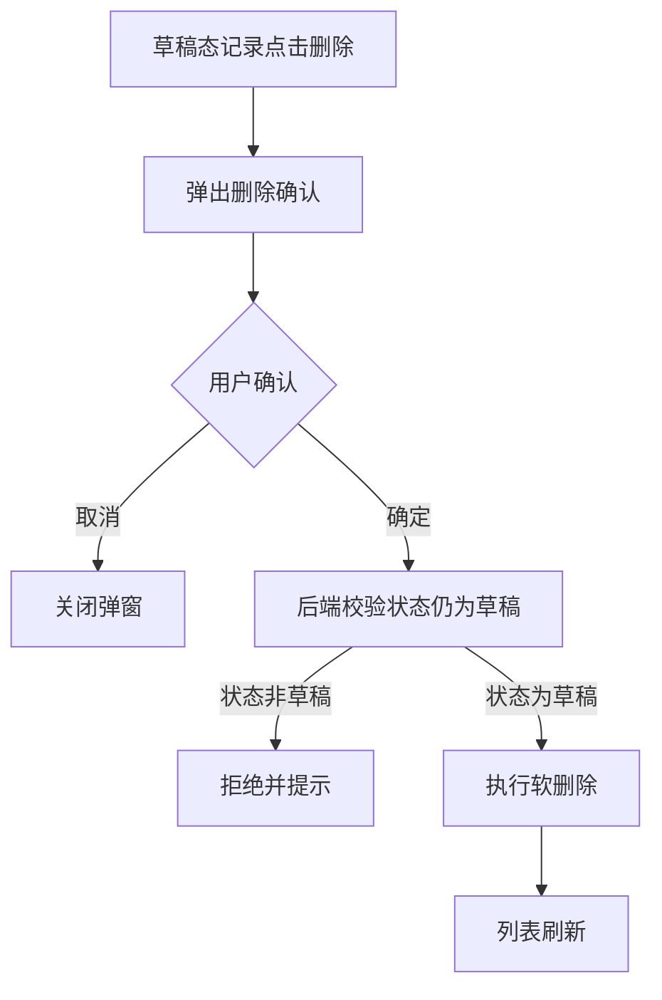

---

## 5. 用例图（必选）

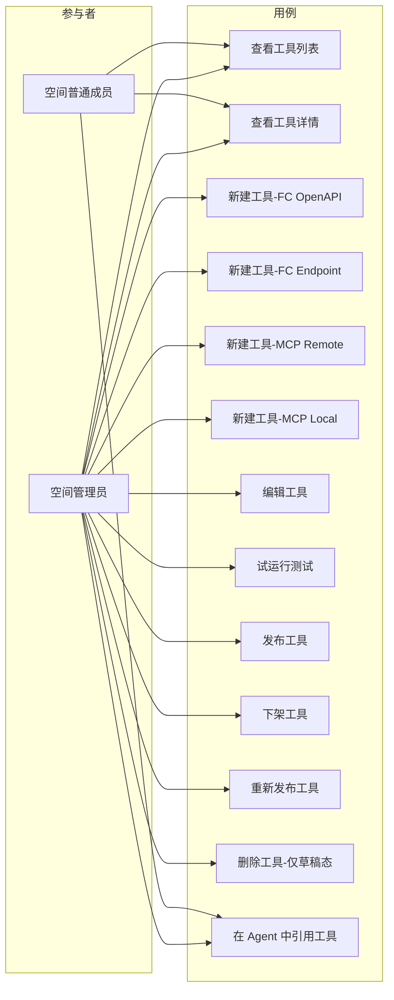

**图例说明**：

| 参与者 | 含义 |
|--------|------|
| 空间管理员 | 包含创建人在内的全部管理员，可对工具执行新增/编辑/测试/发布/下架/删除 |
| 空间普通成员 | 仅可查看工具列表与详情（不含敏感字段明文）和在 Agent 中引用生效态工具 |

| 用例 | 含义 | 优先级 |
|------|------|--------|
| 查看工具列表 | 浏览当前空间内全部工具 | P0 |
| 查看工具详情 | 在抽屉只读模式下查看完整配置（敏感字段脱敏） | P0 |
| 新建工具-FC OpenAPI | 通过 OpenAPI 导入新建 FunctionCall 工具 | P0 |
| 新建工具-FC Endpoint | 通过手动端点配置新建 FunctionCall 工具 | P0 |
| 新建工具-MCP Remote | 通过 URL 配置新建远程 MCP 工具 | P0 |
| 新建工具-MCP Local | 通过命令配置新建本地 MCP 工具 | P0 |
| 编辑工具 | 在抽屉中修改工具配置（类型/子类型不可改） | P0 |
| 试运行测试 | 对当前配置发起一次实际调用并展示结果 | P0 |
| 发布工具 | 草稿 → 生效 | P0 |
| 下架工具 | 生效 → 下架 | P0 |
| 重新发布工具 | 下架 → 生效 | P0 |
| 删除工具 | 仅草稿态可删（软删除） | P0 |
| 在 Agent 中引用工具 | Agent 模块下游用例，本期不在工具管理范围内实现 | P1 |

---

## 6. 用户与场景

### 6.1 用户角色

- **空间管理员**：可对当前空间内工具执行全部管理操作。
- **空间普通成员**：仅可查看列表与详情、在 Agent 中引用生效态工具；列表/详情中**不展示** API Key/Bearer Token/敏感环境变量明文。
- **平台管理员（系统设置）**：本期不参与；未来由系统设置承接「全局代理默认」「命令白名单」「保留请求头黑名单」等策略。

### 6.2 典型用户故事

- 作为空间管理员，我希望粘贴一份和风天气的 OpenAPI YAML，让平台自动解析并列出 20 个 Operation，我勾选其中 3 个保存为工具，立即可被 Agent 引用。
- 作为空间管理员，我希望直接配置一个内部退款接口（POST + Path 占位 + JSON Body），并定义入参 Schema，让 LLM 在调用时知道字段含义。
- 作为空间管理员，我希望接入一个公司内部的远程 MCP 服务，公司通过 Bearer Token 鉴权，且必须经由企业代理（HTTPS Proxy 10.0.0.10:8080）出口。
- 作为空间管理员，我希望在 AgentOps 服务器上拉起一个 `@modelcontextprotocol/server-filesystem` 本地 MCP 进程，把 `/data/shared` 目录开放给 Agent。
- 作为空间管理员，我希望保存前点击「测试」按钮先发一次真实请求，确认 URL、鉴权、代理都正确再发布。
- 作为空间管理员，我希望误录入的草稿工具可以直接删除，但已发布过的工具不可被任何人误删，以保护历史 Agent 引用。
- 作为空间普通成员，我希望在 Agent 配置页能选择本空间内生效态的工具，但**看不到**任何工具的鉴权 Token 明文。

---

## 7. 功能需求

| 序号 | 功能点 | 简要说明 | 优先级 |
|------|--------|----------|--------|
| 1 | 工具列表 | 表格展示当前空间内全部工具（按 `is_deleted=0` 过滤）；列：名称、类型、子类型、状态、标签、更新时间、操作 | P0 |
| 2 | 列表搜索与筛选 | 支持按名称模糊搜索；支持按类型（FunctionCall/MCP）+ 子类型 + 状态 多条件筛选 | P0 |
| 3 | 列表分页与排序 | 默认按更新时间倒序；分页 20 条/页 | P1 |
| 4 | 新建工具 - 类型选择对话框 | 列表右上角「新建」按钮触发；选择类型与子类型；确认后打开对应抽屉 | P0 |
| 5 | OpenAPI 导入抽屉 | 支持上传 `.yaml` `.yml` `.json` 文件或粘贴文本；前端解析；解析失败时定位错误位置；解析成功后展示 Operation 列表供勾选；可补填 baseUrl/auth/headers/proxy/timeout | P0 |
| 6 | OpenAPI 规范校验 | 仅支持 OpenAPI 3.0.x / 3.1.x；缺少 `info.title` / `paths` 时拒绝；非 HTTP(s) servers 时给出警告但允许保存 | P0 |
| 7 | 手动端点抽屉 | Method 下拉支持全 7 种；URL 输入；自动解析 path 占位生成 PathParams 行；QueryParams/Headers/Body 区块；Body 区块按 Content-Type 切换 Schema/Example 编辑器 | P0 |
| 8 | 端点参数 Schema 编辑 | 提供「表单视图」和「JSON 视图」切换；JSON 视图下用 Monaco 编辑器并实时校验 JSON Schema 子集 | P0 |
| 9 | 远程 MCP 抽屉 | 选择传输方式（SSE / Streamable HTTP）；填写 URL；Headers/Proxy/超时配置 | P0 |
| 10 | 本地 MCP 抽屉 | 传输方式只读 stdio；填写 command/args/env/workingDir；启动超时/请求超时 | P0 |
| 11 | 配置 JSON 校验 | 前端按子类型加载 Schema；保存/发布前校验通过才放行；后端再次校验 | P0 |
| 12 | 代理（Proxy）配置 | 通用区块：启用开关 + 类型（HTTP/HTTPS/SOCKS5）+ host/port + 可选 username/password；password 加密存储 | P0 |
| 13 | 自定义请求头 | 通用 Headers 区块：支持新增多对 name/value 行；name 命中保留头时拒绝；value 加密判定（含 KEY/TOKEN/SECRET/AUTH 关键字时按敏感存储） | P0 |
| 14 | 试运行测试面板 | 抽屉内可展开「测试」面板：对 FunctionCall 输入 path/query/header/body 实参后发起真实 HTTP；对 MCP 直接 list_tools；展示完整请求/响应/耗时/错误 | P0 |
| 15 | 业务编码自动生成 | 提交新建时按 `TL + 时间戳 + 4 位随机数` 规则生成；不可手工编辑 | P0 |
| 16 | 名称唯一性 | 同一空间内工具名称不可重复；提交时前后端双重校验 | P0 |
| 17 | 类型/子类型不可改 | 编辑场景下类型与子类型字段灰显只读 | P0 |
| 18 | 敏感字段加密与脱敏 | API Key / Bearer Token / Basic Password / 命中关键字的 env value / proxy.password 后端对称加密；前端列表/详情/编辑预填仅展示脱敏值（前 4 位 + `****` + 后 4 位） | P0 |
| 19 | 发布 / 下架 / 重新发布 | 草稿可发布；生效可下架；下架可重新发布；均经过二次确认 | P0 |
| 20 | 删除 | 仅草稿态可见删除按钮；二次确认；后端再次校验状态防越权 | P0 |
| 21 | 操作按钮显隐 | 「新建」「编辑」「测试」「发布」「下架」「重新发布」「删除」按钮仅对空间管理员可见；普通成员只读 | P0 |
| 22 | 状态标签 | 列表中状态以颜色标签区分：草稿（灰）、生效（绿）、下架（橙） | P0 |
| 23 | 类型标签 | 类型/子类型以图标 + 文本组合展示，便于快速辨识 | P1 |
| 24 | 抽屉关闭确认 | 抽屉中存在未保存修改时，关闭前提示用户确认 | P1 |
| 25 | 空态展示 | 空间内无任何工具时，列表区展示空态插画与「新建工具」引导按钮 | P1 |
| 26 | 试运行参数预填 | 对 OpenAPI 导入的工具，试运行时根据 Operation Schema 自动生成示例参数 | P1 |

---

## 8. 原型图/界面说明（必选）

### 8.1 工具列表页

```text
┌─────────────────────────────────────────────────────────────────────────────────────────────┐
│ AgentOps  /  [家庭客服 Agent ▼]  /  工具                                                     │
├─────────────────────────────────────────────────────────────────────────────────────────────┤
│  工具管理                                                                                   │
│                                                                                             │
│  [搜索名称 🔍]   类型: [全部 ▼]   子类型: [全部 ▼]   状态: [全部 ▼]            [+ 新建工具] │
│                                                                                             │
│  ┌───────────────────────────────────────────────────────────────────────────────────────┐ │
│  │ 名称              │ 类型         │ 子类型       │ 状态 │ 标签         │ 更新时间   │ 操作 │
│  ├───────────────────┼──────────────┼──────────────┼──────┼──────────────┼───────────┼──────┤
│  │ 天气查询           │ FunctionCall │ OpenAPI 导入 │ 生效 │ 天气, 公共   │ 06-13 18:00 │ 编辑/测试/下架 │
│  │ 订单退款           │ FunctionCall │ 端点配置     │ 草稿 │ 内部         │ 06-13 17:55 │ 编辑/测试/发布/删除 │
│  │ 公司内部工具集     │ MCP          │ 远程 MCP     │ 生效 │ 内部         │ 06-13 17:30 │ 编辑/测试/下架 │
│  │ 文件系统 MCP      │ MCP          │ 本地 MCP     │ 下架 │ 内部, 文件   │ 06-12 11:30 │ 编辑/测试/重新发布 │
│  └───────────────────────────────────────────────────────────────────────────────────────┘ │
│                                              共 4 条   < 1 >  20 条/页 ▼                    │
└─────────────────────────────────────────────────────────────────────────────────────────────┘
```

**说明**：
- 类型/子类型列前置图标：FunctionCall（🔧 / 🌐）、MCP（🔌 远程 / 💻 本地）。
- 操作按钮按状态显隐：
  - 草稿：`编辑 / 测试 / 发布 / 删除`
  - 生效：`编辑 / 测试 / 下架`
  - 下架：`编辑 / 测试 / 重新发布`
- 列表**不展示**鉴权 Token、密码、代理密码等敏感字段。

### 8.2 新建工具 - 类型选择对话框

```text
┌──────────────────────────────────────────────────────────────────┐
│  新建工具 - 选择类型                                       ✕    │
├──────────────────────────────────────────────────────────────────┤
│                                                                  │
│  请选择工具类型：                                                │
│                                                                  │
│  ┌──────────────────────────┐  ┌──────────────────────────┐     │
│  │ 🔧 FunctionCall          │  │ 🔌 MCP                   │     │
│  │                          │  │                          │     │
│  │ 包装单个 HTTP 接口为      │  │ 接入 Model Context      │     │
│  │ 可被 LLM 调用的函数       │  │ Protocol Server         │     │
│  └──────────────────────────┘  └──────────────────────────┘     │
│                                                                  │
│  子类型：                                                        │
│  ○ 🌐 OpenAPI 导入  ○ 🔧 手动端点配置                             │
│  ○ 🔌 远程 MCP      ○ 💻 本地 MCP                                │
│                                                                  │
│  ⓘ 类型与子类型一旦保存即不可修改，如需切换请新建工具            │
│                                                                  │
├──────────────────────────────────────────────────────────────────┤
│                                       [取消]   [下一步]          │
└──────────────────────────────────────────────────────────────────┘
```

### 8.3 新建抽屉 - FunctionCall - OpenAPI 导入

```text
                                              ┌──────────────────────────────────────────────────┐
                                              │ 新建工具 · FunctionCall · OpenAPI 导入       ✕  │
                                              ├──────────────────────────────────────────────────┤
                                              │ 名称 *                                           │
                                              │ [天气查询_____________________________________] │
                                              │ 描述                                             │
                                              │ [..............................................]│
                                              │ 标签                                             │
                                              │ [天气] [公共] [+]                                │
                                              │                                                  │
                                              │ ── OpenAPI 规范 ──                               │
                                              │ 来源：(•) 上传文件  ( ) 粘贴文本                  │
                                              │ [选择文件] weather.yaml                          │
                                              │ 格式：[YAML ▼]                                   │
                                              │ ✅ 规范校验通过 (OpenAPI 3.0.3)                   │
                                              │                                                  │
                                              │ ── 选择要导入的接口（共 20，已选 3）──            │
                                              │ ☑ GET /v7/weather/now      查询实时天气          │
                                              │ ☑ GET /v7/weather/3d       查询 3 天预报         │
                                              │ ☐ GET /v7/weather/7d       ...                   │
                                              │ ☑ GET /v7/air/now          查询空气质量          │
                                              │                                                  │
                                              │ ── 调用配置 ──                                   │
                                              │ Base URL * [https://api.qweather.com__________]  │
                                              │ 鉴权方式：[API Key ▼]                            │
                                              │   位置：[Query ▼]   名称：[key__]  值：[****abcd]│
                                              │ 自定义 Headers   [+ 添加]                         │
                                              │   X-Trace-Source : agentops                      │
                                              │ 代理: ☐ 启用                                     │
                                              │ 超时: [10000] ms                                 │
                                              │                                                  │
                                              │ ── 测试运行 ▾ ──                                 │
                                              │                                                  │
                                              ├──────────────────────────────────────────────────┤
                                              │           [测试]      [取消]   [保存为草稿]      │
                                              └──────────────────────────────────────────────────┘
```

**说明**：
- 抽屉宽度建议 640px～720px（比模型管理更宽，因配置复杂）。
- 上传文件区与粘贴文本区互斥；粘贴文本时下方出现 Monaco 编辑器框（带格式高亮）。
- 校验失败时上方红色 banner 提示「OpenAPI 规范错误：line 12, missing 'paths' field」并阻止下一步。
- 「选择要导入的接口」表格支持「全选」「按 method 筛选」。

### 8.4 新建抽屉 - FunctionCall - 手动端点配置

```text
                                              ┌──────────────────────────────────────────────────┐
                                              │ 新建工具 · FunctionCall · 手动端点配置       ✕  │
                                              ├──────────────────────────────────────────────────┤
                                              │ 名称 *  [订单退款__________________________]     │
                                              │ 描述    [..............................]        │
                                              │                                                  │
                                              │ ── 端点 ──                                       │
                                              │ Method: [POST ▼]                                 │
                                              │ URL *:                                           │
                                              │ [https://api.example.com/v1/orders/{orderId}/refund]│
                                              │                                                  │
                                              │ Path 参数（自动解析自 URL 占位）  [+ 添加]        │
                                              │   orderId  string  必填  订单号                  │
                                              │                                                  │
                                              │ Query 参数  [+ 添加]                              │
                                              │   reason   string  可选  退款原因                │
                                              │                                                  │
                                              │ 请求 Headers  [+ 添加]                            │
                                              │   Content-Type : application/json                │
                                              │                                                  │
                                              │ Body                                             │
                                              │   Content-Type: [application/json ▼]             │
                                              │   视图: ( ) 表单  (•) JSON Schema                │
                                              │   ┌──────────────────────────────────────────┐   │
                                              │   │ { "type":"object", "properties":{        │   │
                                              │   │   "amount":{"type":"number"} },          │   │
                                              │   │ "required":["amount"] }                  │   │
                                              │   └──────────────────────────────────────────┘   │
                                              │   Example: {"amount":100.00}                     │
                                              │                                                  │
                                              │ 响应 Schema （选填）  [JSON ▼]                    │
                                              │                                                  │
                                              │ ── 鉴权 / 通用 Headers / 代理 / 超时 ──           │
                                              │ 鉴权方式: [Bearer ▼]   值: [****abcd]            │
                                              │ 通用 Headers   [+]   X-Trace-Source : agentops   │
                                              │ 代理: ☑ 启用  类型:[HTTPS ▼]                     │
                                              │   host:[10.0.0.10]  port:[8080]                  │
                                              │   username:[]  password:[****]                   │
                                              │ 超时: [10000] ms                                 │
                                              │                                                  │
                                              │ ── 测试运行 ▾ ──                                 │
                                              │                                                  │
                                              ├──────────────────────────────────────────────────┤
                                              │           [测试]      [取消]   [保存为草稿]      │
                                              └──────────────────────────────────────────────────┘
```

**说明**：
- URL 输入框失焦时自动扫描 `{name}` 占位，新增/移除对应 PathParams 行；用户已填的字段不丢失。
- Body 区块在 Method = GET/HEAD/OPTIONS 时灰显并提示「该方法不允许携带 Body」。
- JSON Schema 编辑器实时高亮错误（如 type 拼写错误、未闭合括号）。

### 8.5 新建抽屉 - MCP - 远程 MCP

```text
                                              ┌──────────────────────────────────────────────────┐
                                              │ 新建工具 · MCP · 远程 MCP                    ✕  │
                                              ├──────────────────────────────────────────────────┤
                                              │ 名称 * [公司内部工具集_______________________]   │
                                              │ 描述   [..............................]         │
                                              │                                                  │
                                              │ ── 连接 ──                                       │
                                              │ 传输方式: [Streamable HTTP ▼]                    │
                                              │ MCP URL *:                                       │
                                              │ [https://mcp.example.com/mcp__________________]  │
                                              │                                                  │
                                              │ ── 鉴权 / Headers / 代理 / 超时 ──                │
                                              │ 鉴权 Headers:                                    │
                                              │   Authorization : Bearer ****abcd                │
                                              │ 自定义 Headers   [+]                              │
                                              │ 代理: ☐ 启用                                     │
                                              │ 连接超时: [10000] ms   请求超时: [60000] ms      │
                                              │                                                  │
                                              │ ── 测试运行 ▾ ──                                 │
                                              │   [发起 list_tools]                              │
                                              │   ✅ 已连接，发现 12 个工具                       │
                                              │                                                  │
                                              ├──────────────────────────────────────────────────┤
                                              │           [测试]      [取消]   [保存为草稿]      │
                                              └──────────────────────────────────────────────────┘
```

### 8.6 新建抽屉 - MCP - 本地 MCP

```text
                                              ┌──────────────────────────────────────────────────┐
                                              │ 新建工具 · MCP · 本地 MCP                    ✕  │
                                              ├──────────────────────────────────────────────────┤
                                              │ 名称 * [文件系统 MCP_________________________]   │
                                              │                                                  │
                                              │ ── 进程 ──                                       │
                                              │ 传输方式: [stdio]（只读）                         │
                                              │ Command *: [npx________________________________] │
                                              │ Args:                                            │
                                              │   [-y]                                           │
                                              │   [@modelcontextprotocol/server-filesystem]      │
                                              │   [/data/shared]                          [+]    │
                                              │                                                  │
                                              │ 环境变量:                                        │
                                              │   MCP_FS_ROOT = /data/shared                     │
                                              │   API_KEY     = ****abcd  🔒                     │
                                              │                                            [+]   │
                                              │                                                  │
                                              │ 工作目录 (选填):                                 │
                                              │ [/var/agentops/mcp________________________]      │
                                              │                                                  │
                                              │ 启动超时: [15000] ms   请求超时: [60000] ms      │
                                              │                                                  │
                                              │ ── 测试运行 ▾ ──                                 │
                                              │   [启动并 list_tools]                            │
                                              │                                                  │
                                              ├──────────────────────────────────────────────────┤
                                              │           [测试]      [取消]   [保存为草稿]      │
                                              └──────────────────────────────────────────────────┘
```

**说明**：
- Args 行支持上下拖拽调整顺序。
- 环境变量值命中关键字（`KEY`/`TOKEN`/`SECRET`/`PASSWORD`）时自动加 🔒 图标并按密文输入。
- 命令含禁止字符（`;` `&&` `||` `|` `` ` `` `$(`）时实时红字提示。

### 8.7 编辑抽屉

布局与对应子类型的新建抽屉一致，差异点：

- 标题改为「编辑工具 · <类型> · <子类型>」。
- **类型与子类型字段灰显不可编辑**。
- 业务编码字段只读展示真实编码并附「📋 复制」按钮。
- API Key/Bearer/Basic Password/敏感 env value/proxy.password 输入框预填脱敏密文（如 `sk-an****abcd`）；用户清空后输入新值则覆盖；保持原值不动则提交时不更新该字段。
- 主按钮文字根据当前状态：草稿态 → `保存为草稿`；生效态 → `保存`（保存后保持生效）；下架态 → `保存`（保存后保持下架）。

### 8.8 试运行测试面板（抽屉内嵌可展开）

```text
── 测试运行 ▴ ──
请求参数：
  PathParams:  orderId = [12345_____________]
  QueryParams: reason  = [客户主动取消_______]
  Body:        {"amount": 100.00}
  Headers:     （自动合并工具配置中的 Headers）

[🚀 发起测试请求]

请求详情：
  POST https://api.example.com/v1/orders/12345/refund?reason=客户主动取消
  代理：HTTPS 10.0.0.10:8080
  Headers:
    Content-Type: application/json
    Authorization: Bearer ****abcd
    X-Trace-Source: agentops
  Body: {"amount":100.00}

响应（耗时 234ms · HTTP 200）：
  Headers: { "Content-Type": "application/json", ... }
  Body:    { "ok": true, "refundId": "rf_xxx" }

✅ 调用成功
```

**说明**：
- 测试请求由前端通过后端代理发起（避免浏览器 CORS 与跨域代理问题），服务端把试运行配置完整应用：proxy、headers、鉴权、超时一致。
- 试运行**不**修改工具状态；试运行结果不持久化（本期），仅在面板内展示直至关闭抽屉。
- 对 MCP 类型，试运行入口改为「发起 list_tools」/「启动并 list_tools」，结果展示发现的工具列表与每个工具的 input_schema 摘要。

### 8.9 发布 / 下架 / 重新发布 / 删除确认弹窗

```text
┌──────────────────────────────────────────────────────────────────┐
│  发布工具                                                  ✕    │
├──────────────────────────────────────────────────────────────────┤
│                                                                  │
│  是否发布工具「订单退款」？                                       │
│  发布后，该工具可被本空间内 Agent 引用。                          │
│  建议先点击「测试」确认配置无误。                                 │
│                                                                  │
├──────────────────────────────────────────────────────────────────┤
│                                       [取消]   [确定发布]        │
└──────────────────────────────────────────────────────────────────┘
```

下架弹窗文案：
> 是否下架工具「XXX」？下架后，该工具不可被新建 Agent 引用；已绑定 Agent 调用时将根据降级策略处理。

重新发布弹窗文案：
> 是否重新发布工具「XXX」？发布后，该工具将再次对 Agent 可见。

删除弹窗（仅草稿态）：
> ⚠ 确定删除工具「XXX」？删除后不可恢复。
> ⓘ 仅草稿态工具可被删除；已发布或下架过的工具请改用「下架」操作。

### 8.10 关键状态

| 状态 | 说明 |
|------|------|
| 列表空态 | 空间内无工具时展示空态插画 + 引导文案「为本空间注册第一个工具，开始扩展 Agent 能力」+ 主按钮「新建工具」 |
| 加载中 | 列表/抽屉骨架屏占位 |
| OpenAPI 解析失败 | 抽屉顶部红色 banner，定位 line/column 与缺失字段 |
| 配置 JSON 校验失败 | 字段下方红字提示具体错误（URL 非法、占位不匹配、保留头被覆盖、env 命名不合法、命令含禁止字符等） |
| 试运行失败 | 测试面板下半部分以橙色 banner 展示错误码、错误信息、耗时；保留请求详情便于排查 |
| 抽屉未保存关闭 | 用户在有改动情况下点击关闭/遮罩，弹出二次确认 |
| 越权 | 普通成员通过 URL 直访新建/编辑/测试接口或操作按钮时，前端 toast 提示「无权限操作」并保留在列表页 |
| 状态变更按钮 loading | 点击确定后按钮置 loading 态直至接口返回 |

---

## 9. 非功能需求

- **性能**：
  - 列表分页 20 条/页，首屏 1.5 秒内渲染完成。
  - OpenAPI 文档解析（≤ 1MB）在浏览器端 < 500ms。
  - 工具创建/状态变更接口响应 < 800ms（不含外部网络耗时）。
  - 试运行接口在外部网络正常时响应 < 5s（受控于配置的 timeout）。
- **安全/权限**：
  - 仅启用态登录用户 + 空间成员可访问工具管理页面。
  - 仅空间管理员可调用新建、编辑、测试、发布、下架、重新发布、删除接口；普通成员调用应被服务端拒绝（403）。
  - **敏感字段加密存储**：API Key / Bearer / Basic Password / 命中关键字的 env value / proxy.password 使用平台对称密钥（KMS 或同等方案）加密入库，禁止明文落库。
  - **敏感字段脱敏返回**：所有列表/详情接口返回敏感字段时仅回填脱敏值（前 4 + `****` + 后 4）；普通成员视图敏感字段直接置空。
  - **保留请求头校验**：前后端均拦截对 `Host` / `Content-Length` / `Connection` / `Transfer-Encoding` / `Upgrade` / `Proxy-Authorization` 的覆盖。
  - **本地 MCP 命令安全**：禁止 shell 拼接字符；后端通过参数化方式（execve 风格，非 shell）启动子进程；进程独立用户运行，资源限制（CPU/内存/文件句柄）由部署层兜底。
  - **试运行域名校验**：本期不做强校验；建议系统设置层提供「目标域名黑/白名单」（不在本期范围）。
  - 删除接口须在服务端校验当前状态确为「草稿」，否则拒绝。
  - 编辑、测试、发布、下架、重新发布、删除接口须校验目标工具 `spaceId` 与当前上下文一致，防止跨空间操作。
- **数据治理**：
  - 软删除（`is_deleted=1`），数据保留以备审计。
  - 列表/详情接口默认过滤已软删除工具。
  - 空间软删除时，空间内工具一并不可访问，但底层数据保留。
- **审计**：工具的新增、编辑、测试、发布、下架、重新发布、删除均记录操作人、时间、操作前后字段差异（敏感字段以脱敏值入审计）；试运行记录请求摘要与响应状态码（不记录响应体明文，避免敏感数据扩散）。
- **兼容/多端**：本期仅 Web；右侧抽屉在 1280px 宽度下保证抽屉宽度 ≥ 640px；最小支持 1280px 分辨率。
- **可访问性**：抽屉支持 Esc 关闭（触发未保存确认）、Ctrl+S 保存。

---

## 10. 与现有功能的关系

- **与空间管理**：工具为**空间内资源**，所有工具记录必须携带 `spaceId`；空间软删除时，空间内工具一并不可访问；工具不允许跨空间共享或迁移。
- **与用户管理**：沿用空间成员体系（管理员可管、普通成员可见列表但不可见敏感字段明文）；不引入独立的工具角色。
- **与模型管理 / Skill 管理**：工具是 Agent 的能力出口，与模型、Skill 在 Agent 配置层组合；本期工具与模型、Skill 之间不存在直接耦合。
- **与 Agent 管理（下游）**：Agent 配置时通过下拉选择当前空间内**生效**态工具；草稿态/下架态工具不出现在选择列表中；本期不实现 Agent 模块，但工具字段（业务编码、名称、子类型）须为后续 Agent 引用预留稳定标识。
- **与运行时（下游）**：运行时根据 Agent 引用关系加载工具配置，复用工具中定义的 proxy / headers / 鉴权 / 超时；工具下架后，运行时调用绑定该工具的 Agent 时按降级策略处理（本期不实现，仅在下架确认文案中提示）。
- **与系统设置**：本期工具管理不依赖系统设置；未来「全局代理默认」「命令白名单」「保留请求头黑名单」「试运行域名白名单」由系统设置承接。

---

## 11. 验收标准

- [ ] 空间管理员进入空间后可在侧边栏访问「工具」页面，看到本空间内所有未删除工具。
- [ ] 列表支持按名称模糊搜索，按类型（FunctionCall/MCP）+ 子类型 + 状态 多条件筛选；默认按更新时间倒序，分页 20 条/页。
- [ ] 列表**不展示**任何敏感字段；普通成员可见列表但操作列写按钮不可见。
- [ ] 点击「新建工具」弹出类型选择对话框；选择类型 + 子类型后打开对应抽屉。
- [ ] FunctionCall - OpenAPI 导入：能上传 YAML/JSON 文件或粘贴文本，正确解析后展示 Operation 列表；解析失败时定位错误位置；至少勾选 1 个 Operation 才能保存。
- [ ] FunctionCall - 手动端点：Method 支持 GET/POST/PUT/PATCH/DELETE/HEAD/OPTIONS；URL 中 path 占位与 PathParams 行联动；GET/HEAD/OPTIONS 时禁止配置 Body；JSON Schema 编辑器实时校验。
- [ ] MCP - 远程：传输方式支持 SSE 与 Streamable HTTP；URL 须 http(s)://；可配置鉴权 Headers / Proxy / 双超时。
- [ ] MCP - 本地：传输方式只读 stdio；命令含 shell 拼接字符时被拦截；env 命名须 `^[A-Z_][A-Z0-9_]*$`；env value 命中关键字时加密存储并脱敏展示。
- [ ] 通用区块：代理（HTTP/HTTPS/SOCKS5）、自定义请求头在 4 类子类型抽屉中表现一致；命中保留请求头时被拦截。
- [ ] 业务编码自动生成且符合 `TL + 时间戳 + 4 位随机数` 规则；不可手工编辑。
- [ ] 同一空间内工具名称不可重复，重复提交时返回明确错误提示。
- [ ] 编辑场景下类型与子类型字段灰显只读；敏感字段默认脱敏预填；不修改时保存不会覆盖原密文。
- [ ] 试运行按钮可对当前配置发起一次实际调用：FunctionCall 走真实 HTTP（含代理、Headers、鉴权、超时），MCP 完成 list_tools；展示请求详情、响应状态、耗时、Body；试运行不改变工具状态。
- [ ] 草稿态记录展示「编辑 / 测试 / 发布 / 删除」；生效态展示「编辑 / 测试 / 下架」；下架态展示「编辑 / 测试 / 重新发布」。
- [ ] 发布 / 下架 / 重新发布 操作均经过二次确认，确认后状态正确流转，列表对应行刷新。
- [ ] 删除操作仅在草稿态可见；后端再次校验状态为草稿；非草稿时返回 403 并提示。
- [ ] 删除采用软删除（`is_deleted=1`），物理记录保留；列表与详情接口默认过滤已删除记录。
- [ ] 普通成员调用新建/编辑/测试/发布/下架/重新发布/删除接口时返回 403。
- [ ] 工具记录的新增、编辑、测试、发布、下架、重新发布、删除均记录审计日志（操作人、时间、操作前后差异），敏感字段以脱敏值入审计；试运行不记录响应体明文。
- [ ] 空间内无工具时，列表区展示空态插画与引导文案「为本空间注册第一个工具，开始扩展 Agent 能力」。
- [ ] 抽屉中存在未保存修改时，点击关闭/遮罩须弹出二次确认，确认后才丢弃修改。
