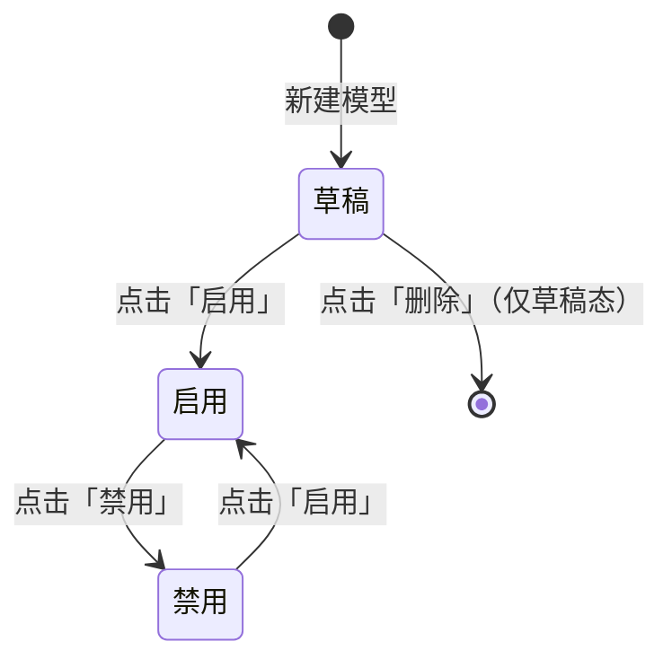
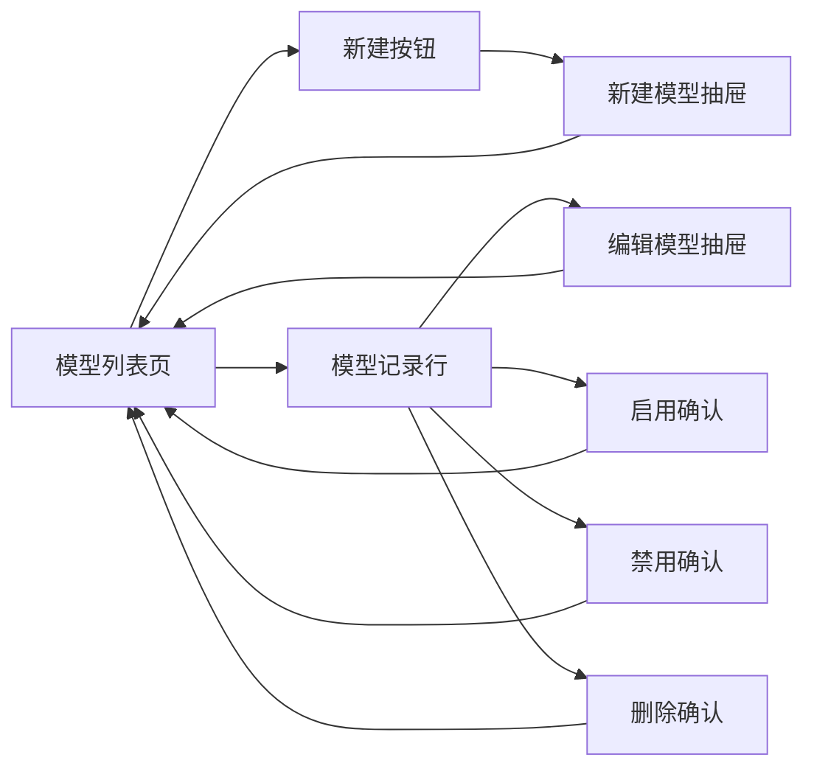
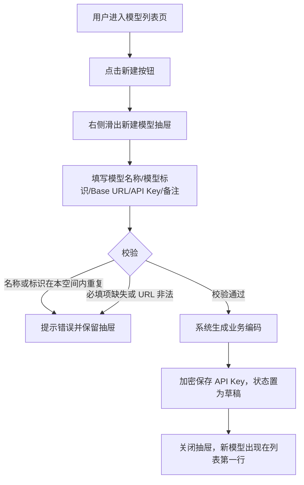
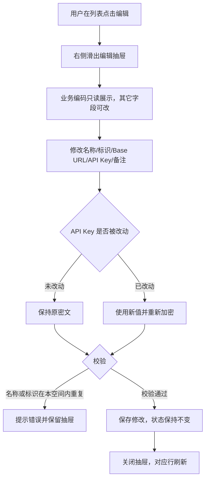
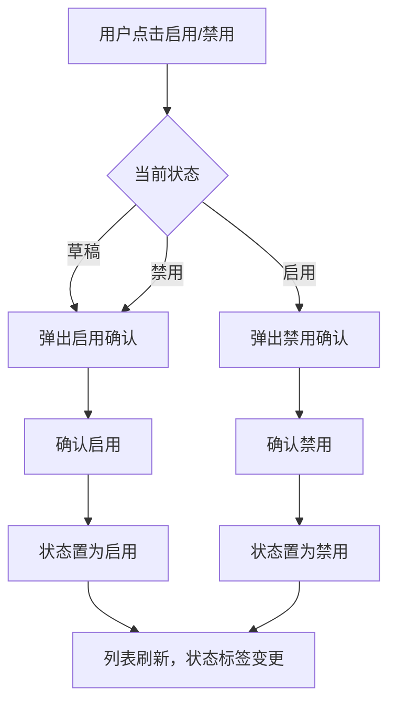
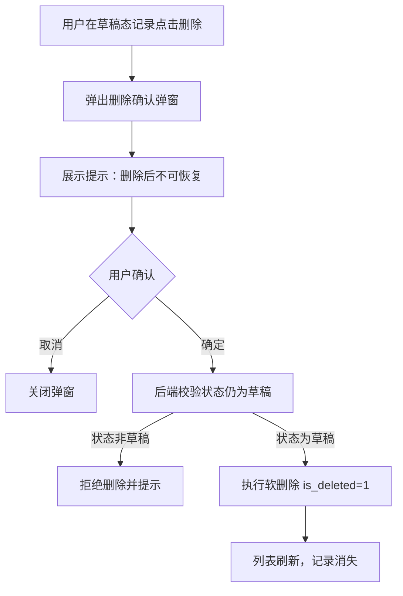
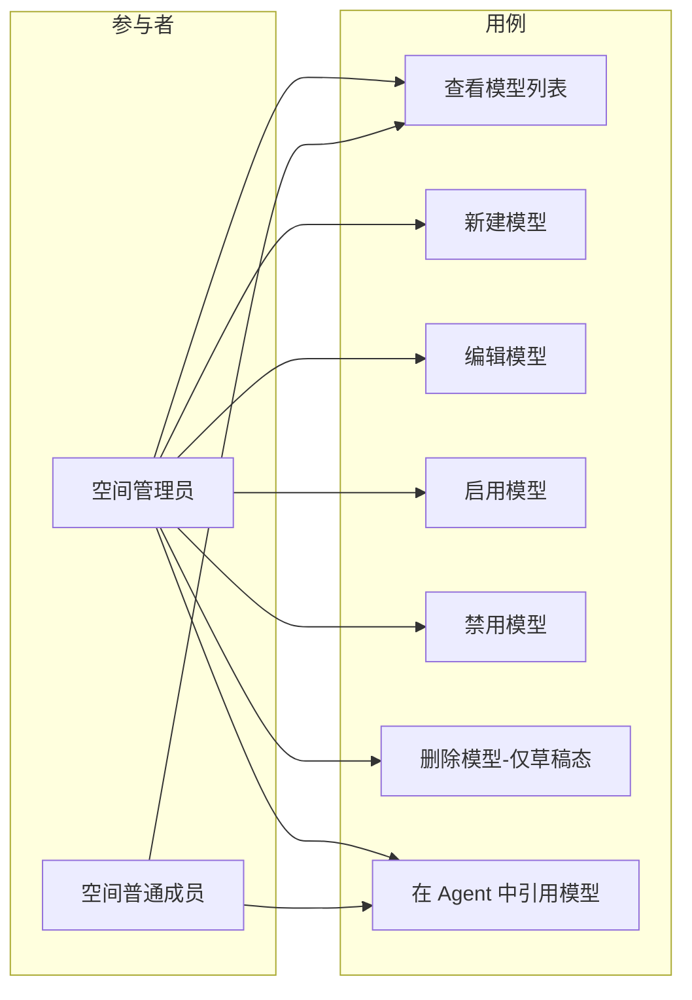

# AgentOps 平台 — 模型管理 PRD

| 文档版本 | 日期 | 编写人 | 说明 |
|---------|------|-------|------|
| V1.0 | 2026-06-13 | AgentOps Team | 模型管理模块 PRD 初稿 |
| V1.1 | 2026-06-13 | AgentOps Team | 对齐《UI 信息架构与导航规范》：模型管理位于空间 Shell「模型与工具」分组下 |

---

## 1. 产品/需求背景

AgentOps 平台中，**模型（Model）** 是 Agent 的「大脑」——所有 Agent 的推理能力都来自其引用的模型配置。平台支持接入多个 LLM 供应商（OpenAI、Anthropic、Azure OpenAI、阿里百炼、本地 Ollama 等），不同空间通常会按业务场景配置不同的模型实例。

当前平台已具备 **用户管理**、**空间管理** 能力，但尚未提供空间内的模型管理能力。Agent 模块的落地依赖模型配置先行：必须先在空间内注册模型（含 Base URL、API Key、模型标识等），Agent 才能引用。

本期需求即建设 **空间内模型管理** 模块的 MVP 版本，提供模型的全生命周期管理（草稿、启用、禁用），并以**右侧抽屉**形式承载新建/编辑界面，避免页面跳转打断列表上下文。

---

## 2. 目标与范围

### 2.1 目标

- 在空间内提供模型配置的注册、编辑、状态流转、删除能力，作为 Agent 模块引用模型的基础。
- 通过「草稿/启用/禁用」三态状态机控制模型可用性，保护已被 Agent 引用的模型配置不被误删。
- 通过右侧抽屉形式承载新建/编辑表单，提供良好的录入体验且不打断列表浏览上下文。
- 将 API Key 等敏感字段加密存储、脱敏展示，满足安全要求。

### 2.2 范围

| 范围 | 是否包含 | 说明 |
|------|----------|------|
| 模型新增 | 包含 | 通过右侧抽屉录入模型配置；初始状态为「草稿」 |
| 模型编辑 | 包含 | 通过右侧抽屉修改模型字段；业务编码不可修改 |
| 模型启用 | 包含 | 草稿态/禁用态 → 启用态 |
| 模型禁用 | 包含 | 启用态 → 禁用态 |
| 模型删除 | 包含 | 仅草稿态可删除；采用软删除（`is_deleted=1`） |
| 模型列表 | 包含 | 表格形式展示当前空间内的全部模型 |
| 模型连通性测试 | 不包含 | 后续迭代提供「测试连通」按钮 |
| 模型参数预设（temperature/max_tokens 等） | 不包含 | 后续迭代独立模块承接 |
| 模型用量统计 | 不包含 | 后续迭代独立模块承接 |
| API Key 多 Key 轮转 | 不包含 | 后续迭代支持 |
| 跨空间共享模型 | 不包含 | 模型严格归属单个空间，不支持跨空间引用 |

### 2.3 模型字段

| 字段 | 必填 | 规则 | 示例 |
|------|------|------|------|
| 业务编码 | 是 | 系统生成，**不允许手工编辑或修改**。格式：`MD` + `yyyyMMddHHmmssSSS` + 四位随机数 | `MD202606131426301234567` |
| 模型名称 | 是 | 1～50 个字符；同一空间内不可重复 | `通用对话-Claude Sonnet` |
| 模型标识 | 是 | 调用 LLM 时传给供应商的 `model` 参数，1～100 字符；同一空间内不可重复 | `claude-sonnet-4-6` |
| Base URL | 是 | 合法 URL（http/https）；不超过 500 字符 | `https://api.anthropic.com/v1` |
| API Key | 是 | 1～500 字符；后端**加密存储**，前端**脱敏展示**（仅显示前 4 位 + `****` + 后 4 位） | `sk-ant-****abcd` |
| 备注 | 否 | 200 字以内 | `团队默认对话模型，月预算 2000 美元` |
| 状态 | 是 | 枚举：`草稿` / `启用` / `禁用`；新建时默认为 `草稿` | `启用` |
| 所属空间 | 是 | 系统记录，绑定当前空间 ID，不可手工修改 | `SP202606131426301234567` |
| 创建人 | 是 | 系统记录，不可手工编辑 | `张三` |
| 创建时间 | 是 | 系统记录 | `2026-06-13 14:26:30` |
| 更新人 | 是 | 系统记录 | `李四` |
| 更新时间 | 是 | 系统记录 | `2026-06-13 18:00:00` |
| 是否删除 | 是 | 软删除标识；列表/详情默认过滤已删除模型 | `否` / `是` |

> 说明：API Key 仅在新建/编辑时由用户输入；编辑场景下输入框默认展示脱敏密文，如不修改则保持原值，如修改则覆盖原值。

### 2.4 模型状态流转



| 当前状态 | 可执行操作 | 说明 |
|---------|-----------|------|
| 草稿 | 编辑、启用、删除 | 草稿态用于配置阶段，可自由编辑和删除；点击「启用」后即可被 Agent 引用 |
| 启用 | 编辑、禁用 | 启用态可被 Agent 引用；不可删除（防止已绑定 Agent 的模型被误删） |
| 禁用 | 编辑、启用 | 禁用态不可被 Agent 引用（已绑定 Agent 调用时报错或回退）；不可删除 |

> 说明：**只有「草稿态」支持删除**。启用态/禁用态如需清理，须先确认无 Agent 引用后由系统设置中的归档能力承接（本期不做）。

---

## 3. 系统线框图（必选）

> 全平台 UI 信息架构与导航以《UI 信息架构与导航规范》（`doc/产品方案/2026-06-13_UI信息架构与导航规范.md`）为单一来源。本节仅描述本模块在空间 Shell 中的位置与模块内页面结构。

### 3.1 模型管理在空间 Shell 中的位置

模型管理位于空间 Shell 左侧导航的「模型与工具」分组下，与 Prompt 管理、Skill 管理、工具管理同组。

```text
空间 Shell
┌──────────────────────────────────────────────────────────────────────┐
│ [Logo] AgentOps │ 当前空间：家庭客服 ▼          [👤 当前用户 ▼]      │
├──────────────────┬────────────────────────────────────────────────────┤
│ 📊 工作台         │                                                    │
│ ━ Agent 与沙箱 ━  │                                                    │
│ ━ 模型与工具 ━    │                                                    │
│  🧠 模型管理 ◀──│  当前页：模型列表                                  │
│  📝 Prompt 管理  │                                                    │
│  🛠 Skill 管理    │                                                    │
│  🔧 工具管理      │                                                    │
│ ━ 调试与评测 ━    │                                                    │
│ 👥 空间成员       │                                                    │
└──────────────────┴────────────────────────────────────────────────────┘
```

### 3.2 模型管理模块页面结构



**模块说明**：

| 模块 | 职责 |
|------|------|
| 模型列表页 | 表格形式展示当前空间内全部模型；提供搜索、状态筛选、新建按钮 |
| 新建按钮 | 列表右上角主按钮，点击后从右侧滑出新建模型抽屉 |
| 模型记录行 | 单条模型记录，展示关键字段及对应操作按钮（按状态显隐） |
| 新建/编辑模型抽屉 | 右侧滑出抽屉，承载模型字段录入/修改表单 |
| 启用/禁用/删除确认 | 对应操作的二次确认弹窗 |

---

## 4. 业务流程图（必选）

### 4.1 模型新增流程



### 4.2 模型编辑流程



### 4.3 模型状态流转流程



### 4.4 模型删除流程



---

## 5. 用例图（必选）



**图例说明**：

| 参与者 | 含义 |
|--------|------|
| 空间管理员 | 包含创建人在内的全部管理员，可对模型执行新增/编辑/启用/禁用/删除 |
| 空间普通成员 | 仅可查看模型列表（不含 API Key 明文）和在 Agent 中引用启用态模型，不能管理模型 |

| 用例 | 含义 | 优先级 |
|------|------|--------|
| 查看模型列表 | 浏览当前空间内全部模型 | P0 |
| 新建模型 | 通过右侧抽屉录入模型配置 | P0 |
| 编辑模型 | 通过右侧抽屉修改模型配置（业务编码只读） | P0 |
| 启用模型 | 草稿态/禁用态 → 启用态 | P0 |
| 禁用模型 | 启用态 → 禁用态 | P0 |
| 删除模型 | 仅草稿态可删除（软删除） | P0 |
| 在 Agent 中引用模型 | Agent 模块的下游用例，本期不在模型管理范围内实现 | P1 |

---

## 6. 用户与场景

### 6.1 用户角色

- **空间管理员**：可对当前空间内模型执行全部管理操作。
- **空间普通成员**：仅可查看模型列表和在 Agent 中引用启用态模型；列表中不展示 API Key。
- **平台管理员（系统设置）**：本期不参与；未来可在系统设置中下发「全局推荐模型」（不在本期范围）。

### 6.2 典型用户故事

- 作为空间管理员，我希望在新建空间后能立刻为空间注册第一个 LLM 模型（如 Claude Sonnet 4.6），以便后续创建 Agent。
- 作为空间管理员，我希望先以「草稿」状态录入并验证 Base URL 与 API Key 是否正确，再点击「启用」让模型对 Agent 可见。
- 作为空间管理员，我希望临时停用某个模型（如月度预算用尽），通过「禁用」让 Agent 自动回退到其他模型，无需删除配置。
- 作为空间管理员，我希望误录入的草稿模型可以直接删除，但已经启用过的模型不可被任何人误删，以保护历史 Agent 引用。
- 作为空间普通成员，我希望在 Agent 配置中能选择本空间内启用态的模型，但**看不到**任何模型的 API Key 明文。

---

## 7. 功能需求

| 序号 | 功能点 | 简要说明 | 优先级 |
|------|--------|----------|--------|
| 1 | 模型列表 | 表格展示当前空间内全部模型（按 `is_deleted=0` 过滤）；列：模型名称、模型标识、Base URL、状态、备注、更新时间、操作 | P0 |
| 2 | 列表搜索与筛选 | 支持按模型名称/模型标识模糊搜索；支持按状态（草稿/启用/禁用）筛选 | P0 |
| 3 | 新建模型（右侧抽屉） | 列表右上角「新建」按钮触发右侧抽屉；录入名称、模型标识、Base URL、API Key、备注；提交后状态默认为「草稿」 | P0 |
| 4 | 编辑模型（右侧抽屉） | 列表行「编辑」按钮触发右侧抽屉；业务编码只读；API Key 默认脱敏占位，留空保持原值 | P0 |
| 5 | 启用模型 | 在草稿态/禁用态记录上展示「启用」按钮；二次确认后状态置为启用 | P0 |
| 6 | 禁用模型 | 在启用态记录上展示「禁用」按钮；二次确认后状态置为禁用 | P0 |
| 7 | 删除模型 | 仅草稿态展示「删除」按钮；二次确认后软删除（`is_deleted=1`）；后端再次校验状态防越权 | P0 |
| 8 | 业务编码自动生成 | 提交新建时由系统按 `MD + yyyyMMddHHmmssSSS + 四位随机数` 规则生成；不可手工编辑 | P0 |
| 9 | 名称与标识唯一性校验 | 同一空间内模型名称不可重复，模型标识不可重复；提交时前后端双重校验 | P0 |
| 10 | API Key 加密与脱敏 | 后端使用对称加密存储；前端列表/详情/编辑预填均仅显示脱敏值（`sk-xxxx****xxxx`）；普通成员视图直接隐藏该字段 | P0 |
| 11 | 操作按钮显隐 | 「新建」「编辑」「启用」「禁用」「删除」按钮仅对空间管理员可见；普通成员仅可见列表（脱敏） | P0 |
| 12 | 状态标签 | 列表中状态以颜色标签区分：草稿（灰）、启用（绿）、禁用（橙） | P0 |
| 13 | URL 合法性校验 | Base URL 须以 `http://` 或 `https://` 开头；提交前前端校验，提交时后端再校验 | P1 |
| 14 | 抽屉关闭确认 | 抽屉中存在未保存的修改时，关闭前提示用户确认 | P1 |
| 15 | 列表分页与排序 | 默认按更新时间倒序；分页 20 条/页 | P1 |
| 16 | 空态展示 | 空间内无任何模型时，列表区展示空态插画与「新建模型」引导按钮 | P1 |

---

## 8. 原型图/界面说明（必选）

### 8.1 模型列表页

```text
┌────────────────────────────────────────────────────────────────────────────────────┐
│ AgentOps  /  [家庭客服 Agent ▼]  /  模型                                            │
├────────────────────────────────────────────────────────────────────────────────────┤
│  模型管理                                                                          │
│                                                                                    │
│  [搜索模型名称/标识 🔍]   状态：[全部 ▼]                              [+ 新建模型] │
│                                                                                    │
│  ┌────────────────────────────────────────────────────────────────────────────┐  │
│  │ 模型名称        │ 模型标识              │ Base URL                 │ 状态  │ 操作 │
│  ├─────────────────┼───────────────────────┼──────────────────────────┼───────┼──────┤
│  │ 通用对话-Claude │ claude-sonnet-4-6    │ https://api.anthropic... │ 启用  │ 编辑 / 禁用      │
│  │ 编码助手-GPT    │ gpt-4o               │ https://api.openai.com   │ 草稿  │ 编辑 / 启用 / 删除 │
│  │ 离线试验-Llama  │ llama-3.1-70b        │ http://10.10.0.5:8000    │ 禁用  │ 编辑 / 启用      │
│  └────────────────────────────────────────────────────────────────────────────┘  │
│                                              共 3 条   < 1 >  20 条/页 ▼          │
└────────────────────────────────────────────────────────────────────────────────────┘
```

**说明**：
- 表格列：模型名称、模型标识、Base URL（过长截断悬浮提示）、状态（彩色标签）、备注（图标悬浮显示，可省略）、更新时间、操作。
- 操作按钮按状态显隐：
  - 草稿态：`编辑 / 启用 / 删除`
  - 启用态：`编辑 / 禁用`
  - 禁用态：`编辑 / 启用`
- 列表 **不展示 API Key**；只能通过编辑抽屉以脱敏形式查看。

### 8.2 新建模型抽屉（右侧滑出）

```text
                                                  ┌────────────────────────────────────┐
                                                  │ 新建模型                       ✕   │
                                                  ├────────────────────────────────────┤
                                                  │ 业务编码                            │
                                                  │ [系统生成，提交后展示]              │
                                                  │                                    │
                                                  │ 模型名称 *                          │
                                                  │ [_________________________________]│
                                                  │                                    │
                                                  │ 模型标识 *                          │
                                                  │ [_________________________________]│
                                                  │ ⓘ 调用 LLM 时传给供应商的 model 参数│
                                                  │                                    │
                                                  │ Base URL *                          │
                                                  │ [_________________________________]│
                                                  │ ⓘ 须以 http(s):// 开头              │
                                                  │                                    │
                                                  │ API Key *                           │
                                                  │ [····································]│
                                                  │ ⓘ 加密存储，列表不展示              │
                                                  │                                    │
                                                  │ 备注                                │
                                                  │ [_________________________________]│
                                                  │ [_________________________________]│
                                                  │                                    │
                                                  ├────────────────────────────────────┤
                                                  │              [取消]   [保存为草稿] │
                                                  └────────────────────────────────────┘
```

**说明**：
- 抽屉宽度建议 480px～520px；从浏览器窗口右侧滑出，遮罩列表。
- 业务编码字段为占位提示文字，提交成功后回显（编辑模式下展示真实编码）。
- API Key 输入框使用密码型输入（默认隐藏字符），可由用户点击眼睛图标切换可见。
- 主按钮文字为「保存为草稿」，提交后状态固定为「草稿」；如需启用须在列表中再次点击启用。

### 8.3 编辑模型抽屉

布局与 8.2 一致，差异点：

- 标题改为「编辑模型」。
- 业务编码字段为**只读**展示，灰显不可编辑。
- API Key 输入框**预填脱敏密文**（如 `sk-an****abcd`），用户可清空后输入新值；若保持原值不动，提交时不更新 API Key。
- 主按钮文字为「保存」，提交后状态保持不变（编辑不影响状态机）。

### 8.4 启用 / 禁用确认弹窗

```text
┌──────────────────────────────────────────────────────────────────┐
│  启用模型                                                  ✕    │
├──────────────────────────────────────────────────────────────────┤
│                                                                  │
│  是否启用模型「通用对话-Claude Sonnet」？                         │
│  启用后，该模型可被本空间内 Agent 引用。                          │
│                                                                  │
├──────────────────────────────────────────────────────────────────┤
│                                       [取消]   [确定启用]        │
└──────────────────────────────────────────────────────────────────┘
```

禁用弹窗文案对应调整为：
> 是否禁用模型「XXX」？禁用后，该模型不可被新建 Agent 引用；已绑定 Agent 调用时将根据降级策略处理。

### 8.5 删除确认弹窗（仅草稿态）

```text
┌──────────────────────────────────────────────────────────────────┐
│  ⚠ 删除模型                                                ✕    │
├──────────────────────────────────────────────────────────────────┤
│                                                                  │
│  确定删除模型「编码助手-GPT」？删除后不可恢复。                    │
│                                                                  │
│  ⓘ 仅草稿态模型可被删除；已启用或被禁用过的模型请改用「禁用」操作。│
│                                                                  │
├──────────────────────────────────────────────────────────────────┤
│                                       [取消]   [确定删除]        │
└──────────────────────────────────────────────────────────────────┘
```

### 8.6 关键状态

| 状态 | 说明 |
|------|------|
| 空态 | 空间内无任何模型时，列表区展示空态插画 + 引导文案「为本空间注册第一个模型，开始创建 Agent」+ 主按钮「新建模型」 |
| 加载中 | 列表区展示骨架屏占位 |
| 校验失败 | 抽屉内字段下方红字提示具体错误（名称重复、标识重复、URL 非法、必填缺失） |
| 抽屉未保存关闭 | 用户在有改动情况下点击关闭/遮罩，弹出二次确认「未保存的修改将丢失，确定离开吗？」 |
| 越权 | 普通成员通过 URL 直访新建/编辑接口或操作按钮时，前端 toast 提示「无权限操作」并保留在列表页（按钮在 UI 上本就不可见，此处为防御层） |
| 启用/禁用按钮 loading | 点击确定后按钮置于 loading 态直至接口返回 |

---

## 9. 非功能需求

- **性能**：列表分页 20 条/页，首屏 1.5 秒内渲染完成；模型创建/状态变更接口响应 < 800ms（不含外部 LLM 网络耗时）。
- **安全/权限**：
  - 仅启用态登录用户 + 空间成员可访问模型管理页面；
  - 仅空间管理员可调用新建、编辑、启用、禁用、删除接口；普通成员调用应被服务端拒绝（403）；
  - **API Key 加密存储**：使用平台对称密钥（KMS 或同等方案）加密入库，禁止明文落库；
  - **API Key 脱敏返回**：所有列表/详情接口返回 API Key 时仅回填脱敏值（`前 4 位 + **** + 后 4 位`），普通成员视图字段直接置空；
  - 删除接口须在服务端校验当前状态确为「草稿」，否则拒绝（防止前端绕过）；
  - 编辑、启用、禁用接口须校验目标模型 `spaceId` 与当前上下文一致，防止跨空间操作。
- **数据治理**：
  - 删除采用软删除（`is_deleted=1`），数据保留以备审计；
  - 列表/编辑接口默认过滤已软删除模型；
  - 空间被软删除时，空间内模型一并不可访问，但底层数据保留。
- **审计**：模型的新增、编辑、启用、禁用、删除应记录操作人、操作时间、操作前后字段差异（API Key 字段差异以脱敏值记录），便于后续审计。
- **兼容/多端**：本期仅 Web；右侧抽屉在 1280px 宽度下保证抽屉宽度 ≥ 480px；最小支持 1024px 分辨率。
- **可访问性**：抽屉支持 Esc 关闭（触发未保存确认）、Enter 提交。

---

## 10. 与现有功能的关系

- **与空间管理**：模型管理为**空间内资源**，所有模型记录必须携带 `spaceId`；空间软删除时，空间内模型一并不可访问；模型不允许跨空间共享或迁移。
- **与用户管理**：模型管理沿用空间成员体系（管理员可管、普通成员可见列表但不可见 API Key）；不引入独立的模型角色。
- **与 Agent 管理（下游）**：Agent 配置时通过下拉选择当前空间内**启用态**模型；草稿态/禁用态模型不出现在选择列表中；本期不实现 Agent 模块，但模型字段（业务编码、模型标识）须为后续 Agent 引用预留稳定标识。
- **与系统设置**：本期模型管理不依赖系统设置；未来「平台默认推荐模型」「全局密钥策略」等配置由系统设置承接，不在本期范围。
- **与运行时（下游）**：模型禁用后，运行时调用绑定该模型的 Agent 时，按 Agent 模块的降级策略处理（本期不实现，仅在禁用确认文案中提示用户）。

---

## 11. 验收标准

- [ ] 空间管理员进入空间后可在侧边栏访问「模型」页面，看到本空间内所有未删除模型。
- [ ] 列表支持按模型名称/标识模糊搜索，按状态（草稿/启用/禁用）筛选；默认按更新时间倒序展示，分页 20 条/页。
- [ ] 列表中**不展示 API Key**；普通成员可见列表但操作列仅可见禁用的灰显或不可见。
- [ ] 点击「新建模型」按钮从右侧滑出抽屉，正确录入字段后提交成功；业务编码自动生成且符合 `MD + 时间戳 + 4 位随机数` 规则；新建后状态为「草稿」。
- [ ] 同一空间内模型名称、模型标识不可重复，重复提交时返回明确错误提示。
- [ ] Base URL 必须以 `http://` 或 `https://` 开头，否则前端校验拦截。
- [ ] 编辑抽屉中业务编码只读；API Key 默认脱敏预填；不修改 API Key 时保存不会覆盖原密文。
- [ ] 草稿态记录展示「编辑 / 启用 / 删除」三个操作；启用态展示「编辑 / 禁用」；禁用态展示「编辑 / 启用」。
- [ ] 启用/禁用操作均经过二次确认，确认后状态正确流转，列表对应行刷新。
- [ ] 删除操作仅在草稿态可见；后端在执行删除前再次校验状态为草稿，状态非草稿时返回 403 并提示。
- [ ] 删除采用软删除，数据库 `is_deleted=1`，物理记录保留；列表与详情接口默认过滤已删除记录。
- [ ] 普通成员调用新建/编辑/启用/禁用/删除接口时返回 403。
- [ ] 模型记录的新增、编辑、启用、禁用、删除操作均记录审计日志（操作人、操作时间、操作前后差异），API Key 字段以脱敏值入审计。
- [ ] 空间内无模型时，列表区展示空态插画与引导文案「为本空间注册第一个模型，开始创建 Agent」。
- [ ] 抽屉中存在未保存修改时，点击关闭/遮罩须弹出二次确认，确认后才丢弃修改。
