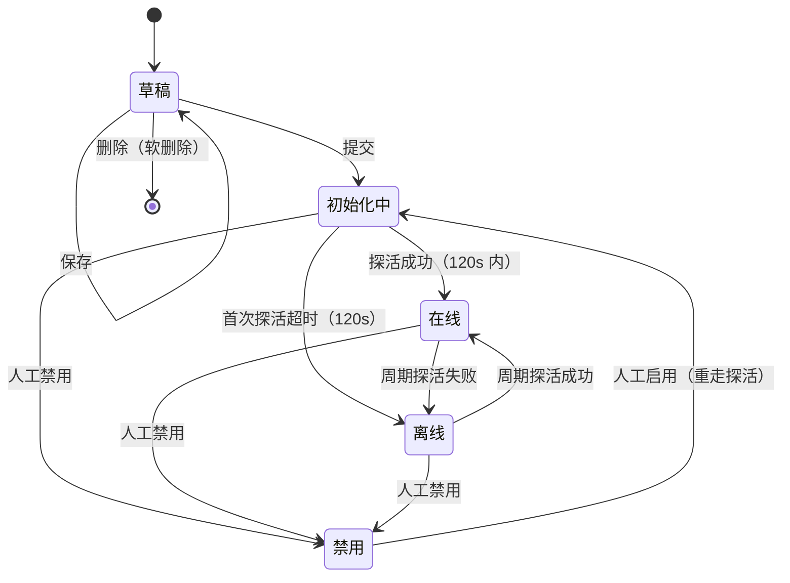
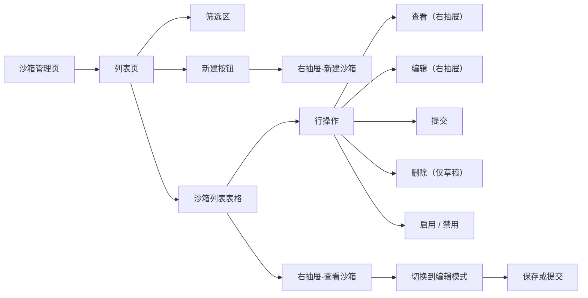
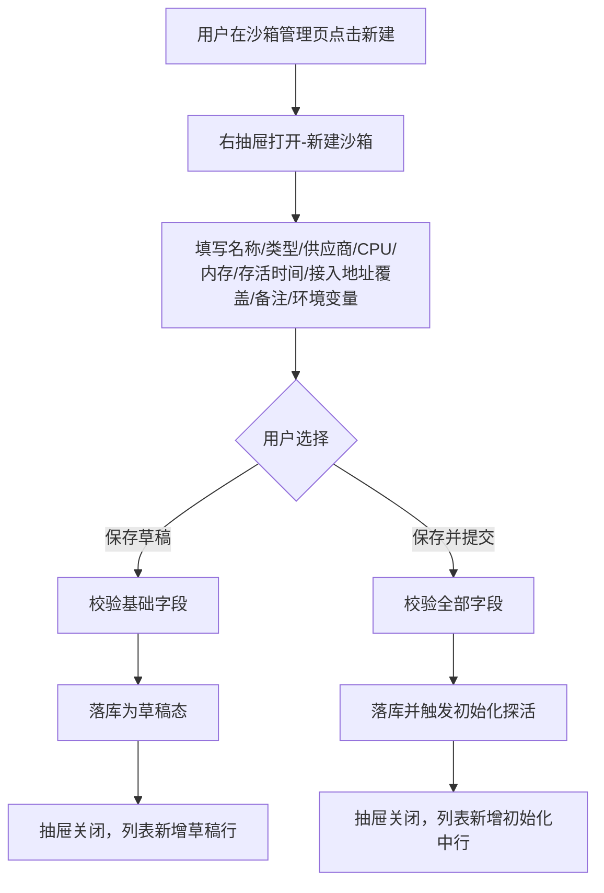
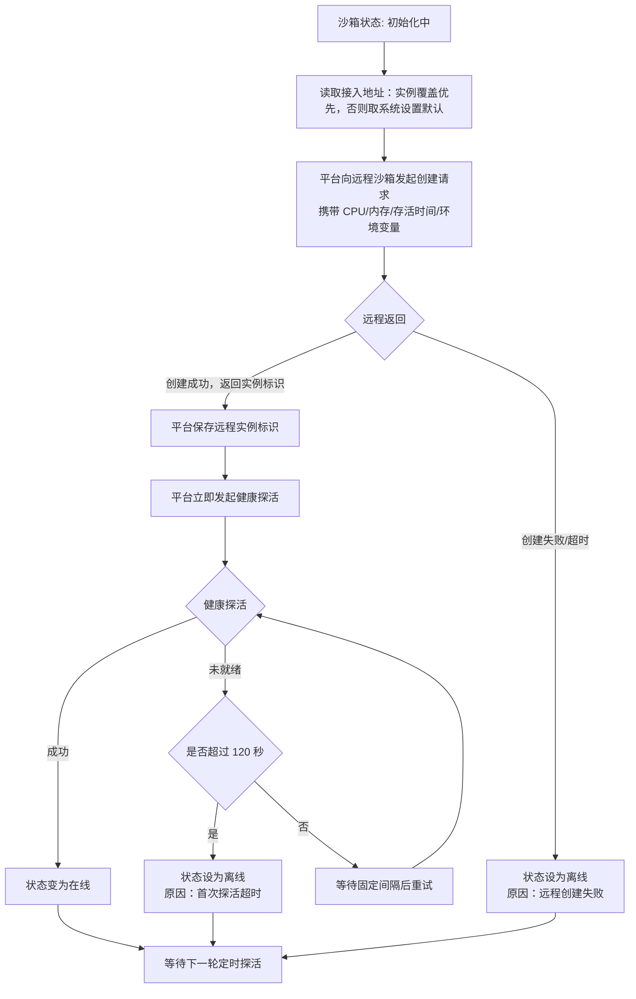
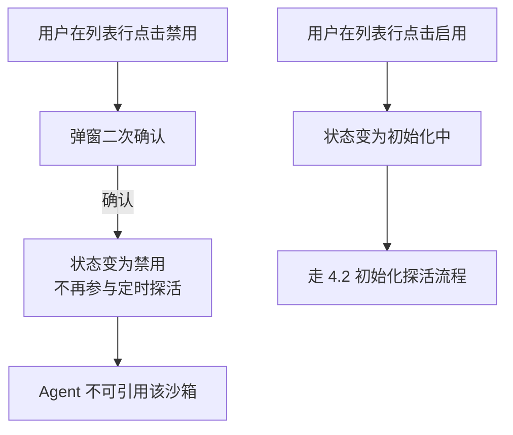
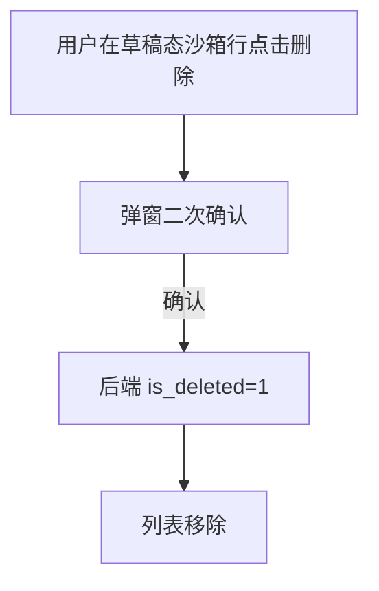
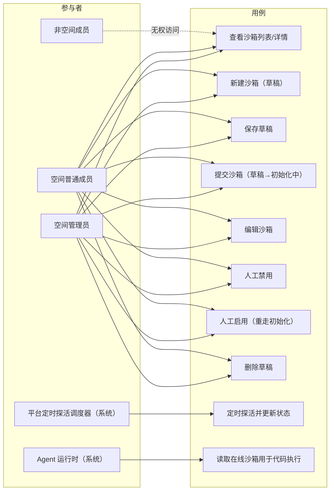

# AgentOps 平台 — 沙箱管理 PRD

| 文档版本 | 日期 | 编写人 | 说明 |
|---------|------|-------|------|
| V1.0 | 2026-06-13 | AgentOps Team | 沙箱管理模块 PRD 初稿 |
| V1.1 | 2026-06-13 | AgentOps Team | 对齐《UI 信息架构与导航规范》：沙箱管理位于空间 Shell「Agent 与沙箱」分组下 |

---

## 1. 产品/需求背景

AgentOps 平台需要支持 Agent 在执行过程中调用「代码沙箱」执行受限的 Python/Shell 等代码片段（如数据分析、图表生成、脚本类工具）。直接在平台进程内执行代码风险高，需要将代码下放到隔离的远程沙箱中运行。

业内主流远程代码沙箱方案：

- **OpenSandbox**：开源的代码沙箱实现，可自部署；
- **阿里云沙箱**：阿里云提供的远程沙箱服务，按用量计费。

平台需要一个 **沙箱管理** 模块，让空间用户可以在自己的空间内：

- 注册一个或多个沙箱实例；
- 为沙箱配置 CPU、内存、存活时间、环境变量等运行参数；
- 由系统自动检查沙箱是否启动成功，并周期性探活其在线状态；
- 在 Agent 执行代码时引用一个「在线」的沙箱实例。

本 PRD 聚焦沙箱实例的 **增删查改、状态自动流转、定时探活与人工禁用**。

---

## 2. 目标与范围

### 2.1 目标

- 在每个空间内提供独立、可治理的「远程沙箱实例」资产库；
- 通过 **草稿 → 初始化中 → 在线 ↔ 离线 / 禁用** 的状态机区分用户配置态、系统启动态、运行态、人工干预态；
- 通过统一接入地址（系统设置）+ 实例级覆盖能力，灵活支持 OpenSandbox / 阿里云沙箱两种供应商；
- 通过定时探活保证沙箱在线状态的准确性，避免 Agent 引用到已经离线的沙箱。

### 2.2 范围

| 范围 | 是否包含 | 说明 |
|------|----------|------|
| 沙箱新增 | 包含 | 在空间内新建沙箱草稿，生成业务编码 |
| 沙箱编辑 | 包含 | 草稿态可改全部字段；非草稿态可改名称、备注、环境变量；CPU/内存/存活时间/类型 提交后不可改 |
| 沙箱删除 | 包含 | 仅草稿态允许删除（伪删除） |
| 沙箱提交 | 包含 | 草稿提交后进入「初始化中」，系统按接入地址校验启动成功 |
| 沙箱启用/禁用（人工） | 包含 | 用户可对非草稿沙箱手动禁用；禁用态可重新启用并重走初始化 |
| 状态自动流转 | 包含 | 系统按探活结果在 初始化中/在线/离线 之间流转；人工不参与子状态切换 |
| 定时探活 | 包含 | 平台后台定时对非草稿/非禁用沙箱发起平台探活并更新状态；间隔在系统设置中可配 |
| 右抽屉式查看/编辑 | 包含 | 沙箱的查看、编辑统一通过右抽屉进行 |
| 环境变量维护 | 包含 | 多组 (key, value, 备注)；提交时下发至远程沙箱实例 |
| 沙箱接入地址 | 包含 | OpenSandbox / 阿里云沙箱的全局接入地址在系统设置中配置；沙箱实例可选填覆盖 |
| 沙箱实际代码执行 | 不包含 | 代码下发与执行由 Agent 运行时承接；本 PRD 仅管理实例 |
| 沙箱执行日志/监控 | 不包含 | 后续迭代考虑 |
| 沙箱用量统计 | 不包含 | 后续迭代考虑 |
| 沙箱与 Agent 引用关系视图 | 不包含 | 由 Agent 模块承接 |
| 沙箱跨空间共享 | 不包含 | 严格归属空间 |
| 沙箱供应商扩展（如 e2b、Modal） | 不包含 | 本期仅支持 OpenSandbox / 阿里云沙箱两类 |
| 沙箱热更新（不重启变更资源） | 不包含 | 资源变更需新建沙箱替换 |

### 2.3 沙箱字段

| 字段 | 必填 | 规则 | 示例 |
|------|------|------|------|
| 业务编码 | 是 | 系统生成，不可手工编辑或修改。格式：`SB` + `yyyyMMddHHmmssSSS` + 四位随机数 | `SB202606131426301234567` |
| 空间编码 | 是 | 系统注入；沙箱必须挂在某个空间下 | `SP202606131426301234567` |
| 名称 | 是 | 1～50 字符；同空间内不要求唯一 | `数据分析-沙箱-A` |
| 类型 | 是 | 枚举，本期仅 `代码沙箱`；预留为后续扩展（如「浏览器沙箱」） | `代码沙箱` |
| 供应商 | 是 | 枚举：`OpenSandbox` / `阿里云沙箱`；与系统设置中的接入地址配置匹配 | `OpenSandbox` |
| CPU | 是 | 浮点数，**步长 0.5 核**，范围 0.5～16；提交后不可修改 | `1.0` |
| 内存（MB） | 是 | 整数，范围 128～32768，步长 128MB；提交后不可修改 | `2048` |
| 存活时间（分钟） | 是 | 整数，范围 1～1440；超过该时间远程沙箱实例自动回收，平台侧标记离线 | `60` |
| 接入地址覆盖 | 否 | 选填；填写后对该实例使用该 host:port，否则使用系统设置默认；提交后可改 | `https://sandbox-a.internal:8080` |
| 备注 | 否 | ≤ 200 字符 | `用于客服 Agent 的数据分析场景` |
| 环境变量 | 否 | 列表，每项 `(key, value, 备注)`；最多 50 项；key 长度 1～64，仅字母数字下划线，首字符为字母或下划线；同一沙箱内 key 唯一；value ≤ 1024 字符；备注 ≤ 100 字符 | 见 §2.5 |
| 状态 | 是 | 枚举：草稿、初始化中、在线、离线、禁用 | `草稿` |
| 远程实例标识 | 是* | 系统记录；提交后由远程沙箱返回 | `os-instance-xxx` |
| 最近探活时间 | 是* | 系统记录；用于判断 staleness | `2026-06-13 15:42:30` |
| 最近状态变更原因 | 否 | 系统记录最近一次状态变更的来源（用户提交、探活成功、探活超时、人工禁用 等） | `探活超时` |
| 创建人 | 是 | 系统记录 | `张三` |
| 创建时间 | 是 | 系统记录 | `2026-06-13 14:26:30` |
| 最近修改人 | 是 | 系统记录 | `张三` |
| 最近修改时间 | 是 | 系统记录 | `2026-06-13 15:42:18` |
| 是否删除 | 是 | 软删除标识 | `否` / `是` |

> 「是\*」字段在草稿态尚不存在，提交后由系统填充。

### 2.4 状态定义与流转

| 状态 | 来源 | 说明 |
|------|------|------|
| 草稿 | 用户 | 已创建但未提交；不与远程沙箱发生交互；可继续编辑、删除 |
| 初始化中 | 系统 | 已提交并触发远程沙箱启动；平台正在等待启动成功的探活结果 |
| 在线 | 系统（探活成功） | 沙箱可被 Agent 引用执行代码 |
| 离线 | 系统（探活失败/超时/远程实例已回收） | 沙箱不可用；继续被定时探活，可能恢复为在线 |
| 禁用 | 用户（人工） | 用户主动停用；不参与定时探活；不可被 Agent 引用 |



**关键约束**：

- 初始化中 / 在线 / 离线 三个子状态由系统探活结果驱动，**用户不可直接在它们之间手动切换**；
- 用户能进行的状态操作只有：草稿 → 初始化中（提交）、非草稿 → 禁用（人工禁用）、禁用 → 初始化中（人工启用）；
- 启用与「重新启动」等价：会重走 §4.2 的初始化探活流程。

### 2.5 环境变量结构

每个沙箱可配置 0～50 组环境变量，每组包含：

| 子字段 | 必填 | 规则 |
|--------|------|------|
| key | 是 | 1～64 字符；字母数字下划线；首字符为字母或下划线；同一沙箱内 key 唯一 |
| value | 是 | ≤ 1024 字符；保存后视为敏感信息，列表中仅以 `***` 占位回显，详情抽屉支持「点击眼睛图标查看」（按权限） |
| 备注 | 否 | ≤ 100 字符；说明该变量的用途 |

**示例**：

```text
key=PYTHONPATH        value=/workspace/lib            备注=数据分析依赖路径
key=OSS_ENDPOINT      value=https://oss-cn-hz.aliy…   备注=对象存储入口
key=API_TOKEN         value=***                        备注=外部 API 调用令牌
```

环境变量的下发时机：**沙箱提交时**作为初始化参数传入远程沙箱；编辑环境变量后**不会自动下发**到已运行的沙箱（本期不做热更新），用户需将沙箱禁用后再启用，触发重新初始化。

---

## 3. 系统线框图（必选）

> 全平台 UI 信息架构与导航以《UI 信息架构与导航规范》（`doc/产品方案/2026-06-13_UI信息架构与导航规范.md`）为单一来源。本节仅描述本模块在空间 Shell 中的位置与模块内页面结构。

### 3.1 在空间 Shell 中的位置

沙箱管理位于空间 Shell 左侧导航的「Agent 与沙箱」分组下，与 Agent 管理同组。

```text
空间 Shell
┌──────────────────────────────────────────────────────────────────────┐
│ [Logo] AgentOps │ 当前空间：家庭客服 ▼          [👤 当前用户 ▼]      │
├──────────────────┬────────────────────────────────────────────────────┤
│ 📊 工作台         │                                                    │
│ ━ Agent 与沙箱 ━  │                                                    │
│  🤖 Agent 管理    │                                                    │
│  📦 沙箱管理 ◀──│  当前页：沙箱管理                                  │
│ ━ 模型与工具 ━    │                                                    │
│ ━ 调试与评测 ━    │                                                    │
│ 👥 空间成员       │                                                    │
└──────────────────┴────────────────────────────────────────────────────┘
```

### 3.2 模块页面结构



| 模块 | 类型 | 职责 |
|------|------|------|
| 沙箱列表页 | 表格 + 筛选 | 展示当前空间下全部沙箱及其状态 |
| 右抽屉（新建/编辑/查看） | 抽屉 | 沙箱的查看、编辑、新建均通过右抽屉，不使用整页跳转 |

> 与 Prompt/工具/Skill 等模块的「整页编辑」差异点：沙箱字段较少，且编辑频率高于内容编辑，因此选择右抽屉以减少跳转成本，便于在列表页快速调整。

---

## 4. 业务流程图（必选）

### 4.1 新建并保存草稿沙箱



### 4.2 提交后的初始化探活流程（核心）



> 首次启动判定的总超时为 **120 秒**；超时后状态置为「离线」，但仍会进入下一轮定时探活，因此短暂启动慢的沙箱仍可在后续探活中恢复为在线。

### 4.3 定时探活流程

```mermaid
flowchart TD
  A[平台定时调度器] --> B[读取系统设置：探活间隔（默认 60 秒）]
  B --> C[扫描所有 状态∈|初始化中,在线,离线| 的沙箱]
  C --> D[对每个沙箱发起健康探活]
  D --> E{探活结果}
  E -->|成功| F[状态置为在线<br/>更新最近探活时间]
  E -->|失败/超时| G[状态置为离线<br/>更新最近探活时间与失败原因]
  F --> H[继续下一轮调度]
  G --> H
```

> 定时探活仅作用于「初始化中、在线、离线」三种状态；草稿与禁用态不参与探活。

### 4.4 人工禁用 / 启用流程



### 4.5 删除沙箱流程



> 仅草稿态允许删除；非草稿态行不展示「删除」按钮（避免误删已上线沙箱）。如确实需要清理已上线沙箱，需先「禁用」，由后续「禁用态归档」能力承接（后续迭代）。

---

## 5. 用例图（必选）



**图例说明**：

| 参与者 | 含义 |
|--------|------|
| 空间管理员 / 普通成员 | 本期对沙箱拥有同等增删改查权限（与 [[prompt-management-prd-done]] 保持一致） |
| 非空间成员 | 不可见 |
| 平台定时探活调度器 | 系统内部参与者，按系统设置探活间隔触发 |
| Agent 运行时 | 系统内部参与者，按 (空间编码, 沙箱业务编码 或 名称) 引用启用且在线的沙箱 |

| 用例 | 含义 | 优先级 |
|------|------|--------|
| 查看/新建/编辑/保存/提交/启用/禁用/删除 | 同 §7 | P0 |
| 定时探活并更新状态 | 系统按可配间隔周期执行 | P0 |
| 读取在线沙箱 | Agent 运行时按沙箱标识获取实例信息 | P0 |

---

## 6. 用户与场景

### 6.1 用户角色

- **空间管理员 / 空间普通成员**：均可对沙箱进行增删改查与状态操作；
- **非空间成员**：不可见；
- **平台定时探活调度器**（系统参与者）：周期发起健康探活；
- **Agent 运行时**（系统参与者）：从沙箱仓库读取「启用且在线」的实例进行代码执行。

### 6.2 典型用户故事

- 作为空间成员，我希望注册一个 OpenSandbox 实例，配置 1 核 / 2GB / 60 分钟，并设置 `PYTHONPATH` 和 `API_TOKEN`，提交后由系统自动判定是否启动成功。
- 作为空间成员，我希望系统每分钟自动检查我的沙箱是否还在线，避免我的 Agent 一直引用一个已经回收的实例。
- 作为空间成员，我希望某次启动后远程沙箱并未及时就绪导致状态变成「离线」，但等待几分钟后系统能在下一轮探活中将它自动恢复为「在线」，不需要我手动干预。
- 作为空间成员，我希望临时停用某个沙箱（不删除）以排查问题，确认后能再次启用并自动重新初始化。
- 作为 Agent 运行时，我希望按 (空间编码, 沙箱业务编码) 拉取一个「在线」的沙箱实例配置（含远程地址、远程实例标识），用于代码执行。

---

## 7. 功能需求

| 序号 | 功能点 | 简要说明 | 优先级 |
|------|--------|----------|--------|
| 1 | 空间隔离 | 沙箱必须挂在当前空间；列表/详情/读取按空间过滤；非成员不可见 | P0 |
| 2 | 沙箱列表 | 表格展示业务编码、名称、类型、供应商、CPU/内存、存活时间、状态、最近探活时间、最近修改 | P0 |
| 3 | 列表筛选 | 按状态、供应商、关键字（命中名称/业务编码/备注）筛选；默认按修改时间倒序；分页 20/页 | P0 |
| 4 | 状态徽标 | 草稿=灰、初始化中=蓝（带旋转图标）、在线=绿、离线=橙、禁用=红 | P0 |
| 5 | 右抽屉新建沙箱 | 抽屉形式录入字段；可保存草稿或保存并提交 | P0 |
| 6 | 右抽屉查看沙箱 | 抽屉只读展示全部字段；环境变量 value 默认 `***`，按权限可点击查看 | P0 |
| 7 | 右抽屉编辑沙箱 | 在查看抽屉中切换到编辑模式；按状态约束可编辑字段 | P0 |
| 8 | 业务编码生成 | 系统生成 `SB + yyyyMMddHHmmssSSS + 4 位随机数`，不可手工编辑 | P0 |
| 9 | CPU 步长 0.5 | 输入控件以 0.5 为步长（0.5/1.0/1.5/...），范围 0.5～16 | P0 |
| 10 | 内存步长 128MB | 输入控件以 128MB 为步长，范围 128～32768 | P0 |
| 11 | 存活时间 | 整数，范围 1～1440 分钟 | P0 |
| 12 | 环境变量编辑 | 表格式新增/删除行；同沙箱内 key 唯一；value 默认掩码显示 | P0 |
| 13 | 提交触发初始化 | 草稿提交后状态变为「初始化中」，立即调用远程沙箱接入地址尝试创建实例 | P0 |
| 14 | 首次探活超时 120 秒 | 提交后 120 秒内若未探活成功，则状态置为「离线」（仍参与后续定时探活） | P0 |
| 15 | 定时探活 | 平台后台按系统设置中的探活间隔（默认 60 秒）对所有非草稿/非禁用沙箱发起健康探活 | P0 |
| 16 | 探活结果驱动状态 | 成功 → 在线；失败/超时 → 离线；草稿/禁用不参与 | P0 |
| 17 | 人工禁用 | 非草稿沙箱可手动禁用；二次确认；禁用后不参与探活，且 Agent 不可引用 | P0 |
| 18 | 人工启用 | 禁用态可启用；启用后状态进入「初始化中」并重走探活流程 | P0 |
| 19 | 删除（仅草稿） | 草稿行展示删除按钮；二次确认后软删除 | P0 |
| 20 | 字段编辑约束 | CPU、内存、存活时间、类型、供应商：提交后不可改；其他字段（名称、接入地址覆盖、备注、环境变量）：可改 | P0 |
| 21 | 接入地址覆盖 | 实例可选填覆盖；未填则使用系统设置默认 | P0 |
| 22 | 对外读取契约 | 提供按 (空间编码, 沙箱业务编码) 读取在线沙箱实例信息（含远程地址、远程实例标识、运行参数）的内部接口供 Agent 模块调用；非在线状态不返回 | P0 |
| 23 | 操作审计 | 新建、保存、提交、编辑、启用、禁用、删除、状态由系统切换 均写入审计日志 | P0 |
| 24 | 环境变量不热更新提示 | 编辑环境变量后，UI 给出提示「环境变量更改需先禁用再启用方能生效」 | P1 |
| 25 | 失败原因展示 | 列表/详情展示「最近状态变更原因」字段，便于排查 | P1 |

---

## 8. 原型图/界面说明（必选）

### 8.1 沙箱列表页

```text
┌────────────────────────────────────────────────────────────────────────────────────────┐
│ 当前空间：家庭客服 Agent  /  沙箱管理                                  [当前用户▼]     │
├────────────────────────────────────────────────────────────────────────────────────────┤
│  关键字 [_____________]  状态 [全部▼]  供应商 [全部▼]               [查询]  [+ 新建]   │
├────────────────────────────────────────────────────────────────────────────────────────┤
│ 名称           │ 类型     │ 供应商      │ CPU/内存    │ 存活  │ 状态        │ 最近探活        │ 操作 │
│ 数据分析-A     │ 代码沙箱 │ OpenSandbox │ 1 核 / 2GB │ 60min │ ● 在线      │ 06-13 15:42   │ ⋯   │
│ 调试-test01    │ 代码沙箱 │ OpenSandbox │ 0.5核/1GB  │ 30min │ ◐ 初始化中  │ 06-13 15:39   │ ⋯   │
│ 报表沙箱        │ 代码沙箱 │ 阿里云沙箱   │ 2 核 / 4GB │ 120min│ ● 离线      │ 06-13 15:30   │ ⋯   │
│ 老版数据沙箱     │ 代码沙箱 │ OpenSandbox │ 1 核 / 2GB │ 60min │ ● 禁用      │ —             │ ⋯   │
│ 草稿-未提交     │ 代码沙箱 │ OpenSandbox │ 1 核 / 2GB │ 60min │ ○ 草稿      │ —             │ ⋯   │
│ ...                                                                                       │
│                                                       [< 1 2 3 ... 5 >]                  │
└────────────────────────────────────────────────────────────────────────────────────────┘
```

**行操作（按状态显隐）**：

| 状态 | 操作按钮 |
|------|---------|
| 草稿 | 查看、编辑、提交、删除 |
| 初始化中 | 查看、编辑（仅可改名称/备注/环境变量/接入地址覆盖）、禁用 |
| 在线 | 查看、编辑（仅可改名称/备注/环境变量/接入地址覆盖）、禁用 |
| 离线 | 查看、编辑（仅可改名称/备注/环境变量/接入地址覆盖）、禁用 |
| 禁用 | 查看、启用 |

### 8.2 右抽屉 - 新建/编辑沙箱

```text
                                            ┌────────────────────────────────────────┐
                                            │ 新建沙箱                            ✕  │
                                            ├────────────────────────────────────────┤
                                            │ 业务编码    [系统提交后生成]            │
                                            │ 名称 *      [数据分析-A             ]  │
                                            │ 类型 *      [代码沙箱 ▼]               │
                                            │ 供应商 *    [OpenSandbox ▼]            │
                                            │ CPU(核) *   [-] [1.0] [+] 步长 0.5      │
                                            │ 内存(MB) *  [-] [2048] [+] 步长 128     │
                                            │ 存活(分钟)* [-] [60  ] [+] 范围 1-1440  │
                                            │ 接入地址    [选填，留空使用系统默认]     │
                                            │   覆盖                                 │
                                            │ 备注        [_______________________]  │
                                            │             [_______________________]  │
                                            │                                        │
                                            │ 环境变量                  [+ 新增一行]  │
                                            │ ┌────────────┬──────────┬──────┬──┐  │
                                            │ │ key        │ value    │ 备注  │ │  │
                                            │ │PYTHONPATH  │/workspac │依赖路径│×│  │
                                            │ │API_TOKEN   │********  │API令牌│×│  │
                                            │ └────────────┴──────────┴──────┴──┘  │
                                            │                                        │
                                            │ 状态        [草稿]                     │
                                            ├────────────────────────────────────────┤
                                            │   [取消]   [保存为草稿]   [保存并提交] │
                                            └────────────────────────────────────────┘
```

**说明**：
- 编辑场景下抽屉标题改为「编辑沙箱 - {名称}」；
- 提交后字段可编辑性按 §7 项 20 约束：CPU/内存/存活时间/类型/供应商 灰显锁定，并附「字段已锁定，仅创建时可改」提示；
- 编辑环境变量保存后顶部提示条「环境变量已变更，需禁用后再启用方能生效」（§7 项 24）。

### 8.3 右抽屉 - 查看沙箱

```text
                                            ┌────────────────────────────────────────┐
                                            │ 沙箱详情                            ✕  │
                                            ├────────────────────────────────────────┤
                                            │ 业务编码    SB202606131426301234567    │
                                            │ 名称        数据分析-A                  │
                                            │ 类型        代码沙箱                    │
                                            │ 供应商      OpenSandbox                 │
                                            │ CPU/内存    1 核 / 2048 MB              │
                                            │ 存活时间    60 分钟                     │
                                            │ 接入地址    https://sandbox.internal:80 │
                                            │ 状态        ● 在线                      │
                                            │ 远程实例    os-instance-7f23a           │
                                            │ 最近探活    2026-06-13 15:42:30         │
                                            │ 最近变更    探活成功                    │
                                            │ 备注        用于客服 Agent 数据分析     │
                                            │                                        │
                                            │ 环境变量                                │
                                            │ ┌────────────┬──────────┬─────────┐  │
                                            │ │ key        │ value    │ 备注     │  │
                                            │ │PYTHONPATH  │/workspac │依赖路径  │  │
                                            │ │API_TOKEN   │***  👁   │API 令牌  │  │
                                            │ └────────────┴──────────┴─────────┘  │
                                            │                                        │
                                            │ 创建      张三  06-13 14:26            │
                                            │ 最近修改  张三  06-13 15:42            │
                                            ├────────────────────────────────────────┤
                                            │             [禁用]   [编辑]   [关闭]   │
                                            └────────────────────────────────────────┘
```

> 「禁用 / 启用」按钮按当前状态显隐：在线/离线/初始化中 → 显示「禁用」；禁用 → 显示「启用」；草稿 → 显示「提交」+「删除」。

### 8.4 二次确认弹窗

**禁用确认**：

```text
┌──────────────────────────────────────────┐
│ ⚠ 禁用沙箱                          ✕   │
├──────────────────────────────────────────┤
│ 确定禁用「数据分析-A」吗？                 │
│ 禁用后该沙箱将不再参与探活，                │
│ 已引用该沙箱的 Agent 在执行代码时将失败。  │
├──────────────────────────────────────────┤
│                  [取消]   [确定禁用]      │
└──────────────────────────────────────────┘
```

**启用（重新初始化）确认**：

```text
┌──────────────────────────────────────────┐
│ 启用沙箱                              ✕  │
├──────────────────────────────────────────┤
│ 确定启用「数据分析-A」吗？                 │
│ 启用后将重新初始化远程沙箱，               │
│ 当前的环境变量将被下发。                  │
├──────────────────────────────────────────┤
│                  [取消]   [确定启用]      │
└──────────────────────────────────────────┘
```

**删除（仅草稿）确认**：

```text
┌──────────────────────────────────────────┐
│ ⚠ 删除沙箱                          ✕   │
├──────────────────────────────────────────┤
│ 确定删除「调试-test01」吗？                │
│ 删除后该沙箱将不再出现在列表中。           │
├──────────────────────────────────────────┤
│                 [取消]   [确定删除]       │
└──────────────────────────────────────────┘
```

### 8.5 关键状态

| 状态 | 说明 |
|------|------|
| 加载中 | 列表区/抽屉区展示骨架屏 |
| 空态 | 空间内尚未创建任何沙箱时，列表区展示「注册你的第一个沙箱实例」+「+ 新建」按钮 |
| 校验失败 | 抽屉内字段下方红字提示：CPU 非 0.5 步长 / 内存非 128 步长 / 存活时间超出范围 / 环境变量 key 重复或非法 |
| 提交后等待初始化 | 状态徽标显示「◐ 初始化中」并伴随旋转图标；列表行不可被 Agent 引用 |
| 探活失败 | 状态徽标变橙「● 离线」；hover 显示「最近变更原因：探活超时」 |
| 系统设置接入地址未配置 | 提交时若供应商对应的全局接入地址未配置且实例也未填覆盖，弹窗提示「请先在系统设置中配置 OpenSandbox 接入地址」并阻止提交 |
| 无权限 | 非空间成员通过 URL 直访时，前端 toast「无权限访问」并跳回空间管理页 |

---

## 9. 非功能需求

- **性能**：
  - 列表页分页查询响应 < 1s；
  - 单次健康探活超时上限 5 秒；超过即视为本轮探活失败；
  - 对外读取契约（Agent 运行时拉取在线沙箱）应缓存，命中缓存 < 50ms；状态变更时同步刷新缓存。
- **探活调度**：
  - 默认间隔 60 秒，可在系统设置中调整为 30～600 秒；
  - 同一沙箱在前一轮探活未完成时不发起下一轮；
  - 探活并发由平台后台按池化方式控制（每空间最多并发 8 路），避免下游沙箱供应商被打满。
- **安全/权限**：
  - 仅空间成员可访问当前空间的沙箱模块；后端按空间编码 + 当前用户强制鉴权；
  - 环境变量 value **加密存储**；列表/详情默认掩码显示，仅在前端通过权限校验后允许临时查看；
  - 接入地址覆盖字段值仅对当前空间成员可见；
  - 对外读取契约只返回「在线」沙箱，且响应中环境变量值仅以加密 token 形式或临时凭证形式下发，避免明文穿透到 Agent 日志。
- **可靠性**：
  - 远程沙箱供应商不可达时，定时探活仅记录该轮失败，不影响其他空间/沙箱；
  - 平台重启后定时探活自动恢复，无需人工干预；
  - 状态写入数据库失败不应导致探活线程异常退出，应捕获并写入告警日志。
- **数据治理**：
  - 删除采用软删除（`is_deleted=1`），仅作用于草稿态；
  - 沙箱审计日志依赖系统设置-审计日志能力，写入新建/保存/提交/编辑/启用/禁用/删除/系统状态切换 等事件；
  - 远程沙箱实例的物理回收由远程供应商按「存活时间」自动执行，平台不主动回收，仅在探活时观测并更新本地状态。
- **空间隔离**：沙箱不可跨空间共享；切换空间后列表必须刷新为目标空间数据。
- **兼容/多端**：本期仅 Web；右抽屉宽度推荐 480～560px，1024px 以下不挤压主列表。

---

## 10. 与现有功能的关系

- **与系统设置（已交付 PRD）**：
  - 系统设置中需新增一组 **「沙箱接入」** 配置项（OpenSandbox 接入地址、阿里云沙箱接入地址、阿里云 AK/SK、探活间隔默认 60 秒、单次探活超时 5 秒、首次启动判定超时 120 秒），由本 PRD 一并提出，待《系统设置 PRD》后续版本承接；
  - 沙箱操作事件写入审计日志。
- **与空间管理（已交付 PRD）**：沙箱严格归属空间；空间软删除后其下沙箱整体不再可访问，但底层数据保留；空间被删除时，平台不主动调用远程沙箱回收（由「存活时间」自然回收）。
- **与用户管理（已交付 PRD）**：创建人、最近修改人取自当前登录用户；只有启用态用户可登录并操作沙箱。
- **与 Prompt 管理（已交付 PRD）**：参考其「成员权限差异点」处理方式——本期管理员/普通成员对沙箱同权，待后续在「空间内资源权限」议题中收敛。
- **与 Agent 管理（后续模块）**：Agent 在配置代码执行能力时引用一个「在线」沙箱；通过本模块对外读取契约获取实例信息；运行时若沙箱已离线，需由 Agent 模块给出明确错误（本 PRD 不约束）。
- **与运行时（后续模块）**：代码下发到远程沙箱、执行结果回传，与本模块无直接耦合，仅通过实例信息间接关联。

---

## 11. 验收标准

- [ ] 沙箱模块仅在已选定空间的上下文中可见；非空间成员通过 URL 直访返回 403 并被引导回空间管理页。
- [ ] 业务编码格式为 `SB + yyyyMMddHHmmssSSS + 4 位随机数`，由系统生成不可手工编辑或修改。
- [ ] CPU 输入步长 0.5 核，内存输入步长 128MB，存活时间整数 1～1440 分钟；范围超出或步长不符给出明确错误。
- [ ] 类型字段本期仅可选「代码沙箱」，但下拉列表存在以预留扩展位。
- [ ] 供应商字段可选「OpenSandbox」「阿里云沙箱」；提交时若对应供应商在系统设置无接入地址且实例未填覆盖，阻止提交并明确提示。
- [ ] 环境变量支持多组 (key, value, 备注)；同沙箱内 key 唯一；key 字符集合校验；value 默认以掩码展示。
- [ ] 草稿态可保存（基础校验）、提交（完整校验后进入初始化中并触发远程创建）、删除（二次确认后软删除）。
- [ ] 提交后 120 秒内若探活成功，状态变为在线；超过 120 秒未成功，状态置为离线，但仍参与下一轮定时探活并可恢复为在线。
- [ ] 平台后台按系统设置中的探活间隔（默认 60 秒）周期对非草稿/非禁用沙箱发起健康探活；探活成功置在线，失败置离线；草稿与禁用不参与。
- [ ] 用户可手动将非草稿沙箱禁用；禁用后不参与探活，对外读取契约不再返回该沙箱。
- [ ] 用户可启用禁用态沙箱；启用后状态变为初始化中并重新走 §4.2 探活流程。
- [ ] 列表中「删除」按钮仅在草稿态行可见；非草稿态后端拒绝越权删除请求。
- [ ] 提交后字段编辑约束生效：CPU/内存/存活时间/类型/供应商 不可改；名称/接入地址覆盖/备注/环境变量 可改。
- [ ] 编辑环境变量保存后给出明确提示：需禁用后再启用方能生效；本期不做热更新。
- [ ] 沙箱的查看、编辑、新建均通过右抽屉进行，不出现整页跳转。
- [ ] 提供按 (空间编码, 沙箱业务编码) 读取「在线」沙箱实例信息的对外内部接口；非在线状态不可被该接口返回。
- [ ] 全部增、删、改、状态切换（含系统自动切换）事件可在系统设置-审计日志中查到对应记录。
- [ ] 平台重启后探活线程自动恢复，无需人工干预；远程沙箱供应商单点不可达不影响其他沙箱探活。
