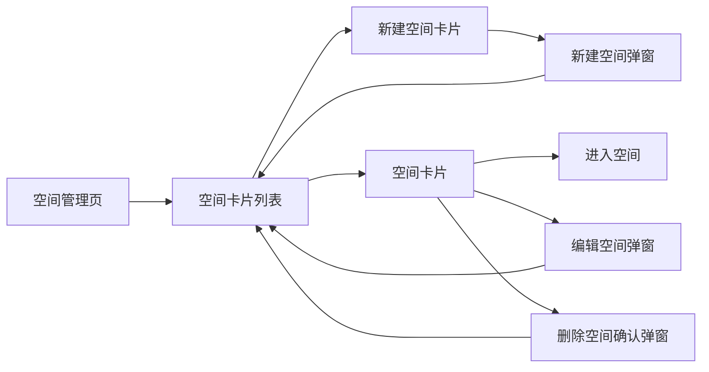
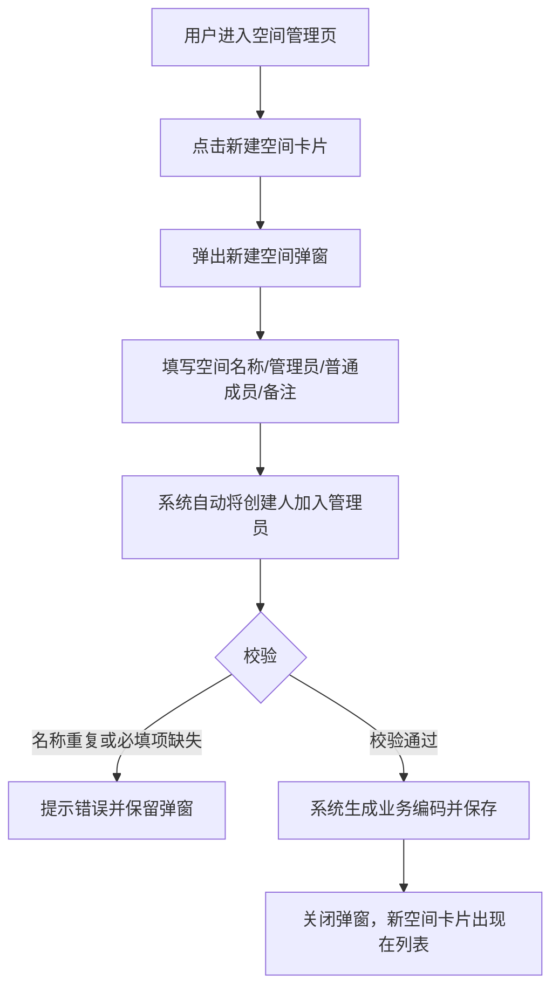
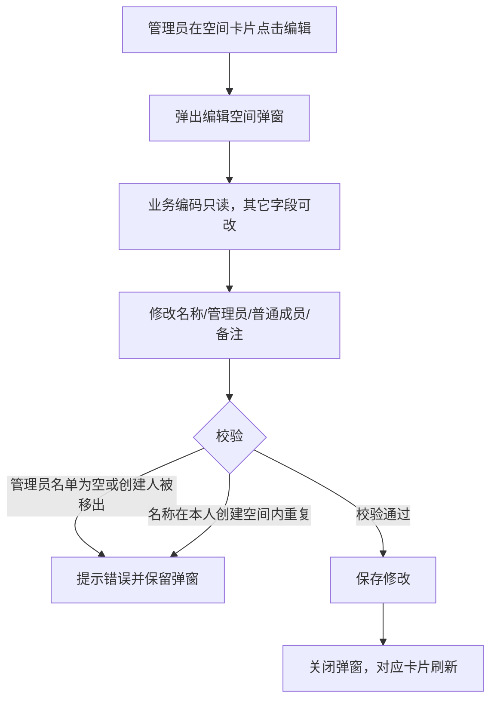
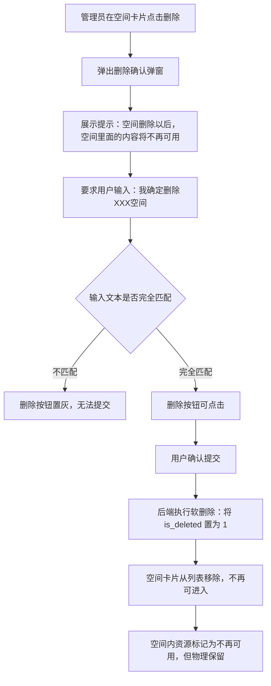
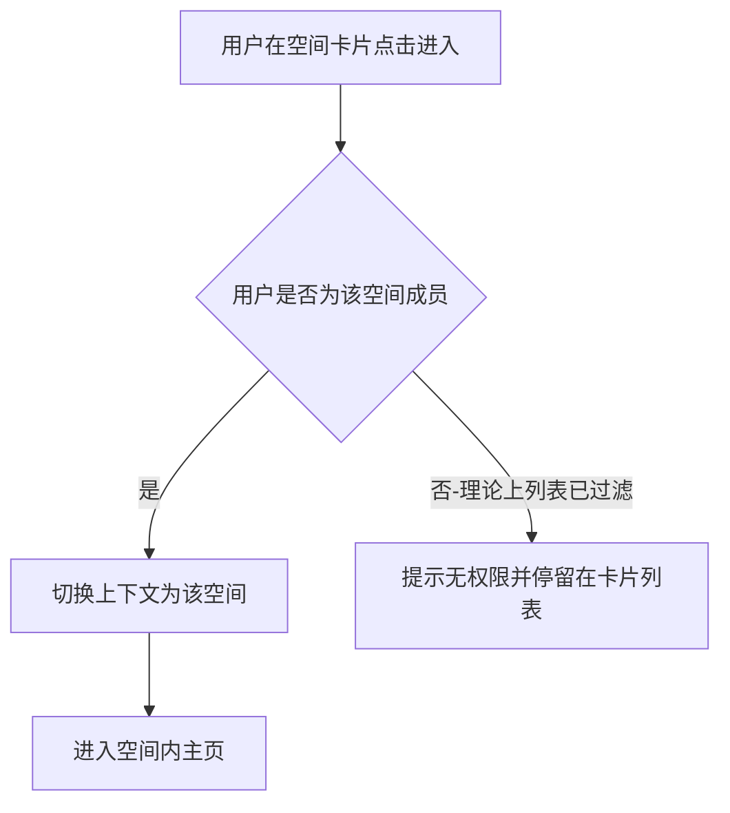
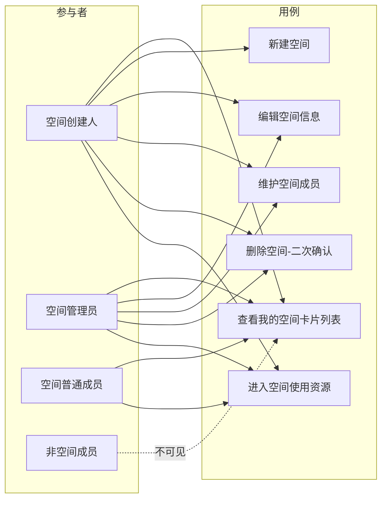

# AgentOps 平台 — 空间管理 PRD

| 文档版本 | 日期 | 编写人 | 说明 |
|---------|------|-------|------|
| V1.0 | 2026-06-13 | AgentOps Team | 空间管理模块 PRD 初稿 |
| V1.1 | 2026-06-13 | AgentOps Team | 对齐《UI 信息架构与导航规范》：登录后默认进入平台 Shell-空间卡片列表；进入空间后顶部空间下拉支持切换、Logo 返回平台 |

---

## 1. 产品/需求背景

AgentOps 平台采用「平台级能力 + 空间内资源」的两层信息架构。**空间（Space）** 是平台中除「用户管理」「系统设置」之外的第一层级内容，是承载模型、Agent、运行时、Prompt、Skill、工具等业务资源的逻辑容器。

平台用户在登录后，需要先选择或创建一个空间，再进入空间内开展业务操作。空间通过「管理员 + 普通成员」的成员体系实现资源隔离与协作：同一用户可参与多个空间，不同空间之间数据互不可见。

当前平台已具备 **用户管理** 能力（参见《用户管理 PRD》），但尚未提供空间的创建、编辑、删除与成员维护能力。本期需求即建设 **空间管理** 模块，使任何启用态用户都能创建并维护属于自己的空间，并以**卡片式**呈现，提供良好的多空间切换与管理体验。

---

## 2. 目标与范围

### 2.1 目标

- 构建平台级 **空间管理** 能力，使每位用户能够创建多个空间并在空间间切换。
- 通过卡片式展现，使用户可一目了然地查看自己参与的全部空间及其关键信息。
- 提供安全的空间删除机制（二次确认 + 软删除），避免误删导致空间内资源不可恢复。
- 为后续空间内资源（模型、Agent、Prompt 等）提供稳定的空间归属与成员鉴权基础。

### 2.2 范围

| 范围 | 是否包含 | 说明 |
|------|----------|------|
| 空间新增 | 包含 | 用户可创建新空间，创建人默认作为管理员 |
| 空间编辑 | 包含 | 修改空间名称、管理员、普通成员、备注；业务编码不可修改 |
| 空间删除 | 包含 | 软删除（伪删除），需二次确认输入「我确定删除XXX空间」 |
| 空间列表（卡片式） | 包含 | 以卡片形式展示当前用户参与的全部空间 |
| 空间成员维护 | 包含 | 在新增/编辑空间时维护管理员、普通成员名单 |
| 空间内资源管理 | 不包含 | 模型、Agent、Prompt、Skill、工具等由各自模块承接 |
| 空间配额/审计 | 不包含 | 后续迭代考虑 |
| 空间转让 | 不包含 | 通过编辑管理员名单达到等价效果，不单独提供「转让」流程 |
| 空间恢复（回收站） | 不包含 | 软删除仅用于数据保留，不暴露恢复入口；后续迭代考虑 |
| 批量操作 | 不包含 | 不提供批量删除/批量编辑 |

### 2.3 空间字段

| 字段 | 必填 | 规则 | 示例 |
|------|------|------|------|
| 业务编码 | 是 | 系统生成，不允许手工编辑或修改。格式：`SP` + `yyyyMMddHHmmssSSS` + 四位随机数 | `SP202606131426301234567` |
| 空间名称 | 是 | 1～30 个字符；同一创建人下空间名称不可重复 | `家庭客服 Agent` |
| 管理员 | 是 | 用户列表，至少 1 人；创建人默认作为管理员，可追加；管理员可对空间执行新增、修改、删除及成员维护操作 | `[张三, 李四]` |
| 普通成员 | 否 | 用户列表，可为空；普通成员仅能在空间内浏览/使用空间资源，不能编辑/删除空间 | `[王五, 赵六]` |
| 备注 | 否 | 200 字以内 | `家庭场景下的智能客服试验空间` |
| 创建人 | 是 | 系统记录，不可手工编辑；创建人会自动加入管理员名单 | `张三` |
| 创建时间 | 是 | 系统记录 | `2026-06-13 14:26:30` |
| 是否删除 | 是 | 软删除标识，列表/详情默认过滤已删除空间 | `否` / `是` |

> 说明：管理员与普通成员均从「平台用户」中选取，不允许填写非平台用户。同一用户不能同时出现在管理员与普通成员两个名单中（管理员权限自动覆盖普通成员）。

### 2.4 空间角色与权限

| 空间角色 | 加入方式 | 可执行操作 |
|----------|----------|-----------|
| 创建人 | 自动 | 默认为管理员；与其他管理员权限一致；创建人不可被移出管理员名单（除非空间被删除） |
| 管理员 | 由创建人或其他管理员添加 | 编辑空间信息、维护成员、删除空间，进入空间使用空间内全部资源 |
| 普通成员 | 由管理员添加 | 仅能进入空间使用空间内资源，不可编辑/删除空间，不可维护成员 |
| 非成员 | — | 不在空间卡片列表中可见该空间，不可进入空间 |

> 说明：本期不区分「主管理员/普通管理员」，所有管理员权限对等；创建人不可被任何管理员移出，以避免空间「孤儿化」。

---

## 3. 系统线框图（必选）

> 全平台 UI 信息架构与导航以《UI 信息架构与导航规范》（`doc/产品方案/2026-06-13_UI信息架构与导航规范.md`）为单一来源。本节仅描述本模块在两层 Shell 中的位置与模块内页面结构。

### 3.1 在两层 Shell 中的位置

- **平台 Shell**：「📂 空间管理」位于左侧主导航首项；登录默认落地此页（空间卡片列表）。
- **空间 Shell**：用户点击空间卡片的「进入」按钮后，整体切换为空间 Shell；顶部空间下拉用于在已加入的空间间切换；点击顶部 Logo 返回平台 Shell - 空间卡片列表。

```text
平台 Shell（默认登录落地）
┌──────────────────────────────────────────────────────────────────────┐
│ [Logo] AgentOps                                    [👤 当前用户 ▼]  │
├──────────────┬───────────────────────────────────────────────────────┤
│ 📂 空间管理◀─│  当前页：空间卡片列表                                  │
│ 👥 用户管理   │                                                       │
│ ⚙ 系统设置   │                                                       │
└──────────────┴───────────────────────────────────────────────────────┘
        │（点击空间卡片「进入」）
        ▼
空间 Shell
┌──────────────────────────────────────────────────────────────────────┐
│ [Logo] AgentOps │ 当前空间：家庭客服 ▼          [👤 当前用户 ▼]      │
├──────────────────┬────────────────────────────────────────────────────┤
│ 📊 工作台         │  空间默认页（工作台）                              │
│ ━ Agent 与沙箱 ━  │                                                    │
│ ━ 模型与工具 ━    │  详见《UI 信息架构与导航规范》                      │
│ ━ 调试与评测 ━    │                                                    │
│ 👥 空间成员       │                                                    │
└──────────────────┴────────────────────────────────────────────────────┘
```

### 3.2 空间管理模块页面结构



**模块说明**：

| 模块 | 职责 |
|------|------|
| 空间卡片列表 | 默认入口，展示当前用户作为创建人/管理员/普通成员参与的全部空间 |
| 新建空间卡片 | 卡片列表的第一张固定卡片，点击后弹出新建空间弹窗 |
| 空间卡片 | 单个空间的卡片，展示关键信息并提供「进入」「编辑」「删除」操作（操作按角色显隐） |
| 新建/编辑空间弹窗 | 录入或修改空间字段，含成员选择控件 |
| 删除空间确认弹窗 | 二次确认，要求用户输入「我确定删除XXX空间」 |

---

## 4. 业务流程图（必选）

### 4.1 空间新增流程



### 4.2 空间编辑流程



### 4.3 空间删除流程（核心）



### 4.4 进入空间流程



---

## 5. 用例图（必选）



**图例说明**：

| 参与者 | 含义 |
|--------|------|
| 空间创建人 | 创建该空间的用户，默认管理员，且不可被移出管理员名单 |
| 空间管理员 | 包含创建人在内的全部管理员；权限对等 |
| 空间普通成员 | 只能进入空间使用资源，不能管理空间 |
| 非空间成员 | 平台用户但未被加入该空间，无法在自己的卡片列表中看到该空间 |

| 用例 | 含义 | 优先级 |
|------|------|--------|
| 查看我的空间卡片列表 | 卡片式列出当前用户参与的全部空间 | P0 |
| 新建空间 | 创建一个新的空间 | P0 |
| 编辑空间信息 | 修改名称、成员、备注 | P0 |
| 维护空间成员 | 在编辑空间时增删管理员/普通成员 | P0 |
| 删除空间（二次确认） | 软删除空间 | P0 |
| 进入空间使用资源 | 切换上下文进入空间 | P0 |

---

## 6. 用户与场景

### 6.1 用户角色

- **创建人**：发起空间创建的用户，自动成为管理员，且不可被移除管理员身份。
- **管理员**：可对空间执行新增、修改、删除以及成员维护。
- **普通成员**：只能进入空间使用空间内资源，不能管理空间。

### 6.2 典型用户故事

- 作为一名启用态用户，我希望在登录后能立刻在卡片式列表里看到自己参与的全部空间，以便快速切换。
- 作为一名用户，我希望能够创建多个空间（如「家庭场景」「办公场景」），分别管理各自的 Agent 与资源。
- 作为空间创建人，我希望邀请其他平台用户作为管理员或普通成员，以便协作。
- 作为空间管理员，我希望编辑空间名称、成员名单与备注，且业务编码作为不可变标识。
- 作为空间管理员，我希望删除空间时必须显式输入「我确定删除XXX空间」，以避免误删；删除后空间数据被保留以备恢复，但用户层面已不可见、不可用。

---

## 7. 功能需求

| 序号 | 功能点 | 简要说明 | 优先级 |
|------|--------|----------|--------|
| 1 | 空间卡片列表 | 默认入口，卡片式展示当前用户参与的全部空间，第一张卡片固定为「新建空间」入口 | P0 |
| 2 | 新建空间 | 弹窗录入名称、管理员、普通成员、备注；系统生成业务编码；创建人自动加入管理员 | P0 |
| 3 | 编辑空间 | 弹窗修改名称、管理员、普通成员、备注；业务编码只读；创建人不可被移出管理员 | P0 |
| 4 | 删除空间（二次确认） | 弹窗强制输入「我确定删除XXX空间」，文本完全匹配后方可提交；删除采用软删除（is_deleted=1） | P0 |
| 5 | 进入空间 | 卡片点击「进入」切换至该空间上下文 | P0 |
| 6 | 成员选择控件 | 在新建/编辑弹窗中提供搜索式用户选择器，支持多选；管理员名单与普通成员名单互斥 | P0 |
| 7 | 卡片信息展示 | 卡片展示空间名称、业务编码、创建人、成员数量、自身角色标签、备注摘要 | P0 |
| 8 | 操作按钮显隐 | 「编辑」「删除」按钮仅对管理员可见；普通成员仅看到「进入」 | P0 |
| 9 | 名称重复校验 | 同一创建人下空间名称不允许重复；提交时校验并提示 | P1 |
| 10 | 空间排序 | 默认按创建时间倒序展示卡片，最近创建/参与的排在前面 | P1 |
| 11 | 空态展示 | 用户无任何空间时，仅展示「新建空间」卡片并附引导文案 | P1 |
| 12 | 删除影响提示 | 删除确认弹窗中显式提示「空间删除以后，空间里面的内容将不再可用」 | P0 |

---

## 8. 原型图/界面说明（必选）

### 8.1 空间卡片列表（默认页）

```text
┌─────────────────────────────────────────────────────────────────────────────────┐
│ AgentOps  /  空间管理                                              [当前用户 ▼] │
├─────────────────────────────────────────────────────────────────────────────────┤
│                                                                                 │
│  我的空间                                                  [搜索空间名称...   🔍] │
│                                                                                 │
│  ┌──────────────┐  ┌──────────────────────┐  ┌──────────────────────┐           │
│  │              │  │ 家庭客服 Agent  [管理] │  │ 办公自动化空间 [成员] │           │
│  │      ＋      │  │ SP20260613...         │  │ SP20260612...         │           │
│  │   新建空间    │  │ 创建人：张三           │  │ 创建人：李四           │           │
│  │              │  │ 成员：3 管理员 / 5 成员│  │ 成员：1 管理员 / 8 成员│           │
│  │              │  │ 备注：家庭场景客服试验 │  │ 备注：内部办公自动化   │           │
│  │              │  │                       │  │                       │           │
│  │              │  │ [进入] [编辑] [删除]  │  │ [进入]                │           │
│  └──────────────┘  └──────────────────────┘  └──────────────────────┘           │
│                                                                                 │
│  ┌──────────────────────┐  ┌──────────────────────┐                             │
│  │ ...                   │  │ ...                   │                            │
│  └──────────────────────┘  └──────────────────────┘                             │
└─────────────────────────────────────────────────────────────────────────────────┘
```

**说明**：
- 卡片右上角的「管理 / 成员」标签表示当前用户在该空间中的角色（管理员或普通成员）。
- 卡片底部按钮按角色显隐：管理员可见 `进入 / 编辑 / 删除`；普通成员仅可见 `进入`。
- 第一张卡片永久为「新建空间」卡片。

### 8.2 新建空间弹窗

```text
┌────────────────────────────────────────────────────────┐
│  新建空间                                          ✕   │
├────────────────────────────────────────────────────────┤
│  业务编码     │ [系统生成，提交后展示]                  │
│  空间名称 *   │ [_____________________________________] │
│  管理员 *     │ [张三（创建人，不可移除）] × [选择更多▼] │
│  普通成员     │ [选择用户▼]                            │
│  备注         │ [_____________________________________] │
│              │ [_____________________________________] │
├────────────────────────────────────────────────────────┤
│                                   [取消]   [确定创建]  │
└────────────────────────────────────────────────────────┘
```

**说明**：
- 业务编码占位提示「系统生成」，提交成功后回显。
- 管理员名单中创建人为不可移除标签。
- 管理员/普通成员选择控件支持搜索平台用户，姓名 + 邮箱辅助识别。
- 同一用户在管理员中已选择时，将在普通成员选择器中置灰。

### 8.3 编辑空间弹窗

布局与 8.2 一致，差异点：

- 业务编码字段为**只读**展示，灰显不可编辑。
- 创建人标签同样**不可移除**；其他管理员可移除。
- 标题改为「编辑空间」，确认按钮改为「保存」。

### 8.4 删除空间确认弹窗（核心交互）

```text
┌─────────────────────────────────────────────────────────────────┐
│  ⚠ 删除空间                                                ✕   │
├─────────────────────────────────────────────────────────────────┤
│                                                                 │
│  空间删除以后，空间里面的内容将不再可用。                        │
│                                                                 │
│  请输入「我确定删除家庭客服 Agent空间」以确认操作：                │
│                                                                 │
│  ┌───────────────────────────────────────────────────────────┐  │
│  │                                                           │  │
│  └───────────────────────────────────────────────────────────┘  │
│                                                                 │
├─────────────────────────────────────────────────────────────────┤
│                                          [取消]   [确定删除]    │
│                                                  （置灰）       │
└─────────────────────────────────────────────────────────────────┘
```

**交互细节**：
- 弹窗标题红色警示图标 + 「删除空间」。
- 提示文案固定为：「空间删除以后，空间里面的内容将不再可用。」
- 提示用户输入：`我确定删除XXX空间`，其中 `XXX` 实时替换为目标空间名称（例如 `我确定删除家庭客服 Agent空间`）。
- 输入框内容必须**完全匹配**（包含空间名称大小写、空格、特殊字符），匹配前「确定删除」按钮置灰。
- 确认后调用软删除接口（`is_deleted=1`）；卡片立刻从列表移除。

### 8.5 关键状态

| 状态 | 说明 |
|------|------|
| 空态 | 用户尚未参与任何空间时，列表仅显示「新建空间」卡片，附引导文案「创建你的第一个空间，开始管理 Agent 资源」 |
| 加载中 | 卡片列表区展示骨架屏占位 |
| 校验失败 | 弹窗内字段下方红字提示具体错误（名称重复、必填缺失、管理员为空等） |
| 删除文本不匹配 | 「确定删除」按钮置灰；输入框下方红字提示「输入内容与提示不一致」 |
| 无权限 | 普通成员尝试通过 URL 直访编辑/删除接口时，前端 toast 提示「无权限操作」并返回卡片列表 |

---

## 9. 非功能需求

- **性能**：卡片列表分页加载（每页 ≥ 24 张卡片），首屏 2 秒内可见；用户选择控件搜索响应 < 500ms。
- **安全/权限**：
  - 仅启用态登录用户可访问空间管理；
  - 仅空间管理员可调用空间编辑、删除、成员维护接口，普通成员调用应被服务端拒绝；
  - 删除接口须校验前端提交的确认文本与后端目标空间名称一致，作为二次防线。
- **数据治理**：
  - 删除采用软删除（`is_deleted` 标记），数据保留以备审计或后续恢复；
  - 列表/详情/进入空间均默认过滤已软删除空间；
  - 空间内子资源（模型、Agent 等）不级联硬删除，仅在空间被软删除时随空间一并不可访问。
- **审计**：空间的新增、编辑、删除应记录操作人、操作时间、操作前后字段差异，便于后续审计。
- **兼容/多端**：本期仅 Web；卡片列表在 1280px 宽度下保证 4 列展示，1024px 宽度下保证 3 列。
- **可访问性**：弹窗支持 Esc 关闭、Enter 提交（删除确认弹窗除外，必须点击按钮）。

---

## 10. 与现有功能的关系

- **与用户管理**：依赖《用户管理 PRD》中的用户实体；空间管理员/普通成员名单只能从启用态平台用户中选择；草稿态/禁用态用户不出现在选择列表中。
- **与系统设置**：空间管理与系统设置同为平台第一层级；系统设置中可承载未来的「空间默认配额」「空间命名规则」等配置（本期不实现）。
- **与空间内资源（模型/Agent/Prompt/Skill/工具/运行时）**：所有空间内资源必须携带 `spaceId` 归属；空间被软删除后，所有空间内资源对用户层面不可见、不可用，但底层数据保留。
- **与登录后的落地页**：用户登录成功后默认跳转到空间管理（卡片列表），替换原先可能的占位页。

---

## 11. 验收标准

- [ ] 任一启用态用户登录后默认进入空间管理卡片页，可看到本人参与的全部空间。
- [ ] 用户可点击「新建空间」卡片创建空间；提交后业务编码自动生成且不可手工编辑；创建人自动出现在管理员名单中且不可被移除。
- [ ] 同一用户作为创建人不能在自己创建的空间中存在两个同名空间。
- [ ] 管理员可编辑空间名称、管理员、普通成员、备注；业务编码字段只读；管理员名单不能为空；创建人不可被移出管理员。
- [ ] 普通成员只能在卡片中看到「进入」按钮，看不到「编辑」「删除」按钮；服务端对越权请求返回 403。
- [ ] 删除弹窗中提示文案为「空间删除以后，空间里面的内容将不再可用。」，输入提示为「我确定删除XXX空间」，其中 XXX 替换为目标空间名称。
- [ ] 输入文本与提示完全匹配前，「确定删除」按钮保持置灰；点击「确定删除」后调用软删除接口，列表中该卡片消失。
- [ ] 数据库层面被删除空间记录 `is_deleted=1` 且不被物理删除；空间内资源也不被物理删除。
- [ ] 用户无任何空间时，卡片列表仅展示「新建空间」卡片并附引导文案。
- [ ] 操作日志可查询到空间的新增/编辑/删除记录及操作人、操作时间。
