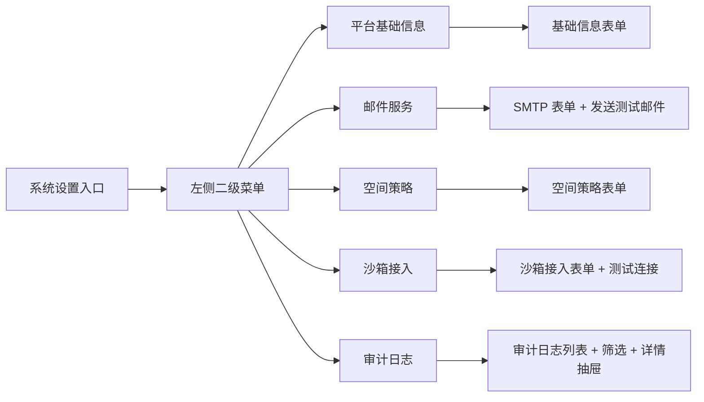
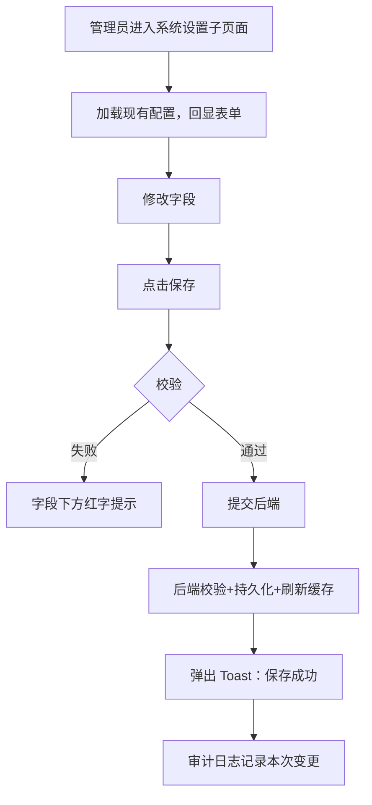
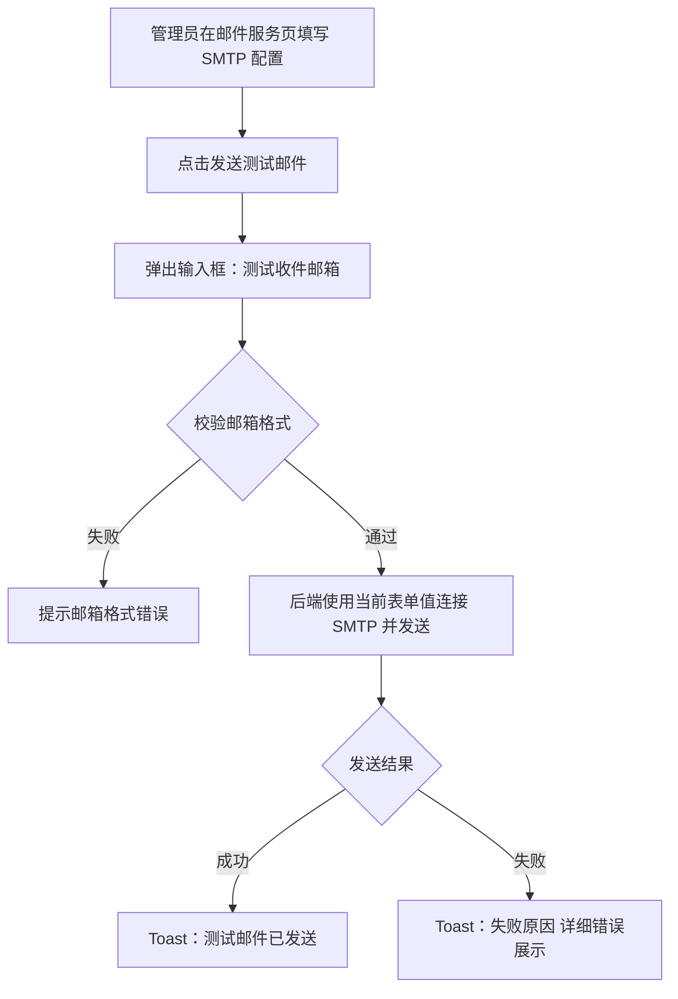
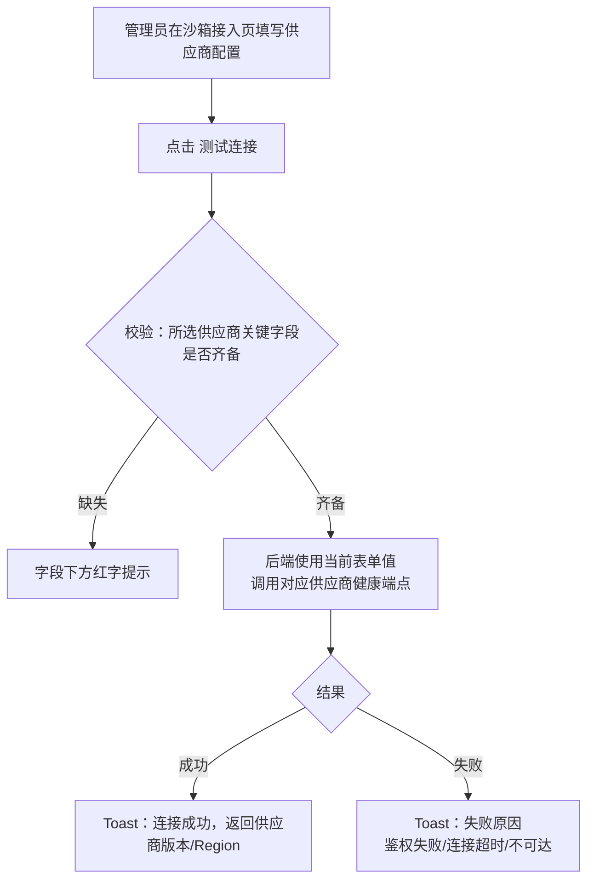
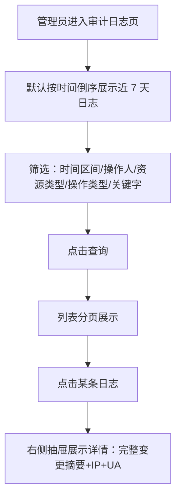
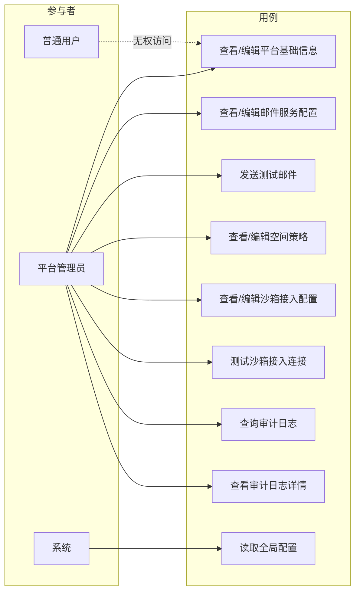

# AgentOps 平台 — 系统设置 PRD

| 文档版本 | 日期 | 编写人 | 说明 |
|---------|------|-------|------|
| V1.0 | 2026-06-13 | AgentOps Team | 系统设置模块 PRD 初稿 |
| V1.1 | 2026-06-13 | AgentOps Team | 新增「沙箱接入」分组，支撑《沙箱管理 PRD》对全局接入地址与探活参数的依赖 |
| V1.2 | 2026-06-13 | AgentOps Team | 对齐《UI 信息架构与导航规范》：系统设置位于平台 Shell 左侧主导航，仅管理员可见；模块内仍为左侧二级菜单 + 右侧分组表单 |

---

## 1. 产品/需求背景

AgentOps 平台采用「平台级能力 + 空间内资源」的两层信息架构，平台级第一层级模块包括 **空间管理**、**用户管理** 与 **系统设置**。其中：

- 空间管理已通过《空间管理 PRD》定义；
- 用户管理已通过《用户管理 PRD》定义；
- **系统设置** 作为平台级配置中枢，用于承载与单个空间无关、影响整个平台运行表现与治理的全局参数。

随着平台用户与空间数量的增长，平台管理员需要：

- 维护平台对外展示形象（名称、Logo、备案号、技术支持联系方式）；
- 追溯平台用户对关键资源的操作记录（审计日志），用于安全合规；
- 配置统一的邮件外发能力，支撑密码重置等系统通知；
- 对所有空间施加统一的命名规则与默认配额，避免空间无序膨胀；
- 配置 **远程代码沙箱** 的全局接入地址与探活策略，支撑空间内沙箱管理模块对 OpenSandbox / 阿里云沙箱的接入与状态自动流转。

本 PRD 聚焦上述五类配置能力，作为系统设置模块的首版交付内容。

---

## 2. 目标与范围

### 2.1 目标

- 为平台管理员提供集中、可治理的全局配置入口；
- 抽象出可被平台其他模块（用户、空间、登录、通知）依赖的「全局配置中心」单一数据源；
- 通过审计日志能力满足初步的安全合规需求。

### 2.2 范围

| 范围 | 是否包含 | 说明 |
|------|----------|------|
| 平台基础信息维护 | 包含 | 平台名称、Logo、备案号、技术支持联系方式 |
| 操作审计日志 | 包含 | 查询平台用户的关键操作记录，支持筛选与详情查看 |
| 邮件服务配置（SMTP） | 包含 | 配置发件人、SMTP 主机、端口、账号、加密方式；提供「发送测试邮件」能力 |
| 空间策略 | 包含 | 空间名称命名规则（长度、字符集合）、单用户最大可创建空间数（默认配额） |
| 沙箱接入 | 包含 | OpenSandbox / 阿里云沙箱的全局接入地址与凭证；沙箱探活间隔、单次探活超时、首次启动判定超时；提供「测试连接」能力 |
| 密码与登录策略 | 不包含 | 后续迭代考虑（最小长度、复杂度、登录失败锁定等） |
| 登录方式开关 | 不包含 | 邮箱/手机号/SSO 切换由后续迭代承接 |
| 短信服务配置 | 不包含 | 后续迭代考虑 |
| 通知模板管理 | 不包含 | 邮件/短信模板编辑由后续迭代承接 |
| 国际化 / 多语言切换 | 不包含 | 由前端通用能力承接，不在系统设置范围 |
| 平台主题/外观 | 不包含 | 后续迭代考虑 |

### 2.3 配置项总览

| 分组 | 配置项 | 必填 | 默认值 | 备注 |
|------|--------|------|--------|------|
| **平台基础信息** | 平台名称 | 是 | `AgentOps` | 1～30 字符；展示在登录页、顶部导航 |
| 平台基础信息 | 平台 Logo | 否 | 内置默认 Logo | PNG/JPG/SVG，≤ 2MB，建议 256×256 |
| 平台基础信息 | ICP 备案号 | 否 | （空） | ≤ 50 字符；展示在登录页页脚 |
| 平台基础信息 | 技术支持邮箱 | 否 | （空） | 合法邮箱格式 |
| 平台基础信息 | 技术支持电话 | 否 | （空） | ≤ 20 字符 |
| **邮件服务（SMTP）** | 是否启用 | 是 | 关闭 | 启用后系统功能（如重置密码外发邮件）才可使用 |
| 邮件服务 | SMTP 主机 | 是* | （空） | 启用时必填 |
| 邮件服务 | SMTP 端口 | 是* | `465` | 启用时必填，1～65535 |
| 邮件服务 | 加密方式 | 是* | `SSL` | 枚举：无 / SSL / STARTTLS |
| 邮件服务 | 发件账号 | 是* | （空） | 合法邮箱 |
| 邮件服务 | 发件密码/授权码 | 是* | （空） | 不在列表回显，仅展示「已配置 / 未配置」 |
| 邮件服务 | 发件人显示名 | 否 | `AgentOps` | ≤ 30 字符 |
| **空间策略** | 单用户最大可创建空间数 | 是 | `10` | 1～100；超过后用户不能再创建新空间 |
| 空间策略 | 空间名称最小长度 | 是 | `1` | 1～50 |
| 空间策略 | 空间名称最大长度 | 是 | `30` | 大于等于最小长度且 ≤ 50 |
| 空间策略 | 空间名称字符集合 | 是 | `中英文/数字/常见符号` | 枚举单选：仅英文+数字 / 中英文+数字 / 中英文+数字+常见符号 |
| **沙箱接入** | OpenSandbox 接入地址 | 是* | （空） | 任一供应商启用时必填；HTTPS 优先，格式 `https://host[:port]`，≤ 200 字符 |
| 沙箱接入 | OpenSandbox API Token | 否 | （空） | 自部署 OpenSandbox 若未启用鉴权可留空；保存后不回显，仅展示「已配置 / 未配置」 |
| 沙箱接入 | 阿里云沙箱 接入地址 | 否 | （空） | 启用阿里云沙箱时必填，格式同上 |
| 沙箱接入 | 阿里云 AccessKey ID | 是* | （空） | 启用阿里云沙箱时必填 |
| 沙箱接入 | 阿里云 AccessKey Secret | 是* | （空） | 启用阿里云沙箱时必填；保存后不回显，仅展示「已配置 / 未配置」 |
| 沙箱接入 | 阿里云沙箱 Region | 否 | `cn-hangzhou` | 与阿里云接入地址匹配 |
| 沙箱接入 | 启用 OpenSandbox | 是 | 关闭 | 启用后空间用户可在沙箱管理中选择该供应商 |
| 沙箱接入 | 启用 阿里云沙箱 | 是 | 关闭 | 同上 |
| 沙箱接入 | 探活间隔（秒） | 是 | `60` | 范围 30～600；空间沙箱定时探活的周期 |
| 沙箱接入 | 单次探活超时（秒） | 是 | `5` | 范围 1～30；超过即视为本轮探活失败 |
| 沙箱接入 | 首次启动判定超时（秒） | 是 | `120` | 范围 30～600；提交沙箱后等待启动成功的总超时 |
| **审计日志** | （仅查询，不维护） | — | — | 详见 §2.4 |

> 「是*」表示对应供应商启用为是时必填，关闭时该字段允许为空。
> 邮件服务配置项变更后立即生效；空间策略变更后仅对**新建/改名**校验生效，不回溯影响存量空间。
> 沙箱接入配置项变更后立即生效；探活间隔变更后**下一轮调度**起按新值执行；启用开关关闭后，所属供应商下已存在的沙箱不会被强制下线，仅阻止「新建」与「重新启用」。

### 2.4 审计日志范围

审计日志记录平台用户对关键资源的操作，本期纳入以下事件：

| 资源 | 事件 |
|------|------|
| 用户 | 新增、保存、提交、删除、启用、禁用、重置密码、登录成功、登录失败 |
| 空间 | 新增、修改、删除（伪删除） |
| 沙箱 | 新增、保存、提交、编辑、人工启用、人工禁用、删除、系统状态切换（探活成功/失败/超时） |
| 系统设置 | 平台基础信息修改、邮件服务配置修改、空间策略修改、沙箱接入配置修改 |

每条审计记录包含：操作人（用户业务编码 + 姓名）、操作时间、操作类型、资源类型、资源编码、IP 地址、客户端 UA、关键变更摘要。

---

## 3. 系统线框图（必选）

> 全平台 UI 信息架构与导航以《UI 信息架构与导航规范》（`doc/产品方案/2026-06-13_UI信息架构与导航规范.md`）为单一来源。本节仅描述本模块在平台 Shell 中的位置与模块内页面结构。

### 3.1 在平台 Shell 中的位置

系统设置位于平台 Shell 左侧主导航，仅角色含「管理员」的用户可见；普通用户登录后看不到此入口，通过 URL 直访 API 返回 403。

```text
平台 Shell
┌──────────────────────────────────────────────────────────────┐
│ [Logo] AgentOps                              [👤 当前用户 ▼] │
├──────────────┬───────────────────────────────────────────────┤
│ 📂 空间管理   │                                               │
│ 👥 用户管理   │                                               │
│ ⚙ 系统设置 ◀─│  当前页（仅管理员可访问）                      │
└──────────────┴───────────────────────────────────────────────┘
```

### 3.2 系统设置模块页面结构

采用「左侧二级菜单 + 右侧分组配置表单」布局。



| 模块 | 类型 | 职责 |
|------|------|------|
| 平台基础信息 | 表单 | 平台展示形象配置 |
| 邮件服务 | 表单 + 操作 | SMTP 参数配置 + 「发送测试邮件」按钮 |
| 空间策略 | 表单 | 命名规则与单用户配额 |
| 沙箱接入 | 表单 + 操作 | OpenSandbox / 阿里云沙箱接入地址与凭证、探活参数 + 「测试连接」按钮 |
| 审计日志 | 列表 + 筛选 + 详情 | 查询平台操作记录 |

---

## 4. 业务流程图（必选）

### 4.1 配置项保存流程（平台基础信息 / 邮件服务 / 空间策略 通用）



### 4.2 邮件服务发送测试邮件流程



> 说明：发送测试邮件**不改变后台已保存配置**，使用当前表单中的待保存值；若管理员希望测试通过后才保存，可不点击保存按钮。

### 4.3 沙箱接入测试连接流程



> 测试连接同样不改变后台已保存配置；管理员可在测试通过后再点击保存。

### 4.4 审计日志查询流程



---

## 5. 用例图（必选）



**图例说明**：

| 参与者 | 含义 |
|--------|------|
| 平台管理员 | 角色字段包含「管理员」的启用态用户，可访问系统设置 |
| 普通用户 | 仅角色为「普通用户」的启用态用户，**无权访问系统设置入口与 API** |
| 系统 | 平台后端各模块（用户、空间、登录、沙箱探活等）以只读方式读取全局配置 |

| 用例 | 含义 | 优先级 |
|------|------|--------|
| 查看/编辑平台基础信息 | 维护平台名称、Logo、备案、支持联系方式 | P0 |
| 查看/编辑邮件服务配置 | 维护 SMTP 配置项 | P0 |
| 发送测试邮件 | 验证 SMTP 配置可用性 | P0 |
| 查看/编辑空间策略 | 命名规则与单用户最大空间数 | P0 |
| 查看/编辑沙箱接入配置 | 维护 OpenSandbox / 阿里云沙箱接入地址、凭证、探活参数 | P0 |
| 测试沙箱接入连接 | 验证沙箱供应商接入地址与凭证是否可用 | P0 |
| 查询审计日志 | 多维筛选审计记录 | P0 |
| 查看审计日志详情 | 抽屉式查看单条详情 | P1 |
| 读取全局配置 | 平台其它模块运行时读取 | P0 |

---

## 6. 用户与场景

### 6.1 用户角色

- **平台管理员**：在《用户管理 PRD》中由「管理员」内置角色定义，可访问系统设置全部能力。
- **普通用户**：无权访问系统设置入口与 API；越权请求由后端返回 403。
- **系统（内部依赖方）**：用户模块、空间模块、登录模块、邮件外发能力等通过统一的全局配置中心读取相关配置项。

### 6.2 典型用户故事

- 作为平台管理员，我希望修改平台名称与 Logo，使登录页和顶部导航展示我们的品牌信息。
- 作为平台管理员，我希望在配置好 SMTP 后能立刻发送一封测试邮件到我的邮箱，验证配置是否可用，避免后续重置密码外发失败。
- 作为平台管理员，我希望约束「单个用户最多创建多少空间」，避免被滥用产生大量低价值空间。
- 作为平台管理员，我希望追溯过去 30 天内某用户对空间或用户的所有操作，以满足安全审计需求。
- 作为平台管理员，我希望统一配置 OpenSandbox 与阿里云沙箱的接入地址与凭证，并通过「测试连接」验证可用性，避免空间用户在配置沙箱时因平台侧接入未就绪而反复失败。
- 作为平台管理员，我希望调整沙箱探活间隔（如从默认 60 秒改为 120 秒）以平衡探活开销与状态及时性。
- 作为系统模块，我希望通过统一接口读取「平台名称」「邮件配置」「沙箱接入配置」等全局配置，而不是各自维护一份。

---

## 7. 功能需求

| 序号 | 功能点 | 简要说明 | 优先级 |
|------|--------|----------|--------|
| 1 | 系统设置入口与权限控制 | 主导航出现「系统设置」入口，仅角色含「管理员」的用户可见且可访问；普通用户访问 API 返回 403 | P0 |
| 2 | 左侧二级菜单 | 5 项：平台基础信息、邮件服务、空间策略、沙箱接入、审计日志；点击切换右侧内容 | P0 |
| 3 | 平台基础信息：查看与编辑 | 字段：平台名称、Logo、ICP 备案号、技术支持邮箱、技术支持电话；保存即生效 | P0 |
| 4 | 平台 Logo 上传 | 支持本地上传 PNG/JPG/SVG，≤ 2MB；上传后立即预览；可恢复默认 | P1 |
| 5 | 邮件服务：查看与编辑 | 字段见 §2.3；启用开关控制必填性；密码字段写时不回显 | P0 |
| 6 | 邮件服务：发送测试邮件 | 输入测试收件邮箱后调用后端尝试发送；失败时回显具体错误码或描述 | P0 |
| 7 | 空间策略：查看与编辑 | 字段：单用户最大空间数、空间名称最小/最大长度、空间名称字符集合 | P0 |
| 8 | 空间策略生效范围 | 仅作用于「新建空间」「编辑空间名称」时的校验；不回溯校验存量空间 | P0 |
| 9 | 沙箱接入：查看与编辑 | 字段：两个供应商启用开关、各自接入地址与凭证、探活间隔、单次探活超时、首次启动判定超时；凭证字段写时不回显 | P0 |
| 10 | 沙箱接入：测试连接 | 按所选供应商使用当前表单值发起健康调用；成功返回供应商版本/Region，失败回显具体错误；同一管理员 1 分钟内最多 5 次 | P0 |
| 11 | 沙箱接入：启用开关与下游联动 | 启用开关关闭后，空间用户无法在沙箱管理中选择该供应商；已存在沙箱不被强制下线，仅阻止「新建」与「重新启用」 | P0 |
| 12 | 沙箱接入：探活参数即时生效 | 探活间隔/单次超时/首次启动超时 变更后由调度器在下一轮调度起按新值执行 | P0 |
| 13 | 审计日志：列表查询 | 支持时间区间、操作人、资源类型、操作类型、关键字筛选；分页 20/页；默认时间倒序 | P0 |
| 14 | 审计日志：详情查看 | 点击某条日志，右侧抽屉展示完整变更摘要、IP、UA 等 | P1 |
| 15 | 审计日志：保留期 | 后端保留近 180 天审计记录，超期由后台清理任务删除（不在前端暴露） | P1 |
| 16 | 配置变更审计 | 平台基础信息、邮件服务、空间策略、沙箱接入 的每次保存均自动写入审计日志 | P0 |
| 17 | 配置读取统一接口 | 各模块通过同一只读接口读取生效配置；空间策略、沙箱接入变更后下游模块需即时生效 | P0 |

---

## 8. 原型图/界面说明（必选）

### 8.1 系统设置 - 平台基础信息

```text
┌────────────────────────────────────────────────────────────────────────────┐
│ AgentOps  /  系统设置                                          [当前用户▼] │
├──────────────┬─────────────────────────────────────────────────────────────┤
│ 系统设置      │  平台基础信息                                                │
├──────────────┼─────────────────────────────────────────────────────────────┤
│ ▶ 平台基础信息│  平台名称 *  [AgentOps                              ]       │
│   邮件服务    │  平台 Logo   [当前预览]   [上传新 Logo] [恢复默认]           │
│   空间策略    │              支持 PNG/JPG/SVG，≤ 2MB                         │
│   审计日志    │  ICP 备案号  [_____________________________________ ]       │
│              │  技术支持邮箱[_____________________________________ ]       │
│              │  技术支持电话[_____________________________________ ]       │
│              │                                                             │
│              │                              [重置]   [保存]                 │
└──────────────┴─────────────────────────────────────────────────────────────┘
```

### 8.2 系统设置 - 邮件服务

```text
┌──────────────┬─────────────────────────────────────────────────────────────┐
│   平台基础信息│  邮件服务（SMTP）                                            │
│ ▶ 邮件服务    ├─────────────────────────────────────────────────────────────┤
│   空间策略    │  启用 SMTP    [○ 关闭   ● 启用]                              │
│   审计日志    │  SMTP 主机 *  [smtp.example.com                           ] │
│              │  SMTP 端口 *  [465       ]                                 │
│              │  加密方式 *   [ SSL ▼ ]   (无 / SSL / STARTTLS)              │
│              │  发件账号 *   [no-reply@example.com                        ] │
│              │  发件密码 *   [********]   状态：已配置                      │
│              │  发件人显示名 [AgentOps                                    ] │
│              │                                                             │
│              │  [发送测试邮件]                              [重置]   [保存] │
└──────────────┴─────────────────────────────────────────────────────────────┘
```

**「发送测试邮件」交互**：

```text
┌──────────────────────────────────────────────────┐
│  发送测试邮件                                ✕  │
├──────────────────────────────────────────────────┤
│  使用当前表单中的 SMTP 配置发送一封测试邮件。     │
│  测试收件邮箱  [admin@example.com             ] │
├──────────────────────────────────────────────────┤
│                          [取消]   [发送]         │
└──────────────────────────────────────────────────┘
```

### 8.3 系统设置 - 空间策略

```text
┌──────────────┬─────────────────────────────────────────────────────────────┐
│   平台基础信息│  空间策略                                                    │
│   邮件服务    ├─────────────────────────────────────────────────────────────┤
│ ▶ 空间策略    │  单用户最大可创建空间数 *  [10  ]   范围 1～100              │
│   审计日志    │                                                             │
│              │  空间名称最小长度 *  [1  ]                                   │
│              │  空间名称最大长度 *  [30 ]   ≤ 50 且 ≥ 最小长度              │
│              │                                                             │
│              │  空间名称字符集合 *                                          │
│              │   ○ 仅英文+数字                                              │
│              │   ○ 中英文+数字                                              │
│              │   ● 中英文+数字+常见符号                                     │
│              │                                                             │
│              │  ⓘ 该策略仅作用于新建/改名空间，不回溯存量空间                │
│              │                                                             │
│              │                              [重置]   [保存]                │
└──────────────┴─────────────────────────────────────────────────────────────┘
```

### 8.4 系统设置 - 沙箱接入

```text
┌──────────────┬─────────────────────────────────────────────────────────────┐
│   平台基础信息│  沙箱接入                                                    │
│   邮件服务    ├─────────────────────────────────────────────────────────────┤
│   空间策略    │  ━━ OpenSandbox ━━━━━━━━━━━━━━━━━━━━━━━━━━━━━━━━━━━━━━━     │
│ ▶ 沙箱接入    │  启用      [○ 关闭   ● 启用]                                 │
│   审计日志    │  接入地址 *[https://opensandbox.internal:8080            ]   │
│              │  API Token [********]   状态：已配置                         │
│              │  [测试连接]                                                  │
│              │                                                              │
│              │  ━━ 阿里云沙箱 ━━━━━━━━━━━━━━━━━━━━━━━━━━━━━━━━━━━━━━━━━     │
│              │  启用      [● 关闭   ○ 启用]                                 │
│              │  接入地址 *[https://sandbox.aliyuncs.com                 ]   │
│              │  AccessKey ID *  [LTAI************                       ]   │
│              │  AccessKey Secret*[********]   状态：未配置                   │
│              │  Region    [cn-hangzhou▼]                                    │
│              │  [测试连接]                                                  │
│              │                                                              │
│              │  ━━ 探活参数（对所有供应商生效） ━━━━━━━━━━━━━━━━━━━━━━━     │
│              │  探活间隔（秒）*       [60 ]   范围 30～600                  │
│              │  单次探活超时（秒）*   [5  ]   范围 1～30                    │
│              │  首次启动判定超时（秒）[120]   范围 30～600                  │
│              │                                                              │
│              │                              [重置]   [保存]                 │
└──────────────┴─────────────────────────────────────────────────────────────┘
```

**「测试连接」交互**：

```text
┌──────────────────────────────────────────────────┐
│  测试 OpenSandbox 连接                       ✕  │
├──────────────────────────────────────────────────┤
│  使用当前表单中的接入地址与凭证发起健康调用。     │
│                                                  │
│  ⏳ 正在测试 ...                                 │
│  ✔ 连接成功，OpenSandbox 版本 v0.9.3，延迟 142ms │
├──────────────────────────────────────────────────┤
│                                  [关闭]          │
└──────────────────────────────────────────────────┘
```

> 测试连接同样不改变后台已保存配置；与发送测试邮件一致，使用当前表单中的待保存值，并对同一管理员限制 1 分钟内最多触发 5 次。

### 8.5 系统设置 - 审计日志

```text
┌──────────────┬───────────────────────────────────────────────────────────────────┐
│   平台基础信息│  审计日志                                                          │
│   邮件服务    ├───────────────────────────────────────────────────────────────────┤
│   空间策略    │  时间 [2026-06-06 ~ 2026-06-13]  操作人[_____]                    │
│ ▶ 审计日志    │  资源类型[全部▼] 操作类型[全部▼] 关键字[_____________] [查询]      │
│              ├───────────────────────────────────────────────────────────────────┤
│              │  时间               │ 操作人 │ 资源类型│ 操作    │ 资源编码  │ IP   │
│              │  2026-06-13 15:42  │ 张三  │ 空间    │ 新增    │ SP2026...│ ...  │
│              │  2026-06-13 14:18  │ 李四  │ 用户    │ 启用    │ US2026...│ ...  │
│              │  2026-06-13 11:02  │ 张三  │ 系统设置│ 修改邮箱配置 │ —      │ ...  │
│              │  ...                                                              │
│              │                                          [< 1 2 3 ... 10 >]       │
└──────────────┴───────────────────────────────────────────────────────────────────┘
```

**详情抽屉（点击某条日志）**：

```text
┌────────────────────────────────────────┐
│  审计日志详情                       ✕  │
├────────────────────────────────────────┤
│  操作时间   2026-06-13 15:42:18        │
│  操作人     张三 (US2026...)           │
│  资源类型   空间                       │
│  资源编码   SP202606131542181234567    │
│  操作类型   新增                       │
│  IP         10.0.12.34                 │
│  客户端 UA  Chrome 130 / macOS         │
│  变更摘要：                             │
│   - 名称: (空) → 家庭客服 Agent         │
│   - 管理员: (空) → [张三]               │
│   - 备注: (空) → 家庭场景试验          │
└────────────────────────────────────────┘
```

### 8.6 关键状态

| 状态 | 说明 |
|------|------|
| 加载中 | 表单/列表区展示骨架屏 |
| 未配置 | 邮件服务未启用时，「发送测试邮件」按钮置灰且 hover 提示「请先启用并填写 SMTP 配置」 |
| 沙箱供应商未启用 | 任一供应商启用开关为关闭时，「测试连接」按钮置灰且 hover 提示「请先启用并填写接入地址」 |
| 校验失败 | 字段下方红字提示，例如：端口非数字、邮箱格式错误、最大长度小于最小长度、探活间隔超出范围、阿里云沙箱启用但凭证为空 |
| 保存成功 | 顶部 Toast「保存成功」 |
| 测试邮件失败 | 弹窗或 Toast 显示具体错误原因（鉴权失败 / 连接超时 / 收件邮箱拒收） |
| 测试沙箱连接失败 | 弹窗显示具体错误原因（鉴权失败 / 连接超时 / 不可达 / 域名解析失败） |
| 无权限 | 普通用户尝试通过 URL 直访 `/system-settings/*` 时，前端 toast「无权限访问」并跳回空间管理页 |
| 空态（审计日志） | 筛选结果为空时，列表区展示「未找到符合条件的记录」 |

---

## 9. 非功能需求

- **性能**：
  - 审计日志列表分页查询响应 < 1s；
  - 全局配置读取接口（被各模块调用）需缓存，命中缓存时 < 50ms；保存时同步刷新缓存；
  - Logo 上传单文件 ≤ 2MB，上传响应 < 3s。
- **安全/权限**：
  - 仅角色含「管理员」的启用态用户可访问系统设置 UI 与对应 API；后端必须对每个 API 强制鉴权；
  - 邮件 SMTP 密码、OpenSandbox API Token、阿里云 AccessKey Secret 须**加密存储**（不可明文落库），列表/详情中**不回显**明文，仅展示「已配置 / 未配置」；
  - 「发送测试邮件」「测试沙箱连接」均做频率限制（同一管理员 1 分钟内最多 5 次）以防滥用；
  - 审计日志写入失败不应阻塞业务主流程，但须有告警（在后端日志中体现）。
- **数据治理**：
  - 配置项历次变更通过审计日志可追溯（不在系统设置 UI 暴露版本回滚）；
  - 审计日志保留期 180 天，超期由后台清理任务删除，物理清理。
- **一致性**：
  - 配置项变更采用「保存即生效」模式，无草稿态；
  - 空间策略变更不回溯存量空间，仅对新建/改名校验生效；
  - 沙箱接入参数变更后，下一轮探活调度按新值执行；启用开关关闭仅阻止「新建」与「重新启用」，已存在沙箱不被强制下线。
- **可用性**：
  - SMTP 服务不可用时，依赖邮件外发的功能（如重置密码外发邮件）应有降级提示，但不影响系统设置自身的访问与配置；
  - 沙箱供应商不可达时，沙箱模块的探活会写入失败但不影响系统设置自身的访问与配置；测试连接调用应做超时保护，不长期挂起。
- **兼容/多端**：本期仅 Web；左侧菜单在 1024px 宽度下仍可完整展示。

---

## 10. 与现有功能的关系

- **与用户管理（已交付 PRD）**：
  - 系统设置入口的可见性与可访问性受用户「内置角色」字段控制——仅角色含「管理员」可见可访问；
  - 用户重置密码、用户登录失败等事件须写入审计日志；
  - 重置密码功能未来若启用「邮件外发新密码」，将依赖系统设置中的 SMTP 配置；本期 SMTP 配置先行落地。
- **与空间管理（已交付 PRD）**：
  - 空间名称的长度与字符集合校验需读取系统设置中的「空间策略」；本 PRD 将空间策略下放至系统设置，避免散落在空间模块；
  - 「单用户最大可创建空间数」校验：用户在创建新空间时，后端读取该值并与该用户当前未删除空间数对比，超过则拒绝创建；
  - 空间新增/编辑/删除事件须写入审计日志。
- **与平台展示**：
  - 登录页、顶部导航、页脚等组件读取「平台基础信息」用于品牌展示，本期统一从系统设置读取。
- **与沙箱管理（已交付 PRD）**：
  - 沙箱接入分组的全部配置项即为《沙箱管理 PRD》§10 中所列的下游依赖项；
  - 空间用户在沙箱管理中新建沙箱时，「供应商」下拉只展示已启用的供应商；选填的「接入地址覆盖」未填则使用本模块默认；
  - 沙箱探活调度器读取本模块的探活间隔与超时参数；
  - 沙箱新增/编辑/状态切换（含系统自动切换）事件写入审计日志。

---

## 11. 验收标准

- [ ] 主导航中「系统设置」入口仅对管理员角色用户可见；普通用户调用对应 API 返回 403。
- [ ] 平台基础信息表单可保存平台名称、Logo、ICP 备案号、技术支持邮箱与电话；保存后登录页与顶部导航立即生效。
- [ ] Logo 上传支持 PNG/JPG/SVG 且 ≤ 2MB；超出格式或大小给出明确错误提示；可恢复默认 Logo。
- [ ] 邮件服务表单的「启用 SMTP」开关在关闭状态下，主机/端口/账号/密码字段非必填；启用状态下为必填。
- [ ] 发件密码字段写入后不再回显明文，仅以「已配置 / 未配置」状态呈现；数据库中加密存储。
- [ ] 「发送测试邮件」可使用当前表单值（不依赖是否已保存）尝试发送；成功展示 Toast，失败展示具体错误信息；同一管理员 1 分钟内最多触发 5 次。
- [ ] 空间策略可保存：单用户最大空间数（1～100）、空间名称最小/最大长度（最大 ≤ 50 且 ≥ 最小）、字符集合（三选一）。
- [ ] 修改空间策略后，新建/改名空间的校验立即按新策略执行；存量空间不被强制改名。
- [ ] 用户创建空间时，若其当前未删除空间数已达「单用户最大可创建空间数」，后端拒绝创建并给出明确错误。
- [ ] 沙箱接入分组可保存：两个供应商的启用开关、各自接入地址与凭证、探活间隔（30～600s）、单次探活超时（1～30s）、首次启动判定超时（30～600s）；任一启用为是时对应关键字段必填。
- [ ] OpenSandbox API Token 与阿里云 AccessKey Secret 字段写入后不再回显明文，仅以「已配置 / 未配置」状态呈现；数据库中加密存储。
- [ ] 「测试连接」可使用当前表单值（不依赖是否已保存）尝试调用对应供应商；成功展示供应商版本/Region，失败展示具体错误信息；同一管理员 1 分钟内最多触发 5 次。
- [ ] 沙箱接入参数变更后，下一轮探活调度按新值执行；任一启用开关关闭后，空间用户在沙箱管理中无法新建或重新启用该供应商的沙箱，但已存在沙箱不被强制下线。
- [ ] 审计日志列表支持按时间区间、操作人、资源类型、操作类型、关键字筛选；默认按时间倒序展示近 7 天数据；分页 20/页。
- [ ] 点击单条审计日志后，详情抽屉展示操作时间、操作人、资源类型与编码、操作类型、IP、UA、变更摘要等完整字段。
- [ ] 用户管理、空间管理、沙箱管理、系统设置自身的关键操作均能在审计日志中查到对应记录。
- [ ] 审计日志保留期 ≥ 180 天；超期记录被后台任务清理；前端不暴露清理入口。
- [ ] 各模块通过统一只读接口读取系统设置；配置保存后缓存即时刷新。
