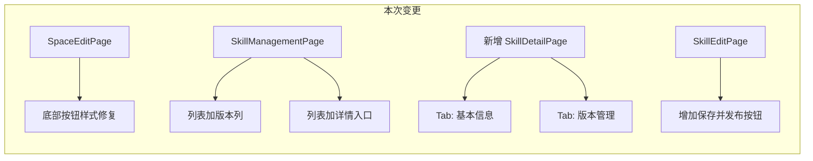
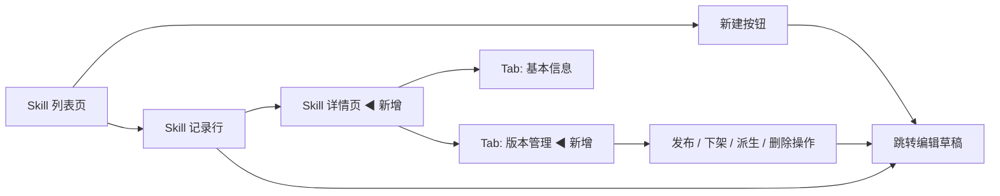
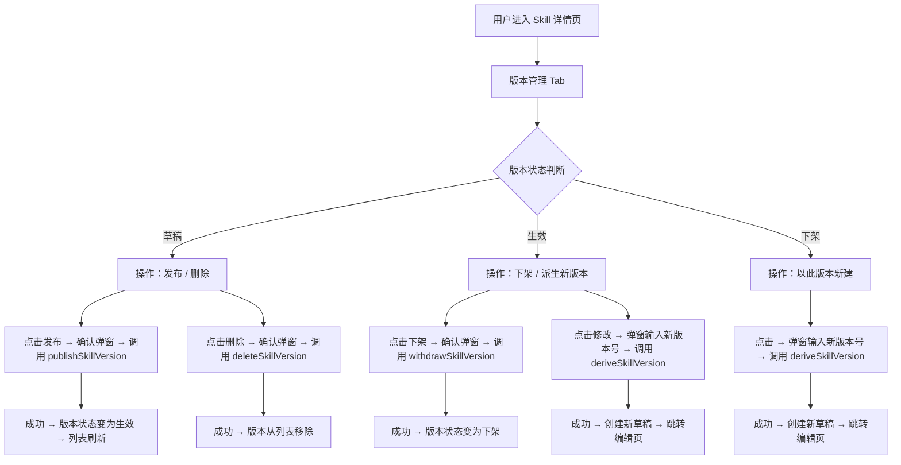
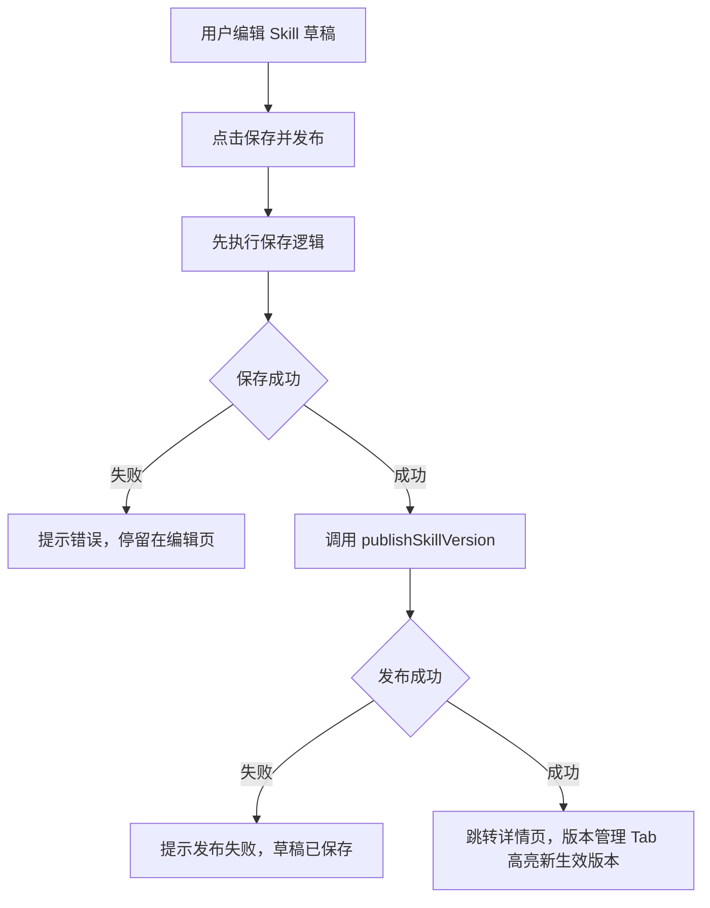
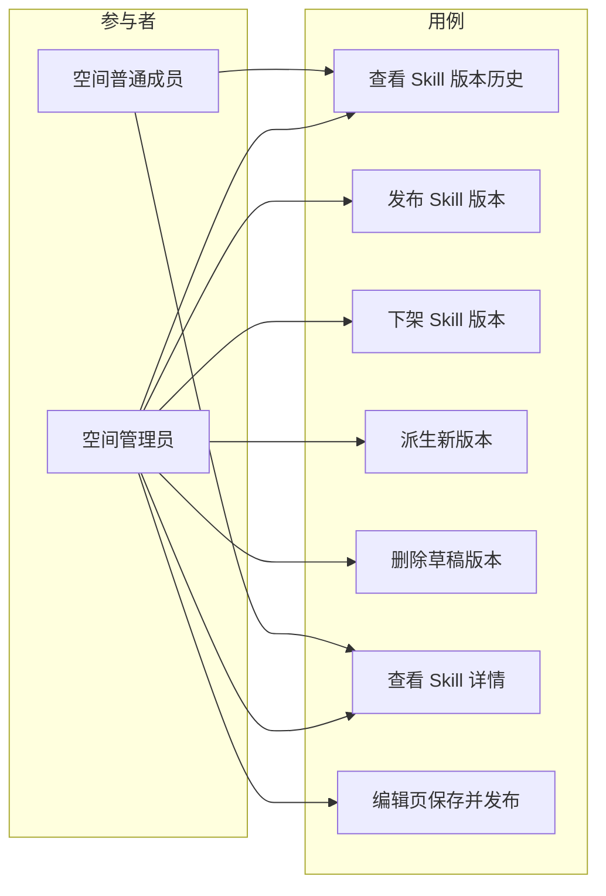

# AgentOps 平台优化（Iteration 1）产品需求文档

| 文档版本 | 日期 | 编写人 | 说明 |
|---------|------|-------|------|
| V1.0 | 2026-06-19 | 产品经理 | 初稿 |
| V1.1 | 2026-06-19 | 产品经理 | 根据技术负责人评审意见修正：详情页基本信息 Tab 取消展示创建人/更新人姓名（仅展示时间），零后端改动 |

---

## 1. 产品/需求背景

AgentOps 平台已交付 V1.3 全平台能力（用户管理、空间管理、模型管理、Agent 管理、Prompt 管理、Skill 管理、工具管理、沙箱管理、系统设置）。在后续使用与走查中发现两个问题：

**问题 1：编辑空间按钮样式不一致**

`SpaceEditPage` 底部保存/取消按钮使用原始 `<button>` 元素配合 Ant Design CSS 类名（`ant-btn ant-btn-default` / `ant-btn ant-btn-primary`），而非 Ant Design 的 `<Button>` 组件。其它所有编辑页面（Tool、Agent、Model、Skill 等）均统一使用 `<Button>` 组件，并支持 `loading` 内置加载态。此不一致导致：
- 按钮缺失 Ant Design 5.x 的完整样式（Hover、Focus、Ripple 等）
- 保存过程中手动切换文案为「保存中…」而非使用内置 `loading` spinner
- 不符合平台统一的 UI 编码规范

**问题 2：Skill 版本管理前端能力缺失**

后端已完整实现 Skill 版本管理的全功能（`SkillVersionAggregate` 状态机、`SkillVersionCommandService` 的 deriveDraft/publish/withdraw/deleteDraft 方法、版本发布事件监听刷新主体 currentVersion、三张数据库表）。前端 `skill.ts` API 客户端也已封装所有版本相关接口。

但前端页面**缺乏版本管理的用户界面**：
- 列表页仅提供「编辑」跳转到编辑页，无版本信息展示入口
- 编辑页仅支持草稿版本编辑，无发布/下架/派生新版本操作按钮
- 无独立详情页展示版本历史、版本切换、版本状态
- 用户无法直观地查看一个 Skill 有哪些版本、当前哪个版本生效、如何发布新版本

---

## 2. 目标与范围

### 2.1 目标

- **修复编辑空间按钮样式**：使 `SpaceEditPage` 的底部按钮与全平台其它编辑页保持一致，统一使用 Ant Design `<Button>` 组件。
- **补齐 Skill 版本管理前端能力**：基于已完成的 PRD 设计（`2026-06-13_Skill管理-PRD.md`）和已完成的后端服务，实现前端版本管理的用户界面：版本列表展示、版本发布/下架/派生草稿/删除草稿、版本历史查看。

### 2.2 范围

| 范围 | 是否包含 | 说明 |
|------|----------|------|
| 空间编辑页按钮样式修复 | 包含 | 替换 raw `<button>` 为 Ant Design `<Button>` 组件，使用 `loading` 属性 |
| 其他页面按钮一致性检查 | 不包含 | 经检查仅 SpaceEditPage 存在此问题，其它编辑页均已使用 `<Button>` |
| Skill 详情页（含版本管理 Tab） | 包含 | 新增独立全页详情页，顶部关键信息 + Tab（基本信息 / 版本管理） |
| 版本管理 Tab 列表 | 包含 | 展示该 Skill 全部版本：版本号、状态、发布时间、创建人、操作 |
| 版本发布操作 | 包含 | 草稿态版本 → 点击发布 → 二次确认 → 调用 `publishSkillVersion()` |
| 版本下架操作 | 包含 | 生效态版本 → 点击下架 → 二次确认 → 调用 `withdrawSkillVersion()` |
| 派生新版本操作 | 包含 | 在生效/下架版本上点击「以此版本新建」→ 输入新版本号 → 调用 `deriveSkillVersion()` |
| 删除草稿版本操作 | 包含 | 仅草稿态 → 二次确认 → 调用 `deleteSkillVersion()` |
| 版本状态标签 | 包含 | 版本列表行状态列显示彩色 Tag（草稿灰/生效绿/下架橙） |
| 编辑页「发布」按钮 | 包含 | 编辑页保存后增加「保存并发布」按钮，保存后立即走发布流程 |
| 列表页版本信息展示 | 包含 | 列表页增加「版本」列，显示最新版本号与状态 |
| 列表页「详情」入口 | 包含 | 列表页操作列增加「详情」按钮，跳转到新增的详情页 |
| Skill.MD 在线编辑增强 | 不包含 | 后续迭代提供 Monaco 编辑器增强 |
| 资源文件树管理 | 不包含 | 已在编辑页实现，本期仅补齐版本管理流程 |
| 版本对比（Diff） | 不包含 | 后续迭代考虑 |
| Skill 跨空间共享 | 不包含 | 不在本迭代范围内 |

### 2.3 不做什么（明确排除项）

- 不新增任何后端接口；所有版本操作均复用现有 `/api/skill-versions/*` 接口
- 不修改 Skill 的状态机逻辑（后端现有三态已完整）
- 不新增 Skill 主体级别的 enable/withdraw UI 变化（列表页已支持）
- 不改动 Skill 编辑页的 SKILL.md 编辑器与资源文件树管理逻辑（只增加版本操作入口）

---

## 3. 系统线框图（必选，优先产出）

### 3.1 本次变更在平台中的范围

本迭代涉及两个模块的 UI 变更：

1. **平台 Shell → 空间管理**: `SpaceEditPage` 底部按钮样式修复（仅视觉修复，页面结构不变）
2. **空间 Shell → Skill 管理**: 
   - `SkillManagementPage` 列表页：增加版本信息列、增加「详情」按钮
   - **新增** `SkillDetailPage`：顶部关键信息 + Tab（基本信息 / 版本管理）
   - `SkillEditPage`：增加「保存并发布」按钮



### 3.2 Skill 管理模块页面结构（变更后）



**模块说明**：

| 模块 | 职责 | 状态 |
|------|------|------|
| Skill 列表页 | 表格展示，增加版本号/版本状态列 +「详情」入口 | 修改 |
| Skill 详情页 | 新增独立全页：顶部固定关键信息 + Tab 切换 | 新增 |
| Tab: 基本信息 | 只读展示 Skill 主体字段，与现有详情逻辑一致 | 新增 |
| Tab: 版本管理 | 版本列表 + 各状态下的操作按钮（发布/下架/派生/删除） | 新增 |
| Skill 编辑页 | 增加「保存并发布」按钮入口 | 修改 |
| 空间编辑页 | 底部按钮从 raw `<button>` 替换为 `<Button>` 组件 | 修复 |

---

## 4. 业务流程图（必选）

### 4.1 编辑空间按钮样式修复

不涉及业务流程变更，仅 UI 组件替换。`SpaceEditPage` 按钮交互行为保持不变。

### 4.2 Skill 版本管理业务流程（前端新增）



### 4.3 Skill 编辑页新增「发布」流程



---

## 5. 用例图（必选）



**图例说明**：

| 参与者 | 含义 |
|--------|------|
| 空间管理员 | 可对 Skill 与版本执行全部管理操作 |
| 空间普通成员 | 仅可查看详情与版本历史，不可执行写操作 |

| 用例 | 含义 | 优先级 |
|------|------|--------|
| 查看 Skill 版本历史 | 在详情页版本管理 Tab 查看全部版本 | P0 |
| 查看 Skill 详情 | 顶部关键信息 + 基本信息 Tab | P0 |
| 发布 Skill 版本 | 草稿→生效，自动下架旧生效版本 | P0 |
| 下架 Skill 版本 | 生效→下架 | P0 |
| 派生新版本 | 生效/下架版本上复制为新草稿 | P0 |
| 删除草稿版本 | 仅草稿可删 | P1 |
| 编辑页保存并发布 | 保存草稿后直接发布 | P1 |

---

## 6. 用户与场景

### 6.1 用户角色

- **空间管理员**：可对 Skill 版本执行发布、下架、派生新版本、删除草稿操作。
- **空间普通成员**：可查看 Skill 详情与版本历史，不可执行版本写操作。

### 6.2 典型用户故事

- 作为空间管理员，我编辑完 Skill 草稿后，希望能点击「保存并发布」一次性完成保存和上线，减少操作步骤。
- 作为空间管理员，我希望在详情页的版本管理 Tab 中，看到 Skill 的全部版本及各自状态，以便了解演进历史。
- 作为空间管理员，当我需要更新某个生效 Skill 时，我希望在其版本行上点击「修改」输入新版本号，自动派生新草稿并进入编辑。
- 作为空间管理员，当新版本上线后发现问题时，我希望能立刻回退：找到旧生效版本，点击「以此版本新建」派生新草稿，确认后发布。
- 作为空间管理员，草稿版本如果不再需要，我希望能在版本管理 Tab 中直接删除。
- 作为空间普通成员，我希望在详情页能看到当前生效版本的信息，但不应该看到发布/下架/删除等操作按钮。

---

## 7. 功能需求

### 7.1 编辑空间按钮样式修复

| 序号 | 功能点 | 简要说明 | 优先级 |
|------|--------|----------|--------|
| 1 | 底部按钮组件替换 | 将 `SpaceEditPage.tsx` 第 213-228 行的 raw `<button>` 替换为 Ant Design `<Button>` 组件 | P0 |
| 2 | 取消按钮 | `<Button onClick={() => navigate(listPath)} disabled={submitting}>取消</Button>` | P0 |
| 3 | 保存/创建按钮 | `<Button type="primary" onClick={handleSubmit} loading={submitting}>{isEdit ? '保存' : '确定创建'}</Button>`（使用 `loading` 替代手动文案切换） | P0 |
| 4 | 移除手动 loading 文案 | 删除 `submitting ? '保存中…' :` 三元逻辑，Ant Design 的 `loading` prop 自带 spinner | P0 |

### 7.2 Skill 列表页增强

| 序号 | 功能点 | 简要说明 | 优先级 |
|------|--------|----------|--------|
| 5 | 版本信息列 | 列表增加「版本号」列（展示 `currentVersionNo`），增加「版本状态」列（展示当前生效版本的状态 Tag） | P0 |
| 6 | 详情入口 | 操作列增加「详情」按钮，点击跳转至新增的 `SkillDetailPage`（路由：`/spaces/:spaceId/skills/:skillNum`） | P0 |
| 7 | 链接跳转交互 | 列表行中的名称/编码列点击也可跳转详情页（与其它模块列表行行为一致） | P1 |

### 7.3 Skill 详情页（新增）

| 序号 | 功能点 | 简要说明 | 优先级 |
|------|--------|----------|--------|
| 8 | 独立全页 | 通过独立路由 `/spaces/:spaceId/skills/:skillNum` 打开，整页布局 | P0 |
| 9 | 顶部关键信息条 | 固定展示：Skill 名称、业务编码（可一键复制）、当前版本号、当前版本状态彩色标签 | P0 |
| 10 | Tab：基本信息 | 只读展示 Skill 主体字段：名称、描述、业务编码、标签、备注、创建/更新审计信息；管理员可见「编辑基本信息」入口（跳转编辑页） | P0 |
| 11 | Tab：版本管理 | 列表展示该 Skill 全部版本（按创建时间倒序） | P0 |
| 12 | 版本列表列 | 版本号、版本编码、状态、发布时间、下架时间、创建人、创建时间、操作 | P0 |
| 13 | 版本状态标签 | 草稿 → `default` 灰色 Tag；生效 → `green` 绿色 Tag；下架 → `orange` 橙色 Tag | P0 |
| 14 | 当前生效版本高亮 | 版本列表中当前生效版本行背景色微亮或带有「当前生效」标记 | P1 |

### 7.4 版本管理操作（版本 Tab 内）

| 序号 | 功能点 | 简要说明 | 优先级 |
|------|--------|----------|--------|
| 15 | 草稿：发布 | 调用 `publishSkillVersion()`；二次确认弹窗提示「即将发布版本 X，当前生效版本 Y 将自动下架」 | P0 |
| 16 | 草稿：删除 | 调用 `deleteSkillVersion()`；二次确认弹窗，提示不可恢复 | P0 |
| 17 | 草稿：编辑 | 跳转编辑页（复用现有路由 `/spaces/:spaceId/skills/:skillNum/edit`） | P0 |
| 18 | 生效：修改（派生新草稿） | 弹出输入新版本号弹窗（默认在源版本号基础上 PATCH+1），调用 `deriveSkillVersion()`；成功后跳转编辑页 | P0 |
| 19 | 生效：下架 | 调用 `withdrawSkillVersion()`；二次确认「下架后引用此 Skill 的 Agent 将报错」 | P0 |
| 20 | 下架：以此版本新建 | 弹出输入新版本号弹窗，调用 `deriveSkillVersion()`；成功后跳转编辑页 | P0 |
| 21 | 派生弹窗交互 | 弹窗输入新版本号，校验不重复，调用 `deriveSkillVersion` API | P0 |
| 22 | 版本查看 | 点击「查看」在弹层或页面区域内只读预览该版本的 SKILL.md 与资源文件（沿用现有编辑页 Tab 布局） | P1 |

### 7.5 Skill 编辑页增强

| 序号 | 功能点 | 简要说明 | 优先级 |
|------|--------|----------|--------|
| 23 | 保存并发布按钮 | 编辑页按钮区增加「保存并发布」按钮（`type="primary"`），位于「保存」按钮右侧 | P0 |
| 24 | 保存并发布流程 | 先执行保存逻辑，保存成功后调用 `publishSkillVersion()`；成功后跳转详情页；若发布失败则提示「草稿已保存但发布失败」 | P0 |
| 25 | 编辑草稿场景优化 | 编辑页加载时检测是否存在草稿版本：有则直接显示该草稿的 SKILL.md + 资源文件；无草稿（全部已发布/下架）时禁用编辑区域并引导用户去版本管理 Tab 派生新版本 | P0 |
| 26 | 无草稿提示 | 编辑页加载后检测无 DRAFT 版本时，页面上方展示 Alert 提示并禁用编辑器 | P0 |

### 7.6 按钮显隐与权限

| 序号 | 功能点 | 简要说明 | 优先级 |
|------|--------|----------|--------|
| 27 | 写操作按钮显隐 | 「发布」「下架」「派生新版本」「删除草稿」「编辑」「保存并发布」等版本操作按钮仅对空间管理员可见 | P0 |
| 28 | 普通成员视图 | 版本管理 Tab 只读展示版本列表，无操作按钮列；基本信息 Tab 只读 | P0 |

### 7.7 后端验证

| 序号 | 功能点 | 简要说明 | 优先级 |
|------|--------|----------|--------|
| 29 | API 对接验证 | 所有版本操作均与现有后端接口对接，不做后端改动；前端需处理后端返回的错误并 toast 展示 | P0 |
| 30 | 状态刷新 | 发布/下架/派生操作成功后，前端实时刷新版本列表、Skill 主体信息 | P0 |

---

## 8. 原型图/界面说明（必选）

### 8.1 空间编辑页按钮样式修复

**变更前**（`SpaceEditPage.tsx` 第 212-229 行）：
```tsx
<Space>
  <button type="button" className="ant-btn ant-btn-default" onClick={...} disabled={submitting}>
    <span>取消</span>
  </button>
  <button type="button" className="ant-btn ant-btn-primary" onClick={...} disabled={submitting}>
    <span>{submitting ? '保存中…' : isEdit ? '保存' : '确定创建'}</span>
  </button>
</Space>
```

**变更后**（与其它编辑页一致）：
```tsx
<Space>
  <Button onClick={() => navigate(listPath)} disabled={submitting}>
    取消
  </Button>
  <Button type="primary" onClick={handleSubmit} loading={submitting}>
    {isEdit ? '保存' : '确定创建'}
  </Button>
</Space>
```

布局与交互无变化，仅组件替换。

### 8.2 Skill 列表页（变更后）

```text
┌───────────────────────────────────────────────────────────────────────────────────────────────┐
│ AgentOps  /  家庭客服 Agent ▼  /  Skill                                                      │
├───────────────────────────────────────────────────────────────────────────────────────────────┤
│  Skill 管理                                                                                   │
│                                                                                               │
│  [搜索名称或标签 🔍]  状态：[全部 ▼]                              [+ 新建 Skill]               │
│                                                                                               │
│  ┌────────┬────────┬──────────┬──────┬──────┬────────────┬────────────┬─────────────────────┐ │
│  │ 编码   │ 名称   │ 描述     │ 版本号│ 标签  │ 状态       │ 更新时间   │ 操作                │ │
│  ├────────┼────────┼──────────┼──────┼──────┼────────────┼────────────┼─────────────────────┤ │
│  │ SK...  │ 银行卡  │ 识别... │ 1.2.0│ 金融  │ 启用 绿    │ 06-13      │ 详情 / 编辑          │ │
│  │ SK...  │ 邮件    │ 撰写... │ 0.9.0│ 写作  │ 草稿 灰    │ 06-12      │ 详情 / 编辑 / 启用   │ │
│  └────────┴────────┴──────────┴──────┴──────┴────────────┴────────────┴─────────────────────┘ │
└───────────────────────────────────────────────────────────────────────────────────────────────┘
```

**变更点**：
- 新增「版本号」列（取自 `currentVersionNo`）
- 「当前版本」状态已在「状态」列中体现（主体状态）
- 操作列新增「详情」链接，位于「编辑」之前

### 8.3 Skill 详情页 — 顶部关键信息条

```text
┌────────────────────────────────────────────────────────────────────────────────────┐
│ AgentOps  /  Skill  /  银行卡号校验助手                                            │
├────────────────────────────────────────────────────────────────────────────────────┤
│  银行卡号校验助手                                                                    │
│  编号：SK202606131426301234567 [📋复制]    当前版本：1.2.0  [生效]                  │
└────────────────────────────────────────────────────────────────────────────────────┘
│  [基本信息]   [版本管理]                                                            │
└────────────────────────────────────────────────────────────────────────────────────┘
│                                                                                    │
│  （Tab 内容区域）                                                                   │
│                                                                                    │
└────────────────────────────────────────────────────────────────────────────────────┘
```

### 8.4 详情页 Tab — 基本信息

```text
┌────────────────────────────────────────────────────────────────────────────────────┐
│  基本信息                                                          [编辑基本信息]   │
│                                                                                    │
│  名称：银行卡号校验助手                                                             │
│  描述：识别中国大陆银行卡号并返回所属银行                                           │
│  业务编码：SK202606131426301234567                                                  │
│  当前版本：1.2.0（生效）                                                            │
│  标签：金融、校验                                                                   │
│  备注：银保监披露表更新时需同步刷新资源文件                                         │
│  创建时间 / 更新时间：2026-06-13 14:26:30 / 2026-06-13 18:00:00                          │
└────────────────────────────────────────────────────────────────────────────────────┘
```

**说明**：
- 展示 `createTime`、`updateTime` 时间戳（后端 DTO 已提供，零后端改动）
- 不展示创建人/更新人名称（当前 DTO 不包含 `createNo`/`updateNo`，如需需后端配合）
- 「编辑基本信息」按钮跳转编辑页（与现有编辑页复用）
- 普通成员不显示「编辑基本信息」按钮

### 8.5 详情页 Tab — 版本管理

```text
┌────────────────────────────────────────────────────────────────────────────────────┐
│  版本管理                                                                           │
│                                                                                    │
│  ┌────────┬────────────┬────────┬────────────────┬────────────────┬────────┬─────────────────────────┐ │
│  │ 版本号 │ 版本编码    │ 状态   │ 发布时间        │ 下架时间        │ 创建人 │ 操作                    │ │
│  ├────────┼────────────┼────────┼────────────────┼────────────────┼────────┼─────────────────────────┤ │
│  │ 1.3.0  │ SKV202606… │ 草稿    │ —              │ —              │ 李四   │ 编辑 / 发布 / 删除      │ │
│  │ 1.2.0  │ SKV202606… │ 生效    │ 2026-06-10     │ —              │ 李四   │ 修改 / 下架             │ │
│  │ 1.1.0  │ SKV202606… │ 下架    │ 2026-06-01     │ 2026-06-10     │ 张三   │ 以此版本新建            │ │
│  │ 1.0.0  │ SKV202606… │ 下架    │ 2026-05-20     │ 2026-06-01     │ 张三   │ 以此版本新建            │ │
│  └────────┴────────────┴────────┴────────────────┴────────────────┴────────┴─────────────────────────┘ │
└────────────────────────────────────────────────────────────────────────────────────┘
```

**操作按钮规则**：

| 版本状态 | 可执行操作 |
|---------|-----------|
| 草稿→ | 编辑（跳转编辑页） / 发布（二次确认） / 删除（二次确认） |
| 生效→ | 修改（弹出派生弹窗） / 下架（二次确认） |
| 下架→ | 以此版本新建（弹出派生弹窗） |

### 8.6 发布确认弹窗

```text
┌──────────────────────────────────────────────────────────────────┐
│  发布版本                                                  ✕    │
├──────────────────────────────────────────────────────────────────┤
│                                                                  │
│  即将发布 Skill「银行卡号校验助手」的版本 1.3.0。                  │
│  ⚠ 当前生效版本 1.2.0 将自动下架。                               │
│                                                                  │
├──────────────────────────────────────────────────────────────────┤
│                                       [取消]   [确定发布]        │
└──────────────────────────────────────────────────────────────────┘
```

### 8.7 下架确认弹窗

```text
┌──────────────────────────────────────────────────────────────────┐
│  下架版本                                                  ✕    │
├──────────────────────────────────────────────────────────────────┤
│                                                                  │
│  确定下架 Skill「银行卡号校验助手」V1.2.0？                       │
│  下架后，引用此 Skill 的 Agent 将无法加载该版本。                 │
│                                                                  │
├──────────────────────────────────────────────────────────────────┤
│                                       [取消]   [确定下架]        │
└──────────────────────────────────────────────────────────────────┘
```

### 8.8 派生新版本弹窗

```text
┌──────────────────────────────────────────────────────────────────┐
│  基于 V1.2.0 创建新版本                                    ✕    │
├──────────────────────────────────────────────────────────────────┤
│                                                                  │
│  新版本号 *                                                       │
│  [1.3.0_______________________________]                          │
│  ⓘ 不可与该 Skill 已有版本重复；建议使用 SemVer 格式            │
│                                                                  │
│  系统将复制 V1.2.0 的 SKILL.md 与资源文件作为新草稿。             │
│                                                                  │
├──────────────────────────────────────────────────────────────────┤
│                                       [取消]   [创建并进入编辑]  │
└──────────────────────────────────────────────────────────────────┘
```

### 8.9 删除草稿版本确认弹窗

```text
┌──────────────────────────────────────────────────────────────────┐
│  ⚠ 删除草稿版本                                            ✕    │
├──────────────────────────────────────────────────────────────────┤
│                                                                  │
│  确定删除 Skill「银行卡号校验助手」的草稿版本 1.3.0？              │
│  删除后该版本的 SKILL.md 与资源文件将不可恢复。                   │
│                                                                  │
├──────────────────────────────────────────────────────────────────┤
│                                       [取消]   [确定删除]        │
└──────────────────────────────────────────────────────────────────┘
```

### 8.10 Skill 编辑页底部按钮（变更后）

```text
┌──────────────────────────────────────────────────────────────────┐
│  ... 编辑区内容 ...                                               │
│                                                                  │
│  [取消]  [保存]  [保存并发布]                                     │
└──────────────────────────────────────────────────────────────────┘
```

**按钮顺序**：取消（文本按钮） → 保存（`type="default"`） → 保存并发布（`type="primary"`）

### 8.11 关键状态

| 状态 | 说明 |
|------|------|
| 无草稿版本时的编辑页 | 页面顶部显示黄色 Alert：「当前无 DRAFT 状态版本，无法编辑。请先在版本管理中派生新版本。」，编辑器与资源文件管理器禁用 |
| 版本列表空态 | Skill 无任何版本时展示「暂无版本记录」（理论上新建 Skill 即创建 V1 草稿，此状态仅异常情况） |
| 发布失败 | toast 提示具体的失败原因（如 frontmatter 校验不通过） |
| 操作权限不足 | 普通成员尝试通过 URL 直接访问详情页写操作时，前端 toast 「无权限操作」，按钮隐藏 |

---

## 9. 非功能需求

- **性能**：版本列表页渲染 ≤ 1s，二次确认弹窗即时响应
- **安全/权限**：
  - 所有版本写操作按钮仅对空间管理员可见
  - 普通成员通过 URL 直接访问详情页写操作时，后端返回 403，前端 toast 提示
- **数据一致性**：发布/下架/派生等操作成功后，前端立即刷新版本列表与 Skill 主体信息；失败时保持当前状态不变并展示错误信息
- **无后端改动**：本期所有变更均为前端改动，后端接口与数据模型不变
- **兼容性**：已创建的 Skill 数据无需数据迁移；详情页正常展示历史版本

---

## 10. 与现有功能的关系

### 10.1 编辑空间按钮样式修复

- 仅修改 `SpaceEditPage.tsx` 底部按钮渲染逻辑
- 不影响 `SpaceListPage.tsx`（删除确认弹窗使用 Ant Design Modal 内置按钮，无需修改）
- 不影响空间的新建/编辑/删除业务流程

### 10.2 Skill 版本管理前端

- **与现有 Skill PRD 的关系**：本期补齐 `2026-06-13_Skill管理-PRD.md` 中已设计但前端未实现的版本管理交互（详见 §3.2/§7.3/§8.6-8.10 原始原型）
- **与后端的关系**：完全复用现有后端接口，不做任何后端变更
- **与现有编辑页的关系**：编辑页增加「保存并发布」按钮，不影响已有「保存」逻辑
- **与列表页的关系**：列表页新增详情入口，不影响已有的列表/搜索/筛选/启用/停用/删除流程
- **与路由的关系**：新增路由 `/spaces/:spaceId/skills/:skillNum` → `SkillDetailPage`

### 10.3 前端对照表更新

`doc/技术方案/2026-06-16_前后端接口对照表.md` 无需更新（无新增接口）。

---

## 11. 验收标准

### 11.1 编辑空间按钮样式

- [ ] `SpaceEditPage` 底部按钮使用 `<Button>` 组件，而非 raw `<button>`
- [ ] 取消按钮使用 `<Button onClick={...} disabled={submitting}>取消</Button>`
- [ ] 保存按钮使用 `<Button type="primary" onClick={...} loading={submitting}>保存</Button>`
- [ ] 创建按钮使用 `<Button type="primary" onClick={...} loading={submitting}>确定创建</Button>`
- [ ] 提交过程中按钮展示 Ant Design 的 loading spinner，而非手动切换文案

### 11.2 Skill 版本管理

- [ ] Skill 列表页新增版本号列和版本状态列
- [ ] Skill 列表页操作列新增「详情」入口，点击跳转详情页
- [ ] Skill 详情页顶部固定展示名称、编码、当前版本号、状态标签
- [ ] 基本信息 Tab 只读展示 Skill 字段
- [ ] 版本管理 Tab 列表展示全部版本，含版本号/编码/状态/发布时间/创建人列
- [ ] 草稿版本行显示「编辑」「发布」「删除」按钮
- [ ] 生效版本行显示「修改」「下架」按钮
- [ ] 下架版本行显示「以此版本新建」按钮
- [ ] 发布操作弹出二次确认弹窗，确认后调用 `publishSkillVersion()` 并刷新列表
- [ ] 下架操作弹出二次确认弹窗，确认后调用 `withdrawSkillVersion()` 并刷新列表
- [ ] 派生新版本弹出输入版本号弹窗，确认后调用 `deriveSkillVersion()` 并跳转编辑页
- [ ] 删除草稿弹出二次确认弹窗，确认后调用 `deleteSkillVersion()` 并刷新列表
- [ ] 编辑页加载后检测无 DRAFT 版本时显示 Alert 提示并禁用编辑区
- [ ] 编辑页「保存并发布」按钮先保存后发布，成功后跳转详情页
- [ ] 普通成员查看详情页时无任何版本操作按钮
- [ ] 所有版本操作按钮仅对空间管理员可见
- [ ] 版本状态 Tag 颜色正确（草稿灰/生效绿/下架橙）