# AgentOps 平台 — 用户管理技术方案

| 文档版本 | 日期 | 编写人 | 说明 |
|---------|------|-------|------|
| V2.0 | 2026-06-06 | AgentOps Team | 基于现有用户管理 PRD 完全重写技术方案 |
| V2.1 | 2026-06-06 | AgentOps Team | 修正 Facade 层定位，仅保留跨领域通用契约，移除用户专用 Facade 设计 |
| V2.2 | 2026-06-06 | AgentOps Team | 修正 PasswordCredential 为值对象，不作为实体设计 |
| V2.3 | 2026-06-06 | AgentOps Team | 收敛 UserRepository 职责，邮箱/手机号唯一性校验改由 UserGateway.assertEmailPhoneUnique 承担 |
| V2.4 | 2026-06-06 | AgentOps Team | 明确业务编码生成与外部/跨领域资源访问必须通过领域网关完成 |
| V2.5 | 2026-06-06 | AgentOps Team | 收敛用户领域网关为单一 UserGateway，业务编码生成作为其中一个方法 |
| V2.7 | 2026-06-06 | AgentOps Team | 规范化领域章节顺序、领域依赖持有、应用层 Repository 禁用约束、草稿用户建模与数据库空值约束 |
| V2.9 | 2026-06-06 | AgentOps Team | 移除写接口重复提交控制相关设计、表结构、参数、服务与拦截器 |

对应 PRD：[doc/产品方案/2026-06-06_用户管理-PRD.md](../产品方案/2026-06-06_用户管理-PRD.md)

---

## 1. 目标与范围

### 1.1 目标

基于 AgentOps 六层架构重新设计平台级用户管理能力，支持平台用户登录、退出、用户生命周期管理、内置角色控制与密码重置，为空间成员管理、系统设置和后续权限体系提供稳定的用户基础数据。

### 1.2 设计前共识

| 问题 | 共识 |
|------|------|
| PRD 来源 | 沿用现有用户管理 PRD |
| 方案处理方式 | 完全重写技术方案 |
| 业务边界 | 本期仅做平台级用户管理；空间成员管理不在本方案实现 |
| 认证范围 | 包含登录、退出 |
| 角色范围 | 固定内置 `ADMIN` 管理员、`MEMBER` 普通成员两个平台角色 |
| Space 关系 | 用户未来可加入多个 Space，且在不同 Space 下可拥有不同角色；本方案只提供平台用户基础数据，空间角色由 space 模块承接 |
| 用户状态 | `DRAFT` 草稿、`ENABLED` 启用、`DISABLED` 禁用 |
| 状态流转 | 草稿提交后启用；启用可禁用；禁用可启用 |
| 唯一标识 | 邮箱、手机号作为登录账号唯一约束；对外使用业务编码 `num` |
| 密码策略 | 至少 8 位，必须包含字母和数字 |
| 审计日志 | 不设计用户审计日志 |
| 页面/API | 用户列表、详情、新增、编辑、启禁用、删除、重置密码、分配角色、查看角色、登录、退出 |
| 查询条件 | 关键词、状态；角色筛选作为 PRD 既有能力保留 |
| 批量能力 | 不包含导入、导出、批量操作 |
| 外部集成 | 暂不对接 LDAP、OAuth/OIDC、飞书、钉钉、短信、邮件等外部系统 |
| 事件 | 领域操作默认发送领域事件；事件不等同审计日志，不单独落审计表 |
| 非功能 | 密码不得明文存储或返回 |
| 数据库 | 当前无生产用户表，本次新建表 |
| 部署架构 | 重新设计部署架构 |

### 1.3 范围说明

| 范围 | 是否包含 | 说明 |
|------|----------|------|
| 用户登录 | 包含 | 邮箱或手机号 + 密码；仅启用且已设置密码用户可登录 |
| 用户退出 | 包含 | 当前 token/session 失效 |
| 当前用户 | 包含 | 返回用户信息、平台角色、平台菜单权限 |
| 用户新增 | 包含 | 前端创建用户时传入邮箱、手机号、姓名、角色列表、备注；状态由领域内部自动生成为 `DRAFT`，业务编码由保存时生成 |
| 用户保存/编辑 | 包含 | 草稿态保存邮箱、手机号、姓名、平台角色、备注 |
| 用户提交 | 包含 | 草稿态提交后变为 `ENABLED` |
| 用户删除 | 包含 | 仅草稿态可删除；删除标记属于基础设施持久化字段，不进入领域模型 |
| 用户启用/禁用 | 包含 | `DISABLED → ENABLED`，`ENABLED → DISABLED` |
| 重置密码 | 包含 | 管理员重置启用/禁用用户密码 |
| 分配角色/用户角色查看 | 包含 | 角色字段随保存/编辑更新；详情与当前用户接口返回角色 |
| 平台角色权限 | 包含 | ADMIN 可访问用户管理/系统设置/空间管理；MEMBER 不可访问用户管理和系统设置 |
| 空间成员与空间角色 | 不包含 | 由 space 模块实现；本方案仅保证用户可被引用 |
| 审计日志 | 不包含 | 不建用户审计表，不记录操作审计日志 |
| 批量导入导出 | 不包含 | 后续迭代 |
| 外部身份源 | 不包含 | 后续迭代 |

---

## 2. 架构设计

### 2.1 应用架构

#### 2.1.1 代码结构

| 层 | 领域 | 包 | 职责 |
|----|------|----|------|
| facade | common | `com.agentops.facade.common` | 跨领域通用返回、分页、请求上下文契约；不包含任何用户领域专用类型 |
| facade | event | `com.agentops.facade.event` | 跨领域领域事件基础契约；具体用户事件仍放在 domain.user.event |
| client | user | `com.agentops.client.user.param` | 用户与认证接口请求 Param |
| client | user | `com.agentops.client.user.dto` | 登录结果、当前用户、用户基础 DTO |
| client | user | `com.agentops.client.user.vo` | 用户列表与详情 VO |
| client | user | `com.agentops.client.user.enums` | `UserStatusDTO`、`UserRoleDTO` 等前后端契约枚举 |
| domain | user | `com.agentops.domain.user.model` | 用户聚合根、密码凭证、角色、状态等领域对象；聚合根持有 Repository、Gateway、DomainEventPublisher 协作依赖 |
| domain | user | `com.agentops.domain.user.factory` | 用户领域工厂接口，仅包含 `create(...)`、`createByNum(...)` |
| domain | user | `com.agentops.domain.user.repository` | 用户仓储接口，供领域工厂加载与领域对象持久化协作 |
| domain | user | `com.agentops.domain.user.gateway` | 用户领域网关 `UserGateway`，统一承载业务编码生成、密码哈希、token、权限解析、账号定位、邮箱手机号唯一性校验、外部资源与跨领域资源访问等能力 |
| domain | user | `com.agentops.domain.user.event` | 用户领域事件定义 |
| infra | user | `com.agentops.infrastructure.user.entity` | `users` 持久化 Entity |
| infra | user | `com.agentops.infrastructure.user.mapper` | MyBatis-Plus Mapper 与只读查询 SQL |
| infra | user | `com.agentops.infrastructure.user.repository` | 实现 domain Repository，仅负责 Entity 与领域对象转换、持久化 |
| infra | user | `com.agentops.infrastructure.user.factory` | 实现 domain Factory，`createByNum(...)` 内部通过 Repository 加载 |
| infra | user | `com.agentops.infrastructure.user.gateway` | 实现用户领域网关 `UserGatewayImpl`，统一承接编号、密码哈希、token、事件发布等基础设施能力 |
| application | auth | `com.agentops.application.auth` | 登录、退出、当前用户应用服务 |
| application | user | `com.agentops.application.user.command` | 用户新增、保存、提交、删除、启用、禁用、重置密码命令编排；不直接使用领域网关，权限校验由 adapter 拦截器统一处理 |
| application | user | `com.agentops.application.user.query` | 用户列表、详情、角色查看查询服务；仅注入 Mapper 做只读查询，不注入领域层接口 |
| adapter | auth | `com.agentops.adapter.auth` | 认证 REST Controller；外部触发入口 |
| adapter | user | `com.agentops.adapter.user` | 用户管理 REST Controller；外部触发入口 |
| adapter | security | `com.agentops.adapter.security` | 登录态解析、管理员鉴权拦截器、token 拦截器 |

#### 2.1.2 分层依赖与调用关系

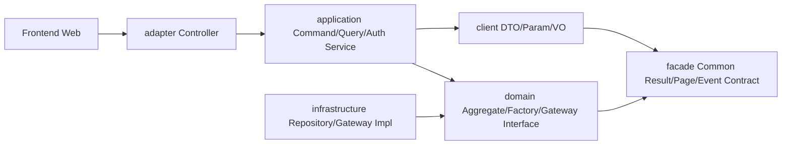

> Facade 只提供跨领域通用基础契约，不参与用户业务聚合，不出现 `facade.user`、用户视图、用户 DTO 或用户状态/角色等专用类型。

- **命令类调用**：`AuthController` / `UserCommandController` 使用 POST 入口，调用 `AuthCommandService`、`UserCommandService`，完成新增、保存、提交、删除、启用、禁用、重置密码、退出。
- **查询类调用**：`AuthQueryController` / `UserQueryController` 使用 GET 入口，调用 `AuthQueryService`、`UserQueryService`，完成当前用户、列表、详情、用户角色查看。
- **Application 约束**：application 层不注入、不直接调用 domain Repository；加载领域对象必须通过 `UserFactory.createByNum(...)`，持久化必须通过聚合根 `save(operatorId)` 完成；查询视图由 `UserQueryService` 通过只读查询能力完成。
- **Repository 约束**：Repository 只服务于领域对象、领域工厂及 infra 实现，不作为 application 查询入口，也不得被 application 直接注入或调用。
- **领域网关约束**：领域动作执行过程中，如需生成业务编码、访问其他领域资源或调用工具/外部能力，必须依赖 domain 层定义的 Gateway 接口；Gateway 实现在 infrastructure 层，领域对象不得直接依赖基础设施实现。
- **事件边界**：领域对象动作产生领域事件，application 在持久化成功后通过 `UserGateway` 发布；本期先支持本地应用事件或 MQ 事件配置，事件不落用户审计表。
- **同步/异步边界**：用户管理主链路同步返回；领域事件异步消费为可选扩展，本期不设计定时任务和业务事件监听入口。

### 2.2 部署架构

本次选择 **重新设计部署架构**。

#### 2.2.1 运行拓扑

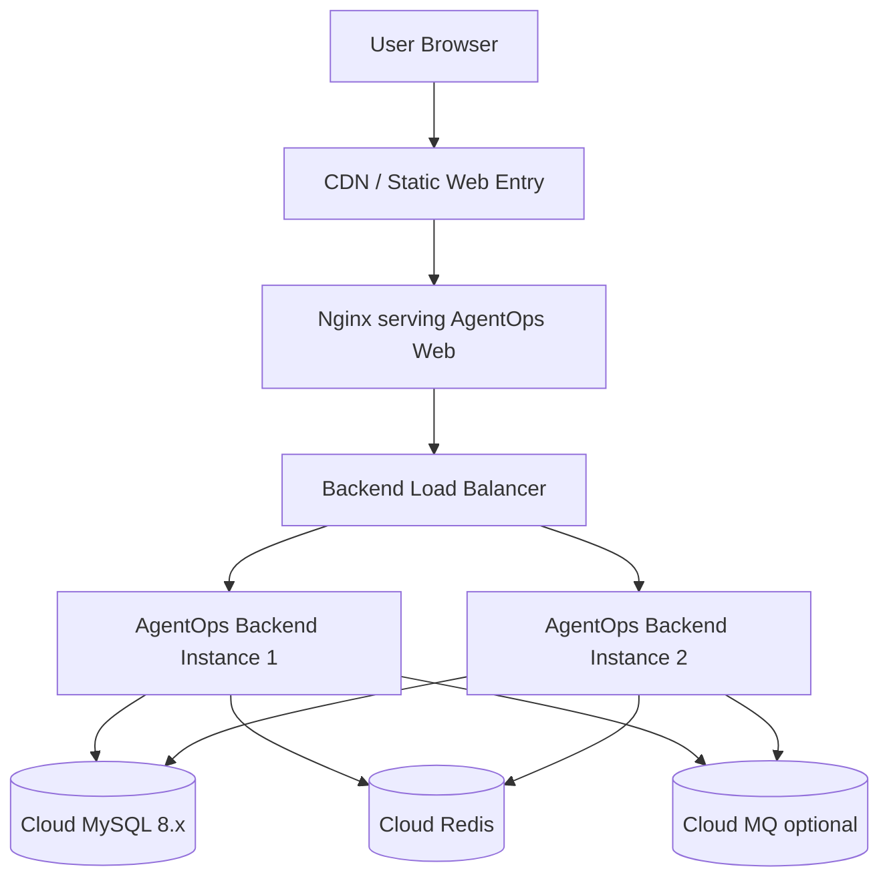

#### 2.2.2 应用与前端部署

| 组件 | 部署方式 | 部署入口 | 实例数量 | 说明 |
|------|----------|----------|----------|------|
| AgentOps Web | Vite 构建静态资源，Nginx/CDN 托管 | `https://agentops.example.com/` | prod 至少 2 个边缘/静态节点 | 提供登录页、用户管理页、空间管理入口、系统设置入口 |
| AgentOps Backend | Spring Boot fat jar 或容器部署 | `https://api.agentops.example.com/` | prod 至少 2 个实例 | 六层 Java 模块打包为同一后端应用服务 |
| MySQL | 云 MySQL 8.x | VPC 内网连接 | 使用云服务 HA | 存储 `users` |
| Redis | 云 Redis | VPC 内网连接 | 使用云服务 HA | 存储登录 token/session、退出黑名单 |
| MQ | 云 RabbitMQ/RocketMQ | VPC 内网连接 | 使用云服务 HA | 发布用户领域事件；本期可先关闭消费者 |

#### 2.2.3 网络访问关系

1. 浏览器访问 Web 域名加载前端静态资源。
2. 前端通过 HTTPS 调用 Backend API 域名。
3. Backend 通过 VPC 内网访问 MySQL、Redis、MQ。
4. MySQL、Redis、MQ 不暴露公网入口。
5. 用户登录成功后，前端持有 access token；后续接口通过 `Authorization: Bearer <token>` 调用。

#### 2.2.4 配置项

| 配置项 | 示例 | 说明 |
|--------|------|------|
| `agentops.auth.token-ttl-seconds` | `7200` | access token 有效期 |
| `agentops.auth.password-hash` | `bcrypt` | 密码哈希算法 |
| `agentops.auth.password-pattern` | `^(?=.*[A-Za-z])(?=.*\d).{8,}$` | 至少 8 位，包含字母和数字 |
| `agentops.event.publisher` | `local` / `mq` | 领域事件发布方式 |
| `spring.datasource.*` | dev/test/prod 区分 | MySQL 连接配置 |
| `spring.data.redis.*` | dev/test/prod 区分 | Redis 连接配置 |

#### 2.2.5 环境差异

| 环境 | Web | Backend | 数据与缓存 | 说明 |
|------|-----|---------|------------|------|
| dev | 本地 Vite 或单 Nginx | 单实例 | 开发库/开发 Redis | 允许 mock 管理员初始化数据 |
| test | 测试静态站点 | 1-2 实例 | 测试 MySQL/Redis | 开启接口日志，验证状态流转 |
| prod | CDN + Nginx | 至少 2 实例 | 云 MySQL/Redis HA | HTTPS、内网访问基础设施、灰度发布 |

#### 2.2.6 扩缩容与高可用

- Backend 无状态化，登录状态存 Redis 或可校验 token，支持水平扩容。
- MySQL 使用唯一索引保证邮箱、手机号、业务编码唯一；并发冲突由应用层捕获后转换为业务错误码。
- 领域事件发布失败不影响主事务提交时，需通过后续 outbox 扩展；本期主链路记录日志并告警。

---

## 3. Facade 层设计

Facade 层只承载跨领域通用基础类型与通用契约，不放任何用户领域专用逻辑、用户 DTO、用户视图、用户状态、用户角色或用户 Facade。当前用户、用户详情、用户列表、角色选项等用户专用契约全部放在 client/application/adapter 的 user 包内。

本次用户管理涉及跨领域通用返回、分页、请求上下文与领域事件基础契约的复用；若项目中已存在同名通用类型，则本次只复用不修改。

| 类/接口/枚举名 | 包路径 | 职责 | 关键字段/方法 | 新增/修改 | 对应实现 Skill |
|----------------|--------|------|---------------|-----------|----------------|
| `Result<T>` | `com.agentops.facade.common.result` | 跨领域统一 API 返回结构 | code、message、data、traceId | 复用/如无则新增 | impl-facade-module |
| `PageResult<T>` | `com.agentops.facade.common.page` | 跨领域分页返回结构 | total、pageNo、pageSize、records | 复用/如无则新增 | impl-facade-module |
| `PageQuery` | `com.agentops.facade.common.page` | 跨领域分页查询基础参数 | pageNo、pageSize | 复用/如无则新增 | impl-facade-module |
| `RequestContextDTO` | `com.agentops.facade.common.context` | 跨领域请求上下文 | operatorId、traceId、tenant/space placeholder | 复用/如无则新增 | impl-facade-module |
| `DomainEventDTO` | `com.agentops.facade.event` | 跨领域领域事件基础载荷 | eventId、eventType、aggregateType、aggregateNum、occurredAt、operatorId、payload | 复用/如无则新增 | impl-facade-module |
| `DomainEventPublisher` | `com.agentops.facade.event` | 跨领域领域事件发布契约 | `publish(DomainEventDTO event)` | 复用/如无则新增 | impl-facade-module |

**兼容性说明**：

- 若上述通用类型已经存在，本方案不修改字段语义，仅在用户管理中复用。
- 若需要新增，必须确保类型名和字段不包含用户业务语义，供后续 space、model、agent、prompt、skill、tool 等领域复用。
- 用户专用 `LoginParam`、`CurrentUserDTO`、`UserVO`、`UserRoleDTO`、`UserStatusDTO` 等全部归属 client 层 `com.agentops.client.user`，不得放入 Facade。

---

## 4. 领域层设计

### 4.1 业务层级划分

| 层级 | 业务领域 | 子域 | 说明 |
|------|----------|------|------|
| 平台级 | user | profile | 平台用户基础资料、状态、角色 |
| 平台级 | user | credential | 登录密码凭证；登录状态类判断由应用层认证流程编排，不作为领域动作 |
| 平台级 | user | permission | 内置平台角色与菜单权限 |

### 4.2 用户（user）

#### 4.2.1 领域模型

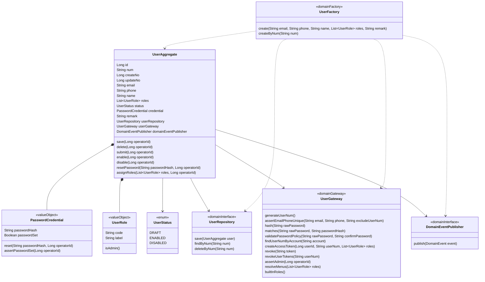

| 对象 | 类型 | 属性 | 与其它对象关系 |
|------|------|------|----------------|
| `UserAggregate` | 聚合根 | id、num、createNo、updateNo、email、phone、name、roles、status、credential、remark、userRepository、userGateway、domainEventPublisher | 用户领域唯一聚合根；持有 Repository、Gateway、DomainEventPublisher 三类协作依赖；包含密码凭证和值对象角色；提供仓储层重建领域对象使用的无参构造函数；软删除标记不进入聚合根或领域实体 |
| `PasswordCredential` | 值对象 | passwordHash、passwordSet | 归属 `UserAggregate`，无独立身份，随用户聚合整体持久化 |
| `UserRole` | 值对象 | code、label | `UserAggregate.roles` 列表，取值 `ADMIN`、`MEMBER` |
| `UserStatus` | 枚举 | DRAFT、ENABLED、DISABLED | 控制用户生命周期状态流转 |
| `UserRepository` | 仓储接口 | save、findByNum、deleteByNum | domain 定义，infra 实现；仅供聚合根持久化、删除与工厂加载，application 不直接调用 |
| `UserFactory` | 领域工厂接口 | create、createByNum | domain 定义，infra 实现；application 通过工厂构建/加载聚合 |
| `UserGateway` | 领域网关接口 | 业务编码、账号定位、密码、token、权限、菜单、唯一性校验 | domain 定义，infra 实现；聚合或应用编排需要外部/工具/跨边界能力时依赖该接口 |
| `DomainEventPublisher` | 领域事件发布器接口 | publish | 聚合根持有，每次领域操作完成后只发布本次操作对应的单个领域事件；infra 适配本地事件或 MQ |

**聚合边界与一致性边界**：

- `UserAggregate` 是用户领域唯一聚合根，邮箱、手机号、角色、状态、密码凭证在同一事务内保持一致。
- 领域对象提供默认无参构造函数，仅供仓储层根据持久化数据重建领域对象；业务创建仍通过领域工厂注入 Repository、Gateway、DomainEventPublisher。
- 创建草稿只生成 `num` 并进入 `DRAFT`，允许邮箱、姓名、角色暂为空；保存资料与提交时按 PRD 校验邮箱、姓名、角色、手机号、备注。
- 跨聚合仅通过 `userNum` 或 `userId` 引用；space 模块未来通过 `userNum` 引用平台用户，不在本方案内维护空间角色。
- 用户领域不依赖 Spring、MyBatis、Redis、MQ 等框架，只依赖 domain/facade 中定义的接口与通用契约。
- 软删除标记属于基础设施持久化控制字段，不作为聚合根或领域实体属性建模。

#### 4.2.2 领域动作

> 纯校验类逻辑不作为领域动作；登录状态、密码是否已设置等判断由应用层认证流程读取聚合状态后编排处理，不在聚合根上设计登录校验类领域动作。

| 聚合/实体 | 领域动作 | 职责 | 前置条件 | 后置条件/规则 | 领域事件 |
|-----------|----------|------|----------|---------------|----------|
| UserAggregate | `save(Long operatorId)` | 保存用户聚合；创建空草稿或保存已设置到聚合上的草稿资料和角色；若业务编码不存在则通过领域网关生成 | operatorId 非空；聚合持有 Repository、Gateway、DomainEventPublisher；不得由 application 直接调用 Repository；若保存资料则 status=DRAFT 且字段合法 | num 不为空，createNo/updateNo 按场景更新，持久化成功后事件发布 | `UserSavedEvent` |
| UserAggregate | `delete(Long operatorId)` | 删除草稿态用户 | status=DRAFT | 调用 Repository.deleteByNum(num)，不在聚合根维护软删除标记 | `UserDeletedEvent` |
| UserAggregate | `submit(Long operatorId)` | 草稿提交为启用 | status=DRAFT；邮箱、姓名、角色完整；手机号/备注合法 | status=ENABLED，updateNo=operatorId | `UserSubmittedEvent` |
| UserAggregate | `enable(Long operatorId)` | 启用禁用用户 | status=DISABLED | status=ENABLED，updateNo=operatorId | `UserEnabledEvent` |
| UserAggregate | `disable(Long operatorId)` | 禁用启用用户 | status=ENABLED | status=DISABLED，updateNo=operatorId | `UserDisabledEvent` |
| UserAggregate | `resetPassword(String passwordHash, Long operatorId)` | 重置密码凭证 | passwordHash 非空；目标用户非 DRAFT | passwordSet=true，updateNo=operatorId | `UserPasswordResetEvent` |
| UserAggregate | `assignRoles(List<UserRole> roles, Long operatorId)` | 分配平台角色 | status=DRAFT 或 ENABLED；roles 合法 | roles 更新，updateNo=operatorId | `UserRolesAssignedEvent` |

**save(operatorId)**

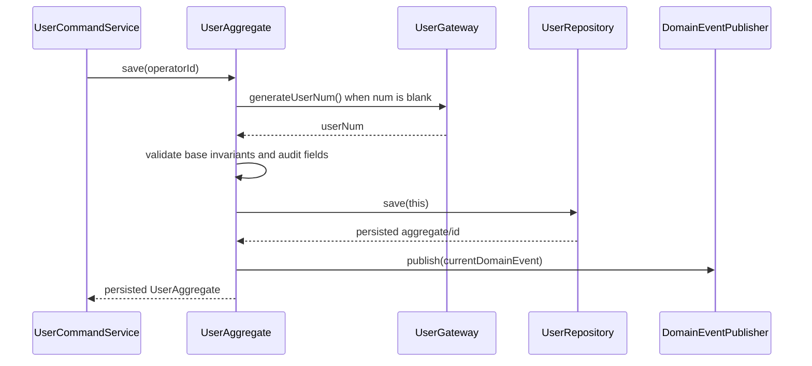

**delete(operatorId)**

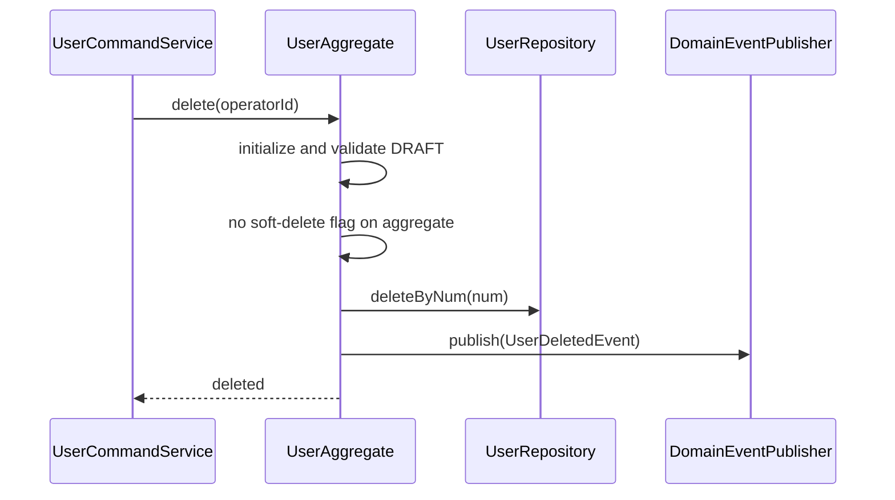

**submit(operatorId)**

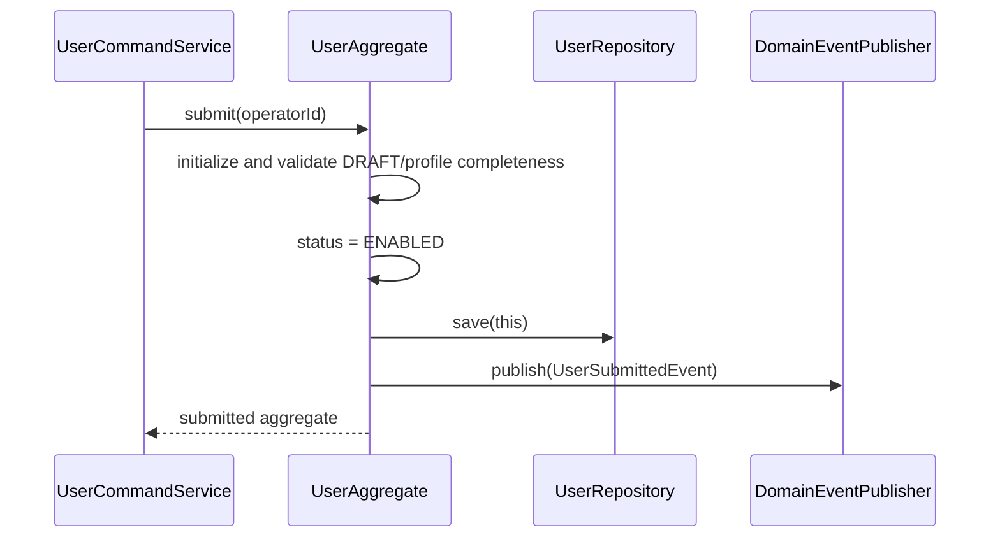

**enable(operatorId)**


**disable(operatorId)**

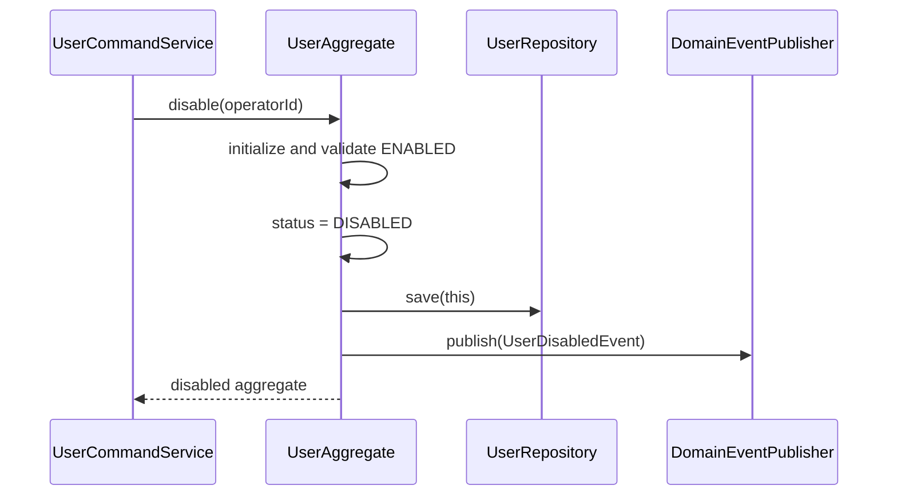

**resetPassword(passwordHash, operatorId)**

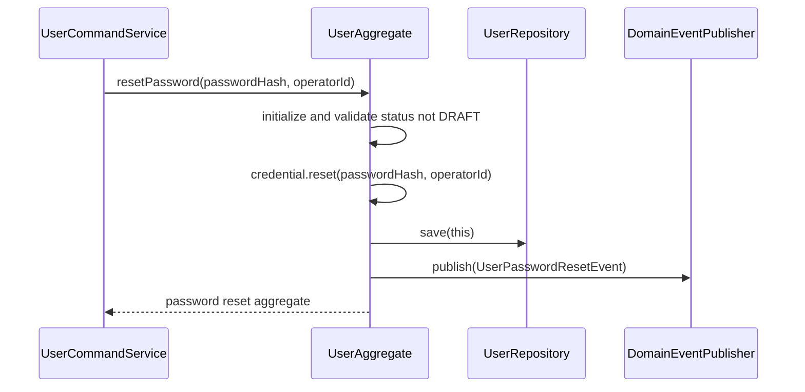

**assignRoles(roles, operatorId)**

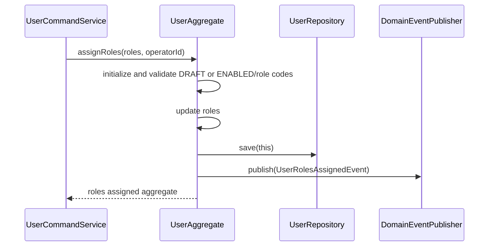

#### 4.2.3 领域规则

| 聚合/对象 | 规则类型 | 规则描述 | 违反时表达 |
|-----------|----------|----------|------------|
| UserAggregate | 基本属性 | 聚合根必须具备 id、num、createNo、updateNo；新建时 id/num 可为空，持久化后回填 | `USER_BASE_FIELD_INVALID` |
| UserAggregate | 协作依赖 | 聚合根必须持有 `UserRepository`、`UserGateway`、`DomainEventPublisher`；Factory 创建/加载聚合时注入这些依赖 | `USER_COLLABORATOR_REQUIRED` |
| UserAggregate | 必备动作 | 聚合根必须具备 `save(operatorId)`、`delete(operatorId)`；所有领域动作必须带操作人 | `USER_ACTION_REQUIRED` |
| UserAggregate | 编码规则 | 执行 `save(operatorId)` 时若 num 为空，必须通过 `UserGateway.generateUserNum()` 生成；num 格式 `US + yyyyMMddHHmmssSSS + 4位随机数`，全局唯一 | `USER_NUM_INVALID` / `USER_NUM_EXISTS` |
| UserAggregate | 草稿创建规则 | 创建草稿时允许邮箱、姓名、角色为空；不得允许草稿登录 | `USER_DRAFT_LOGIN_DENIED` |
| UserAggregate | 邮箱规则 | 保存资料或提交时邮箱必填、格式合法、全平台唯一 | `USER_EMAIL_REQUIRED` / `USER_EMAIL_INVALID` / `USER_EMAIL_EXISTS` |
| UserAggregate | 手机规则 | 手机号可空；填写时格式合法且全平台唯一 | `USER_PHONE_INVALID` / `USER_PHONE_EXISTS` |
| UserAggregate | 姓名规则 | 保存资料或提交时姓名必填，trim 后不可为空 | `USER_NAME_REQUIRED` |
| UserAggregate | 角色规则 | 保存资料或提交时 roles 至少一个；仅允许 `ADMIN`、`MEMBER` | `USER_ROLE_INVALID` |
| UserAggregate | 备注规则 | remark 长度不超过 200 字 | `USER_REMARK_TOO_LONG` |
| UserAggregate | 保存资料规则 | 仅 `DRAFT` 用户可保存/编辑基础资料；角色分配允许 `DRAFT` 或 `ENABLED` 用户 | `USER_ONLY_DRAFT_CAN_SAVE` / `USER_ONLY_DRAFT_OR_ENABLED_CAN_ASSIGN_ROLES` |
| UserAggregate | 删除规则 | 仅 `DRAFT` 用户可删除；软删除标记属于 infra 持久化字段，不进入领域模型 | `USER_ONLY_DRAFT_CAN_DELETE` |
| UserAggregate | 提交规则 | 仅 `DRAFT` 用户可提交；提交后状态为 `ENABLED` | `USER_ONLY_DRAFT_CAN_SUBMIT` |
| UserAggregate | 启用规则 | 仅 `DISABLED` 用户可启用 | `USER_ONLY_DISABLED_CAN_ENABLE` |
| UserAggregate | 禁用规则 | 仅 `ENABLED` 用户可禁用 | `USER_ONLY_ENABLED_CAN_DISABLE` |
| PasswordCredential | 值对象规则 | 无独立身份，不设计 id、num、createNo、updateNo、save、delete；密码哈希非空才视为已设置密码 | `USER_PASSWORD_NOT_SET` |
| PasswordCredential | 登录规则 | 作为用户聚合内值对象参与登录校验；仅 `ENABLED` 且已设置密码的用户可登录 | `USER_NOT_ENABLED` / `USER_PASSWORD_NOT_SET` |
| UserRole | 权限规则 | ADMIN 可访问用户管理、系统设置、空间管理；MEMBER 仅能访问空间管理入口 | `ACCESS_DENIED` |

#### 4.2.4 领域工厂

每个聚合根必须通过领域工厂构建。`UserFactory` 只允许以下两个方法：

| Factory | 方法名 | 入参 | 返回值 | 职责 | 依赖 |
|---------|--------|------|--------|------|------|
| `UserFactory` | `create(...)` | `String email, String phone, String name, List<UserRole> roles, String remark` | `UserAggregate` | 创建新的用户聚合对象，注入 Repository、Gateway、DomainEventPublisher，并根据前端创建用户时传入的基础字段赋值；状态等内部字段不作为参数，业务编码由后续 `save(operatorId)` 生成 | `UserRepository`、`UserGateway`、`DomainEventPublisher` |
| `UserFactory` | `createByNum(...)` | `String num` | `UserAggregate` | 根据业务编码构建既有用户聚合；内部通过 Repository 获取并重建领域对象 | `UserRepository.findByNum(num)`、`UserGateway`、`DomainEventPublisher` |

**create(...) 时序**

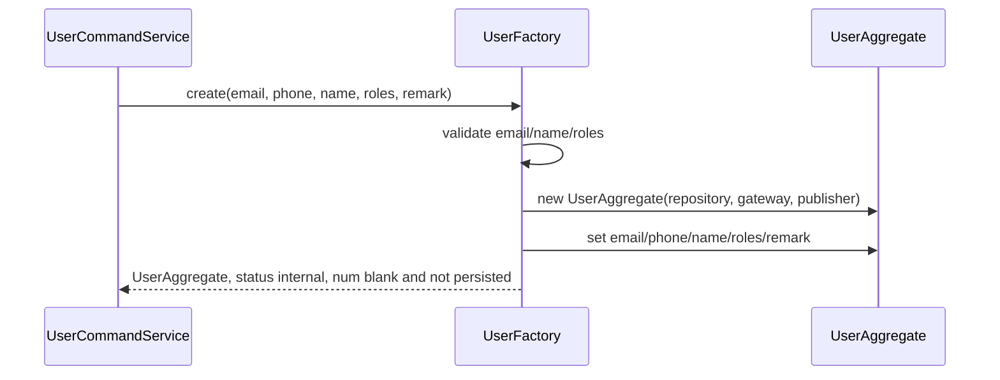

**createByNum(...) 时序**

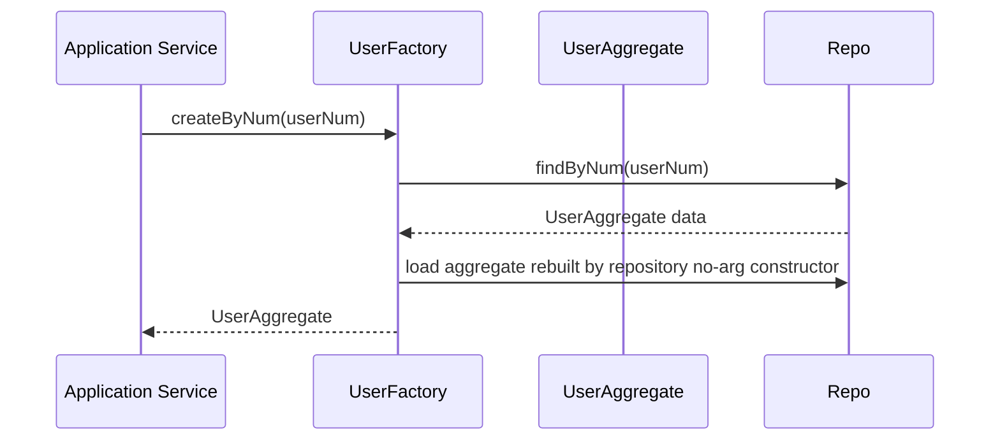

#### 4.2.5 领域网关

| Gateway | 方法名 | 入参 | 返回值 | 职责 | 外部依赖 | 失败策略 |
|---------|--------|------|--------|------|----------|----------|
| `UserGateway` | `generateUserNum()` | none | String | 生成用户业务编码 | 时钟、随机数/序列、`users.num` 唯一索引 | 冲突时重试，超过次数返回 `USER_NUM_EXISTS` |
| `UserGateway` | `assertEmailPhoneUnique(...)` | email、phone、excludeUserNum | void | 校验邮箱和手机号全平台唯一 | `UserMapper` 只读查询 | 重复时返回 `USER_EMAIL_EXISTS` / `USER_PHONE_EXISTS` |
| `UserGateway` | `hash(...)` | rawPassword | String | 生成安全密码哈希 | BCrypt/Argon2id | 算法异常转 `PASSWORD_HASH_FAILED` |
| `UserGateway` | `matches(...)` | rawPassword、passwordHash | boolean | 校验密码 | BCrypt/Argon2id | 异常按不匹配处理，不泄露细节 |
| `UserGateway` | `validatePasswordPolicy(...)` | rawPassword、confirmPassword | void | 校验密码复杂度和两次输入一致 | 配置中心/本地配置 | 返回 `PASSWORD_POLICY_NOT_MATCH` / `PASSWORD_CONFIRM_NOT_MATCH` |
| `UserGateway` | `findUserNumByAccount(...)` | account | String/null | 根据邮箱或手机号定位用户编码 | `UserMapper` 只读查询 | 不存在返回 null，由应用统一映射为账号或密码错误 |
| `UserGateway` | `createAccessToken(...)` | userId、userNum、roles | String | 签发访问令牌 | Redis/JWT | 失败返回认证服务错误 |
| `UserGateway` | `revoke(...)` | token | void | 退出登录，令牌失效 | Redis/JWT blacklist | 重复撤销按成功处理 |
| `UserGateway` | `revokeUserTokens(...)` | userNum | void | 禁用或重置密码后失效目标用户令牌 | Redis/JWT blacklist | 失败记录告警，主流程按安全策略决定是否回滚 |
| `UserGateway` | `assertAdmin(...)` | operatorId | void | 校验操作人具备 ADMIN 平台角色 | token context / user read model | 无权限返回 `ACCESS_DENIED` |
| `UserGateway` | `resolveMenus(...)` | roles | List<String> | 根据平台角色解析菜单 | 本地权限配置 | 未识别角色忽略或返回空菜单 |
| `UserGateway` | `builtInRoles()` | none | List<UserRoleDTO> | 返回内置平台角色 | 本地权限配置 | 配置缺失时启动失败或返回系统错误 |

#### 4.2.6 领域事件

| 事件名 | 触发时机 | 载荷要点 | 可订阅方/用途 |
|--------|----------|----------|----------------|
| `UserCreatedEvent` | 草稿首次 `save(operatorId)` 成功后 | userNum、operatorId、status | 后续通知、缓存刷新 |
| `UserSavedEvent` | 草稿资料保存成功后 | userNum、operatorId、changedFields | 用户详情缓存刷新 |
| `UserDeletedEvent` | 草稿删除成功后 | userNum、operatorId | 用户列表缓存刷新 |
| `UserSubmittedEvent` | 草稿提交启用后 | userNum、operatorId、roles | 空间成员可选用户刷新 |
| `UserEnabledEvent` | 禁用态启用后 | userNum、operatorId | 登录控制刷新 |
| `UserDisabledEvent` | 启用态禁用后 | userNum、operatorId | token/session 失效、登录控制刷新 |
| `UserPasswordResetEvent` | 密码重置后 | userNum、operatorId | token/session 失效、安全通知扩展 |
| `UserRolesAssignedEvent` | 草稿态角色更新后 | userNum、operatorId、roles | 菜单权限缓存刷新 |

#### 4.2.7 领域层自检

- 已按用户领域固定包含领域模型、领域动作、领域规则、领域工厂、领域网关、领域事件。
- 聚合根包含 id、num、createNo、updateNo，并持有 Repository、Gateway、DomainEventPublisher 三类协作依赖；聚合根不保存领域事件快照，每次领域操作只发布一个当前事件。
- `UserFactory` 仅包含 `create(...)` 与 `createByNum(...)`；application 不直接 new 聚合，也不直接调用 Repository。
- 所有领域动作均包含 operatorId；领域动作所需外部/工具/跨边界能力均通过 `UserGateway` 表达。

---

## 5. 基础设施层设计

### 5.1 用户（user）

| 类型 | 类名 | 包路径 | 职责 | 依赖 | 对应表/外部服务 | 新增/修改 |
|------|------|--------|------|------|----------------|-----------|
| Entity | `UserEntity` | `com.agentops.infrastructure.user.entity` | 映射 `users` 表字段 | MyBatis-Plus | `users` | 新增 |
| Mapper | `UserMapper` | `com.agentops.infrastructure.user.mapper` | 用户表 CRUD、按账号查询、分页查询 | MyBatis-Plus | `users` | 新增 |
| RepositoryImpl | `UserRepositoryImpl` | `com.agentops.infrastructure.user.repository` | 实现 domain `UserRepository`，Entity ↔ Domain 转换与持久化；重建领域对象时使用聚合根无参构造函数，只做字段映射 | `UserMapper`、`UserConverter` | `users` | 新增 |
| FactoryImpl | `UserFactoryImpl` | `com.agentops.infrastructure.user.factory` | 实现 `UserFactory.create(...)`、`createByNum(...)`；`create(...)` 创建领域对象并注入 Repository、Gateway、DomainEventPublisher，再根据 email、phone、name、roles、remark 赋值；`createByNum(...)` 通过 Repository 加载后补齐协作依赖 | `UserRepository`、`UserGateway`、`DomainEventPublisher` | `users` | 新增 |
| GatewayImpl | `UserGatewayImpl` | `com.agentops.infrastructure.user.gateway` | 统一实现 `UserGateway`：业务编码生成、密码哈希/校验、密码策略、token 创建/失效、管理员校验、菜单解析、邮箱手机号唯一性校验、领域事件发布、账号定位等用户领域所需外部/工具/跨领域能力 | `UserMapper`、Redis/JWT、Spring Event 或 MQ client | `users`、Redis、MQ optional | 新增 |
| Converter | `UserConverter` | `com.agentops.infrastructure.user.converter` | `UserEntity`、`UserAggregate`、DTO/VO 转换辅助 | Jackson | - | 新增 |
| common | `UserInfraExceptionTranslator` | `com.agentops.infrastructure.user.common` | 唯一索引冲突转业务错误 | MySQL 异常 | - | 新增 |

### 5.2 查询读模型实现

| 类型 | 类名 | 包路径 | 职责 | 依赖 | 对应表 | 新增/修改 |
|------|------|--------|------|------|--------|-----------|
| Query | `UserQueryMapper` / `UserQueryDao` | `com.agentops.infrastructure.user.mapper` | 为 application 查询服务提供当前用户、分页、详情、角色查询等只读能力；不作为领域网关类 | `UserMapper` | `users` | 新增 |

> 说明：用户列表、详情等纯读模型由查询 Mapper/DAO 承担；`UserGateway` 只作为用户领域网关类，承载领域动作或应用编排所需的外部/工具/跨领域能力。

---

## 6. 应用层设计

### 6.1 业务模块划分

| 模块 | 对应领域 | Application 包 | 说明 |
|------|----------|----------------|------|
| 认证（auth） | auth | `com.agentops.application.auth` | 登录、退出、当前用户；auth 作为应用层编排领域，无独立领域模型，不依赖领域层接口；登录验证通过调用 UserQueryService 查询用户信息 + PasswordEncryptor 密码校验 + TokenProvider 签发令牌 |
| 用户命令（user-command） | user | `com.agentops.application.user.command` | 用户新增、保存、提交、删除、启用、禁用、重置密码 |
| 用户查询（user-query） | user | `com.agentops.application.user.query` | 用户列表、详情、角色查看 |

### 6.2 认证（auth）

#### 6.2.1 Service 方法清单

| Service | 方法签名 | 职责 | 入参 | 出参 |
|---------|----------|------|------|------|
| `AuthCommandService` | `LoginResultDTO login(LoginParam param, RequestContextDTO ctx)` | 登录认证，返回 token、用户信息与菜单 | account、password、ctx | LoginResultDTO |
| `AuthCommandService` | `void logout(LogoutParam param, Long operatorId)` | 当前 token 失效 | token、operatorId | void |
| `AuthQueryService` | `CurrentUserDTO current(Long operatorId)` | 查询当前用户、平台角色与菜单权限 | operatorId | CurrentUserDTO |

#### 6.2.2 方法时序逻辑

**login**

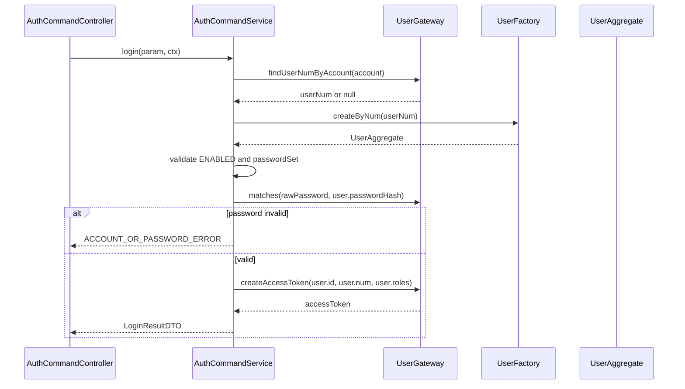

**logout**

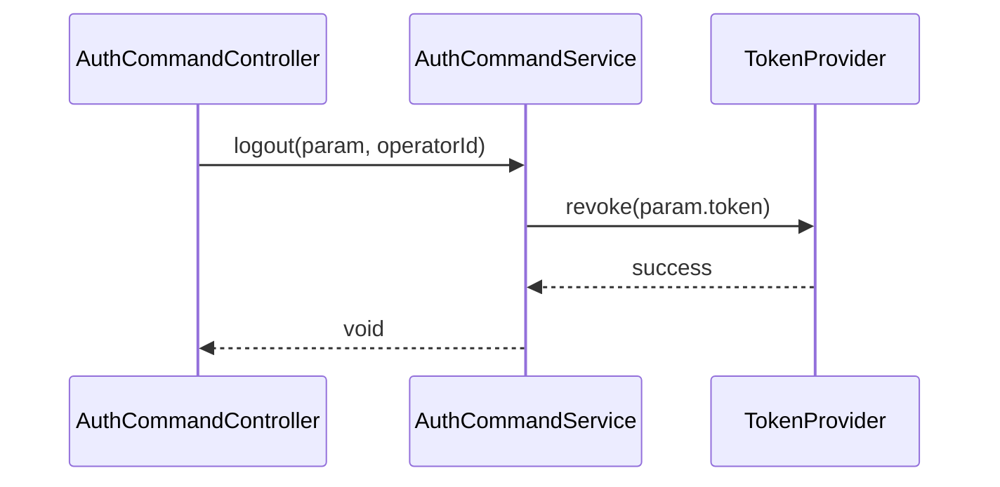

**current**

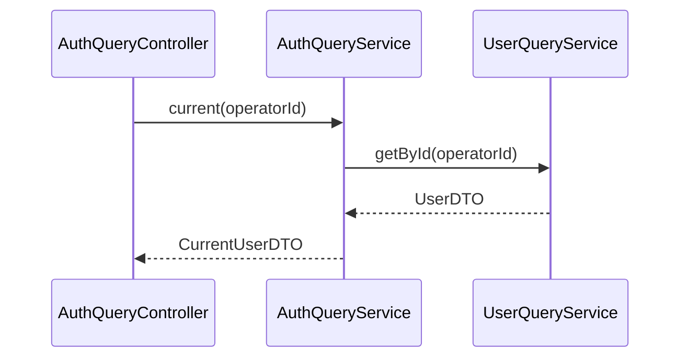

### 6.3 用户命令（user-command）

#### 6.3.1 Service 方法清单

| Service | 方法签名 | 职责 | 入参 | 出参 |
|---------|----------|------|------|------|
| `UserCommandService` | `UserDTO create(UserCreateParam param, Long operatorId)` | 根据前端输入创建用户草稿；业务编码由 `UserAggregate.save(...)` 通过领域网关生成，状态由领域内部默认为 DRAFT | email、phone、name、roles、remark | UserDTO |
| `UserCommandService` | `UserDTO save(UserSaveParam param, Long operatorId)` | 保存草稿用户资料与角色 | userNum、email、phone、name、roles、remark | UserDTO |
| `UserCommandService` | `void submit(UserActionParam param, Long operatorId)` | 草稿提交为启用 | userNum | void |
| `UserCommandService` | `void delete(UserActionParam param, Long operatorId)` | 删除草稿用户 | userNum | void |
| `UserCommandService` | `void enable(UserActionParam param, Long operatorId)` | 禁用态启用 | userNum | void |
| `UserCommandService` | `void disable(UserActionParam param, Long operatorId)` | 启用态禁用 | userNum | void |
| `UserCommandService` | `void resetPassword(ResetPasswordParam param, Long operatorId)` | 重置用户密码 | userNum、newPassword、confirmPassword | void |
| `UserCommandService` | `UserDTO assignRoles(AssignUserRolesParam param, Long operatorId)` | 草稿态分配平台角色 | userNum、roles | UserDTO |

#### 6.3.2 方法时序逻辑

**create**

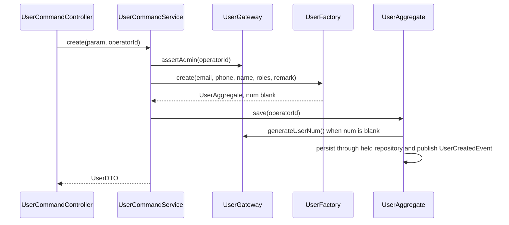

**save**

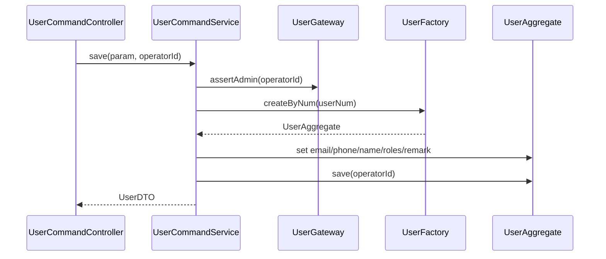

**submit**

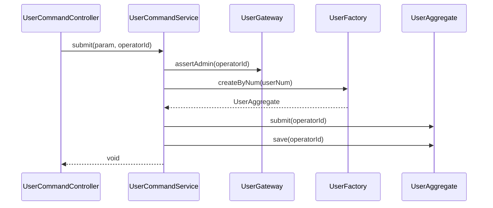

**delete**

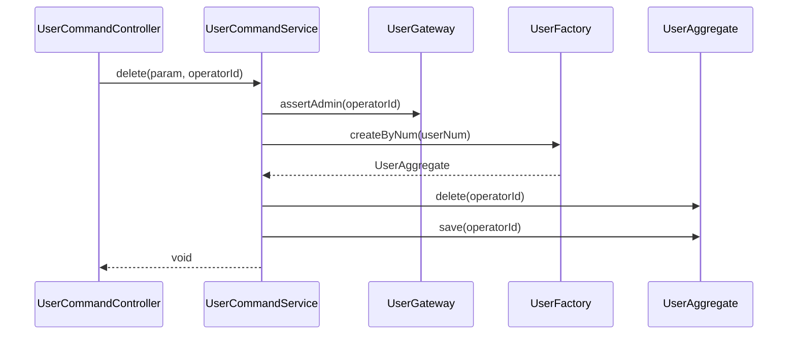

**enable**

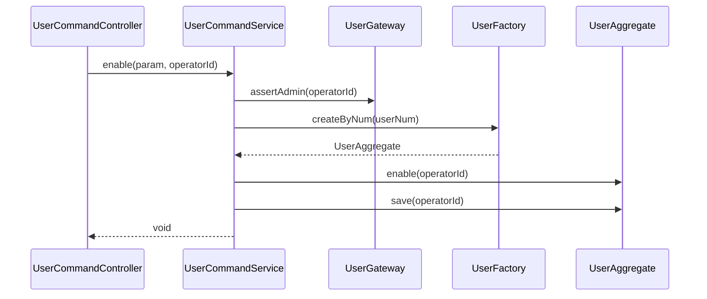

**disable**

```mermaid
sequenceDiagram
    participant Controller as UserCommandController
    participant App as UserCommandService
    participant Gateway as UserGateway
    participant Factory as UserFactory
    participant User as UserAggregate
    Controller->>App: disable(param, operatorId)
    App->>Gateway: assertAdmin(operatorId)
    App->>Factory: createByNum(userNum)
    Factory-->>App: UserAggregate
    App->>User: disable(operatorId)
    App->>User: save(operatorId)
    App-->>Controller: void
```

**resetPassword**

```mermaid
sequenceDiagram
    participant Controller as UserCommandController
    participant App as UserCommandService
    participant Gateway as UserGateway
    participant Factory as UserFactory
    participant User as UserAggregate
    Controller->>App: resetPassword(param, operatorId)
    App->>Gateway: assertAdmin(operatorId)
    App->>Gateway: validate(rawPassword, confirmPassword)
    App->>Gateway: hash(rawPassword)
    Gateway-->>App: passwordHash
    App->>Factory: createByNum(userNum)
    Factory-->>App: UserAggregate
    App->>User: resetPassword(passwordHash, operatorId)
    App->>User: save(operatorId)
    App->>Gateway: revokeUserTokens(userNum)
    App-->>Controller: void
```

**assignRoles**

```mermaid
sequenceDiagram
    participant Controller as UserCommandController
    participant App as UserCommandService
    participant Gateway as UserGateway
    participant Factory as UserFactory
    participant User as UserAggregate
    Controller->>App: assignRoles(param, operatorId)
    App->>Gateway: assertAdmin(operatorId)
    App->>Factory: createByNum(userNum)
    Factory-->>App: UserAggregate
    App->>User: assignRoles(roles, operatorId)
    App->>User: save(operatorId)
    App-->>Controller: UserDTO
```

### 6.4 用户查询（user-query）

#### 6.4.1 Service 方法清单

| Service | 方法签名 | 职责 | 入参 | 出参 |
|---------|----------|------|------|------|
| `UserQueryService` | `PageResultDTO<UserVO> page(UserPageParam param, Long operatorId)` | 分页查询用户列表 | keyword、status、role、pageNo、pageSize | PageResultDTO<UserVO> |
| `UserQueryService` | `UserVO detail(UserDetailParam param, Long operatorId)` | 查询用户详情 | userNum | UserVO |
| `UserQueryService` | `List<UserRoleDTO> roleOptions(Long operatorId)` | 查询可分配的平台角色 | operatorId | List<UserRoleDTO> |
| `UserQueryService` | `List<UserRoleDTO> userRoles(UserRoleQueryParam param, Long operatorId)` | 查看指定用户平台角色 | userNum | List<UserRoleDTO> |

#### 6.4.2 方法时序逻辑

**page**

```mermaid
sequenceDiagram
    participant Controller as UserQueryController
    participant App as UserQueryService
    participant QueryDao as UserQueryDao
    Controller->>App: page(param, operatorId)
    App->>QueryDao: pageUsers(keyword, status, role, pageNo, pageSize)
    QueryDao-->>App: PageResultDTO<UserVO>
    App-->>Controller: PageResultDTO<UserVO>
```

**detail**

```mermaid
sequenceDiagram
    participant Controller as UserQueryController
    participant App as UserQueryService
    participant QueryDao as UserQueryDao
    Controller->>App: detail(param, operatorId)
    App->>QueryDao: userDetail(userNum)
    QueryDao-->>App: UserVO
    App-->>Controller: UserVO
```

**roleOptions**

```mermaid
sequenceDiagram
    participant Controller as UserQueryController
    participant App as UserQueryService
    Controller->>App: roleOptions(operatorId)
    App->>App: builtInRoles()
    Gateway-->>App: ADMIN, MEMBER
    App-->>Controller: List<UserRoleDTO>
```

**userRoles**

```mermaid
sequenceDiagram
    participant Controller as UserQueryController
    participant App as UserQueryService
    participant QueryDao as UserQueryDao
    Controller->>App: userRoles(param, operatorId)
    App->>QueryDao: userRoles(userNum)
    QueryDao-->>App: List<UserRoleDTO>
    App-->>Controller: List<UserRoleDTO>
```


---

## 7. Adapter 层设计

### 7.1 业务模块划分

| 模块 | 入口类型 | 类名 | 包 | 对应应用服务 |
|------|----------|------|----|--------------|
| auth | Controller | `AuthCommandController` | `com.agentops.adapter.auth` | `AuthCommandService`（application.auth） |
| auth | Controller | `AuthQueryController` | `com.agentops.adapter.auth` | `AuthQueryService`（application.auth） |
| user | Controller | `UserCommandController` | `com.agentops.adapter.user` | `UserCommandService` |
| user | Controller | `UserQueryController` | `com.agentops.adapter.user` | `UserQueryService` |
| security | Interceptor/Config | `AuthInterceptor`、`SecurityContext` | `com.agentops.adapter.security` | `UserGateway` |

> HTTP 方法仅使用 GET（查询）和 POST（增删改/动作）。本期无定时任务入口，无事件监听入口。

### 7.2 认证（auth）

#### 7.2.1 Controller 接口清单

| 方法 | 路径 | 入参 JSON | 返回 JSON | 职责 |
|------|------|----------|----------|------|
| POST | `/api/auth/login` | `{ "account": "admin@example.com", "password": "abc12345" }` | `{ "code": "0", "data": { "accessToken": "xxx", "tokenType": "Bearer", "expiresIn": 7200, "user": { "num": "US...", "name": "Admin", "roles": ["ADMIN"], "menus": ["space", "user", "system"] } } }` | 登录 |
| POST | `/api/auth/logout` | `{ "token": "xxx" }` | `{ "code": "0", "data": true }` | 退出 |
| GET | `/api/auth/current` | query: none | `{ "code": "0", "data": { "num": "US...", "name": "Admin", "email": "admin@example.com", "roles": ["ADMIN"], "menus": ["space", "user", "system"] } }` | 当前用户 |

#### 7.2.2 定时任务清单

本次认证模块无定时任务入口。

#### 7.2.3 事件监听清单

本次认证模块无事件监听入口。用户禁用、重置密码后的 token 失效由命令服务同步调用 `UserGateway` 完成。

#### 7.2.4 接口/任务/监听时序逻辑

**POST /api/auth/login**

```mermaid
sequenceDiagram
    participant Client
    participant Controller as AuthCommandController
    participant App as AuthCommandService
    Client->>Controller: POST /api/auth/login
    Controller->>Controller: validate account/password
    Controller->>App: login(param, requestContext)
    App-->>Controller: LoginResultDTO
    Controller-->>Client: Result<LoginResultDTO>
```

**POST /api/auth/logout**

```mermaid
sequenceDiagram
    participant Client
    participant Controller as AuthCommandController
    participant Security as SecurityContext
    participant App as AuthCommandService
    Client->>Controller: POST /api/auth/logout
    Controller->>Controller: validate token
    Controller->>Security: get operatorId
    Controller->>App: logout(param, operatorId)
    App-->>Controller: void
    Controller-->>Client: Result<Boolean>
```

**GET /api/auth/current**

```mermaid
sequenceDiagram
    participant Client
    participant Controller as AuthQueryController
    participant Security as SecurityContext
    participant App as AuthQueryService
    Client->>Controller: GET /api/auth/current
    Controller->>Security: get operatorId
    Controller->>App: current(operatorId)
    App-->>Controller: CurrentUserDTO
    Controller-->>Client: Result<CurrentUserDTO>
```

### 7.3 用户管理（user）

#### 7.3.1 Controller 接口清单

| 方法 | 路径 | 入参 JSON | 返回 JSON | 职责 |
|------|------|----------|----------|------|
| GET | `/api/users/page` | query: `keyword=&status=ENABLED&role=ADMIN&pageNo=1&pageSize=10` | `{ "code": "0", "data": { "total": 1, "records": [{ "num": "US...", "name": "Admin", "email": "admin@example.com", "phone": "13800000000", "roles": ["ADMIN"], "status": "ENABLED", "remark": "" }] } }` | 用户分页 |
| GET | `/api/users/detail` | query: `userNum=US202606061426301234567` | `{ "code": "0", "data": { "num": "US...", "email": "admin@example.com", "phone": "13800000000", "name": "Admin", "roles": ["ADMIN"], "status": "ENABLED", "remark": "" } }` | 用户详情 |
| GET | `/api/users/roles/options` | query: none | `{ "code": "0", "data": [{ "code": "ADMIN", "label": "管理员" }, { "code": "MEMBER", "label": "普通成员" }] }` | 可分配角色选项 |
| GET | `/api/users/roles` | query: `userNum=US...` | `{ "code": "0", "data": [{ "code": "ADMIN", "label": "管理员" }] }` | 用户角色查看 |
| POST | `/api/users/create` | `{ "email": "user@example.com", "phone": "13800000000", "name": "张三", "roles": ["MEMBER"], "remark": "" }` | `{ "code": "0", "data": { "num": "US...", "status": "DRAFT" } }` | 新增用户草稿 |
| POST | `/api/users/save` | `{ "userNum": "US...", "email": "user@example.com", "phone": "13800000000", "name": "张三", "roles": ["MEMBER"], "remark": "备注" }` | `{ "code": "0", "data": { "num": "US...", "status": "DRAFT" } }` | 保存/编辑草稿 |
| POST | `/api/users/submit` | `{ "userNum": "US..." }` | `{ "code": "0", "data": true }` | 提交启用 |
| POST | `/api/users/delete` | `{ "userNum": "US..." }` | `{ "code": "0", "data": true }` | 删除草稿 |
| POST | `/api/users/enable` | `{ "userNum": "US..." }` | `{ "code": "0", "data": true }` | 启用用户 |
| POST | `/api/users/disable` | `{ "userNum": "US..." }` | `{ "code": "0", "data": true }` | 禁用用户 |
| POST | `/api/users/reset-password` | `{ "userNum": "US...", "newPassword": "abc12345", "confirmPassword": "abc12345" }` | `{ "code": "0", "data": true }` | 重置密码 |
| POST | `/api/users/assign-roles` | `{ "userNum": "US...", "roles": ["ADMIN", "MEMBER"] }` | `{ "code": "0", "data": { "num": "US...", "roles": ["ADMIN", "MEMBER"] } }` | 分配角色 |

#### 7.3.2 定时任务清单

本次用户管理模块无业务定时任务入口。

#### 7.3.3 事件监听清单

本次用户管理模块不实现事件监听入口。领域事件仅发布，后续由通知、缓存或空间模块按需订阅。

#### 7.3.4 接口/任务/监听时序逻辑

**GET /api/users/page**

```mermaid
sequenceDiagram
    participant Client
    participant Controller as UserQueryController
    participant Security as SecurityContext
    participant App as UserQueryService
    Client->>Controller: GET /api/users/page
    Controller->>Controller: validate query params
    Controller->>Security: get operatorId
    Controller->>App: page(param, operatorId)
    App-->>Controller: PageResultDTO<UserVO>
    Controller-->>Client: Result<PageResultDTO<UserVO>>
```

**GET /api/users/detail**

```mermaid
sequenceDiagram
    participant Client
    participant Controller as UserQueryController
    participant Security as SecurityContext
    participant App as UserQueryService
    Client->>Controller: GET /api/users/detail
    Controller->>Controller: validate userNum
    Controller->>Security: get operatorId
    Controller->>App: detail(param, operatorId)
    App-->>Controller: UserVO
    Controller-->>Client: Result<UserVO>
```

**GET /api/users/roles/options**

```mermaid
sequenceDiagram
    participant Client
    participant Controller as UserQueryController
    participant Security as SecurityContext
    participant App as UserQueryService
    Client->>Controller: GET /api/users/roles/options
    Controller->>Security: get operatorId
    Controller->>App: roleOptions(operatorId)
    App-->>Controller: List<UserRoleDTO>
    Controller-->>Client: Result<List<UserRoleDTO>>
```

**GET /api/users/roles**

```mermaid
sequenceDiagram
    participant Client
    participant Controller as UserQueryController
    participant Security as SecurityContext
    participant App as UserQueryService
    Client->>Controller: GET /api/users/roles?userNum=US...
    Controller->>Controller: validate userNum
    Controller->>Security: get operatorId
    Controller->>App: userRoles(param, operatorId)
    App-->>Controller: List<UserRoleDTO>
    Controller-->>Client: Result<List<UserRoleDTO>>
```

**POST /api/users/create**

```mermaid
sequenceDiagram
    participant Client
    participant Controller as UserCommandController
    participant Security as SecurityContext
    participant App as UserCommandService
    Client->>Controller: POST /api/users/create
    Controller->>Controller: validate body
    Controller->>Security: get operatorId
    Controller->>App: create(param, operatorId)
    App-->>Controller: UserDTO
    Controller-->>Client: Result<UserDTO>
```

**POST /api/users/save**

```mermaid
sequenceDiagram
    participant Client
    participant Controller as UserCommandController
    participant Security as SecurityContext
    participant App as UserCommandService
    Client->>Controller: POST /api/users/save
    Controller->>Controller: validate body and userNum
    Controller->>Security: get operatorId
    Controller->>App: save(param, operatorId)
    App-->>Controller: UserDTO
    Controller-->>Client: Result<UserDTO>
```

**POST /api/users/submit**

```mermaid
sequenceDiagram
    participant Client
    participant Controller as UserCommandController
    participant Security as SecurityContext
    participant App as UserCommandService
    Client->>Controller: POST /api/users/submit
    Controller->>Controller: validate userNum
    Controller->>Security: get operatorId
    Controller->>App: submit(param, operatorId)
    App-->>Controller: void
    Controller-->>Client: Result<Boolean>
```

**POST /api/users/delete**

```mermaid
sequenceDiagram
    participant Client
    participant Controller as UserCommandController
    participant Security as SecurityContext
    participant App as UserCommandService
    Client->>Controller: POST /api/users/delete
    Controller->>Controller: validate userNum
    Controller->>Security: get operatorId
    Controller->>App: delete(param, operatorId)
    App-->>Controller: void
    Controller-->>Client: Result<Boolean>
```

**POST /api/users/enable**

```mermaid
sequenceDiagram
    participant Client
    participant Controller as UserCommandController
    participant Security as SecurityContext
    participant App as UserCommandService
    Client->>Controller: POST /api/users/enable
    Controller->>Controller: validate userNum
    Controller->>Security: get operatorId
    Controller->>App: enable(param, operatorId)
    App-->>Controller: void
    Controller-->>Client: Result<Boolean>
```

**POST /api/users/disable**

```mermaid
sequenceDiagram
    participant Client
    participant Controller as UserCommandController
    participant Security as SecurityContext
    participant App as UserCommandService
    Client->>Controller: POST /api/users/disable
    Controller->>Controller: validate userNum
    Controller->>Security: get operatorId
    Controller->>App: disable(param, operatorId)
    App-->>Controller: void
    Controller-->>Client: Result<Boolean>
```

**POST /api/users/reset-password**

```mermaid
sequenceDiagram
    participant Client
    participant Controller as UserCommandController
    participant Security as SecurityContext
    participant App as UserCommandService
    Client->>Controller: POST /api/users/reset-password
    Controller->>Controller: validate userNum and password confirmation
    Controller->>Security: get operatorId
    Controller->>App: resetPassword(param, operatorId)
    App-->>Controller: void
    Controller-->>Client: Result<Boolean>
```

**POST /api/users/assign-roles**

```mermaid
sequenceDiagram
    participant Client
    participant Controller as UserCommandController
    participant Security as SecurityContext
    participant App as UserCommandService
    Client->>Controller: POST /api/users/assign-roles
    Controller->>Controller: validate userNum and roles
    Controller->>Security: get operatorId
    Controller->>App: assignRoles(param, operatorId)
    App-->>Controller: UserDTO
    Controller-->>Client: Result<UserDTO>
```

---

## 8. 数据库设计

### 8.1 表与领域对应

| 表 | 对应领域对象 | 说明 |
|----|--------------|------|
| `users` | `UserAggregate`（内嵌 `PasswordCredential` 值对象） | 用户聚合根表，包含基础资料、角色、状态、密码哈希 |

### 8.2 `users` 表结构

| 字段 | 类型 | 必填 | 索引 | 说明 |
|------|------|------|------|------|
| id | BIGINT AUTO_INCREMENT | 是 | PK | 主键 |
| num | VARCHAR(32) | 是 | UK | 业务编码 |
| email | VARCHAR(128) | 否 | UK | 邮箱，登录账号；创建草稿时可为空，保存/提交时必填 |
| phone | VARCHAR(32) | 否 | UK | 手机号，登录账号 |
| name | VARCHAR(64) | 否 | IDX | 用户姓名/展示名；创建草稿时可为空，保存/提交时必填 |
| roles | JSON | 否 | - | 平台角色数组，如 `["ADMIN"]`；创建草稿时可为空，保存/提交时必填 |
| status | VARCHAR(16) | 是 | IDX | DRAFT/ENABLED/DISABLED |
| password_hash | VARCHAR(255) | 否 | - | 密码哈希 |
| password_set | TINYINT | 是 | IDX | 是否已设置密码 |
| remark | VARCHAR(200) | 否 | - | 备注 |
| is_deleted | TINYINT | 是 | IDX | 软删除标识 |
| create_no | BIGINT | 是 | IDX | 创建操作人 |
| update_no | BIGINT | 是 | IDX | 更新操作人 |
| create_time | DATETIME(3) | 是 | IDX | 创建时间，毫秒精度 |
| update_time | DATETIME(3) | 是 | IDX | 更新时间，毫秒精度 |


| 字段 | 类型 | 必填 | 索引 | 说明 |
|------|------|------|------|------|
| id | BIGINT AUTO_INCREMENT | 是 | PK | 主键 |
| num | VARCHAR(32) | 是 | UK | 技术记录编码 |
| operation | VARCHAR(64) | 是 | UK 组合 | 操作类型 |
| operator_id | BIGINT | 是 | UK 组合 | 操作人 |
| request_hash | VARCHAR(128) | 是 | - | 请求体 hash |
| response_body | JSON | 否 | - | 首次成功响应 JSON |
| status | VARCHAR(16) | 是 | IDX | PROCESSING/SUCCEEDED/FAILED |
| expire_time | DATETIME(3) | 是 | IDX | 过期时间 |
| is_deleted | TINYINT | 是 | IDX | 软删除标识 |
| create_no | BIGINT | 是 | IDX | 创建操作人 |
| update_no | BIGINT | 是 | IDX | 更新操作人 |
| create_time | DATETIME(3) | 是 | IDX | 创建时间，毫秒精度 |
| update_time | DATETIME(3) | 是 | IDX | 更新时间，毫秒精度 |

### 8.4 DDL

```sql
CREATE TABLE users (
  id BIGINT NOT NULL AUTO_INCREMENT COMMENT 'Primary key',
  num VARCHAR(32) NOT NULL COMMENT 'Business code, US + timestamp + random',
  email VARCHAR(128) NULL COMMENT 'Email login account, nullable for draft creation',
  phone VARCHAR(32) NULL COMMENT 'Phone login account',
  name VARCHAR(64) NULL COMMENT 'Display name, nullable for draft creation',
  roles JSON NULL COMMENT 'Platform role list: ADMIN, MEMBER; nullable for draft creation',
  status VARCHAR(16) NOT NULL COMMENT 'DRAFT, ENABLED, DISABLED',
  password_hash VARCHAR(255) NULL COMMENT 'Password hash',
  password_set TINYINT NOT NULL DEFAULT 0 COMMENT 'Whether password has been set',
  remark VARCHAR(200) NULL COMMENT 'Remark within 200 characters',
  is_deleted TINYINT NOT NULL DEFAULT 0 COMMENT 'Soft delete flag',
  create_no BIGINT NOT NULL COMMENT 'Creator operator id',
  update_no BIGINT NOT NULL COMMENT 'Updater operator id',
  create_time DATETIME(3) NOT NULL DEFAULT CURRENT_TIMESTAMP(3) COMMENT 'Create time',
  update_time DATETIME(3) NOT NULL DEFAULT CURRENT_TIMESTAMP(3) ON UPDATE CURRENT_TIMESTAMP(3) COMMENT 'Update time',
  PRIMARY KEY (id),
  UNIQUE KEY uk_users_num (num),
  UNIQUE KEY uk_users_email (email),
  UNIQUE KEY uk_users_phone (phone),
  KEY idx_users_name (name),
  KEY idx_users_status (status),
  KEY idx_users_password_set (password_set),
  KEY idx_users_is_deleted (is_deleted),
  KEY idx_users_create_no (create_no),
  KEY idx_users_update_no (update_no),
  KEY idx_users_create_time (create_time),
  KEY idx_users_update_time (update_time)
) ENGINE=InnoDB DEFAULT CHARSET=utf8mb4 COLLATE=utf8mb4_unicode_ci COMMENT='Platform users';

  id BIGINT NOT NULL AUTO_INCREMENT COMMENT 'Primary key',
  operation VARCHAR(64) NOT NULL COMMENT 'Operation name',
  operator_id BIGINT NOT NULL COMMENT 'Operator id',
  request_hash VARCHAR(128) NOT NULL COMMENT 'SHA-256 hash of request body',
  response_body JSON NULL COMMENT 'First successful response body',
  status VARCHAR(16) NOT NULL COMMENT 'PROCESSING, SUCCEEDED, FAILED',
  expire_time DATETIME(3) NOT NULL COMMENT 'Expire time',
  is_deleted TINYINT NOT NULL DEFAULT 0 COMMENT 'Soft delete flag',
  create_no BIGINT NOT NULL COMMENT 'Creator operator id',
  update_no BIGINT NOT NULL COMMENT 'Updater operator id',
  create_time DATETIME(3) NOT NULL DEFAULT CURRENT_TIMESTAMP(3) COMMENT 'Create time',
  update_time DATETIME(3) NOT NULL DEFAULT CURRENT_TIMESTAMP(3) ON UPDATE CURRENT_TIMESTAMP(3) COMMENT 'Update time',
  PRIMARY KEY (id),
```

### 8.4 初始化 DML

本次需要初始化一个平台管理员账号。密码哈希须由部署前脚本或运维密钥生成，不在 SQL 中写入明文密码。

```sql
INSERT INTO users (
  num, email, phone, name, roles, status, password_hash, password_set,
  remark, is_deleted, create_no, update_no, create_time, update_time
) VALUES (
  'US202606060000000000000',
  'admin@example.com',
  NULL,
  'System Administrator',
  JSON_ARRAY('ADMIN'),
  'ENABLED',
  '<BCryptHashGeneratedBeforeDeployment>',
  1,
  'Bootstrap administrator',
  0,
  0,
  0,
  CURRENT_TIMESTAMP(3),
  CURRENT_TIMESTAMP(3)
);
```

### 8.5 关键查询与索引建议

| 查询场景 | 条件 | 索引建议 |
|----------|------|----------|
| 登录账号查询 | email 或 phone + is_deleted | `uk_users_email`、`uk_users_phone` |
| 用户列表 | keyword、status、role、is_deleted | status、name、email、phone、num 索引；roles JSON 后续量大可拆表 |
| 用户详情 | num + is_deleted | `uk_users_num` |

> 本期角色固定两个且查询规模有限，roles 使用 JSON 保存；若后续角色数量和授权关系复杂化，再拆分 `user_roles` 表和权限表。草稿创建允许 email/name/roles 为空，因此 DDL 中这些字段允许 NULL，但领域规则在保存资料与提交动作中强制校验。

---

## 9. 模块变更清单

| 层 | 变更项 | 说明 | 对应 skill |
|----|--------|------|------------|
| facade | `Result<T>`、`PageResult<T>`、`PageQuery`、`RequestContextDTO`、`DomainEventDTO`、`DomainEventPublisher` | 跨领域通用返回、分页、请求上下文、领域事件基础契约；不包含用户专用类型 | impl-facade-module |
| client | `LoginParam`、`LogoutParam`、`UserCreateParam`、`UserSaveParam`、`UserActionParam`、`ResetPasswordParam`、`AssignUserRolesParam`、`UserPageParam`、`UserDetailParam`、`UserRoleQueryParam` | API 请求参数 | impl-client-module |
| client | `LoginResultDTO`、`CurrentUserDTO`、`UserDTO`、`UserVO`、`UserRoleDTO` | 用户专用 API 响应 DTO/VO；分页与请求上下文复用 Facade 通用契约 | impl-client-module |
| client | `UserStatusDTO`、`UserRoleDTO.Code`、`UserErrorCode` | 前后端枚举与错误码契约 | impl-client-module |
| domain | `UserAggregate`、`PasswordCredential`、`UserRole`、`UserStatus` | 用户领域模型和值对象；聚合根持有 Repository、Gateway、DomainEventPublisher | impl-domain-module |
| domain | `UserFactory` | 领域工厂接口，仅 `create(...)`、`createByNum(...)` | impl-domain-module |
| domain | `UserRepository` | 用户仓储接口，仅保留 save、findByNum、deleteByNum，供 Factory/领域持久化、删除协作；邮箱/手机号唯一性校验由 `UserGateway.assertEmailPhoneUnique(...)` 承担 | impl-domain-module |
| domain | `UserCreatedEvent`、`UserSavedEvent`、`UserSubmittedEvent`、`UserDeletedEvent`、`UserEnabledEvent`、`UserDisabledEvent`、`UserPasswordResetEvent`、`UserRolesAssignedEvent` | 用户领域事件 | impl-domain-module |
| infra | `UserRepositoryImpl`、`UserFactoryImpl` | Repository 与 Factory 实现 | impl-infra-module |
| infra | `UserConverter`、`RequestHashCalculator`、`UserInfraExceptionTranslator` | 转换、hash、异常转换 | impl-infra-module |
| application | `AuthCommandService`、`AuthQueryService` | 登录、退出、当前用户；不直接使用领域网关 | impl-application-module |
| application | `UserCommandService`、`UserQueryService` | 用户命令与查询编排；不直接使用领域网关 | impl-application-module |
| adapter | `AuthCommandController`、`AuthQueryController`、`UserCommandController`、`UserQueryController` | REST API 入口 | impl-adapter-module |

---

## 10. 代码分支命名

本需求为需求类新功能/重构技术方案，对应开发分支：

```text
feature-20260606-user-management
```

---

## 11. 实现顺序与依赖

1. **facade → impl-facade-module**：仅复用或补齐跨领域通用 `Result`、`PageResult`、`PageQuery`、`RequestContextDTO`、`DomainEventDTO`、`DomainEventPublisher`；不得新增用户专用 Facade 类型。
2. **client → impl-client-module**：定义用户专用 Param/DTO/VO、角色/状态枚举、错误码契约。
3. **domain → impl-domain-module**：实现用户聚合、密码凭证、角色状态、Factory/Repository/Gateway 接口、领域事件；领域动作需要的业务编码生成、密码哈希、token、权限解析、账号定位、唯一性校验、工具调用、跨领域资源访问统一定义为 `UserGateway` 方法；持久化由聚合根持有的 Repository 完成，application 不直接调用 Repository。

---

## 12. 接口与数据契约

### 12.1 关键 API

| API | 方法 | 类型 | DTO/Param |
|-----|------|------|-----------|
| `/api/auth/login` | POST | 命令 | `LoginParam` → `LoginResultDTO` |
| `/api/auth/logout` | POST | 命令 | `LogoutParam` → Boolean |
| `/api/auth/current` | GET | 查询 | none → `CurrentUserDTO` |
| `/api/users/page` | GET | 查询 | `UserPageParam` → `PageResultDTO<UserVO>` |
| `/api/users/detail` | GET | 查询 | `UserDetailParam` → `UserVO` |
| `/api/users/roles/options` | GET | 查询 | none → `List<UserRoleDTO>` |
| `/api/users/roles` | GET | 查询 | `UserRoleQueryParam` → `List<UserRoleDTO>` |
| `/api/users/create` | POST | 命令 | `UserCreateParam` → `UserDTO` |
| `/api/users/save` | POST | 命令 | `UserSaveParam` → `UserDTO` |
| `/api/users/submit` | POST | 命令 | `UserActionParam` → Boolean |
| `/api/users/delete` | POST | 命令 | `UserActionParam` → Boolean |
| `/api/users/enable` | POST | 命令 | `UserActionParam` → Boolean |
| `/api/users/disable` | POST | 命令 | `UserActionParam` → Boolean |
| `/api/users/reset-password` | POST | 命令 | `ResetPasswordParam` → Boolean |
| `/api/users/assign-roles` | POST | 命令 | `AssignUserRolesParam` → `UserDTO` |

### 12.2 DTO/VO 字段

| 名称 | 类型 | 字段 |
|------|------|------|
| `LoginParam` | Param | account、password |
| `LogoutParam` | Param | token |
| `LoginResultDTO` | DTO | accessToken、tokenType、expiresIn、user |
| `CurrentUserDTO` | DTO | id、num、name、email、phone、roles、menus |
| `UserCreateParam` | Param | none |
| `UserSaveParam` | Param | userNum、email、phone、name、roles、remark |
| `UserActionParam` | Param | userNum |
| `ResetPasswordParam` | Param | userNum、newPassword、confirmPassword |
| `AssignUserRolesParam` | Param | userNum、roles |
| `UserPageParam` | Param | keyword、status、role、pageNo、pageSize |
| `UserDetailParam` | Param | userNum |
| `UserRoleQueryParam` | Param | userNum |
| `UserVO` | VO | id、num、email、phone、name、roles、status、remark、createTime、updateTime |
| `UserDTO` | DTO | id、num、roles、status |
| `UserRoleDTO` | DTO | code、label |
| `PageResultDTO<T>` | DTO | total、pageNo、pageSize、records |

### 12.3 错误码建议

| 错误码 | 说明 |
|--------|------|
| `ACCOUNT_OR_PASSWORD_ERROR` | 账号或密码错误 |
| `USER_NOT_ENABLED` | 账号未启用，请联系管理员 |
| `USER_DISABLED` | 账号已禁用，请联系管理员 |
| `USER_PASSWORD_NOT_SET` | 账号未设置密码，请联系管理员 |
| `ACCESS_DENIED` | 无权限访问该功能 |
| `USER_EMAIL_REQUIRED` | 请输入邮箱 |
| `USER_EMAIL_INVALID` | 请输入正确的邮箱格式 |
| `USER_EMAIL_EXISTS` | 邮箱已存在 |
| `USER_PHONE_INVALID` | 请输入正确的手机号格式 |
| `USER_PHONE_EXISTS` | 手机号已存在 |
| `USER_NAME_REQUIRED` | 请输入姓名 |
| `USER_ROLE_INVALID` | 角色值不合法 |
| `USER_REMARK_TOO_LONG` | 备注不能超过 200 字 |
| `USER_ONLY_DRAFT_CAN_SAVE` | 仅草稿态用户允许保存 |
| `USER_ONLY_DRAFT_CAN_SUBMIT` | 仅草稿态用户允许提交 |
| `USER_ONLY_DRAFT_CAN_DELETE` | 仅草稿态用户允许删除 |
| `USER_ONLY_DISABLED_CAN_ENABLE` | 仅禁用态用户允许启用 |
| `USER_ONLY_ENABLED_CAN_DISABLE` | 仅启用态用户允许禁用 |
| `PASSWORD_POLICY_NOT_MATCH` | 密码至少 8 位且必须包含字母和数字 |
| `PASSWORD_CONFIRM_NOT_MATCH` | 两次输入的密码不一致 |

---

## 13. 其他

### 13.1 安全要求

- 密码不得明文存储、返回或记录日志；使用 BCrypt/Argon2id 等安全哈希。
- 登录失败时账号不存在和密码错误统一提示 `账号或密码错误`，避免账号枚举。
- 草稿态、禁用态、未设置密码用户不得登录。
- 用户管理与系统设置必须服务端校验 ADMIN 角色，不能仅依赖前端菜单隐藏。
- 重置密码后同步失效目标用户已登录 token/session。

### 13.2 性能要求

- 用户列表常规分页 P99 ≤ 200ms。
- 邮箱、手机号、业务编码、状态字段建立索引；`is_deleted` 仅作为 infra 持久化过滤字段，不进入领域模型。
- roles 当前使用 JSON；若角色体系扩展或角色筛选压力增大，升级为用户角色关系表。


### 13.3 与空间模块关系

- 本方案不实现空间成员邀请、空间成员角色、空间权限。
- 平台用户可被 space 模块通过 `userNum` 引用。
- 用户可加入多个 Space 且在不同 Space 下拥有不同空间角色，该关系由后续 space 模块表和聚合维护。

### 13.4 模块级自检门禁

| 模块 | 自检结果 | 修正结论 |
|------|----------|----------|
| 架构设计 | 通过 | 已区分应用架构与部署架构；已明确命令/查询、Repository 禁用、Gateway 边界和部署架构处理方式 |
| Facade 层 | 通过 | Facade 仅保留跨领域通用契约，不放用户专用 DTO/VO/枚举 |
| 领域层 | 通过 | 已按模型、动作、规则、工厂、网关、事件顺序补齐；聚合根持有三类协作依赖；Factory 仅两个方法 |
| 基础设施层 | 通过 | Entity/Mapper/RepositoryImpl/FactoryImpl/GatewayImpl/common 能力与领域、数据库保持一致 |
| 应用层 | 通过 | Command/Query 分工明确；application 不直接调用 Repository；所有 Service 方法均有时序图 |
| Adapter 层 | 通过 | HTTP 仅 GET/POST；接口入参/返回 JSON 已列出；无定时任务和事件监听已明确说明 |
| 数据库设计 | 通过 | DDL 含 BIGINT 自增主键、create_time/update_time DATETIME(3)、必要索引与初始化 DML；草稿空值约束已与领域规则一致 |
| 模块变更清单 | 通过 | 每条变更均对应唯一 impl-* skill，且与分层设计保持一致 |

### 13.5 自检结论

- 已区分应用架构与部署架构，并按“重新设计部署架构”展开运行拓扑、实例数量、入口、配置与环境差异。
- 已覆盖 Facade、Domain、Infra、Application、Adapter、Database、模块变更、分支命名、实现顺序；Facade 仅包含跨领域通用契约，不包含任何用户专用类型。
- 领域工厂仅包含 `create(...)`、`createByNum(...)`。
- 聚合根和可持久化实体包含 id、num、createNo、updateNo；用户聚合持有 Repository、Gateway、DomainEventPublisher，具备 `save(operatorId)`、`delete(operatorId)`，其中业务编码生成通过领域网关完成。
- 所有领域动作均包含 operatorId。
- Application 不直接调用 Repository；领域对象加载通过 Factory，命令持久化通过聚合根 `save(operatorId)`，查询通过 QueryService/只读查询能力。
- HTTP 仅使用 GET/POST，且每个接口给出 JSON 入参/返回与时序图。
- 数据库主键 id 使用 BIGINT AUTO_INCREMENT，时间字段使用 `create_time`、`update_time` 且为 DATETIME(3)。
