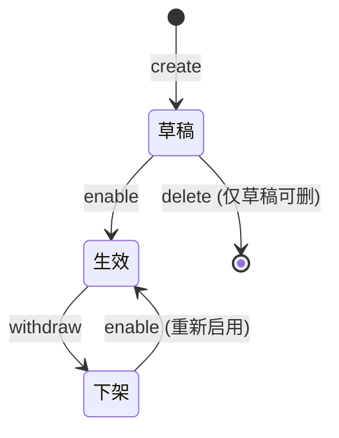

# AgentOps 平台 — 公共技术方案总览

| 文档版本 | 日期 | 编写人 | 说明 |
|---------|------|-------|------|
| V1.0 | 2026-06-13 | AgentOps Team | 公共技术方案初稿 |

> 本文档抽取 AgentOps 平台 8 个模块（空间 / 系统设置 / 模型 / Prompt / Skill / 工具 / 沙箱 / Agent）共有的基础设施、约定、common 能力。
> 各模块技术方案中不重复写公共部分，**只引用本文件相应章节**。

---

## 1. 设计前 10 问对齐结果（适用于全部模块）

| 序号 | 问题 | 决策 |
|-----|------|------|
| Q1 | 部署架构处理方式 | **不变** —— 全部新模块作为新 starter / 新 domain 包并入现有 server 单体；前端作为新路由并入现有 React 工程；无新增部署组件。 |
| Q2 | 文档粒度 | 8 份独立模块技术方案 + 1 份共性总览（本文件） |
| Q3 | 大字段存储 | 全部入 MySQL TEXT/MEDIUMTEXT/LONGTEXT；不接 OSS |
| Q4 | Agent 运行时 | **不在范围**；本批仅交付管理面（CRUD / 状态机 / 装配 / 版本） |
| Q5 | common 复用 | 复用现有用户模块的 facade.common（DomainEntity/Result/分页/异常）与 infra.common（事件发布/工具/Token） |
| Q6 | 敏感字段加密 | **AES-256-GCM 本地对称加密**；密钥由 system_settings 管理；密文格式 `enc:v1:<base64>` |
| Q7 | 领域事件 | **Spring `ApplicationEventPublisher`**，同进程同步发布（必要时 `@TransactionalEventListener`） |
| Q8 | 调度机制 | **Spring `@Scheduled` + Redis 锁**；多实例部署时仅获取锁的实例执行 |
| Q9 | Agent 装配快照 | agent_version 表新增 `assembly_snapshot` LONGTEXT JSON；同时落 agent_version_skill_ref / agent_version_tool_ref 子表用于反查 |
| Q10 | Skill 资源文件树存储 | **平面表 + path 字段**；`(skill_version_id, path)` 唯一；树形由应用层拼装 |

---

## 2. 技术栈（与项目 CLAUDE.md 一致）

| 层 | 技术选型 |
|----|---------|
| 前端 | React 18 + TypeScript + Vite + Zustand + React Router v6 + Ant Design |
| 后端 | Java 17 + Spring Boot 3.x（**注意**：项目实际使用 Java 21 + Lombok 兼容性预留显式 getter/setter） |
| 数据访问 | MyBatis-Plus + MySQL 8.x（统一使用 `LambdaQueryWrapper` / `LambdaUpdateWrapper`） |
| 缓存 | Redis 7.x（用于分布式锁、登录态） |
| 工具库 | Hutool（强制优先）、MapStruct、Jackson、Validation、Lombok |
| 包前缀 | **`com.agent.ops`**（与现有代码保持一致；不使用 CLAUDE.md 中的 `com.agentops`） |
| Bean 注入 | **统一 `@Resource`**；禁止构造器注入与 `@Autowired` |

---

## 3. 应用架构（全平台统一）

### 3.1 六层依赖方向（与项目一致）

```
adapter → application → domain ← infrastructure
                              ↓
client ← facade ← application
```

- **domain**：纯业务模型（零 Spring 依赖），仅 `cn.hutool.*` + JDK
- **infrastructure**：实现 domain 定义的 Repository / Factory / Gateway
- **application**：CommandService（写）+ QueryService（读），**禁止注入 Repository / Gateway**；查询走对应领域 QueryService
- **adapter**：HTTP Controller、`@Scheduled` Scheduler、`@EventListener` Listener
- **client**：DTO / VO / ParamDTO / 枚举常量
- **facade**：通用基类（`DomainEntity` / `Result` / `DomainEventDTO` / `DomainEventPublisher` / `PageResult` / `SpaceContext`）

### 3.2 部署架构

> 本批次方案的部署架构**不变**，无新增部署组件，复用现有部署架构：单 server JAR + 单 React Web。MySQL / Redis 复用既有云实例。

---

## 4. Facade 层共享设计（已存在的不重复，新增项列出）

> **本次新增项**

| 类型 | 类/接口 | 包路径 | 职责 | 是否新增 |
|------|---------|--------|------|---------|
| 接口 | `SpaceContext` | `com.agent.ops.facade.common.context` | 当前操作所在空间上下文（已存在） | 已有 |
| 类 | `PageResult<T>` | `com.agent.ops.facade.common.page` | 分页返回（已存在） | 已有 |
| 类 | `Result<T>` | `com.agent.ops.facade.common` | 统一返回（已存在） | 已有 |
| 抽象类 | `DomainEntity` | `com.agent.ops.facade.domain` | 已存在 | 已有 |
| 接口 | `DomainEventPublisher` | `com.agent.ops.facade.domain` | 已存在 | 已有 |
| 类 | `DomainEventDTO` | `com.agent.ops.facade.domain` | 已存在 | 已有 |
| 异常 | `BizException` | `com.agent.ops.facade.exception` | 业务异常基类（已存在） | 已有 |
| 类 | `BizCodeGenerator` | `com.agent.ops.facade.common.code` | **新增** —— 业务编码生成器：`generate(String prefix)` → `<PREFIX> + yyyyMMddHHmmssSSS + 4 位随机数` | 新增 |

**状态枚举命名约定（V1.3 修订）**：
- 全平台**禁止**使用通用命名 `ResourceStatus / LifecycleStatus / OnlineStatus`。
- 状态枚举类名格式：**`<领域名 或 领域名+Version> + Status`**，放在各领域 client 模块下 `com.agent.ops.client.<domain>.enums`
- 字段名：**统一为 `status`**（不允许 `agentStatus / lifecycleStatus / resourceStatus` 等带前缀）

| 枚举类 | 包 | 取值 | 用于 |
|--------|----|------|------|
| `SpaceStatus` | `client.space.enums` | ENABLED(1) | spaces 表 status |
| `UserStatus` | `client.user.enums` | （沿用现有用户模块） | users 表 status |
| `ModelStatus` | `client.model.enums` | DRAFT(0) / ENABLED(1) / DISABLED(2) | models 表 status |
| `PromptStatus` | `client.prompt.enums` | DRAFT(0) / ENABLED(1) / DISABLED(2) | prompts 表 status |
| `ToolStatus` | `client.tool.enums` | DRAFT(0) / EFFECTIVE(1) / WITHDRAWN(2) | tools 表 status |
| `SandboxStatus` | `client.sandbox.enums` | DRAFT(0) / INITIALIZING(1) / ONLINE(2) / OFFLINE(3) / DISABLED(4) | sandboxes 表 status |
| `SkillStatus` | `client.skill.enums` | DRAFT(0) / EFFECTIVE(1) / WITHDRAWN(2) | **skills 主体表 status（V1.3 新增）** |
| `SkillVersionStatus` | `client.skill.enums` | DRAFT(0) / EFFECTIVE(1) / WITHDRAWN(2) | skill_versions 表 status |
| `AgentStatus` | `client.agent.enums` | DRAFT(0) / EFFECTIVE(1) / WITHDRAWN(2) | **agents 主体表 status（V1.3 新增）** |
| `AgentVersionStatus` | `client.agent.enums` | DRAFT(0) / ONLINE(1) / OFFLINE(2) | agent_versions 表 status |

> 各模块技术方案直接引用以上类型；新增项实现 Skill 为 **impl-facade-module**。

---

## 5. infra.common 增量

| 类 | 包路径 | 职责 | 是否新增 |
|----|--------|------|---------|
| `CommonDomainEventPublisher` | `com.agent.ops.infra.common.event` | 已存在，封装 `ApplicationEventPublisher` | 已有 |
| `SecretEncryptor` | `com.agent.ops.infra.common.crypto` | **新增** —— AES-256-GCM 加解密；密钥从 `system_settings.platform_basic.encryption_key` 加载；提供 `encrypt(String)` / `decrypt(String)` / `mask(String)` | 新增 |
| `RedisDistributedLock` | `com.agent.ops.infra.common.lock` | **新增** —— 基于 Redisson 的分布式锁封装；统一锁 key 前缀 `agentops:lock:<domain>:<bizKey>` | 新增 |
| `BizCodeGeneratorImpl` | `com.agent.ops.infra.common.code` | **新增** —— 实现 `BizCodeGenerator`；时间用 `DateUtil.format(now, "yyyyMMddHHmmssSSS")`；4 位随机用 `RandomUtil.randomNumbers(4)` | 新增 |
| `SemverUtil` | `com.agent.ops.infra.common.util` | **新增** —— 校验/比较 SemVer 版本号；用于 Skill / Agent 版本号校验 | 新增 |

> 实现 Skill 为 **impl-infra-module**。

---

## 6. 数据库公共约定

### 6.1 主键与时间字段（强制）

```sql
-- 所有业务表通用列：
id           BIGINT       NOT NULL AUTO_INCREMENT PRIMARY KEY,
num          VARCHAR(32)  NOT NULL COMMENT '业务编码',
space_code   VARCHAR(32)  DEFAULT NULL COMMENT '所属空间业务编码，平台级表为 NULL',
create_no    VARCHAR(32)  NOT NULL COMMENT '创建人业务编码',
update_no    VARCHAR(32)  NOT NULL COMMENT '最后更新人业务编码',
create_time  DATETIME(3)  NOT NULL DEFAULT CURRENT_TIMESTAMP(3),
update_time  DATETIME(3)  NOT NULL DEFAULT CURRENT_TIMESTAMP(3) ON UPDATE CURRENT_TIMESTAMP(3),
is_deleted   TINYINT(1)   NOT NULL DEFAULT 0 COMMENT '软删除标记',
UNIQUE KEY uk_num (num),
KEY idx_space (space_code, is_deleted)
```

- **id 必为 `BIGINT AUTO_INCREMENT`**（仅作为数据库物理主键，**不对外暴露**）
- **`create_time` / `update_time` 必为 `DATETIME(3)` 毫秒精度**
- **`is_deleted` 仅在 infra Entity 与表中**，不进 domain 模型
- **`num` 为外部业务编码**，由 `BizCodeGenerator.generate(prefix)` 生成
- **`create_no` / `update_no` 为字符串**：存创建人/更新人的**用户业务编码**（user.num），类型 `VARCHAR(32)`（**V1.5 修订**：从 BIGINT 改为 VARCHAR(32)）
- **`space_code` 为字符串**：存所属空间的**业务编码**（spaces.num），类型 `VARCHAR(32)`（**V1.5 修订**：从 `space_id BIGINT` 改为 `space_code VARCHAR(32)`）
- 各模块前缀：`SP`（空间）/ `MD`（模型）/ `PR`（Prompt）/ `SK`（Skill）/ `SKV`（Skill 版本）/ `TL`（工具）/ `SB`（沙箱）/ `AG`（Agent）/ `AGV`（Agent 版本）

### 6.2 字符集与排序规则

```sql
ENGINE=InnoDB DEFAULT CHARSET=utf8mb4 COLLATE=utf8mb4_unicode_ci;
```

### 6.3 软删除

- 默认通过 `LambdaQueryWrapper.eq(Entity::getIsDeleted, 0)` 过滤（MyBatis-Plus 的 `@TableLogic` 在 RepositoryImpl 中启用）
- 软删除不改变唯一索引含义：`(space_id, num, is_deleted)` 形成业务唯一性

---

## 7. 加密能力 `SecretEncryptor`

### 7.1 算法与密钥

- 算法：**AES-256-GCM**（IV 12 字节随机，TAG 128 位）
- 密钥来源：`system_settings.platform_basic.encryption_key`（系统设置模块管理；启动时由 `SystemSettingsLoader` 加载到内存）
- 密文格式：`enc:v1:<base64(IV + ciphertext + tag)>`
- 脱敏格式：`<前 4 字符>****<后 4 字符>`，长度不足 8 位时全部 `****`

### 7.2 接口

```java
public interface SecretEncryptor {
    /** 加密明文，返回 enc:v1:base64 格式密文。 */
    String encrypt(String plaintext);
    /** 解密 enc:v1:* 格式密文；非该格式直接返回原值。 */
    String decrypt(String ciphertext);
    /** 脱敏展示。 */
    String mask(String plaintext);
    /** 判断是否已加密格式。 */
    boolean isEncrypted(String value);
}
```

---

## 8. 事件机制（Spring ApplicationEvent）

### 8.1 发布方

- domain 通过聚合根持有的 `DomainEventPublisher` 调用 `publish(DomainEventDTO)`
- infra 中 `CommonDomainEventPublisher` 是 `DomainEventPublisher` 实现，内部委托 `ApplicationEventPublisher.publishEvent(...)`

### 8.2 订阅方

- adapter 层使用 `@EventListener` 或 `@TransactionalEventListener(phase = AFTER_COMMIT)`
- 跨领域订阅在 application 层亦可（如 system_settings 模块订阅密钥变更事件刷新缓存）

### 8.3 事件命名约定

`<domain>.<aggregate>.<action>` 一律小写下划线分隔：
- `space.space.created` / `model.model.enabled` / `agent.agent_version.published` / `sandbox.sandbox.heartbeat_failed` 等

---

## 9. 分布式锁约定

- 锁 key：`agentops:lock:<domain>:<bizKey>`（如 `agentops:lock:agent:AG2026...`）
- 用于：所有 CommandService 写操作；按聚合 `num` 加锁
- 默认参数：`waitTime=3s` / `leaseTime=10s`（可注解级覆盖）
- **事务边界内嵌**：先获锁 → 开启事务 → 执行 → 提交事务 → 释放锁

---

## 10. 公共枚举与常量

### 10.1 状态枚举映射

> 详见 §4「状态枚举命名约定」表格。所有数据库列统一为 `status`（TINYINT(1)），所有 Java 字段统一为 `status`。枚举类名格式为 `<领域名|领域名+Version> + Status`。

| 模块 | 主体表枚举 | 版本表枚举（如有） |
|------|-----------|------------------|
| 模型 | `ModelStatus` | — |
| Prompt | `PromptStatus` | — |
| 工具 | `ToolStatus` | — |
| 沙箱 | `SandboxStatus` | — |
| Skill | `SkillStatus` | `SkillVersionStatus` |
| Agent | `AgentStatus` | `AgentVersionStatus` |

### 10.1.1 主体三态状态机标准模板（V1.3 新增，适用于 Agent / Skill 主体）

含强制多版本管理的资源（Agent / Skill），其**主体**也遵循以下三态状态机：



| 主体状态 | 含义 | 可被引用？ |
|---------|------|-----------|
| 草稿 (DRAFT) | 主体已创建但未启用 | ❌ 不可被外部引用（即使有版本=生效） |
| 生效 (EFFECTIVE) | 主体已启用 | ✅ 可被外部引用，但**前提是至少有一个版本=生效（Skill）/ 在线（Agent）** |
| 下架 (WITHDRAWN) | 主体被人工下架 | ❌ 不可被外部引用，无论版本状态 |

**主体三个领域动作（仅状态变化，符合 §11.5）**：

| 动作 | 入参 | 前置 | 后置 | 事件 |
|------|------|------|------|------|
| `enable(operatorId)` | — | status ∈ {DRAFT, WITHDRAWN} | status = EFFECTIVE | `<domain>.<aggregate>.enabled` |
| `withdraw(operatorId)` | — | status = EFFECTIVE | status = WITHDRAWN | `<domain>.<aggregate>.withdrawn` |
| `delete(operatorId)` | — | status = DRAFT | is_deleted=1 | `<domain>.<aggregate>.deleted` |
| `save(operatorId)` | — | — | 新建 status 默认 DRAFT；持久化 | 新建时 `<domain>.<aggregate>.created` |

**资源选入与运行时校验逻辑（应用层 QueryService 实现）**：

```
"资源可被引用" = 主体.status = EFFECTIVE
              AND ( 该资源至少有一个版本.status = EFFECTIVE/ONLINE )
              AND is_deleted = 0
```

各 QueryService 提供的"对外可用列表"方法（如 `SkillQueryService.getEffectiveListForReference(spaceId)` / `AgentQueryService.getEffectiveListForReference(spaceId)`）必须按此组合条件过滤。

### 10.1.2 业务编码前缀

集中在 `com.agent.ops.facade.common.code.BizCodePrefix` 枚举中：

```java
public enum BizCodePrefix {
    SPACE("SP"), USER("US"), MODEL("MD"), PROMPT("PR"),
    SKILL("SK"), SKILL_VERSION("SKV"), TOOL("TL"),
    SANDBOX("SB"), AGENT("AG"), AGENT_VERSION("AGV");
    // ...
}
```

---

## 10.2 跨领域引用强制约束（V1.5 新增）

**规则**：所有领域对象之间的引用、所有审计字段（创建人/更新人）、以及所有数据库表中的"指向其他业务对象"的列，**一律使用对方的业务编码（num，String 类型）**，**禁止使用数据库主键 id（Long 类型）**。

### 10.2.1 适用范围

| 引用类型 | 字段命名 | 类型 | 示例 |
|---------|---------|------|------|
| 跨领域引用（指向其他领域聚合根） | `<对方领域>Code` | `String` | `Space.ownerUserCode`、`AgentVersion.modelCode`、`Tool.spaceCode` |
| 跨领域引用列表 | `<对方领域>Codes` | `List<String>` | `Space.adminUserCodes`、`AgentVersion.skillCodes` |
| **双聚合根之间引用**（如 Skill 与 SkillVersion）| `<父聚合>Code` | `String` | `SkillVersion.skillCode`、`AgentVersion.agentCode` |
| 审计字段（DomainEntity 基类） | `createNo` / `updateNo` | `String` | 见公共 §3 / §6 |
| 操作人（如 AuditLog） | `operatorCode` | `String` | `AuditLog.operatorCode` |

### 10.2.2 数据库映射

| 之前 | 之后 |
|------|------|
| `space_id BIGINT` | `space_code VARCHAR(32)` |
| `owner_user_id BIGINT` | `owner_user_code VARCHAR(32)` |
| `admin_user_ids JSON`（存 Long 数组） | `admin_user_codes JSON`（存 String 数组） |
| `skill_id BIGINT` | `skill_code VARCHAR(32)` |
| `agent_id BIGINT` | `agent_code VARCHAR(32)` |
| `agent_version_id BIGINT`（在 ref 子表） | `agent_version_code VARCHAR(32)` |
| `operator_id BIGINT` | `operator_code VARCHAR(32)` |
| `create_no BIGINT` / `update_no BIGINT` | `create_no VARCHAR(32)` / `update_no VARCHAR(32)` |

### 10.2.3 仅以下场景才使用 `Long id`

- 数据库表的物理主键列：`id BIGINT AUTO_INCREMENT PRIMARY KEY`
- infra Entity 类的 `id` 字段（与物理列对应）
- domain `DomainEntity.id`（继承得到，但**不参与跨领域引用**；外部一律用 `num`）

### 10.2.4 应用层 Service 入参 / 跨领域 QueryService 调用

- ParamDTO 入参一律用对方 `*Code`：如 `ChangeMemberRoleParam { spaceCode, userCode, roleType }`
- QueryService 方法签名一律用 `*Code`：
  - `UserQueryService.getByCode(userCode)` ✅
  - ❌ ~~`UserQueryService.getById(userId)`~~（不允许跨领域用 ID）
- 应用层在拿到对方 DTO 后，需要的就是对方的 `num`（业务编码），不需要也不持有对方的 `id`

### 10.2.5 操作人（operatorCode）传递

聚合根方法签名统一为：

```java
public void enable(String operatorCode);   // V1.5 修订：之前是 Long operatorId
public void save(String operatorCode);
public void delete(String operatorCode);
```

`DomainEntity.initialize(String operatorCode)` 也相应改为接收 String。

应用层从 `SpaceContext` 取当前用户业务编码（不再取 userId）：

```java
@Resource
private SpaceContext spaceContext;
String operatorCode = spaceContext.getCurrentUserCode();  // 返回 String
```

### 10.2.6 例外（聚合内引用）

聚合根**内部**的子实体（如 Skill 聚合内的 SkillResourceFile）持有父实体引用时，**仍可以使用 `Long id`**——前提是确实是同一聚合内、同一事务内、不会暴露到外部。但本平台已把 Skill/Agent 的主体与版本设计为**双聚合根**，所以跨聚合的版本字段必须用 Code（不属于此例外）。

> 本节为全平台**强制约束**。所有 8 个模块的领域模型、Repository 接口、ParamDTO、HTTP 接口入参出参、数据库表均须满足。

---
## 11. 前端公共约定

| 项 | 约定 |
|----|------|
| 路由 | `/spaces/:spaceCode/<resource>`（空间内）/ `/users` `/system-settings`（平台级） |
| API 客户端 | Axios 实例 `src/api/http.ts`，统一处理 token / 401 / Result 拆包 |
| 状态 | Zustand store 按领域：`agentStore` / `modelStore` / `skillStore` 等 |
| 国际化 | `src/locales/zh-CN.json` / `en-US.json` |
| 表单 | Ant Design `Form`，规则表统一在 `src/utils/validators.ts` |
| 表格 | `ProTable`（Ant Design Pro），分页 20 条/页 |

---

## 11.5 领域动作精简原则（强制，全平台统一）

**规则**：聚合根/实体上**只保留两类领域动作**：

1. **状态变化**类：使用业务语义的状态切换方法（如 `enable / disable / publish / withdraw / online / offline / submit / markOnline / markOffline / republish` 等）。每个方法内部仅做：状态前置校验 → 状态切换 → 调用 `save(operatorId)` → 发布状态事件。
2. **删除**类：`delete(operatorId)` —— 软删 + 发布删除事件。

**不属于上述两类的字段修改**（rename / updateDescription / updateConfig / editContent / editAssembly / updateBasic / refreshCurrentVersion 等）**禁止**单独定义为领域动作。统一改为：

```
application 层流程：
  factory.createByNum(num) → 拿到聚合根
  → 直接通过 setter 修改字段（聚合根 @Setter 暴露字段写入）
  → save(operatorId)  // save 内部做 validate / initialize / publish 创建事件
```

**应用层能力（非领域动作）**：周期探活、试运行/测试调用、发测试邮件、装配预检、变量解析、frontmatter 解析等都属于**应用层或网关层能力**，不在聚合根上暴露方法。

**聚合根 `save(operatorId)` 职责**：
- 执行 `validate()` + `domainValidate()` 业务不变式校验
- 执行 `initialize(operatorId)` 刷新审计字段
- 通过 `repository.save(this)` 持久化
- 仅在新建时（`id == null`）发布 `<domain>.<aggregate>.created` 事件；后续更新不发额外事件

**类图与表格表达**：聚合根上不再画 `rename(...)` / `updateConfig(...)` 等非状态方法；类图仅展示属性 + 状态动作 + delete + save。

> 本节为全平台**强制约束**。各模块技术方案在 §4 领域层 / §6 应用层中均按本规则编写。

---

## 11.6 领域网关使用约束（强制，全平台统一）

**规则**：领域网关（Gateway）**只为领域模型服务**，由领域层接口定义、infra 层实现。Gateway 只承载下列能力：

✅ **允许在 Gateway 中定义的方法**：
1. **本领域业务编码生成**：`generateXxxCode()` —— 由聚合根 save 时调用
2. **本领域字段加密/解密**：如 `ModelGateway.encrypt(apiKey)` / `ToolGateway.encryptSensitiveFields(json)` —— 由聚合根 save 时在 `domainValidate` 内调用
3. **本领域 save 时的格式校验/解析**：如 `PromptGateway.extractVariables(content)` / `ToolGateway.validateConfig(...)` / `SkillGateway.parseFrontmatter(skillMd)` —— 由聚合根 save 时在 `domainValidate` 内调用

❌ **禁止在 Gateway 中定义的方法**：
1. **加载跨领域数据组合给前端**：如 `loadModel / getEnabledModels / getEffectiveSkills` —— 这是应用层职责
2. **加载跨领域数据用于校验装配**：如 `validateAssembly`（需要查模型/Skill/工具/沙箱状态）—— 这是应用层职责
3. **触发外部基础设施动作**：如 `probe(url)` HTTP 探活 / `sendMail(...)` 邮件发送 / `invokeTest(...)` 工具试运行 —— 这是应用层基础设施客户端职责
4. **脱敏展示**：如 `mask(apiKey)` —— 这是应用层 QueryService 的展示职责

**应用层禁止使用领域网关。**应用层需要这些能力时，按以下方式获取：

| 应用层需求 | 解决方式 |
|-----------|---------|
| 跨领域取数据（如 Agent 装配预检要查 Model 是否启用） | 应用层 `@Resource` 注入对方领域的 **QueryService**（如 `ModelQueryService.getByNum`），在主领域的应用层方法里组装结果 |
| 跨领域取列表（如 Agent 选入对话框要列出空间内启用模型） | 同上：调对方 `QueryService.getEnabledList(spaceId)` |
| 调用外部 HTTP/SMTP/进程（探活/发邮件/试运行） | 在 application 包内定义客户端接口（如 `SandboxProbeClient` / `SmtpMailClient` / `ToolTestClient`），由 infra 实现并暴露为 Spring Bean，应用层 `@Resource` 注入 |
| 脱敏展示 | 应用层 QueryService 内联实现（用公共 `SecretEncryptor.mask(...)` 工具方法），或 client 层 `MaskingUtil` |

**禁止反例**（任一出现都视为违规）：
```java
// ❌ 错误：应用层注入领域网关
@Resource
private AgentGateway agentGateway;

@Resource
private SandboxGateway sandboxGateway;
```

**正确范式**：
```java
// ✅ 正确：应用层注入对方领域的 QueryService 与 application 层客户端
@Resource
private ModelQueryService modelQueryService;
@Resource
private SkillVersionQueryService skillVersionQueryService;
@Resource
private SandboxProbeClient sandboxProbeClient;  // application 层接口
```

**领域校验中的跨领域引用**：当聚合根的 `domainValidate` 需要"对方资源仍处于可用状态"才能放行（如 Agent 发布前要求模型仍启用）时，**应用层在调用 `aggregate.publish/save` 之前**先用对方 QueryService 完成校验；领域内部仅校验本聚合的不变量（字段格式、引用列表 size、状态前置），不直接发起跨领域查询。

> 本节为全平台**强制约束**。所有 8 个模块的 Gateway 接口与应用层 Service 实现均须满足。

---

## 12. 实现顺序（跨模块）

```
phase-0: 公共能力 (本文件覆盖)
   facade 增量（枚举 / BizCodeGenerator）
   infra.common 增量（SecretEncryptor / RedisDistributedLock / BizCodeGeneratorImpl）
   ↓
phase-1: 平台级模块（无依赖或仅依赖 user）
   space → system_settings
   ↓
phase-2: 空间内独立资源（依赖 space）
   model / prompt / sandbox / tool
   ↓
phase-3: 含版本管理的资源
   skill
   ↓
phase-4: 装配模块（依赖以上全部）
   agent
```

---

## 13. 代码分支

公共部分单独一条分支：
```
feature-20260613-agentops-common
```

各模块分支见各自方案。

---

> **后续 8 份模块技术方案均默认遵循本文件**：包路径 / common 复用 / 加密策略 / 事件机制 / 锁约定 / 数据库通用列 / 实现顺序。
