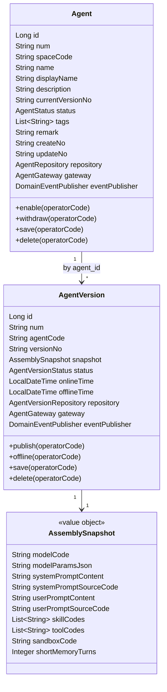
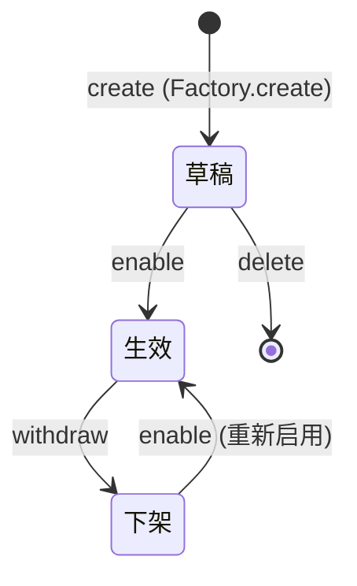
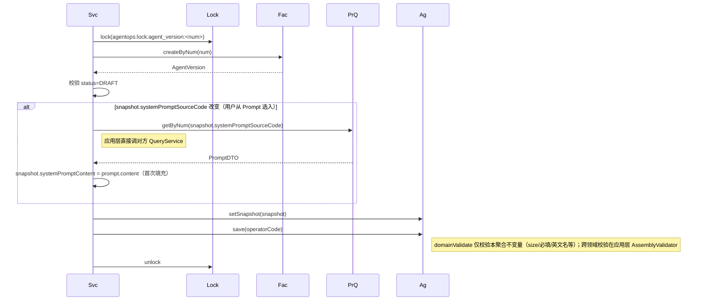
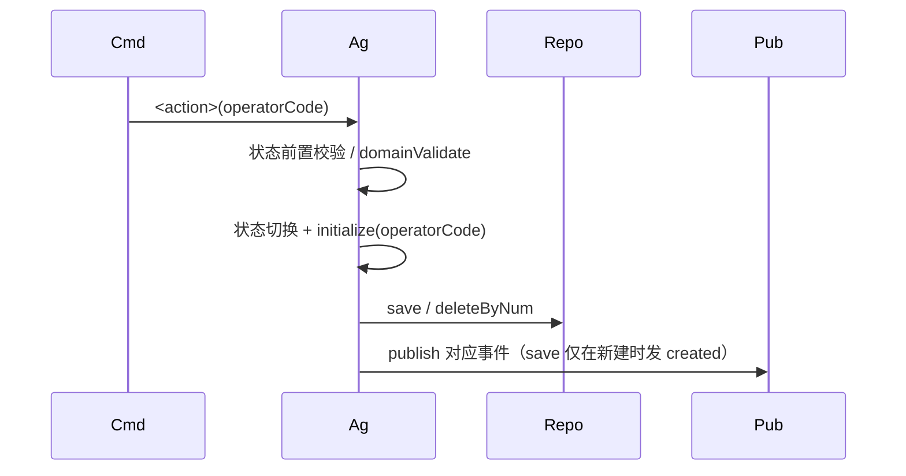
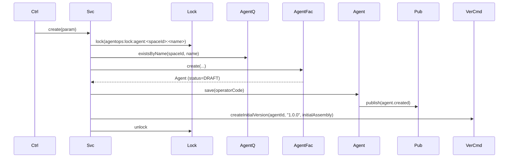
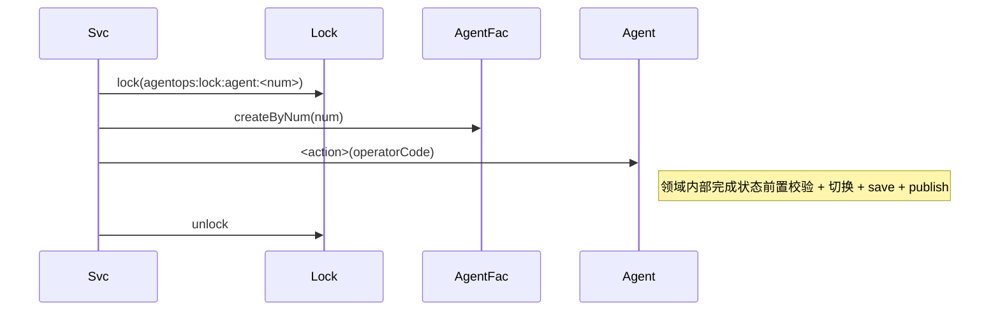
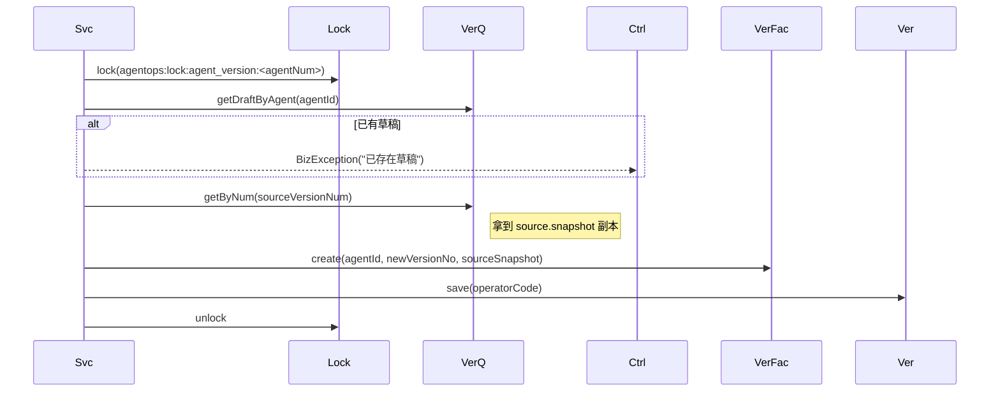
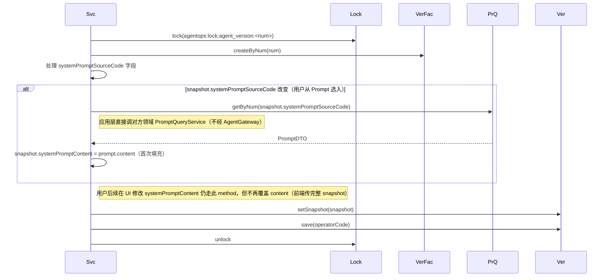
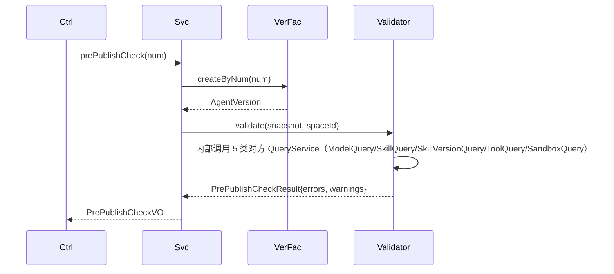
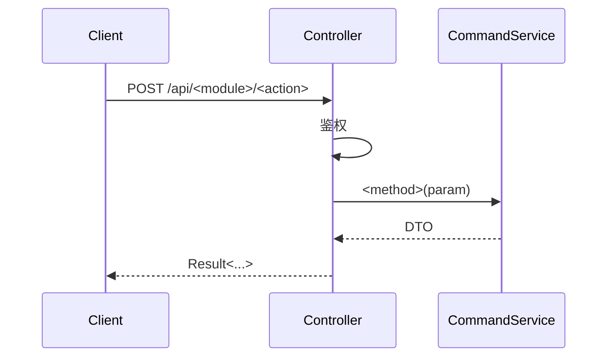

# AgentOps 平台 — Agent 管理技术方案

| 文档版本 | 日期 | 编写人 | 说明 |
|---------|------|-------|------|
| V1.0 | 2026-06-13 | AgentOps Team | Agent 管理技术方案初稿 |
| V1.1 | 2026-06-13 | AgentOps Team | 按"领域动作精简原则"修订（公共方案 §11.5）：移除 updateBasic/refreshCurrentVersion/editAssembly 领域方法；装配预检 prePublishCheck 改为应用层能力；改字段改为 setter + save |
| V1.2 | 2026-06-13 | AgentOps Team | 按"领域网关使用约束"修订（公共方案 §11.6）：彻底重构 AgentGateway —— 移除全部跨领域 QueryService 调用方法（loadModel/loadPromptContent/validateAssembly/getEnabledModels 等）；这些跨领域查询改为应用层直接 @Resource 注入对方领域 QueryService；AgentGateway 仅保留生成业务编码 |
| V1.3 | 2026-06-13 | AgentOps Team | （1）**Agent 主体新增 status（DRAFT/EFFECTIVE/WITHDRAWN）+ enable/withdraw/delete 三个领域动作**：创建后默认草稿，需手动 enable 才可被运行时调用；下架后可重新 enable 为生效；（2）状态枚举命名规范化：`OnlineStatus` → 主体 `AgentStatus`（DRAFT/EFFECTIVE/WITHDRAWN）+ 版本 `AgentVersionStatus`（DRAFT/ONLINE/OFFLINE），放在 `client.agent.enums` 包下 |
| V1.5 | 2026-06-13 | AgentOps Team | 跨领域引用统一为业务编码（公共方案 §10.2）：spaceId Long → spaceCode String；AgentVersion.agentId Long → agentCode String（双聚合根之间引用按 num）；agent_version_*_refs 子表 agent_version_id BIGINT → agent_version_code VARCHAR(32)；createNo/updateNo/operatorId Long→String；DDL 列类型相应改为 VARCHAR(32) |

> 配套 PRD：`doc/产品方案/2026-06-13_Agent管理-PRD.md`
> 公共约定：`doc/技术方案/2026-06-13_AgentOps公共技术方案.md`
> 上游依赖：space / model / prompt / skill / tool / sandbox 全部技术方案

---

## 1. 目标与范围

空间内 Agent 装配 + 全生命周期管理 + 强制多版本：
- 名称英文唯一不可改（运行时引用键）
- 选入模型/Prompt/Skill/工具/沙箱（提示词以**内容副本**方式存入；其他按业务编码强引用）
- 每次修改派生新草稿；同时最多一个草稿
- 发布顶替；发布前装配预检
- 装配快照独立 JSON 字段存储（**问题 9 决策**），同时落子表用于反查

### 1.1 设计前问题对齐

继承公共方案 §1。本模块特有：
- agent_version 表新增 `assembly_snapshot` LONGTEXT JSON
- 同步落 `agent_version_skill_ref` / `agent_version_tool_ref` 子表用于反查"哪些 Agent 引用了 Skill X"
- 提示词内容（system_prompt / user_prompt）从 Prompt 模块**复制**到 agent_version 字段

---

## 2. 架构设计

### 2.1 应用架构

| 层 | 领域 | 包 | 职责 |
|----|------|-----|------|
| client | agent | `com.agent.ops.client.agent.dto` | `AgentDTO` / `AgentVersionDTO` / `AssemblySnapshotDTO` |
| client | agent | `com.agent.ops.client.agent.param` | `CreateAgentParam` / `UpdateAgentBasicParam` / `DeriveVersionParam` / `EditVersionParam` / `PublishVersionParam` |
| client | agent | `com.agent.ops.client.agent.vo` | `AgentVO` / `AgentVersionVO` / `AssemblyVO` / `PrePublishCheckVO` |
| client | agent | `com.agent.ops.client.agent.enums` | **`AgentStatus`（DRAFT/EFFECTIVE/WITHDRAWN，主体用）+ `AgentVersionStatus`（DRAFT/ONLINE/OFFLINE，版本用）** |
| domain | agent | `com.agent.ops.domain.agent` | `Agent`（聚合根） / `AgentVersion`（独立聚合根） |
| domain | agent | `com.agent.ops.domain.agent.valueobject` | `AssemblySnapshot`（不可变 VO，含模型/参数/提示词副本/Skill 编码列表/工具编码列表/沙箱编码/记忆轮数） |
| domain | agent | `com.agent.ops.domain.agent.repository` | `AgentRepository` / `AgentVersionRepository` |
| domain | agent | `com.agent.ops.domain.agent.factory` | `AgentFactory` / `AgentVersionFactory` |
| domain | agent | `com.agent.ops.domain.agent.gateway` | `AgentGateway`（**仅** generateAgentCode / generateVersionCode；不含跨领域查询） |
| domain | agent | `com.agent.ops.domain.agent.event` | `AgentEventConstant` |
| infra | agent | `com.agent.ops.infra.agent.entity` | `AgentEntity` / `AgentVersionEntity` / `AgentVersionSkillRefEntity` / `AgentVersionToolRefEntity` |
| infra | agent | `com.agent.ops.infra.agent.mapper` | 4 个 Mapper |
| infra | agent | `com.agent.ops.infra.agent.repository` | `AgentRepositoryImpl` / `AgentVersionRepositoryImpl`（写主表 + 子表事务） |
| infra | agent | `com.agent.ops.infra.agent.factory` | `AgentFactoryImpl` / `AgentVersionFactoryImpl` |
| infra | agent | `com.agent.ops.infra.agent.gateway` | `AgentGatewayImpl`（仅委托 BizCodeGenerator） |
| application | agent | `com.agent.ops.application.agent.assembler` | `AssemblyValidator`（应用层装配预检器，注入 5 类对方 QueryService 完成预检） |
| application | agent | `com.agent.ops.application.agent.command` | `AgentCommandService` / `AgentVersionCommandService` |
| application | agent | `com.agent.ops.application.agent.query` | `AgentQueryService` / `AgentVersionQueryService` |
| application | agent | `com.agent.ops.application.agent.listener` | `AgentVersionPublishedListener`（订阅 `agent.agent_version.published` 刷新主体当前版本号） |
| adapter | agent | `com.agent.ops.adapter.agent.controller` | `AgentCommandController` / `AgentQueryController` / `AgentVersionCommandController` / `AgentVersionQueryController` |

#### 模块调用关系（关键 V1.2）

- **跨领域查询统一在应用层**：Agent 模块**只能在 application 层** `@Resource` 注入其他领域的 QueryService（不允许在 domain 层通过 Gateway 转调）：
  - `ModelQueryService.getEnabledList(spaceId)` / `getByNum(num)` —— 模型选入对话框 / 装配预检
  - `PromptQueryService.getEnabledList(spaceId)` / `getByNum(num)` —— Prompt 选入对话框 / 选入时取内容副本
  - `SkillQueryService.getEffectiveListForReference(spaceId)` —— Skill 选入对话框
  - `SkillVersionQueryService.getEffectiveBySkill(skillId)` —— 装配预检校验 Skill 仍有生效版本
  - `ToolQueryService.getEffectiveList(spaceId)` / `getByNum(num)` —— 工具选入对话框 / 装配预检
  - `SandboxQueryService.getAvailableList(spaceId)` / `getByNum(num)` —— 沙箱选入对话框 / 装配预检

> **彻底禁止**：domain.agent 包内 `AgentGateway` 不含任何跨领域查询方法；infra.agent.gateway 包不注入对方 QueryService。这与 V1.1 的设计完全反向：原来由 Gateway 封装的跨领域调用，全部上移到 application 层 `AssemblyValidator` + Command/Query Service 内。

### 2.2 部署架构

部署架构不变。

---

## 3. Facade 层设计

本次无 Facade 层变更。状态枚举 `AgentStatus` / `AgentVersionStatus` 放在 `client.agent.enums` 包下。

---

## 4. 领域层设计

### 4.1 业务层级划分

| 层级 | 领域 | 说明 |
|------|------|------|
| 空间内 | agent | Agent 主体 + 版本（双聚合根） |

### 4.2 Agent（agent）

#### 4.2.1 领域模型

> 按公共方案 §11.5：类图仅展示属性 + 状态动作（enable/withdraw 主体；publish/offline 版本）+ delete + save。改字段（updateBasic/refreshCurrentVersion/editAssembly）由应用层 setter + save 完成；装配预检（prePublishCheck）是应用层能力。
>
> **V1.3 主体新增 status 三态状态机**（公共方案 §10.1.1）：草稿（创建后默认）→ 生效（enable）→ 下架（withdraw）；下架可重新 enable 为生效。



#### 4.2.1.1 Agent 主体状态机（V1.3 新增）



| 主体状态 | 含义 | Agent 是否可被运行时调用 |
|---------|------|-----------|
| 草稿 (DRAFT) | 主体已创建但未启用 | ❌ |
| 生效 (EFFECTIVE) | 主体已启用 | ✅ 前提是至少有一个版本 status=ONLINE |
| 下架 (WITHDRAWN) | 主体被人工下架 | ❌ 无论版本状态如何 |

| 对象 | 类型 | 关键属性 |
|------|------|---------|
| Agent | 聚合根 | name（英文，不可改）/ displayName（可改）/ currentVersionNo |
| AgentVersion | 独立聚合根 | versionNo / status / snapshot |
| AssemblySnapshot | 值对象 | 不可变；toMap/fromJson 转换 |

#### 4.2.2 领域动作

仅保留状态/删除/save 三类（公共方案 §11.5）。改基本信息/刷新当前版本号/编辑装配 由应用层 setter + save 完成；装配预检 `prePublishCheck` 是**应用层能力**（在调用 `publish` 之前由应用层主动校验）。

##### Agent（主体三态状态机，V1.3 新增）

| 动作 | 类型 | 职责 | 前置 | 事件 |
|------|------|------|------|------|
| `enable(operatorCode)` | 状态 | 启用主体（草稿→生效 或 下架→生效） | status ∈ {DRAFT, WITHDRAWN} | `agent.agent.enabled` |
| `withdraw(operatorCode)` | 状态 | 主体下架 | status = EFFECTIVE | `agent.agent.withdrawn` |
| `delete(operatorCode)` | 删除 | 软删 | status = DRAFT 且无任何 ONLINE 版本 | `agent.agent.deleted` |
| `save(operatorCode)` | 持久化 | validate + initialize；新建时 status 默认 DRAFT；domainValidate 校验 name 正则、空间唯一、name 不可改 | — | 新建时 `agent.agent.created`；更新且 currentVersionNo 变化时 `agent.agent.current_version_refreshed`（订阅器：审计） |

##### AgentVersion

| 动作 | 类型 | 职责 | 前置 | 事件 |
|------|------|------|------|------|
| `publish(operatorCode)` | 状态 | 草稿→在线；同时把同 Agent 已有 ONLINE 版本切换为 OFFLINE | status=DRAFT；版本号在 Agent 内唯一；**应用层已完成 prePublishCheck 且无 errors** | `agent.agent_version.published` |
| `offline(operatorCode)` | 状态 | 在线→离线 | status=ONLINE | `agent.agent_version.offlined` |
| `delete(operatorCode)` | 删除 | 软删 | status=DRAFT | `agent.agent_version.deleted` |
| `save(operatorCode)` | 持久化 | validate + initialize；domainValidate 校验 size 限制（Skill ≤50 / Tool ≤50 / 记忆 0~50）、systemPromptContent 必填非空、跨领域引用同空间约束 | — | 新建时 `agent.agent_version.created` |

> **prePublishCheck 不是领域动作**：应用层 `AgentVersionCommandService.prePublishCheck(num)` 调用 application 层 `AssemblyValidator.validate(snapshot, spaceId)`（内部 @Resource 注入 5 类对方 QueryService）收集 errors/warnings 返回前端；publish 之前应用层会再次执行 validate 并阻断 errors 非空场景。

##### 时序：`AgentVersion.publish(operatorCode)`（核心）

```mermaid
sequenceDiagram
    participant Cmd as AgentVersionCommandService
    participant Validator as AssemblyValidator (application)
    participant MdQ as ModelQueryService
    participant SkQ as SkillQueryService
    participant SvQ as SkillVersionQueryService
    participant TlQ as ToolQueryService
    participant SbQ as SandboxQueryService
    participant Ag as AgentVersion (待发布)
    participant Repo as AgentVersionRepository
    participant Pub as DomainEventPublisher

    Note left of Cmd: 应用层在调用前已执行 prePublishCheck，errors 非空将阻断
    Cmd->>Validator: validate(snapshot, spaceId)（再次校验）
    Validator->>MdQ: getByNum(modelCode) → status=ENABLED?
    Validator->>SkQ: getByNum(skillCode) for each → 必须存在
    Validator->>SvQ: getEffectiveBySkill(skillId) → 至少一个生效版本
    Validator->>TlQ: getByNum(toolCode) for each → status=EFFECTIVE
    Validator->>SbQ: getByNum(sandboxCode) → status ≠ DISABLED 且 ≠ DRAFT
    Validator-->>Cmd: errors[]/warnings[]
    alt errors 非空
        Cmd-->>Cmd: throw BizException
    end
    Cmd->>Ag: publish(operatorCode)
    Ag->>Ag: 校验 status=DRAFT；版本号唯一
    Ag->>Repo: findOnlineByAgentId(agentId)
    Repo-->>Ag: 旧 ONLINE 版本（可能为空）
    alt 存在旧 ONLINE
        Ag->>Ag: 旧版本 status=OFFLINE; offlineTime=now
    end
    Ag->>Ag: this.status=ONLINE; onlineTime=now
    Ag->>Repo: save(this) + 旧版本 + ref 子表（在同一事务）
    Ag->>Pub: publish(agent.agent_version.published)
    Note right of Pub: Listener 通过 setter + save 刷新 Agent 主体 currentVersionNo
```

##### 时序：`AgentVersion` 编辑装配（应用层 setter + save）



##### 时序：`AgentVersion.offline / delete / save`（统一模板）



#### 4.2.3 领域规则

| 对象 | 规则 | 描述 | 违反 |
|------|------|------|------|
| Agent | 唯一性 | (space_id, name, is_deleted) 唯一 | `BizException` |
| Agent | 命名 | name 须 `^[A-Za-z_][A-Za-z0-9_-]{0,63}$` | `BizException` |
| Agent | 不可改 | name 保存后不可修改 | `BizException` |
| AgentVersion | 唯一性 | (agent_id, version_no, is_deleted) 唯一 | `BizException` |
| AgentVersion | 草稿唯一 | 同 Agent 同时最多一个 DRAFT | `BizException` |
| AgentVersion | 在线唯一 | 同 Agent 同时最多一个 ONLINE | `BizException` |
| AgentVersion | 装配 | systemPromptContent 必填且 ≤ 10000；userPromptContent 选填 ≤ 10000 | `BizException` |
| AgentVersion | 装配 | skillCodes ≤ 50；toolCodes ≤ 50；shortMemoryTurns ∈ [0,50] | `BizException` |
| AgentVersion | 跨领域 | 引用的资源必须属于同 spaceId | `BizException` |

#### 4.2.4 领域工厂

| Factory | 方法 | 入参 | 返回 | 职责 |
|---------|------|------|------|------|
| `AgentFactory` | `create(spaceId, name, displayName, description, tags, remark)` | 用户填写字段 | `Agent` | 生成 num（AG）；校验 name 正则 |
| `AgentFactory` | `createByNum(num)` | num | `Agent` | — |
| `AgentVersionFactory` | `create(agentId, versionNo, snapshot)` | 用户填写字段 | `AgentVersion` | 生成 num（AGV）；status=DRAFT |
| `AgentVersionFactory` | `createByNum(num)` | num | `AgentVersion` | — |

#### 4.2.5 领域网关

仅保留本领域业务编码生成（公共方案 §11.6）。跨领域查询能力**全部下沉到应用层**，由 `AssemblyValidator` + Command/Query Service 直接调用对方领域的 QueryService 完成。

| Gateway | 方法 | 入参 | 返回 | 职责 |
|---------|------|------|------|------|
| `AgentGateway` | `generateAgentCode()` | — | String | BizCodeGenerator(`AG`) |
| `AgentGateway` | `generateVersionCode()` | — | String | BizCodeGenerator(`AGV`) |

> ❌ **不再设计**（全部移除）：`loadModel / loadPromptContent / validateAssembly / getEnabledModels / getEnabledPrompts / getEffectiveSkills / getEffectiveTools / getAvailableSandboxes`。
>
> 原因：这些方法**全部都是为应用层组装数据/校验装配服务**，不是"为领域模型服务"——按公共方案 §11.6 严格禁止。改造方案：
>
> 1. **装配预检**：在 application 层新增 `AssemblyValidator`（`com.agent.ops.application.agent.assembler`），作为 application 层组件（@Service），内部 @Resource 注入 5 类对方 QueryService，对外提供 `validate(snapshot, spaceId): PrePublishCheckResult` 方法。
> 2. **选入对话框列表**：`AgentVersionQueryService` 内直接提供"汇总型查询"如 `listAvailableModels(spaceId)`（内部委托 `ModelQueryService.getEnabledList`）；或 Controller 直接面向各模块自己的 list 接口（前端原本就走 `/api/models/list-enabled` 等独立接口）—— **本方案选用后者**：前端选入对话框直接调对应模块的 list 接口，不需要 Agent 模块代理。
> 3. **选入提示词时取内容副本**：`AgentVersionCommandService.editAssembly` 直接 `@Resource PromptQueryService` 调 `getByNum` 拿 content。

#### 4.2.5.1 跨领域 DTO 命名调整

原方案在 `domain.agent.gateway.info` 包下定义了 `ModelInfo / PromptInfo / SkillInfo / ToolInfo / SandboxInfo`。本次修订下：
- ❌ 删除 `domain.agent.gateway.info` 包（domain 层不应感知跨领域 DTO）
- ✅ 应用层直接复用对方领域 client 模块的 DTO（`ModelDTO` / `PromptDTO` / `SkillDTO` / `ToolDTO` / `SandboxDTO`）。
- ✅ 装配预检结果 `PrePublishCheckResult` 放在 `com.agent.ops.application.agent.assembler` 包下，仅供 application 层使用。

#### 4.2.6 领域事件

| 事件 | 触发 | 载荷 | 订阅方 |
|------|------|------|--------|
| `agent.agent.created/deleted` | 主体创建/删除 | agentNum/spaceNum | 审计 |
| `agent.agent_version.published` | 版本发布 | agentNum/versionNum/versionNo/skillCodes/toolCodes | `AgentVersionPublishedListener`（刷新 Agent 主体当前版本号 + 写 agent_version_skill_ref/tool_ref 子表） |
| `agent.agent_version.offlined` | 版本下线 | agentNum/versionNum | 审计 |
| `agent.agent_version.deleted` | 草稿版本删除 | agentNum/versionNum | 审计 |

✅ 自检通过。

---

## 5. 基础设施层设计

| 类型 | 类名 | 包 | 是否新增 |
|------|------|-----|---------|
| Entity | `AgentEntity` / `AgentVersionEntity` / `AgentVersionSkillRefEntity` / `AgentVersionToolRefEntity` | — | 新增 |
| Mapper | 四个 Mapper | — | 新增 |
| RepositoryImpl | `AgentRepositoryImpl` / `AgentVersionRepositoryImpl` | — | 新增 |
| FactoryImpl | `AgentFactoryImpl` / `AgentVersionFactoryImpl` | — | 新增 |
| GatewayImpl | `AgentGatewayImpl` | 仅委托 BizCodeGenerator 生成 AG/AGV；**不注入任何对方领域的 QueryService** | 新增 |

> `AgentVersionRepositoryImpl.save(AgentVersion)` 内事务处理：
> 1. UPSERT agent_version 主表（snapshot 序列化为 JSON）
> 2. DELETE FROM agent_version_skill_ref WHERE agent_version_id=?
> 3. INSERT INTO agent_version_skill_ref ... 按 snapshot.skillCodes
> 4. 同理处理 agent_version_tool_ref

✅ **基础设施层自检**通过：infra.agent.gateway 不依赖其他领域 QueryService；跨领域逻辑全在 application 层。

---

## 6. 应用层设计

### 6.1 业务模块划分

| 模块 | 内容 |
|------|------|
| 6.2 Agent 主体 | 创建/改基本信息/删除 |
| 6.3 Agent 版本 | 派生草稿/编辑装配/发布/下线/删除 |
| 6.4 跨领域 Listener | 版本发布后刷新主体 |

### 6.2 Agent 主体

| Service | 方法 | 入参 | 返回 | 备注 |
|---------|------|------|------|------|
| `AgentCommandService` | `create(CreateAgentParam)` | name+displayName+desc+tags+remark+initialAssembly | `AgentDTO`（含 V1 草稿；主体 status=DRAFT）| — |
| `AgentCommandService` | `updateBasic(UpdateAgentBasicParam)` | num+displayName+description+tags+remark | `AgentDTO` | **改字段**：setter + save，无领域动作 |
| `AgentCommandService` | `enable(num)` | num | `AgentDTO` | **V1.3 新增**：草稿/下架→生效 |
| `AgentCommandService` | `withdraw(num)` | num | `AgentDTO` | **V1.3 新增**：生效→下架 |
| `AgentCommandService` | `delete(num)` | num | void | 仅草稿可删 |
| `AgentQueryService` | `getByNum(num)` | — | `AgentDTO` |
| `AgentQueryService` | `pageBySpace(AgentQueryParam)` | space+keyword+主体 status+当前版本 status+modelCode+tags | `PageResult<AgentVO>` |
| `AgentQueryService` | `getOnlineByName(spaceCode, agentName)` | — | `AgentRuntimeSnapshotDTO` | 运行时引用入口；**仅当主体 status=EFFECTIVE 且存在 ONLINE 版本时返回**，否则 404 |

##### `AgentCommandService.create(...)`



##### `AgentCommandService.enable / withdraw / delete`（V1.3 状态/删除统一模板）



##### `AgentCommandService.updateBasic / delete` 同模板。

### 6.3 Agent 版本

| Service | 方法 | 入参 | 返回 |
|---------|------|------|------|
| `AgentVersionCommandService` | `createInitialVersion(agentId, versionNo, snapshot)` | — | `AgentVersionDTO` | 内部调用 |
| `AgentVersionCommandService` | `deriveDraft(DeriveVersionParam)` | sourceVersionNum+newVersionNo | `AgentVersionDTO` |
| `AgentVersionCommandService` | `editAssembly(EditVersionParam)` | versionNum+snapshot | `AgentVersionDTO` | **应用层 setter + save** |
| `AgentVersionCommandService` | `prePublishCheck(num)` | — | `PrePublishCheckVO` | **应用层能力**：调 `AssemblyValidator.validate(snapshot, spaceId)` 收集 errors/warnings |
| `AgentVersionCommandService` | `publish(num)` | — | `AgentVersionDTO` |
| `AgentVersionCommandService` | `offline(num)` | — | `AgentVersionDTO` |
| `AgentVersionCommandService` | `deleteDraft(num)` | — | void |
| `AgentVersionQueryService` | `listByAgent(agentNum)` | — | `List<AgentVersionVO>` |
| `AgentVersionQueryService` | `getByNum(num)` | — | `AgentVersionDTO` |
| `AgentVersionQueryService` | `getOnlineByAgent(agentId)` | — | `AgentVersionDTO` |
| `AgentVersionQueryService` | `getDraftByAgent(agentId)` | — | `AgentVersionDTO` |

##### `AgentVersionCommandService.deriveDraft(param)`



##### `AgentVersionCommandService.editAssembly(param)`



##### `AgentVersionCommandService.publish(num)` 时序见 §4.2.2 publish 章节。

##### `AgentVersionCommandService.prePublishCheck(num)` —— **应用层能力**



> 应用层注入 `@Resource AssemblyValidator`；**不注入 AgentGateway**。AssemblyValidator 内 @Resource 注入 ModelQueryService / PromptQueryService / SkillQueryService / SkillVersionQueryService / ToolQueryService / SandboxQueryService 完成预检。

### 6.4 Listener

| Listener | 订阅事件 | 行为 |
|----------|---------|------|
| `AgentVersionPublishedListener` | `agent.agent_version.published` | 1. 调 `AgentFactory.createByNum(agentNum)` 加载主体；2. 通过 `Agent.setCurrentVersionNo(versionNo)` 改字段；3. 调 `Agent.save(systemOperatorId)`（save 内自动 publish `agent.current_version_refreshed`） |

> 该 Listener 通过事务后置（`@TransactionalEventListener(phase = AFTER_COMMIT)`）触发。

✅ 自检通过。

---

## 7. Adapter 层设计

### 7.1 业务模块划分

| 模块 | Controller |
|------|-----------|
| 7.2 Agent 主体 | `AgentCommandController` / `AgentQueryController` |
| 7.3 Agent 版本 | `AgentVersionCommandController` / `AgentVersionQueryController` |

### 7.2 Agent 主体

| 方法 | 路径 | 入参 JSON | 返回 |
|------|------|----------|------|
| POST | `/api/agents/create` | `{"spaceNum":"SP...","name":"customer_service_bot","displayName":"家庭客服","description":"","tags":[],"remark":"","versionNo":"1.0.0","initialAssembly":{...}}` | `Result<AgentDTO>` |
| POST | `/api/agents/update-basic` | `{"num":"AG...","displayName":"...","description":"","tags":[],"remark":""}` | `Result<AgentDTO>` |
| POST | `/api/agents/enable` | `{"num":"AG..."}` | `Result<AgentDTO>` （V1.3 新增）|
| POST | `/api/agents/withdraw` | `{"num":"AG..."}` | `Result<AgentDTO>` （V1.3 新增）|
| POST | `/api/agents/delete` | `{"num":"AG..."}` | `Result<Void>` |
| GET | `/api/agents/get` | `?num=AG...` | `Result<AgentDTO>` |
| GET | `/api/agents/page` | `?spaceNum=&keyword=&status=&modelCode=&tags=&pageNo=1&pageSize=20` | `Result<PageResult<AgentVO>>` |
| GET | `/api/agents/get-online-by-name` | `?spaceCode=SP...&name=customer_service_bot` | `Result<AgentRuntimeSnapshotDTO>`（运行时引用入口；要求主体 status=EFFECTIVE） |

`initialAssembly` JSON：
```json
{
  "modelCode": "MD202606131426301234567",
  "modelParamsJson": "{\"temperature\":0.7,\"topP\":1.0,\"maxTokens\":2048}",
  "systemPromptContent": "你是 {{role}}...",
  "systemPromptSourceCode": "PR202606131426301234567",
  "userPromptContent": "用户问题：{{user_question}}",
  "userPromptSourceCode": null,
  "skillCodes": ["SK202606131426301234567","SK202606121426301234567"],
  "toolCodes": ["TL202606131426301234567"],
  "sandboxCode": "SB202606131426301234567",
  "shortMemoryTurns": 10
}
```

### 7.3 Agent 版本

| 方法 | 路径 | 入参 JSON | 返回 |
|------|------|----------|------|
| POST | `/api/agent-versions/derive-draft` | `{"agentNum":"AG...","sourceVersionNum":"AGV...","newVersionNo":"1.1.0"}` | `Result<AgentVersionDTO>` |
| POST | `/api/agent-versions/edit-assembly` | `{"num":"AGV...","snapshot":{...}}` | `Result<AgentVersionDTO>` |
| GET | `/api/agent-versions/pre-publish-check` | `?num=AGV...` | `Result<PrePublishCheckVO>` |
| POST | `/api/agent-versions/publish` | `{"num":"AGV..."}` | `Result<AgentVersionDTO>` |
| POST | `/api/agent-versions/offline` | `{"num":"AGV..."}` | `Result<AgentVersionDTO>` |
| POST | `/api/agent-versions/delete-draft` | `{"num":"AGV..."}` | `Result<Void>` |
| GET | `/api/agent-versions/list` | `?agentNum=AG...` | `Result<List<AgentVersionVO>>` |
| GET | `/api/agent-versions/get` | `?num=AGV...` | `Result<AgentVersionDTO>` |

`PrePublishCheckVO` 结构：
```json
{
  "passed": true,
  "errors": [],
  "warnings": [
    { "field": "sandboxCode", "code": "SANDBOX_OFFLINE", "message": "沙箱当前为离线，发布后调用可能失败" }
  ]
}
```

#### 通用时序



✅ Adapter 自检通过。

---

## 8. 数据库设计

### 8.1 表结构

#### `agents`

| 字段 | 类型 | 必填 | 索引 | 说明 |
|------|------|------|------|------|
| id | BIGINT | 是 | PK | |
| num | VARCHAR(32) | 是 | UK | AG+ts+rand |
| space_code | VARCHAR(32) | 是 | KEY | 所属空间业务编码 |
| name | VARCHAR(64) | 是 | UK with space_id, is_deleted | 英文名 |
| display_name | VARCHAR(50) | 否 | — | |
| description | VARCHAR(500) | 否 | — | |
| current_version_no | VARCHAR(20) | 否 | — | |
| status | TINYINT(1) | 是 | KEY | 0=DRAFT 1=EFFECTIVE 2=WITHDRAWN（V1.3 新增） |
| tags_json | JSON | 否 | — | |
| remark | VARCHAR(200) | 否 | — | |
| 公共列 | — | — | — | |

#### `agent_versions`

| 字段 | 类型 | 必填 | 索引 | 说明 |
|------|------|------|------|------|
| id | BIGINT | 是 | PK | |
| num | VARCHAR(32) | 是 | UK | AGV+ts+rand |
| agent_code | VARCHAR(32) | 是 | KEY | 关联到 agent.num |
| version_no | VARCHAR(20) | 是 | UK with agent_id, is_deleted | |
| assembly_snapshot | LONGTEXT | 是 | — | 完整 JSON 快照（问题 9 决策） |
| status | TINYINT(1) | 是 | KEY | 0=DRAFT 1=ONLINE 2=OFFLINE |
| online_time | DATETIME(3) | 否 | — | |
| offline_time | DATETIME(3) | 否 | — | |
| 公共列 | — | — | — | |

#### `agent_version_skill_refs`（反查用）

| 字段 | 类型 | 必填 | 索引 | 说明 |
|------|------|------|------|------|
| id | BIGINT | 是 | PK | |
| agent_version_code | VARCHAR(32) | 是 | KEY | 关联到 agent_version.num |
| skill_code | VARCHAR(32) | 是 | KEY | |
| 创建/更新审计 | — | — | — | |

#### `agent_version_tool_refs`（反查用）

同上，将 skill_code 替换为 tool_code。

### 8.2 DDL

```sql
CREATE TABLE `agents` (
  `id` BIGINT NOT NULL AUTO_INCREMENT,
  `num` VARCHAR(32) NOT NULL,
  `space_code` VARCHAR(32) NOT NULL,
  `name` VARCHAR(64) NOT NULL,
  `display_name` VARCHAR(50) DEFAULT NULL,
  `description` VARCHAR(500) DEFAULT NULL,
  `current_version_no` VARCHAR(20) DEFAULT NULL,
  `status` TINYINT(1) NOT NULL DEFAULT 0 COMMENT '0=草稿 1=生效 2=下架',
  `tags_json` JSON DEFAULT NULL,
  `remark` VARCHAR(200) DEFAULT NULL,
  `create_no` VARCHAR(32) NOT NULL,
  `update_no` VARCHAR(32) NOT NULL,
  `create_time` DATETIME(3) NOT NULL DEFAULT CURRENT_TIMESTAMP(3),
  `update_time` DATETIME(3) NOT NULL DEFAULT CURRENT_TIMESTAMP(3) ON UPDATE CURRENT_TIMESTAMP(3),
  `is_deleted` TINYINT(1) NOT NULL DEFAULT 0,
  PRIMARY KEY (`id`),
  UNIQUE KEY `uk_num` (`num`),
  UNIQUE KEY `uk_space_name_deleted` (`space_code`, `name`, `is_deleted`),
  KEY `idx_space_status` (`space_code`, `status`, `is_deleted`)
) ENGINE=InnoDB DEFAULT CHARSET=utf8mb4 COLLATE=utf8mb4_unicode_ci COMMENT='Agent 主体';

CREATE TABLE `agent_versions` (
  `id` BIGINT NOT NULL AUTO_INCREMENT,
  `num` VARCHAR(32) NOT NULL,
  `agent_code` VARCHAR(32) NOT NULL,
  `version_no` VARCHAR(20) NOT NULL,
  `assembly_snapshot` LONGTEXT NOT NULL,
  `status` TINYINT(1) NOT NULL DEFAULT 0,
  `online_time` DATETIME(3) DEFAULT NULL,
  `offline_time` DATETIME(3) DEFAULT NULL,
  `create_no` VARCHAR(32) NOT NULL,
  `update_no` VARCHAR(32) NOT NULL,
  `create_time` DATETIME(3) NOT NULL DEFAULT CURRENT_TIMESTAMP(3),
  `update_time` DATETIME(3) NOT NULL DEFAULT CURRENT_TIMESTAMP(3) ON UPDATE CURRENT_TIMESTAMP(3),
  `is_deleted` TINYINT(1) NOT NULL DEFAULT 0,
  PRIMARY KEY (`id`),
  UNIQUE KEY `uk_num` (`num`),
  UNIQUE KEY `uk_agent_version_deleted` (`agent_code`, `version_no`, `is_deleted`),
  KEY `idx_agent_status` (`agent_code`, `status`, `is_deleted`)
) ENGINE=InnoDB DEFAULT CHARSET=utf8mb4 COLLATE=utf8mb4_unicode_ci COMMENT='Agent 版本';

CREATE TABLE `agent_version_skill_refs` (
  `id` BIGINT NOT NULL AUTO_INCREMENT,
  `agent_version_code` VARCHAR(32) NOT NULL,
  `skill_code` VARCHAR(32) NOT NULL,
  `create_no` VARCHAR(32) NOT NULL,
  `update_no` VARCHAR(32) NOT NULL,
  `create_time` DATETIME(3) NOT NULL DEFAULT CURRENT_TIMESTAMP(3),
  `update_time` DATETIME(3) NOT NULL DEFAULT CURRENT_TIMESTAMP(3) ON UPDATE CURRENT_TIMESTAMP(3),
  `is_deleted` TINYINT(1) NOT NULL DEFAULT 0,
  PRIMARY KEY (`id`),
  KEY `idx_version` (`agent_version_code`),
  KEY `idx_skill_code` (`skill_code`)
) ENGINE=InnoDB DEFAULT CHARSET=utf8mb4 COLLATE=utf8mb4_unicode_ci COMMENT='Agent 版本→Skill 引用反查表';

CREATE TABLE `agent_version_tool_refs` (
  `id` BIGINT NOT NULL AUTO_INCREMENT,
  `agent_version_code` VARCHAR(32) NOT NULL,
  `tool_code` VARCHAR(32) NOT NULL,
  `create_no` VARCHAR(32) NOT NULL,
  `update_no` VARCHAR(32) NOT NULL,
  `create_time` DATETIME(3) NOT NULL DEFAULT CURRENT_TIMESTAMP(3),
  `update_time` DATETIME(3) NOT NULL DEFAULT CURRENT_TIMESTAMP(3) ON UPDATE CURRENT_TIMESTAMP(3),
  `is_deleted` TINYINT(1) NOT NULL DEFAULT 0,
  PRIMARY KEY (`id`),
  KEY `idx_version` (`agent_version_code`),
  KEY `idx_tool_code` (`tool_code`)
) ENGINE=InnoDB DEFAULT CHARSET=utf8mb4 COLLATE=utf8mb4_unicode_ci COMMENT='Agent 版本→Tool 引用反查表';
```

### 8.3 DML（无）

✅ 自检通过。

---

## 9. 模块变更清单

| 层 | 内容 | Skill |
|----|------|------|
| client | 新增 agent.dto/param/vo（含 AssemblySnapshotDTO/PrePublishCheckVO） | impl-client-module |
| domain | 新增 Agent / AgentVersion 双聚合 + AssemblySnapshot 值对象 + 工厂 + 网关（跨领域调用） | impl-domain-module |
| infra | 新增四套 entity/mapper/repository/factory + AgentGatewayImpl（**仅委托 BizCodeGenerator，不注入对方 QueryService**） | impl-infra-module |
| application | 新增 agent.command（主体+版本）+ query + listener | impl-application-module |
| adapter | 新增四个 controller | impl-adapter-module |

---

## 10. 代码分支命名

```
feature-20260613-agent-management
```

---

## 11. 实现顺序

```
client（DTO + AssemblySnapshotDTO）
   ↓
domain（先 AssemblySnapshot 值对象 → Agent 聚合 → AgentVersion 聚合 → 工厂 → 网关接口）
   ↓
infra（4 张表 entity/mapper → 2 个 RepositoryImpl（含子表事务）→ FactoryImpl → AgentGatewayImpl 仅委托 BizCodeGenerator）
   ↓
application（先主体 Command/Query → 版本 Command/Query → Listener）
   ↓
adapter（4 个 Controller）
```

> 注意：本模块**必须最后实现**，因为依赖其他 6 个模块的 QueryService 已就绪。

---

## 12. 接口与数据契约

参见 §7.2 / §7.3。

`AssemblySnapshot` JSON 序列化用 Jackson；存储时直接 `String`；读取时按需 `JSON.parseObject`。

---

## 13. 其他

- **运行时入口预留**：`/api/agents/get-online-by-name` 接口本期实现仅取在线版本快照原样返回；后续 Agent 运行时接入时不需要改这个接口。
- **跨领域 Listener**：`AgentVersionPublishedListener` 必须使用 `@TransactionalEventListener(phase = AFTER_COMMIT)`，避免在事务回滚时刷新 Agent 主体。
- **反查表维护**：`AgentVersionRepositoryImpl.save` 内通过先 DELETE 后 INSERT 同步 ref 子表（同一事务）。
- **Agent 装配预检的 warnings vs errors**：模型禁用、沙箱禁用、Skill 无生效版本、工具下架、提示词为空 = errors（阻断）；沙箱临时离线 = warning（允许发布但提示）。
