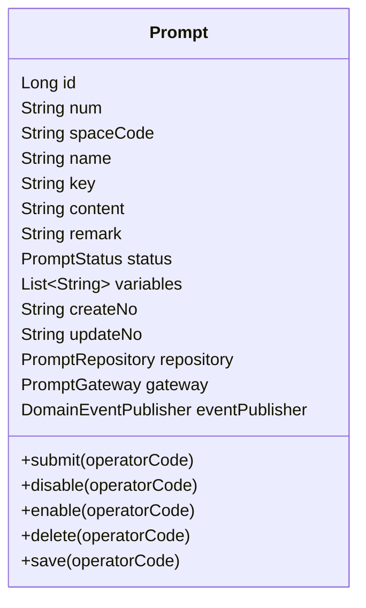
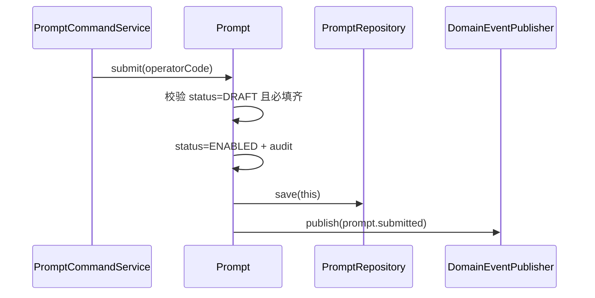
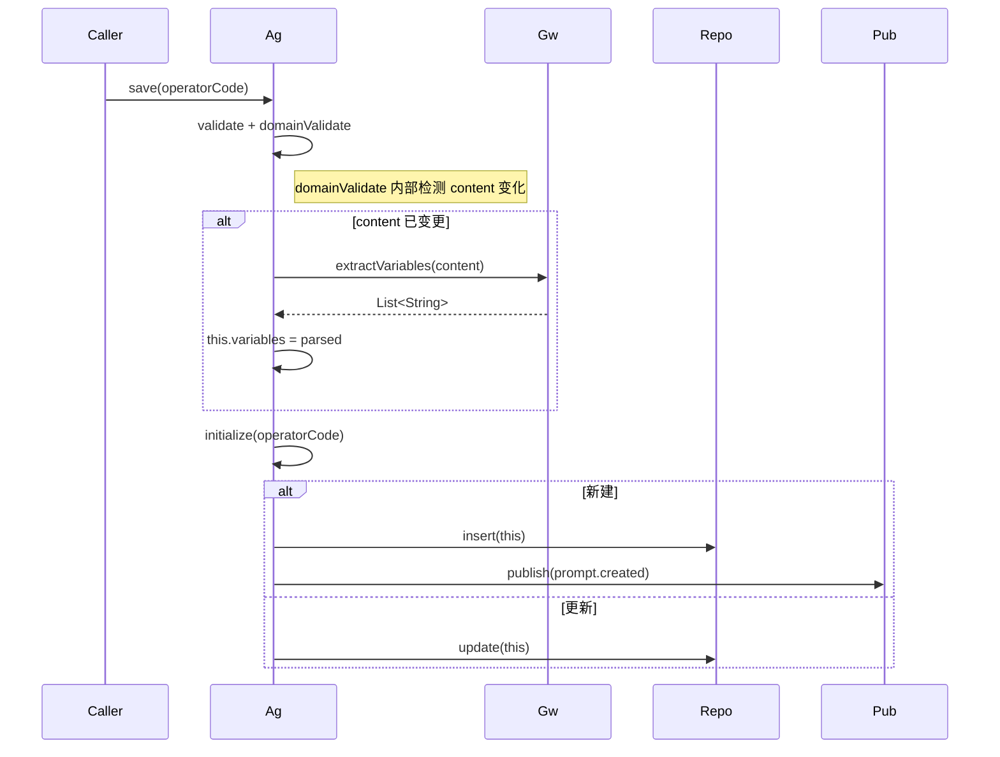
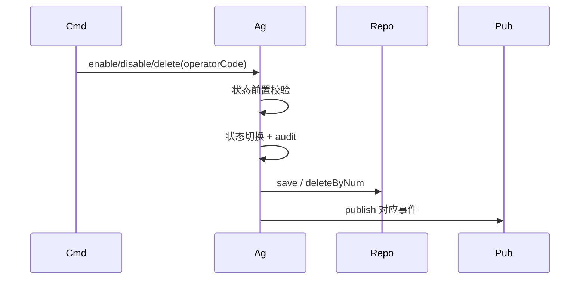
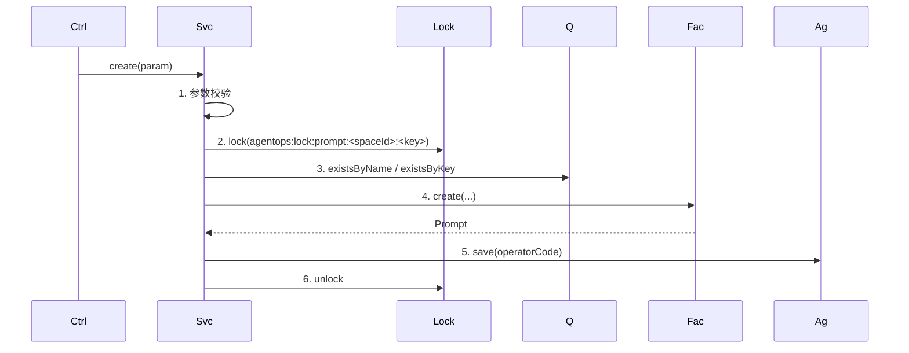
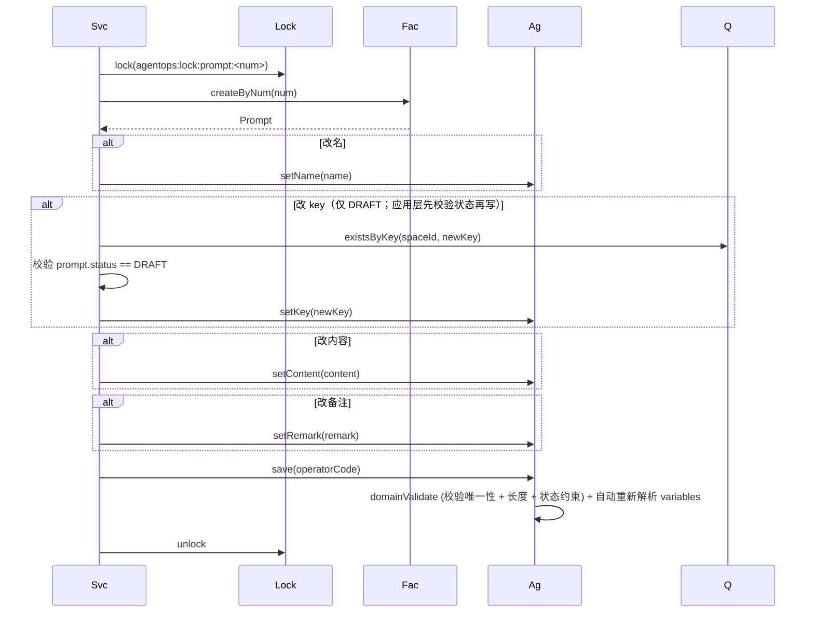
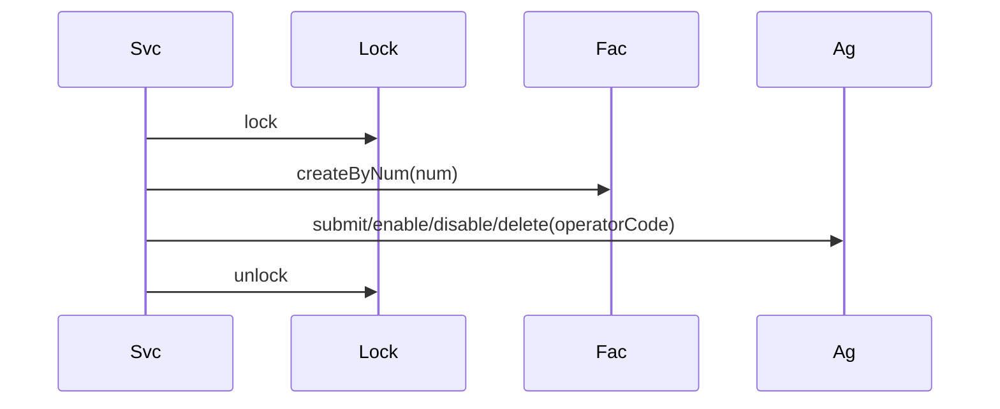
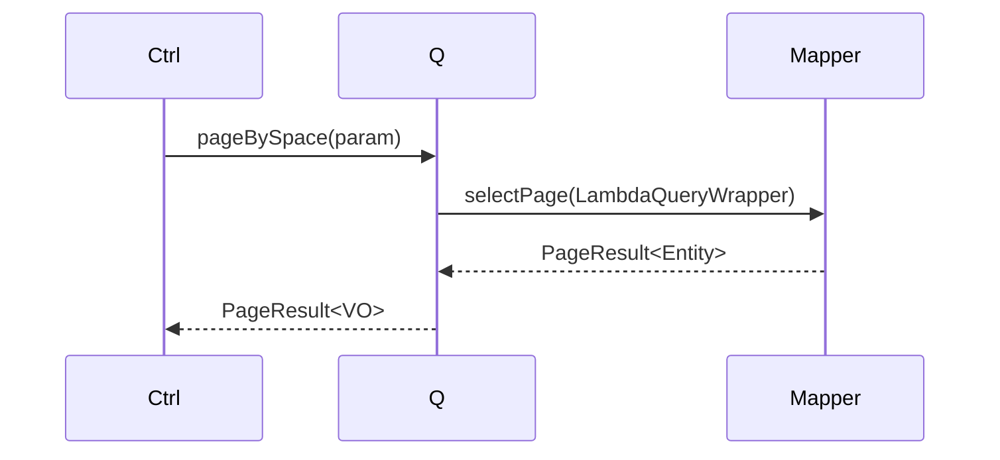
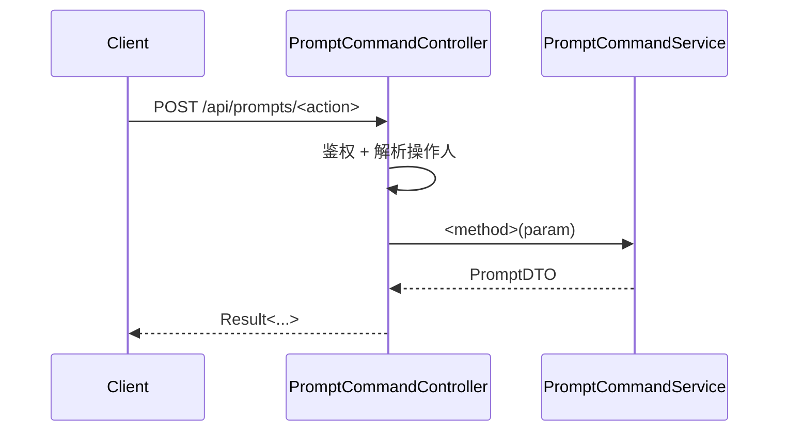

# AgentOps 平台 — Prompt 管理技术方案

| 文档版本 | 日期 | 编写人 | 说明 |
|---------|------|-------|------|
| V1.0 | 2026-06-13 | AgentOps Team | Prompt 管理技术方案初稿 |
| V1.1 | 2026-06-13 | AgentOps Team | 按"领域动作精简原则"修订（公共方案 §11.5）：移除 rename/updateContent/updateRemark/changeKey 领域方法；改为 setter + save |
| V1.3 | 2026-06-13 | AgentOps Team | 状态枚举命名规范化：`ResourceStatus` → `PromptStatus`，放在 `client.prompt.enums` 包下 |
| V1.5 | 2026-06-13 | AgentOps Team | 跨领域引用统一为业务编码（公共方案 §10.2）：spaceId Long → spaceCode String；createNo/updateNo Long→String；operatorId Long → operatorCode String；DDL 列类型相应改为 VARCHAR(32) |

> 配套 PRD：`doc/产品方案/2026-06-13_Prompt管理-PRD.md`
> 公共约定：`doc/技术方案/2026-06-13_AgentOps公共技术方案.md`

---

## 1. 目标与范围

空间内 Prompt 模板管理：CRUD、状态机（草稿/启用/禁用）、Key 稳定引用、`{{var}}` 占位变量解析。

不含：在线运行、Lint、A/B 测试。

### 1.1 设计前问题对齐

继承公共方案 §1。本模块特有：
- Prompt 内容 ≤ 10,000 字符 → MySQL `TEXT`
- Key（业务键）一经提交进入启用态后**不可修改**；草稿态可改
- 变量列表由后端解析 `{{varName}}` 抽取，回写到详情字段

---

## 2. 架构设计

### 2.1 应用架构

| 层 | 领域 | 包 | 职责 |
|----|------|-----|------|
| client | prompt | `com.agent.ops.client.prompt.dto` | `PromptDTO` |
| client | prompt | `com.agent.ops.client.prompt.param` | `CreatePromptParam` / `UpdatePromptParam` / `PromptQueryParam` |
| client | prompt | `com.agent.ops.client.prompt.vo` | `PromptVO`（含 variables 列表） |
| client | prompt | `com.agent.ops.client.prompt.enums` | `PromptStatus`（DRAFT/ENABLED/DISABLED） |
| domain | prompt | `com.agent.ops.domain.prompt` | `Prompt`（聚合根）|
| domain | prompt | `com.agent.ops.domain.prompt.repository` | `PromptRepository` |
| domain | prompt | `com.agent.ops.domain.prompt.factory` | `PromptFactory` |
| domain | prompt | `com.agent.ops.domain.prompt.gateway` | `PromptGateway`（编号生成 + 变量解析） |
| domain | prompt | `com.agent.ops.domain.prompt.event` | `PromptEventConstant` |
| infra | prompt | `com.agent.ops.infra.prompt.entity` | `PromptEntity` |
| infra | prompt | `com.agent.ops.infra.prompt.mapper` | `PromptMapper` |
| infra | prompt | `com.agent.ops.infra.prompt.repository` | `PromptRepositoryImpl` |
| infra | prompt | `com.agent.ops.infra.prompt.factory` | `PromptFactoryImpl` |
| infra | prompt | `com.agent.ops.infra.prompt.gateway` | `PromptGatewayImpl` |
| application | prompt | `com.agent.ops.application.prompt.command` | `PromptCommandService` |
| application | prompt | `com.agent.ops.application.prompt.query` | `PromptQueryService` |
| adapter | prompt | `com.agent.ops.adapter.prompt.controller` | `PromptCommandController` / `PromptQueryController` |

### 2.2 部署架构

部署架构不变。

---

## 3. Facade 层设计

本次无 Facade 层变更。状态枚举 `PromptStatus` 放在 `client.prompt.enums` 包下。

---

## 4. 领域层设计

### 4.1 业务层级划分

| 层级 | 领域 | 说明 |
|------|------|------|
| 空间内 | prompt | Prompt 模板 |

### 4.2 提示词（prompt）

#### 4.2.1 领域模型

> 按公共方案 §11.5：类图仅展示属性 + 状态动作（submit/enable/disable）+ delete + save。变量解析不是领域动作；由 save 内部通过 Gateway 自动解析回写。



| 对象 | 类型 | 关键属性 |
|------|------|---------|
| Prompt | 聚合根 | spaceId / name / key / content / variables（save 时由 Gateway 解析回写） |

#### 4.2.2 领域动作

仅保留状态/删除/save 三类（公共方案 §11.5）。改名/改内容/改备注/改 Key 由应用层 setter + save 完成。

| 聚合 | 动作 | 类型 | 职责 | 前置 | 后置/规则 | 事件 |
|------|------|------|------|------|----------|------|
| Prompt | `submit(operatorCode)` | 状态 | 草稿→启用 | 当前 = DRAFT；必填齐 | status=ENABLED；key 锁定 | `prompt.prompt.submitted` |
| Prompt | `disable(operatorCode)` | 状态 | 启用→禁用 | 当前 = ENABLED | status=DISABLED | `prompt.prompt.disabled` |
| Prompt | `enable(operatorCode)` | 状态 | 禁用→启用 | 当前 = DISABLED | status=ENABLED | `prompt.prompt.enabled` |
| Prompt | `delete(operatorCode)` | 删除 | 软删 | 当前 = DRAFT | is_deleted=1 | `prompt.prompt.deleted` |
| Prompt | `save(operatorCode)` | 持久化 | validate + initialize；`domainValidate` 检测 content 变化时自动调 `gateway.extractVariables` 回写 variables；启用态/禁用态保存时校验 key 未变更 | — | — | 新建时 `prompt.prompt.created` |

##### 时序：`Prompt.submit(operatorCode)`



##### 时序：`Prompt.save(operatorCode)` —— 内含变量解析回写



##### 时序：`Prompt.enable / disable / delete`（统一模板）



> 字段修改不再设计领域方法；变量解析作为 `save` 的内置职责自动执行。

#### 4.2.3 领域规则

| 对象 | 规则 | 描述 | 违反 |
|------|------|------|------|
| Prompt | 唯一性 | (space_id, name, is_deleted) 唯一 | `BizException` |
| Prompt | 唯一性 | (space_id, key, is_deleted) 唯一 | `BizException` |
| Prompt | 必填 | name 1~50；key 1~64 且符合 `^[A-Za-z][A-Za-z0-9_-]{0,63}$`；content 1~10000 | `BizException` |
| Prompt | 状态 | 仅 DRAFT 可删 / 可改 Key | `BizException` |
| Prompt | 占位符 | 解析 `{{varName}}`：`^[A-Za-z_][A-Za-z0-9_]{0,31}$` | 解析时丢弃非法占位 |

#### 4.2.4 领域工厂

| Factory | 方法 | 入参 | 返回 | 职责 |
|---------|------|------|------|------|
| `PromptFactory` | `create(spaceId, name, key, content, remark)` | 用户填写字段 | `Prompt` | 生成 num（PR）；status=DRAFT；调 gateway.extractVariables |
| `PromptFactory` | `createByNum(num)` | num | `Prompt` | — |

#### 4.2.5 领域网关

| Gateway | 方法 | 入参 | 返回 | 职责 |
|---------|------|------|------|------|
| `PromptGateway` | `generatePromptCode()` | — | String | BizCodeGenerator(`PR`) |
| `PromptGateway` | `extractVariables(content)` | content | `List<String>` | 正则解析 `{{var}}` 去重 |

#### 4.2.6 领域事件

| 事件 | 触发 | 载荷 |
|------|------|------|
| `prompt.prompt.created` | 新建 | spaceNum/promptNum/key |
| `prompt.prompt.submitted` | 草稿→启用 | promptNum/key |
| `prompt.prompt.enabled` / `disabled` / `deleted` | 对应动作 | promptNum |

✅ 自检通过。

---

## 5. 基础设施层设计

| 类型 | 类名 | 包 | 是否新增 |
|------|------|-----|---------|
| Entity | `PromptEntity` | `infra.prompt.entity` | 新增 |
| Mapper | `PromptMapper` | `infra.prompt.mapper` | 新增 |
| RepositoryImpl | `PromptRepositoryImpl` | — | 新增 |
| FactoryImpl | `PromptFactoryImpl` | — | 新增 |
| GatewayImpl | `PromptGatewayImpl` | 用 Hutool `ReUtil.findAllGroup1(...)` 解析变量 | 新增 |

> Variables 在 Entity 中以 `JSON` 类型列存储；通过 MyBatis-Plus `@TableField(typeHandler=...)` 处理。

✅ 自检通过。

---

## 6. 应用层设计

### 6.1 业务模块划分

仅一个模块：6.2 提示词（prompt）。

### 6.2 Service 方法清单

| Service | 方法 | 入参 | 返回 |
|---------|------|------|------|
| `PromptCommandService` | `create(CreatePromptParam)` | — | `PromptDTO` |
| `PromptCommandService` | `update(UpdatePromptParam)` | num+name/content/remark；草稿态可带 newKey | `PromptDTO` |
| `PromptCommandService` | `submit(num)` | num | `PromptDTO` |
| `PromptCommandService` | `enable(num)` | num | `PromptDTO` |
| `PromptCommandService` | `disable(num)` | num | `PromptDTO` |
| `PromptCommandService` | `delete(num)` | num | void |
| `PromptQueryService` | `getByNum(num)` | — | `PromptDTO` |
| `PromptQueryService` | `pageBySpace(PromptQueryParam)` | space+keyword+status | `PageResult<PromptVO>` |
| `PromptQueryService` | `getEnabledByKey(spaceId, key)` | — | `PromptDTO` | Agent 选入用 |
| `PromptQueryService` | `getEnabledList(spaceId)` | — | `List<PromptDTO>` | Agent 选入对话框用 |

### 6.2.2 时序

##### `PromptCommandService.create(...)`



##### `PromptCommandService.update(...)` —— **改字段：setter + save**



##### `PromptCommandService.submit/enable/disable/delete(num)`



##### `PromptQueryService.pageBySpace(...)`



✅ 自检通过。

---

## 7. Adapter 层设计

### 7.1 业务模块划分

| 模块 | Controller |
|------|-----------|
| 7.2 Prompt | `PromptCommandController` / `PromptQueryController` |

### 7.2 Prompt

| 方法 | 路径 | 入参 JSON | 返回 |
|------|------|----------|------|
| POST | `/api/prompts/create` | `{"spaceNum":"SP...","name":"...","key":"customer_open","content":"你是 {{role}}","remark":""}` | `Result<PromptDTO>` |
| POST | `/api/prompts/update` | `{"num":"PR...","name":"...","content":"...","remark":"...","newKey":"..."}` | `Result<PromptDTO>` |
| POST | `/api/prompts/submit` | `{"num":"PR..."}` | `Result<PromptDTO>` |
| POST | `/api/prompts/enable` | `{"num":"PR..."}` | `Result<PromptDTO>` |
| POST | `/api/prompts/disable` | `{"num":"PR..."}` | `Result<PromptDTO>` |
| POST | `/api/prompts/delete` | `{"num":"PR..."}` | `Result<Void>` |
| GET | `/api/prompts/get` | `?num=PR...` | `Result<PromptDTO>` |
| GET | `/api/prompts/page` | `?spaceNum=&keyword=&status=&pageNo=1&pageSize=20` | `Result<PageResult<PromptVO>>` |
| GET | `/api/prompts/list-enabled` | `?spaceNum=...` | `Result<List<PromptVO>>`（Agent 装配选入） |
| GET | `/api/prompts/get-by-key` | `?spaceNum=...&key=...` | `Result<PromptDTO>`（运行时按 Key 取） |

#### 通用时序



✅ Adapter 自检通过。

---

## 8. 数据库设计

### 8.1 `prompts` 表

| 字段 | 类型 | 必填 | 索引 | 说明 |
|------|------|------|------|------|
| id | BIGINT | 是 | PK | |
| num | VARCHAR(32) | 是 | UK | PR+ts+rand |
| space_code | VARCHAR(32) | 是 | KEY | 所属空间业务编码 |
| name | VARCHAR(50) | 是 | UK with space_id, is_deleted | |
| `key` | VARCHAR(64) | 是 | UK with space_id, is_deleted | 注意 SQL 关键字反引号 |
| content | TEXT | 是 | — | ≤ 10,000 字符 |
| variables_json | JSON | 否 | — | 解析回写的变量数组 |
| remark | VARCHAR(200) | 否 | — | |
| status | TINYINT(1) | 是 | KEY | 0=草稿 1=启用 2=禁用 |
| 公共列 | — | — | — | |

### 8.2 DDL

```sql
CREATE TABLE `prompts` (
  `id` BIGINT NOT NULL AUTO_INCREMENT,
  `num` VARCHAR(32) NOT NULL,
  `space_code` VARCHAR(32) NOT NULL,
  `name` VARCHAR(50) NOT NULL,
  `key` VARCHAR(64) NOT NULL,
  `content` TEXT NOT NULL,
  `variables_json` JSON DEFAULT NULL,
  `remark` VARCHAR(200) DEFAULT NULL,
  `status` TINYINT(1) NOT NULL DEFAULT 0,
  `create_no` VARCHAR(32) NOT NULL,
  `update_no` VARCHAR(32) NOT NULL,
  `create_time` DATETIME(3) NOT NULL DEFAULT CURRENT_TIMESTAMP(3),
  `update_time` DATETIME(3) NOT NULL DEFAULT CURRENT_TIMESTAMP(3) ON UPDATE CURRENT_TIMESTAMP(3),
  `is_deleted` TINYINT(1) NOT NULL DEFAULT 0,
  PRIMARY KEY (`id`),
  UNIQUE KEY `uk_num` (`num`),
  UNIQUE KEY `uk_space_name_deleted` (`space_code`, `name`, `is_deleted`),
  UNIQUE KEY `uk_space_key_deleted` (`space_code`, `key`, `is_deleted`),
  KEY `idx_space_status` (`space_code`, `status`, `is_deleted`)
) ENGINE=InnoDB DEFAULT CHARSET=utf8mb4 COLLATE=utf8mb4_unicode_ci COMMENT='Prompt';
```

### 8.3 DML（无）

✅ 自检通过。

---

## 9. 模块变更清单

| 层 | 内容 | Skill |
|----|------|------|
| client | 新增 prompt.dto/param/vo | impl-client-module |
| domain | 新增 prompt 聚合 / 工厂 / 网关 | impl-domain-module |
| infra | 新增 prompt.entity/mapper/repository/factory/gateway | impl-infra-module |
| application | 新增 prompt.command / prompt.query | impl-application-module |
| adapter | 新增 prompt.controller | impl-adapter-module |

---

## 10. 代码分支命名

```
feature-20260613-prompt-management
```

---

## 11. 实现顺序

```
client → domain → infra → application → adapter
```

---

## 12. 接口与数据契约

参见 §7.2。

---

## 13. 其他

- Agent 模块"选入提示词"调用 `PromptQueryService.getByNum(num)` 取 content，复制到 Agent 副本字段
- 运行时按 Key 解析（如有）调用 `getEnabledByKey(spaceId, key)`
