# AgentOps 平台 — Skill 管理技术方案

| 文档版本 | 日期 | 编写人 | 说明 |
|---------|------|-------|------|
| V1.0 | 2026-06-13 | AgentOps Team | Skill 管理技术方案初稿 |
| V1.1 | 2026-06-13 | AgentOps Team | 按"领域动作精简原则"修订（公共方案 §11.5）：移除 rename/updateBasic/refreshCurrentVersion/editContent/rename/updateContent 等改字段领域方法；改为 setter + save |
| V1.3 | 2026-06-13 | AgentOps Team | （1）**Skill 主体新增 status（DRAFT/EFFECTIVE/WITHDRAWN）+ enable/withdraw/delete 三个领域动作**：创建后默认草稿，需手动 enable 才可被引用；下架后可重新 enable 为生效；（2）状态枚举命名规范化：`LifecycleStatus` → 主体 `SkillStatus` + 版本 `SkillVersionStatus`，放在 `client.skill.enums` 包下 |
| V1.5 | 2026-06-13 | AgentOps Team | 跨领域引用统一为业务编码（公共方案 §10.2）：spaceId Long → spaceCode String；SkillVersion.skillId Long → skillCode String（双聚合根之间引用按 num）；SkillResourceFile.skillVersionId Long → skillVersionCode String；createNo/updateNo/operatorId Long→String；DDL 列类型相应改为 VARCHAR(32) |

> 配套 PRD：`doc/产品方案/2026-06-13_Skill管理-PRD.md`
> 公共约定：`doc/技术方案/2026-06-13_AgentOps公共技术方案.md`

---

## 1. 目标与范围

空间内 Skill 管理：**强制多版本** + **资源文件树**（平面表 + path）+ **Skill.MD frontmatter 双向同步**。

不含：Skill 在线运行 / Lint、市场。

### 1.1 设计前问题对齐

继承公共方案 §1。本模块特有：
- Skill 由「主体」+「版本」+「版本下属资源文件」三层构成，需建 3 张表
- 资源文件树用 `(skill_version_id, path)` 唯一索引建模（**问题 10 决策**）
- Skill.MD 文本 ≤ 1MB → MEDIUMTEXT；资源文件单文件 ≤ 10MB → MEDIUMTEXT
- 名称/描述/版本号在 Skill.MD frontmatter 与 Skill 主体/版本之间双向同步：保存时由后端解析 frontmatter 并校验一致

---

## 2. 架构设计

### 2.1 应用架构

| 层 | 领域 | 包 | 职责 |
|----|------|-----|------|
| client | skill | `com.agent.ops.client.skill.dto` | `SkillDTO` / `SkillVersionDTO` / `SkillResourceFileDTO` |
| client | skill | `com.agent.ops.client.skill.param` | `CreateSkillParam` / `UpdateSkillParam` / `CreateVersionParam` / `EditVersionParam` / `*ResourceFileParam` |
| client | skill | `com.agent.ops.client.skill.vo` | `SkillVO` / `SkillVersionVO` / `ResourceTreeVO` |
| client | skill | `com.agent.ops.client.skill.enums` | **`SkillStatus`（DRAFT/EFFECTIVE/WITHDRAWN，主体用）+ `SkillVersionStatus`（DRAFT/EFFECTIVE/WITHDRAWN，版本用）+ `FileType`（FILE/FOLDER）** |
| domain | skill | `com.agent.ops.domain.skill` | `Skill`（聚合根） / `SkillVersion`（实体内含 `resourceFiles: List<SkillResourceFile>`） |
| domain | skill | `com.agent.ops.domain.skill.repository` | `SkillRepository` / `SkillVersionRepository` / `SkillResourceFileRepository` |
| domain | skill | `com.agent.ops.domain.skill.factory` | `SkillFactory` / `SkillVersionFactory` / `SkillResourceFileFactory` |
| domain | skill | `com.agent.ops.domain.skill.gateway` | `SkillGateway`（编号生成 + frontmatter 解析） |
| domain | skill | `com.agent.ops.domain.skill.event` | `SkillEventConstant` |
| infra | skill | `com.agent.ops.infra.skill.entity` | `SkillEntity` / `SkillVersionEntity` / `SkillResourceFileEntity` |
| infra | skill | `com.agent.ops.infra.skill.mapper` | 3 个 Mapper |
| infra | skill | `com.agent.ops.infra.skill.repository` | 3 个 RepositoryImpl |
| infra | skill | `com.agent.ops.infra.skill.factory` | 3 个 FactoryImpl |
| infra | skill | `com.agent.ops.infra.skill.gateway` | `SkillGatewayImpl` |
| application | skill | `com.agent.ops.application.skill.command` | `SkillCommandService` / `SkillVersionCommandService` / `SkillResourceFileCommandService` |
| application | skill | `com.agent.ops.application.skill.query` | `SkillQueryService` / `SkillVersionQueryService` / `SkillResourceFileQueryService` |
| adapter | skill | `com.agent.ops.adapter.skill.controller` | 3 套 Controller |

### 2.2 部署架构

部署架构不变。

---

## 3. Facade 层设计

本次无 Facade 层变更。状态枚举 `SkillStatus` / `SkillVersionStatus` 放在 `client.skill.enums` 包下。

---

## 4. 领域层设计

### 4.1 业务层级划分

| 层级 | 领域 | 说明 |
|------|------|------|
| 空间内 | skill | Skill 主体 + 版本 + 资源文件 |

### 4.2 Skill（skill）

#### 4.2.1 领域模型

> 按公共方案 §11.5：类图仅展示属性 + 状态动作 + delete + save。改名/改描述/改 Skill.MD/改资源文件路径与内容/刷新当前版本号 等均通过 setter + save。
>
> **V1.3 主体新增 status 三态状态机**（公共方案 §10.1.1）：草稿（创建后默认）→ 生效（enable）→ 下架（withdraw）；下架可重新 enable 为生效。

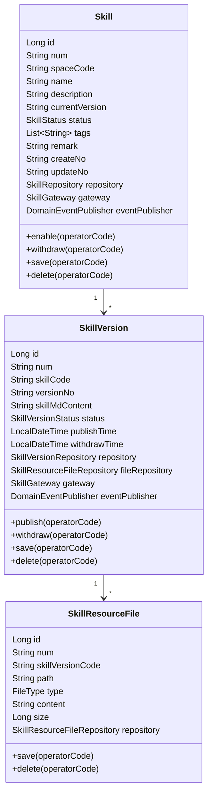

#### 4.2.1.1 Skill 主体状态机（V1.3 新增）

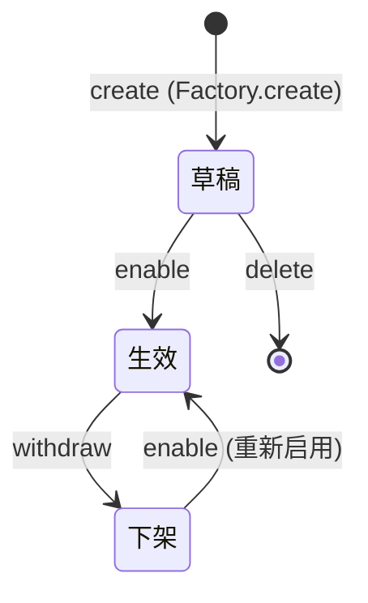

| 主体状态 | 含义 | Skill 是否可被 Agent 引用 |
|---------|------|-----------|
| 草稿 (DRAFT) | 主体已创建但未启用 | ❌ |
| 生效 (EFFECTIVE) | 主体已启用 | ✅ 前提是至少有一个版本 status=EFFECTIVE |
| 下架 (WITHDRAWN) | 主体被人工下架 | ❌ 无论版本状态如何 |

| 对象 | 类型 | 关键属性 |
|------|------|---------|
| Skill | 聚合根 | name / description / currentVersion |
| SkillVersion | 独立聚合根（按 PRD 多版本独立操作） | versionNo / skillMdContent / status |
| SkillResourceFile | SkillVersion 子实体（在 SkillVersion 聚合内） | path（如 `templates/email.md`）/ type（FILE/FOLDER）/ content |

> 设计取舍：Skill 与 SkillVersion 在 PRD 描述上是父子，但生命周期独立（版本可独立发布/下架/删除）；将 SkillVersion 升为独立聚合根更合理。Skill 主体仅记录"当前版本号"作为快照标识。
> SkillResourceFile 仍归属在 SkillVersion 聚合内（资源始终随版本走，不能独立）。

#### 4.2.2 领域动作

仅保留状态/删除/save 三类（公共方案 §11.5）。改名/改描述/改 Skill.MD/改资源文件路径与内容/刷新当前版本号 等均通过应用层 setter + save 完成。

##### Skill（主体三态状态机，V1.3 新增）

| 动作 | 类型 | 职责 | 前置 | 事件 |
|------|------|------|------|------|
| `enable(operatorCode)` | 状态 | 启用主体（草稿→生效 或 下架→生效） | status ∈ {DRAFT, WITHDRAWN} | `skill.skill.enabled` |
| `withdraw(operatorCode)` | 状态 | 主体下架 | status = EFFECTIVE | `skill.skill.withdrawn` |
| `delete(operatorCode)` | 删除 | 软删 | status = DRAFT 且无任何 EFFECTIVE 版本 | `skill.skill.deleted` |
| `save(operatorCode)` | 持久化 | validate + initialize；新建时 status 默认 DRAFT；domainValidate 校验 name 空间唯一 | — | 新建时 `skill.skill.created`；更新且 currentVersion 变化时 `skill.skill.current_version_refreshed`（订阅器：审计） |

##### SkillVersion

| 动作 | 类型 | 职责 | 前置 | 事件 |
|------|------|------|------|------|
| `publish(operatorCode)` | 状态 | 草稿→生效；同时把同 Skill 旧 EFFECTIVE 版本切换为 WITHDRAWN | status=DRAFT；frontmatter 与主体一致；版本号唯一 | `skill.skill_version.published`（订阅者：Skill 主体刷新 currentVersion） |
| `withdraw(operatorCode)` | 状态 | 生效→下架 | status=EFFECTIVE | `skill.skill_version.withdrawn` |
| `delete(operatorCode)` | 删除 | 软删 | status=DRAFT | `skill.skill_version.deleted` |
| `save(operatorCode)` | 持久化 | validate + initialize；domainValidate 内调 `gateway.parseFrontmatter` 校验三字段一致；versionNo 与 frontmatter.version 一致 | — | 新建时 `skill.skill_version.created` |

##### SkillResourceFile

| 动作 | 类型 | 职责 | 前置 | 事件 |
|------|------|------|------|------|
| `delete(operatorCode)` | 删除 | 软删（应用层在调用前校验父 Version 状态=DRAFT，并对子节点递归处理） | — | — |
| `save(operatorCode)` | 持久化 | validate + initialize；domainValidate 校验 path 命名/大小限制；不允许 path = `Skill.MD` | — | — |

##### 时序：`SkillVersion.publish(operatorCode)`（核心）

```mermaid
sequenceDiagram
    participant Cmd as SkillVersionCommandService
    participant Ag as SkillVersion (待发布)
    participant Gw as SkillGateway
    participant Repo as SkillVersionRepository
    participant Pub as DomainEventPublisher

    Cmd->>Ag: publish(operatorCode)
    Ag->>Ag: 校验 status=DRAFT
    Ag->>Gw: parseFrontmatter(this.skillMdContent)
    Gw-->>Ag: {name, description, version}
    Ag->>Ag: 校验 name/description/version 三字段非空
    Ag->>Repo: findEffectiveBySkillId(skillId)
    Repo-->>Ag: 旧 EFFECTIVE 版本（可能为空）
    alt 存在旧 EFFECTIVE
        Ag->>Ag: 旧版本调用 withdraw(operatorCode) 内部状态切换 + audit
    end
    Ag->>Ag: this.status=EFFECTIVE; publishTime=now
    Ag->>Repo: save(this) 与 旧版本 (在同一事务)
    Ag->>Pub: publish(skill.skill_version.published)
    Note right of Pub: 订阅器通过 setter + save 刷新 Skill 主体 currentVersion
```

##### 时序：`SkillVersion.editContent(skillMd, operatorCode)` —— **改字段：setter + save**

> 该动作已不存在领域方法；以下时序展示**应用层**编辑流程：

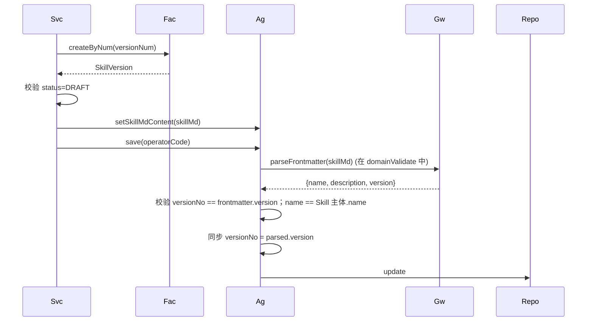

##### 时序：`SkillResourceFile` 改字段 —— **应用层 setter + save**

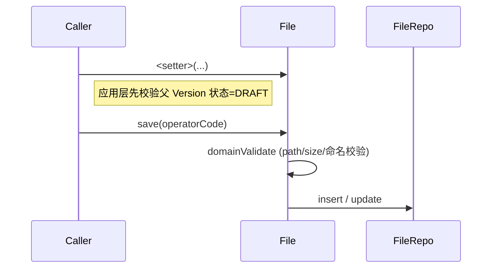

#### 4.2.3 领域规则

| 对象 | 规则 | 描述 | 违反 |
|------|------|------|------|
| Skill | 唯一性 | (space_id, name, is_deleted) 唯一 | `BizException` |
| SkillVersion | 唯一性 | (skill_id, version_no, is_deleted) 唯一 | `BizException` |
| SkillVersion | 状态 | 同 Skill 同时最多一个 EFFECTIVE | `BizException` |
| SkillVersion | 状态 | 同 Skill 同时最多一个 DRAFT | `BizException` |
| SkillVersion | frontmatter | 必含 name/description/version 三字段 | `BizException` |
| SkillVersion | 一致性 | frontmatter.version 与 versionNo 一致 | `BizException` |
| SkillVersion | 一致性 | frontmatter.name 与 Skill 主体 name 一致 | `BizException` |
| SkillResourceFile | 唯一性 | (skill_version_id, path, is_deleted) 唯一 | `BizException` |
| SkillResourceFile | 容量 | 单文件 ≤ 10MB；版本内总数 ≤ 200；总大小 ≤ 50MB | `BizException` |
| SkillResourceFile | path 命名 | 不允许 `/\:*?"<>|` 等非法字符 | `BizException` |
| SkillResourceFile | 排除 Skill.MD | path 不允许等于 `Skill.MD` 或 `skill.md` | `BizException` |

#### 4.2.4 领域工厂

| Factory | 方法 | 入参 | 返回 | 职责 |
|---------|------|------|------|------|
| `SkillFactory` | `create(spaceId, name, description, tags, remark)` | 用户填写字段 | `Skill` | 生成 num（SK） |
| `SkillFactory` | `createByNum(num)` | num | `Skill` | — |
| `SkillVersionFactory` | `create(skillId, versionNo, skillMdContent)` | 用户填写字段 | `SkillVersion` | 生成 num（SKV）；status=DRAFT；调用 gateway 校验 frontmatter |
| `SkillVersionFactory` | `createByNum(num)` | num | `SkillVersion` | — |
| `SkillResourceFileFactory` | `create(skillVersionId, path, type, content)` | 用户填写字段 | `SkillResourceFile` | 生成 num（SKR） |
| `SkillResourceFileFactory` | `createByNum(num)` | num | `SkillResourceFile` | — |

#### 4.2.5 领域网关

| Gateway | 方法 | 入参 | 返回 | 职责 |
|---------|------|------|------|------|
| `SkillGateway` | `generateSkillCode()` | — | String | BizCodeGenerator(`SK`) |
| `SkillGateway` | `generateVersionCode()` | — | String | BizCodeGenerator(`SKV`) |
| `SkillGateway` | `generateResourceCode()` | — | String | BizCodeGenerator(`SKR`) |
| `SkillGateway` | `parseFrontmatter(skillMd)` | Markdown | `Frontmatter` | 解析 YAML frontmatter |
| `SkillGateway` | `validateSemver(versionNo)` | — | boolean | 校验 SemVer |

#### 4.2.6 领域事件

| 事件 | 触发 | 载荷 |
|------|------|------|
| `skill.skill.created/deleted` | 主体新建/删除 | skillNum |
| `skill.skill_version.published` | 版本发布 | skillNum/versionNum/versionNo | 订阅器：通过 setter + save 刷新 Skill 主体 currentVersion |
| `skill.skill_version.withdrawn/deleted` | 版本下架/删除 | skillNum/versionNum |

✅ 自检通过（注意：Skill 与 SkillVersion 是双聚合根，跨聚合通过 ID 引用 + 事件协作，不直接对象引用）。

---

## 5. 基础设施层设计

| 类型 | 类名 | 包 | 是否新增 |
|------|------|-----|---------|
| Entity | `SkillEntity` / `SkillVersionEntity` / `SkillResourceFileEntity` | — | 新增 |
| Mapper | `SkillMapper` / `SkillVersionMapper` / `SkillResourceFileMapper` | — | 新增 |
| RepositoryImpl | 三个 RepositoryImpl | — | 新增 |
| FactoryImpl | 三个 FactoryImpl | — | 新增 |
| GatewayImpl | `SkillGatewayImpl` | YAML frontmatter 解析用 SnakeYAML（已含于 Spring Boot） | 新增 |

✅ 自检通过。

---

## 6. 应用层设计

### 6.1 业务模块划分

| 模块 | 内容 |
|------|------|
| 6.2 Skill 主体 | 创建、改基本信息、删除 |
| 6.3 Skill 版本 | 派生草稿、编辑 Skill.MD、发布、下架、删除草稿、以历史版本新建 |
| 6.4 Skill 资源文件 | 文件夹/文件增删改、上传 |

### 6.2 Skill 主体

| Service | 方法 | 入参 | 返回 |
|---------|------|------|------|
| `SkillCommandService` | `create(CreateSkillParam)` | name+description+tags+remark | `SkillDTO`（含初始 V1 草稿版本；主体 status=DRAFT）|
| `SkillCommandService` | `updateBasic(UpdateSkillParam)` | num+description+tags+remark | `SkillDTO` |
| `SkillCommandService` | `enable(num)` | num | `SkillDTO` | **V1.3 新增**：草稿/下架→生效 |
| `SkillCommandService` | `withdraw(num)` | num | `SkillDTO` | **V1.3 新增**：生效→下架 |
| `SkillCommandService` | `delete(num)` | num | void | 仅草稿可删 |
| `SkillCommandService.@EventListener` | `onVersionPublished(event)` | — | — | 订阅 `skill.skill_version.published` 后通过 setter + save 刷新主体 currentVersion |
| `SkillQueryService` | `getByNum(num)` | — | `SkillDTO` |
| `SkillQueryService` | `pageBySpace(SkillQueryParam)` | space+keyword+主体 status+当前版本 status | `PageResult<SkillVO>` |
| `SkillQueryService` | `getEffectiveListForReference(spaceId)` | — | `List<SkillDTO>` | Agent 选入用：返回 `主体 status=EFFECTIVE 且至少一个版本 status=EFFECTIVE` 的 Skill（V1.3 严格化） |

##### `SkillCommandService.create(...)`

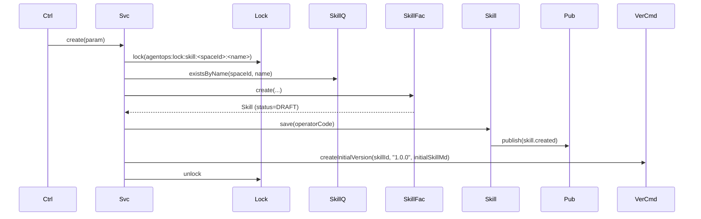

##### `SkillCommandService.enable / withdraw / delete`（V1.3，统一模板）

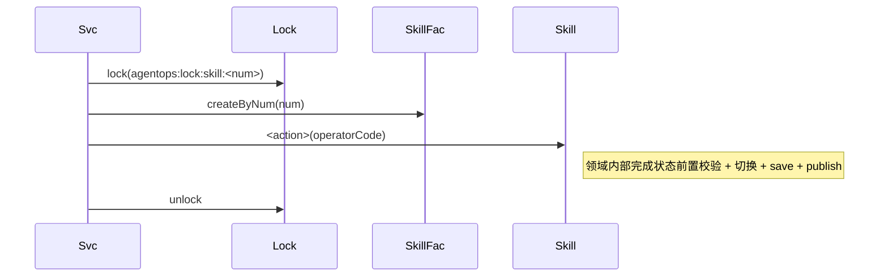

##### `SkillCommandService.updateBasic(...)` —— **改字段：setter + save**

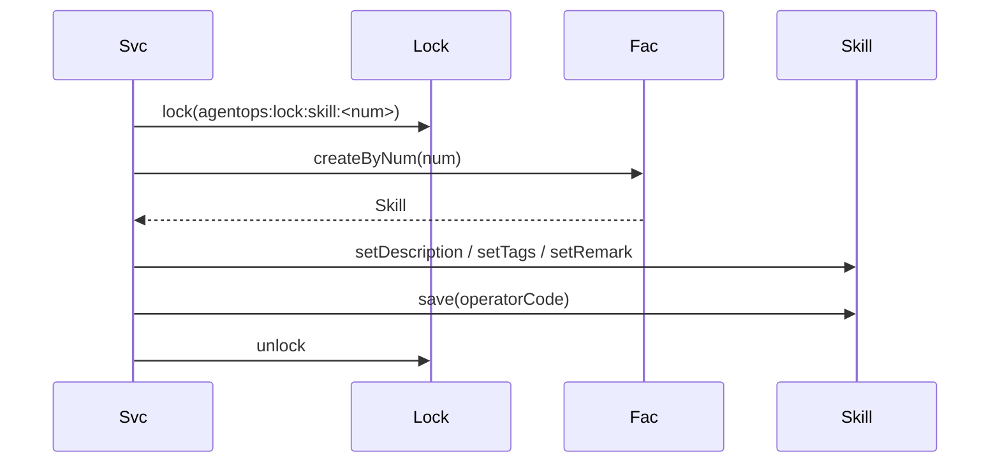

##### `SkillCommandService.onVersionPublished(event)`

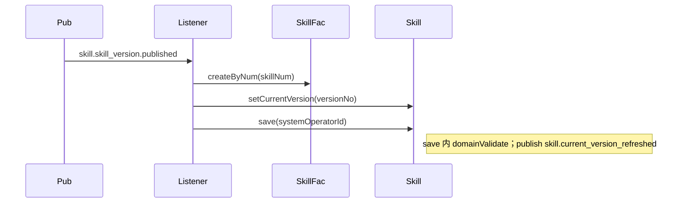

### 6.3 Skill 版本

| Service | 方法 | 入参 | 返回 |
|---------|------|------|------|
| `SkillVersionCommandService` | `createInitialVersion(skillId, versionNo, skillMd)` | — | `SkillVersionDTO` | 内部调用 |
| `SkillVersionCommandService` | `deriveDraft(CreateVersionParam)` | sourceVersionNum + newVersionNo | `SkillVersionDTO` | 复制源版本 SkillMD + 资源文件 |
| `SkillVersionCommandService` | `editContent(EditVersionParam)` | versionNum + skillMd | `SkillVersionDTO` |
| `SkillVersionCommandService` | `publish(num)` | versionNum | `SkillVersionDTO` |
| `SkillVersionCommandService` | `withdraw(num)` | versionNum | `SkillVersionDTO` |
| `SkillVersionCommandService` | `deleteDraft(num)` | versionNum | void |
| `SkillVersionQueryService` | `listBySkill(skillNum)` | — | `List<SkillVersionVO>` |
| `SkillVersionQueryService` | `getByNum(num)` | — | `SkillVersionDTO` |
| `SkillVersionQueryService` | `getEffectiveBySkill(skillId)` | — | `SkillVersionDTO` | Agent 运行时按 Skill 业务编码加载 |
| `SkillVersionQueryService` | `getDraftBySkill(skillId)` | — | `SkillVersionDTO` |

##### `SkillVersionCommandService.deriveDraft(param)`

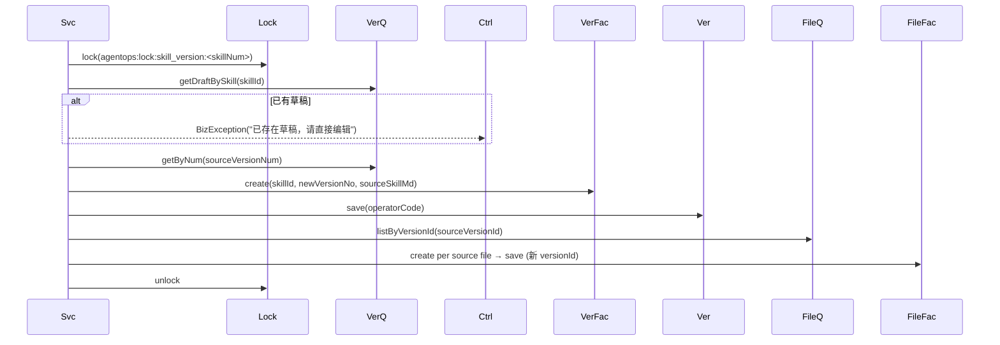

##### `SkillVersionCommandService.publish(num)` 时序见 §4.2.2 领域动作章节。

##### 其他方法同模板。

### 6.4 Skill 资源文件

| Service | 方法 | 入参 | 返回 |
|---------|------|------|------|
| `SkillResourceFileCommandService` | `createFolder(versionNum, path)` | — | `SkillResourceFileDTO` |
| `SkillResourceFileCommandService` | `createFile(versionNum, path, contentOrNull)` | — | `SkillResourceFileDTO` |
| `SkillResourceFileCommandService` | `uploadFile(versionNum, path, content)` | — | `SkillResourceFileDTO` |
| `SkillResourceFileCommandService` | `rename(num, newPath)` | — | `SkillResourceFileDTO` | 含子节点 path 前缀替换 |
| `SkillResourceFileCommandService` | `updateContent(num, content)` | — | `SkillResourceFileDTO` |
| `SkillResourceFileCommandService` | `delete(num)` | — | void | 文件夹递归 |
| `SkillResourceFileQueryService` | `listTreeByVersion(versionNum)` | — | `ResourceTreeVO` | 平面表查全 → 应用层拼树 |
| `SkillResourceFileQueryService` | `getContent(num)` | — | `SkillResourceFileDTO`（含 content） |

##### `SkillResourceFileCommandService.rename(num, newPath)` 时序

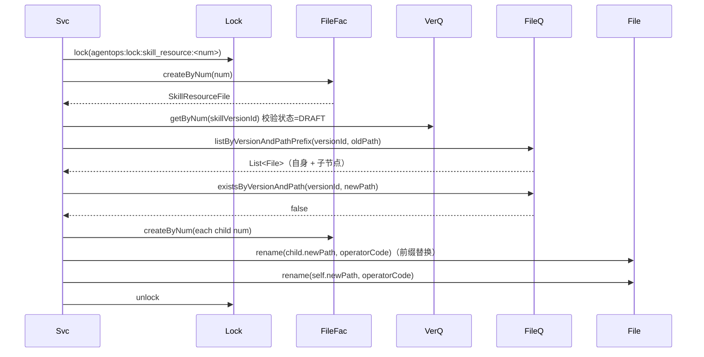

##### `SkillResourceFileQueryService.listTreeByVersion(versionNum)`

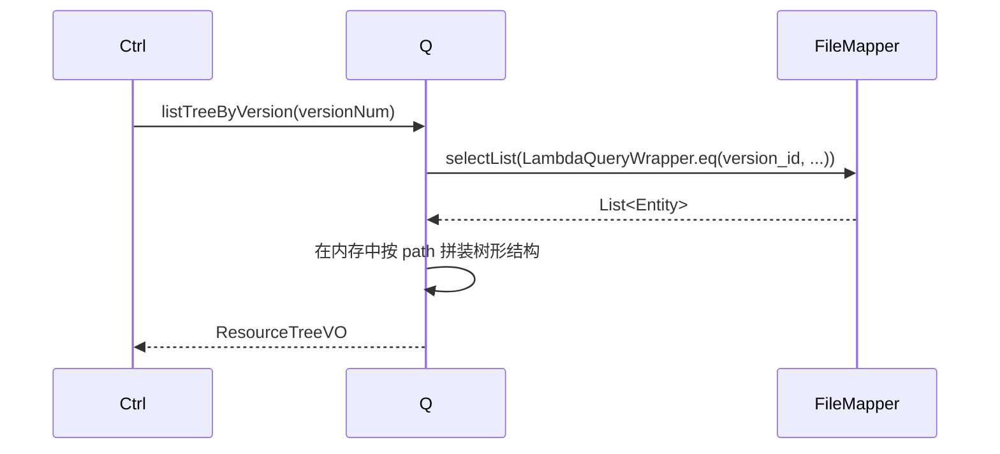

✅ 应用层自检通过。

---

## 7. Adapter 层设计

### 7.1 业务模块划分

| 模块 | Controller |
|------|-----------|
| 7.2 Skill 主体 | `SkillCommandController` / `SkillQueryController` |
| 7.3 Skill 版本 | `SkillVersionCommandController` / `SkillVersionQueryController` |
| 7.4 Skill 资源文件 | `SkillResourceFileCommandController` / `SkillResourceFileQueryController` |

### 7.2 Skill 主体

| 方法 | 路径 | 入参 JSON | 返回 |
|------|------|----------|------|
| POST | `/api/skills/create` | `{"spaceNum":"SP...","name":"银行卡校验","description":"...","tags":["金融"],"remark":"","initialSkillMd":"---\nname: ...\ndescription: ...\nversion: 1.0.0\n---\n# ..."}` | `Result<SkillDTO>` |
| POST | `/api/skills/update-basic` | `{"num":"SK...","description":"...","tags":[],"remark":""}` | `Result<SkillDTO>` |
| POST | `/api/skills/enable` | `{"num":"SK..."}` | `Result<SkillDTO>` （V1.3 新增）|
| POST | `/api/skills/withdraw` | `{"num":"SK..."}` | `Result<SkillDTO>` （V1.3 新增）|
| POST | `/api/skills/delete` | `{"num":"SK..."}` | `Result<Void>` |
| GET | `/api/skills/get` | `?num=SK...` | `Result<SkillDTO>` |
| GET | `/api/skills/page` | `?spaceNum=&keyword=&status=&pageNo=1&pageSize=20` | `Result<PageResult<SkillVO>>` |
| GET | `/api/skills/list-effective` | `?spaceNum=...` | `Result<List<SkillVO>>` |

### 7.3 Skill 版本

| 方法 | 路径 | 入参 JSON | 返回 |
|------|------|----------|------|
| POST | `/api/skill-versions/derive-draft` | `{"skillNum":"SK...","sourceVersionNum":"SKV...","newVersionNo":"1.1.0"}` | `Result<SkillVersionDTO>` |
| POST | `/api/skill-versions/edit-content` | `{"num":"SKV...","skillMd":"---\n..."}` | `Result<SkillVersionDTO>` |
| POST | `/api/skill-versions/publish` | `{"num":"SKV..."}` | `Result<SkillVersionDTO>` |
| POST | `/api/skill-versions/withdraw` | `{"num":"SKV..."}` | `Result<SkillVersionDTO>` |
| POST | `/api/skill-versions/delete-draft` | `{"num":"SKV..."}` | `Result<Void>` |
| GET | `/api/skill-versions/list` | `?skillNum=SK...` | `Result<List<SkillVersionVO>>` |
| GET | `/api/skill-versions/get` | `?num=SKV...` | `Result<SkillVersionDTO>` |

### 7.4 Skill 资源文件

| 方法 | 路径 | 入参 JSON | 返回 |
|------|------|----------|------|
| POST | `/api/skill-resources/create-folder` | `{"versionNum":"SKV...","path":"templates/"}` | `Result<SkillResourceFileDTO>` |
| POST | `/api/skill-resources/create-file` | `{"versionNum":"SKV...","path":"templates/email.md","content":""}` | `Result<SkillResourceFileDTO>` |
| POST | `/api/skill-resources/upload` | `multipart`：`versionNum, path, file` | `Result<SkillResourceFileDTO>` |
| POST | `/api/skill-resources/rename` | `{"num":"SKR...","newPath":"data/banks.csv"}` | `Result<SkillResourceFileDTO>` |
| POST | `/api/skill-resources/update-content` | `{"num":"SKR...","content":"..."}` | `Result<SkillResourceFileDTO>` |
| POST | `/api/skill-resources/delete` | `{"num":"SKR..."}` | `Result<Void>` |
| GET | `/api/skill-resources/tree` | `?versionNum=SKV...` | `Result<ResourceTreeVO>` |
| GET | `/api/skill-resources/get` | `?num=SKR...` | `Result<SkillResourceFileDTO>` |

#### 通用时序

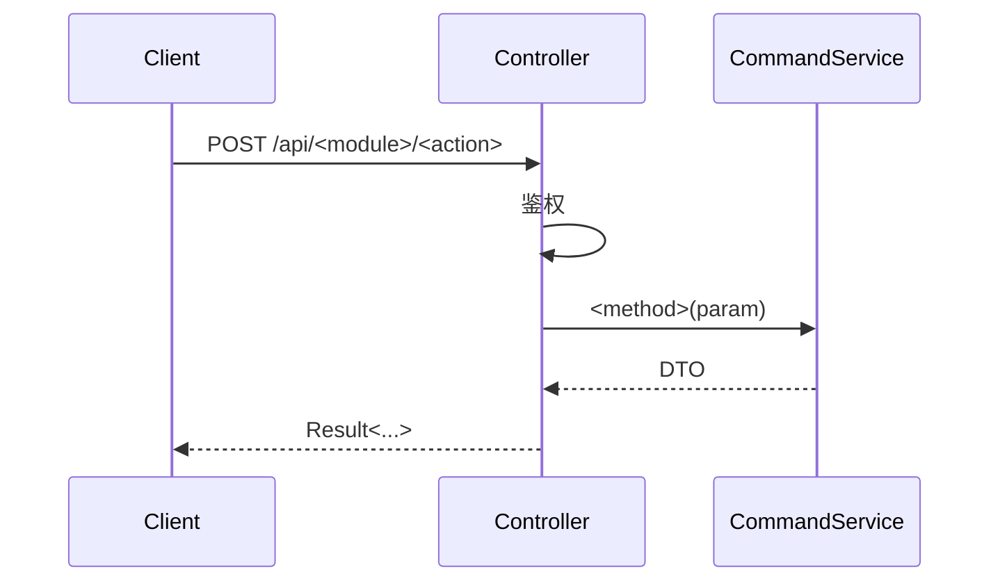

✅ Adapter 自检通过。

---

## 8. 数据库设计

### 8.1 表结构

#### `skills`

| 字段 | 类型 | 必填 | 索引 | 说明 |
|------|------|------|------|------|
| id | BIGINT | 是 | PK | |
| num | VARCHAR(32) | 是 | UK | SK+ts+rand |
| space_code | VARCHAR(32) | 是 | KEY | 所属空间业务编码 |
| name | VARCHAR(50) | 是 | UK with space_id, is_deleted | |
| description | VARCHAR(500) | 是 | — | |
| current_version_no | VARCHAR(20) | 否 | — | 最新生效版本号 |
| status | TINYINT(1) | 是 | KEY | 0=DRAFT 1=EFFECTIVE 2=WITHDRAWN（V1.3 新增） |
| tags_json | JSON | 否 | — | |
| remark | VARCHAR(200) | 否 | — | |
| 公共列 | — | — | — | |

#### `skill_versions`

| 字段 | 类型 | 必填 | 索引 | 说明 |
|------|------|------|------|------|
| id | BIGINT | 是 | PK | |
| num | VARCHAR(32) | 是 | UK | SKV+ts+rand |
| skill_code | VARCHAR(32) | 是 | KEY | 关联到 skill.num |
| version_no | VARCHAR(20) | 是 | UK with skill_id, is_deleted | |
| skill_md_content | MEDIUMTEXT | 是 | — | ≤ 1MB |
| status | TINYINT(1) | 是 | KEY | 0=DRAFT 1=EFFECTIVE 2=WITHDRAWN |
| publish_time | DATETIME(3) | 否 | — | |
| withdraw_time | DATETIME(3) | 否 | — | |
| 公共列 | — | — | — | |

#### `skill_resource_files`

| 字段 | 类型 | 必填 | 索引 | 说明 |
|------|------|------|------|------|
| id | BIGINT | 是 | PK | |
| num | VARCHAR(32) | 是 | UK | SKR+ts+rand |
| skill_version_code | VARCHAR(32) | 是 | KEY | 关联到 skill_version.num |
| path | VARCHAR(512) | 是 | UK with skill_version_id, is_deleted | 完整路径，含末尾 `/` 表示文件夹 |
| type | TINYINT(1) | 是 | — | 1=FILE 2=FOLDER |
| content | MEDIUMTEXT | 否 | — | 文件夹为空 |
| size_bytes | BIGINT | 否 | — | 仅文件 |
| 公共列 | — | — | — | |

### 8.2 DDL

```sql
CREATE TABLE `skills` (
  `id` BIGINT NOT NULL AUTO_INCREMENT,
  `num` VARCHAR(32) NOT NULL,
  `space_code` VARCHAR(32) NOT NULL,
  `name` VARCHAR(50) NOT NULL,
  `description` VARCHAR(500) NOT NULL,
  `current_version_no` VARCHAR(20) DEFAULT NULL,
  `status` TINYINT(1) NOT NULL DEFAULT 0 COMMENT '0=草稿 1=生效 2=下架',
  `tags_json` JSON DEFAULT NULL,
  `remark` VARCHAR(200) DEFAULT NULL,
  `create_no` VARCHAR(32) NOT NULL,
  `update_no` VARCHAR(32) NOT NULL,
  `create_time` DATETIME(3) NOT NULL DEFAULT CURRENT_TIMESTAMP(3),
  `update_time` DATETIME(3) NOT NULL DEFAULT CURRENT_TIMESTAMP(3) ON UPDATE CURRENT_TIMESTAMP(3),
  `is_deleted` TINYINT(1) NOT NULL DEFAULT 0,
  PRIMARY KEY (`id`),
  UNIQUE KEY `uk_num` (`num`),
  UNIQUE KEY `uk_space_name_deleted` (`space_code`, `name`, `is_deleted`),
  KEY `idx_space_status` (`space_code`, `status`, `is_deleted`)
) ENGINE=InnoDB DEFAULT CHARSET=utf8mb4 COLLATE=utf8mb4_unicode_ci COMMENT='Skill 主体';

CREATE TABLE `skill_versions` (
  `id` BIGINT NOT NULL AUTO_INCREMENT,
  `num` VARCHAR(32) NOT NULL,
  `skill_code` VARCHAR(32) NOT NULL,
  `version_no` VARCHAR(20) NOT NULL,
  `skill_md_content` MEDIUMTEXT NOT NULL,
  `status` TINYINT(1) NOT NULL DEFAULT 0,
  `publish_time` DATETIME(3) DEFAULT NULL,
  `withdraw_time` DATETIME(3) DEFAULT NULL,
  `create_no` VARCHAR(32) NOT NULL,
  `update_no` VARCHAR(32) NOT NULL,
  `create_time` DATETIME(3) NOT NULL DEFAULT CURRENT_TIMESTAMP(3),
  `update_time` DATETIME(3) NOT NULL DEFAULT CURRENT_TIMESTAMP(3) ON UPDATE CURRENT_TIMESTAMP(3),
  `is_deleted` TINYINT(1) NOT NULL DEFAULT 0,
  PRIMARY KEY (`id`),
  UNIQUE KEY `uk_num` (`num`),
  UNIQUE KEY `uk_skill_version_deleted` (`skill_code`, `version_no`, `is_deleted`),
  KEY `idx_skill_status` (`skill_code`, `status`, `is_deleted`)
) ENGINE=InnoDB DEFAULT CHARSET=utf8mb4 COLLATE=utf8mb4_unicode_ci COMMENT='Skill 版本';

CREATE TABLE `skill_resource_files` (
  `id` BIGINT NOT NULL AUTO_INCREMENT,
  `num` VARCHAR(32) NOT NULL,
  `skill_version_code` VARCHAR(32) NOT NULL,
  `path` VARCHAR(512) NOT NULL,
  `type` TINYINT(1) NOT NULL COMMENT '1=文件 2=文件夹',
  `content` MEDIUMTEXT,
  `size_bytes` BIGINT DEFAULT 0,
  `create_no` VARCHAR(32) NOT NULL,
  `update_no` VARCHAR(32) NOT NULL,
  `create_time` DATETIME(3) NOT NULL DEFAULT CURRENT_TIMESTAMP(3),
  `update_time` DATETIME(3) NOT NULL DEFAULT CURRENT_TIMESTAMP(3) ON UPDATE CURRENT_TIMESTAMP(3),
  `is_deleted` TINYINT(1) NOT NULL DEFAULT 0,
  PRIMARY KEY (`id`),
  UNIQUE KEY `uk_num` (`num`),
  UNIQUE KEY `uk_version_path_deleted` (`skill_version_code`, `path`, `is_deleted`),
  KEY `idx_version` (`skill_version_code`, `is_deleted`),
  KEY `idx_version_path_prefix` (`skill_version_code`, `path`)
) ENGINE=InnoDB DEFAULT CHARSET=utf8mb4 COLLATE=utf8mb4_unicode_ci COMMENT='Skill 资源文件';
```

### 8.3 DML（无）

✅ 自检通过。

---

## 9. 模块变更清单

| 层 | 内容 | Skill |
|----|------|------|
| client | 新增 skill.dto/param/vo | impl-client-module |
| domain | 新增 Skill / SkillVersion / SkillResourceFile 三聚合 / 工厂 / 网关 | impl-domain-module |
| infra | 新增三套 entity/mapper/repository/factory + GatewayImpl | impl-infra-module |
| application | 新增三套 command + query | impl-application-module |
| adapter | 新增三套 controller | impl-adapter-module |

---

## 10. 代码分支命名

```
feature-20260613-skill-management
```

---

## 11. 实现顺序

```
client → domain（先 Skill 再 SkillVersion 再 SkillResourceFile）
     → infra（同序）
     → application（先主体再版本再资源）
     → adapter（同序）
```

---

## 12. 接口与数据契约

参见 §7.2~7.4。

---

## 13. 其他

- frontmatter 解析使用 SnakeYAML（Spring Boot 自带）
- 资源文件树 path 命名：文件以正常 `templates/email.md`；文件夹以 `templates/` 结尾区分
- Agent 引用 Skill 通过 Skill 业务编码（不绑定版本），运行时按 `getEffectiveBySkill` 加载当前生效版本
