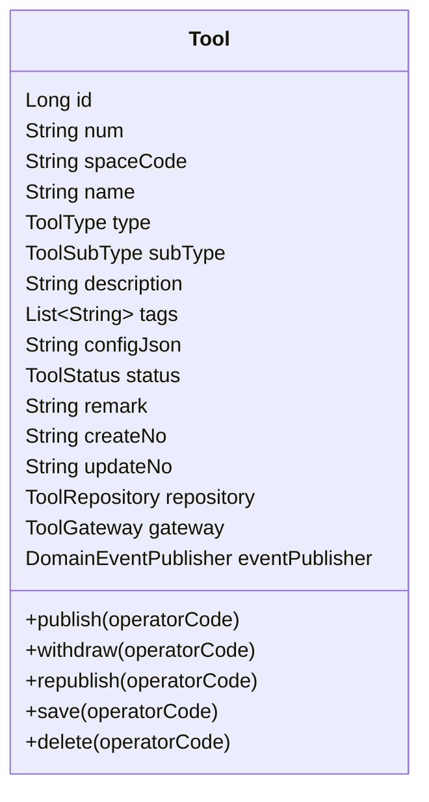
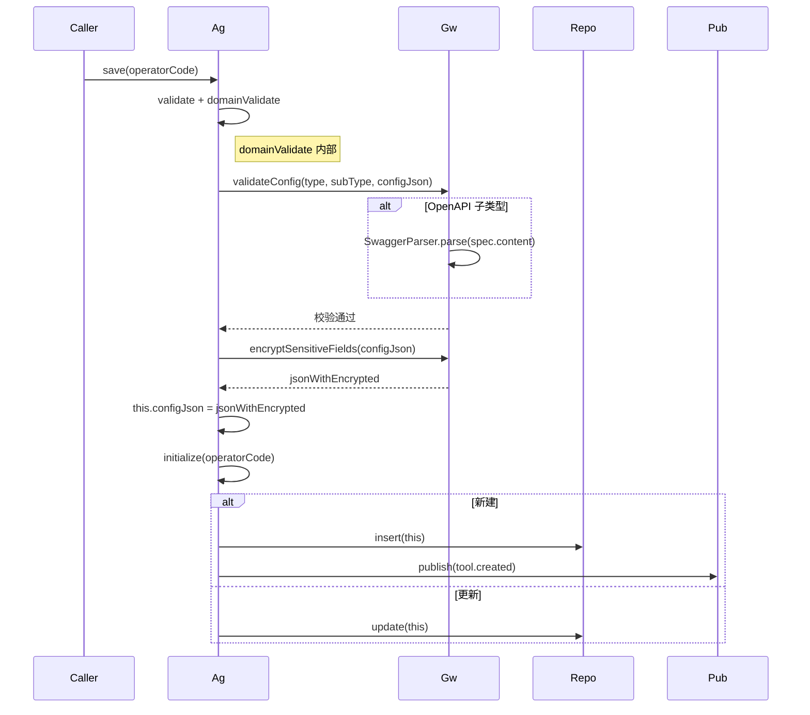
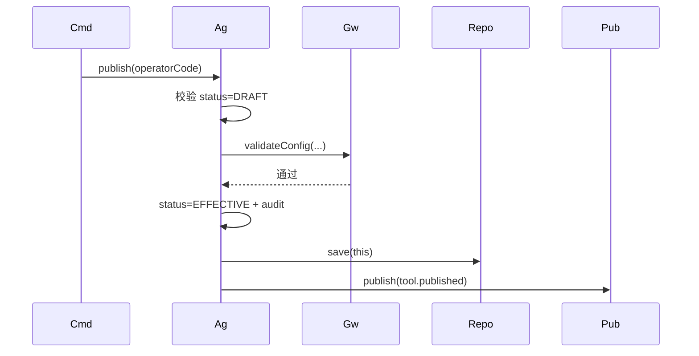
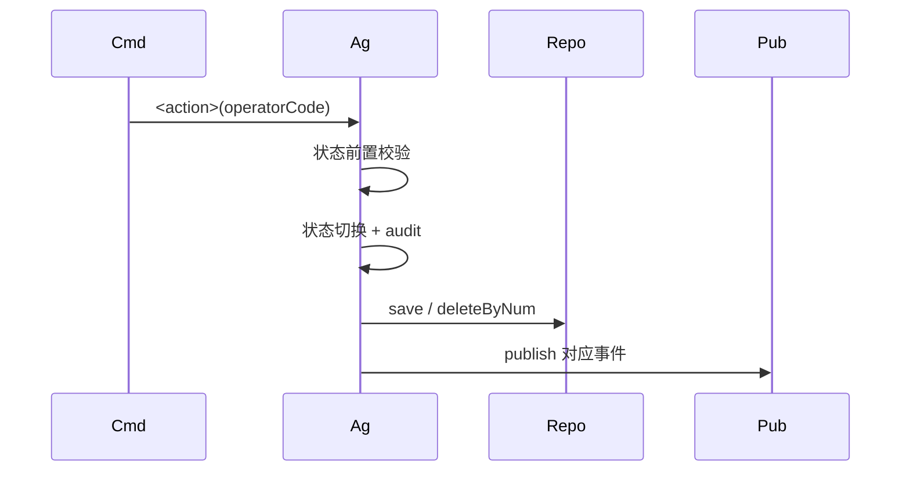
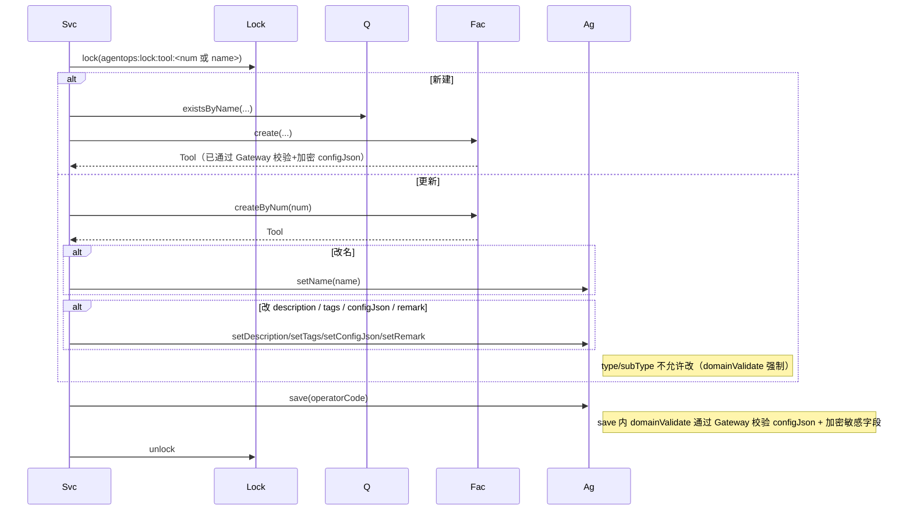
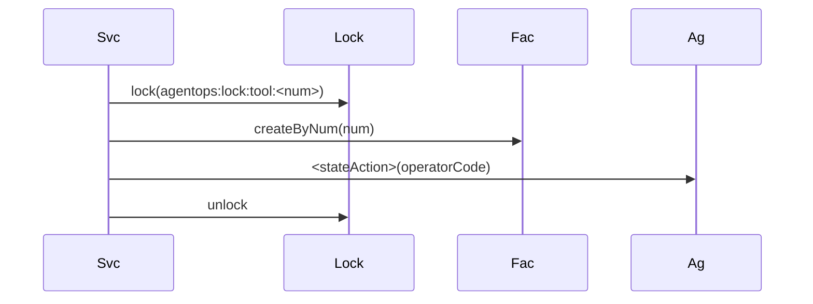
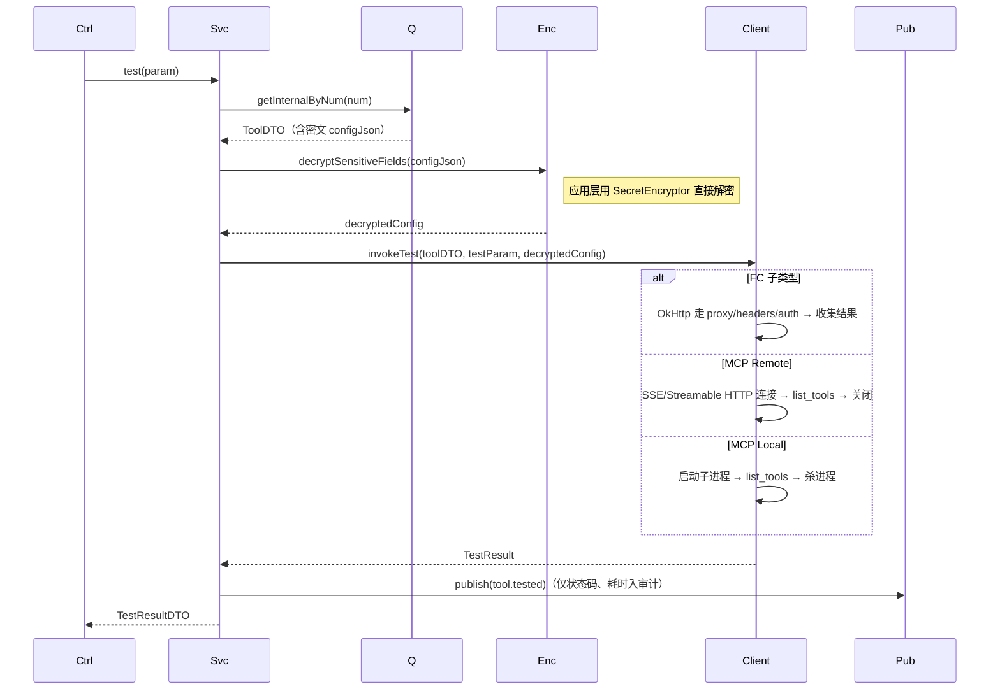
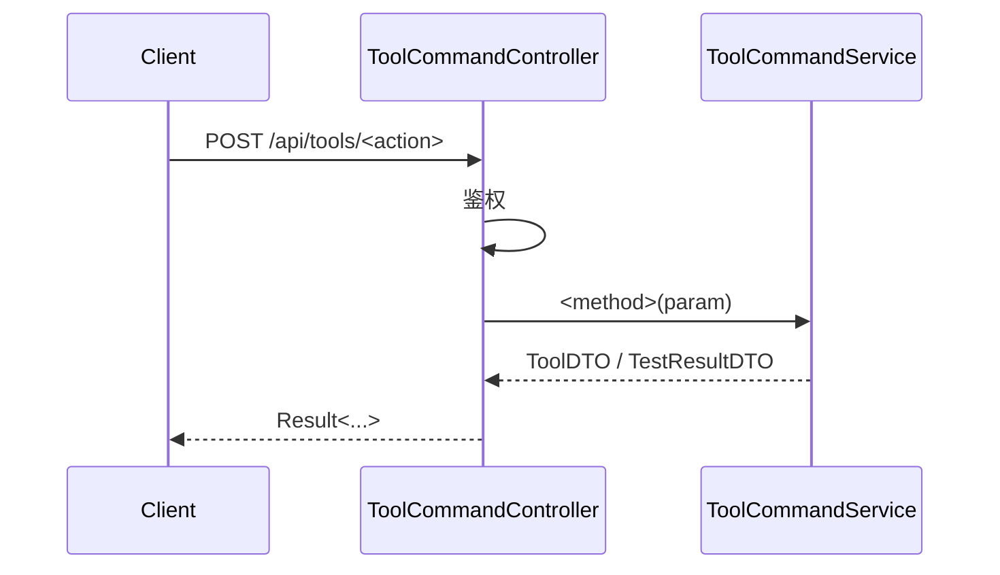

# AgentOps 平台 — 工具管理技术方案

| 文档版本 | 日期 | 编写人 | 说明 |
|---------|------|-------|------|
| V1.0 | 2026-06-13 | AgentOps Team | 工具管理技术方案初稿 |
| V1.1 | 2026-06-13 | AgentOps Team | 按"领域动作精简原则"修订（公共方案 §11.5）：移除 rename/updateConfig 领域方法；试运行 test 改为应用层能力；改字段改为 setter + save |
| V1.2 | 2026-06-13 | AgentOps Team | 按"领域网关使用约束"修订（公共方案 §11.6）：从 ToolGateway 移除 `decryptForRuntime` / `invokeTest` / `mask`；新增 application 层 `ToolTestClient` 接口由 infra 实现；脱敏与解密由 application 层 QueryService 直接处理 |
| V1.3 | 2026-06-13 | AgentOps Team | 状态枚举命名规范化：`LifecycleStatus` → `ToolStatus`（取值 DRAFT/EFFECTIVE/WITHDRAWN 不变），放在 `client.tool.enums` 包下 |
| V1.5 | 2026-06-13 | AgentOps Team | 跨领域引用统一为业务编码（公共方案 §10.2）：spaceId Long → spaceCode String；createNo/updateNo Long→String；operatorId Long → operatorCode String；DDL 列类型相应改为 VARCHAR(32) |

> 配套 PRD：`doc/产品方案/2026-06-13_工具管理-PRD.md`
> 公共约定：`doc/技术方案/2026-06-13_AgentOps公共技术方案.md`

---

## 1. 目标与范围

空间内工具管理：FunctionCall（OpenAPI / Endpoint）、MCP（Remote / Local）4 子类型；草稿/生效/下架三态；统一 Proxy + Headers + 鉴权；试运行测试。

不含：调用日志、版本管理、OAuth 流程托管、市场。

### 1.1 设计前问题对齐

继承公共方案 §1。本模块特有：
- 配置以 JSON LONGTEXT 存储，前后端按子类型加载 Schema 校验
- 类型与子类型保存后不可改
- 试运行通过后端代理发起，绕开浏览器 CORS
- OpenAPI 解析使用 `swagger-parser` 库（spring 兼容版本）

---

## 2. 架构设计

### 2.1 应用架构

| 层 | 领域 | 包 | 职责 |
|----|------|-----|------|
| client | tool | `com.agent.ops.client.tool.dto` | `ToolDTO` |
| client | tool | `com.agent.ops.client.tool.param` | `CreateToolParam` / `UpdateToolParam` / `ToolQueryParam` / `ToolTestParam` |
| client | tool | `com.agent.ops.client.tool.vo` | `ToolVO`（敏感字段脱敏） |
| client | tool | `com.agent.ops.client.tool.enums` | `ToolType`（FUNCTION_CALL/MCP）、`ToolSubType`（OPENAPI/ENDPOINT/REMOTE/LOCAL）、**`ToolStatus`（DRAFT/EFFECTIVE/WITHDRAWN）** |
| domain | tool | `com.agent.ops.domain.tool` | `Tool`（聚合根） |
| domain | tool | `com.agent.ops.domain.tool.repository` | `ToolRepository` |
| domain | tool | `com.agent.ops.domain.tool.factory` | `ToolFactory` |
| domain | tool | `com.agent.ops.domain.tool.gateway` | `ToolGateway`（仅本领域：编号生成 + configJson 校验 + 敏感字段加密） |
| domain | tool | `com.agent.ops.domain.tool.event` | `ToolEventConstant` |
| infra | tool | `com.agent.ops.infra.tool.entity` | `ToolEntity` |
| infra | tool | `com.agent.ops.infra.tool.mapper` | `ToolMapper` |
| infra | tool | `com.agent.ops.infra.tool.repository` | `ToolRepositoryImpl` |
| infra | tool | `com.agent.ops.infra.tool.factory` | `ToolFactoryImpl` |
| infra | tool | `com.agent.ops.infra.tool.gateway` | `ToolGatewayImpl`（注入 SwaggerParser + SecretEncryptor + BizCodeGenerator） |
| infra | tool | `com.agent.ops.infra.tool.client` | `ToolTestClientImpl`（实现 application 层 `ToolTestClient`；含 FunctionCallTester / McpRemoteTester / McpLocalTester 三类调度器） |
| application | tool | `com.agent.ops.application.tool.client` | `ToolTestClient`（application 层接口，定义 `invokeTest(toolDTO, testParam, decryptedConfig)`） |
| application | tool | `com.agent.ops.application.tool.command` | `ToolCommandService`（注入 ToolTestClient + SecretEncryptor） |
| application | tool | `com.agent.ops.application.tool.query` | `ToolQueryService`（脱敏由 SecretEncryptor.mask 直接处理） |
| adapter | tool | `com.agent.ops.adapter.tool.controller` | `ToolCommandController` / `ToolQueryController` |

### 2.2 部署架构

部署架构不变。本地 MCP 试运行启动子进程；生产部署需注意：本期试运行的本地 MCP 仅作连接性 list_tools 验证，5s 内启动并杀死进程；不支持长驻。

---

## 3. Facade 层设计

本次无 Facade 层变更。状态枚举 `ToolStatus` 放在 `client.tool.enums` 包下。

---

## 4. 领域层设计

### 4.1 业务层级划分

| 层级 | 领域 | 说明 |
|------|------|------|
| 空间内 | tool | 工具 |

### 4.2 工具（tool）

#### 4.2.1 领域模型

> 按公共方案 §11.5：类图仅展示属性 + 状态动作（publish/withdraw/republish）+ delete + save。试运行 test 不是领域动作，下沉到应用层；configJson 校验与敏感字段加密在 save 内通过 Gateway 自动完成。



| 对象 | 类型 | 关键属性 |
|------|------|---------|
| Tool | 聚合根 | type/subType（保存后不可改）/ configJson（按子类型不同 schema） |

#### 4.2.2 领域动作

仅保留状态/删除/save 三类（公共方案 §11.5）。改名/改 configJson/改描述/改标签/改备注由应用层 setter + save 完成；configJson 在 save 内通过 Gateway 自动校验并加密敏感字段。试运行 test 是应用层能力。

| 聚合 | 动作 | 类型 | 职责 | 前置 | 后置 | 事件 |
|------|------|------|------|------|------|------|
| Tool | `publish(operatorCode)` | 状态 | 草稿→生效 | 当前 = DRAFT；config 校验通过 | status=EFFECTIVE | `tool.tool.published` |
| Tool | `withdraw(operatorCode)` | 状态 | 生效→下架 | 当前 = EFFECTIVE | status=WITHDRAWN | `tool.tool.withdrawn` |
| Tool | `republish(operatorCode)` | 状态 | 下架→生效 | 当前 = WITHDRAWN | status=EFFECTIVE | `tool.tool.republished` |
| Tool | `delete(operatorCode)` | 删除 | 软删 | 当前 = DRAFT | is_deleted=1 | `tool.tool.deleted` |
| Tool | `save(operatorCode)` | 持久化 | validate + initialize；`domainValidate` 内调 `gateway.validateConfig` + `gateway.encryptSensitiveFields` 处理 configJson；type/subType 不可变 | — | — | 新建时 `tool.tool.created` |

> **试运行 test 不在领域层**：`ToolCommandService.test(ToolTestParam)` 在应用层加载 Tool 后调用 `ToolGateway.invokeTest(...)`。

##### 时序：`Tool.save(operatorCode)` —— 内含 config 校验与加密



##### 时序：`Tool.publish(operatorCode)`



##### 时序：`Tool.withdraw / republish / delete`（统一模板）



> 试运行由应用层 `ToolCommandService.test(...)` 编排（详见 §6.2.2）。

#### 4.2.3 领域规则

| 对象 | 规则 | 描述 | 违反 |
|------|------|------|------|
| Tool | 唯一性 | (space_id, name, is_deleted) 唯一 | `BizException` |
| Tool | 不可变 | type/subType 保存后不可改 | `BizException` |
| Tool | 必填 | name 1~50；config 经 schema 校验 | `BizException` |
| Tool | 状态 | 仅 DRAFT 可删 | `BizException` |
| Tool | Headers | 不允许覆盖系统保留头（Host/Content-Length/Connection/Transfer-Encoding/Upgrade/Proxy-Authorization） | `BizException` |
| Tool | Local MCP 命令 | 禁止 `;`/`&&`/`||`/`|`/`` ` ``/`$(` | `BizException` |
| Tool | Local MCP env | name 须 `^[A-Z_][A-Z0-9_]*$` | `BizException` |

#### 4.2.4 领域工厂

| Factory | 方法 | 入参 | 返回 | 职责 |
|---------|------|------|------|------|
| `ToolFactory` | `create(spaceId, name, type, subType, description, tags, configJson, remark)` | 用户填写字段 | `Tool` | 生成 num（TL）；调 gateway.validateConfig + encryptSensitiveFields；status=DRAFT |
| `ToolFactory` | `createByNum(num)` | num | `Tool` | — |

#### 4.2.5 领域网关

仅保留为本领域 save 服务的方法（公共方案 §11.6）。

| Gateway | 方法 | 入参 | 返回 | 职责 |
|---------|------|------|------|------|
| `ToolGateway` | `generateToolCode()` | — | String | BizCodeGenerator(`TL`) |
| `ToolGateway` | `validateConfig(type, subType, json)` | — | void | 按子类型 JSON Schema + 业务规则校验；OpenAPI 子类型用 SwaggerParser；由聚合根 save 时调用 |
| `ToolGateway` | `encryptSensitiveFields(json)` | json | json | 把鉴权字段、proxy.password、敏感 env 调 SecretEncryptor.encrypt；由聚合根 save 时调用 |

> ❌ **不再设计** `decryptForRuntime` / `invokeTest` / `mask`：
> - `decryptForRuntime`：解密属于运行时的展示/编排职责，应用层在调试时直接通过 `SecretEncryptor.decrypt` 处理
> - `invokeTest`：试运行调用是外部基础设施动作（HTTP/SSE/进程），由 application 层 `ToolTestClient` 接口承载（infra 实现）
> - `mask`：脱敏是展示职责，由 QueryService 直接调 `SecretEncryptor.mask`

#### 4.2.6 领域事件

| 事件 | 触发 | 载荷 |
|------|------|------|
| `tool.tool.created/published/withdrawn/republished/deleted` | 各对应动作 | toolNum |
| `tool.tool.tested` | 试运行 | toolNum / status / durationMs（不记录响应体） |

✅ 自检通过。

---

## 5. 基础设施层设计

| 类型 | 类名 | 包 | 是否新增 |
|------|------|-----|---------|
| Entity | `ToolEntity` | — | 新增 |
| Mapper | `ToolMapper` | — | 新增 |
| RepositoryImpl | `ToolRepositoryImpl` | — | 新增 |
| FactoryImpl | `ToolFactoryImpl` | — | 新增 |
| GatewayImpl | `ToolGatewayImpl` | 注入 SwaggerParser + SecretEncryptor + BizCodeGenerator；仅承载 generateToolCode / validateConfig / encryptSensitiveFields | 新增 |
| Client Impl | `ToolTestClientImpl` | `infra.tool.client`；实现 application 层 `ToolTestClient` 接口；按子类型派发 FunctionCallTester / McpRemoteTester / McpLocalTester；注入 OkHttpClient + SecretEncryptor 用于解密配置 | 新增 |
| 依赖 | `swagger-parser-v3:2.x` | Maven 依赖 | 新增 |

> ToolTestClientImpl 实现要点：
> - `FunctionCallTester`：解密入参中的敏感字段 → 构建 OkHttp Request → 注入 proxy/headers/auth → 发起 → 收集 status/duration/headers/body
> - `McpRemoteTester`：本期使用 `mcp-java-sdk`（如可用）或自实现 SSE 客户端，建立连接后调用 `tools/list`
> - `McpLocalTester`：使用 `ProcessBuilder` 启动进程；env 注入；超时 5s 后 destroy；通过 stdin/stdout JSON-RPC 调用 `tools/list`
> - 解密入口由 application 层 `ToolCommandService.test` 在调用前完成（用 `SecretEncryptor.decrypt` 处理 configJson 内敏感字段），把"明文 config"传给 `ToolTestClient`，避免在 client 内反向依赖加密器

✅ 自检通过。

---

## 6. 应用层设计

### 6.1 业务模块划分

仅一个：6.2 工具（tool）。

### 6.2 Service 方法清单

| Service | 方法 | 入参 | 返回 |
|---------|------|------|------|
| `ToolCommandService` | `create(CreateToolParam)` | — | `ToolDTO` |
| `ToolCommandService` | `update(UpdateToolParam)` | — | `ToolDTO` |
| `ToolCommandService` | `publish(num)` | — | `ToolDTO` |
| `ToolCommandService` | `withdraw(num)` | — | `ToolDTO` |
| `ToolCommandService` | `republish(num)` | — | `ToolDTO` |
| `ToolCommandService` | `delete(num)` | — | void |
| `ToolCommandService` | `test(ToolTestParam)` | num + 试运行入参 | `TestResultDTO` |
| `ToolQueryService` | `getByNum(num)` | — | `ToolDTO`（脱敏） |
| `ToolQueryService` | `pageBySpace(ToolQueryParam)` | space+keyword+type/subType/status | `PageResult<ToolVO>` |
| `ToolQueryService` | `getEffectiveList(spaceId)` | — | `List<ToolDTO>` | Agent 选入用 |
| `ToolQueryService` | `existsByName(spaceId, name)` | — | boolean | — |

### 6.2.2 时序

##### `ToolCommandService.create/update`（统一模板，**改字段：setter + save**）



##### `ToolCommandService.publish/withdraw/republish/delete`（状态/删除统一模板）



##### `ToolCommandService.test(ToolTestParam)` —— **应用层能力**



> 注：`test` 不加分布式锁（只读 + 无副作用）；应用层注入 `@Resource ToolTestClient`（application 层接口）+ `@Resource SecretEncryptor`，**不注入 ToolGateway**。

✅ 自检通过。

---

## 7. Adapter 层设计

### 7.1 业务模块划分

| 模块 | Controller |
|------|-----------|
| 7.2 工具 Command | `ToolCommandController` |
| 7.3 工具 Query | `ToolQueryController` |

### 7.2 Tool Command

| 方法 | 路径 | 入参 JSON | 返回 |
|------|------|----------|------|
| POST | `/api/tools/create` | `{"spaceNum":"SP...","name":"天气查询","type":"FUNCTION_CALL","subType":"OPENAPI","description":"...","tags":["..."],"configJson":"{...}","remark":""}` | `Result<ToolDTO>` |
| POST | `/api/tools/update` | `{"num":"TL...","name":"...","description":"...","tags":[],"configJson":"{...}","remark":""}` | `Result<ToolDTO>` |
| POST | `/api/tools/publish` | `{"num":"TL..."}` | `Result<ToolDTO>` |
| POST | `/api/tools/withdraw` | `{"num":"TL..."}` | `Result<ToolDTO>` |
| POST | `/api/tools/republish` | `{"num":"TL..."}` | `Result<ToolDTO>` |
| POST | `/api/tools/delete` | `{"num":"TL..."}` | `Result<Void>` |
| POST | `/api/tools/test` | `{"num":"TL...","testInput":{...}}`（FC：path/query/header/body 实参；MCP：可空） | `Result<TestResultDTO>` |

### 7.3 Tool Query

| 方法 | 路径 | 入参 | 返回 |
|------|------|------|------|
| GET | `/api/tools/get` | `?num=TL...` | `Result<ToolDTO>`（脱敏） |
| GET | `/api/tools/page` | `?spaceNum=&keyword=&type=&subType=&status=&pageNo=1&pageSize=20` | `Result<PageResult<ToolVO>>` |
| GET | `/api/tools/list-effective` | `?spaceNum=...` | `Result<List<ToolVO>>` |

#### 通用时序



✅ Adapter 自检通过。

---

## 8. 数据库设计

### 8.1 `tools`

| 字段 | 类型 | 必填 | 索引 | 说明 |
|------|------|------|------|------|
| id | BIGINT | 是 | PK | |
| num | VARCHAR(32) | 是 | UK | TL+ts+rand |
| space_code | VARCHAR(32) | 是 | KEY | 所属空间业务编码 |
| name | VARCHAR(50) | 是 | UK with space_id, is_deleted | |
| type | VARCHAR(20) | 是 | KEY | FUNCTION_CALL / MCP |
| sub_type | VARCHAR(20) | 是 | KEY | OPENAPI / ENDPOINT / REMOTE / LOCAL |
| description | VARCHAR(500) | 否 | — | |
| tags_json | JSON | 否 | — | |
| config_json | LONGTEXT | 是 | — | 配置 JSON（敏感字段密文） |
| status | TINYINT(1) | 是 | KEY | 0=DRAFT 1=EFFECTIVE 2=WITHDRAWN |
| remark | VARCHAR(200) | 否 | — | |
| 公共列 | — | — | — | |

### 8.2 DDL

```sql
CREATE TABLE `tools` (
  `id` BIGINT NOT NULL AUTO_INCREMENT,
  `num` VARCHAR(32) NOT NULL,
  `space_code` VARCHAR(32) NOT NULL,
  `name` VARCHAR(50) NOT NULL,
  `type` VARCHAR(20) NOT NULL COMMENT 'FUNCTION_CALL / MCP',
  `sub_type` VARCHAR(20) NOT NULL COMMENT 'OPENAPI / ENDPOINT / REMOTE / LOCAL',
  `description` VARCHAR(500) DEFAULT NULL,
  `tags_json` JSON DEFAULT NULL,
  `config_json` LONGTEXT NOT NULL,
  `status` TINYINT(1) NOT NULL DEFAULT 0,
  `remark` VARCHAR(200) DEFAULT NULL,
  `create_no` VARCHAR(32) NOT NULL,
  `update_no` VARCHAR(32) NOT NULL,
  `create_time` DATETIME(3) NOT NULL DEFAULT CURRENT_TIMESTAMP(3),
  `update_time` DATETIME(3) NOT NULL DEFAULT CURRENT_TIMESTAMP(3) ON UPDATE CURRENT_TIMESTAMP(3),
  `is_deleted` TINYINT(1) NOT NULL DEFAULT 0,
  PRIMARY KEY (`id`),
  UNIQUE KEY `uk_num` (`num`),
  UNIQUE KEY `uk_space_name_deleted` (`space_code`, `name`, `is_deleted`),
  KEY `idx_space_status` (`space_code`, `status`, `is_deleted`),
  KEY `idx_type` (`type`, `sub_type`)
) ENGINE=InnoDB DEFAULT CHARSET=utf8mb4 COLLATE=utf8mb4_unicode_ci COMMENT='工具';
```

### 8.3 DML（无）

✅ 自检通过。

---

## 9. 模块变更清单

| 层 | 内容 | Skill |
|----|------|------|
| client | 新增 tool.dto/param/vo/enums | impl-client-module |
| domain | 新增 tool 聚合 / 工厂 / 网关（仅 generateToolCode + validateConfig + encryptSensitiveFields） | impl-domain-module |
| infra | 新增 tool.entity/mapper/repository/factory/gateway + **ToolTestClientImpl**（含 3 子类型 Tester）+ swagger-parser 依赖 | impl-infra-module |
| application | 新增 tool.command（注入 ToolTestClient + SecretEncryptor）/ tool.query / **ToolTestClient 接口** | impl-application-module |
| adapter | 新增 tool.controller | impl-adapter-module |

---

## 10. 代码分支命名

```
feature-20260613-tool-management
```

---

## 11. 实现顺序

```
client → domain → infra（重点：ToolTester 3 子类型实现）→ application → adapter
```

---

## 12. 接口与数据契约

参见 §7.2 / §7.3。

`TestResultDTO` 结构：
```json
{
  "success": true,
  "durationMs": 234,
  "request": { "method":"POST", "url":"...", "headers":{...}, "body":"..." },
  "response": { "status": 200, "headers": {...}, "body": "..." },
  "errorMessage": null
}
```

---

## 13. 其他

- swagger-parser 引入：`io.swagger.parser.v3:swagger-parser:2.1.20`
- OkHttp 客户端复用既有；新增 Proxy 支持需在 OkHttp Builder 中按子类型动态构建
