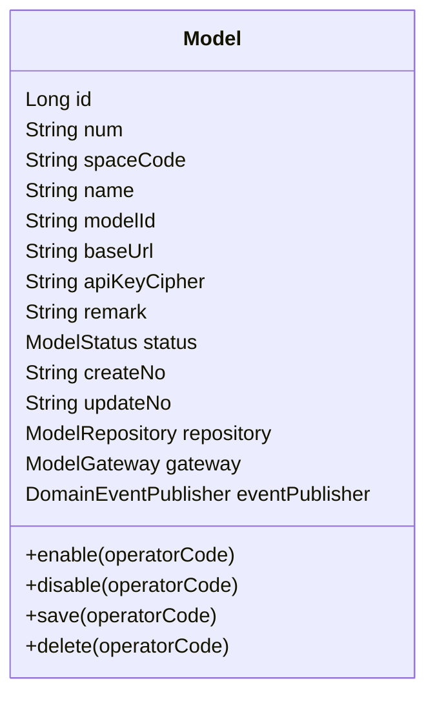
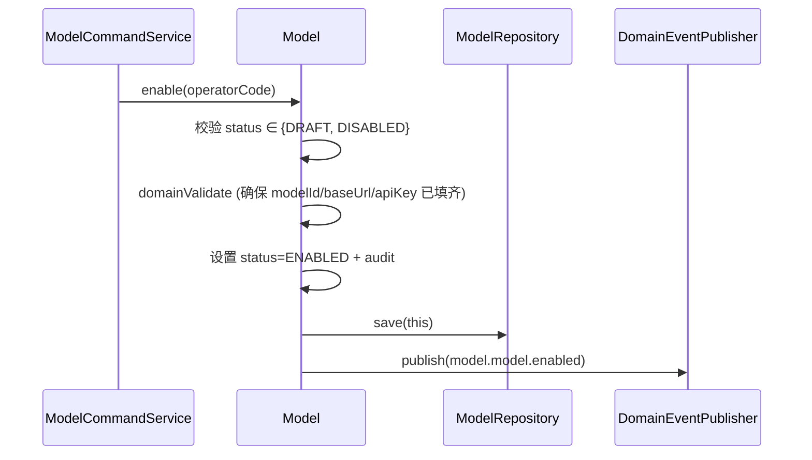
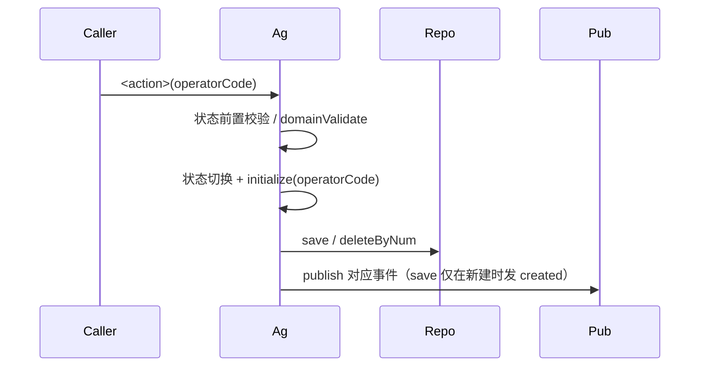
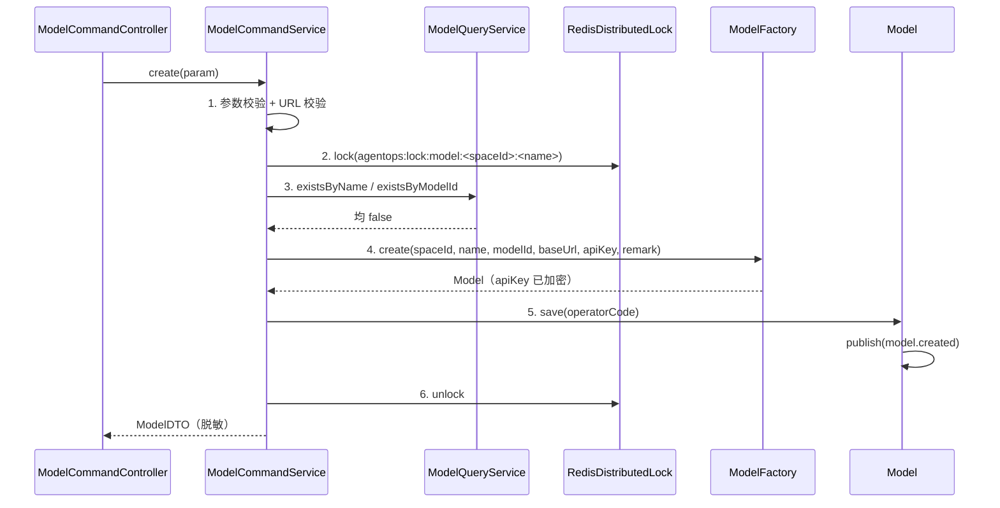
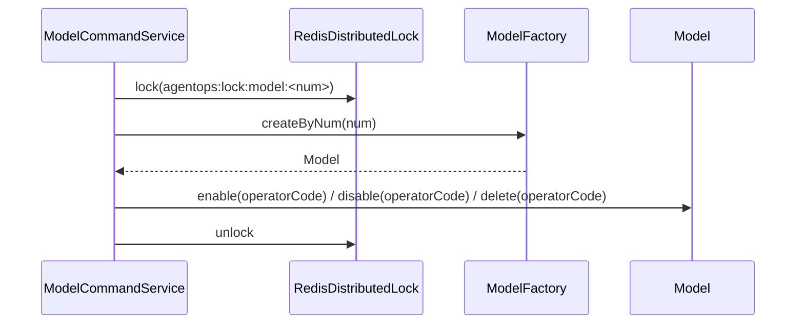
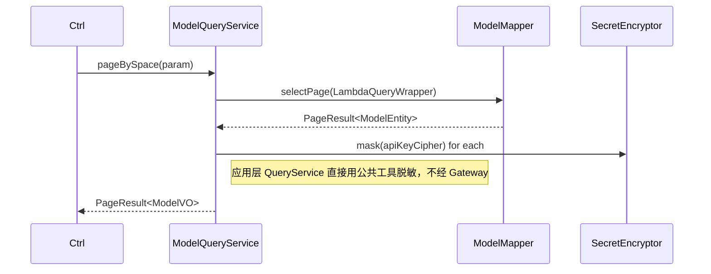
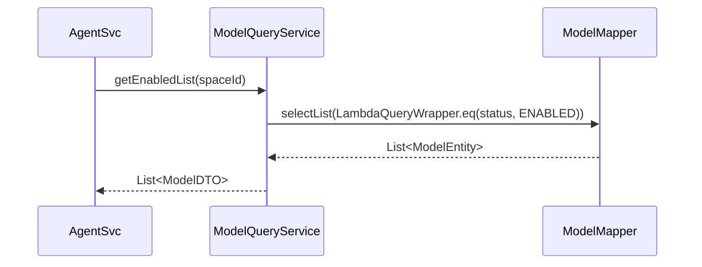
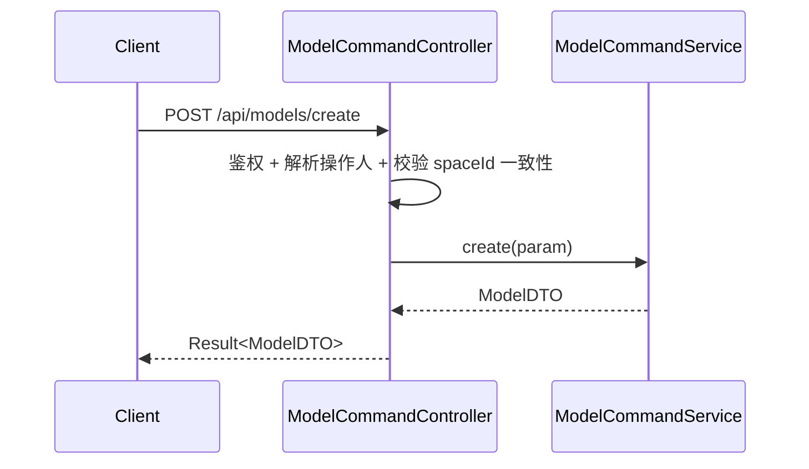

# AgentOps 平台 — 模型管理技术方案

| 文档版本 | 日期 | 编写人 | 说明 |
|---------|------|-------|------|
| V1.0 | 2026-06-13 | AgentOps Team | 模型管理技术方案初稿 |
| V1.1 | 2026-06-13 | AgentOps Team | 按"领域动作精简原则"修订（公共方案 §11.5）：移除 rename/updateConfig 领域方法；改为 setter + save |
| V1.2 | 2026-06-13 | AgentOps Team | 按"领域网关使用约束"修订（公共方案 §11.6）：从 ModelGateway 移除 `mask` 展示职能；脱敏由 QueryService 直接调用 `SecretEncryptor.mask` |
| V1.3 | 2026-06-13 | AgentOps Team | 状态枚举命名规范化：`ResourceStatus` → `ModelStatus`，放在 `client.model.enums` 包下 |
| V1.5 | 2026-06-13 | AgentOps Team | 跨领域引用统一为业务编码（公共方案 §10.2）：spaceId Long → spaceCode String；createNo/updateNo Long→String；operatorId Long → operatorCode String；DDL 列类型相应改为 VARCHAR(32) |

> 配套 PRD：`doc/产品方案/2026-06-13_模型管理-PRD.md`
> 公共约定：`doc/技术方案/2026-06-13_AgentOps公共技术方案.md`

---

## 1. 目标与范围

提供空间内的 LLM 模型注册、状态流转（草稿/启用/禁用）、API Key 加密与脱敏。本期不含模型连通性测试、用量统计。

### 1.1 设计前问题对齐

继承公共方案 §1。本模块特有：
- 模型为**空间内资源**（含 `space_id`）
- API Key 用 `SecretEncryptor.encrypt()` 加密入库
- 名称、模型标识在空间内分别唯一

---

## 2. 架构设计

### 2.1 应用架构

| 层 | 领域 | 包 | 职责 |
|----|------|-----|------|
| client | model | `com.agent.ops.client.model.dto` | `ModelDTO` |
| client | model | `com.agent.ops.client.model.param` | `CreateModelParam` / `UpdateModelParam` / `ModelQueryParam` |
| client | model | `com.agent.ops.client.model.vo` | `ModelVO`（脱敏） |
| client | model | `com.agent.ops.client.model.enums` | `ModelStatus`（DRAFT/ENABLED/DISABLED） |
| domain | model | `com.agent.ops.domain.model` | `Model`（聚合根） |
| domain | model | `com.agent.ops.domain.model.repository` | `ModelRepository` |
| domain | model | `com.agent.ops.domain.model.factory` | `ModelFactory` |
| domain | model | `com.agent.ops.domain.model.gateway` | `ModelGateway`（编号生成 + 加密器适配） |
| domain | model | `com.agent.ops.domain.model.event` | `ModelEventConstant` |
| infra | model | `com.agent.ops.infra.model.entity` | `ModelEntity` |
| infra | model | `com.agent.ops.infra.model.mapper` | `ModelMapper` |
| infra | model | `com.agent.ops.infra.model.repository` | `ModelRepositoryImpl` |
| infra | model | `com.agent.ops.infra.model.factory` | `ModelFactoryImpl` |
| infra | model | `com.agent.ops.infra.model.gateway` | `ModelGatewayImpl` |
| application | model | `com.agent.ops.application.model.command` | `ModelCommandService` |
| application | model | `com.agent.ops.application.model.query` | `ModelQueryService` |
| adapter | model | `com.agent.ops.adapter.model.controller` | `ModelCommandController` / `ModelQueryController` |

#### 模块调用关系

- 命令：`ModelCommandController` → `ModelCommandService` → `ModelFactory.create*` → 聚合根动作
- 查询：`ModelQueryController` → `ModelQueryService` → Mapper（带空间过滤）

### 2.2 部署架构

部署架构不变。

---

## 3. Facade 层设计

本次无 Facade 层变更（状态枚举 `ModelStatus` 放在 `client.model.enums` 包下，不进 facade）。

---

## 4. 领域层设计

### 4.1 业务层级划分

| 层级 | 领域 | 说明 |
|------|------|------|
| 空间内 | model | LLM 模型配置 |

### 4.2 模型（model）

#### 4.2.1 领域模型

> 按公共方案 §11.5：类图仅展示属性 + 状态动作（enable/disable）+ delete + save。



| 对象 | 类型 | 关键属性 | 说明 |
|------|------|---------|------|
| Model | 聚合根 | spaceId / name / modelId / baseUrl / apiKeyCipher / status | apiKeyCipher 内部存密文（enc:v1:xxx） |

#### 4.2.2 领域动作

仅保留状态/删除/save 三类（公共方案 §11.5）。改名/改 modelId/改 baseUrl/改 apiKey/改 remark 由应用层 setter + save 完成；apiKey 加密由应用层在 setter 前调用 `ModelGateway.encrypt(...)`。

| 聚合 | 动作 | 类型 | 职责 | 前置 | 后置/规则 | 事件 |
|------|------|------|------|------|----------|------|
| Model | `enable(operatorCode)` | 状态 | 启用 | 当前 ∈ {DRAFT, DISABLED} | status=ENABLED + audit + save | `model.model.enabled` |
| Model | `disable(operatorCode)` | 状态 | 禁用 | 当前 = ENABLED | status=DISABLED + save | `model.model.disabled` |
| Model | `delete(operatorCode)` | 删除 | 软删 | 当前 = DRAFT | is_deleted=1 | `model.model.deleted` |
| Model | `save(operatorCode)` | 持久化 | validate + initialize + repo.save；新建发 created；domainValidate 校验 name/modelId 唯一性、URL 格式、apiKey 非空、启用前必填齐 | — | — | 新建时 `model.model.created` |

##### 时序：`Model.enable(operatorCode)`



##### 时序：`Model.disable / delete / save`（统一模板）



> 字段修改不再设计领域方法；apiKey 加密在应用层调用 `ModelGateway.encrypt` 后通过 setter 写入聚合根。

#### 4.2.3 领域规则

| 对象 | 规则 | 描述 | 违反 |
|------|------|------|------|
| Model | 唯一性 | name 在 (space_id, is_deleted=0) 内唯一 | `BizException("MODEL_NAME_DUPLICATED")` |
| Model | 唯一性 | modelId 在 (space_id, is_deleted=0) 内唯一 | `BizException("MODEL_IDENTIFIER_DUPLICATED")` |
| Model | 必填 | name 1~50；modelId 1~100；baseUrl 须 http(s):// 开头；apiKey 1~500 | `BizException` |
| Model | 状态 | 仅 DRAFT 可删 | `BizException("MODEL_NOT_DELETABLE")` |
| Model | 状态 | 启用前必须填齐 modelId / baseUrl / apiKeyCipher | `BizException("MODEL_NOT_READY")` |

#### 4.2.4 领域工厂

| Factory | 方法 | 入参 | 返回 | 职责 |
|---------|------|------|------|------|
| `ModelFactory` | `create(spaceId, name, modelId, baseUrl, apiKey, remark)` | 用户填写字段 | `Model` | 生成 num（前缀 MD）；通过 gateway.encrypt 处理 apiKey；status 默认 DRAFT |
| `ModelFactory` | `createByNum(num)` | num | `Model` | 通过 Repository 加载 |

#### 4.2.5 领域网关

仅保留为本领域 save/encrypt 服务的方法（公共方案 §11.6）。

| Gateway | 方法 | 入参 | 返回 | 职责 | 失败 |
|---------|------|------|------|------|------|
| `ModelGateway` | `generateModelCode()` | — | String | 委托 BizCodeGenerator | 抛异常 |
| `ModelGateway` | `encrypt(plaintext)` | 明文 | 密文 | 委托 SecretEncryptor；由 save 时聚合根内调用 | 抛异常 |

> ❌ **不再设计** `mask`：脱敏是展示职责，由 application 层 QueryService 在装配 VO 时直接调用 `SecretEncryptor.mask(...)`（公共工具）。

#### 4.2.6 领域事件

| 事件名 | 触发 | 载荷 | 订阅 |
|--------|------|------|------|
| `model.model.created` | 新建 | spaceNum / modelNum / modelId | 审计 |
| `model.model.enabled` | 启用 | modelNum | 审计 |
| `model.model.disabled` | 禁用 | modelNum | Agent 模块（订阅以提示已引用此模型的 Agent） |
| `model.model.deleted` | 软删 | modelNum | 审计 |

✅ **领域层自检**通过。

---

## 5. 基础设施层设计

| 类型 | 类名 | 包 | 对应 | 是否新增 |
|------|------|----|------|---------|
| Entity | `ModelEntity` | `infra.model.entity` | models 表 | 新增 |
| Mapper | `ModelMapper` | `infra.model.mapper` | — | 新增 |
| RepositoryImpl | `ModelRepositoryImpl` | `infra.model.repository` | — | 新增 |
| FactoryImpl | `ModelFactoryImpl` | `infra.model.factory` | 委托 BizCodeGenerator + SecretEncryptor | 新增 |
| GatewayImpl | `ModelGatewayImpl` | `infra.model.gateway` | 委托 BizCodeGenerator + SecretEncryptor | 新增 |

✅ 自检通过。

---

## 6. 应用层设计

### 6.1 业务模块划分

仅一个模块：6.2 模型（model）。

### 6.2 模型（model）

#### 6.2.1 Service 方法清单

| Service | 方法 | 入参 | 返回 | 职责 |
|---------|------|------|------|------|
| `ModelCommandService` | `create(CreateModelParam)` | 全部新建字段 | `ModelDTO` | 新建（DRAFT） |
| `ModelCommandService` | `update(UpdateModelParam)` | num+可改字段 | `ModelDTO` | 编辑 |
| `ModelCommandService` | `enable(num)` | num | `ModelDTO` | 启用 |
| `ModelCommandService` | `disable(num)` | num | `ModelDTO` | 禁用 |
| `ModelCommandService` | `delete(num)` | num | void | 软删（仅 DRAFT） |
| `ModelQueryService` | `getByNum(num)` | num | `ModelDTO`（脱敏） | — |
| `ModelQueryService` | `getInternalByNum(num)` | num | `ModelDTO`（含密文） | 仅供 Agent 装配预检调用 |
| `ModelQueryService` | `pageBySpace(ModelQueryParam)` | spaceId+keyword+status | `PageResult<ModelVO>` | 列表 |
| `ModelQueryService` | `existsByName(spaceId, name)` | — | boolean | 唯一性校验 |
| `ModelQueryService` | `existsByModelId(spaceId, modelId)` | — | boolean | 唯一性校验 |
| `ModelQueryService` | `getEnabledList(spaceId)` | — | `List<ModelDTO>` | Agent 装配选入对话框用 |

#### 6.2.2 方法时序逻辑

##### `ModelCommandService.create(...)`



##### `ModelCommandService.update(...)` —— **改字段：setter + save**

> 修订说明（V1.2）：apiKey 加密由聚合根 `Model.save()` 内部通过 `ModelGateway.encrypt(...)` 处理（属于"为本领域 save 服务"的合规 Gateway 用法）。应用层仅判断 apiKey 是否为脱敏占位决定是否更新；不直接调用 ModelGateway。

```mermaid
sequenceDiagram
    Svc->>Lock: lock(agentops:lock:model:<num>)
    Svc->>Fac: createByNum(num)
    Fac-->>Svc: Model
    Svc->>Svc: 应用层 setter
    alt 改名
      Svc->>Ag: setName(name)
    end
    Svc->>Ag: setModelId(modelId) / setBaseUrl(baseUrl) / setRemark(remark)
    alt apiKey 非空且非脱敏占位
        Svc->>Ag: setApiKeyPlaintext(apiKey)
        Note right of Ag: 聚合根用瞬时字段持有明文，save 内由 Gateway.encrypt 转密文写入 apiKeyCipher
    end
    Svc->>Ag: save(operatorCode)
    Ag->>Ag: domainValidate (校验唯一性 + URL + 必填)
    alt apiKeyPlaintext 非空
        Ag->>Gw: encrypt(apiKeyPlaintext)
        Gw-->>Ag: enc:v1:xxx
        Ag->>Ag: this.apiKeyCipher = ciphertext; apiKeyPlaintext = null
    end
    Ag->>Repo: update(this)
    Svc->>Lock: unlock
```

> 应用层**不直接**调用 `ModelGateway`；加密在聚合根 save 内完成（Gateway 由聚合根持有，符合 §11.6 "为本领域 save 服务"）。

##### `ModelCommandService.enable(num)` / `disable(num)` / `delete(num)`



##### `ModelQueryService.pageBySpace(...)`



##### `ModelQueryService.getEnabledList(spaceId)`



✅ 自检通过。

---

## 7. Adapter 层设计

### 7.1 业务模块划分

仅一个模块。

### 7.2 模型

| 方法 | 路径 | 入参 JSON | 返回 JSON |
|------|------|----------|----------|
| POST | `/api/models/create` | `{"spaceNum":"SP...","name":"通用对话","modelId":"claude-sonnet-4-6","baseUrl":"https://...","apiKey":"sk-...","remark":""}` | `Result<ModelDTO>` |
| POST | `/api/models/update` | `{"num":"MD...","name":"...","modelId":"...","baseUrl":"...","apiKey":"<脱敏占位或新值>","remark":""}` | `Result<ModelDTO>` |
| POST | `/api/models/enable` | `{"num":"MD..."}` | `Result<ModelDTO>` |
| POST | `/api/models/disable` | `{"num":"MD..."}` | `Result<ModelDTO>` |
| POST | `/api/models/delete` | `{"num":"MD..."}` | `Result<Void>` |
| GET | `/api/models/get` | `?num=MD...` | `Result<ModelDTO>`（apiKey 脱敏） |
| GET | `/api/models/page` | `?spaceNum=&keyword=&status=&pageNo=1&pageSize=20` | `Result<PageResult<ModelVO>>` |
| GET | `/api/models/list-enabled` | `?spaceNum=...` | `Result<List<ModelVO>>`（仅 Agent 装配选入对话框使用） |

#### 时序：`POST /api/models/create`



其他接口同结构（鉴权 → Service → Result）。

✅ Adapter 自检通过。

---

## 8. 数据库设计

### 8.1 表结构

#### `models`

| 字段 | 类型 | 必填 | 索引 | 说明 |
|------|------|------|------|------|
| id | BIGINT | 是 | PK | |
| num | VARCHAR(32) | 是 | UK | MD+ts+rand |
| space_code | VARCHAR(32) | 是 | KEY | 所属空间业务编码 |
| name | VARCHAR(50) | 是 | UK with space_id, is_deleted | |
| model_id | VARCHAR(100) | 是 | UK with space_id, is_deleted | |
| base_url | VARCHAR(500) | 是 | — | |
| api_key_cipher | VARCHAR(2048) | 是 | — | enc:v1:base64 |
| remark | VARCHAR(200) | 否 | — | |
| status | TINYINT(1) | 是 | KEY | 0=DRAFT 1=ENABLED 2=DISABLED |
| create_no/update_no/create_time/update_time/is_deleted | 公共列 | 是 | — | |

### 8.2 DDL

```sql
CREATE TABLE `models` (
  `id` BIGINT NOT NULL AUTO_INCREMENT,
  `num` VARCHAR(32) NOT NULL COMMENT '业务编码 MD+ts+rand',
  `space_code` VARCHAR(32) NOT NULL,
  `name` VARCHAR(50) NOT NULL,
  `model_id` VARCHAR(100) NOT NULL COMMENT '调用 LLM 时传给供应商的 model 参数',
  `base_url` VARCHAR(500) NOT NULL,
  `api_key_cipher` VARCHAR(2048) NOT NULL COMMENT 'AES-GCM 密文 enc:v1:base64',
  `remark` VARCHAR(200) DEFAULT NULL,
  `status` TINYINT(1) NOT NULL DEFAULT 0 COMMENT '0=草稿 1=启用 2=禁用',
  `create_no` VARCHAR(32) NOT NULL,
  `update_no` VARCHAR(32) NOT NULL,
  `create_time` DATETIME(3) NOT NULL DEFAULT CURRENT_TIMESTAMP(3),
  `update_time` DATETIME(3) NOT NULL DEFAULT CURRENT_TIMESTAMP(3) ON UPDATE CURRENT_TIMESTAMP(3),
  `is_deleted` TINYINT(1) NOT NULL DEFAULT 0,
  PRIMARY KEY (`id`),
  UNIQUE KEY `uk_num` (`num`),
  UNIQUE KEY `uk_space_name_deleted` (`space_code`, `name`, `is_deleted`),
  UNIQUE KEY `uk_space_model_id_deleted` (`space_code`, `model_id`, `is_deleted`),
  KEY `idx_space_status` (`space_code`, `status`, `is_deleted`)
) ENGINE=InnoDB DEFAULT CHARSET=utf8mb4 COLLATE=utf8mb4_unicode_ci COMMENT='模型表';
```

### 8.3 DML（无）

✅ 自检通过。

---

## 9. 模块变更清单

| 层 | 内容 | Skill |
|----|------|------|
| client | 新增 model.dto/param/vo | impl-client-module |
| domain | 新增 model 聚合 / 工厂 / 网关 / 事件 | impl-domain-module |
| infra | 新增 model.entity/mapper/repository/factory/gateway | impl-infra-module |
| application | 新增 model.command / model.query | impl-application-module |
| adapter | 新增 model.controller | impl-adapter-module |

---

## 10. 代码分支命名

```
feature-20260613-model-management
```

---

## 11. 实现顺序

```
client → domain → infra → application → adapter
```

---

## 12. 接口与数据契约

参见 §7.2。所有响应统一 `Result<T>`。

---

## 13. 其他

- 依赖公共方案 §7（SecretEncryptor）已实现并可用
- Agent 模块发布预检需调用 `ModelQueryService.getByNum(num)` 校验 status=ENABLED
