# AgentOps 平台 — 沙箱管理技术方案

| 文档版本 | 日期 | 编写人 | 说明 |
|---------|------|-------|------|
| V1.0 | 2026-06-13 | AgentOps Team | 沙箱管理技术方案初稿 |
| V1.1 | 2026-06-13 | AgentOps Team | 按"领域动作精简原则"修订：周期探活下沉到应用层；非状态字段修改改为 setter + save |
| V1.2 | 2026-06-13 | AgentOps Team | 按"领域网关使用约束"修订（公共方案 §11.6）：从 SandboxGateway 移除 `resolveBaseUrl` / `probe` 跨领域+外部调用方法；新增 application 层 `SandboxProbeClient` 接口由 infra 实现；resolveBaseUrl 也改由应用层调 SystemSettingQueryService 计算 |
| V1.3 | 2026-06-13 | AgentOps Team | 状态枚举包路径规范化：`SandboxStatus` 已在 `client.sandbox.enums`，名称符合 V1.3 命名约定，无需重命名 |
| V1.5 | 2026-06-13 | AgentOps Team | 跨领域引用统一为业务编码（公共方案 §10.2）：spaceId Long → spaceCode String；createNo/updateNo Long→String；operatorCode=SYSTEM 改为字符串常量 SYSTEM；DDL 列类型相应改为 VARCHAR(32) |

> 配套 PRD：`doc/产品方案/2026-06-13_沙箱管理-PRD.md`
> 公共约定：`doc/技术方案/2026-06-13_AgentOps公共技术方案.md`（特别参考 §11.5 领域动作精简原则）

---

## 1. 目标与范围

空间内沙箱管理：注册沙箱、定时探活、自动状态流转（草稿/初始化中/在线/离线/禁用）、人工禁用/启用。

### 1.1 设计前问题对齐

继承公共方案 §1。本模块特有：
- 状态机有 5 个状态，子状态由系统驱动；用户操作仅 草稿→初始化中、X→禁用、禁用→初始化中
- **周期探活属于应用层能力**，不是领域动作（V1.1 修订）；通过 Spring `@Scheduled` + Redis 锁触发
- 沙箱接入地址支持「实例覆盖」与「系统设置默认」两级

### 1.2 V1.1 修订要点

按公共方案 §11.5 「领域动作精简原则」：
- ❌ 移除 `Sandbox.rename / updateConfig / heartbeat`（heartbeat 不是领域动作）
- ✅ 保留 `submit / disable / reEnable / markOnline / markOffline / delete / save` 七个领域动作
- 字段修改（rename/改 image/改 baseUrlOverride/改 remark）由应用层 setter + `save(operatorCode)` 完成
- **周期探活**职责下沉到 `SandboxHeartbeatScheduler`（adapter）→ `SandboxCommandService.runHeartbeat(num)`（application）

### 1.3 V1.2 修订要点

按公共方案 §11.6 「领域网关使用约束」：
- ❌ 从 `SandboxGateway` 移除 `resolveBaseUrl(sandbox)` / `probe(baseUrl)` 两个方法 —— 前者需要查 system_settings 跨领域数据、后者是外部 HTTP 调用，都不属于"为领域模型服务"
- ✅ `SandboxGateway` 仅保留 `generateSandboxCode()`（本领域业务编码生成）
- ✅ 新增 application 层接口 `SandboxProbeClient`（包：`com.agent.ops.application.sandbox.client`），定义 `probe(baseUrl)` 方法；infra 层 `SandboxProbeClientImpl` 实现 HTTP 调用
- ✅ `resolveBaseUrl` 计算逻辑搬到 `SandboxCommandService.runHeartbeat` 内：通过 `@Resource SystemSettingQueryService systemSettingQueryService` 取系统默认地址，与实例 baseUrlOverride 合并
- ✅ 应用层注入 `@Resource SandboxProbeClient` + `@Resource SystemSettingQueryService`，禁止注入 `SandboxGateway` 用于查 system_settings 或发起 HTTP

---

## 2. 架构设计

### 2.1 应用架构

| 层 | 领域 | 包 | 职责 |
|----|------|-----|------|
| client | sandbox | `com.agent.ops.client.sandbox.dto` | `SandboxDTO` |
| client | sandbox | `com.agent.ops.client.sandbox.param` | `CreateSandboxParam` / `UpdateSandboxParam` / `SandboxQueryParam` |
| client | sandbox | `com.agent.ops.client.sandbox.vo` | `SandboxVO` |
| client | sandbox | `com.agent.ops.client.sandbox.enums` | `SandboxStatus` |
| domain | sandbox | `com.agent.ops.domain.sandbox` | `Sandbox`（聚合根） |
| domain | sandbox | `com.agent.ops.domain.sandbox.repository` | `SandboxRepository` |
| domain | sandbox | `com.agent.ops.domain.sandbox.factory` | `SandboxFactory` |
| domain | sandbox | `com.agent.ops.domain.sandbox.gateway` | `SandboxGateway`（仅业务编码生成；不涉及外部调用与跨领域） |
| domain | sandbox | `com.agent.ops.domain.sandbox.event` | `SandboxEventConstant` |
| infra | sandbox | `com.agent.ops.infra.sandbox.entity` | `SandboxEntity` |
| infra | sandbox | `com.agent.ops.infra.sandbox.mapper` | `SandboxMapper` |
| infra | sandbox | `com.agent.ops.infra.sandbox.repository` | `SandboxRepositoryImpl` |
| infra | sandbox | `com.agent.ops.infra.sandbox.factory` | `SandboxFactoryImpl` |
| infra | sandbox | `com.agent.ops.infra.sandbox.gateway` | `SandboxGatewayImpl`（仅委托 BizCodeGenerator） |
| infra | sandbox | `com.agent.ops.infra.sandbox.client` | `SandboxProbeClientImpl`（实现 application 层 SandboxProbeClient；注入 RestTemplate） |
| application | sandbox | `com.agent.ops.application.sandbox.client` | `SandboxProbeClient`（application 层接口，定义 `probe(baseUrl)`） |
| application | sandbox | `com.agent.ops.application.sandbox.command` | `SandboxCommandService`（注入 SystemSettingQueryService + SandboxProbeClient；含 runHeartbeat 应用层方法） |
| application | sandbox | `com.agent.ops.application.sandbox.query` | `SandboxQueryService` |
| adapter | sandbox | `com.agent.ops.adapter.sandbox.controller` | `SandboxCommandController` / `SandboxQueryController` |
| adapter | sandbox | `com.agent.ops.adapter.sandbox.scheduler` | `SandboxHeartbeatScheduler` |

### 2.2 部署架构

部署架构不变。Scheduler 在所有应用实例运行，通过 Redis 锁选举。

---

## 3. Facade 层设计

本次无 Facade 层变更（沙箱 5 态枚举放在 client.sandbox.enums，因仅本领域使用）。

---

## 4. 领域层设计

### 4.1 业务层级划分

| 层级 | 领域 | 说明 |
|------|------|------|
| 空间内 | sandbox | 沙箱实例 |

### 4.2 沙箱（sandbox）

#### 4.2.1 领域模型

> 按公共方案 §11.5：类图仅展示属性 + 状态动作 + delete + save；不出现 `rename` / `updateConfig` / `heartbeat` 等。

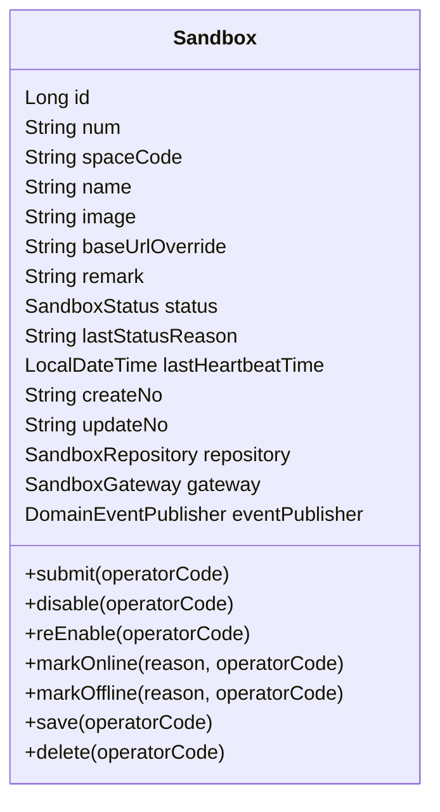

| 对象 | 类型 | 关键属性 |
|------|------|---------|
| Sandbox | 聚合根 | spaceId / name / image / baseUrlOverride / status / lastStatusReason / lastHeartbeatTime |

> 字段修改：name / image / baseUrlOverride / remark 通过 `@Setter` 暴露给应用层；应用层修改后调用 `save(operatorCode)`，由 `domainValidate()` 校验业务不变式。

#### 4.2.2 领域动作

仅保留状态变化 + 删除 + save：

| 聚合 | 动作 | 类型 | 职责 | 前置 | 后置 | 事件 |
|------|------|------|------|------|------|------|
| Sandbox | `submit(operatorCode)` | 状态 | 草稿→初始化中（提交） | 当前 = DRAFT | status=INITIALIZING + audit | `sandbox.sandbox.submitted` |
| Sandbox | `disable(operatorCode)` | 状态 | X→禁用（人工禁用） | 当前 ≠ DRAFT | status=DISABLED + audit | `sandbox.sandbox.disabled` |
| Sandbox | `reEnable(operatorCode)` | 状态 | 禁用→初始化中（人工启用） | 当前 = DISABLED | status=INITIALIZING + audit | `sandbox.sandbox.re_enabled` |
| Sandbox | `markOnline(reason, operatorCode)` | 状态 | 标在线（探活成功后由应用层调用） | 当前 ∈ {INITIALIZING, ONLINE, OFFLINE} | status=ONLINE; lastStatusReason=reason; lastHeartbeatTime=now | `sandbox.sandbox.online` |
| Sandbox | `markOffline(reason, operatorCode)` | 状态 | 标离线（探活失败后由应用层调用） | 当前 ∈ {INITIALIZING, ONLINE, OFFLINE} | status=OFFLINE; lastStatusReason=reason; lastHeartbeatTime=now | `sandbox.sandbox.offline` |
| Sandbox | `delete(operatorCode)` | 删除 | 软删 | 当前 = DRAFT | is_deleted=1 | `sandbox.sandbox.deleted` |
| Sandbox | `save(operatorCode)` | 持久化 | validate + initialize + repository.save；新建时发 `created` | — | — | 新建时 `sandbox.sandbox.created` |

##### 时序：`Sandbox.submit(operatorCode)`

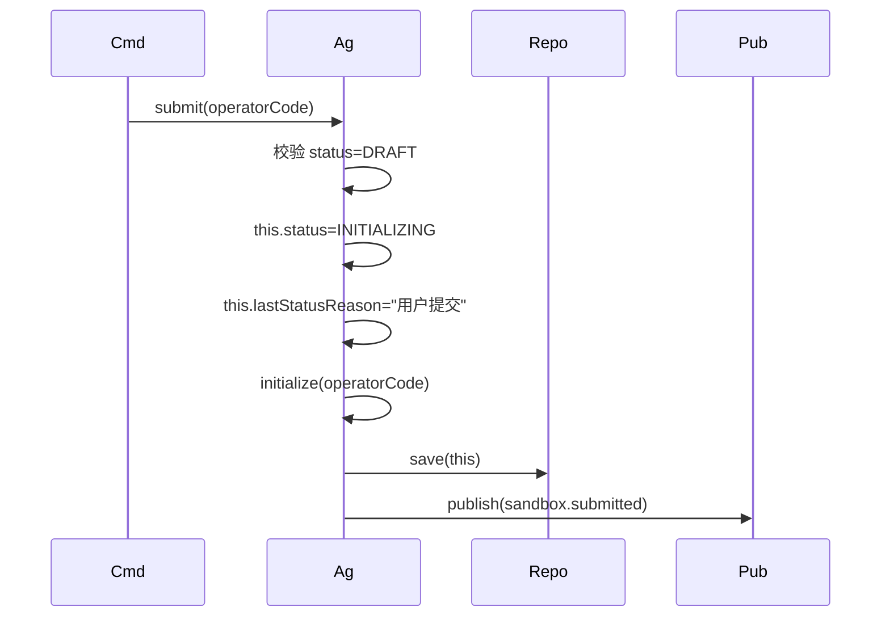

##### 时序：`Sandbox.markOnline / markOffline / disable / reEnable / delete`（统一模板）

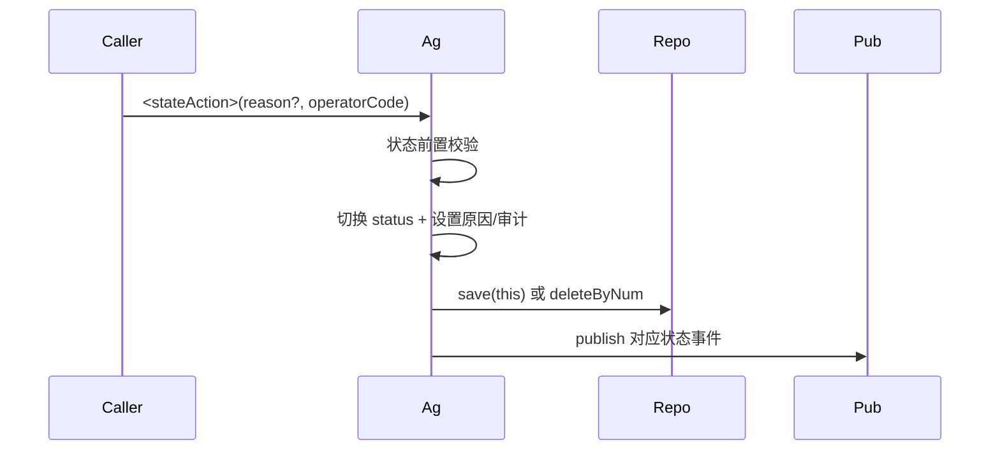

##### 时序：`Sandbox.save(operatorCode)`（统一模板）

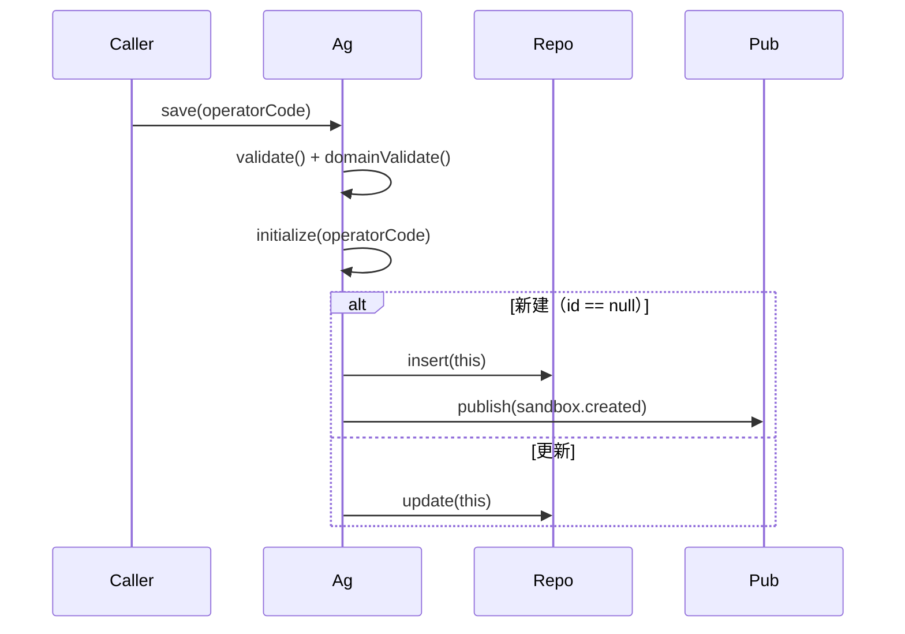

> **不再设计 `heartbeat()` 领域方法**。周期探活由 `SandboxCommandService.runHeartbeat(num)` 应用层方法承担：通过 `SystemSettingQueryService` 取默认地址、通过 `SandboxProbeClient.probe(...)` 发起 HTTP 探活，根据探活结果调用 `Sandbox.markOnline` 或 `Sandbox.markOffline`。

#### 4.2.3 领域规则

| 对象 | 规则 | 描述 | 违反 |
|------|------|------|------|
| Sandbox | 唯一性 | (space_id, name, is_deleted) 唯一 | `BizException` |
| Sandbox | 必填 | name 1~50；image 1~200 | `BizException` |
| Sandbox | 不可变 | 当 status ∉ {DRAFT, DISABLED} 时 image 不允许修改（在 `domainValidate` 中校验） | `BizException` |
| Sandbox | 状态 | 用户状态操作仅 submit / disable / reEnable；其他状态切换仅由探活流程触发 markOnline / markOffline | `BizException` |

#### 4.2.4 领域工厂

| Factory | 方法 | 入参 | 返回 | 职责 |
|---------|------|------|------|------|
| `SandboxFactory` | `create(spaceId, name, image, baseUrlOverride, remark)` | 用户填写字段 | `Sandbox` | 生成 num（SB）；status=DRAFT |
| `SandboxFactory` | `createByNum(num)` | num | `Sandbox` | 通过 Repo 加载并装配领域协作依赖 |

#### 4.2.5 领域网关

仅保留本领域业务编码生成（公共方案 §11.6）。

| Gateway | 方法 | 入参 | 返回 | 职责 |
|---------|------|------|------|------|
| `SandboxGateway` | `generateSandboxCode()` | — | String | BizCodeGenerator(`SB`) |

> ❌ **不再设计** `resolveBaseUrl` / `probe`：前者跨领域查 system_settings、后者是外部 HTTP，违反 §11.6；改由应用层 `SandboxCommandService` 通过注入 `SystemSettingQueryService` + `SandboxProbeClient` 实现。

#### 4.2.6 领域事件

| 事件 | 触发 | 载荷 |
|------|------|------|
| `sandbox.sandbox.created` | 首次 save | sandboxNum |
| `sandbox.sandbox.submitted/disabled/re_enabled/online/offline/deleted` | 各状态动作 | sandboxNum / reason（如适用） |

✅ **领域层自检**：六节齐备；类图仅含状态动作 + delete + save；非状态字段修改未出现在领域方法清单；周期探活、试运行等已剔除领域层。

---

## 5. 基础设施层设计

| 类型 | 类名 | 包 | 是否新增 |
|------|------|-----|---------|
| Entity | `SandboxEntity` | — | 新增 |
| Mapper | `SandboxMapper` | — | 新增 |
| RepositoryImpl | `SandboxRepositoryImpl` | — | 新增 |
| FactoryImpl | `SandboxFactoryImpl` | — | 新增 |
| GatewayImpl | `SandboxGatewayImpl` | 仅委托 `BizCodeGenerator` 生成 SB 编码 | 新增 |
| Client Impl | `SandboxProbeClientImpl` | `infra.sandbox.client`；实现 application 层 `SandboxProbeClient` 接口；注入 `RestTemplate`；HTTP GET `<baseUrl>/health` 超时 5s | 新增 |

✅ 自检通过。

---

## 6. 应用层设计

### 6.1 业务模块划分

仅一个：6.2 沙箱（sandbox）。

### 6.2 Service 方法清单

| Service | 方法 | 入参 | 返回 | 备注 |
|---------|------|------|------|------|
| `SandboxCommandService` | `create(CreateSandboxParam)` | — | `SandboxDTO` | 新建（DRAFT） |
| `SandboxCommandService` | `update(UpdateSandboxParam)` | num+name/image/baseUrlOverride/remark | `SandboxDTO` | **改字段类**：setter + save，无领域状态切换 |
| `SandboxCommandService` | `submit(num)` | — | `SandboxDTO` | 状态：→ INITIALIZING |
| `SandboxCommandService` | `disable(num)` | — | `SandboxDTO` | 状态：→ DISABLED |
| `SandboxCommandService` | `reEnable(num)` | — | `SandboxDTO` | 状态：→ INITIALIZING |
| `SandboxCommandService` | `delete(num)` | — | void | 软删（仅 DRAFT） |
| `SandboxCommandService` | `runHeartbeat(num)` | — | void | **应用层探活**：注入 `SystemSettingQueryService` 解析 baseUrl，注入 `SandboxProbeClient` 发起 HTTP，再根据结果调 markOnline/markOffline |
| `SandboxQueryService` | `getByNum(num)` | — | `SandboxDTO` | — |
| `SandboxQueryService` | `pageBySpace(SandboxQueryParam)` | — | `PageResult<SandboxVO>` | — |
| `SandboxQueryService` | `listProbeable()` | — | `List<SandboxDTO>` | status ∈ {INITIALIZING,ONLINE,OFFLINE} |
| `SandboxQueryService` | `getAvailableList(spaceId)` | — | `List<SandboxDTO>` | 非禁用且非草稿，Agent 装配选入 |

### 6.2.2 时序

##### `SandboxCommandService.create(CreateSandboxParam)`

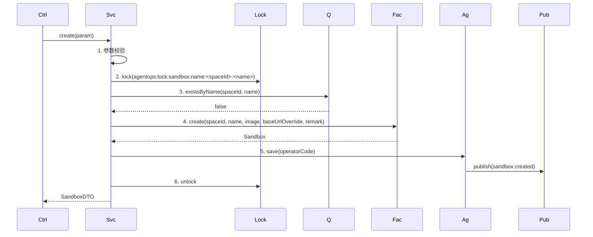

##### `SandboxCommandService.update(UpdateSandboxParam)` —— **改字段：setter + save**

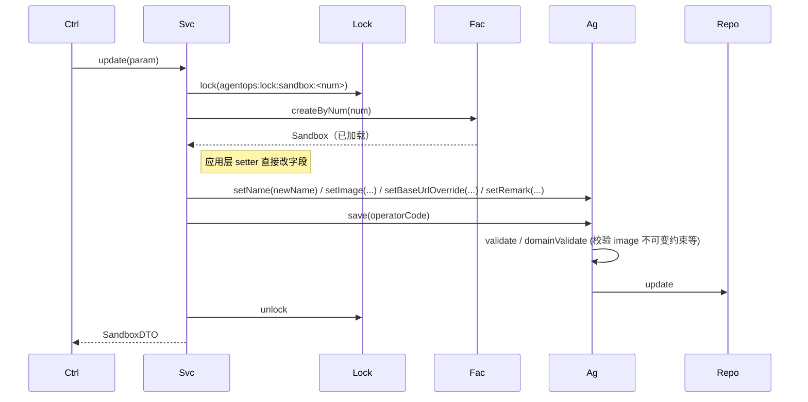

##### `SandboxCommandService.submit / disable / reEnable / delete`（状态/删除统一模板）

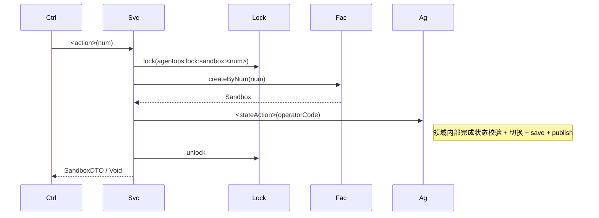

##### `SandboxCommandService.runHeartbeat(num)` —— **应用层探活核心**

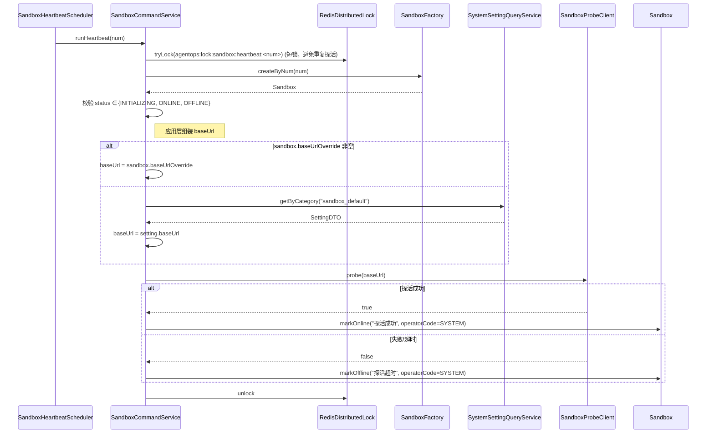

##### `SandboxQueryService.listProbeable()`

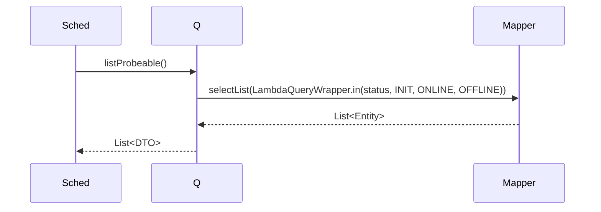

✅ **应用层自检**：CommandService 加锁；**应用层未注入 SandboxGateway**；跨领域取数据通过对方 `SystemSettingQueryService`，外部 HTTP 通过 application 层 `SandboxProbeClient` 接口（infra 实现）；@Resource 注入。完全符合公共方案 §11.6 领域网关使用约束。

---

## 7. Adapter 层设计

### 7.1 业务模块划分

| 模块 | 入口 |
|------|-----|
| 7.2 沙箱 Command | `SandboxCommandController` |
| 7.3 沙箱 Query | `SandboxQueryController` |
| 7.4 沙箱探活 | `SandboxHeartbeatScheduler` |

### 7.2 Sandbox Command

| 方法 | 路径 | 入参 JSON | 返回 |
|------|------|----------|------|
| POST | `/api/sandboxes/create` | `{"spaceNum":"SP...","name":"default","image":"agentops/sandbox:latest","baseUrlOverride":"","remark":""}` | `Result<SandboxDTO>` |
| POST | `/api/sandboxes/update` | `{"num":"SB...","name":"...","image":"...","baseUrlOverride":"...","remark":""}` | `Result<SandboxDTO>` |
| POST | `/api/sandboxes/submit` | `{"num":"SB..."}` | `Result<SandboxDTO>` |
| POST | `/api/sandboxes/disable` | `{"num":"SB..."}` | `Result<SandboxDTO>` |
| POST | `/api/sandboxes/re-enable` | `{"num":"SB..."}` | `Result<SandboxDTO>` |
| POST | `/api/sandboxes/delete` | `{"num":"SB..."}` | `Result<Void>` |

### 7.3 Sandbox Query

| 方法 | 路径 | 入参 | 返回 |
|------|------|------|------|
| GET | `/api/sandboxes/get` | `?num=SB...` | `Result<SandboxDTO>` |
| GET | `/api/sandboxes/page` | `?spaceNum=&keyword=&status=&pageNo=1&pageSize=20` | `Result<PageResult<SandboxVO>>` |
| GET | `/api/sandboxes/list-available` | `?spaceNum=...` | `Result<List<SandboxVO>>` |

#### 时序（统一）

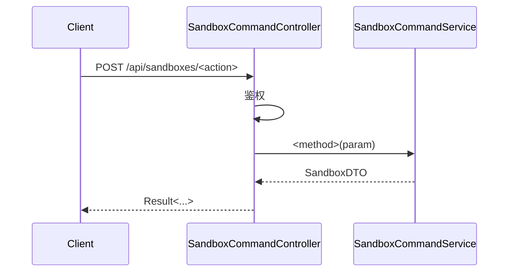

### 7.4 探活 Scheduler

| 任务名 | Cron | 幂等 | 并发 | 调用 Service | 失败处理 |
|--------|------|------|------|-------------|---------|
| `sandboxHeartbeat` | 每 30s 一次（`@Scheduled(fixedDelay=30000)`） | 通过 Redis 锁 `agentops:lock:scheduler:sandbox-heartbeat` 确保单实例运行 | 同一时刻仅一个实例 | `SandboxQueryService.listProbeable()` 后逐个 `runHeartbeat(num)`，使用 4 路并发 | 探活失败转 OFFLINE；连续 N 次失败由订阅器告警（本期仅日志） |

#### 时序

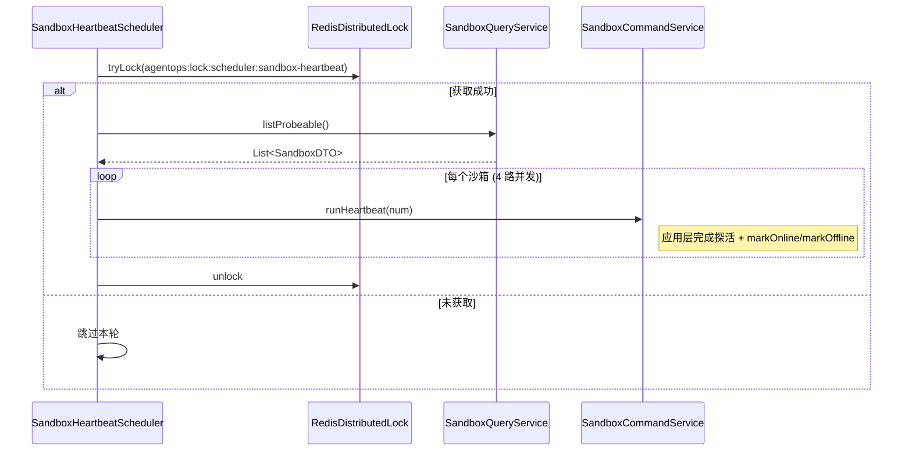

✅ Adapter 自检通过。

---

## 8. 数据库设计

### 8.1 `sandboxes`

| 字段 | 类型 | 必填 | 索引 | 说明 |
|------|------|------|------|------|
| id | BIGINT | 是 | PK | |
| num | VARCHAR(32) | 是 | UK | SB+ts+rand |
| space_code | VARCHAR(32) | 是 | KEY | 所属空间业务编码 |
| name | VARCHAR(50) | 是 | UK with space_id, is_deleted | |
| image | VARCHAR(200) | 是 | — | |
| base_url_override | VARCHAR(500) | 否 | — | 实例覆盖 |
| remark | VARCHAR(200) | 否 | — | |
| status | TINYINT(1) | 是 | KEY | 0=DRAFT 1=INIT 2=ONLINE 3=OFFLINE 4=DISABLED |
| last_status_reason | VARCHAR(200) | 否 | — | |
| last_heartbeat_time | DATETIME(3) | 否 | KEY | 最近探活时刻 |
| 公共列 | — | — | — | |

### 8.2 DDL

```sql
CREATE TABLE `sandboxes` (
  `id` BIGINT NOT NULL AUTO_INCREMENT,
  `num` VARCHAR(32) NOT NULL,
  `space_code` VARCHAR(32) NOT NULL,
  `name` VARCHAR(50) NOT NULL,
  `image` VARCHAR(200) NOT NULL,
  `base_url_override` VARCHAR(500) DEFAULT NULL,
  `remark` VARCHAR(200) DEFAULT NULL,
  `status` TINYINT(1) NOT NULL DEFAULT 0 COMMENT '0=草稿 1=初始化中 2=在线 3=离线 4=禁用',
  `last_status_reason` VARCHAR(200) DEFAULT NULL,
  `last_heartbeat_time` DATETIME(3) DEFAULT NULL,
  `create_no` VARCHAR(32) NOT NULL,
  `update_no` VARCHAR(32) NOT NULL,
  `create_time` DATETIME(3) NOT NULL DEFAULT CURRENT_TIMESTAMP(3),
  `update_time` DATETIME(3) NOT NULL DEFAULT CURRENT_TIMESTAMP(3) ON UPDATE CURRENT_TIMESTAMP(3),
  `is_deleted` TINYINT(1) NOT NULL DEFAULT 0,
  PRIMARY KEY (`id`),
  UNIQUE KEY `uk_num` (`num`),
  UNIQUE KEY `uk_space_name_deleted` (`space_code`, `name`, `is_deleted`),
  KEY `idx_status` (`status`, `is_deleted`),
  KEY `idx_space_status` (`space_code`, `status`, `is_deleted`)
) ENGINE=InnoDB DEFAULT CHARSET=utf8mb4 COLLATE=utf8mb4_unicode_ci COMMENT='沙箱';
```

✅ 自检通过。

---

## 9. 模块变更清单

| 层 | 内容 | Skill |
|----|------|------|
| client | 新增 sandbox.dto/param/vo/enums | impl-client-module |
| domain | 新增 Sandbox 聚合（仅 submit/disable/reEnable/markOnline/markOffline/delete/save 七个方法）/ 工厂 / 网关（仅业务编码生成） | impl-domain-module |
| infra | 新增 sandbox.entity/mapper/repository/factory/gateway + **SandboxProbeClientImpl** | impl-infra-module |
| application | 新增 sandbox.command（含 runHeartbeat；注入 SystemSettingQueryService + SandboxProbeClient）/ sandbox.query / **SandboxProbeClient 接口** | impl-application-module |
| adapter | 新增 sandbox.controller + scheduler | impl-adapter-module |

---

## 10. 代码分支命名

```
feature-20260613-sandbox-management
```

---

## 11. 实现顺序

```
client → domain → infra → application（重点：runHeartbeat 应用层编排）→ adapter (含 Scheduler)
```

---

## 12. 接口与数据契约

参见 §7.2~7.4。

---

## 13. 其他

- 探活间隔可在系统设置 `sandbox_default.heartbeatIntervalSec`（本期默认 30s 硬编码）
- HTTP 探活路径默认 `/health`，未来可配置
- 应用层 `runHeartbeat` 操作人 ID 使用系统保留 ID `0L`（与 `space_member` 等模块约定一致）
