# AgentOps 平台 — 空间管理技术方案

| 文档版本 | 日期 | 编写人 | 说明 |
|---------|------|-------|------|
| V1.0 | 2026-06-13 | AgentOps Team | 空间管理技术方案初稿 |
| V1.1 | 2026-06-13 | AgentOps Team | 按"领域动作精简原则"修订（公共方案 §11.5）：非状态字段修改（rename/updateDescription/updateIcon/changeRole）改为 setter + save |
| V1.3 | 2026-06-13 | AgentOps Team | 状态枚举命名规范化：新增 `SpaceStatus`（ENABLED 单态，预留扩展），放在 `client.space.enums` 包下 |
| V1.4 | 2026-06-13 | AgentOps Team | **取消 `SpaceMember` 实体**：合并到 `Space` 聚合根上，新增 `adminUserIds: List<Long>` 与 `memberUserIds: List<Long>` 两列；删除 `space_members` 表与全部 SpaceMember* 类；成员加入/移除/改角色变成 Space 主体的 setter + save |
| V1.5 | 2026-06-13 | AgentOps Team | 跨领域引用全部改为业务编码（公共方案 §10.2）：`ownerUserId Long → ownerUserCode String`；`adminUserIds List<Long> → adminUserCodes List<String>`；`memberUserIds List<Long> → memberUserCodes List<String>`；`createNo/updateNo` Long→String；DDL 列类型相应改为 VARCHAR(32) / JSON(string array) |

> 配套 PRD：`doc/产品方案/2026-06-13_空间管理-PRD.md`
> 公共约定：`doc/技术方案/2026-06-13_AgentOps公共技术方案.md`（特别参考 §11.5 领域动作精简原则）

---

## 1. 目标与范围

### 1.1 目标

提供 AgentOps **平台级** 的空间（Space）管理能力，作为其他空间内资源（模型/Prompt/Skill/工具/沙箱/Agent）的归属容器。

### 1.2 范围

**包含**：空间 CRUD（卡片视图）、成员加入/移除（管理员/普通成员两类）、确认输入式删除、当前空间切换上下文、空间级配额校验入口（仅占位，配额值由系统设置承载）。

**不包含**：空间内资源管理（各资源模块独立方案承载）、跨空间资源迁移、空间归档恢复、复杂角色（仅管理员/普通成员两类）。

### 1.3 设计前对齐

继承公共方案 §1 全部决策。本模块特有：
- 空间为**平台级表**（无 space_id 列）
- **成员关系作为 Space 聚合根上的两个字符串列表字段，不抽象为独立实体**（V1.4 决策；V1.5 类型由 Long 改为 String）：
  - `adminUserCodes: List<String>` —— 管理员用户业务编码列表（含 owner）
  - `memberUserCodes: List<String>` —— 普通成员用户业务编码列表
  - 数据库列均为 JSON 类型，存 String 数组
- 删除采用确认输入式（输入名称匹配后才能软删）

### 1.4 V1.4 修订要点（取消 SpaceMember 实体）

**原因**：成员关系本身不具备独立的生命周期、状态机或业务行为；强行抽象成 `SpaceMember` 实体只是把"修改角色"包装成"领域方法"，并未带来任何业务表达力提升，反而引入：
- 一张维表 `space_members` + 一套 Mapper/Repository/Factory/RepositoryImpl/FactoryImpl
- 一组独立的 SpaceMemberCommandService / SpaceMemberQueryService / Controller
- 跨表事务（创建空间时同时插主表 + 成员表）
- 跨表查询（查我的空间时先查 member 再 join space）

合并为 Space 聚合根上的两个 `List<Long>` 字段后：
- 成员关系完全表达为 Space 自身的属性
- 加成员/移除/改角色 = 操作 Space 的两个列表后 save
- 查我的空间 = `WHERE JSON_CONTAINS(admin_user_codes, JSON_QUOTE(?)) OR JSON_CONTAINS(member_user_codes, JSON_QUOTE(?))`（按用户业务编码 String 包含查询）
- 全部 SpaceMember* 类删除

---

## 2. 架构设计

### 2.1 应用架构

#### 代码结构

| 层 | 领域 | 包 | 职责 |
|----|------|-----|------|
| facade | space | `com.agent.ops.facade.common.context` | `SpaceContext` 持有当前空间编码与角色（已存在） |
| client | space | `com.agent.ops.client.space.enums` | `SpaceStatus`（ENABLED；预留扩展）、`SpaceRoleType`（ADMIN=1 / MEMBER=2） |
| client | space | `com.agent.ops.client.space.dto` | `SpaceDTO` |
| client | space | `com.agent.ops.client.space.param` | `CreateSpaceParam` / `UpdateSpaceParam` / `JoinMemberParam`（含 spaceCode/userCode）/ `RemoveMemberParam` / `ChangeMemberRoleParam` / `SpaceQueryParam` |
| client | space | `com.agent.ops.client.space.vo` | `SpaceCardVO` / `SpaceMemberVO`（VO 字段：`{ userCode, userName, roleType }`） |
| domain | space | `com.agent.ops.domain.space` | `Space`（**唯一聚合根**） |
| domain | space | `com.agent.ops.domain.space.repository` | `SpaceRepository` |
| domain | space | `com.agent.ops.domain.space.factory` | `SpaceFactory` |
| domain | space | `com.agent.ops.domain.space.gateway` | `SpaceGateway`（仅业务编码生成） |
| domain | space | `com.agent.ops.domain.space.event` | `SpaceEventConstant` |
| infra | space | `com.agent.ops.infra.space.entity` | `SpaceEntity`（含两个 JSON 列） |
| infra | space | `com.agent.ops.infra.space.mapper` | `SpaceMapper` |
| infra | space | `com.agent.ops.infra.space.repository` | `SpaceRepositoryImpl` |
| infra | space | `com.agent.ops.infra.space.factory` | `SpaceFactoryImpl` |
| infra | space | `com.agent.ops.infra.space.gateway` | `SpaceGatewayImpl` |
| application | space | `com.agent.ops.application.space.command` | `SpaceCommandService`（**唯一**，承载主体 + 成员两组动作） |
| application | space | `com.agent.ops.application.space.query` | `SpaceQueryService`（**唯一**，含成员列表查询） |
| adapter | space | `com.agent.ops.adapter.space.controller` | `SpaceCommandController` / `SpaceQueryController`（仅这两个） |

> 与 V1.3 比较：删除 SpaceMember / SpaceMemberRepository / SpaceMemberFactory / SpaceMemberEntity / SpaceMemberMapper / SpaceMemberRepositoryImpl / SpaceMemberFactoryImpl / SpaceMemberCommandService / SpaceMemberQueryService / SpaceMemberCommandController / SpaceMemberQueryController 共 11 个类。

#### 模块调用关系

- **命令类**：`SpaceCommandController` → `SpaceCommandService` → `SpaceFactory.createByNum / create` → 聚合根方法
- **查询类**：`SpaceQueryController` → `SpaceQueryService` → 直接走 Mapper（只读，含 JSON 包含查询）
- 跨领域：`SpaceCommandService` 在加成员时 `@Resource UserQueryService` 校验用户存在（`UserQueryService.getByCode(userCode)`）；展示成员列表时同样调 UserQueryService 批量取用户名（`listByCodes(List<String>)`）

### 2.2 部署架构

部署架构不变，无新增部署组件。

---

## 3. Facade 层设计

本次无 Facade 层变更（`SpaceContext` 已存在）。

---

## 4. 领域层设计

### 4.1 业务层级划分

| 层级 | 领域 | 说明 |
|------|------|------|
| 平台级 | space | 空间主体（含管理员/成员 ID 列表） |

### 4.2 空间（space）

#### 4.2.1 领域模型

> 按公共方案 §11.5：类图仅展示属性 + 状态动作 + delete + save。Space 主体单态 ENABLED；两个成员列表作为聚合内属性，由应用层 setter + save 维护。

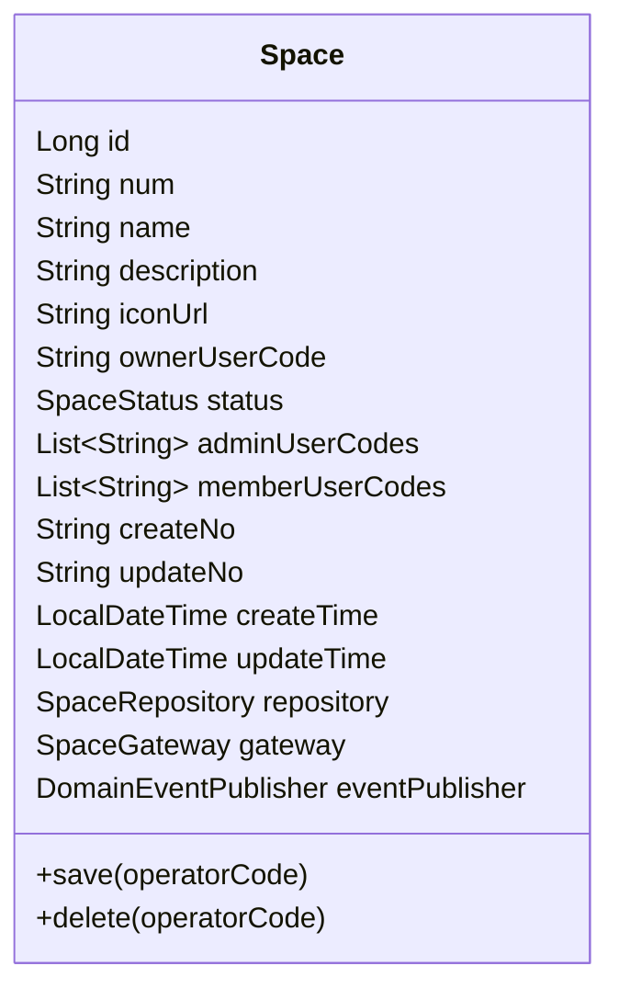

| 对象 | 类型 | 关键属性 | 说明 |
|------|------|---------|------|
| Space | 聚合根（**唯一**） | id / num / name / description / iconUrl / **ownerUserCode** / status / **adminUserCodes** / **memberUserCodes** | 软删除标记不进 domain；跨领域引用全部为业务编码（String） |

**字段语义**：
- `ownerUserCode`：所有者用户业务编码（user.num），唯一，自动加入 `adminUserCodes`，不可移除
- `adminUserCodes`：管理员用户业务编码列表，**包含 ownerUserCode**；同一 user 不能同时在 admin 与 member 两个列表里
- `memberUserCodes`：普通成员用户业务编码列表
- 两个列表合并去重 = 该空间的全部成员（按业务编码）

#### 4.2.2 领域动作

仅保留删除/save 两类（公共方案 §11.5）。改名/改描述/改 Icon/加成员/移除成员/改角色 等字段修改由应用层 setter + save 完成。

| 聚合 | 领域动作 | 类型 | 职责 | 前置 | 后置/规则 | 领域事件 |
|------|---------|------|------|------|----------|----------|
| Space | `delete(operatorCode)` | 删除 | 软删除空间 | operatorCode == ownerUserCode 或平台管理员 | is_deleted=1 | `space.space.deleted` |
| Space | `save(operatorCode)` | 持久化 | validate + initialize + repo.save；新建时 status 默认 ENABLED 且自动把 ownerUserCode 加入 adminUserCodes | — | — | 新建时 `space.space.created` |

##### 时序图：`Space.delete(operatorCode)`

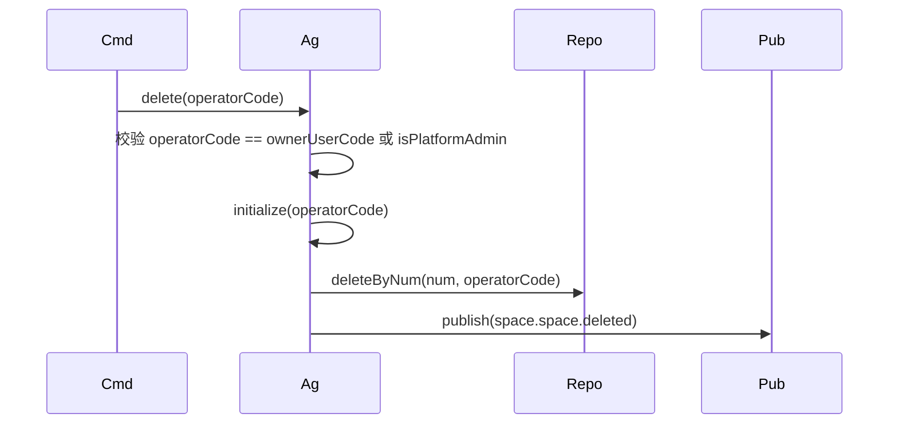

##### 时序图：`Space.save(operatorCode)`（统一模板）

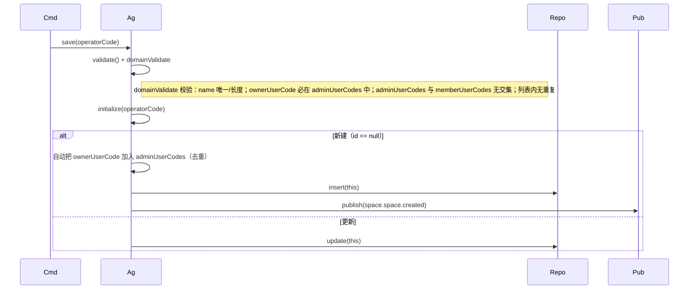

#### 4.2.3 领域规则

| 聚合/对象 | 规则类型 | 规则描述 | 违反时表达 |
|----------|---------|---------|-----------|
| Space | 唯一性 | name 在平台内唯一（含软删除过滤） | `BizException("SPACE_NAME_DUPLICATED")` |
| Space | 必填 | name 1~50 字符；ownerUserCode 非空 | `BizException` |
| Space | 业务规则 | 删除时 operatorCode=ownerUserCode 或为平台管理员 | `BizException("SPACE_NOT_DELETABLE")` |
| Space | 不变量 | ownerUserCode 必须出现在 adminUserCodes | `BizException("OWNER_MUST_BE_ADMIN")` |
| Space | 不变量 | adminUserCodes 与 memberUserCodes 无交集 | `BizException("USER_ROLE_CONFLICT")` |
| Space | 不变量 | 任意列表内无重复 userCode | `BizException("DUPLICATE_MEMBER")` |
| Space | 业务规则 | 任何修改都禁止把 ownerUserCode 从 adminUserCodes 中移除 | `BizException("CANNOT_REMOVE_OWNER")` |
| Space | 业务规则 | 单个空间总成员数（admin + member）≤ 500（占位上限） | `BizException("MEMBER_LIMIT_EXCEEDED")` |

#### 4.2.4 领域工厂

| Factory | 方法 | 入参 | 返回 | 职责 |
|---------|------|------|------|------|
| `SpaceFactory` | `create(name, description, iconUrl, ownerUserCode)` | 用户填写字段 | `Space` | 生成 num（前缀 SP）；status 默认 ENABLED；adminUserCodes 初始化为 `[ownerUserCode]`；memberUserCodes 初始化为空列表 |
| `SpaceFactory` | `createByNum(num)` | 业务编码 | `Space` | 通过 `SpaceRepository.findByNum(num)` 加载并装配领域协作依赖 |

> ✂️ 删除 `SpaceMemberFactory` 及其全部方法。

#### 4.2.5 领域网关

| Gateway | 方法 | 入参 | 返回 | 职责 |
|---------|------|------|------|------|
| `SpaceGateway` | `generateSpaceCode()` | — | String | 委托 `BizCodeGenerator.generate(SP)` |

> ✂️ 删除 `getCurrentUserId` / `isPlatformAdmin`：前者由应用层从 `SpaceContext` 取；后者改由应用层 `@Resource UserQueryService` 直接调用。符合 §11.6「领域网关只为本领域服务」。

#### 4.2.6 领域事件

| 事件名 | 触发时机 | 载荷 | 订阅方 |
|--------|---------|------|--------|
| `space.space.created` | 新建空间提交后（save 内发） | spaceNum / ownerUserCode | 系统设置（未来初始化空间策略）/ 审计 |
| `space.space.deleted` | 空间软删除（delete 发） | spaceNum | 各资源模块清理引用 / 审计 |
| `space.member.added` | 加入成员（**应用层 SpaceCommandService.addMember 在 save 后发**） | spaceNum / userCode / roleType | 审计 |
| `space.member.removed` | 移除成员（应用层发） | spaceNum / userCode | 审计 |
| `space.member.role_changed` | 修改成员角色（应用层发） | spaceNum / userCode / roleType | 审计 |

> 成员相关三个细粒度事件由**应用层在 save 完成后通过 `@Resource DomainEventPublisher` 显式发布**。原因：聚合根没有"动作"层面的细粒度方法，无法在领域内部识别"加成员"还是"改角色"；应用层最清楚自己执行的语义动作。该模式属公共方案 §8 允许的事件发布场景。

✅ **领域层自检**：模型/动作/规则/工厂/网关/事件六节齐备；DomainEntity 基础属性具备；软删除标记未进 domain；Factory 仅 create / createByNum；Gateway 仅业务编码生成；不再有 SpaceMember 类。

---

## 5. 基础设施层设计

| 类型 | 类名 | 包路径 | 职责 | 对应表/外部 | 是否新增 |
|------|------|--------|------|------------|---------|
| Entity | `SpaceEntity` | `com.agent.ops.infra.space.entity` | 与 spaces 表映射；`adminUserCodes` / `memberUserCodes` 通过 MyBatis-Plus `@TableField(typeHandler = JacksonTypeHandler.class)` 处理 JSON 列（List\<String\>） | spaces | 新增 |
| Mapper | `SpaceMapper` | `com.agent.ops.infra.space.mapper` | MP 基础 Mapper；新增自定义 SQL：`pageMine(userId)` 用 `JSON_CONTAINS` 查询 | spaces | 新增 |
| RepositoryImpl | `SpaceRepositoryImpl` | `com.agent.ops.infra.space.repository` | 实现 `SpaceRepository`；Entity↔Domain 用 MapStruct（`List<Long>` 直接对应） | spaces | 新增 |
| FactoryImpl | `SpaceFactoryImpl` | `com.agent.ops.infra.space.factory` | 实现 `SpaceFactory`；通过 `BizCodeGeneratorImpl` 生成 num | — | 新增 |
| GatewayImpl | `SpaceGatewayImpl` | `com.agent.ops.infra.space.gateway` | 实现 `SpaceGateway`；仅委托 `BizCodeGenerator` | — | 新增 |

> ✂️ 删除：`SpaceMemberEntity` / `SpaceMemberMapper` / `SpaceMemberRepositoryImpl` / `SpaceMemberFactoryImpl`。

✅ **基础设施层自检**：与领域层 / 数据库设计一致；@Resource 注入；GatewayImpl 不依赖跨领域 QueryService。

---

## 6. 应用层设计

### 6.1 业务模块划分

| 模块 | 对应领域 | 说明 |
|------|---------|------|
| 6.2 空间（space） | space | 空间 CRUD + 成员加入/移除/改角色 + 卡片查询 + 成员列表查询；**唯一一个 application 模块** |

### 6.2 空间（space）

#### 6.2.1 Service 方法清单

| Service | 方法 | 入参 | 返回 | 职责 |
|---------|------|------|------|------|
| `SpaceCommandService` | `create(CreateSpaceParam)` | name/description/iconUrl | `SpaceDTO` | 新建空间（owner 自动加入 admin 列表） |
| `SpaceCommandService` | `updateBasic(UpdateSpaceParam)` | num/name/description/iconUrl | `SpaceDTO` | 改名/描述/图标 |
| `SpaceCommandService` | `delete(num, confirmName)` | 业务编码 / 确认输入名 | void | 输入校验 + 软删 |
| `SpaceCommandService` | `addMember(JoinMemberParam)` | spaceCode / userCode / roleType | `SpaceDTO` | 把 user 加入 admin 或 member 列表 |
| `SpaceCommandService` | `removeMember(RemoveMemberParam)` | spaceCode / userCode | `SpaceDTO` | 从两个列表中移除（不能是 owner） |
| `SpaceCommandService` | `changeMemberRole(ChangeMemberRoleParam)` | spaceCode / userCode / newRoleType | `SpaceDTO` | 在 admin / member 之间迁移 |
| `SpaceQueryService` | `getByNum(num)` | num | `SpaceDTO` | — |
| `SpaceQueryService` | `pageMine(SpaceQueryParam)` | 当前用户上下文 + 关键字 | `PageResult<SpaceCardVO>` | "我所在的"空间卡片列表（`JSON_CONTAINS` 查询） |
| `SpaceQueryService` | `existsByName(name)` | 名称 | boolean | 唯一性校验 |
| `SpaceQueryService` | `pageMembers(spaceCode, keyword, pageable)` | — | `PageResult<SpaceMemberVO>` | 成员列表查询：从 Space 取两个 Code 列表 → 调 `UserQueryService.listByCodes` 批量补 userName → 装配 VO |
| `SpaceQueryService` | `isMember(spaceCode, userCode)` | — | boolean | 校验是否成员（admin OR member） |
| `SpaceQueryService` | `isAdmin(spaceCode, userCode)` | — | boolean | 校验是否管理员 |

> ✂️ 删除：`SpaceMemberCommandService` / `SpaceMemberQueryService` 整套类。

#### 6.2.2 方法时序逻辑

##### `SpaceCommandService.create(CreateSpaceParam)`

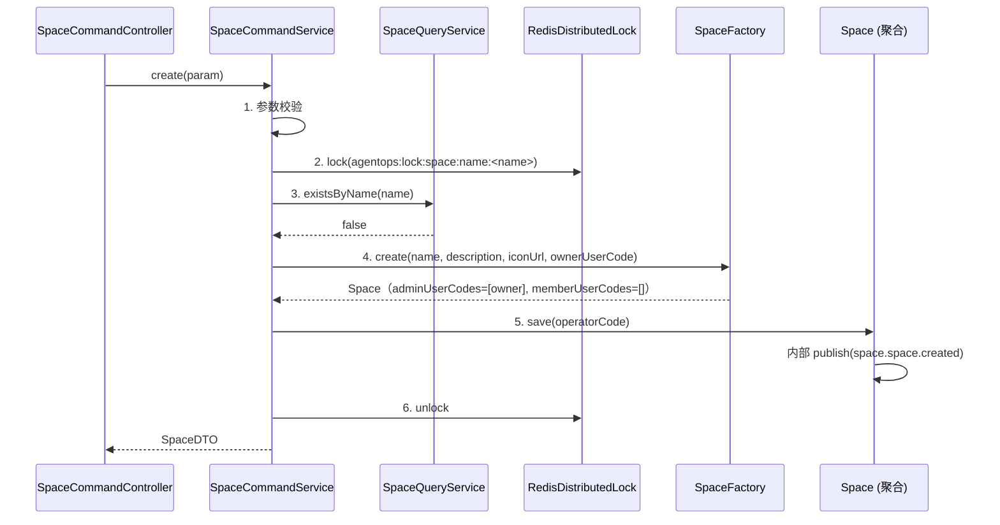

##### `SpaceCommandService.updateBasic(...)` —— **改字段：setter + save**

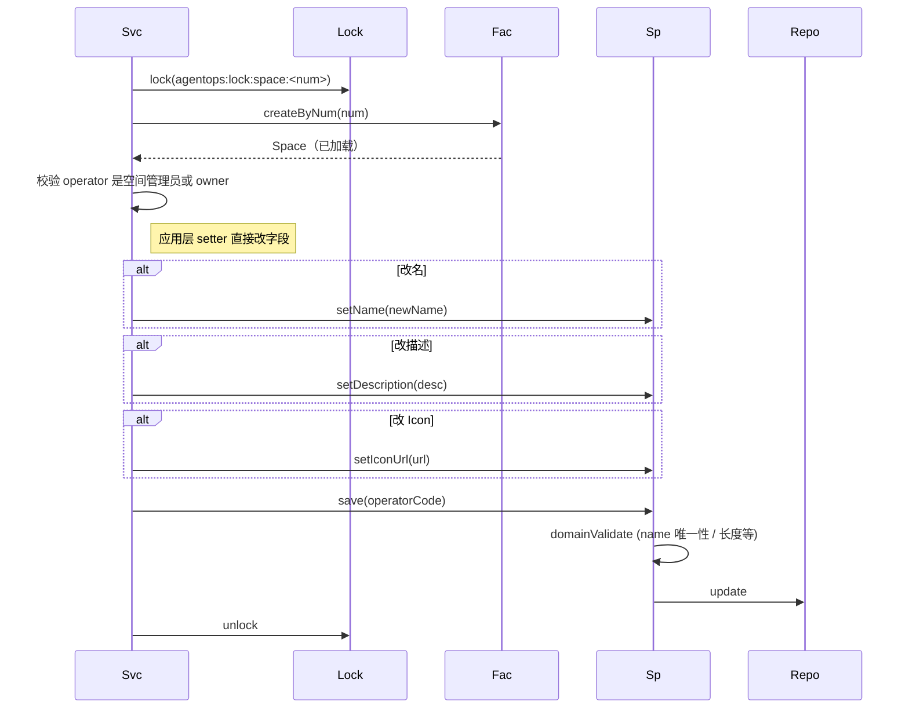

##### `SpaceCommandService.delete(num, confirmName)`

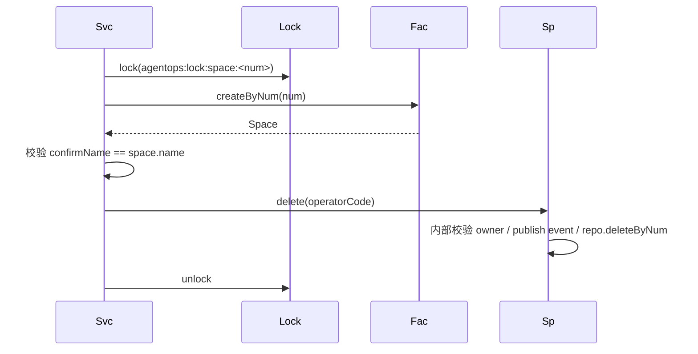

##### `SpaceCommandService.addMember(JoinMemberParam)`

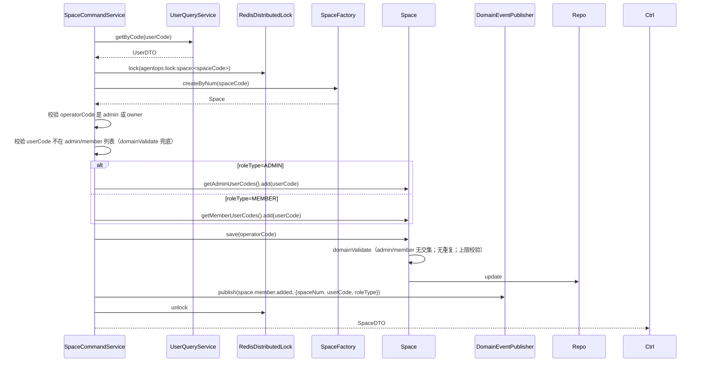

##### `SpaceCommandService.removeMember(RemoveMemberParam)`

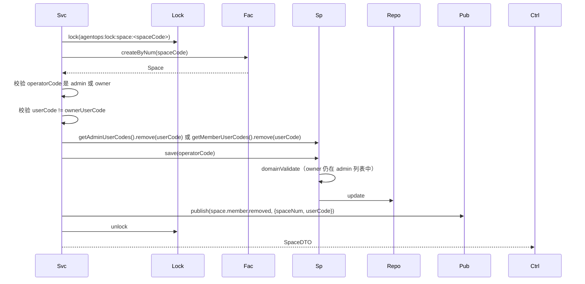

##### `SpaceCommandService.changeMemberRole(ChangeMemberRoleParam)`

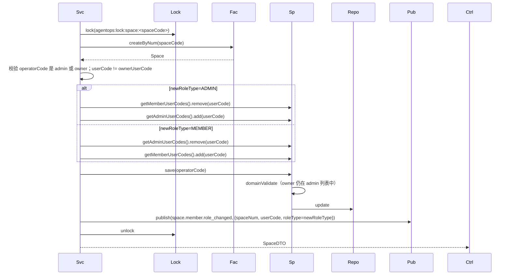

##### `SpaceQueryService.pageMine(SpaceQueryParam)`

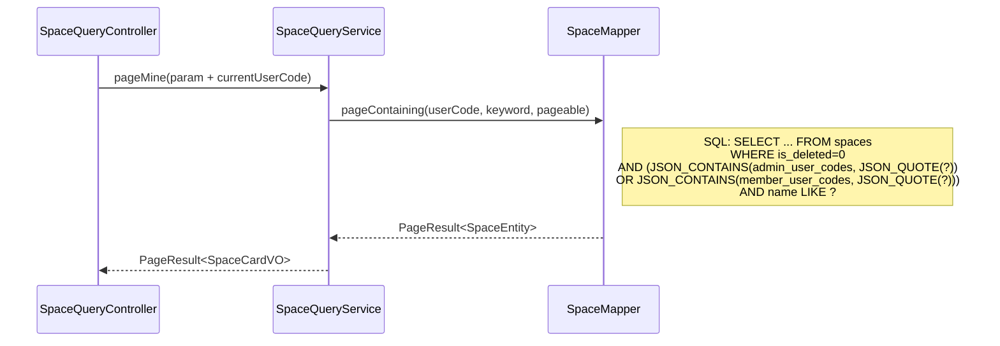

##### `SpaceQueryService.pageMembers(spaceCode, keyword, pageable)`

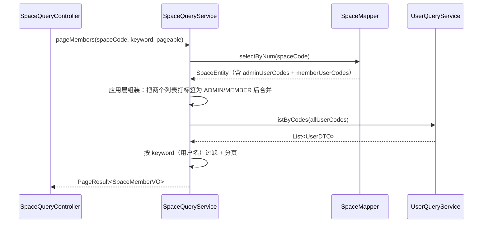

✅ **应用层自检**：CommandService 加锁；未注入 Repository / Gateway；跨领域用 `UserQueryService`；JSON 包含查询走 Mapper；@Resource 注入。

---

## 7. Adapter 层设计

### 7.1 业务模块划分

| 模块 | 控制器 |
|------|--------|
| 7.2 空间（含成员） | `SpaceCommandController` / `SpaceQueryController` |

> ✂️ 删除 `SpaceMemberCommandController` / `SpaceMemberQueryController`。成员相关 4 个接口合并到 SpaceCommandController / SpaceQueryController。

### 7.2 空间

#### Controller 接口清单

| 方法 | 路径 | 入参 JSON | 返回 JSON |
|------|------|----------|----------|
| POST | `/api/spaces/create` | `{"name":"家庭客服","description":"...","iconUrl":"..."}` | `Result<SpaceDTO>` |
| POST | `/api/spaces/update-basic` | `{"num":"SP...","name":"...","description":"...","iconUrl":"..."}` | `Result<SpaceDTO>` |
| POST | `/api/spaces/delete` | `{"num":"SP...","confirmName":"家庭客服"}` | `Result<Void>` |
| POST | `/api/spaces/add-member` | `{"spaceCode":"SP...","userCode":"US...","roleType":2}` | `Result<SpaceDTO>` |
| POST | `/api/spaces/remove-member` | `{"spaceCode":"SP...","userCode":"US..."}` | `Result<SpaceDTO>` |
| POST | `/api/spaces/change-member-role` | `{"spaceCode":"SP...","userCode":"US...","roleType":1}` | `Result<SpaceDTO>` |
| GET | `/api/spaces/get` | `?code=SP...` | `Result<SpaceDTO>` |
| GET | `/api/spaces/page-mine` | `?keyword=&pageNo=1&pageSize=12` | `Result<PageResult<SpaceCardVO>>` |
| GET | `/api/spaces/page-members` | `?spaceCode=SP...&keyword=&pageNo=1&pageSize=20` | `Result<PageResult<SpaceMemberVO>>` |

> 成员接口路径由 `/api/space-members/*` 统一改为 `/api/spaces/*-member` 风格，凸显"成员是 Space 资源的子操作"语义；同时减少前端 baseURL 个数。

#### `POST /api/spaces/create` 时序

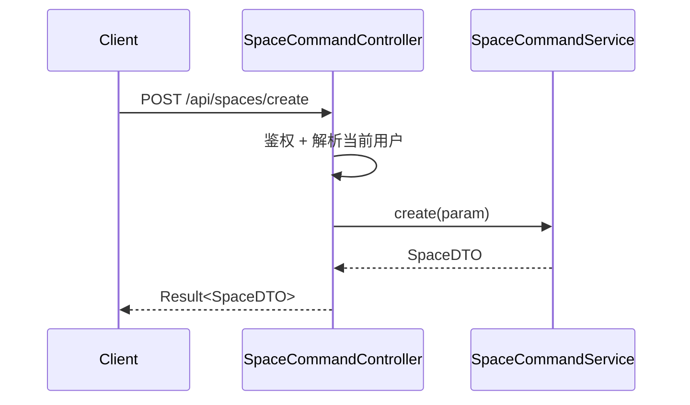

#### `POST /api/spaces/add-member` 时序

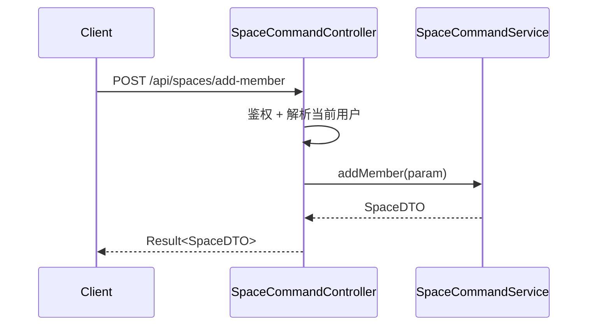

> `update-basic / delete / remove-member / change-member-role` 时序结构相同：Controller 鉴权 → Service → 返回 DTO/Void。

#### `GET /api/spaces/page-mine` 时序

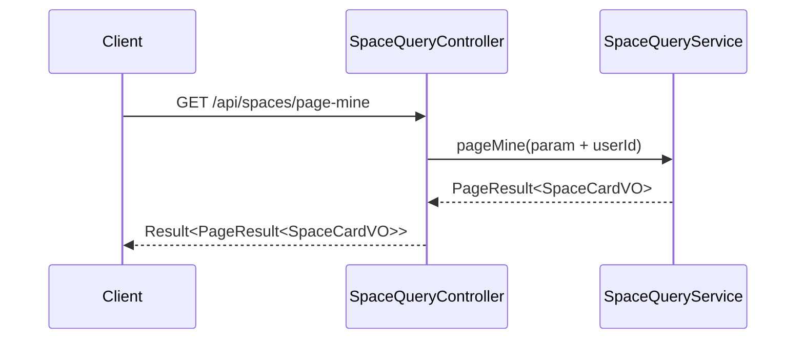

#### `GET /api/spaces/page-members` 时序

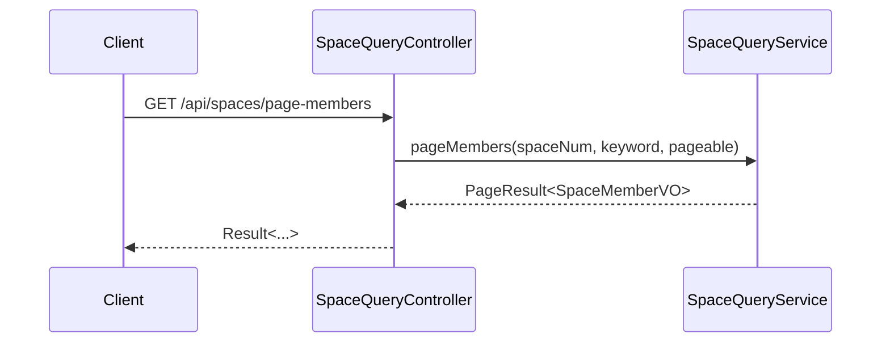

✅ **Adapter 层自检**：HTTP 仅 GET/POST；每接口配时序；JSON 入参/返回明确；@Resource 注入；只有 2 个 Controller。

---

## 8. 数据库设计

### 8.1 表结构

#### `spaces`（空间主表 —— **唯一一张表**）

| 字段 | 类型 | 必填 | 索引 | 说明 |
|------|------|------|------|------|
| id | BIGINT | 是 | PK auto_increment | |
| num | VARCHAR(32) | 是 | UK | SP+ts+rand |
| name | VARCHAR(50) | 是 | UK with is_deleted | 空间名称 |
| description | VARCHAR(500) | 否 | — | |
| icon_url | VARCHAR(500) | 否 | — | |
| owner_user_code | VARCHAR(32) | 是 | KEY | 空间所有者用户业务编码（user.num） |
| status | TINYINT(1) | 是 | — | 1=ENABLED |
| **admin_user_codes** | JSON | 是 | （MySQL 8.x 多值索引可选） | 管理员用户业务编码列表（含 owner），如 `["US...","US..."]` |
| **member_user_codes** | JSON | 是 | （MySQL 8.x 多值索引可选） | 普通成员用户业务编码列表 |
| 公共列（create_no/update_no/create_time/update_time/is_deleted） | — | 是 | — | create_no/update_no 类型 VARCHAR(32) |

> ✂️ 删除 `space_members` 表。

### 8.2 DDL

```sql
CREATE TABLE `spaces` (
  `id` BIGINT NOT NULL AUTO_INCREMENT,
  `num` VARCHAR(32) NOT NULL COMMENT '业务编码 SP+ts+rand',
  `name` VARCHAR(50) NOT NULL COMMENT '空间名称',
  `description` VARCHAR(500) DEFAULT NULL,
  `icon_url` VARCHAR(500) DEFAULT NULL,
  `owner_user_code` VARCHAR(32) NOT NULL COMMENT '空间所有者用户业务编码',
  `status` TINYINT(1) NOT NULL DEFAULT 1 COMMENT '1=启用',
  `admin_user_codes` JSON NOT NULL COMMENT '管理员用户业务编码列表（含 owner），如 ["US...","US..."]',
  `member_user_codes` JSON NOT NULL COMMENT '普通成员用户业务编码列表',
  `create_no` VARCHAR(32) NOT NULL COMMENT '创建人用户业务编码',
  `update_no` VARCHAR(32) NOT NULL COMMENT '最后更新人用户业务编码',
  `create_time` DATETIME(3) NOT NULL DEFAULT CURRENT_TIMESTAMP(3),
  `update_time` DATETIME(3) NOT NULL DEFAULT CURRENT_TIMESTAMP(3) ON UPDATE CURRENT_TIMESTAMP(3),
  `is_deleted` TINYINT(1) NOT NULL DEFAULT 0,
  PRIMARY KEY (`id`),
  UNIQUE KEY `uk_num` (`num`),
  UNIQUE KEY `uk_name_deleted` (`name`, `is_deleted`),
  KEY `idx_owner` (`owner_user_code`),
  /* MySQL 8.x 多值索引：加速 JSON_CONTAINS(admin_user_codes, JSON_QUOTE(?)) 类查询 */
  KEY `idx_admin_user_codes` ((CAST(`admin_user_codes` AS CHAR(32) ARRAY))),
  KEY `idx_member_user_codes` ((CAST(`member_user_codes` AS CHAR(32) ARRAY)))
) ENGINE=InnoDB DEFAULT CHARSET=utf8mb4 COLLATE=utf8mb4_unicode_ci COMMENT='空间主表';
```

### 8.3 DML（无）

无初始化数据，空间通过用户操作创建。

### 8.4 关键查询：pageMine 的 SQL 范式

```sql
SELECT *
FROM spaces
WHERE is_deleted = 0
  AND (
    JSON_CONTAINS(admin_user_codes, JSON_QUOTE(#{userCode}))
    OR JSON_CONTAINS(member_user_codes, JSON_QUOTE(#{userCode}))
  )
  AND (#{keyword} IS NULL OR name LIKE CONCAT('%', #{keyword}, '%'))
ORDER BY update_time DESC
LIMIT #{offset}, #{size};
```

> 多值索引（MySQL 8.0.17+）会被 `JSON_CONTAINS` 命中（CHAR ARRAY 索引）。如部署的 MySQL 版本不支持多值索引，可不创建该索引（仍能正确执行，只是回退到全表扫描）。

✅ **数据库自检**：id BIGINT 自增；DATETIME(3)；DDL 可执行；含必要索引；只有一张表，schema 大幅简化。

---

## 9. 模块变更清单

| 层 | 变更内容 | 实现 Skill |
|----|---------|-----------|
| facade | （无） | — |
| client | 新增 `space.dto/param/vo/enums`（不再有 `SpaceMemberDTO`，`SpaceMemberVO` 仅作为查询返回 VO 保留） | **impl-client-module** |
| domain | 新增 `space` 领域模型（**唯一聚合根 Space**，含 adminUserCodes/memberUserCodes 两列）/ `SpaceFactory` / `SpaceGateway`（仅生成编码）/ 事件常量；**不含 SpaceMember** | **impl-domain-module** |
| infra | 新增 `space.entity/mapper/repository/factory/gateway`（仅一套，含 `pageContaining` JSON_CONTAINS 自定义 SQL） | **impl-infra-module** |
| application | 新增 **唯一** `SpaceCommandService` + `SpaceQueryService` | **impl-application-module** |
| adapter | 新增 **2 个** Controller（`SpaceCommandController` / `SpaceQueryController`） | **impl-adapter-module** |

✅ **变更清单自检**：每条对应唯一 Skill；与上述各层一致；类数量较 V1.3 减少 11 个。

---

## 10. 代码分支命名

```
feature-20260613-space-management
```

---

## 11. 实现顺序

```
client（DTO/Param/VO/Enums）
   ↓
domain（Space 聚合 + Factory/Gateway 接口 + 事件常量）
   ↓
infra（SpaceEntity 含 JSON 列 + Mapper（含 pageContaining 自定义 SQL）+ RepositoryImpl + FactoryImpl + GatewayImpl）
   ↓
application（SpaceCommandService + SpaceQueryService；其中 pageMembers 调 UserQueryService 批量补 userName）
   ↓
adapter（2 个 Controller，9 个接口）
```

---

## 12. 接口与数据契约

参见 §7.2 各接口 JSON 描述。所有响应统一为 `Result<T>` 结构 `{ code, message, data }`。

---

## 13. 其他

- 鉴权：复用现有 `AuthInterceptor`，已对 `/api/spaces/**` 自动校验登录态
- 错误码：统一在 `BizErrorCode.java`（如 `SPACE_NAME_DUPLICATED`、`OWNER_MUST_BE_ADMIN`、`USER_ROLE_CONFLICT`、`CANNOT_REMOVE_OWNER`、`MEMBER_LIMIT_EXCEEDED`）
- **JSON 列序列化**：MyBatis-Plus 的 `JacksonTypeHandler` 默认即可处理 `List<String>`；MapStruct 把 Entity↔Domain 的 List<String> 直接 1:1 映射，无需自定义 mapping
- **规模上限**：单个空间总成员（admin + member）默认 ≤ 500（领域规则强制）；超过此规模需要重新评估方案，本期不支持
- **未来若需要更复杂的成员属性**（加入时间、备注、邀请人等），届时再单独拆出 `space_members` 表（届时升级为 V2.0），本期不预留