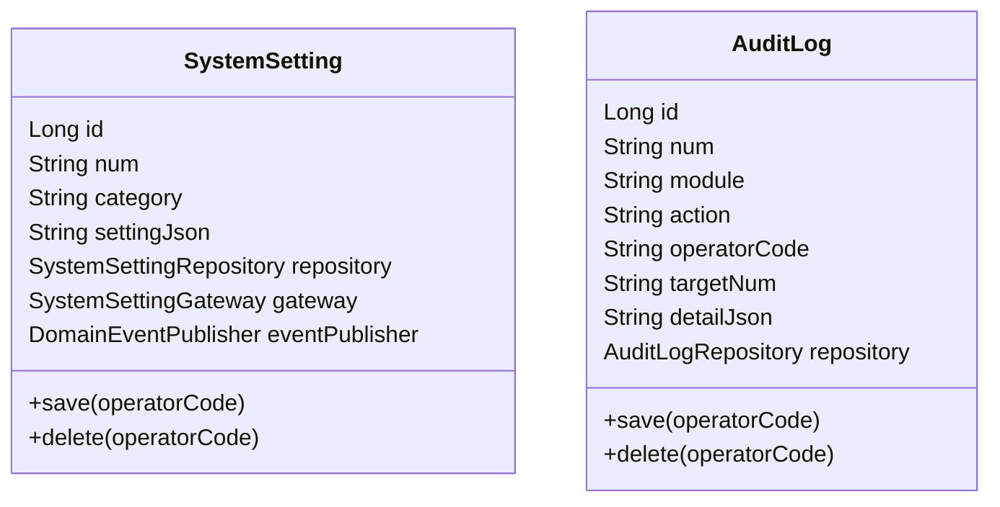
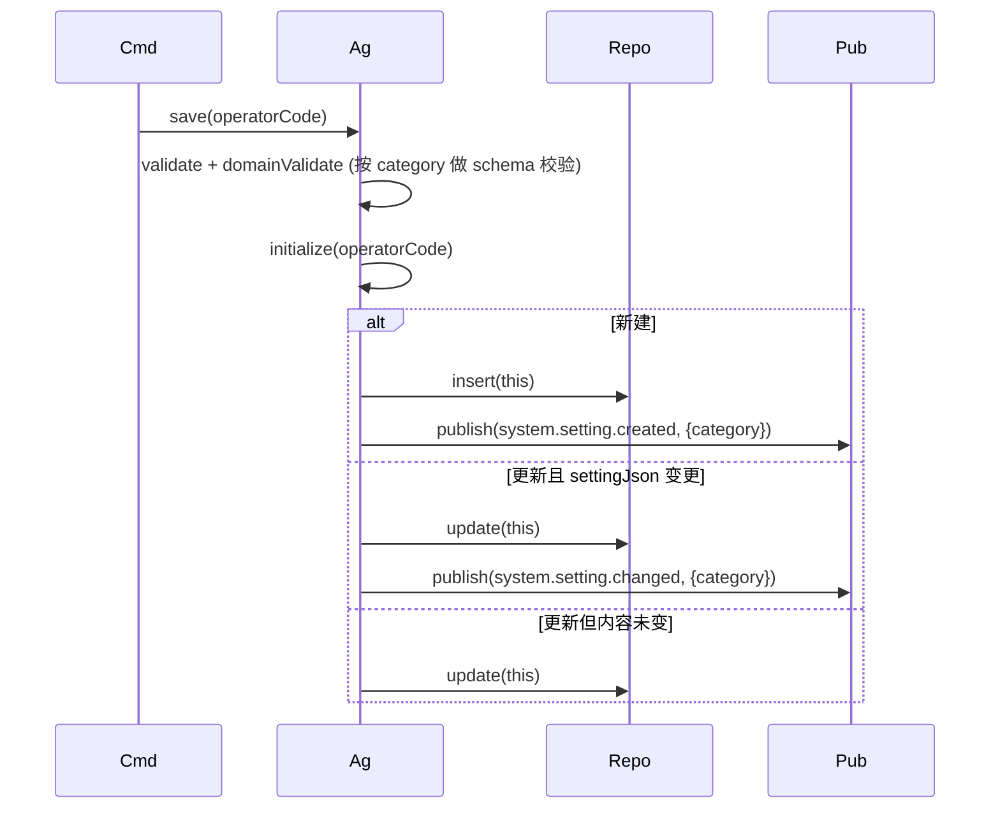
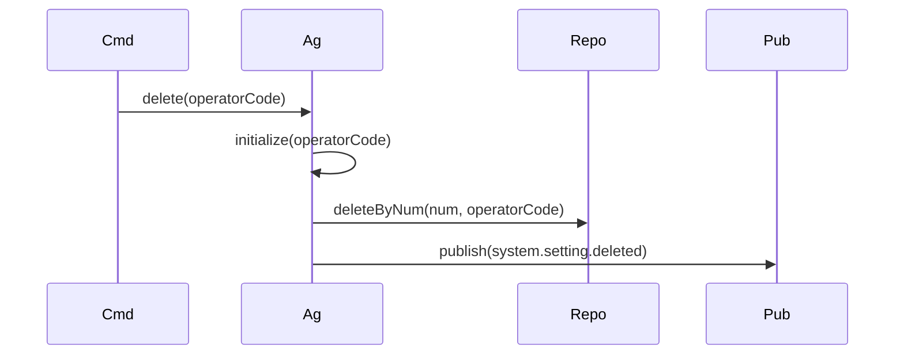
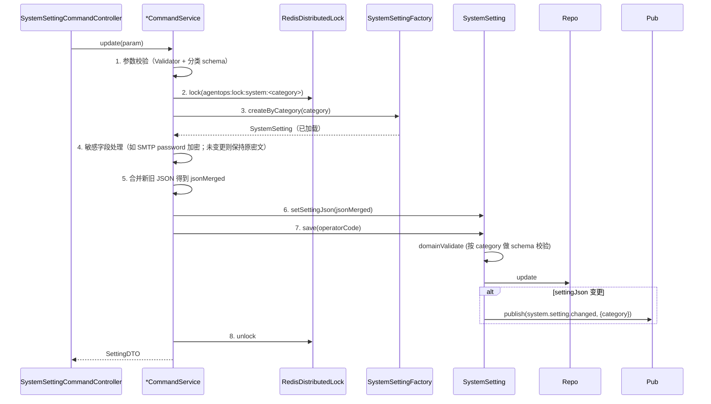
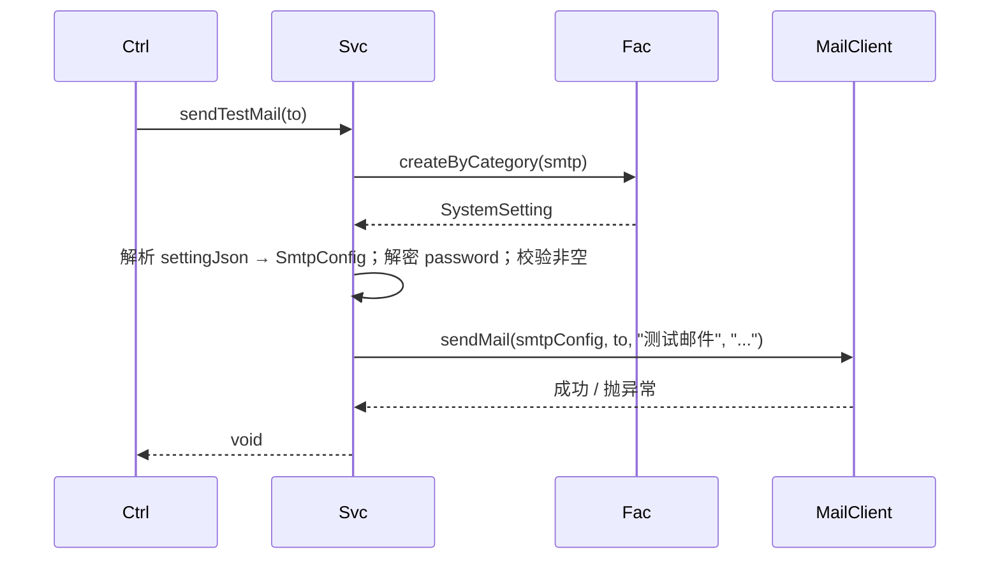
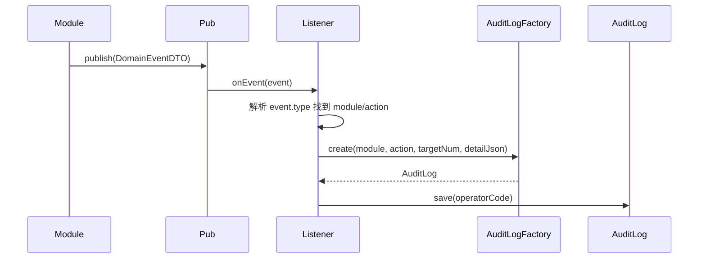
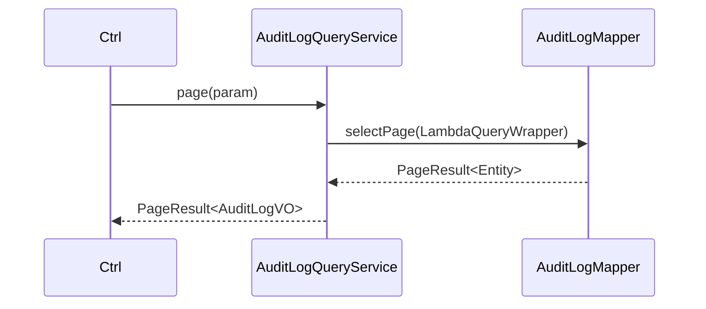
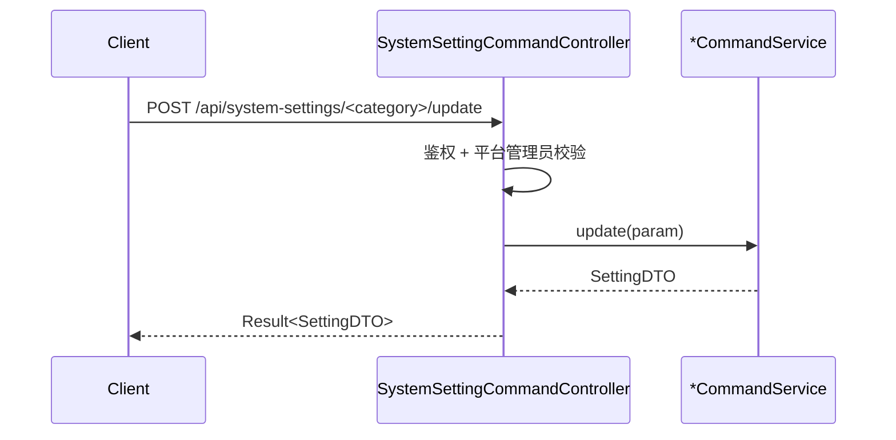
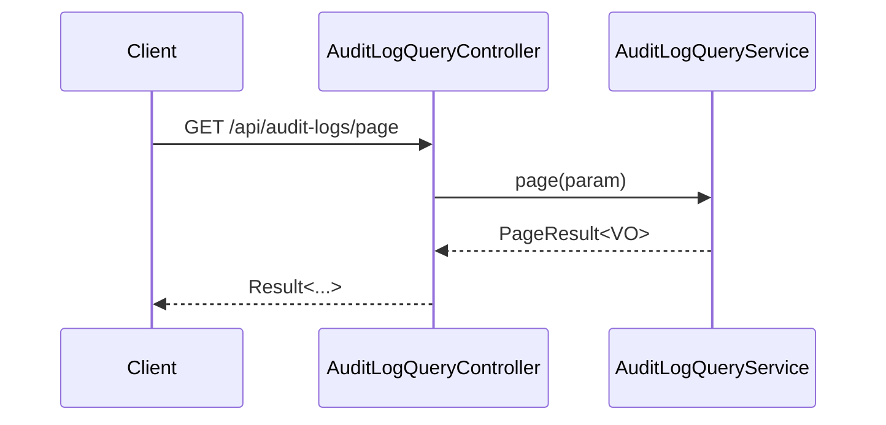

# AgentOps 平台 — 系统设置技术方案

| 文档版本 | 日期 | 编写人 | 说明 |
|---------|------|-------|------|
| V1.0 | 2026-06-13 | AgentOps Team | 系统设置技术方案初稿 |
| V1.1 | 2026-06-13 | AgentOps Team | 按"领域动作精简原则"修订（公共方案 §11.5）：移除 updateContent 领域方法；改为 setter + save；测试发邮件改为应用层能力 |
| V1.2 | 2026-06-13 | AgentOps Team | 按"领域网关使用约束"修订（公共方案 §11.6）：从 SystemSettingGateway 移除 sendMail；新增 application 层 `SmtpMailClient` 接口由 infra 实现 |
| V1.3 | 2026-06-13 | AgentOps Team | 状态枚举命名规范化：本模块 SystemSetting / AuditLog 无业务 status 字段，无需调整；遵循公共方案 §10.1 命名约定 |
| V1.5 | 2026-06-13 | AgentOps Team | 跨领域引用统一为业务编码（公共方案 §10.2）：AuditLog.operatorId Long → operatorCode String；createNo/updateNo Long→String；DDL 列类型相应改为 VARCHAR(32) |

> 配套 PRD：`doc/产品方案/2026-06-13_系统设置-PRD.md`（V1.1 含沙箱接入）
> 公共约定：`doc/技术方案/2026-06-13_AgentOps公共技术方案.md`

---

## 1. 目标与范围

平台级系统设置：
- 平台基本信息（名称/Logo/系统加密密钥）
- SMTP 邮件服务（含发测试邮件）
- 空间策略（每用户空间配额、命名规则）
- 沙箱默认接入地址（与沙箱模块联动）
- 审计日志查询

不含：多租户、可视化大盘、备份恢复。

### 1.1 设计前问题对齐

继承公共方案 §1。本模块特有：
- **平台级表**（无 space_id）
- 设置以 **键值对 JSON** 存储（一类一行 JSON）
- 加密密钥本身存于本表，启动时由 `SystemSettingsLoader` 加载到内存（密钥行特殊处理）
- 审计日志为只读查询，写由各模块的事件订阅器统一落表

---

## 2. 架构设计

### 2.1 应用架构

| 层 | 领域 | 包 | 职责 |
|----|------|-----|------|
| client | system | `com.agent.ops.client.system.dto` | `PlatformBasicDTO` / `SmtpConfigDTO` / `SpacePolicyDTO` / `SandboxDefaultDTO` / `AuditLogDTO` |
| client | system | `com.agent.ops.client.system.param` | 各分类的 update Param + `AuditLogQueryParam` |
| client | system | `com.agent.ops.client.system.vo` | 同 DTO（敏感字段脱敏） |
| domain | system | `com.agent.ops.domain.system` | `SystemSetting`（聚合根，按 category） |
| domain | system | `com.agent.ops.domain.system` | `AuditLog`（实体） |
| domain | system | `com.agent.ops.domain.system.repository` | `SystemSettingRepository` / `AuditLogRepository` |
| domain | system | `com.agent.ops.domain.system.factory` | `SystemSettingFactory` / `AuditLogFactory` |
| domain | system | `com.agent.ops.domain.system.gateway` | `SystemSettingGateway`（仅业务编码生成） |
| domain | system | `com.agent.ops.domain.system.event` | `SystemSettingEventConstant` |
| infra | system | `com.agent.ops.infra.system.entity` | `SystemSettingEntity` / `AuditLogEntity` |
| infra | system | `com.agent.ops.infra.system.mapper` | `SystemSettingMapper` / `AuditLogMapper` |
| infra | system | `com.agent.ops.infra.system.repository` | `*RepositoryImpl` |
| infra | system | `com.agent.ops.infra.system.factory` | `*FactoryImpl` |
| infra | system | `com.agent.ops.infra.system.gateway` | `SystemSettingGatewayImpl`（仅委托 BizCodeGenerator） |
| infra | system | `com.agent.ops.infra.system.client` | `SmtpMailClientImpl`（实现 application 层 SmtpMailClient；按 SmtpConfig 动态构建 JavaMailSender 发送） |
| infra | system | `com.agent.ops.infra.system.config` | `SystemSettingsLoader`（启动时加载密钥到 SecretEncryptor） |
| application | system | `com.agent.ops.application.system.client` | `SmtpMailClient`（application 层接口，定义 `sendMail(SmtpConfig, to, subject, body)`） |
| application | system | `com.agent.ops.application.system.command` | 各分类 `*CommandService`（SmtpCommandService 注入 SmtpMailClient） |
| application | system | `com.agent.ops.application.system.query` | `SystemSettingQueryService` / `AuditLogQueryService` |
| application | system | `com.agent.ops.application.system.listener` | `AuditLogEventListener`（订阅各模块事件落审计） |
| adapter | system | `com.agent.ops.adapter.system.controller` | `SystemSettingCommandController` / `SystemSettingQueryController` / `AuditLogQueryController` |

### 2.2 部署架构

部署架构不变。

---

## 3. Facade 层设计

本次无 Facade 层变更。

---

## 4. 领域层设计

### 4.1 业务层级划分

| 层级 | 领域 | 说明 |
|------|------|------|
| 平台级 | system | 系统设置 + 审计日志 |

### 4.2 系统设置（system）

#### 4.2.1 领域模型

> 按公共方案 §11.5：类图仅展示属性 + delete + save。SystemSetting 没有状态动作（仅通过 save 持久化变更）；测试发邮件不是领域动作，下沉到应用层。AuditLog 同样无状态动作。



| 对象 | 类型 | 关键属性 |
|------|------|---------|
| SystemSetting | 聚合根 | category（platform_basic/smtp/space_policy/sandbox_default）/ settingJson |
| AuditLog | 实体（独立聚合） | module / action / operatorCode / targetNum / detailJson |

#### 4.2.2 领域动作

仅保留 delete/save（公共方案 §11.5）。修改设置内容由应用层 setter + save 完成；save 内通过 `domainValidate` 按 category 做 schema 校验，新建时发 created 事件，更新时检测 settingJson 是否变化并发 `system.setting.changed` 事件（用于 SystemSettingsLoader 刷新缓存）。

| 聚合 | 动作 | 类型 | 职责 | 前置 | 后置 | 事件 |
|------|------|------|------|------|------|------|
| SystemSetting | `save(operatorCode)` | 持久化 | validate + initialize + repo.save；按 category 做 schema 校验 | — | — | 新建时 `system.setting.created`；更新且 settingJson 变化时 `system.setting.changed`（含 category） |
| SystemSetting | `delete(operatorCode)` | 删除 | 软删（极少使用，仅平台清理） | — | is_deleted=1 | `system.setting.deleted` |
| AuditLog | `save(operatorCode)` | 持久化 | 写入审计 | — | — | — |
| AuditLog | `delete(operatorCode)` | 删除 | 软删（极少使用） | — | — | — |

> **测试发邮件不在领域层**：`SmtpCommandService.sendTestMail(to)` 在应用层加载 SystemSetting 拿到 SMTP 配置后调用 application 层 `SmtpMailClient.sendMail(...)`（详见 §6.3）。

##### 时序：`SystemSetting.save(operatorCode)`（统一模板）



##### 时序：`SystemSetting.delete(operatorCode)`（统一模板）



> 测试发邮件由应用层 `SmtpCommandService.sendTestMail(to)` 编排（详见 §6.3）。

#### 4.2.3 领域规则

| 对象 | 规则 | 描述 | 违反 |
|------|------|------|------|
| SystemSetting | 唯一性 | category 全局唯一 | `BizException` |
| SystemSetting | Schema | `platform_basic` 须含 platformName/encryptionKey；`smtp` 须含 host/port；`space_policy` 须含 quotaPerUser；`sandbox_default` 须含 baseUrl | `BizException` |
| AuditLog | 必填 | module/action/operatorCode 不空 | — |

#### 4.2.4 领域工厂

| Factory | 方法 | 入参 | 返回 | 职责 |
|---------|------|------|------|------|
| `SystemSettingFactory` | `create(category, json)` | 用户填写字段 | `SystemSetting` | 初始化配置（仅在系统首启动 seed） |
| `SystemSettingFactory` | `createByNum(num)` | num | `SystemSetting` | — |
| `SystemSettingFactory` | `createByCategory(category)` | category | `SystemSetting` | **特殊**：通过 Repo.findByCategory 加载；用于 update 入口 |
| `AuditLogFactory` | `create(module, action, targetNum, detailJson)` | 用户填写字段 | `AuditLog` | 生成 num（前缀 AL） |
| `AuditLogFactory` | `createByNum(num)` | num | `AuditLog` | — |

> 注：`SystemSettingFactory` 增加一个领域内部辅助方法 `createByCategory(category)`；本质等同 `createByNum`，但以业务键 category 加载。该方法仅供应用层使用。

#### 4.2.5 领域网关

| Gateway | 方法 | 入参 | 返回 | 职责 |
|---------|------|------|------|------|
| `SystemSettingGateway` | `generateSettingCode()` | — | String | 委托 BizCodeGenerator (`SS`) |
| `SystemSettingGateway` | `generateAuditLogCode()` | — | String | 委托 BizCodeGenerator (`AL`) |

> ❌ **不再设计** `sendMail`：邮件发送是外部基础设施动作，违反 §11.6；改由应用层 `SmtpCommandService.sendTestMail` 通过注入 application 层 `SmtpMailClient` 实现。

#### 4.2.6 领域事件

| 事件名 | 触发 | 载荷 | 订阅 |
|--------|------|------|------|
| `system.setting.changed` | 任一分类 update 后 | category | `SystemSettingsLoader`（刷新内存）/ 审计 |

✅ 自检通过。

---

## 5. 基础设施层设计

| 类型 | 类名 | 包 | 对应 | 是否新增 |
|------|------|-----|------|---------|
| Entity | `SystemSettingEntity` | `infra.system.entity` | system_settings | 新增 |
| Entity | `AuditLogEntity` | `infra.system.entity` | audit_logs | 新增 |
| Mapper | `SystemSettingMapper` / `AuditLogMapper` | `infra.system.mapper` | — | 新增 |
| RepositoryImpl | `SystemSettingRepositoryImpl` / `AuditLogRepositoryImpl` | — | — | 新增 |
| FactoryImpl | `SystemSettingFactoryImpl` / `AuditLogFactoryImpl` | — | — | 新增 |
| GatewayImpl | `SystemSettingGatewayImpl` | `infra.system.gateway` | 仅委托 BizCodeGenerator 生成 SS/AL | 新增 |
| Client Impl | `SmtpMailClientImpl` | `infra.system.client`；实现 application 层 `SmtpMailClient`；按 SmtpConfig 动态构建 `JavaMailSender` 实例发送邮件 | — | 新增 |
| Config | `SystemSettingsLoader` | `infra.system.config` | `@PostConstruct` 加载密钥；订阅 `system.setting.changed` 刷新 | 新增 |

✅ 自检通过。

---

## 6. 应用层设计

### 6.1 业务模块划分

| 模块 | 内容 |
|------|------|
| 6.2 平台基础（platform_basic） | 名称/Logo/加密密钥维护 |
| 6.3 SMTP（smtp） | SMTP 配置 + 测试发信 |
| 6.4 空间策略（space_policy） | 配额 + 命名规则 |
| 6.5 沙箱默认（sandbox_default） | 沙箱默认 baseUrl |
| 6.6 审计日志（audit_log） | 查询 + 监听 |

### 6.2~6.5 各分类 Command 同构

#### Service 方法清单（合并）

| Service | 方法 | 入参 | 返回 |
|---------|------|------|------|
| `PlatformBasicCommandService` | `update(PlatformBasicParam)` | name/logoUrl/encryptionKey | `PlatformBasicDTO` |
| `SmtpCommandService` | `update(SmtpParam)` | host/port/username/password/from/ssl | `SmtpDTO` |
| `SmtpCommandService` | `sendTestMail(to)` | 邮箱 | void |
| `SpacePolicyCommandService` | `update(SpacePolicyParam)` | quotaPerUser/namingRegex | `SpacePolicyDTO` |
| `SandboxDefaultCommandService` | `update(SandboxDefaultParam)` | baseUrl | `SandboxDefaultDTO` |
| `SystemSettingQueryService` | `getByCategory(category)` | category | `SettingDTO`（敏感字段脱敏） |

#### 时序：所有 `*CommandService.update(...)`（统一模板）—— **改字段：setter + save**



#### 时序：`SmtpCommandService.sendTestMail(to)` —— **应用层能力**



> 应用层注入 `@Resource SmtpMailClient`（application 层接口）；不注入 `SystemSettingGateway`。

### 6.6 审计日志

#### Service 方法清单

| Service | 方法 | 入参 | 返回 |
|---------|------|------|------|
| `AuditLogQueryService` | `page(AuditLogQueryParam)` | module/action/operator/timeRange | `PageResult<AuditLogVO>` |
| `AuditLogEventListener.onEvent(...)` | `@EventListener DomainEventDTO` | — | — |

#### 时序：`AuditLogEventListener.onEvent(...)`



#### 时序：`AuditLogQueryService.page(...)`



✅ 自检通过。

---

## 7. Adapter 层设计

### 7.1 业务模块划分

| 模块 | Controller |
|------|-----------|
| 7.2 系统设置 Command | `SystemSettingCommandController` |
| 7.3 系统设置 Query | `SystemSettingQueryController` |
| 7.4 审计日志 Query | `AuditLogQueryController` |

### 7.2 系统设置 Command

| 方法 | 路径 | 入参 JSON | 返回 |
|------|------|----------|------|
| POST | `/api/system-settings/platform-basic/update` | `{"name":"AgentOps","logoUrl":"...","encryptionKey":"<32B base64>"}` | `Result<PlatformBasicDTO>` |
| POST | `/api/system-settings/smtp/update` | `{"host":"smtp.example.com","port":465,"username":"u","password":"<新值或脱敏占位>","from":"...","ssl":true}` | `Result<SmtpDTO>` |
| POST | `/api/system-settings/smtp/send-test-mail` | `{"to":"foo@bar.com"}` | `Result<Void>` |
| POST | `/api/system-settings/space-policy/update` | `{"quotaPerUser":10,"namingRegex":"^[A-Za-z0-9_-]+$"}` | `Result<SpacePolicyDTO>` |
| POST | `/api/system-settings/sandbox-default/update` | `{"baseUrl":"http://sandbox:9000"}` | `Result<SandboxDefaultDTO>` |

#### 通用时序



### 7.3 系统设置 Query

| 方法 | 路径 | 入参 | 返回 |
|------|------|------|------|
| GET | `/api/system-settings/get` | `?category=platform_basic` | `Result<SettingDTO>`（敏感字段脱敏） |

### 7.4 审计日志 Query

| 方法 | 路径 | 入参 | 返回 |
|------|------|------|------|
| GET | `/api/audit-logs/page` | `?module=&action=&operatorNum=&from=&to=&pageNo=1&pageSize=20` | `Result<PageResult<AuditLogVO>>` |

#### 时序



✅ Adapter 自检通过。

---

## 8. 数据库设计

### 8.1 表结构

#### `system_settings`

| 字段 | 类型 | 必填 | 索引 | 说明 |
|------|------|------|------|------|
| id | BIGINT | 是 | PK | |
| num | VARCHAR(32) | 是 | UK | SS+ts+rand |
| category | VARCHAR(50) | 是 | UK with is_deleted | platform_basic/smtp/space_policy/sandbox_default |
| setting_json | JSON | 是 | — | 该分类的完整 JSON |
| create_no/update_no/create_time/update_time/is_deleted | 公共列 | 是 | — | |

#### `audit_logs`

| 字段 | 类型 | 必填 | 索引 | 说明 |
|------|------|------|------|------|
| id | BIGINT | 是 | PK | |
| num | VARCHAR(32) | 是 | UK | AL+ts+rand |
| module | VARCHAR(50) | 是 | KEY (module, create_time) | model/agent/skill 等 |
| action | VARCHAR(100) | 是 | — | 事件名 |
| operator_code | VARCHAR(32) | 是 | KEY | 操作人用户业务编码 |
| target_num | VARCHAR(32) | 否 | KEY | 目标资源 num |
| detail_json | TEXT | 否 | — | 字段差异等 |
| create_time | DATETIME(3) | 是 | KEY | 仅查询用 |
| create_no/update_no/update_time/is_deleted | 公共列（is_deleted 默认 0 不删） | 是 | — | |

### 8.2 DDL

```sql
CREATE TABLE `system_settings` (
  `id` BIGINT NOT NULL AUTO_INCREMENT,
  `num` VARCHAR(32) NOT NULL,
  `category` VARCHAR(50) NOT NULL COMMENT 'platform_basic/smtp/space_policy/sandbox_default',
  `setting_json` JSON NOT NULL,
  `create_no` VARCHAR(32) NOT NULL,
  `update_no` VARCHAR(32) NOT NULL,
  `create_time` DATETIME(3) NOT NULL DEFAULT CURRENT_TIMESTAMP(3),
  `update_time` DATETIME(3) NOT NULL DEFAULT CURRENT_TIMESTAMP(3) ON UPDATE CURRENT_TIMESTAMP(3),
  `is_deleted` TINYINT(1) NOT NULL DEFAULT 0,
  PRIMARY KEY (`id`),
  UNIQUE KEY `uk_num` (`num`),
  UNIQUE KEY `uk_category_deleted` (`category`, `is_deleted`)
) ENGINE=InnoDB DEFAULT CHARSET=utf8mb4 COLLATE=utf8mb4_unicode_ci COMMENT='系统设置';

CREATE TABLE `audit_logs` (
  `id` BIGINT NOT NULL AUTO_INCREMENT,
  `num` VARCHAR(32) NOT NULL,
  `module` VARCHAR(50) NOT NULL,
  `action` VARCHAR(100) NOT NULL,
  `operator_code` VARCHAR(32) NOT NULL,
  `target_num` VARCHAR(32) DEFAULT NULL,
  `detail_json` TEXT,
  `create_no` VARCHAR(32) NOT NULL,
  `update_no` VARCHAR(32) NOT NULL,
  `create_time` DATETIME(3) NOT NULL DEFAULT CURRENT_TIMESTAMP(3),
  `update_time` DATETIME(3) NOT NULL DEFAULT CURRENT_TIMESTAMP(3) ON UPDATE CURRENT_TIMESTAMP(3),
  `is_deleted` TINYINT(1) NOT NULL DEFAULT 0,
  PRIMARY KEY (`id`),
  UNIQUE KEY `uk_num` (`num`),
  KEY `idx_module_time` (`module`, `create_time`),
  KEY `idx_operator` (`operator_code`),
  KEY `idx_target` (`target_num`)
) ENGINE=InnoDB DEFAULT CHARSET=utf8mb4 COLLATE=utf8mb4_unicode_ci COMMENT='审计日志';
```

### 8.3 DML（Seed 初始化）

```sql
-- 平台基础（首次部署时手动设置加密密钥）
INSERT INTO system_settings(num, category, setting_json, create_no, update_no)
VALUES (
  'SS202606130000000000000', 'platform_basic',
  JSON_OBJECT('platformName','AgentOps','logoUrl','','encryptionKey','<32B base64>'),
  0, 0
);

-- 空间策略默认值
INSERT INTO system_settings(num, category, setting_json, create_no, update_no)
VALUES (
  'SS202606130000000000001', 'space_policy',
  JSON_OBJECT('quotaPerUser', 10, 'namingRegex', '^[A-Za-z0-9_-]+$'),
  0, 0
);

-- 沙箱默认接入地址（可空）
INSERT INTO system_settings(num, category, setting_json, create_no, update_no)
VALUES (
  'SS202606130000000000002', 'sandbox_default',
  JSON_OBJECT('baseUrl', ''),
  0, 0
);

-- SMTP 默认空配置
INSERT INTO system_settings(num, category, setting_json, create_no, update_no)
VALUES (
  'SS202606130000000000003', 'smtp',
  JSON_OBJECT('host','','port',465,'username','','passwordCipher','','from','','ssl',true),
  0, 0
);
```

✅ 自检通过。

---

## 9. 模块变更清单

| 层 | 内容 | Skill |
|----|------|------|
| client | 新增 system.dto/param/vo | impl-client-module |
| domain | 新增 system 聚合 / 工厂 / 网关（仅业务编码生成）/ 事件 + AuditLog | impl-domain-module |
| infra | 新增 system.entity/mapper/repository/factory/gateway + **SmtpMailClientImpl** + SystemSettingsLoader | impl-infra-module |
| application | 新增 system.command（4 个 CommandService；SmtpCommandService 注入 SmtpMailClient）/ system.query（含 AuditLog）/ system.listener（AuditLog）/ **SmtpMailClient 接口** | impl-application-module |
| adapter | 新增 system.controller（3 个） | impl-adapter-module |

---

## 10. 代码分支命名

```
feature-20260613-system-settings
```

---

## 11. 实现顺序

```
client → domain → infra → application → adapter
```

---

## 12. 接口与数据契约

参见 §7。

---

## 13. 其他

- `SystemSettingsLoader` 启动时把加密密钥注入 `SecretEncryptor`；后续 update 通过事件刷新内存密钥
- 各模块审计直接发 ApplicationEvent，由 `AuditLogEventListener` 统一落表
