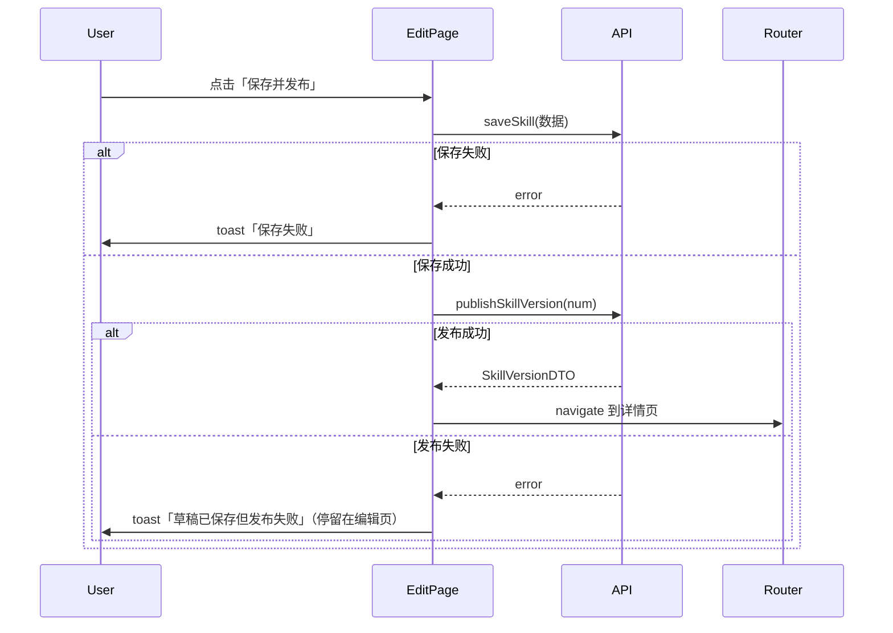

# AgentOps 平台优化（Iteration 1）技术方案

| 文档版本 | 日期 | 编写人 | 说明 |
|---------|------|--------|------|
| V1.0 | 2026-06-19 | 技术负责人 | 编辑空间按钮样式修复 + Skill 版本管理前端能力 技术方案初稿 |

> 配套 PRD：`doc/产品方案/2026-06-19_平台优化-PRD.md`
> 接口对照表：`doc/技术方案/2026-06-16_前后端接口对照表.md`
> 前端 API 封装：`frontend/src/api/skill.ts`

---

## 1. 目标与范围

### 1.1 目标

本次迭代为纯前端变更，包含两个需求：

1. **编辑空间按钮样式修复**：将 `SpaceEditPage.tsx` 底部 raw `<button>` 替换为 Ant Design `<Button>` 组件，统一全平台编辑页 UI 规范。
2. **Skill 版本管理前端能力补齐**：基于现有后端完整能力（`SkillVersionAggregate` 状态机、`SkillVersionCommandService`、已封装前端 API），新增 Skill 详情页、版本管理 Tab、版本发布/下架/派生/删除操作、编辑页「保存并发布」按钮、列表页版本信息列。

### 1.2 设计前问题对齐

| # | 问题 | 决策 |
|---|------|------|
| 1 | 部署架构 | 不变，纯前端变更 |
| 2 | 创建人字段 | Option A：仅展示时间，零后端改动 |
| 3 | 详情页路由 | `/spaces/:spaceId/skills/:skillNum`，参数名统一为 `:skillNum`；编辑路由 `:skillNum/edit` 不变 |
| 4 | 版本号校验 | 前端 SemVer 格式校验 + 后端重复校验 |
| 5 | 保存并发布失败行为 | 停留在编辑页 + toast 提示 |
| 6 | 权限判断 | 复用 `hasAdminRole()` 判断平台 ADMIN，暂不做空间级角色区分 |
| 7 | 版本列表分页 | 不分页（通常 <20） |
| 8 | 详情页 404 | 跳转列表页 + toast |
| 9 | 状态标签命名 | 版本用「草稿/生效/下架」 |
| 10 | 接口对照表 | 引用 `2026-06-16_前后端接口对照表.md` 说明接口复用关系 |

### 1.3 范围

| 范围 | 是否包含 | 变更类型 |
|------|----------|----------|
| 空间编辑页按钮样式修复 | 包含 | 替换 `<button>` 为 `<Button>` |
| Skill 详情页（含版本管理 Tab） | 包含 | 新增 `SkillDetailPage` |
| 版本管理 Tab 列表与操作 | 包含 | 新增版本操作按钮 + 确认弹窗 |
| 编辑页「保存并发布」按钮 | 包含 | 修改 `SkillEditPage` |
| 列表页版本信息列 + 详情入口 | 包含 | 修改 `SkillManagementPage` |
| 后端接口 | 不包含 | 完全复用现有接口 |
| 版本对比/Diff | 不包含 | 后续迭代 |
| Skill.MD 编辑器增强 | 不包含 | 后续迭代 |

---

## 2. 架构设计

### 2.1 应用架构

| 层 | 领域 | 包/文件 | 职责 |
|----|------|---------|------|
| frontend | pages | `pages/spaces/skills/SkillManagementPage` | 列表页：增加版本号列、「详情」入口 |
| frontend | pages | `pages/spaces/skills/SkillDetailPage`（新增） | 详情页：顶部关键信息 + Tab（基本信息/版本管理） |
| frontend | pages | `pages/spaces/skills/SkillEditPage` | 编辑页：增加「保存并发布」按钮 |
| frontend | pages | `pages/platform/spaces/SpaceEditPage` | 底部按钮替换为 `<Button>` 组件 |
| frontend | api | `api/skill.ts` | 复用现有版本操作 API（无新增） |
| frontend | routes | `App.tsx` | 新增 `/spaces/:spaceId/skills/:skillNum` 路由 |
| frontend | stores | `stores/authStore` | 复用 `hasAdminRole()` 判断权限 |
| backend | — | — | 无变更 |

**模块调用关系**：
- 前端页面 → 直接调用 `api/skill.ts` 中的现有 API 函数
- 所有版本操作对应关系已在对应对照表中（§3.2 Skill 版本 8 个接口）
- 无命令/查询区分（前端直接调用既有 API 封装，不涉及后端变更）

### 2.2 部署架构

部署架构不变，无新增应用/前端部署实例，复用现有部署架构。

✅ 自检通过。

---

## 3. Facade 层设计

本次无 Facade 层变更。

---

## 4. 领域层设计

本次无领域层变更。后端 `SkillVersionAggregate` / `SkillAggregate` 状态机与领域动作已完整（参见 `doc/技术方案/2026-06-13_Skill管理-技术方案.md` §4.2）。

✅ 自检通过。

---

## 5. 基础设施层设计

本次无基础设施层变更。所有后端 Repository/Factory/Gateway 实现已在 V1.3 中完成。

✅ 自检通过。

---

## 6. 应用层设计

本次无应用层变更。`SkillVersionCommandService` 的 `deriveDraft`/`publish`/`withdraw`/`delete` 已在 V1.3 中实现。

✅ 自检通过。

---

## 7. Adapter 层设计

本次无 Adapter 层变更。Skill 版本的 `SkillVersionCommandController` 和按 Skill 查询的 `SkillQueryController` 已在 V1.3 中实现。

### 接口复用关系（引用 `2026-06-16_前后端接口对照表.md`）

前端新增功能复用的既有后端接口（全部已在前端 `api/skill.ts` 中封装）：

| 操作 | 接口路径 | 方法 | 前端函数 |
|------|---------|------|---------|
| 查询版本列表 | `/api/skills/versions` | GET | `listSkillVersions` |
| 查询版本详情 | `/api/skills/version-get` | GET | `getSkillVersion` |
| 查询 Skill 详情 | `/api/skills/get` | GET | `getSkill` |
| 派生草稿 | `/api/skill-versions/derive-draft` | POST | `deriveSkillVersion` |
| 发布版本 | `/api/skill-versions/publish` | POST | `publishSkillVersion` |
| 下架版本 | `/api/skill-versions/withdraw` | POST | `withdrawSkillVersion` |
| 删除草稿 | `/api/skill-versions/delete-draft` | POST | `deleteSkillVersion` |

✅ 自检通过。

---

## 8. 数据库设计

本次无数据库变更。

✅ 自检通过。

---

## 9. 模块变更清单

### 需求一：编辑空间按钮样式修复

| 层 | 文件 | 变更类型 | 说明 | 对应 Skill |
|----|------|---------|------|-----------|
| frontend | `pages/platform/spaces/SpaceEditPage.tsx:212-228` | 修改 | 将 raw `<button>` 替换为 `<Button>`，加载态使用 `loading` prop | 前端开发师 |

### 需求二：Skill 版本管理前端能力

| 层 | 文件 | 变更类型 | 说明 | 对应 Skill |
|----|------|---------|------|-----------|
| frontend | `pages/spaces/skills/SkillDetailPage.tsx` | **新增** | 详情页：顶部关键信息 + Tab（基本信息 / 版本管理） | 前端开发师 |
| frontend | `pages/spaces/skills/SkillManagementPage.tsx` | 修改 | 增加版本号列、「详情」入口；名称/编码列跳转详情页 | 前端开发师 |
| frontend | `pages/spaces/skills/SkillEditPage.tsx` | 修改 | 增加「保存并发布」按钮；无草稿时 Alert 禁用编辑区 | 前端开发师 |
| frontend | `App.tsx` | 修改 | 新增路由 `/spaces/:spaceId/skills/:skillNum` → `SkillDetailPage` | 前端开发师 |
| frontend | `api/skill.ts` | 无变更 | 复用全部现有版本 API | — |

---

## 10. 代码分支命名

```
feature-20260619-platform-optimize
```

---

## 11. 实现顺序与依赖

实现顺序（纯前端，无层间依赖）：

```
1. SpaceEditPage 按钮样式修复（独立，无其他依赖）
2. SkillManagementPage 列表页增强（版本列 + 详情入口）
3. SkillDetailPage 详情页（新增页面 + Tab 结构）
4. SkillEditPage 编辑页增强（保存并发布按钮）
5. App.tsx 新增路由
```

---

## 12. 接口与数据契约

### 12.1 空间编辑页

无接口变更。

### 12.2 Skill 详情页

引用现有接口：

- `getSkill(num)` → `SkillDTO`：顶部关键信息（name/num/currentVersionNo/status）
- `listSkillVersions(skillCode)` → `SkillVersionDTO[]`：版本管理 Tab 列表数据

### 12.3 版本管理操作

| 操作 | 接口 | 入参 | 返回 | 前置校验 |
|------|------|------|------|---------|
| 发布 | `publishSkillVersion(num)` | 版本 num | `SkillVersionDTO` | 二次确认弹窗（提示旧版本自动下架） |
| 下架 | `withdrawSkillVersion(num)` | 版本 num | `SkillVersionDTO` | 二次确认弹窗（提示影响 Agent） |
| 派生 | `deriveSkillVersion(skillCode, sourceVersionCode, newVersionNo)` | Skill 编码 + 源版本编码 + 新版本号 | `SkillVersionDTO` | 弹窗输入新版本号，前端 SemVer 校验 |
| 删除 | `deleteSkillVersion(num)` | 版本 num | `boolean` | 二次确认弹窗（提示不可恢复） |

### 12.4 SkillDTO（引用现有）

| 字段 | 类型 | 说明 |
|------|------|------|
| num | string | 业务编码 |
| name | string | 名称 |
| status | `DRAFT\|EFFECTIVE\|WITHDRAWN` | 主体状态 |
| currentVersionNo | string? | 当前生效版本号（仅时间，无创建人） |

### 12.5 SkillVersionDTO（引用现有）

| 字段 | 类型 | 说明 |
|------|------|------|
| num | string | 版本业务编码 |
| skillCode | string | 所属 Skill 业务编码 |
| versionNo | string | 版本号 |
| status | `DRAFT\|EFFECTIVE\|WITHDRAWN` | 版本状态 |
| publishTime | string? | 发布时间 |
| withdrawTime | string? | 下架时间 |
| createTime | string | 创建时间 |

---

## 13. 其他

### 13.1 权限控制

复用 `authStore.hasAdminRole()` 判断平台 ADMIN 角色：

```typescript
// 前端判断 —— 仅平台管理员可见版本写操作按钮
const currentUser = useAuthStore((s) => s.currentUser);
const isAdmin = hasAdminRole(currentUser);
```

- `isAdmin = true`：显示全部版本操作按钮（发布/下架/派生/删除/编辑/保存并发布/编辑基本信息）
- `isAdmin = false`：版本管理 Tab 只读展示列表，无操作按钮列；基本信息 Tab 只读

### 13.2 版本状态 Tag 颜色

| 状态 | 颜色 | 对应 TSX |
|------|------|---------|
| 草稿 (DRAFT) | `default` 灰色 | `<Tag color="default">草稿</Tag>` |
| 生效 (EFFECTIVE) | `green` 绿色 | `<Tag color="green">生效</Tag>` |
| 下架 (WITHDRAWN) | `orange` 橙色 | `<Tag color="orange">下架</Tag>` |

### 13.3 版本号校验规则（前端）

```typescript
// SemVer 格式校验
const SEMVER_REGEX = /^\d+\.\d+\.\d+$/;
function isValidSemver(versionNo: string): boolean {
  return SEMVER_REGEX.test(versionNo);
}
```

派生弹窗中：
- 默认填充基于源版本号 PATCH+1（如 `1.2.0` → `1.3.0`）
- 前端实时校验格式，不合规则禁用确认按钮
- 后端 `domainValidate` 再做版本号重复校验

### 13.4 保存并发布失败行为



### 13.5 详情页 404 处理

`SkillDetailPage` 加载时调用 `getSkill(num)`：
- 成功 → 渲染页面
- 失败（包括 404 或无权限）→ `navigate` 回列表页 + `message.error('Skill 不存在或无权限访问')`

### 13.6 无草稿编辑页状态

`SkillEditPage` 编辑模式加载时检测 `versions.find(v => v.status === 'DRAFT')` 是否存在：
- 有草稿 → 正常渲染编辑区
- 无草稿 → 页面顶部显示黄色 Alert：「当前无 DRAFT 状态版本，无法编辑。请先在版本管理中派生新版本。」，编辑器和资源文件管理器禁用

---

## 14. 详细页面设计

### 14.1 SpaceEditPage 按钮替换

**变更位置**：`SpaceEditPage.tsx` 第 213-228 行

**变更前**：
```tsx
<Space>
  <button type="button" className="ant-btn ant-btn-default" onClick={() => navigate(listPath)} disabled={submitting}>
    <span>取消</span>
  </button>
  <button type="button" className="ant-btn ant-btn-primary" onClick={handleSubmit} disabled={submitting}>
    <span>{submitting ? '保存中…' : isEdit ? '保存' : '确定创建'}</span>
  </button>
</Space>
```

**变更后**：
```tsx
<Space>
  <Button onClick={() => navigate(listPath)} disabled={submitting}>
    取消
  </Button>
  <Button type="primary" onClick={handleSubmit} loading={submitting}>
    {isEdit ? '保存' : '确定创建'}
  </Button>
</Space>
```

需在文件顶部 import 中加入 `Button`（已引入 antd Space，需确保 Button 也在 import 中）。

### 14.2 SkillManagementPage 列表页增强

**变更位置**：`SkillManagementPage.tsx`

**变更内容**：
1. 已有「当前版本」列（`currentVersionNo`）无需增删
2. 操作列新增「详情」链接，位于「编辑」之前
3. 名称/编码列增加点击跳转详情页

```tsx
// 操作列渲染
<Space>
  <a onClick={() => navigate(`${r.num}`)}>详情</a>   {/* ← 新增 */}
  <a onClick={() => navigate(`${r.num}/edit`)}>编辑</a>
  {/* ... 原有启用/停用/删除 ... */}
</Space>
```

### 14.3 SkillDetailPage 详情页（新增）

**页面结构**：

```
┌────────────────────────────────────────────────┐
│ Breadcrumb: Skill 管理  /  银行卡号校验助手        │
├────────────────────────────────────────────────┤
│  银行卡号校验助手                                  │
│  编号：SK202606... [📋复制]    当前版本：1.2.0 [生效]│
├────────────────────────────────────────────────┤
│  [基本信息]  [版本管理]                            │
├────────────────────────────────────────────────┤
│  （Tab 内容区域）                                 │
└────────────────────────────────────────────────┘
```

**基本信息 Tab**：只读展示字段列表（name / description / num / currentVersionNo / tags / remark / createTime / updateTime）
- 管理员可见「编辑基本信息」按钮跳转编辑页

**版本管理 Tab**：
- 版本列表 Table（按 createTime 倒序）
- 列：版本号 / 版本编码 / 状态 / 发布时间 / 下架时间 / 创建时间 / 操作
- 草稿行操作：编辑（跳转编辑页）/ 发布（确认弹窗）/ 删除（确认弹窗）
- 生效行操作：修改（派生弹窗）/ 下架（确认弹窗）
- 下架行操作：以此版本新建（派生弹窗）
- 当前生效版本行背景高亮

### 14.4 SkillEditPage 编辑页增强

**变更位置**：`SkillEditPage.tsx` 底部按钮区（当前约 328-335 行）

**变更内容**：

```tsx
<Space>
  <Button onClick={() => navigate(listPath)} disabled={submitting}>
    取消
  </Button>
  <Button onClick={handleSave} loading={submitting}>
    保存
  </Button>
  {draftVersion && isAdmin && (                               {/* ← 新增 */}
    <Button type="primary" onClick={handleSaveAndPublish}      {/* ← 新增 */}
      loading={publishing}                                     {/* ← 新增 */}
    >                                                         {/* ← 新增 */}
      保存并发布                                               {/* ← 新增 */}
    </Button>                                                  {/* ← 新增 */}
  )}                                                          {/* ← 新增 */}
</Space>
```

**新增状态**：`publishing` (boolean)，区分保存和发布的 loading 状态

**新增方法 `handleSaveAndPublish`**：先执行 `handleSave` 逻辑（保存成功后获取草稿版本 num），再调用 `publishSkillVersion(num)`，成功后跳转详情页，失败时 toast 并停留在编辑页。

**无草稿提示**：编辑页加载时有 `draftVersion` 检测逻辑（已有 `useMemo`），无草稿时禁用编辑区和 Alert 已在现有代码中部分实现（`SkillEditPage.tsx:369:371`），需确认覆盖完整。

✅ 自检通过。